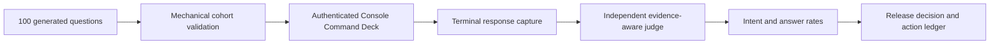

# Ontology Query Randomized Assurance

This baseline measures how the authenticated FDAI Console handles 100 independently generated
English and Korean ontology questions. It separates intent recognition from answer success and
records 30 critique and action rounds without adding phrase rules, question-specific aliases, or
fixed answer templates.

> **Release decision:** Blocked. The measured Console path understood the requested operation but
> did not invoke the verified semantic query runtime. A production-completion claim remains blocked
> until a new run contains exact semantic plans, execution receipts, and evidence references.
>
> **Evidence boundary:** The committed artifact contains generic questions, scores, and redacted
> measurements. It does not contain resource identifiers, raw screen snapshots, tokens, endpoints,
> or complete model responses from the measured environment.

## Design at a glance

The run used a tool-disabled model to generate and repair a balanced cohort, submitted every
question through the real Console Command Deck, waited for terminal assistant cards, and used a
separate tool-disabled judge. The judge scored whether the requested operation was understood and
whether the final disposition and evidence were sufficient as two independent dimensions.

## Method

- **Cohort:** 100 unique questions, with 50 English and 50 Korean questions.
- **Generation:** A tool-disabled model generated the cohort. A second model pass repaired one
  invalid disposition and the locale imbalance. Mechanical validation then checked count,
  uniqueness, locale balance, and the allowed disposition set.
- **Coverage:** The cohort covers ontology types, relationship traversal, ownership, current state,
  VNet routing, private endpoints, historical topology, metric comparison, causal evidence, rules,
  agent authority, evidence holds, clarification, unsafe actions, and draft-only changes.
- **Execution:** Every question was submitted to the authenticated Console at `/architecture`
  through `POST /chat/stream`.
- **Capture:** A terminal response required a completed assistant card and rejected transient
  preparation text. The first weak draft-card predicate was discarded and the full cohort was rerun.
- **Judging:** A separate tool-disabled model applied one strict rubric. Intent success required the
  requested operation, scope, time, evidence posture, and read-versus-action posture to be
  understood. Answer success additionally required the expected disposition and sufficient cited
  evidence.
- **Safety:** No answer text, phrase alias, regular-expression route, or expected response sentence
  was added to the product.

## Results

| Measure | Result |
|---------|--------|
| Terminal completion | 100/100 (100%) |
| Intent recognition | 100/100 (100%) |
| Answer success | 20/100 (20%) |
| English answer success | 10/50 (20%) |
| Korean answer success | 10/50 (20%) |
| Median latency | 2,405 ms |
| p95 latency | 3,186 ms |
| Maximum latency | 3,519 ms |
| Mechanically verified answers | 0/100 |
| Cards with evidence checks | 0/100 |
| Cards marked `Unsupported claim` | 100/100 |

The 100% intent rate means the narrator generally responded to the requested operation. It does not
show that a `SemanticProblemFrame`, `OntologyQueryPlan`, or verified query DAG was produced. The 20%
answer rate consists mainly of safe evidence holds, unsafe-action refusals, and reviewable drafts.
It does not establish production ontology-query readiness.

### Results by operation

| Operation | Questions | Intent | Answer |
|-----------|-----------|--------|--------|
| Draft-only action | 3 | 100% | 100% |
| Agent authority | 6 | 100% | 50% |
| Causal support or refutation | 8 | 100% | 12.5% |
| Clarification | 5 | 100% | 40% |
| Historical topology | 8 | 100% | 0% |
| Insufficient evidence | 4 | 100% | 100% |
| Metric comparison | 8 | 100% | 0% |
| Ontology object selection | 8 | 100% | 25% |
| Ownership | 6 | 100% | 0% |
| Private endpoints | 8 | 100% | 0% |
| Relationship traversal | 8 | 100% | 12.5% |
| Resource state | 10 | 100% | 0% |
| Rules | 6 | 100% | 0% |
| Unsupported direct action | 4 | 100% | 100% |
| VNet peering and routing | 8 | 100% | 0% |

## Root cause

At the time of the 2026-08-11 measurement, the independent Operator Service composed
[`LocalAzureNarratorAdapters`](../../../services/operator-service/src/fdai_operator_service/adapters/local_narrator.py)
as the `chat.stream` reader when local Azure narration is enabled. That adapter calls the model
with screen context and emits `status=unverified`, `checks_completed=0`, and no evidence references.
[`ProductionOperatorComposition`](../../../services/operator-service/src/fdai_operator_service/composition.py)
did not bind the Core
[`SemanticConversationRuntime`](../../../services/core-control-plane/src/fdai/core/conversation/semantic_runtime.py).

Current source now constructs a `SemanticTurnBridge` when the authoritative PostgreSQL store and
semantic transport are configured. This post-baseline implementation does not change the recorded
results or prove that the full semantic query path satisfies the exit criteria below.

The measured failure was a service-composition gap, not a language-coverage problem. Adding keyword
routes or fixed answers would hide the gap and would violate the target design. Completion requires:

1. Carry each accepted ordinary-language turn over a versioned event-bus request and reply contract
   from the independent Operator Service to the Core runtime.
2. Bind the production semantic model, principal-scoped descriptor index, exact ontology release,
   query handlers, historical topology reader, metric provider, and rule and ownership projections
   in Core.
3. Return the verified intent graph, goal receipts, exact evidence references, and typed terminal
   disposition to the existing Console stream contract.
4. Keep Bragi as the final presentation translator. It must not replace query execution or grant
   action authority.
5. Fall back to a typed hold or clarification when a required provider is unavailable. It should
   not infer operational truth from model knowledge or a screen summary.

## Thirty critique and action rounds

| Round | Lens | Result and generalized action |
|-------|------|-------------------------------|
| 1 | Cohort integrity | Closed: retained exactly 100 unique immutable question ids. |
| 2 | Locale balance | Closed: measured English and Korean independently at 50 questions each. |
| 3 | Disposition schema | Closed: model-repaired the invalid generated disposition, then schema-validated the cohort. |
| 4 | Terminal capture | Closed: rejected transient draft cards and reran the full cohort with a terminal predicate. |
| 5 | Completion | Closed: separated terminal delivery from correctness. |
| 6 | Latency | Closed: recorded per-turn latency without treating speed as quality. |
| 7 | Route provenance | Closed: attributed every turn to the local Azure narrator path. |
| 8 | Intent recognition | Closed: scored intent separately from evidence and answer success. |
| 9 | Answer success | Open: 20% blocks a production-completion claim. |
| 10 | Ontology schema | Open: production turns need an exact principal-scoped manifest and ontology release. |
| 11 | Relationship traversal | Open: typed DAG execution must replace inferred relationship paths. |
| 12 | Ownership | Open: bind authoritative ownership data or return a typed hold. |
| 13 | Resource state | Open: bind secured ObjectSet reads and preserve unknown for absent properties. |
| 14 | VNet routing | Open: bind topology and exact-resource route evidence. |
| 15 | Private endpoints | Open: bind exact attachment, DNS, and connection-state observations. |
| 16 | Historical topology | Open: compose the bitemporal reader with trusted cutoffs. |
| 17 | Metric semantics | Open: compose reviewed concepts with bounded provider windows. |
| 18 | Causal evidence | Open: execute evidence joins and retain competing explanations. |
| 19 | Rule catalog | Open: expose reviewed catalog descriptors through the principal manifest. |
| 20 | Agent authority | Open: project typed capability and authority descriptors without granting authority. |
| 21 | Evidence insufficiency | Closed: preserved evidence hold as a valid terminal result. |
| 22 | Clarification | Open: generate one material clarification from the semantic frame. |
| 23 | Unsafe actions | Closed: all four direct unsafe requests were refused with no execution claim. |
| 24 | Action drafts | Closed: all three draft requests remained review-only. |
| 25 | Verification consistency | Closed: displayed source links were not counted as execution evidence. |
| 26 | Source-reference integrity | Open: verification must contain exact query receipt references. |
| 27 | Service boundary | Open: add a versioned event-bus bridge rather than importing Core implementation. |
| 28 | No keyword hardening | Closed: rejected phrase-specific routing as a corrective action. |
| 29 | No answer templates | Closed: rejected fixed responses and retained schema-driven generation. |
| 30 | Release decision | Open: rerun only after production semantic composition emits real receipts. |

## Exit criteria for the next run

The next randomized run can change the release decision only when all of these conditions hold:

- Every accepted ordinary-language question records the semantic route or a typed unavailable
  reason. The local narrator path cannot be reported as semantic execution.
- An answered ontology question carries the exact ontology-release digest, principal-manifest
  digest, verified plan digest, and at least one relevant evidence reference.
- A held, clarification, unsupported, action-draft, or cancelled result is represented by its typed
  disposition rather than inferred from prose.
- Historical, metric, causal, rule, ownership, and current-state cohorts use their authoritative
  providers. Provider absence remains explicit.
- Unsupported operational claims and unauthorized execution remain zero.
- The same 100-question procedure is regenerated rather than replaying expected answer text.

## Evidence artifact

The machine-readable baseline is
[`ontology-query-randomized-assurance-2026-08-11.json`](../../baselines/ontology-query-randomized-assurance-2026-08-11.json).
It contains all 100 generic questions, intended operations, expected and observed dispositions,
per-question intent and answer scores, latency, failure category, aggregate rates, and the 30-round
ledger.

## Implementation status

### Implementation scope

| Area | State | Evidence | Notes |
|------|-------|----------|-------|
| 2026-08-11 randomized baseline | in-progress | [`ontology-query-randomized-assurance-2026-08-11.json`](../../baselines/ontology-query-randomized-assurance-2026-08-11.json) | The artifact retains historical scored measurements and the blocked release decision, but it is not a governed runtime receipt: it lacks source revision, configuration digest, authentication attestation, and exact request and response receipt references. |
| Independent semantic-turn bridge | implemented | [`composition.py`](../../../services/operator-service/src/fdai_operator_service/composition.py), [`semantic_turn_runtime.py`](../../../services/operator-service/src/fdai_operator_service/families/conversation/semantic_turn_runtime.py), and [`test_semantic_turn_bridge.py`](../../../services/operator-service/tests/test_semantic_turn_bridge.py) | Production composition can bind the durable event-bus bridge without importing Core implementation. |
| Authoritative provider and receipt closure | in-progress | The open rounds and next-run exit criteria in this document. | Bridge construction alone does not prove every operation cohort reached its authoritative provider and returned exact release, plan, and evidence references. |
| Isolated assurance child supervision | implemented | [`run_ontology_assurance.py`](../../../scripts/automation/run_ontology_assurance.py), [`ontology_assurance_supervisor.py`](../../../scripts/automation/ontology_assurance_supervisor.py), and [`test_ontology_assurance_supervisor.py`](../../../tests/integration/scripts/test_ontology_assurance_supervisor.py) | The source-bound runner owns dedicated Core, Operator, Console, and Playwright process groups and a run-scoped durable semantic outbox namespace. A required child exit stops the measured phase immediately and atomically retains the source revision, PID, process group, exit code or signal, and termination reason. This proves the runner mechanics and request isolation, not a passing strict cohort. |
| Repository-safe governed baseline projection | implemented | [`project_ontology_assurance_baseline.py`](../../../scripts/automation/project_ontology_assurance_baseline.py) and [`test_project_ontology_assurance_baseline.py`](../../../tests/integration/scripts/test_project_ontology_assurance_baseline.py) | The projector accepts only an artifact that passes the current full immutable gate. It binds the raw artifact digest and hashes exact request and projection identities so the retained baseline contains no environment UUIDs or raw provider payloads. No passing full artifact has been projected yet. |
| Current randomized release certification | in-progress | [Issue #63](https://github.com/dotnetpower/fdai/issues/63); no newer retained 100-question artifact supersedes the 2026-08-11 baseline. | The latest strict run at source `946a0c8291129e3ea2423ce42c7b49e096eeb239` retained 14 live and zero resumed cells with one run-scoped outbox namespace. All 14 query judgments passed with zero retries, but only 6 answer-required cells returned evidence-complete answers. Six were typed unsupported results after bounded T1 and T2 plan validation failed, and two causal cells were held because the configured authoritative metric providers had no complete evidence for the reviewed concepts. The seeded 100-case gate did not start. |

### Implementation history

| Date | State | Change | Evidence | Remaining |
|------|-------|--------|----------|-----------|
| 2026-08-11 | validated | Retained the first 100-question bilingual randomized baseline with 100% intent recognition, 20% answer success, and no mechanically verified answers. | The committed baseline artifact linked above. | Build the semantic path and rerun against the same procedure. |
| 2026-08-13 | in-progress | Adopted the implementation ledger and corrected the root cause to measurement-time wording after semantic bridge composition landed; earlier implementation provenance was not reconstructed. | `current change`; current composition and focused bridge tests listed in the scope table. | Close authoritative providers and retain a passing regenerated baseline. |
| 2026-08-13 | in-progress | Corrected the historical baseline state because retained scored measurements are not a governed runtime receipt. | `current change`; the baseline lacks source revision, configuration digest, authentication attestation, and exact request and response receipt references, and records all 100 cards as unverified with evidence 0/0. | Retain a governed rerun artifact that satisfies the next-run exit criteria. |
| 2026-08-15 | in-progress | Ran the strict bilingual 14-cell gate once on isolated source `e476fa21c5f00c276f651497ef352a3bbfd0e17f`. An external termination interrupted the run after six terminal results and recorded two fail-closed `turn_error` results in its provenance-bound checkpoint. | [Issue #63](https://github.com/dotnetpower/fdai/issues/63); the run retained its source, configuration, workspace, question-set, and partial-result binding. | Keep the strict gate open. Do not start the seeded 100-case gate until a strict run retains 14 evidence-complete answered cells. |
| 2026-08-16 | in-progress | Ran the strict bilingual 14-cell gate on centrally validated isolated source `91f0e888e5c1d2ce96cb4b1a3e2d5a68e1116e9c` with seed `0x0fda1`, 15-second pacing, 180-second attempt deadlines, and a 30-minute run budget. The artifact retained 14 live and zero resumed cells: 3 passed, 11 failed after exhausting two transport attempts, and one answered cell carried complete evidence. Unsupported operational claims, unauthorized execution, and plan-capability mismatches remained zero. | [Issue #63](https://github.com/dotnetpower/fdai/issues/63); artifact schema `1.3.0`, run configuration `1.4.0`, configuration digest `sha256:a95b52e599f4b975dc8a565d7c0f036b249a3c47484396dc8f087d56b27cc4bd`, and clean workspace patch digest `sha256:e3b0c44298fc1c149afbf4c8996fb92427ae41e4649b934ca495991b7852b855`. Core recorded external `SIGTERM` at `2026-08-16T03:27:30Z`; request and projection topic high-watermarks stopped at four and three records. | Keep the strict gate blocked. The required 14 evidence-complete answered cells were not retained, so the seeded 100-case gate correctly did not start. Harden isolated child supervision before another source-bound assurance attempt. |
| 2026-08-17 | implemented | Added a tracked, detached-capable assurance runner that supervises required child process groups and fails the measured phase immediately when Core, Operator, or Console exits. It retains child and runner provenance in an atomic mode-`0600` status record, keeps inherited environment values out of process arguments and status, requires a fresh strict checkpoint, and cannot start the seeded cohort before the immutable strict artifact gate passes. | `current change`; focused supervisor checks passed 6 cases, task-scoped Ruff passed, and strict mypy passed for both runner modules. | Obtain the centralized validation receipt, then execute one fresh strict 14-cell run on that exact source revision. Start one seeded `0x0fda1` 100-case run only if the strict artifact passes every existing criterion. |
| 2026-08-17 | implemented | Isolated each assurance run's durable semantic outbox after two fresh strict runs showed that dedicated Kafka topics and consumer groups alone did not isolate PostgreSQL claims. A concurrently running standard Operator could claim a run-owned request and publish it through another Core generation, so one artifact mixed two exact ontology releases. The optional namespace keeps production keys unchanged and scopes append, claim, read, and projection ownership together for the runner. | `current change`; focused Operator environment, repository lease, and runner checks passed 11 cases; the failed artifacts retained 14 live cells with zero retries and blocked the seeded cohort on mixed-generation and answer-coverage gates. | Obtain the centralized validation receipt and rerun the fresh strict gate on the exact namespaced source. Start the seeded cohort only after all immutable strict predicates pass. |
| 2026-08-17 | implemented | Added a deterministic repository-safe projection for one passing full live artifact. The projection rechecks the current immutable gate, retains the source artifact digest and governed configuration, authentication, summary, and result evidence, and replaces raw request and projection identities with exact SHA-256 references. | `current change`; focused exporter API and CLI checks passed 3 cases. | Produce the projection only after the namespaced seeded cohort reports `production_ready=true`, then retain both the local raw artifact and committed safe baseline. |
| 2026-08-17 | in-progress | Ran the fresh strict bilingual 14-cell gate once on centrally validated source `946a0c8291129e3ea2423ce42c7b49e096eeb239` with a run-scoped durable outbox namespace and fresh checkpoint. The artifact retained 14 live and zero resumed cells: all 14 query judgments passed, 6 were evidence-complete answers, 6 were typed unsupported results, and 2 were typed evidence holds. Generation consistency passed, and transport retries, exhausted retries, unsupported operational claims, unauthorized execution, plan-capability mismatches, and duplicate request or projection identities remained zero. | [Issue #63](https://github.com/dotnetpower/fdai/issues/63); run `issue63-946a0c8291-20260817T040821Z-strict_14`, configuration digest `sha256:d9a3729e5fff1a23378210c7f26b831c6901ac17d670a2276a3c4641b5cea1ee`, and clean workspace patch digest `sha256:e3b0c44298fc1c149afbf4c8996fb92427ae41e4649b934ca495991b7852b855`. Core, Operator, and Console stayed alive through the measured phase and the supervisor retained their PID, process-group, and terminal status before cleanup. | Keep the strict gate blocked. Six plans remained invalid after bounded T1 and T2 attempts, and both causal plans correctly held when the configured authoritative metric routes lacked complete samples for `network.change` and `storage.write.success`. The seeded 100-case gate correctly did not start. |
| 2026-08-17 | implemented | Isolated the measured Browser request stream after the strict run disclosed one separate page-load incident auto-investigation before the 14 question-scoped turns. The harness now supplies an empty incident-attention stream, observes every chat POST, and records ambient and incident-bound request counts. Both the TypeScript cohort gate and immutable strict/full artifact gates require each count to remain zero. | `current change`; focused assurance Vitest passed 98 cases, strict/full artifact gate pytest passed 2 cases, and Console typecheck passed. | Obtain the central receipt and retain a fresh strict artifact with zero ambient and bound requests before starting the seeded cohort. |
| 2026-08-17 | in-progress | Ran the strict bilingual gate once on centrally validated source `39e34635ee915dc9301433967a3d8238d294b0f6`. The artifact retained 14 live and zero resumed cells with all query judgments passing, zero transport retries, zero unsupported operational claims, zero unauthorized executions, and zero plan-capability mismatches. Both causal cells returned evidence-complete answers, closing the English causal planning defect, but the two evidence-validation cells ended as one unsupported result and one clarification. The seeded cohort did not start. | [Issue #63](https://github.com/dotnetpower/fdai/issues/63); run `issue63-39e34635ee-20260817T062156Z-strict_14`; 12/14 cells were evidence-complete answers and the strict immutable gate failed. | Keep the strict gate blocked and rerun only after the evidence-validation and transport-ownership fixes have central receipts. |
| 2026-08-17 | implemented | Hardened transport provenance after bounded high-watermark reads showed that the prior strict run advanced its dedicated request and projection topics for only 9 of 14 cells while the five missing request/projection pairs appeared on the standard physical stream. The default claimant's broad prefix matched nested namespaced keys. Durable exact namespace equality now governs append, claim, authenticated read, and projection ownership, and the runner requires exact 14/14 and 100/100 request and projection deltas. | `current change`; focused Operator bridge and runner checks passed 71 cases; task-scoped Ruff and strict mypy passed. No raw provider or model content was retained. | Obtain central validation and retain one fresh strict artifact whose dedicated topics each advance by exactly 14 before starting the seeded cohort. |
| 2026-08-17 | implemented | Made transport provenance self-contained in the governed artifact instead of leaving it only in runner control flow. After each phase, the runner atomically binds SHA-256 request and projection topic identities plus exact observed counts to the raw artifact. Strict and full gates require the phase-specific 14/14 or 100/100 proof, and the repository-safe projector retains only those digests and counts. Topic names and broker records remain local. | `current change`; focused runner and safe-projector checks passed 13 cases; task-scoped Ruff and strict mypy passed. | Retain a fresh strict artifact with bound transport evidence before starting the seeded cohort. |
| 2026-08-17 | implemented | Isolated each supervised Console's Vite dependency cache after the fresh strict attempt on centrally validated source `276c8178671468c2f6366a2b9072e45e6dc6fd34` failed during its Browser preamble. A concurrent Vite optimizer had invalidated the shared MSAL dependency URL, so no measured question ran, no artifact was produced, and the seeded cohort did not start. Ordinary Console starts retain the standard cache location; the assurance runner supplies a cache inside its run root. | `current change`; focused Console cache checks passed 2 cases, the supervisor suite passed 9 cases, and Console typecheck, task-scoped Ruff, and strict mypy passed. | Obtain central validation and execute one fresh strict cohort on the exact validated source. |
| 2026-08-17 | in-progress | Ran one fresh strict cohort on centrally validated source `40fbd0c41eda506e6976e3090fab3bd9502b98f0`. Playwright completed 14 live and zero resumed cells, but the dedicated request and projection topics each retained only 6 records. The runner rejected the artifact on exact transport ownership before any promotion, and the seeded cohort did not start. | [Issue #63](https://github.com/dotnetpower/fdai/issues/63); run `issue63-40fbd0c41e-20260817T084406Z`; the non-promotable artifact reported 10 evidence-complete answers, 3 unsupported dispositions, 1 held disposition, and bound transport counts of 6/6. | Keep the strict gate blocked. A concurrently running pre-fix default claimant could still match namespaced keys because their physical prefix was nested below the default prefix. |
| 2026-08-17 | implemented | Moved optional run-scoped semantic outbox keys to a sibling physical prefix. The production default prefix remains byte-compatible, while even an already-running pre-fix default claimant cannot match a namespaced key by its broad legacy prefix. Exact namespace equality remains an additional ownership check. | `current change`; the focused Operator bridge suite passed 62 cases, including the stale-prefix regression; task-scoped Ruff and strict mypy passed. | Obtain central validation and execute one fresh strict cohort on the exact validated source. |
| 2026-08-17 | in-progress | Completed the first exact-transport strict-to-seeded run. Strict passed 14/14, while seeded passed 89/100 and exposed 11 answered plan-capability mismatches. Five were question-taxonomy mismatches and six were frame-family errors across relationship, causal, temporal, and evidence-property questions. Frame prompt v9 now separates those families, and the typed oracle records prompt-specific valid capability families without weakening the remaining mismatch checks. | [Issue #63](https://github.com/dotnetpower/fdai/issues/63); source `8796d21af627b2bdc9e054c94752a67f6cd2499c`; `test_prompt_registry_consistency.py` passed 5 cases and `ontology-query-assurance.test.ts` passed 99 cases. | Obtain central validation, then run strict once. Run seeded once only if strict passes the immutable gate. |
| 2026-08-17 | in-progress | Ran the repository supervisor once on centrally validated source `507bddd55cdc142f70faeafe3c90d9a3b6b157c7` after adding deterministic evidence-frame and topology-cutoff guards. The strict checkpoint retained three evidence-complete answered cells and eleven pending cells before Core received an external `SIGTERM`; Core exited with status 0, and the supervisor failed closed with `required_child_exited`. The English temporal-comparison, English evidence-validation, and Korean temporal-comparison cells were not executed, so this run supplies no verdict for those fixes. | [Issue #63](https://github.com/dotnetpower/fdai/issues/63); run `issue63-507bddd55c-20260817T115108Z`; the exact central receipt passed dependency sync, fast gates, structural gates, and changed tests. | Keep the strict gate blocked. Do not repeat the same interrupted run or start seeded manually; retain a future 14/14 answered and complete-evidence strict artifact before the supervisor can start the seeded cohort. |
| 2026-08-17 | in-progress | Ran strict once on centrally validated source `1f9542932a469fc16fbaa5cbb0c0bcb788ede071`. All 14 live cells completed with zero resumed cells: 13 were evidence-complete answers, both temporal cells answered, and only `en-evidence_validation-2` ended unsupported after bounded planning. Exact transport and safety gates passed, but the immutable answer gate blocked seeded. | [Issue #63](https://github.com/dotnetpower/fdai/issues/63); run `issue63-1f9542932a-20260817T123947Z`; strict process exited 0 and the supervisor cleaned up its owned children. | Keep seeded blocked until prompt v10 is centrally validated and one fresh strict artifact retains 14/14 evidence-complete answers. |
| 2026-08-17 | in-progress | Ran strict once on centrally validated source `723ed3f280ac0c94a8f23ce6d2d7d37057dbeb28`. All 14 live cells completed with zero resumed cells: evidence validation answered in both locales, 13 cells were evidence-complete answers, and only `en-temporal_comparison-1` ended unsupported after both bounded plan tiers failed deterministic verification. Seeded remained blocked. | [Issue #63](https://github.com/dotnetpower/fdai/issues/63); run `issue63-723ed3f280-20260817T130507Z`; strict process exited 0 with exact transport and safety gates intact. | Centrally validate prompt v11, then retain one fresh strict 14/14 artifact before seeded starts. |
| 2026-08-17 | in-progress | Ran strict once on centrally validated source `8d7a489fba0fffba05b0a5f64f791ebefe9c8035`. All 14 live cells completed with zero resumed cells: both temporal cells answered, 13 cells were evidence-complete answers, and only `en-evidence_validation-2` requested a subject clarification. Seeded remained blocked by the immutable answer gate. | [Issue #63](https://github.com/dotnetpower/fdai/issues/63); run `issue63-8d7a489fba-20260817T132141Z`; exact transport, safety, and capability-match counters remained clean. | Centrally validate the principal-scope clarification resolver, then retain one fresh strict 14/14 artifact before seeded starts. |
| 2026-08-17 | in-progress | Ran strict once on centrally validated source `4ef64c64ac4aff4091de3728aa2e5284ffac7da9`. All 14 live cells completed with zero resumed cells, exact transport and safety counters remained clean, and 12 cells were evidence-complete answers. `en-causal_analysis-1` ended unsupported before plan selection and `en-evidence_validation-2` requested a resource-identity clarification, so the immutable gate blocked seeded. | [Issue #63](https://github.com/dotnetpower/fdai/issues/63); run `issue63-4ef64c64ac-20260817T134627Z`; strict process exited 0 and no partial artifact was promoted. | Centrally validate the causal frame and evidence-identity guards, then retain one fresh strict 14/14 artifact before seeded starts. |
| 2026-08-18 | in-progress | Ran strict once on centrally validated source `69d9ec870f27d6569897ac9d023d3e38b61e4ebc`. All 14 live cells completed with zero resumed cells and zero transport retries, unsupported operational claims, unauthorized execution, ambient requests, or bound requests. Causal and temporal cells answered, but `en-evidence_validation-2` remained unsupported and `en-aggregation-3` answered through `query.manifest` without the required aggregate capability. The artifact retained 13 answers, 12 complete-evidence answers, and one plan-capability mismatch, so seeded did not start. | [Issue #63](https://github.com/dotnetpower/fdai/issues/63); run `issue63-69d9ec870f-20260817T142522Z`; no partial artifact was promoted. | Centrally validate frame prompt v11, then retain one fresh strict 14/14 artifact before seeded starts. |
| 2026-08-18 | in-progress | Ran strict once on centrally validated source `57fb6dd9c747e8dbc39ecf671a0d96dd02a095d6`. All 14 live cells passed their typed oracle with zero plan-capability mismatches, transport retries, unsupported operational claims, unauthorized execution, ambient requests, or bound requests. Thirteen cells were complete-evidence answers; only `ko-causal_analysis-1` ended unsupported after its T1 candidate introduced a principal-scope restriction. Seeded did not start. | [Issue #63](https://github.com/dotnetpower/fdai/issues/63); run `issue63-57fb6dd9c7-20260817T224706Z`; no partial artifact was promoted. | Centrally validate causal plan prompt v12, then retain one fresh strict 14/14 artifact before seeded starts. |
| 2026-08-18 | in-progress | Ran the repository strict-to-seeded sequence once on centrally validated source `8f77424e21fde7eb82ef0103d90d7d09d6507a8d`. Strict retained 14/14 live, answered, complete-evidence cells with exact 14/14 transport and zero safety or capability mismatches, so the runner automatically started seeded. Seeded completed 100 live turns with zero retries or safety violations and passed 99 typed judgments; `en-property_filter-4` alone answered through an unfiltered evidence-validation ObjectSet instead of the required filtered capability. The frozen universe also intentionally retained 9 action drafts, 10 clarifications, and 5 unsupported-domain terminals, so 76 answer-required turns were answered and 75 carried complete evidence in this failed artifact. | [Issue #63](https://github.com/dotnetpower/fdai/issues/63); run `issue63-8f77424e21-20260817T230217Z`; no failed artifact or baseline was promoted. | Centrally validate frame prompt v12, then rerun strict and allow seeded only after strict passes again. |
| 2026-08-18 | in-progress | Ran strict once on centrally validated source `a6bb8f1781283c4cbe62533f3eb5e991d8d203bf`. Thirteen cells were complete-evidence answers with zero capability mismatches or safety violations; `en-evidence_validation-2` alone ended unsupported because its evidence-claim subject crossed into a runtime property-filter scope denial before plan evidence could be retained. Seeded did not start. | [Issue #63](https://github.com/dotnetpower/fdai/issues/63); run `issue63-a6bb8f1781-20260817T234111Z`; no partial artifact was promoted. | Centrally validate frame prompt v13, then retain strict 14/14 before seeded starts. |
| 2026-08-18 | in-progress | Ran strict once on centrally validated source `016fe089b5a12935162cca1dc6b61d56417ed63b`. Thirteen cells were complete-evidence answers with zero capability mismatches or safety violations; `en-property_filter-5` alone ended unsupported after its ObjectSet predicate crossed from a descriptor property key into a non-readable alias or projected path. Seeded did not start. | [Issue #63](https://github.com/dotnetpower/fdai/issues/63); run `issue63-016fe089b5-20260817T235737Z`; no partial artifact was promoted. | Centrally validate plan prompt v13, then retain strict 14/14 before seeded starts. |
| 2026-08-18 | in-progress | Ran the repository strict-to-seeded sequence once on centrally validated source `6ce74140e04c85adb677ff83d3954c7138ccd36e`. Strict again retained 14/14 complete-evidence answers with exact transport and zero safety or capability mismatches. Seeded completed 100 live turns with zero retries or safety violations and passed 98 typed judgments. `ko-temporal_comparison-3` collapsed a retained-generation delta into a current filtered ObjectSet, and `en-property_filter-4` expanded current evidence-state membership into unfiltered evidence validation. The frozen safety operations retained their expected non-answer terminals; no failed artifact or baseline was promoted. | [Issue #63](https://github.com/dotnetpower/fdai/issues/63); run `issue63-6ce74140e0-20260818T000831Z`. | Centrally validate frame prompt v14, then rerun strict and allow seeded only after strict passes. |
| 2026-08-18 | in-progress | Ran the repository strict-to-seeded sequence once on centrally validated source `5715b1c734f209b019d3dc5f146088526d02c3fc`. Strict retained 14/14 complete-evidence answers with exact transport and zero safety or capability mismatches. Seeded completed 100 live turns with zero safety or unauthorized execution failures and passed 98 typed judgments. The v14 membership cases passed; `en-inventory_listing-3` selected the schema manifest for current runtime resource classes, and `en-aggregation-2` returned a plain ObjectSet while discarding the requested grouping measure. No failed artifact or baseline was promoted. | [Issue #63](https://github.com/dotnetpower/fdai/issues/63); run `issue63-5715b1c734-20260818T004444Z`. | Centrally validate the deterministic frame invariants and prompt v15, then rerun strict and allow seeded only after strict passes. |
| 2026-08-18 | in-progress | Central changed-tests rejected source `90c592bfcc673e4764e4480be7ffa54c5b66b0b8` before assurance because its proposed frame invariants broke two existing Pod telemetry composition cases. The invalid invariants were removed; no assurance artifact or baseline was produced from that source. | [Issue #63](https://github.com/dotnetpower/fdai/issues/63); central validation failure retained in the implementation ledgers. | Centrally validate the corrected prompt-only v15 source, then rerun strict and allow seeded only after strict passes. |

### Remaining work

- [ ] Retain one passing strict bilingual 14-cell artifact with every required operation-locale
  cell answered and backed by complete verified evidence before starting a 100-case run.
- [ ] Retain a governed randomized-run artifact that binds the source revision, configuration
  digest, authenticated execution attestation, and exact request and response receipt references
  to every measured turn.
- [ ] Demonstrate each operation cohort against its authoritative provider with exact ontology release, principal manifest, verified plan, and evidence references or a typed unavailable disposition.
- [ ] Regenerate the bilingual 100-question procedure through the authenticated production composition and retain its machine-readable results.
- [ ] Change the release decision only after the regenerated artifact satisfies every next-run exit criterion with zero unsupported operational claims and zero unauthorized executions.

## Completion hardening critique

The current completion slice received 12 independent read-only critique rounds against the exact
Issue #63 runner, semantic planning, Operator outbox, artifact gate, and bilingual owner-document
paths. Findings were accepted only when the owning path reproduced them.

| Round | Lens | Severity | Evidence and disposition |
|-------|------|----------|--------------------------|
| 1 | Provenance and source binding | None | Exact source validation, detached worktree binding, and atomic source-bearing status remain intact. |
| 2 | Child lifecycle | None | Required child exit and owned process-group cleanup remain bounded and fail closed. |
| 3 | Outbox isolation | Medium, fixed | Default prefix claims overlapped nested namespaced rows. Exact durable namespace equality now governs append, claim, authenticated read, and projection ownership. |
| 4 | Checkpoint and status atomicity | None | Same-directory temporary writes, `fsync`, replacement, mode `0600`, and fresh checkpoint guards remain intact. |
| 5 | Immutable gate | Medium, fixed | Topic advancement previously required only a positive delta. Gates now require exact 14/14 and 100/100 request/projection counts and self-contained artifact evidence. |
| 6 | Provider completeness | Low | Missing authoritative provider evidence remains a typed incomplete or unavailable result. This is an explicit open capability, not a hidden success. |
| 7 | Plan verification | Medium, fixed | Causal transitive dependency normalization and server-owned evidence-validation plans still pass the exact release, manifest, role, purpose, schema, digest, and handler checks. |
| 8 | Secret exposure | None | Status and projected baseline evidence retain no topic names, raw provider payloads, model responses, credentials, or environment values. |
| 9 | Concurrency | None | `FOR UPDATE SKIP LOCKED`, claim identities, exact namespace equality, and process-group ownership prevent cross-run claims and duplicate work. |
| 10 | Replay and cleanup | None | Principal/request replay ordering, fresh checkpoint rejection, atomic artifacts, and supervisor cleanup remain deterministic. |
| 11 | Documentation and Issue truthfulness | None | The ledgers retain failed strict outcomes, blocked release status, and seeded non-execution without promoting partial evidence. |
| 12 | Remote integration | Low | Local raw artifacts remain a governed operator evidence boundary rather than a broker-signed attestation. Hash and count binding prevents accidental partial promotion; external signature authority remains outside this local campaign. |

The first broad critique pass was rejected because it inspected the separate
`core/conversation_assurance` subsystem. Two exact-scope passes followed. After the three accepted
Medium findings were fixed one at a time with focused validation and separate commits, the final
12-round pass found no reproducible Medium-or-higher issue. Residual findings are the two Low items
above.

## Related documents

| To learn about | Read |
|----------------|------|
| Structural query coverage and work packages | [Ontology Query Coverage Implementation Plan](ontology-query-coverage-implementation-plan.md) |
| Whole-turn semantic planning | [Hierarchical Conversation Planning](hierarchical-conversation-planning.md) |
| Operator and Core runtime separation | [Operator Console Runtime Model](operator-console-runtime-model.md) |
| Conversation quality governance | [Conversation Assurance](../decisioning/conversation-assurance.md) |
