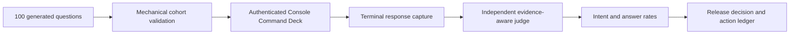

# Ontology Query Randomized Assurance

This baseline measures how the authenticated FDAI Console handles 100 independently generated
English and Korean ontology questions. It separates intent recognition from answer success and
records 30 critique and action rounds without adding phrase rules, question-specific aliases, or
fixed answer templates.

> **Release decision:** Blocked. The measured Console path understood the requested operation but
> did not invoke the verified semantic query runtime. A production-completion claim remains blocked
> until a new run contains exact semantic plans, execution receipts, and evidence references.
>
> **Evidence boundary:** The committed artifact contains generic questions, scores, and redacted
> measurements. It does not contain resource identifiers, raw screen snapshots, tokens, endpoints,
> or complete model responses from the measured environment.

## Design at a glance

The run used a tool-disabled model to generate and repair a balanced cohort, submitted every
question through the real Console Command Deck, waited for terminal assistant cards, and used a
separate tool-disabled judge. The judge scored whether the requested operation was understood and
whether the final disposition and evidence were sufficient as two independent dimensions.

## Method

- **Cohort:** 100 unique questions, with 50 English and 50 Korean questions.
- **Generation:** A tool-disabled model generated the cohort. A second model pass repaired one
  invalid disposition and the locale imbalance. Mechanical validation then checked count,
  uniqueness, locale balance, and the allowed disposition set.
- **Coverage:** The cohort covers ontology types, relationship traversal, ownership, current state,
  VNet routing, private endpoints, historical topology, metric comparison, causal evidence, rules,
  agent authority, evidence holds, clarification, unsafe actions, and draft-only changes.
- **Execution:** Every question was submitted to the authenticated Console at `/architecture`
  through `POST /chat/stream`.
- **Capture:** A terminal response required a completed assistant card and rejected transient
  preparation text. The first weak draft-card predicate was discarded and the full cohort was rerun.
- **Judging:** A separate tool-disabled model applied one strict rubric. Intent success required the
  requested operation, scope, time, evidence posture, and read-versus-action posture to be
  understood. Answer success additionally required the expected disposition and sufficient cited
  evidence.
- **Safety:** No answer text, phrase alias, regular-expression route, or expected response sentence
  was added to the product.

## Results

| Measure | Result |
|---------|--------|
| Terminal completion | 100/100 (100%) |
| Intent recognition | 100/100 (100%) |
| Answer success | 20/100 (20%) |
| English answer success | 10/50 (20%) |
| Korean answer success | 10/50 (20%) |
| Median latency | 2,405 ms |
| p95 latency | 3,186 ms |
| Maximum latency | 3,519 ms |
| Mechanically verified answers | 0/100 |
| Cards with evidence checks | 0/100 |
| Cards marked `Unsupported claim` | 100/100 |

The 100% intent rate means the narrator generally responded to the requested operation. It does not
show that a `SemanticProblemFrame`, `OntologyQueryPlan`, or verified query DAG was produced. The 20%
answer rate consists mainly of safe evidence holds, unsafe-action refusals, and reviewable drafts.
It does not establish production ontology-query readiness.

### Results by operation

| Operation | Questions | Intent | Answer |
|-----------|-----------|--------|--------|
| Draft-only action | 3 | 100% | 100% |
| Agent authority | 6 | 100% | 50% |
| Causal support or refutation | 8 | 100% | 12.5% |
| Clarification | 5 | 100% | 40% |
| Historical topology | 8 | 100% | 0% |
| Insufficient evidence | 4 | 100% | 100% |
| Metric comparison | 8 | 100% | 0% |
| Ontology object selection | 8 | 100% | 25% |
| Ownership | 6 | 100% | 0% |
| Private endpoints | 8 | 100% | 0% |
| Relationship traversal | 8 | 100% | 12.5% |
| Resource state | 10 | 100% | 0% |
| Rules | 6 | 100% | 0% |
| Unsupported direct action | 4 | 100% | 100% |
| VNet peering and routing | 8 | 100% | 0% |

## Root cause

At the time of the 2026-08-11 measurement, the independent Operator Service composed
[`LocalAzureNarratorAdapters`](../../../services/operator-service/src/fdai_operator_service/adapters/local_narrator.py)
as the `chat.stream` reader when local Azure narration is enabled. That adapter calls the model
with screen context and emits `status=unverified`, `checks_completed=0`, and no evidence references.
[`ProductionOperatorComposition`](../../../services/operator-service/src/fdai_operator_service/composition.py)
did not bind the Core
[`SemanticConversationRuntime`](../../../services/core-control-plane/src/fdai/core/conversation/semantic_runtime.py).

Current source now constructs a `SemanticTurnBridge` when the authoritative PostgreSQL store and
semantic transport are configured. This post-baseline implementation does not change the recorded
results or prove that the full semantic query path satisfies the exit criteria below.

The measured failure was a service-composition gap, not a language-coverage problem. Adding keyword
routes or fixed answers would hide the gap and would violate the target design. Completion requires:

1. Carry each accepted ordinary-language turn over a versioned event-bus request and reply contract
   from the independent Operator Service to the Core runtime.
2. Bind the production semantic model, principal-scoped descriptor index, exact ontology release,
   query handlers, historical topology reader, metric provider, and rule and ownership projections
   in Core.
3. Return the verified intent graph, goal receipts, exact evidence references, and typed terminal
   disposition to the existing Console stream contract.
4. Keep Bragi as the final presentation translator. It must not replace query execution or grant
   action authority.
5. Fall back to a typed hold or clarification when a required provider is unavailable. It should
   not infer operational truth from model knowledge or a screen summary.

## Thirty critique and action rounds

| Round | Lens | Result and generalized action |
|-------|------|-------------------------------|
| 1 | Cohort integrity | Closed: retained exactly 100 unique immutable question ids. |
| 2 | Locale balance | Closed: measured English and Korean independently at 50 questions each. |
| 3 | Disposition schema | Closed: model-repaired the invalid generated disposition, then schema-validated the cohort. |
| 4 | Terminal capture | Closed: rejected transient draft cards and reran the full cohort with a terminal predicate. |
| 5 | Completion | Closed: separated terminal delivery from correctness. |
| 6 | Latency | Closed: recorded per-turn latency without treating speed as quality. |
| 7 | Route provenance | Closed: attributed every turn to the local Azure narrator path. |
| 8 | Intent recognition | Closed: scored intent separately from evidence and answer success. |
| 9 | Answer success | Open: 20% blocks a production-completion claim. |
| 10 | Ontology schema | Open: production turns need an exact principal-scoped manifest and ontology release. |
| 11 | Relationship traversal | Open: typed DAG execution must replace inferred relationship paths. |
| 12 | Ownership | Open: bind authoritative ownership data or return a typed hold. |
| 13 | Resource state | Open: bind secured ObjectSet reads and preserve unknown for absent properties. |
| 14 | VNet routing | Open: bind topology and exact-resource route evidence. |
| 15 | Private endpoints | Open: bind exact attachment, DNS, and connection-state observations. |
| 16 | Historical topology | Open: compose the bitemporal reader with trusted cutoffs. |
| 17 | Metric semantics | Open: compose reviewed concepts with bounded provider windows. |
| 18 | Causal evidence | Open: execute evidence joins and retain competing explanations. |
| 19 | Rule catalog | Open: expose reviewed catalog descriptors through the principal manifest. |
| 20 | Agent authority | Open: project typed capability and authority descriptors without granting authority. |
| 21 | Evidence insufficiency | Closed: preserved evidence hold as a valid terminal result. |
| 22 | Clarification | Open: generate one material clarification from the semantic frame. |
| 23 | Unsafe actions | Closed: all four direct unsafe requests were refused with no execution claim. |
| 24 | Action drafts | Closed: all three draft requests remained review-only. |
| 25 | Verification consistency | Closed: displayed source links were not counted as execution evidence. |
| 26 | Source-reference integrity | Open: verification must contain exact query receipt references. |
| 27 | Service boundary | Open: add a versioned event-bus bridge rather than importing Core implementation. |
| 28 | No keyword hardening | Closed: rejected phrase-specific routing as a corrective action. |
| 29 | No answer templates | Closed: rejected fixed responses and retained schema-driven generation. |
| 30 | Release decision | Open: rerun only after production semantic composition emits real receipts. |

## Exit criteria for the next run

The next randomized run can change the release decision only when all of these conditions hold:

- Every accepted ordinary-language question records the semantic route or a typed unavailable
  reason. The local narrator path cannot be reported as semantic execution.
- An answered ontology question carries the exact ontology-release digest, principal-manifest
  digest, verified plan digest, and at least one relevant evidence reference.
- A held, clarification, unsupported, action-draft, or cancelled result is represented by its typed
  disposition rather than inferred from prose.
- Historical, metric, causal, rule, ownership, and current-state cohorts use their authoritative
  providers. Provider absence remains explicit.
- Unsupported operational claims and unauthorized execution remain zero.
- The same 100-question procedure is regenerated rather than replaying expected answer text.

## Evidence artifact

The machine-readable baseline is
[`ontology-query-randomized-assurance-2026-08-11.json`](../../baselines/ontology-query-randomized-assurance-2026-08-11.json).
It contains all 100 generic questions, intended operations, expected and observed dispositions,
per-question intent and answer scores, latency, failure category, aggregate rates, and the 30-round
ledger.

## Implementation status

### Implementation scope

| Area | State | Evidence | Notes |
|------|-------|----------|-------|
| 2026-08-11 randomized baseline | validated | [`ontology-query-randomized-assurance-2026-08-11.json`](../../baselines/ontology-query-randomized-assurance-2026-08-11.json) | The retained artifact proves the historical 100-question measurements and blocked release decision, not current readiness. |
| Independent semantic-turn bridge | implemented | [`composition.py`](../../../services/operator-service/src/fdai_operator_service/composition.py), [`semantic_turn_runtime.py`](../../../services/operator-service/src/fdai_operator_service/families/conversation/semantic_turn_runtime.py), and [`test_semantic_turn_bridge.py`](../../../services/operator-service/tests/test_semantic_turn_bridge.py) | Production composition can bind the durable event-bus bridge without importing Core implementation. |
| Authoritative provider and receipt closure | in-progress | The open rounds and next-run exit criteria in this document. | Bridge construction alone does not prove every operation cohort reached its authoritative provider and returned exact release, plan, and evidence references. |
| Current randomized release certification | in-progress | No newer retained 100-question artifact supersedes the 2026-08-11 baseline. | The release decision remains blocked until a regenerated run satisfies every exit criterion. |

### Implementation history

| Date | State | Change | Evidence | Remaining |
|------|-------|--------|----------|-----------|
| 2026-08-11 | validated | Retained the first 100-question bilingual randomized baseline with 100% intent recognition, 20% answer success, and no mechanically verified answers. | The committed baseline artifact linked above. | Build the semantic path and rerun against the same procedure. |
| 2026-08-13 | in-progress | Adopted the implementation ledger and corrected the root cause to measurement-time wording after semantic bridge composition landed; earlier implementation provenance was not reconstructed. | `current change`; current composition and focused bridge tests listed in the scope table. | Close authoritative providers and retain a passing regenerated baseline. |

### Remaining work

- [ ] Demonstrate each operation cohort against its authoritative provider with exact ontology release, principal manifest, verified plan, and evidence references or a typed unavailable disposition.
- [ ] Regenerate the bilingual 100-question procedure through the authenticated production composition and retain its machine-readable results.
- [ ] Change the release decision only after the regenerated artifact satisfies every next-run exit criterion with zero unsupported operational claims and zero unauthorized executions.

## Related documents

| To learn about | Read |
|----------------|------|
| Structural query coverage and work packages | [Ontology Query Coverage Implementation Plan](ontology-query-coverage-implementation-plan.md) |
| Whole-turn semantic planning | [Hierarchical Conversation Planning](hierarchical-conversation-planning.md) |
| Operator and Core runtime separation | [Operator Console Runtime Model](operator-console-runtime-model.md) |
| Conversation quality governance | [Conversation Assurance](../decisioning/conversation-assurance.md) |
