# 온톨로지 추론 승격 프로그램

이 문서는 질문 형식 컴파일러를 shadow에서 프로덕션 답변으로 옮기는 방법을 설계합니다. 모델이 볼 수
있는 근거, 프로덕션 shadow 연결, 방향 판독기, 검증된 답변 작성, 라이브 검증 프로그램, 승격과 제거,
남아 있는 Owner 결정 하나, 그리고 남은 모든 추론 작업의 순서를 다룹니다. 이 문서는
[온톨로지 추론 컴파일러](ontology-reasoning-compiler-ko.md)를 확장하며 그
[전달 라운드](ontology-reasoning-compiler-ko.md#전달-라운드)를 따릅니다.

> **상태:** 2026-10-01 제안 설계입니다. 전달 상태와 남은 작업은
> [구현 원장](../../roadmap-implementation/interfaces/ontology-reasoning-promotion-program.md)에 있습니다.
> 라이브 모델, Azure, SRE Agent 실행에는 모두 Owner의 명시적 요청이 필요합니다.

## 설계 개요

승격(promotion)은 작업 계열 하나를 관찰에서 적용으로 바꾸어, 그 계열의 프로덕션 턴에 컴파일된 경로가
답하게 합니다. shadow 모드에서 컴파일러는 관찰하고 처리 결과를 기록하지만 답변을 바꾸지 않습니다.
승격은 프로덕션 shadow 턴과 반복된 라이브 라운드에서 측정한 증적으로만 이루어지며, 로컬 실험으로는
이루어지지 않습니다.

| 패키지 | 제공하는 것 | 라운드 |
|--------|-------------|--------|
| P0 모델 근거 보기 | 어떤 모델이든 읽을 수 있는 유일한 근거 투영 | P2와 P3 이전 |
| P1 프로덕션 shadow 연결 | 판단 호출에 실린 형식, 턴 예약, 모든 턴에 대한 연결된 처리 결과 | R3부터 R8 |
| P2 방향 판독기 | 프로덕션 구성의 완전한 방향 다수결 프로토콜과 지연 시간 및 비용 | R5 |
| P3 검증된 답변 작성 | 공유 명제 계약에 따른 주장, 완전한 V-CLAIM, 독립 함의 검토 | R8 |
| P4 검증 프로그램 | 기준선, 단계별 검증, 최종 승격 근거 | R0부터 R9 |
| P5 승격과 제거 | 계열별 승격과 동등성 증적, 이후 어휘 기반 재도출 제거 | R9와 R10 |
| P6 비밀 정보 탐지 결정 | 운영자가 입력한 모델 입력의 비밀 정보 탐지에 대한 Owner 결정 | 0단계 |

## P0 모델 근거 보기

근거를 읽는 모든 모델 호출, 즉 답변 작성자, 함의 검토자, 모든 reader는 원시 표가 아니라 보안이
적용된 게이트웨이가 만든 `ModelEvidenceView`를 받습니다.

- 보기는 허용 목록에 있는 셀만 담습니다. 링크에는 승인된 결정 7의 검토된 링크 근거 허용 목록인
  `verified`, `verification_method`, 권한, 유효 시각, 신선도 상한, 완전성만 담습니다.
- 보이는 링크가 숨겨진 엔드포인트를 가리키더라도 그 엔드포인트는 나타나지 않습니다. 제공자 본문, 핸들
  메타데이터, 보관된 스냅숏 셀은 제외합니다.
- 보기에는 배포 범위, 권한, 시간 기준, 완전성, 릴리스, 그리고 보기를 만든 검증기의 다이제스트가
  담기므로, 주장은 모델이 본 것을 정확히 인용할 수 있습니다.
- 로컬 구현은 적응형 답변의 근거 읽기를 모델 입력 전에 이 보기로 통과시킵니다. Owner가 P0을
  읽을 모델 계열을 승인하기 전까지 제안된 기본값은 프로덕션에서 어떤 모델 계열도 이 보기를 읽지
  않는 것입니다.

**종료 조건:** 숨겨진 엔드포인트와 허용 목록에 없는 필드가 어떤 모델 호출에도 들어가지 않음을 테스트가
보여 주고, Owner가 이 보기를 읽을 수 있는 모델 계열을 승인합니다.

## P1 프로덕션 shadow 연결

승격 근거는 기존 판단 호출의 추가 필드로 실린 형식에서만 나옵니다. 턴 옆에서 자체 모델 호출을 하는
탭은 다른 해석을 측정하므로 그 기록은 실험으로 남습니다.

- **전달:** 판단 계약은 새 부 버전에서 닫힌 형식을 선택 필드로 받습니다. 형식이 없거나 잘못되면
  타입이 지정된 `form_absent` 처리 결과가 되며 답변은 바뀌지 않습니다.
- **예산:** shadow는 [턴 예산 예약](ontology-reasoning-coverage-expansion-ko.md#e5-턴-예산-예약)에 따라
  자신의 용량에서 예약하므로, 답변의 예산을 쓰거나 취소하지 않습니다.
- **조건:** 연결은 상위 설계의 프로덕션 shadow 연결 단락에 있는 모든 조건을 지킵니다. 새로운 앵커 기준
  시각, 완료까지 정리하는 취소, 정제된 문맥, HTTP 429나 503에서 멈추는 fan-out, 턴당 관찰 발화 하나,
  실행기의 범위 다이제스트, 키가 있는 표본 식별자, 지속되는 저장소, 기본값이 꺼짐인 타입 설정입니다.
- **연결된 기록:** 각 처리 결과는 키가 있는 표본 식별자, 판단 요청, 실린 형식, 프롬프트와 모델과 구성,
  매니페스트와 기준 시각, 컴파일된 계획, 답변 출력의 내용 없는 다이제스트를 서로 연결합니다. 이 연결이
  근거가 실린 형식에서 나왔음을 증명합니다.
- **간섭 없음:** shadow에는 답변 작성으로 들어가는 데이터 경로가 없으며, 모듈 경계 테스트가 이를
  강제합니다. 같은 요청과 스냅숏 입력을 shadow를 켜고 끈 채 재생하면 같은 답변 다이제스트가 나옵니다.
로컬 구현은 판단 계약 스키마 `1.4.0`에서 닫힌 형식을 전달하고, 기본값이 꺼진 설정 뒤에서만 판단
모델에 노출하며, 주입된 프로덕션 shadow 저장소를 통해 내용 없는 연결 처리 결과를 기록합니다. 형식이
없거나 잘못되면 답변 경로를 바꾸지 않고 `form_absent`를 기록합니다. 표본 프로덕션 기간은 라이브
승격 근거로 남습니다.

**종료 조건:** 표본으로 뽑은 프로덕션 기간 동안 적격한 모든 턴에 연결된 처리 결과가 있고, shadow를 켜고
끈 재생이 동등합니다.

## P2 방향 판독기

논쟁이 되는 관계 방향은 판독기 하나가 아니라 상위 설계의 다수결 프로토콜로 정합니다.

1. 제안자와 다른 모델 계열의 블라인드 이진 판독기가 마스킹된 최소 입력에서 질문과 두 방향을 정해진
   순서로 읽습니다.
2. 그 판독기가 제안자와 다르면 세 번째 계열의 두 번째 블라인드 판독기가 결정합니다.
3. 구체적인 두 해석이 일치할 때만 방향을 확정합니다. 그렇지 않거나 시간 초과, 판독기 사용 불가가
   생기면 턴을 타입이 지정된 이유로 보류합니다.

프로덕션 구성은 해석된 모델 매니페스트를 통해 제공자 예산 안에서 두 판독기를 바인딩합니다. 방향 판단이
있는 턴마다 지연 시간과 토큰 비용을 기록하며, 판독기 하나인 턴과 둘인 턴을 나누어 기록합니다.

**구현 메모(2026-10-01):** 이제 모든 shadow 턴은 내용이 없는 방향 비용 증적을 담고, 이를
`semantic_direction_cost`로 기록합니다. 증적은 판독기가 하나인지 둘인지와 함께, 턴의 예약 원장이 정산한
호출 수, 입력 바이트, 출력 토큰, 경과 시간을 셉니다. 프로덕션 구성도 P1 프로덕션 shadow 설정이 켜져
있을 때 방향 판독기와 세 번째 계열 tiebreaker를 바인딩하지만, 로컬 환경 밖에서는 컴파일된 답변을 계속
비활성화합니다.

**종료 조건:** 두 판독기가 프로덕션 구성에서 실행되고, 턴 유형별로 표본 프로덕션 기간을 다루는 지연
시간과 비용 증적이 있습니다.

## P3 검증된 답변 작성

Bragi의 T1 작성자는 상위 설계의 [답변 작성](ontology-reasoning-compiler-ko.md#답변-작성)이 정의한
대로, 수용된 형식과 P0 보기, 목표별 상태, 타입 제한을 바탕으로 모든 답변을 쓰고 구조화된 주장을
돌려줍니다.

1. **명제 스키마 하나:** 작성자, V-CLAIM, 검토자는 서비스 계약에 있는 정식 명제 모델 하나를
   공유합니다. 이 모델에는 수량자, 단위와 통화, 시간 기준과 시간대, 양상, 인과 분류를 포함해 상위
   설계의 모든 필드가 있습니다.
2. **V-CLAIM:** 결정론적 검사가 정식 식별자를 통해 모든 명제를 근거와 비교합니다. 참조 누락, 바뀌거나
   선언되지 않은 리터럴, 틀린 개수, 집계되지 않은 행, 빠진 제한, 빠진 필수 목표나 형식 원자, 인과 등급
   증적이 없는 원인을 거부합니다.
3. **함의 검토:** 다른 모델 계열의 독립 T1 검토자가 각 주장이 인용한 근거에서 따라 나오는지
   확인합니다. 거부되면 타입 이유와 함께 한 번 다시 생성합니다. 다시 거부되면 검증된 근거 보기와 함께
   답변을 보류합니다.
4. **적대적 스위트:** 명제 필드마다, 완전성 검사마다 테스트 클래스 하나를 두고, 부정, 뒤바뀜, 하나 차이,
   인과 과장 주장을 더합니다.
로컬 구현은 공유 명제 계약, 기본값이 꺼진 작성자 및 검토자 포트, 결정론적 적대 V-CLAIM 스위트를
제공합니다. 프로덕션 모델 계열 바인딩과 R8 라이브 홀드아웃은 로컬 증명이 아니라 승격 근거로 남습니다.

**종료 조건:** 적대적 주장 스위트에서 통과해 버린 주장이 0건이고, R8 홀드아웃에서 V-CLAIM을 빠져나간
주장이 0건입니다.

## 검증 프로그램

라이브 실행은 로컬 테스트가 증명할 수 없는 동작을 측정합니다. 실행마다 전체, 단계, 무진전 기한이
있습니다. 예상하지 못한 T2 fallback, HTTP 429나 503, 제공자 시간 초과에서 멈추며, 마스킹된 내용 없는
증적만 남깁니다. 프로그램은 세 단계로 이루어집니다. 0단계의 기준선, 각 단계 이후의 검증, 5단계의
최종 승격 근거입니다.

| 측정 | 규칙 | 종료 조건 |
|------|------|-----------|
| R0 기준선 | 두 번 반복하는 L1, fixture 그래프의 L2, 추론 코호트에 대한 Azure SRE Agent 동등성 기준선 | 보관된 L1, L2, 동등성 증적 |
| L1 커버리지 | 공개된 과잉 컴파일 없이 120회 중 84회에서 회복 | 반복한 두 라운드에서 120회 중 105회 이상 |
| 공개된 틀린 답변 | 실행한 행이 정답 행과 다른, 컴파일되어 공개된 답변을 매 라운드 셉니다 | 모든 L1 라운드에서 0건이며, 한 건이라도 결함입니다 |
| 공개 편차 | 할당 해제된 VM, 최근 변경, 포함 그룹 질문에 대해 반복하는 20문항 라운드 세 번 | 모든 라운드에서 세 질문이 모두 답합니다 |
| 긴 대화 | 같은 질문을 새 문맥과 20턴 문맥 후반에서 묻습니다 | 두 번 반복하는 동안 같은 검증된 답변 |
| 추적 종료 조건 | 컴파일된 계획 커버리지, 최종 명확화, 모호성 판독기 라운드 | 각 추적 질문이 원장의 종료 조건을 충족합니다 |

## P5 승격과 제거

승격은 작업 계열별로, 승격 레지스트리를 통해, 다음 순서로 이루어집니다.

1. 계열의 커버리지 레인이 [커버리지 원장](../../roadmap-implementation/interfaces/ontology-reasoning-coverage.md)에
   종료 조건을 기록합니다.
2. 계열이 상위 설계의 기준을 충족합니다. 모든 반복과 표본 shadow 턴에서 hard zero, 홀드아웃 하한,
   영어와 한국어 차이 5포인트 이하, p95 지연 시간 증가 없음, SRE Agent 동등성, 68건 코퍼스 회귀
   없음입니다.
3. 레지스트리가 승격 증적 하나와 동등성 증적 하나를 기록하고, 그 계열의 frame과 plan 프롬프트를
   은퇴시킵니다.
4. 롤백은 이전 레지스트리 항목을 복원합니다. 현재 경로는 R10까지 그대로 유지합니다.

R10은 재생 동등성과 안정적인 롤백 릴리스 한 번 이후에, 승격된 경로에서만 어휘 기반 재도출과 템플릿
렌더러를 제거합니다.

## P6 비밀 정보 탐지 결정

운영자가 입력한 텍스트는 식별자 마스킹 뒤에 모델에 들어가며, 패턴 기반 탐지가 비밀 정보 모양의
문자열을 최선의 노력으로 제거합니다. P2와 P3가 운영자 텍스트와 근거를 읽는 모델 계열을 더하므로,
Owner는 4단계 전에 결정합니다.

| 선택지 | 결과 |
|--------|------|
| 패턴을 검토된 탐지기로 바꿉니다 | 새 의존성과 그 검토가 필요하며, 인코딩 형태 회귀 스위트가 그 탐지기로 통과해야 합니다 |
| 테넌트 내 모델 배포의 심층 방어로 패턴을 수용합니다 | 배포 경계가 주요 통제라는 점을 결정에 기록합니다 |

**종료 조건:** 결정이 원장에서 연결되고, `test_semantic_reasoning_masking.py`의 인코딩 형태 회귀 스위트가
선택한 탐지기로 통과합니다.

**결정(2026-10-01):** 테넌트 내 모델 배포의 심층 방어로 패턴을 유지하며, 배포 경계가 주요 통제입니다.
이 선택지는 모든 단계를 구현하라는 Owner의 지시에 따라 채택했습니다. 대체 탐지기는 자체 공급망 검토가
필요한 의존성을 더하기 때문입니다. 프로덕션에서 어떤 모델 계열이 운영자 텍스트를 읽기 전에 Owner가 이
결정을 바꿀 수 있습니다.

## 진행 순서

남은 추론 작업은 여섯 단계로 진행합니다. 각 단계는 의존하는 앞 단계가 종료 조건을 충족한 뒤에만
시작하며, 모든 패키지는 자신의 종료 조건을 유지합니다. 검증은 각 단계가 끝날 때마다 실행합니다.

문서도 같은 구조를 따릅니다. 상위 설계는 형식, 검사, 전달 라운드의 규범 계약으로 남고, 새 작업은
집중 설계 문서에 들어갑니다. 첫 계열이 승격된 뒤에는 상위 설계의 형식 전용 답변, 인과 맥락, 검토
절을 각각의 집중 문서로 옮겨 상위 설계가 로드맵 문서 크기 한도 안으로 돌아오게 합니다.

## 남은 작업 지도

2026-10-01에 컴파일러 원장에 있던 모든 열린 항목은 이제 담당 패키지 하나를 가지며, 그 내용은 해당
패키지의 원장으로 옮겨졌습니다.

| 이전 컴파일러 원장 항목 | 담당 |
|-------------------------|------|
| R1 핸들, 근거 매니페스트, pushdown 계약 | [H1](ontology-reasoning-result-handles-ko.md#h1-계약) |
| 지속되는 Operator 턴과 함께 결과 핸들 저장 | [H2](ontology-reasoning-result-handles-ko.md#h2-핸들-저장소) |
| 이름 붙은 리소스의 속성과 서수 SKU 후속 질문 | [H3](ontology-reasoning-result-handles-ko.md#h3-속성-후속-질문)와 [H4](ontology-reasoning-result-handles-ko.md#h4-서수-후속-질문) |
| 변경 목록 이어 읽기 | [H5](ontology-reasoning-result-handles-ko.md#h5-변경-이어-읽기) |
| 연속 계획으로 읽는 all-kinds 이웃 | [H6](ontology-reasoning-result-handles-ko.md#h6-연속-관계-계획) |
| 타입 제약 슬롯 | [E1](ontology-reasoning-coverage-expansion-ko.md#e1-타입-제약-슬롯) |
| R2 중간 피연산자 출처 | [E2](ontology-reasoning-coverage-expansion-ko.md#e2-바인딩-증적을-통한-피연산자-출처) |
| 현재 경로의 관계 질문과 T2 상태 검토 | [E3](ontology-reasoning-coverage-expansion-ko.md#e3-현재-경로의-관계) |
| 긴 대화 속 독립 질문 | [E4](ontology-reasoning-coverage-expansion-ko.md#e4-긴-대화-속-독립-질문) |
| 스키마 형식과 frame 예산 | [E5](ontology-reasoning-coverage-expansion-ko.md#e5-턴-예산-예약) |
| 컨테이너 종류별 그룹화 | [E6](ontology-reasoning-coverage-expansion-ko.md#e6-컨테이너-종류별-그룹화) |
| 상태 이상 조회, 상태 이력, 수명 주기 도메인 | [E7](ontology-reasoning-coverage-expansion-ko.md#e7-단일-대상-상태-이상-상태-이력-수명-주기-도메인) |
| 인과 변화 지점 | [E8](ontology-reasoning-coverage-expansion-ko.md#e8-인과-변화-지점과-근거-등급) |
| R3부터 R8까지의 라운드 종료 조건 | 이 프로그램과, 연산자는 [E9](ontology-reasoning-coverage-expansion-ko.md#e9-남은-연산자와-관계-의미) |
| 프로덕션 shadow 연결 | [P1](#p1-프로덕션-shadow-연결) |
| 방향 판독기 배포 | [P2](#p2-방향-판독기) |
| 답변 작성자, V-CLAIM, 함의 검토 | [P3](#p3-검증된-답변-작성) |
| R0, L1 커버리지, 공개된 틀린 답변, 편차, 컴파일된 계획 커버리지, 최종 명확화, 모호성 라운드 | [검증 프로그램](#검증-프로그램) |
| R9, R10, 커버리지 레인 종료 조건 | [P5](#p5-승격과-제거) |
| 비밀 정보 탐지 결정 | [P6](#p6-비밀-정보-탐지-결정) |

## 승인이 필요한 결정

1. 프로덕션 shadow 원격 측정은 새 저장소가 아니라 기존의 지속되는 결정 이벤트 저장소로 보내며, 키가
   있고 내용이 없습니다(제안).
2. 승격은 상위 설계의 기준을 그대로 쓰며, 더 엄격한 하한은 계열별로 커버리지 원장에 기록합니다(제안).
3. P0 보기를 읽을 수 있는 모델 계열과 P6 선택지입니다.

## 비평과 수정

초안에 대한 독립 비평에서 다음 문제가 나왔습니다. 이 설계는 각 수정을 반영합니다.

| 발견 사항 | 수정 |
|-----------|------|
| 명제와 V-CLAIM 계약이 상위 설계보다 약했습니다 | 모든 필드를 갖춘 공유 명제 스키마 하나, 선언되지 않은 리터럴과 빠진 목표나 원자에 대한 V-CLAIM 검사 |
| 판독기 하나로는 논쟁이 되는 방향을 정할 수 없습니다 | 세 번째 계열 판독기와 타입 보류가 있는 완전한 다수결 프로토콜 |
| 단계 순서가 의존 관계를 어겼습니다 | R0, P6, P0가 0단계를 이루고, 서수는 핸들 저장소 뒤에, E8 가설은 P3 뒤에 오며, 검증은 모든 단계 뒤에 실행됩니다 |
| 모델에 안전한 근거 투영이 없었습니다 | P0가 링크 근거 허용 목록과 숨겨진 엔드포인트 억제를 갖춘, 모든 모델이 읽는 유일한 보기를 만듭니다 |
| shadow 근거가 출처와 간섭 없음을 증명하지 못했습니다 | 연결된 내용 없는 다이제스트, 모듈 경계 테스트, shadow를 켜고 끈 재생 |
| R3부터 R8까지의 여러 기능에 담당이 없었습니다 | E9와 남은 작업 지도가 모든 항목에 담당 하나를 줍니다 |
| 연결된 원장이 없었습니다 | 원장이 있으며 이 문서의 남은 작업을 담당합니다 |

## 관련 문서

| 알아볼 내용 | 문서 |
|-------------|------|
| 전달 상태와 남은 작업 | [구현 원장](../../roadmap-implementation/interfaces/ontology-reasoning-promotion-program.md) |
| 컴파일러, 검사, 전달 라운드 | [온톨로지 추론 컴파일러](ontology-reasoning-compiler-ko.md) |
| 핸들과 이어 읽기 | [결과 핸들과 이어 읽기](ontology-reasoning-result-handles-ko.md) |
| 컴파일러 커버리지와 현재 경로 작업 | [커버리지 확장](ontology-reasoning-coverage-expansion-ko.md) |
| 커버리지 레인과 동등성 기준 | [온톨로지 추론 커버리지](ontology-reasoning-coverage-ko.md) |
