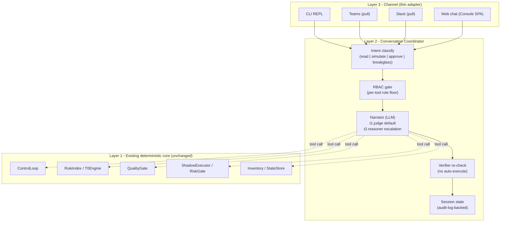

# 오퍼레이터 콘솔 (Conversational)

사람 오퍼레이터가 CLI, Teams, Slack, 웹 챗의 대화형 인터페이스로 FDAI에 **역으로 말할 수 있는** 방식입니다. 이 문서는
**대화형 surface**를 권위적으로 정의한다: 계층 아키텍처, tool 카탈로그, LLM
tier 모델, 세션 지속성, tool 별 RBAC, 안전 invariant, 현재 rollout status.

Push 방향 (시스템 → 사람) 알림은 [channels-and-notifications.md](channels-and-notifications-ko.md)에 있고,
읽기 전용 콘솔 SPA는
[project-structure.md § console/](../architecture/project-structure-ko.md#console-static-web-app)에 있습니다. Evidence provenance, stream recovery, localization 및 Architecture map resilience는 [console-evidence-and-resilience-ko.md](console-evidence-and-resilience-ko.md)가 소유합니다.

이 문서는 **pull 방향**, 즉 오퍼레이터가 묻고 시뮬레이션하고 승인하는 경로를 다룹니다.
Push와 pull은 같은 채널 credential과 audit 계약을 공유하지만 서로 다른 통합
surface입니다.

> 고객-무관: 아래의 모든 채널 id, LLM deployment 이름, 리소스 id, 그룹
> 이름은 placeholder. Fork는 config로 실제 값을 공급
> ([generic-scope.instructions.md](../../../.github/instructions/generic-scope.instructions.md)).

## 1. Framing - 무엇인가 (그리고 무엇이 아닌가)

오퍼레이터 콘솔은 **판단 authority 를 가지지 않는다**. FDAI의 판단
authority 는 이미 있는 곳에 그대로 남는다 - deterministic engine (T0),
quality gate (T2 verifier), risk gate, shipped Rego policy. 콘솔은
그 판단을 오퍼레이터가 검사하고, 변경을 시뮬레이션하고, 시스템이
이미 큐잉한 것을 승인하는 **대화형 surface** 이다.

세 property가 직접 따라온다:

- **LLM은 translator 이지 judge가 아님.** 자연어 in, tool call out; tool
  결과 in, 자연어 out. LLM은 execution eligibility를 절대 부여하지 않음 -
  오직 verifier만
  ([architecture.instructions.md § Design Principles](../../../.github/instructions/architecture.instructions.md#design-principles)).
- **Tool은 pipeline stage를 노출하고, primitive data source가 아님.**
  LLM이 진단으로 조합해야 하는 `query_log()` + `query_metric()` +
  `read_config()` 대신, 콘솔은 `describe_event()`, `explain_verdict()`,
  `simulate_change()`를 노출. 시스템이 이미 reasoning을 완료했음;
  오퍼레이터는 결과에 대해 묻는다.
- **성장은 카탈로그 성장이지, 모델 memory 성장이 아님.** 반복되는
  investigation 패턴은 discovery loop를 통해 새 룰 후보가 됨
  ([architecture.instructions.md § Rule Catalog](../../../.github/instructions/architecture.instructions.md#rule-catalog)) -
  불투명한 LLM 세션 memory가 아님. 대화 간에 persist 되는 모든 상태는
  `audit_log` + `operator_memory`에 살며, 감사가능 / export 가능 / CSP-중립.

### 1.1 공유 glossary에 추가된 어휘

다음 토큰들이
[architecture.instructions.md](../../../.github/instructions/architecture.instructions.md)
의 공유 어휘에 추가되며 참조하는 모든 문서에서 일관되게 사용된다:

- **operator-console** - 여기 문서화된 계층 surface.
- **narrator** - 오퍼레이터 콘솔의 LLM tier (translator 역할; judge 절대
  아님). T2 quality-gate 역할과는 별개 - 그건 제안된 액션에 대한 도메인
  reasoner.
- **operator-conversation** - 오퍼레이터와 콘솔 사이의 bounded exchange
  하나 (멀티-turn, RBAC-scoped, 감사됨).
- **console-tool** - narrator가 호출 가능한 노출된 pipeline stage 또는
  카탈로그 view 하나.

## 2. 3-layer 아키텍처



- **Layer 3 (Channel)**은 얇다. 각 채널 adapter는 wire 포맷 (stdin /
  Teams Activity / Slack event / authenticated HTTP request와 SSE)의 한 turn을
  `ConversationTurn`으로, 그리고 반대 방향으로 변환. 판단은 여기 없음.
- **Layer 2 (Coordinator)**는 intent classification, RBAC gating, tool
  dispatch, verifier re-check, 세션 bookkeeping을 소유합니다. Core translator는 `Narrator`
  Protocol, web generation은 read API backend seam이므로 deployment가 provider를 바인딩할 수 있습니다.
- **Layer 1 (Core)**은 이미 shipping 중인 deterministic core 그대로.
  콘솔은 새 판단 경로, 새 지속성 저장소, 새 execution vector를 추가하지
  않는다. 콘솔 tool call은 기존 pipeline이 이미 만드는 법을 아는 call
  로 resolve.

### 2.1 모듈 맵

- [`src/fdai/core/conversation/`](../../../src/fdai/core/conversation)
  - `coordinator.py` - `ConversationCoordinator` (Layer 2 orchestrator).
  - `tools.py` - `ConsoleTool` Protocol + per-tool 구현체가 Layer 1
    모듈에만 delegate.
  - `narrator.py` - sync `Narrator` Protocol, deterministic verb schema와 RBAC-scoped descriptor.
  - `session.py` - core/CLI용 disposable `ConversationSession` projection. Production web transcript는
    principal-scoped `ConversationHistoryStore`가 소유합니다.
- [`cli/`](../../../cli)
  - `src/repl.ts` - 공유 `POST /chat` coordinator를 사용하는 IME-safe
    stdin/stdout 채널입니다.
  - `src/cockpit.ts` - 동일한 coordinator에 self-describing 화면 snapshot을
    게시하는 live SSE presentation입니다.
- [`src/fdai/core/conversation/channel_gateway.py`](../../../src/fdai/core/conversation/channel_gateway.py)
  - Sender 인증, message idempotency claim, coordinator 호출을 수행하고 durable delivery 구성 시
    provider send 전에 complete response를 저장합니다. [Durable delivery](durable-conversation-delivery-ko.md)가 verified binding과 recovery를 담당합니다.
- [`src/fdai/delivery/channels/`](../../../src/fdai/delivery/channels)
  - `teams.py` - bearer-token verification 이후 Bot Framework activity를 normalize하고 reply에
    injected publisher를 사용합니다. Payload가 제공한 reply URL을 신뢰하지 않습니다.
  - `slack.py` - timestamped Slack request signature를 검증하고 replay 또는 bot-authored event를
    차단하고 message를 normalize하고 reply에 injected publisher를 사용합니다.
  - Web chat은 인증된 read-console chat API를 계속 사용합니다. 전용 WebSocket adapter는 선택적
    future transport 작업으로 남습니다.
- Scheduler Runs, Automation Blueprints, Scheduled Continuations, [관리형 trajectory dataset](governed-trajectory-datasets-ko.md), [execution backend status](execution-backends-ko.md)는 read-only metadata를 제공합니다. 이 view에는 enable, submit, retry, cancel, cleanup, execute, approval control이 없고 credential 및 Thor identity를 제외하며 command는 SPA 밖에 유지됩니다.
- [`tools/chat.py`](../../../tools/chat.py) - core coordinator를 위한 headless
  JSONL 개발 harness입니다. 별도 policy 구현이 아닙니다.

CSP-중립 규칙은 그대로 유지: `core/conversation/`은 **오직** Protocol만
import. 모든 Azure SDK / httpx / Bot Framework 호출은 `delivery/` 아래
거주.

## 3. Tool 카탈로그

Tool은 **pipeline-stage view** 입니다. Core tool은 안정된 name, bounded `argument_hint`,
RBAC floor, side-effect class와 문서화된 failure surface를 가집니다. Web/provider-specific tool은
자체 typed request contract를 추가할 수 있습니다. 새 tool은 additive이며 rule이나 policy를
override하지 않습니다.

`RuntimeToolDiscovery`는 installed narrator schema에 search 및 describe를 제공합니다. Schema
metadata와 실제 installed tool name의 교집합을 만들고 coordinator와 동일한 RBAC ladder를
적용하며 name, verb, description, argument hint, RBAC floor, side-effect class만 반환합니다.
낮은 role principal은 높은 role tool을 discover할 수 없고 descriptor에는 handler 또는 invocation
capability가 없습니다. Discovery는 navigation을 개선할 뿐 새 authority를 부여하지 않습니다.

같은 projection은 deterministic channel verb `search_tools`, `describe_tool`과 typed read RPC
method `tools.search`, `tools.describe`로 제공됩니다. Channel call은 resolved `Principal`을
사용하고 RPC call은 caller가 제공한 role parameter가 아니라 server-authorized scope에서 role을
도출합니다. 두 surface 모두 descriptor만 반환하며 target을 invoke할 수 없습니다.

### 3.1 Day-1 tool 집합 (read-only + explain)

| Tool | 목적 | RBAC 하한 | Delegates to |
|------|---------|-----------|--------------|
| `describe_event(payload)` | 하나의 이벤트를 `EventIngest → TrustRouter → T0Engine`로 in-memory 실행 (PR 없음, audit write 없음); 결과 routing 결정 + 후보 룰 id 반환. | Reader | `EventIngest`, `TrustRouter`, `T0Engine` |
| `explain_verdict(event_id)` | 이미 처리된 이벤트의 audit trail을 읽어; tier, decision, citing 룰 id, verifier 리포트, mode 반환. | Reader | `StateStore.query_audit()` |
| `explore_catalog(query)` | Shipped rule 카탈로그 / action-type 카탈로그 / ontology 어휘를 id, keyword, 또는 resource_type으로 검색. | Reader | 로딩된 카탈로그 (I/O 없음) |
| `query_audit(filters)` | 구조화된 audit query: event id, actor, decision, mode, 시간 window 별. Paginate. | Reader | `StateStore.query_audit()` |
| `query_inventory(resource_type, filter)` | Server-owned Azure inventory-view count, list, type, location, resource-group, name, status, relationship query입니다. 제한된 allowlist field, active view, snapshot source/freshness만 반환하고 local VM 상태는 `az vm list --show-details`에서 읽으며 provider 실패는 unavailable로 표시합니다. | Reader | `InventoryGraphProvider` |
| `capture_browser_evidence(policy_id, policy_version, source_url, stable_selectors)` | 정확한 server-owned policy 아래에서 credential이 없는 bounded capture를 submit합니다. Immutable artifact receipt를 반환하며 page 또는 interaction API를 반환하지 않습니다. | Reader | `BrowserEvidenceCaptureService` |

**Reader-하한 tool은 증명 가능하게 side-effect-free.** `describe_event`는
`EventIngest -> TrustRouter -> T0Engine`을 **메모리 내에서만** 실행: T1
embedding lookup, T2 모델, 외부 adapter, 어떤 mutation surface도
호출하지 않고, PR과 audit entry를 write 안 함. 그 `side_effect_class`는
`read` 이며, shadow-mode test가 executor / PR adapter / state store를 절대
건드리지 않음을 assert. 이것이 Reader 하한에서 안전한 이유입니다. Browser capture는 [브라우저 근거 수집](browser-evidence-ko.md) 계약을 따르며 Bragi는 browser handle을 받지 않습니다.

### 3.2 Week-1 추가 (write / approve / runbook)

| Tool | 목적 | RBAC 하한 | 참고 |
|------|---------|-----------|-------|
| `simulate_change(scenario)` | End-to-end `ControlLoop.process()`를 **shadow** mode로; publish 없이 executor outcome + 생성된 PR intent 반환. | Contributor | Shadow-only; 여전히 audit entry를 남김 → 오퍼레이터가 `query_audit`로 찾을 수 있음. |
| `approve_hil(approval_id, decision, justification)` | 큐잉된 HIL item 하나 해결. Verifier + `no_self_approval` invariant 재확인. | Approver | Approver 그룹; [security-and-identity.md](../architecture/security-and-identity-ko.md)의 PR gate enforcement와 동일 principal. |
| `list_hil()` | 호출자의 role에 visible 한 현재 큐잉된 HIL item 반환. | Approver | Reader-visible은 non-approver 에게 intent를 leak; Approver-scoped 유지. |
| `run_runbook(name, params, dry_run)` | `docs/runbooks/` 아래 하나의 runbook 실행. `dry_run=true`는 Contributor 요구; `dry_run=false`는 Owner 요구. | Contributor / Owner | 구체 runbook adapter (예: `db_dr_drill_cli`)는 이미 shipping; 이 tool은 이름으로 route. |
| `activate_break_glass(reason, expiry)` | TTL과 사유를 검증하고 Owner page 및 audit receipt를 생성합니다. | Reader | 현재 구현은 session principal/role을 변경하지 않으며 실제 elevation은 제공하지 않습니다. |

write 집합에 대한 두 명확화:

- **`simulate_change`가 audit entry를 write 하는 것은 "shadow는 절대
  mutate 안 함"을 위반하지 않음.** audit log는 append-only; *simulation이
  실행되었다는 것*을 기록하는 것은 관리 리소스의 mutation이 아니다.
  shadow-mode property test는 executor / PR / state-store write가 없음을
  assert 하며 audit append는 명시적으로 허용.
- **`list_hil` (Approver) vs read-console HIL view (Reader)는 다른
  surface.** read-only 콘솔 SPA는 Reader 에게 큐잉된 HIL item의 *존재와
  개수* (대시보드 tile)를 보여줌; `list_hil`은 *전체 item 상세* (target,
  proposed action, requester)를 반환하며 이는 민감한 intent를 드러낼 수
  있으므로 Approver-scoped 유지. 둘은 의도적으로 같은 가시성이 아님.

### 3.3 Month-1 추가 (관찰 depth)

| Tool | 목적 | RBAC 하한 | 의존 |
|------|---------|-----------|-------------|
| `query_log(query, window)` | Bounded single-workspace Log Analytics KQL query. | Reader | 신규 `AzureMonitorAdapter` |
| `query_metric(namespace, metric, window, aggregation)` | Azure Monitor metrics API. | Reader | 신규 `AzureMonitorAdapter` |
| `query_deployments(window)` | Git + ARM deployment-history join. | Reader | 신규 `DeploymentHistoryAdapter` |
| `correlate_incident(incident_id)` | 하나의 incident id에 대해 ingest event + audit + inventory + log + metric을 multi-signal correlate. | Reader | 위 셋 + `event_ingest` |

Month-1 추가는 콘솔을 multi-signal 인시덴트 대응 경험에 가깝게
만들어 주지만, 여전히 **이미 correlate 된** 결과를 surface;
correlator는 Layer 1에 살고, narrator 안에 살지 않는다.

### 3.4 Tool discovery 계약

각 tool은 다음을 선언:

- `name` - CLI-friendly snake_case verb (`describe-*` / `explore-*`
  접두사 taxonomy 없음; verb 자체가 카테고리).
- `description` - 한 문장, 영어, 마케팅 언어 없음.
- `argument_hint` - canonical verb parser가 기대하는 bounded argument shape. 각 tool은 호출 전
  자신의 typed/bounded validation을 다시 적용하며 invalid argument는 partial call로 진행하지 않습니다.
- `rbac_floor` - tool을 호출 MAY 하는 가장 낮은 role.
- `side_effect_class` - `read` / `simulate` / `approve` / `execute` /
  `breakglass`. Audit entry가 이 class를 carry 하므로 downstream
  analytics가 저렴하게 slice.
- `failure_modes` - tool의 docstring에 문서화된 타입화된 error surface.

`RuntimeToolDiscovery`와 `tools.search`/`tools.describe`는 handler나 invocation capability 없이
descriptor만 반환합니다. Narrator는 principal role에 허용된 같은 descriptor 목록만 봅니다.

## 4. Narrator - LLM tier 모델

Narrator는 콘솔의 LLM translator layer입니다. Core/CLI는 `Narrator` Protocol을 사용하고,
web progressive-answer generation은 read API의 별도 backend seam을 사용합니다. Azure binding은
특정 account 이름에 고정되지 않고 `resolved-models.json`과 environment composition에서 선택됩니다.

### 4.1 세 tier (trust router를 반영)

| Tier | 모델 | 처리 | 기본? |
|------|-------|---------|----------|
| **Chat T0** | 없음 (regex / keyword intent) | Direct-hit tool call: `list_hil`, `explain_verdict <id>`, `explore_catalog <keyword>`. | Yes (T0 intent가 configured threshold 이상 신뢰도로 매치하면 LLM 미호출) |
| **Chat T1** | `t1.judge` (mini reasoner) | 표준 turn: 자연어 ↔ tool_call, 대부분의 read-only investigation, one-hop follow-up. | **Yes (mini always active)** |
| **Chat T2** | `t2.reasoner.primary` (frontier) | Escalation만 (§4.2 참조). | No (escalation trigger로 opt-in) |

**Deterministic-first는 여전히 유효.** Chat T0 (regex / keyword intent, LLM
없음)이 매 turn 에서 먼저 시도되며 반복 오퍼레이터 verb (`list_hil`,
`explain_verdict <id>`, `explore_catalog <keyword>`)의 대부분을 처리할
것으로 예상. 설계 목표는 Chat T0가 turn의 다수를 resolve 하고 Chat T2가
작은 소수 (~5-10% of turns, event-측 tier 분할을 반영)로 유지되는 것 -
하지만 이는 **측정된 baseline에 대해 검증할 목표** 이지 보장이 아니다.
콘솔은 per-tier turn count를 telemetry surface
([goals-and-metrics.md](../architecture/goals-and-metrics-ko.md))에 emit 하므로 분할은
측정되며 주장되지 않음. `t1.judge`가 "always active" 라는 것은 non-T0
turn의 fallback 이라는 뜻이지, 확신의 T0 intent가 매치할 때 LLM이 돌아간다
는 뜻이 아니다.

### 4.2 Escalation trigger (T1 -> T2)

Coordinator는 다음 중 하나라도 발생하면 Chat T2로 escalate:

- Narrator의 T1 응답이 `finish_reason=abstain` 또는 aggregated 신뢰도가
  configured threshold 아래. **신뢰도는 도출되며 model-self-reported가
  아님:** write-class turn은 verifier 결과 (§7.2); read-only turn (verifier
  미실행)은 Chat-T0 intent-match score, 모든 제안 `tool_call`이
  `argument_schema`에 대해 validate 됐는지, tool이 `status=ok` 반환했는지
  로 구성. 모든 tool call이 validate + 성공한 read-only turn은 고-신뢰도
  이며 신뢰도만으로 절대 escalate 안 함.
- Verifier가 제안된 tool_call 시퀀스를 reject (§7 참조).
- 요청된 tool이 `simulate_change`, `approve_hil`, `run_runbook`, 또는
  `activate_break_glass` **이고** turn이 인자 resolve를 위해 1 tool hop
  이상 요구.
- 현재 세션의 multi-turn hop 수가 configured limit (기본 5) 초과 -
  intent가 novel 이라는 시그널.
- 사용자가 명시적으로 더 깊은 분석 요청 (자연어 marker 패턴,
  configurable).

Escalation은 **세션 당 one-way**: 세션이 T2로 escalate 하면 같은 turn의
연장은 T2에 머무르지만 다음 turn은 다시 T1 에서 시작. Audit entry는
`tier`, `escalation_trigger`, 그리고 escalate를 트리거한 T1 output을
기록.

### 4.3 Narrator가 하면 안 되는 것

- **Execution eligibility를 주장.** 오직 verifier만 (§7).
- **RBAC gate를 우회.** Coordinator는 narrator를 호출하기 **전에** 하한을
  적용하므로, 모델에 넘겨진 tool 스키마는 호출 가능한 tool만 포함.
- **Audit log를 직접 읽음.** Narrator는 tool 결과가 제공하는 것만 봄;
  audit store는 Protocol seam 뒤에.
- **Coordinator가 tool call로 취급할 자연어 "명령"을 emit.** 모델의
  function-calling 응답으로부터 구조화된 `tool_calls`만 count. Prose는
  prose; 실행되지 않음.
- **tool-인자 내용을 명령으로 취급.** 오퍼레이터-공급 인자 값 (하나의
  `restart_reason`, 자유-텍스트 filter)은 T2 event payload와 똑같이
  신뢰할 수 없는 입력이자 prompt-injection surface
  ([architecture.instructions.md § LLM Quality Gate](../../../.github/instructions/architecture.instructions.md#llm-quality-gate-required-for-t2)).
  그것들은 (a) coordinator 경계에서 schema-validate 되고, (b) trusted text
  로 system prompt에 절대 concat 안 되며, (c) write-class tool은 verifier
  (§7.2)가 재확인 - 인자 텍스트가 담을 수 있는 어떤 명령이 아닌 verifier
  가 권위. Redaction (action-ontology §5.2)은 secret을 strip; injection 방어
  가 아니다 - verifier 재확인이 방어.

### 4.4 Cost와 rate limit

D12에 따라: mini (t1.judge)는 항상 켜져 있고 오퍼레이터 budget 가정은
이것이 normal-cost surface 라는 것. Upstream 기본은 **넘치지만-유한한**
turn 당 token budget과 session 당 hop cap (config 키
`console.max_completion_tokens_per_turn`, 기본 4096, 그리고
`console.max_tool_hops_per_turn`, 기본 8)을 ship - Cost Governance vertical
이 지출을 단속하는 제품이 자신의 콘솔을 무계 LLM surface로 ship 할 수
없음. 기본에 사용자당 *rate* limit은 없음; fork는 config로 추가 MAY.
측정된 각 LLM 호출은 tier, model deployment id, workload scope,
prompt/completion token count를 metering stream에 기록합니다.

**제공되는 사용량 뷰.** T1과 T2 어댑터는 provider가 측정한 `usage`를
`MeteringSink`로 기록합니다. narrator도 같은 스트림을 사용하며 명시적인
`operator_chat` scope를 기록하고, 나머지 호출은 `control_plane`을 사용합니다.
`LlmCostPanel`은 호환 경로 `GET /kpi/llm-cost`를 유지하지만 공개 projection에는
토큰 사용량만 포함합니다. scope, model, mode, conversation(`correlation_id`),
일, 월별 합계와 함께 각 행에 model 및 capability가 있는 최신 호출 원장을
상한 내에서 반환합니다. 콘솔은 이를 read-only **LLM 사용량** 패널로 렌더링합니다.

리전, 통화, 협상 요율 차이로 설정 기반 추정치와 provider invoice가 달라질 수
있으므로 read API와 콘솔에는 파생 비용을 노출하지 않습니다. 배포는 내부 budget
gate에서 설정된 가격표를 계속 사용할 수 있습니다. 헤드리스 코어와 read API는
별도 프로세스이므로 production은 durable Postgres `llm_invocation` store를
사용합니다. 단일 프로세스 개발 하네스는 narrator 호출과 패널이 하나의
`InMemoryMeteringSink`를 공유합니다.

패널은 측정된 invocation record에서 계산한 nullable `latest_occurred_at`도
반환합니다. LLM 사용량 화면은 이 timestamp를 Deck snapshot의 `capturedAt`으로
사용하며 오래된 metering freshness를 browser time으로 대체하지 않습니다. 빈
metering source는 `null`을 반환합니다. emit은 best-effort이므로 계량 실패는
로그로 남고 decision 또는 chat 경로를 중단하지 않습니다.

## 5. DI seam

모든 seam은 Protocol; composition root가 구체 구현을 wire. `core/`는
Protocol만 import
([coding-conventions.instructions.md § Provider Protocols](../../../.github/instructions/coding-conventions.instructions.md#safety)).

### 5.1 `Narrator`와 web generation backend

```python
class Narrator(Protocol):
    def translate(
        self,
        *,
        utterance: str,
        tools: Sequence[ToolSchema],
        principal_role: str,
    ) -> str | None: ...
```

- Core narrator는 RBAC로 보이는 tool schema만 받아 canonical verb line 또는 abstention을
  반환합니다. Coordinator regex와 tool RBAC가 계속 권위입니다.
- `AzureOpenAINarratorModel`의 strict translator prompt는 현재 adapter code가 소유합니다.
- Web `/chat` 및 `/chat/stream`은 AnswerPlan, evidence resolution, progressive verification을
  위한 별도 async backend를 사용하며 이 sync Protocol을 multi-turn generation API로 가장하지 않습니다.

Upstream 기본은
[`src/fdai/delivery/azure/llm/narrator.py`](../../../src/fdai/delivery/azure/llm/narrator.py)
아래의 `AzureOpenAINarratorModel`입니다. Azure OpenAI chat completion을 strict one-line
translator로 호출하며 endpoint와 deployment는 composition에서 resolved model binding으로 받습니다.

### 5.2 `ConsoleTool`

```python
class ConsoleTool(Protocol):
    name: str
    description: str
    rbac_floor: Role
    side_effect_class: SideEffectClass

    def call(
        self,
        *,
        arguments: Mapping[str, Any],
        principal: Principal,
    ) -> ToolResult: ...
```

- 현재 core 이름은 `SystemConsoleTool`이며 `call()`은 coordinator가 파싱하고 검증한 arguments와
  authenticated principal을 받습니다. Session history가 필요한 web tool은 read API의 별도 async
  provider path를 사용합니다.
- `ToolResult`는 `data` (serialisable), `preview` (narrator가 요약하도록
  받는 짧은 human-readable string), 그리고 옵션 `evidence_refs` (audit id,
  PR url, ARG resource id - narrator가 verbatim cite MUST)를 가진
  타입화된 dataclass.

### 5.3 `ConversationChannelAdapter`

```python
class ConversationChannelAdapter(Protocol):
    channel_kind: ConversationChannelKind
    def receive(self) -> AsyncIterator[InboundTurn]: ...
    async def send(
        self, response: OutboundResponse
    ) -> ChannelDeliveryReceipt | None: ...
```

- Vendor wire당 하나의 adapter가 있습니다. Teams는 Bot Framework activity, Slack은 signed
  HTTP Events API, web은 authenticated read API JSON/SSE를 사용합니다. CLI는 shared read API를
  호출하며 별도 vendor adapter가 아닙니다.
- `InboundTurn`은 coordinator가 보기 전에 bounded channel, message, sender, thread, text field를
  검증합니다. `ConversationChannelGateway`는 unresolved sender를 차단하고 tool 실행 전에 duplicate
  message id를 제거합니다.
- Push-방향 adapter
  ([channels-and-notifications.md](channels-and-notifications-ko.md))는
  pull adapter와 **병합 안 됨**; config를 통해서만 credential 공유. 이는
  `send-only`와 `receive-plus-send` blast-radius를 별개로 유지.

## 6. 세션 모델 + memory

`ConversationSession`은 principal 범위 `ConversationHistoryStore`의 bounded
working projection이다. Production에서는 PostgreSQL `conversation`과
`conversation_turn` row가 memory of record이고, browser 및 in-process session은
폐기 가능한 cache만 보유하므로 coordinator는 raw text를 audit log에서 replay하지
않고 어느 node에서든 recover할 수 있다.

### 6.1 세션 필드

```python
@dataclass(frozen=True)
class ConversationSession:
    session_id: str
    principal: Principal
    channel_id: str                # 채널 adapter 의 채널 식별자
    started_at: datetime
    turns: list[Turn]              # core/CLI의 bounded working projection
```

- `Turn` = `{turn_id, role, content, tool_calls?, tool_results?, tier,
  audit_entry_id}`.
- Production web history의 memory of record는 principal-scoped `ConversationHistoryStore`이며,
  core session object는 disposable working projection입니다.

### 6.2 지속성 규칙

- **대화 원장**: inbound와 terminal assistant turn은 stable request idempotency
  key와 함께 `conversation_turn`에 append된다. Audit와 generic ontology
  projection에는 raw 대화 본문 대신 id, hash, routing metadata, evidence
  reference만 남긴다.
- **사용자 context**: `UserPreferenceStore`는 locale, verbosity, timezone,
  learner consent를 저장한다. `UserMemoryStore`는 source-turn provenance와
  선택적 expiry가 있는 명시적으로 확인된 fact만 수락한다. `operator_memory`는
  승인된 resource 범위 운영 지식을 위한 별도 store로 유지한다.
- **Optimistic concurrency**: preference 및 policy write는 현재 revision을 요구하고
  생성할 때만 `0`을 사용합니다. Policy 및 briefing-subscription delete도 현재 revision을
  요구하므로 stale Settings tab은 `409`를 받습니다.
- **Learner consent**: learner-facing turn projection은 기본적으로 metadata만
  제공한다. Raw turn body는 같은 principal이 `share_with_learner: true`를
  명시적으로 설정한 경우에만 제공한다.
- **Post-turn review**: 두 conversation turn이 저장된 뒤 chat route는 bounded envelope를 non-blocking queue에
  제출합니다. Bragi가 `object.turn`에 발행하고 Norns가 response latency 밖에서 결정론적 eligibility와 선택적
  mixed-family review를 수행합니다. Reader가 볼 수 있는 `post-turn-reviews` panel은 GET-only이며 proposal body나
  approval control 없이 durable status, evidence reference, proposal state와 aggregate acceptance를 제공합니다.
- **보존 및 projection 정리**: 스케줄러는 90일이 지난 비활성 대화와 오래된
  briefing run을 삭제하고 명시된 expiry 시각에 memory fact를 삭제한다. 각
  PostgreSQL source 삭제는 해당 ontology object id를 같은 transaction에서
  queue한다. Leased worker가 제한된 exponential retry로 metadata-only
  projection을 삭제하므로 일시적인 ontology 실패가 영구 복사본을 조용히
  남기지 않는다.
- **Projection 일관성 경계**: preference, memory, policy 및 briefing subscription
  write는 source record와 같은 transaction에서 source reference를 queue합니다.
  Scheduler는 lease와 제한된 exponential retry를 사용해 upsert를 replay합니다.
  5회 실패한 job은 무기한 retry하지 않고 operator diagnostics용 dead-letter로
  이동합니다. Ontology projection은 source record에서 재구성할 수 있습니다.
- **선제적 동작**: allowlist된 `ConversationPolicy` record만 고정 narrator prompt
  fragment로 compile한다. Opening briefing과 scheduled briefing은 결정적
  `BriefingSpec`을 공유하며, durable subscription은 IANA timezone을 사용하고
  grounded `BriefingRun`을 소유 principal별로 저장한다.
- **Web 대화 탐색**: Console SPA는 대화 목록과 **새 대화** control을
  표시. 목록은 분리된 transcript cache를 가리키는 tab-scoped
  `sessionStorage` index이므로 thread 전환 또는 tab reload 시 완료된
  turn을 복원하면서 agent-scoped 대화와 일반 대화를 섞지 않음.
  Operator는 로드된 transcript를 검색하고 일치하는 turn 사이를 이동할
  수 있음. 기본 대화는 비식별 user hash와 정규화된 URL pathname별로
  분리. query-only filter 변경은 같은 pathname 세션을 재사용하고, 다른
  메뉴 또는 분석 detail URL은 자체 transcript를 시작하거나 복원. 기본
  narrator는 **Bragi**이며 reply header와 conversation row 모두 generic
  Deck label 대신 Bragi agent icon을 사용. **캐시 지우기**와 **캐시된
  대화 제거**는 browser copy만 삭제하며 durable server history는 삭제하지
  않는다. 이 browser index는 탐색 상태일 뿐이다. Cache miss 시 Command Deck은
  principal 범위 turn을 server에서 다시 로드하고 `sessionStorage`에 mirror한다.
  Floating Deck은 route 탐색과 live 화면 re-render 중에도 유지된다.
  Full-workspace에서 Activity Bar group을 선택하면 Deck을 닫고 해당 group의 첫 visible
  하위 page를 열며, 그 외에는 명시적인 닫기 action 또는 `Escape`로 닫는다. L3 응답 언어는 현재 turn을 따름: console display
  locale이 영어여도 한국어 prompt에는 한국어로 답변. 그 외에는 operator가
  설정한 locale이 응답 언어를 제어.
  탐색 목록은 대화를 **현재 화면**, **다른 화면**, **에이전트**로 그룹화.
  각 pathname은 제거할 수 없는 기본 화면 대화 하나를 소유. **새 대화**는 현재
  pathname에 대한 빈 임시 thread를 만들고, 첫 operator turn을 보낸 뒤에만 해당
  prompt를 정규화한 제목으로 index에 등록. 첫 turn 전에 닫거나 다른 화면으로
  이동하면 빈 thread를 폐기. 화면 thread의 origin pathname과 label은 생성 후
  변경하지 않음. **다른 화면**의 thread를 선택하면 transcript를 복원하기 전에
  해당 origin으로 이동하므로 이전 turn이 다른 화면 evidence와 결합되지 않음.
  Agent 대화는 별도 그룹과 명시적 agent scope를 유지.
- **운영 memory**: `operator_memory`는 승인된 resource 범위 예외와 runbook
  hint를 저장한다. Distinct approver를 요구하며 personal narrator memory로
  사용하지 않는다.
- **Month 1+**: 세션들에 걸쳐 감지된 반복 investigation 패턴이
  discovery-loop 시그널이 됨 (§9). 여전히 narrator memory 아님 - 카탈로그의
  rule 후보가 결과 아티팩트.

### 6.3 의도적으로 저장하지 않는 것

- Narrator의 raw generation trace, per-token log, 또는 오퍼레이터 prompt
  의 embedding 벡터. Audit entry는 tool call과 narrator가 반환한
  *요약*을 포함; 모델의 내부 chain은 지속되지 않음.
- 채널 경계에서 redact 된 secret. Redactor는 채널 adapter에 살음
  ([channels-and-notifications.md § 8 - redaction](channels-and-notifications-ko.md#8-redaction)과 동일 정책).

### 6.4 Working context 조립 (턴 수 제한 없음)

세션 transcript는 **memory of record**다. 모든 turn은 retention policy가
제거할 때까지 `ConversationHistoryStore`에 지속되므로 세션은 일어난 일을 기억한다.
특정 턴에 narrator가 받는 것은 별개의 **경계가 있는** projection -
*working context* - 로, 매 턴 토큰 예산 하에 재조립되므로 긴 세션이
프롬프트를 폭발시키지 않는다. Memory(무손실, 세션 길이에 대해 `O(L)`)와
prompt(경계, 상수 상한)는 의도적으로 구분된다.

조립은 순수
[`compose_working_context`](../../../src/fdai/core/working_context/composer.py)
정책이다. **턴 수**를 절대 제한하지 않는다; 대신 *토큰*을 제한하며,
[`ContextBudget`](../../../src/fdai/core/working_context/types.py)에서 뽑은
네 개 tier에 걸쳐:

- **Pinned** - 상시 오퍼레이터 제약과 미해결 결정; 항상 포함되고, 이들만
  으로 예산을 초과하면 fail-closed (`WorkingContextError`) - 절대 조용히
  버리지 않음.
- **Typed facts** - typed 파이프라인에서 projection 된 결정론적 no-LLM
  문맥(audit entry, T0 verdict)과 HIL 승인된 operator memory(preference,
  override note, forbidden action, runbook hint - `operator_memory_to_entries`
  경유); `trusted` ground truth로 주입되며 절대 요약되지 않음.
  Forbidden-action 노트는 `pinned`이므로 예산 압박이 안전 제약을 절대 떨구지
  않는다. 이것이 상시 오퍼레이터 지식이 프롬프트에 닿는 방식이다 - 불투명한
  narrator memory가 아니라 감사가능하고 scope 태깅된 trusted 레이어로 (section 1).
- **Verbatim recent** - 가장 최근 턴을 원문 그대로, history 예산의 일정
  비율까지 채움(턴 수가 아니라 토큰 기준).
- **Relevance retrieval** - 현재 발화와의 유사도로 끌어온 오래된 턴
  (`t1.embedding` + pgvector). verbatim 윈도우 밖의 턴도 관련되면 다시
  등장.
- **Hierarchical summary** - 나머지 전부를 rolling summary로 접음(level 1
  이 턴을, level 2가 level-1 요약을 접음)므로 요약 tier는 세션 길이 `L`에
  대해 `O(log L)`로 성장. 순수
  [`plan_summarization`](../../../src/fdai/core/working_context/planner.py)
  정책이 어떤 턴을 어느 level로 접을지 결정하고 - 전체 `fold_factor` 청크만,
  따라서 턴이 혼자 접혔다가 재접히는 일이 없음 -
  [`SummarizationOrchestrator`](../../../src/fdai/core/working_context/orchestrator.py)
  가 그 계획을 `TranscriptSummarizer` seam에 대해 구동하여, 계획된 각 fold를
  안정된 순서로 핫 패스 밖에서 수행한다.

상위 우선순위 tier의 미사용 예산은 다음 tier로 spill 되므로, 짧은 세션은
요약으로 padding 하지 않고 verbatim 턴으로 채워진다. 두 I/O seam -
[`TranscriptSummarizer`](../../../src/fdai/core/working_context/summarizer.py)
(mini 모델 folding, `t1.judge`)과 `TranscriptRetriever` (pgvector) - 은
결정론적 no-LLM fake를 업스트림에 제공하는 DI Protocol이다. 모든 조립은
턴 audit에 `context_manifest`(verbatim id, summary hash, retrieved id,
dropped id, tier별 토큰)를 기록하므로 어떤 프롬프트든 memory of record에서
재구성 가능하다.

End-to-end [`assemble_turn_context`](../../../src/fdai/core/conversation/context_bridge.py)는
session verbatim, operator memory, retrieval, summary를 하나의 bounded context로 묶습니다.
Retriever가 없으면 `session_to_working_context`와 operator memory를 사용합니다.

변경되지 않은 `deterministic-tiered-v1@1.0.0` 기본값은 필수 `ContextSelectionPolicy`
validator를 통과합니다. Bounded candidate는 request latency 밖에 머물며 GET-only comparison
view에는 lifecycle control이 없습니다. [컨텍스트 선택 정책](../decisioning/context-selection-policy-ko.md)을 참고하세요.

**에이전트도 동일 메커니즘.** 에이전트 conversational port (agent-to-agent
introspection)는 correlation-scoped transcript 위에서 같은 composer를
사용한다. Typed 파이프라인 이벤트는 trusted `typed-fact` entry로 흘러들어,
no-LLM 결정론 히스토리와 LLM 대화를 하나의 타임라인에 유지하되 trust 경계를
넘지 않는다 - 외부/모델 생성 내용은 `trusted="false"`로 남아 data로
wrapping 되며, 이는 T2 quality gate가 이벤트 payload를 다루는 방식과 동일.

## 7. 안전 invariant (chat은 이를 약화시키지 않음)

[coding-conventions.instructions.md § Safety](../../../.github/instructions/coding-conventions.instructions.md#safety)
의 4 autonomy invariant는 변경 없이 적용. Chat은 그 위에 자체적으로 3개를
추가.

### 7.1 기존 4 invariant

매 write-class tool call (`simulate_change` in enforce mode - 오늘 허용
안 됨 -, `approve_hil`, `run_runbook --live`)은 다음을 carry MUST:

1. **Stop-condition** - 기저 ActionType이 이미 하나를 선언; 콘솔은 추가
   하거나 제거하지 않음.
2. **Rollback path** - ActionType의 `rollback_contract` 재사용.
3. **Blast-radius limit** - ActionType의 `blast_radius` 블록 재사용;
   오퍼레이터는 자연어로 이를 widen 할 수 없음.
4. **Audit entry** - tool이 실제로 dispatch 하기 전에 coordinator가
   write.

### 7.2 Chat 특화 3 invariant

5. **매 write-class tool call 에서 verifier re-check.** Narrator가 write-
   class tool을 겨냥하는 `tool_calls` frame을 emit 한 후, coordinator는
   tool 인자에 대해 T0Engine + policy-as-code check를 재실행. Abstain /
   deny 시, tool call은 drop 되고 turn은 HIL로 fall through (§7.4 참조).
   이것이 "LLM은 execution eligibility를 절대 부여하지 않는다" 뒤의
   mechanical guarantee.
6. **Chat-scoped no self-approval.** `approve_hil`은 caller의 Entra
   `oid`가 큐잉된 item에 recorded 된 requester와 매치하면 caller가
   Owner를 holding 하고 있어도 refuse. PR gate
   ([security-and-identity.md](../architecture/security-and-identity-ko.md))와 동일한
   invariant; chat은 refuse 시 audit reason에 invariant 이름을 추가.
7. **BreakGlass 요청은 time-boxed 이고 명시적이어야 함.**
   `activate_break_glass`는 `(reason, expiry <= 4h)` 요구하고 configured
   Owner 모두에게 push-방향 Slack/Teams adapter
   ([channels-and-notifications.md](channels-and-notifications-ko.md))로
  페이지. Silent elevation 없음. **요청은 알림에 대해 fail-closed:**
   primary pager 채널이 down 이면 coordinator는 configured fallback 채널을
  시도; *어느* 채널도 달리버리를 확인하지 못하면 요청은 **거부**
   (audit 증인 없는 break-glass는 지연된 긴급보다 더 위험), 거부 자체도
  audit 되어 Owner가 시도를 볼 수 있음. 현재 shipped tool은 pager/audit receipt만 반환하고
  `ConversationSession`, `Principal`, RiskGate role axis를 변경하지 않으므로 승인 자격도 raise하지
  않습니다. 실제 session-scoped grant store와 dispatch integration이 추가되기 전에는 elevation이
  발생하지 않는 fail-safe 상태입니다. 향후 grant도 `auto`를 절대 반환하거나 자기 요청 승인을
  허용하면 안 됩니다(invariant 6 유지). 정확한 자격 의미는
   [user-rbac-and-identity.md § 2](user-rbac-and-identity-ko.md#2-롤-모델-4-tier--break-glass)
   에 정의되고 RiskGate role axis
   ([execution-model.md § 2.5](../decisioning/execution-model-ko.md#25-axis-f---role-rbac))가 mirror.

### 7.3 BreakGlass request receipt

현재 `ActivateBreakGlassTool` 결과는 `activated_at`, `expires_at`, redacted reason,
`pager_receipt`, `audit_id`를 포함합니다. `max_ttl_seconds` 기본/상한은 `14400`이며 adapter 생성 시
더 큰 값은 거부합니다. 이 결과는 authorization grant record가 아니며 session 종료/expiry를
enforcement하는 persistent grant store도 아직 없습니다. 따라서 어떤 downstream path도 이를
elevation evidence로 사용하면 안 됩니다.

### 7.4 LLM이 write를 제안할 때 사람 승인 fall-through

Narrator는 오퍼레이터가 "그냥 fix 해" 라고 말할 때
`run_runbook(dry_run=false)` 또는 `approve_hil`을 위한 `tool_call`을
emit MAY. Verifier re-check (invariant 5) 시:

- Verifier pass AND RBAC 충족 → tool call 진행.
- Verifier abstain 또는 RBAC 하한 미달 → coordinator는 기존 HIL 큐에
  review item을 file 하는 `enqueue_hil(...)` call로 substitute 하고
  오퍼레이터에게 "HIL item id X를 file 했어" 반환.
- 어떠한 상황에서도 dispatch 전 audit entry 없이 write는 발생하지 않음.

## 8. 채널 통합 (push vs pull)

채널 추상화 ([channels-and-notifications.md](channels-and-notifications-ko.md))
는 이미 push (시스템 → 사람)을 처리. 이 문서는 pull 방향 (사람 → 시스템)
을 push adapter와 **별개 adapter 및 config contract**로 제공합니다. Deployment는 같은 secret
provider 또는 workload identity를 재사용할 수 있지만 outbound notification matrix와 inbound
conversation enablement를 하나의 routing config로 합치지 않습니다. 분리가 중요한 이유는
send-only와 receive-plus-send의 trust posture 및 blast radius가 다르기 때문입니다.

공유 pull-direction contract, gateway, Slack signed ingress, Teams authenticated activity
normalizer, bounded Starlette route, Slack Web API publisher, Teams Bot Framework publisher는
구현되었습니다. Slack route는 timestamped signature를 검증합니다. Teams route는 activity JSON
parse 전에 injected bearer authenticator를 호출합니다. Reply publisher는 configured HTTPS
endpoint, injected app/workload credential, server-owned conversation resolution만 사용합니다.
`ProductionChannelRuntime`은 concrete Bot Framework JWT verifier, Teams principal resolver,
Slack secret/app credential, fixed endpoint publisher와 background gateway lifecycle을 조립합니다.
필수 credential 또는 identity binding이 없으면 traffic 전 startup에서 실패합니다. 이 binding은
`delivery/`에 유지되며 coordinator를 변경하지 않습니다.

`ChannelAccessService`는 해당 principal resolver의 sender-access foundation입니다. 각 channel은
`disabled`, `allowlist`, `pairing`을 선택합니다. Unknown sender는 principal로 resolve되지 않고
coordinator에 도달하지 않습니다. Pairing mode는 bounded expiring challenge를 발급하고 SHA-256
digest만 저장하고 channel별 pending request를 제한하고 별도 authorized approver를 요구하고
code를 constant time으로 검증하고 approved sender를 기존 FDAI principal에 mapping합니다.
Disabled 및 allowlist mode는 sender를 self-enroll하지 않습니다. PostgreSQL store는 replica 간
pending cap과 approval transition을 atomic하게 강제합니다. Native challenge delivery는 원래
thread에 reply하고 delivery 실패 시 pending digest를 조건부 삭제합니다. Code는 저장되거나
response metadata에 포함되지 않습니다.

`CrossChannelIdentityLinkService`는 두 channel sender가 같은 principal에 각각 독립 pairing된
후에만 explicit relation을 기록합니다. Same-channel link, self-approval, unapproved endpoint,
서로 다른 두 principal을 연결하려는 시도를 거부합니다. Durable link는 idempotent하며 principal
record, role, session, audit history를 merge하지 않습니다.

| 채널 | Push (기존) | Pull (이 문서) | 공유 config |
|---------|-----------------|-----------------|---------------|
| Teams | A1 HIL 및 outbound notification adapter | `TeamsBotChannel` + authenticated bounded activity route + workload-identity reply publisher + principal binding | 일부 identity/secret provider를 배포에서 재사용 가능 |
| Slack | `SlackWebhookChannel` 및 A1 adapter | `SlackBotChannel` + signed Events API route + fixed-endpoint Web API reply publisher | 일부 secret provider를 배포에서 재사용 가능 |
| Email | send-only | (계획 없음; 비동기, 인터랙티브에 부적합) | n/a |
| Webhook | send-only | (계획 없음; 호출자가 인터랙티브 protocol을 자체 소유해야) | n/a |
| Pager (PagerDuty) | send-only | (계획 없음) | n/a |
| SMS | send-only | (계획 없음) | n/a |
| Web chat | n/a | authenticated `POST /chat` 및 `POST /chat/stream` SSE | Console SPA/read API config |
| CLI | n/a | stdin/stdout UI가 shared read API `/chat` 호출 | local auth/read API config |

### 8.1 분리된 channel configuration

[`config/notifications-matrix.yaml`](../../../config/notifications-matrix.yaml)은 outbound
notification routing만 소유합니다. Conversation channel은 `FDAI_SLACK_CHANNEL_ENABLED`,
`FDAI_TEAMS_CHANNEL_ENABLED`, secret reference, Teams identity/principal binding, queue-capacity
contract를 별도로 사용합니다. Shared credential backend는 config ownership을 합친다는 뜻이 아닙니다.

## 9. 성장 모델 (catalog + operator memory)

콘솔은 시간이 지남에 따라 세 가지 결정론적 mechanism으로 나아진다.
모델-측 학습은 그 중 하나가 **아니다**.

### 9.1 Day 1

Day-1 콘솔은 답변 가능:

- "`example-rg`의 `network.nsg`에 어떤 룰이 적용되지?"
  → `query_inventory` + `explore_catalog`.
- "왜 event `<id>`가 HIL로 route 됐어?" → `explain_verdict`.
- "지난 24시간 `object-storage.public-access.deny`의 모든 audit entry를
  보여줘." → `query_audit`.
- "public access enabled로 storage account를 create 하면 loop이 뭘
  할까?" → `describe_event`.

Write 없음, runbook 없음, approval 없음 - 오리엔테이션만.

### 9.2 Week 1

`simulate_change`, `approve_hil`, `run_runbook --dry-run`, Teams / Slack
pull adapter 추가. 콘솔은 이제:

- End-to-end 변경을 shadow로 preview.
- PR flow가 사용하는 것과 동일한 identity gate로 큐잉된 HIL item 해결.
- 어느 채널에서든 shipped runbook ([docs/runbooks/](../../runbooks))을
  트리거.

### 9.3 Month 1

관찰 depth tool (§3.3)과 discovery-loop hook 추가:

- 같은 tool-argument shape이 rolling window 에서 구별되는 principal을
  가로질러 N 번 나타날 때 coordinator는 `console.recurrent_query` 시그널
  을 discovery-loop 입력 스트림에 publish (N은 configured; 기본 5 / 주).
- Rule-candidate generator ([rule-governance.md](../rules-and-detection/rule-governance-ko.md))
  가 여느 시그널처럼 그것을 받음; 결과 룰은 동일한 promotion pipeline을
  통해 shadow-first로 ship.

결과는 chat의 common investigation 패턴이 카탈로그의 first-class 룰이 됨 -
**콘솔은 카탈로그를 성장시키지, 자신을 성장시키지 않는다**.

## 10. Rollout reconciliation

초기 Day/Week/Month 계획은 구현 순서를 설명한 역사적 정보이며 현재 availability source가 아닙니다.

| Slice | 현재 상태 |
|-------|----------|
| Core/CLI translator | `Narrator`, `AzureOpenAINarratorModel`, coordinator, read tools, Python headless harness 및 shared-API TypeScript CLI가 제공됩니다. |
| Write/approval tools | simulate, HIL, runbook, proposal route가 제공됩니다. Break-glass는 §7.3의 pager/audit request receipt까지만 제공하며 elevation은 없습니다. |
| Teams/Slack conversation | `ProductionChannelRuntime`, authenticated ingress, principal resolution, publisher, durable reply option이 제공됩니다. 실제 배포 enablement/credential은 environment-owned입니다. |
| Web chat and memory | JSON/SSE chat, principal-scoped conversation history/preferences/memory, AnswerPlan 및 progressive verification이 제공됩니다. |
| Observation/discovery | `POST /read-investigations`는 Azure I/O 전에 durable latency evidence로 direct, streamed, detached execution을 선택합니다. Dedicated reader binding이 있을 때만 등록되며 catalog presence만으로 provider health나 promotion을 주장하지 않습니다. |

Live Azure completion evidence와 capability promotion은 여전히 authoritative registry 및 deployment
verification에서 판단하며 이 문서의 phase 이름으로 추론하지 않습니다.

## 11. Testability

- **Coordinator** - property test: "verifier re-check는 매 write-class
  tool call 에서 실행", "RBAC 하한은 narrator가 tool 스키마를 보기 전에
  강제됨", "audit entry는 매 tool dispatch를 선행", "escalation은 tier
  와 trigger를 기록".
- **Narrator adapter** - Azure OpenAI endpoint 용 `httpx.MockTransport`를
  사용한 strict translator contract와 resolved deployment binding 검증.
- **Tool** - 각 tool은 `side_effect_class == read | simulate` 일 때 절대
  mutate 하지 않음을 보이는 shadow-mode test; `write` / `approve` test는
  verifier re-check gate를 보임.
- **Channel** - CLI REPL golden transcript, Teams Bot Framework activity/JWT, Slack signed HTTP
  Events API와 publisher receipt를 adapter test로 검증.
- **RBAC 매트릭스** - §3.1-§3.3의 하한이 적용됨을 증명하는 모든 (Role ×
  Tool) 셀에 대한 table-driven test.
- **Break-glass** - `activate_break_glass`가 `expiry > 4h`를 refuse하고 Owner notification 및
  audit receipt를 요구하며 session principal을 변경하지 않음을 증명하는 test. Persistent grant와
  session-end revocation은 아직 shipped contract가 아닙니다.
- **결정론성** - 같은 CLI transcript를 fake `Narrator`로 두
  번 실행하면 byte-identical audit trail을 생성 (고정된 timestamp와
  idempotency key 하에서).
- **세션 복구** - principal-scoped `ConversationHistoryStore`에서 session id로 이전 turn을
  reload하고 stable request idempotency가 duplicate append를 막는지 검증. Audit/ontology에는
  raw transcript가 아니라 hash와 reference만 남습니다.

## 12. 실패 모드

- **Narrator unavailable** - Chat T0 direct-hit로 fall through; turn이
  T0 패턴에 매치되지 않으면, canned "reasoning layer가 일시적으로
  unavailable; 다음은 direct query surface"로 응답하고 tool 목록 노출.
- **Write-class tool에 verifier abstain** - `enqueue_hil(...)`로
  substitute (§7.4 참조), HIL id 반환, audit reason `verifier_abstained`.
- **채널 adapter disconnect** - durable delivery가 구성되면 complete response와 terminal/ambiguous
  상태를 ledger에 남깁니다. 구성되지 않은 direct path도 durable conversation history를 session id로
  재개하지만 provider send를 exactly-once로 주장하지 않습니다.
- **Break-glass request receipt** - 현재 coordinator는 receipt를 elevated capability로 해석하지
  않습니다. 향후 grant integration은 매 tool call에서 TTL을 재검사하고 만료 시 refuse해야 합니다.
- **Tool 구현 raise** - tool의 타입화된 error surface (§3.4)가
  `ToolResult(status=error)`로 wrap; narrator는 exception traceback이
  아닌 구조화된 error를 봄.

## 13. 데이터 + wire 계약

### 13.1 Audit entry - `console.turn` action_kind

```json
{
  "action_kind": "console.turn",
  "session_id": "...",
  "turn_id": "...",
  "principal": {"kind": "user|cli|bot", "id": "...", "role": "Reader|..."},
  "channel": "cli|teams|slack|web",
  "direction": "inbound|outbound|tool_call|tool_result",
  "tier": "T0|T1|T2",
  "escalation_trigger": "...",
  "tool_name": "...",
  "arguments": {...},
  "result_preview": "...",
  "evidence_refs": ["..."],
  "verifier_verdict": "pass|abstain|deny|n/a",
  "model_deployment_id": "...",
  "prompt_tokens": 0,
  "completion_tokens": 0,
  "started_at": "...",
  "finished_at": "..."
}
```

### 13.2 CLI REPL wire 계약

- stdin: 한 줄에 하나의 오퍼레이터 발화.
- stdout: `--json` flag 설정 시 JSON-Lines; 그렇지 않으면 formatted text.
- stderr: coordinator log 라인 (구조화됨; 별개 stream 이므로 formatted
  view는 clean 유지).
- Exit code: clean 세션 종료 시 `0`; 유효하지 않은 config 시 `2`; 복구
  불가능한 채널 error 시 `3`.

### 13.3 Read-API approval callback (Week 1)

- `POST /hil/{approval_id}/decision`
- Body: `{"decision": "approve|reject|defer", "justification": "..."}`
- Header: `X-FDAI-Signature: sha256=<hex>`,
  `X-FDAI-Timestamp: <RFC3339>`.
- Signature 재료: `HMAC-SHA256(secret, timestamp . approval_id . body)`.
  세 부분은 literal `.` separator 로 join. URL path `approval_id` 를
  digest 에 bind 하면, 캡처된 유효 메시지를 다른 pending item 으로 replay
  (URL swap) 할 수 없음. bot은 URL 에 넣은 `approval_id` 를 서명 재료에도
  반드시 동일하게 포함해야 함.
- Response: `200 {"queued": true, "audit_entry_id": "..."}`.

이 경로는 read API의 GET 전용 projection surface에 문서화된 write-route
예외입니다. Invariant test는 이 callback을 명시적으로 allow-list합니다. 이는
[app-shape.instructions.md](../../../.github/instructions/app-shape.instructions.md)
의 "console never executes" 규칙을 깨지 **않음**: 이 endpoint는 기존 HIL
큐에 *승인 결정을 기록* (시그널) 할 뿐이며, 별도 executor principal이
나중에 그것을 실행. API 프로세스는 executor Managed Identity를 절대
보유하지 않고 mutation surface를 직접 호출하지 않음; 승인과 실행은
별개 principal 유지.

### 13.4 View snapshot - self-describing screen 계약 (web deck)

read-only 콘솔 SPA는 오퍼레이터가 지금 보는 화면을 `ViewSnapshot` 으로
캡처해 `POST /chat` 의 `view_context` 로 보냄
(`console/src/deck/context.tsx`). 스냅샷은 단순 값 다이제스트가 아니라
화면 *모델* 이라, narrator가 per-screen answerer 없이도 화면과 그 용어를
설명하고 "왜 이런 일이 생겼는가" 에 답할 수 있음:

```jsonc
{
  "routeId": "agent-activity",
  "routeLabel": "Agent activity",
  "purpose": "이 화면이 무엇을 위한 것이고 오퍼레이터가 여기서 무엇을 하는가.",
  "glossary": [
    {
      "term": "correlation id",
      "plain": "관련 step과 evidence를 묶는 investigation key이며 Incident 존재 증거는 아님",
      "tech": "correlation_id",   // 정밀 내부 토큰 (optional)
      "seeAlso": "trace",          // 심화할 route (optional)
      "match": "correlation_id"    // 이 term이 설명하는 records 컬럼 (optional)
    }
  ],
  "facts": [{ "key": "rows", "label": "표시 행", "aliases": ["visible rows", "표시 행"], "value": 5, "group": "page" }],
  "records": {
    "activity": [
      { "correlation_id": "corr-j", "detail": "...왜 이런 일이 생겼는가...", "outcome": "..." }
    ]
  },
  "capturedAt": "2026-07-06T11:12:30Z"
}
```

Interactive screen은 KPI counter만이 아니라 완전한 operator model을 publish하는
것이 좋습니다. `purpose`, `glossary`, `facts` 외에도 `records`에 다음을
포함합니다.

- `sections`: 화면에 보이는 영역과 각 영역의 의미.
- `controls`: 사용 가능한 input/command, 현재 값, option 및 enabled state. 각
  control은 operator-facing `label`과 `detail`을 포함하는 것이 좋으며, 사용할 수
  없는 control은 `disabled_reason`을 포함하는 것이 좋습니다.
- `constraints`: limit, prerequisite, safety boundary 및 operation을 사용할 수 없는
  이유.
- Domain record collection: lookup과 causal explanation에 필요한 실제 visible row.

Route는 이 계약을 `*.view.ts`에 위임할 수 있습니다. Optional `explanations` envelope는
selection, relationships, lifecycle 기준, deduplication, provenance를 표준화하며 metadata가
없으면 추측하지 않고 "선언되지 않음"으로 답합니다. Ontology와 Agent Activity가 먼저
적용하며 다른 route도 같은 envelope를 재사용합니다. Server는 크기를 제한하고 verifier는 claim에 쓰인 entry를 evidence manifest hash에 포함합니다.

#### 13.4.1 Cross-screen operational evidence

`ViewSnapshot`은 렌더링된 route에 대해서만 authoritative. Ontology route에서
`Issue` 또는 문제라는 domain noun만 있으면 current-screen reference로 유지합니다. 최근성, incident, outage,
failure 또는 cause 표현이 명시되면 server-owned `ConsoleReadModel`의
`OperationalEvidenceResolver`를 호출하며 browser operational evidence는 신뢰하지 않음.
Resolver는 최근 incident 최대 12개와 후보별 correlation audit row 최대 100개를 검색한 뒤 compact
`_operational_evidence` block을 `/chat`과 `/chat/stream` 모두에 주입.

Block은 fail-closed 상태 `matched`, `ambiguous`, `none`, `unavailable`을 가짐.
`matched`는 선택된 incident, bounded audit observation, response plan, 그리고
grounded이고 cause와 citation이 모두 있는 RCA hypothesis만 포함. Bragi는
abstained 또는 citation 없는 hypothesis에서 incident cause를 단정하면 안 됨.
`ambiguous`는 후보를 나열하고 operator 선택을 요청하며, `none`과 `unavailable`은
추측을 명시적으로 금지. 추가 system directive는 operational evidence가 있을
때만 주입되므로 일반 화면 질문은 lean prompt budget을 유지.

다른 cross-screen 질문에는 web adapter가 다음 authority 순서를 사용합니다.

1. incident 및 root-cause 질문에는 `OperationalEvidenceResolver`를 사용합니다.
2. Azure resource, KPI, pending approval, audit, incident 목록 질문에는 server-owned
  inventory/read-model tool을 사용합니다. Inventory 질문은 deterministic `query_inventory` fast path를 사용하고 broad health는 같은 KPI authority를
  사용하지만 model synthesis 전에 deterministic `read-model-health` path를
  사용합니다. 답변은 관측된 event sample, approval backlog, execution-mode mix,
  evidence time을 보고하며 모든 component가 healthy라고 추론하지 않습니다.
3. agent-owned domain에는 `PantheonChatDelegate`를 사용합니다. Bragi는 primary
  agent로 라우팅하고 bounded timeout으로 최대 3명의 matching contributor를
  호출합니다.
4. 개념 정의에는 canonical FDAI glossary를 사용합니다. 영어 concept turn은
  deterministic `concept-glossary` fast path를 사용하며, localized turn에는 같은
  선택 항목이 server-owned translation evidence로 제공됩니다.
5. 현재 화면에는 browser `ViewSnapshot`을 사용합니다.

서버는 turn을 resolve하기 전에 client가 보낸 `_operational_evidence`,
`_tool_evidence`, `_agent_evidence`를 제거합니다. Browser는 chat health, JSON,
streaming 및 action 요청에 인증된 bearer token을 보냅니다. Client session id는
길이가 제한되고 Bragi가 저장하기 전에 검증된 principal로 namespace되므로 두
사용자가 같은 id를 골라도 conversational state를 공유하지 않습니다. JSON 및
streaming response는 bounded delegation metadata를 반환하며 deck은 실제 primary
agent 이름으로 답변을 표시합니다.
Terminal claim verifier는 tool, agent 및 선택된 glossary evidence를 hashed
manifest에 포함하므로 server-grounded answer를 관련 없는 빈 화면과 비교하지
않습니다.

#### 13.4.2 Progressive answer verification

Web deck은 응답 latency와 answer trust를 분리해야 함. 하나의 assistant turn을
**provisional** answer로 즉시 stream한 뒤 검증하고, 모순되는 두 번째 답변을
추가하지 않고 같은 turn을 갱신. Server가 상태 머신을 소유하고 순서가 있는 SSE
event를 emit:

```text
evidence_resolving -> generating -> provisional -> verifying
  -> verified | consistent | corrected | unverified
```

`evidence_resolving` status에는 현재 화면 source의 bounded preview가 포함됩니다.
Server-side resolution이 끝나면 `generating` status가 해당 preview를 이번 turn에
선택된 실제 read-only tool, operational, agent 또는 glossary source로 교체합니다.
Client가 보낸 internal evidence는 두 번째 preview를 만들기 전에 제거됩니다. Deck은
text가 준비되고 최소 420 ms가 지날 때까지 retrieval trace를 유지한 다음, 같은
pending surface를 streaming answer로 전환합니다. 두 surface는 같은 폭과 정렬을
사용하며 짧은 entry motion과 staggered source row로 갑작스러운 layout jump를
줄입니다. 이 구간에 수신된 text는 adaptive visual queue로 들어가며 backlog에 따라
display frame마다 이미 pacing된 delta 1-3개를 drain합니다. 첫 paint에서 전체
buffer를 한 번에 표시하지 않습니다. Answer가 처음 표시될 때와 terminal revision이
render될 때 transcript는 preparation 중 operator가 위로 scroll했더라도 최신
content로 이동합니다. 완료된 reply는 manifest entry를 독립 source가 아니라
evidence reference로 표시합니다. Unsupported 문장을 제거하고 재검증을 통과한
bounded correction은 verified visual treatment를 사용합니다.

Reply renderer는 ATX heading, emphasis, strong text, strikethrough,
unordered/ordered list, read-only task list, blockquote, thematic break, 안전한
`http` / `https` / relative link, table, fenced code 및 chart block을 지원합니다.
닫히지 않은 code fence는 streaming 중 안정적인 plain preview로 표시하고 closing
fence가 도착한 뒤에만 highlighting합니다. 실행 가능하거나 안전하지 않은 link
scheme은 plain text로 유지합니다.

Deck은 기본적으로 이동 및 resize 가능한 floating panel로 열려 operator가 채팅 중
source screen을 계속 확인할 수 있습니다. Header title을 drag해 panel을 이동합니다.
왼쪽과 상단에는 12 px guard를 유지하고 오른쪽과 하단은 viewport 밖으로 이동할 수
있습니다. Header control은 같은 conversation을 유지하면서 right sidebar 또는 full
workspace로 전환합니다. Sidebar 기본 폭은
440 px이며 왼쪽 separator를 pointer 또는 arrow key로 조작해 340-720 px 범위에서
resize하고 tab에 저장합니다. Right-sidebar mode는 shell body 폭을 현재 sidebar
폭만큼 줄이므로 navigation이나 page content를 덮지 않습니다. Floating과 dock
mode는 non-modal이며 focus를 가두거나 page interaction을 차단하지 않습니다. Full
workspace는 modal focus trap을 유지합니다. 선택한 mode는 tab scope로 저장되며
compact mobile viewport에서는 full-screen geometry를 사용합니다.

- `verified`는 terminal answer가 server-owned operational 또는 inventory evidence에서
  render되었음을 의미.
- `consistent`는 browser의 현재 screen snapshot과 대조했지만 server projection이
  독립 검증하지 않았음을 의미.
- `corrected`는 provisional model text를 evidence result에서 만든 deterministic
  answer로 교체했음을 의미.
- `unverified`는 verification이 완료되지 않았음을 의미하며 `verified`와 같은
  trust check를 표시하면 안 됨.

Delegate된 agent의 provisional prose가 `consistent`로 유지되면 reply header는
해당 agent를 유지. Verification이 prose를 `corrected` 또는 `unverified` terminal
answer로 교체하면 header는 최종 narrator인 **Bragi**로 돌아감. 원래
`primary_agent`는 delegation 및 trace metadata에 보존하지만 verifier가 생성한
text의 작성자로 표시하지 않음.

모든 event는 단조 증가 `seq`를 가지며 answer를 바꾸는 event는 단조 증가
`revision`도 가짐. Client는 stale revision과 terminal event 이후 event를 무시.
Correction은 기존 turn id의 text를 교체해 conversation 순서와 accessibility
focus를 보존. Terminal canonical revision만 저장하거나 후속 turn history로 제공.

첫 shipped verifier는 두 번째 model call을 사용하지 않음. Cross-screen operational 및 Azure inventory
질문에서는 typed evidence state (`matched`, `ambiguous`, `none`, `unavailable`)로 terminal answer를
결정론적으로 render하므로 model prose가 선택 incident, 검색
범위, RCA cause 또는 absence claim을 바꿀 수 없음. `none`, `ambiguous`,
`unavailable`, grounded RCA가 없는 `matched`는 deterministic fast path를 사용:
server는 evidence lookup 직후 canonical answer를 stream하고 model을 호출하지 않음.
Grounded RCA가 있는 `matched`는 model prose를 provisional로 stream한 뒤 필요하면
canonical verified cause로 교체 MAY. Screen-only answer는 `consistent`로 종료.
Localized glossary answer에서는 unsupported scope-only addendum을 제거하고
deterministic verification을 다시 실행하는 bounded rewrite를 1회 적용할 수 있습니다.
그 밖의 unsupported claim은 계속 abstention으로 종료됩니다. 완전한 screen
snapshot에서 일부 claim만 mismatch이면 unsupported claim이 포함된 문장 전체를
제거하고 남은 answer를 다시 검증하는 bounded rewrite를 1회 적용할 수 있습니다.
Fact는 localized synonym을 bounded `aliases`로 publish할 수 있습니다. 중복 값은 가장 가까운 `label` 또는 alias에 bind하며 일치하지 않으면 ambiguous로 유지합니다. 이 correction은 rewrite 전후에 supported claim이 하나 이상 있어야 합니다. `0/N` 결과, truncated snapshot 또는 extraction overflow는 계속 abstention으로 종료됩니다.

Latency target은 request admission 후 첫 progress event 100 ms 이내, 일반 model
TTFT p95 2.5초 이내, evidence lookup 완료 후 fast-path terminal answer p95 500 ms
이내, provisional 완료 후 첫 verification event 100 ms 이내,
provisional-to-terminal verification p95 1초 이내. Progress는 실제 완료 check를
보고하며 가짜 percentage를 사용하지 않음.
Incremental SSE delta는 client-side delay 없이 render됩니다. 큰 single frame 또는
같은 tick의 queue burst만 paint-sized chunk와 짧은 cosmetic cadence로 묶습니다.
Deterministic fallback prose는 별도의 더 느린 typewriter cadence를 유지합니다.

Screen-only provisional answer는 두 번째 model call 없이 atomic claim artifact도
생성. Deterministic extractor는 ID, number, percentage, timestamp, causal assertion,
bounded-scope claim을 인식하며, 각 claim은 source span, normalized value, support
state, 정확한 snapshot evidence reference와 matching에 사용된 fact alias를 hashed evidence entry에 기록합니다. `evidence_manifest`는 route,
capture time, completeness, source path, canonical content hash를 기록하며 전체
snapshot 복사본이 아니라 claim이 실제 사용한 entry만 포함.

Bounded-scope 추출은 `no`, `none`, `없습니다` 또는 "이 화면에 표시되지 않음"처럼
명시적인 부재 표현만 처리. `all`, `always`, `모든`, `전부` 같은 positive universal
prose는 qualitative 표현으로 유지하며 `verified`로 표시하지 않음.
Universal 단어 하나만으로 일반 화면 설명을 deterministic global-scope claim으로
바꾸지 않음.

추출된 모든 claim은 모호하지 않은 snapshot entry의 지원을 받아야 함. 모두
통과하면 answer는 `consistent` 유지 (`verified` 아님: browser snapshot은 독립된
server projection이 아니기 때문). Check 가능한 claim이 없으면
`screen_no_checkable_claims` reason과 함께 `consistent` 유지. Unsupported 또는
ambiguous claim, truncated snapshot, malformed artifact, extraction overflow가 하나라도
있으면 provisional answer 전체를 localized abstention으로 교체하고 `unverified`로
종료; 문장 일부 삭제는 금지. 최종 persistence와 grounding UI에는 terminal claim과
manifest만 저장·표시.

Frozen customer-neutral claim corpus가 이 deterministic surface를 CI에서 gate.
초기 corpus는 supported/unsupported ID, number, percentage, timestamp, causal
assertion, bounded absence, ambiguity, claim-free prose를 포함. Promotion은
unsupported-claim escape rate와 clean-answer rejection rate가 모두 정확히 `0.0`을
유지해야 하며, 빈 label set이나 반전된 label이 조용히 통과하지 않도록 metric
accounting도 독립 테스트. 이 gate는 qualitative prose의 semantic verification을
주장하지 않음: extract 가능한 structured claim이 없는 answer는
`screen_no_checkable_claims`와 함께 `consistent`로 표시하고 `verified`로 표시하지
않음.

Optional local semantic verifier는 2026-07-17 measured retention gate 실패 후 제거됨.
고정된 MIT license multilingual MiniLM ONNX model을 customer-neutral English/Korean
case 200개에서 실행. 설정 threshold `0.8`에서 contradiction set 탐지율은 `0.0%`, 전체
case의 `80.0%`는 `unknown` 반환. Clean-answer false positive와 authority change는 모두
0, warm p95 latency는 `10.05 ms`, cold start는 `1126 ms`, peak RSS는 약 `571 MiB`,
model과 tokenizer footprint는 `124498008` byte. Unknown outcome은 benefit으로 계산하지
않으므로 측정 결과는 promotion이 아니라 제거를 선택.

`local-nli` dependency group, ONNX provider, Settings toggle, request flag, response
metadata, 관련 runtime test를 함께 제거. Deterministic evidence와 atomic-claim verifier는
권위가 유지되고 변경되지 않음. 향후 proposal이 material contradiction benefit을 측정해
제시하기 전까지 qualitative prose는 verified로 표시하지 않음.

#### 13.4.2.1 결정론적 AnswerPlan

이제 모든 Command Deck turn은 prose generation 전에 typed `AnswerPlan`을 받습니다. 순수
`core/conversation/answer_plan.py` parser는 영문과 한글 요청을 definition, why, procedure,
comparison, diagnosis, status, list, summary, proposal, open question으로 분류합니다. 또한 현재
turn의 명시적 detail, format, evidence, audience modifier를 기록합니다. 같은 turn에서 명시적
modifier가 충돌하면 뒤에 나온 지시가 우선합니다. 저장된 preference는 현재 turn을 override할 수
없습니다.

Plan은 intent별 section, bounded word target, format, evidence requirement를 제공합니다. Server가
소유한 snapshot metadata로 주입되고 JSON과 SSE terminal response에 모두 반환되며 transcript에
additive하게 저장됩니다. Console은 이를 compact한 localized `Bragi / intent / detail` label로
렌더링합니다. Browser는 plan의 subject text를 버리고 prompt나 hidden reasoning을 노출하지 않습니다.

Phase B는 기존 `UserPreferenceStore` seam을 통해 명시적이고 principal 범위인 응답 preference
profile을 추가합니다. Settings에서 운영자는 기본 `brief`/`standard`/`deep` detail level을 확인하고
편집하며, 기본 응답 format을 선택하고, profile을 삭제하지 않은 채 적용을 비활성화하거나, 계정
projection과 browser-local 표시 preference를 함께 초기화할 수 있습니다. Profile은 검증된 intent별
detail 및 format map도 보관할 수 있습니다. 조회에는 인증된 principal만 사용하고 server는 client가
보낸 `_answer_plan` metadata를 폐기한 뒤 자체 plan을 구성합니다.

저장된 기본값은 현재 turn에서 충돌하는 응답 형태를 요청하지 않은 경우에만 적용됩니다. `briefly`,
`step by step`, `짧게`, `표로`와 같은 명시적 modifier가 계속 우선합니다. 일회성 modifier는 bounded
turn metadata에 기록되지만 저장 profile로 promotion되지 않습니다. 자동 preference learning은 계속
꺼져 있습니다. 향후 shadow 측정에서 현재 답변을 변경하지 않고 반복된 명시적 signal을 평가할 수
있습니다. Locale 결정 동작은 바뀌지 않습니다.

#### 13.4.2.2 Shadow Answer Planning Round

Phase C는 전용 provider seam 뒤에 read-only `AnswerPlanningRound`를 추가합니다. Eligible `why`,
`comparison`, `diagnosis` turn과 명시적인 다중 관점 요청에서 shadow로 실행합니다. Brief 요청,
definition, status, list, direct tool 결과 또는 complementary contributor가 없는 route에서는 planning
task를 만들지 않습니다. Eligible plan은 `discuss=shadow`를 전달하고 나머지는 `discuss=skip`을
유지합니다.

Round는 결정론적인 score 및 agent 이름 순서로 contributor를 최대 2명 선택하고 read-only
conversational port를 병렬 호출합니다. Contributor는 grounded fact, 보증된 evidence reference, 추천
section, caveat, confidence가 포함된 typed `AnswerContribution` record를 반환합니다. Production
pantheon adapter는 routine collection에서 Bragi, Norns, Odin을 제외합니다. Saga는 audit, history,
issue 또는 handoff 질문에만 참여합니다. Action 형태의 요청은 기존 typed-pipeline guard를 통해
abstain합니다.

Shipping limit은 contributor 2명, round 1회, `1200 ms`, estimated added token `800`으로 고정하고 nested
round는 비활성화합니다. Timeout, exception, abstention, agent mismatch 또는 token overflow는 bounded
degraded metadata가 됩니다. 지원 가능한 답변을 차단하거나 변경하지 않습니다. Phase C에서는
contributor fact가 narrator snapshot에 들어가지 않으므로 primary-only answer가 terminal answer로
유지됩니다.

JSON 및 SSE terminal response, durable turn metadata, browser transcript는 status, consulted agent,
evidence reference, 추천 section, failure kind, elapsed time, token estimate, effective budget, section
coverage, unique 또는 duplicate evidence count가 포함된 동일한 bounded shadow record를 전달합니다.
Prompt, free-form contributor reasoning 또는 hidden chain-of-thought는 전달하지 않습니다. Structured
log는 count와 latency만 emit합니다. Answer-plan coverage와 contributor utility는 deterministic answer
trust status와 분리됩니다.

Phase D selective activation과 Phase E cross-domain conflict handling은 아직 promotion하지 않습니다.
Promotion하려면 frozen bilingual evaluation set, unsupported-claim escape 및 authority violation 0건,
clean-answer regression 없음, 그리고 이 shadow baseline에서 측정한 latency, token cost, unique-evidence,
correction-rate, follow-up-rate gate를 통과해야 합니다.

#### 13.4.3 실시간 관찰 계약

읽기 전용 SPA는 현재 상태 진입점으로 **실시간 > 실시간**을 제공합니다. 이
화면은 관찰 연결 여부, 지금 주의가 필요한 제어 루프 작업, 기록된 근거의 위치라는
세 가지 제한된 질문에 답합니다. 인시던트, 승인, 감사, 추적, 에이전트 또는 통제
보증 화면을 대체하지 않습니다.

- **대기열이 기본 보기입니다.** 실패, 게시된 지연 예산을 초과한 작업, 승인 대기,
  거부, 활성 작업, 최근 완료 순으로 정렬합니다. `correlation_id`가 조사 키입니다.
- **흐름은 보조 보기입니다.** 고정 슬롯 활동 화면은 처리량과 단계 진행을
  시각화하지만 우선순위를 결정하지 않습니다.
- **지연 상태는 권위 있는 값을 사용합니다.** 단계 스트림이 양수
  `latency_budget_ms`를 제공하고 관찰 경과 시간이 이를 초과할 때만 지연으로
  표시합니다. 예산이 없으면 브라우저가 임계값을 만들지 않으며 지연이라고
  단정하지 않습니다.
- **모드는 추론하지 않고 기록합니다.** 제어 루프는 실제 `Action.mode`를 단계
  프레임에 게시합니다. `execute` 단계 도달만으로 shadow mode라고 판단하지
  않습니다.
- **Observation source는 기록하며 추론하지 않습니다.** Live와 Agent Activity frame은
  top-level `source`로 `synthetic-dev`, `replay`, `runtime-observed`, `unknown`을
  전달합니다. Legacy 또는 알 수 없는 값은 `unknown`으로 normalize하며 한 browser
  connection에서 서로 다른 known value가 관찰되면 `mixed`로 렌더링합니다. Browser는 dev
  mode, authentication mode, endpoint URL에서 source를 추론하지 않습니다.
  `runtime-observed`는 producer path를 설명할 뿐 Azure health 또는 execution attestation이
  아닙니다.
- **종단 상태가 권위 있는 값입니다.** 하나의 이벤트에 대한 finding별 게이트
  프레임은 서로 다른 결정을 보고할 수 있습니다. 종단 `audit.done` 프레임은
  이벤트 수준 결과와 결정을 제공하며 모든 중간 값을 대체합니다. 브라우저는
  관찰한 모든 ActionType을 유지하고, 여러 finding이 있는 이벤트를 마지막 작업
  하나가 아니라 작업 집합으로 표시합니다.
- **재전송은 안전하게 처리합니다.** 반복된 종단 프레임은 기존 타일을 갱신하지만
  처리량, 게이트 구성, 티어 구성 또는 최근 결과를 다시 증가시키지 않습니다.
- **화면 고정은 표시에만 영향을 줍니다.** 스트림 연결은 유지되고 고정 중 수신한
  프레임 수를 표시하며, 모든 종단 결과의 기록 원본은 이력에 유지됩니다.
- **보존 범위는 제한됩니다.** 완료된 승인 타일은 일반 결과보다 오래 표시한 뒤
  60개 표시 슬롯에서 제거합니다. 전체 대기열은 승인 화면이 소유하므로 오래된
  실시간 상태가 새 이벤트 관찰을 막지 않습니다. 선택한 타일은 상세 패널이 열린
  동안에만 고정되므로 운영자가 확인 중인 근거가 사라지지 않습니다.
- **상세 이동 경로가 명시적입니다.** 상세 패널은 관찰된 단계 추적, 에이전트
  담당, 모드, 결정, 상관관계 키를 보여주고 추적, 감사, 아키텍처로 연결합니다.
  실행 또는 승인 컨트롤은 제공하지 않습니다.
- **상세 패널은 키보드 포커스를 포함합니다.** 상세 패널은 접근 가능한 모달
  대화 상자입니다. 열리면 닫기 컨트롤로 포커스가 이동하고 Tab 포커스는 패널
  안에 머뭅니다. Escape로 닫으면 패널을 연 행 또는 타일로 포커스가 돌아갑니다.

실시간 헤더는 스트림에서 확인할 수 있는 사실만 보고합니다. 연결 상태, 마지막
관찰 이벤트 경과 시간, 구성된 환경 상태, 화면 고정 또는 실시간 추적 상태입니다.
Canary 상태, kill-switch 상태, 스트림 누락 수, 측정된 가드 지표는 서버가 소유한
read model 필드가 필요합니다. 이 계약이 생기기 전까지 브라우저는 해당 값을
사용할 수 없음으로 표시해야 합니다. CFR, false-positive rate, rollback rate,
policy-violation escape는 측정 기간, 기준선, 표본 수와 함께 통제 보증 화면에
표시합니다.

### 13.5 인시던트 목록 및 교정 이력

읽기 전용 SPA는 일급 **실시간 > 인시던트** 패널을 제공합니다. 이 패널은
인시던트 대응을 위한 목록 중심 진입점입니다. 운영자는 correlation id를 미리
알지 못해도 활성 또는 해결된 인시던트를 찾고, 하나를 선택하여 교정 이력을
확인할 수 있습니다. 기존 Audit 및 Trace 패널은 각각 레코드 수준과 엔드투엔드
상세 분석 surface로 유지됩니다.

API 계약은 다음과 같습니다.

| Route | 목적 |
|-------|------|
| `GET /incidents?status=active|resolved|all&limit=<n>&cursor=<opaque>` | 최근 활동 순으로 인시던트 요약을 반환합니다. |
| `GET /audit?correlation_id=<id>&limit=<n>&cursor=<opaque>` | 선택한 인시던트의 추가 전용 이력을 반환합니다. |
| `GET /audit/{correlation_id}/trace` | 순서가 지정된 파이프라인 추적을 재구성합니다. |
| `POST /chat/action` | 인증된 write-direction chat path에서 incident 생성 요청을 준비하거나 확인합니다. |

Incident roster는 read-only로 유지됩니다. Incident 생성은 별도의 인증된 chat
action route를 사용하며 panel에 mutation button을 추가하지 않습니다. 인식된
incident-open 요청은 다음 순서로 처리됩니다.

1. Contributor capability, severity, target correlation key를 요구합니다.
2. 사람이 읽을 수 있는 summary와 10분 expiry를 포함한
  `incident_confirmation_required`를 반환합니다. 이 시점에는 incident가 없습니다.
3. 같은 principal과 `session_id`에서 `confirm` 또는 `확인` 메시지를 보내면 audited
  incident를 생성하고 id와 초기 `open` 상태를 반환합니다.

Pending proposal의 `session_id`는 200자로 제한됩니다. Oversized session 또는
idempotency key는 truncate하지 않고 거부하므로 서로 다른 식별자가 같은 confirmation으로
합쳐지지 않습니다. Production은 proposal을 Postgres에 저장하고 atomic하게 consume하므로
confirmation이 다른 replica에 도착해도 처리할 수 있습니다. Persisted record에는 source
prompt 원문이 아니라 SHA-256만 포함됩니다.

누락된 값은 `incident_details_required`, 취소는
`incident_creation_cancelled`를 반환합니다. 관련 없는 action command는 기존
Bragi-to-Huginn typed proposal path를 계속 사용합니다. allowlist에 포함된 agent는
member-event evidence와 reason을 제공해 같은 built-in workflow를 사용하지만,
operator를 impersonate하거나 incident registry를 우회하지 않습니다.

동일한 authenticated route는 exact lifecycle command grammar만 받으며 free-form status
prose를 추측하지 않습니다.

- `transition incident <uuid> to <state>` 또는
  `incident <uuid> 상태 <state>으로 변경`
- `assign incident <uuid> to <oid>` 또는
  `incident <uuid> 담당자 <oid> 지정`

둘 다 nonblank conversation `session_id`, Contributor capability, registry의 persisted
expected-state check가 필요합니다. Illegal edge, unknown id, cross-replica conflict는
canonical incident를 변경하지 않고 `incident_lifecycle_rejected`를 반환합니다.

`correlation_id`는 evidence를 연결하는 investigation key이며 그 자체로 Incident lifecycle
record가 존재한다는 증거가 아닙니다. Projection은 최상위 correlation이 없는
행의 `event_id`가 이미 알려진 correlation과 같거나 명시적인 인시던트 lifecycle
link가 정확히 하나의 correlation으로 확인될 때만 해당 행을 연결할 수 있습니다.
모호한 행은 연결하지 않으며 read model은 리소스 이름으로 연관 관계를 만들지
않습니다. Pending HIL 항목은 server-owned park record에서 rule severity와 category를
복원할 수 있지만 append-only audit row는 다시 쓰지 않습니다. Lifecycle 상태가
있으면 이를 authoritative하게 사용합니다. 그렇지 않으면 audit stage에서 `open`,
`in_progress`, `resolved`를 도출합니다. 교정이 deny, abstain 또는 실패했다는
사실만으로 기반 인시던트가 해결되었다고 표시하지 않습니다.
Local read API audit fixture는 명시적인 sample provenance를 가지며 Audit, Trace,
Agent activity에서 계속 볼 수 있습니다. Operational Incident roster에서는 제외되므로
정상 또는 within-threshold monitoring sample이 열린 Incident처럼 보이지 않습니다.

각 incident summary는 기록된 `producer_principal`, canonical action owner, stage
ownership에서 server-side로 도출한 `involved_agents`를 포함합니다. Agents surface는
이 durable incident snapshot을 먼저 hydrate한 다음 더 새로운 `/agents/stream` stage
delta를 적용합니다. 따라서 새 tab도 Incidents와 일치하면서 live stage transition을
유지합니다.

목록은 요약만 반환하며 모든 audit 행을 포함하지 않습니다. Cursor가 각 서버
페이지의 범위를 제한합니다. 항목을 선택하면 별도의 필터링된 GET으로 이력을
가져옵니다. 모든 route는 Reader gate를 적용하고 mutation verb에 `405`를
반환합니다. 패널은 Audit 및 Trace 링크를 제공하지만 execute, approve, rollback
버튼은 제공하지 않습니다. 이러한 작업은 remediation PR 및 ChatOps에 유지됩니다.

Incident 생성, 각 합법적 상태 변경, 요청된 roster summary는 A2 운영 알림 대상입니다.
재전송된 open과 같은 상태 transition은 두 번 알리지 않습니다. Lifecycle 메시지는
incident id, severity, 정규화된 상태를 포함하지만 자유 형식 reason text와 resource
correlation key는 제외합니다. Roster 알림은 20개 id로 제한되고 전체
`/incidents` view로 연결됩니다. Event별 `audit_id`는 channel idempotency가 이후
transition을 누락시키지 않도록 합니다. Durable sent checkpoint와 startup replay는
crash로 놓친 알림을 재시도합니다. Delivery 전에 replica는 bounded lease가 있는 atomic
claim token을 경쟁하며 하나만 전송합니다. 해당 token만 notice를 sent로 표시하거나
실패 후 release할 수 있습니다. Unresolved channel은 HIL escalation sink로 fallback합니다.

Incident alert subscription은 [channels-and-notifications-ko.md](channels-and-notifications-ko.md)의
channel-as-audience contract를 따릅니다. 설정된 A2 operations channel membership이
open, transition, roster, SLA-breach notice를 지속적으로 받는 대상을 결정합니다.
Console은 per-user direct-message subscription을 만들지 않습니다. Assignment와 external
ticket linkage는 authenticated write-direction chat/tool operation으로 유지되고 audit
history에 표시됩니다. Read-only roster는 연결된 `ticket_id`를 표시합니다.

목록은 optional canonical `vertical` filter를 허용하며 audit route는 `mode`,
`tier`, `action`, `outcome`, `vertical`, bounded `window=<n>d` filter를 cursor
pagination 전에 서버에서 적용합니다. 따라서 분석 deep link는 browser 첫 page만
filter하지 않고 전체 filtered result set을 검색합니다. Cursor는 incident status와
vertical에 binding되므로 두 filter 중 하나를 바꾸면 stale cursor가 무효화됩니다.

Overview audit KPI는 in-memory와 Postgres read model 모두에서 가장 최근 audit row
500개를 집계합니다. `GET /kpi`는 이 immutable sample을 inclusive `from_seq`와
`through_seq` boundary, `row_count`, `limit`를 포함하는 `audit_sample`로 반환합니다.
Overview에서 Audit로 이동하는 모든 link는 이 boundary를 전달하며 `GET /audit`는
dimension filter와 cursor pagination 전에 `from_seq`와 `through_seq`를 적용합니다.
따라서 더 최신 row가 추가된 후에도 operator는 표시된 count 또는 ratio를 만든 동일한
append-only sample을 열거할 수 있습니다. `hil_pending`은 별도의 현재 queue projection으로
유지되며 audit sample에 포함되지 않습니다. Tier key와 tier filter는 lowercase canonical
value (`t0`, `t1`, `t2`)를 사용합니다.

SPA는 incident 목록에서 native table semantics를 유지합니다. 첫 cell에는 selection
button이 있고 선택된 각 row는 `aria-selected`를 노출하며 control은
`aria-controls`로 incident detail region을 가리킵니다. 알 수 없는 top-level URL은
canonical `/overview`로 replace되므로 같은 화면이 typo path 아래 여러 conversation
cache를 만들지 않습니다.

명시된 child-view 및 entity identifier는 fail-closed로 처리합니다. URL이 알 수 없는
workflow, ObjectType, LinkType, ActionType, agent, audit entry, architecture view 또는
resource, incident correlation, promotion reason, IAM tab, live event를 지정하면 console은
요청 값을 보존하고 유효한 복구 link가 있는 unavailable 또는 waiting 상태를 렌더링합니다.
첫 row, default workflow, default view 또는 다른 entity의 evidence로 대체하지 않습니다.
명시적 identifier가 없는 URL에서만 문서화된 default를 선택할 수 있습니다.
ActionType directory filter는 canonical URL state (`q`, `category`, `trigger`,
`execution`)이며 operator가 action을 선택해도 유지됩니다. 따라서 새로 고침, 뒤로 가기,
공유 link가 같은 목록을 재현합니다.
Blast-radius query draft는 simulation을 실행하지 않고 `target`, `depth`, `links`를 URL에
기록합니다. `links=none`은 operator가 유효한 traversal set을 선택할 때까지 명시적으로
비어 있는 선택을 보존합니다.
Opaque entity identifier는 canonical URL 교체와 중첩 drilldown에서도 byte-for-byte로
유지됩니다. 특히 Process ID는 encoding만 하고 lowercase 또는 slug 변환하지 않으며,
workflow step link는 catalog ownership group을 보존합니다. 수동 RCA와 Trace 조회는 제출한
correlation ID를 먼저 canonical URL에 기록합니다. Input을 수정하면 이전 응답을 무효화해
다른 identifier 아래 잘못된 evidence가 나타나지 않게 합니다.

Write-direction form은 변경되지 않은 하나의 operator intent에 하나의 idempotency key를
유지합니다. 따라서 transport failure 또는 response 유실 후 재시도는 같은 key를 사용하고,
target, parameter, justification을 바꾸면 key를 교체하며 확인된 성공 후에는 폐기합니다.
Daily briefing subscription create는 이 key에서 principal-scoped stable subscription identity를
파생하고 동일한 retry에는 기존 record를 반환합니다. Access request, IAM role request,
governed Python run도 같은 규칙을 사용합니다. Document batch upload는 완료할 때까지 collection,
purpose, storage mode, consent, selected file을 잠그고 route unmount 후 새 request를 발행하지 않습니다.

Canonical source mutation과 derivative ontology projection은 서로 다른 성공 boundary를 가집니다.
Committed workflow definition 또는 binding은 즉시 ontology projection이 실패해도 source-store
결과를 반환합니다. PostgreSQL source transaction은 해당 projection recovery record를 enqueue하므로,
재시도가 committed create를 conflict로, committed delete를 not found로 잘못 보고하지 않습니다.

Agent runtime state에도 관찰된 evidence가 필요합니다. Agent state frame 또는 durable
incident projection이 agent에 작업을 귀속하기 전에는 Agents, Agent Activity, Pantheon이
해당 agent를 `idle` 또는 ready가 아니라 `unobserved`로 렌더링합니다. 고정 runtime-binding
map은 선언된 subscriber binding 수만 보고하며 consumer process의 정상 상태를 증명하지
않습니다. Deployment schedule 상태는 scheduler projection이 제공할 때까지 unavailable로
유지됩니다.

Capabilities route는 `source=static-catalog`, `execution_eligibility=false`인 inert catalog
projection이며 side-effect class, required role, default mode를 설명합니다. Skills route도 `GET /skills`에서 installed skill과 governed bundle metadata, member order, compatibility, eligibility, reference, bounded diagnostic만 projection하고 lifecycle control을 노출하지 않습니다.
Bragi는 같은 Reader-gated disclosure를 사용합니다. Content read는 trust와 budget을 다시 확인하며
실행 결정은 composition, RBAC, verification, risk gate에 남습니다.
승인된 source evidence는 `/api/v1/skill-sources` 아래 GET route로 제공하지만 현재 SPA Skills
route는 `/skills`만 읽고 해당 route를 아직 사용하지 않습니다. 향후 read-only source view는 browse,
search, quarantine inspect, disabled update candidate 확인만 수행할 수 있습니다. Candidate approval과
source revocation은 Approver 및 Owner automation을 위한 별도 authenticated POST route입니다.
Skills panel은 lifecycle control을 제공하지 않습니다.
[skill-source-management-ko.md](skill-source-management-ko.md)를 참조하세요.

Operational read surface는 static claim 대신 payload의 provenance를 렌더링합니다.
Scheduler Runs는 ledger `source`와 `durable` flag를, LLM Cost는
`latest_occurred_at`을, Settings Models는 generated snapshot filename과 `as_of`를
표시합니다. 누락된 field는 unavailable로 렌더링하거나 contract decode를 실패시킵니다.
Browser는 route 이름, environment mode, configured default에서 durability, freshness,
provider health를 추론하지 않습니다.

정확한 entity 조회는 page limit 전에 server에서 filter합니다. 따라서 Incident correlation link,
Audit entry link, Approval search는 첫 roster page 밖에서도 false absence 없이 resolve됩니다.
Count-only role에는 Approval search를 적용하지 않아 filtered total로 숨겨진 queue content를
추론할 수 없게 합니다. 독립 source는 격리합니다. Optional principal workflow projection이
built-in workflow catalog를 숨기지 않으며, 사용하지 않는 analytics source가 다른 hub를 error
화면으로 교체하지 않습니다. Report render와 PDF failure는 선택된 operation에만 남고 catalog나
variable editor를 제거하지 않으며, route 변경 후 도착한 download는 폐기합니다.

Diagnostics는 process liveness와 authenticated KPI read path를 구분합니다. `/healthz` 성공만으로
운영 데이터가 healthy하다고 주장하지 않습니다. 마찬가지로 last-observed agent frame은 history로
유지하지만 Engaged, Watching, Idle은 agent stream이 open일 때만 current count입니다. 인증된 live 및
agent stream이 open일 때만 current count입니다. Canvas visualization은 동등한 keyboard 및
screen-reader resource selector를 제공하고 composite tab widget은 roving selection과 함께 DOM
focus를 이동합니다.


Time-bound 및 aggregate evidence는 route가 열린 동안에도 보수적으로 유지됩니다. Approval과
Operator Memory row는 reload 없이 recorded TTL boundary를 넘으면 상태가 전환됩니다.
Architecture는 server의 snapshot freshness verdict를 유지하면서 snapshot age를 계속 증가시킵니다.
누락된 tier measurement는 measured zero가 아니라 unavailable입니다. Scope eligibility는
`included` entry만 집계합니다. Multi-datasource report는 모든 source가 evidence time을 제공할 때만
aggregate time을 알 수 있고, 그 경우 가장 오래된 source time을 사용합니다. Mixed-currency LLM
cost group은 non-additive로 표시하며 단일 통화 total로 렌더링하지 않습니다.

Process 목록도 `source`, nullable `synthetic`, nullable `durable`로 같은 규칙을
따릅니다. Local seeded runtime은 `synthetic-dev/true/false`, production은
`postgres/false/true`를 보고합니다. Process status, journal, dynamic view는 server-owned로
유지되지만 현재 render가 underlying snapshot의 생성 또는 저장 방식을 지우지 않습니다.

선택한 인시던트 상세는 요약과 근거 계층을 분리합니다. 교정 타임라인보다 먼저
서버 소유 인시던트 ID, 티켓 ID, lifecycle 상태와 소스, 처분, 판정, 담당 영역,
최신 모드, 타임스탬프, 이력 수를 표시합니다. 누락된 값은 사용할 수 없음으로
렌더링하며 브라우저가 영향, 소유권, 복구를 추론하지 않습니다. 상세는
History > Reports의 correlation 범위 **Incident RCA Dossier**로 연결됩니다.

Overview는 autonomy measurement가 없거나 malformed여도 모든 필수 분석 section을
계속 표시합니다. Section을 제거하거나 0으로 추정하지 않고 명시적 unavailable
상태를 렌더링합니다. Evidence가 있으면 success surface는 해결 event당 cost,
mixed-model disagreement, verifier failure, shadow divergence, measurement window,
sample size, confidence, named source를 포함합니다. **이력 > 리포트**는 선언형
reporting catalog와 server-owned widget evidence를 렌더링합니다.
Synthetic measurement는 분석 shape를 설명할 수 있지만 operational health를 결정하거나,
attention count를 늘리거나, failed-guard drilldown을 만들 수 없습니다. Overview와
Control Assurance는 synthetic guard를 operational posture에서 unknown으로 처리하면서
source, window, sample size, confidence, source timestamp를 계속 표시합니다. 이벤트가
0건인 영역은 해결률을 0%로 추정하지 않고 unavailable로 렌더링합니다. Overview는 필수
audit KPI와 독립적인 optional cost, promotion, autonomy projection을 동시에 불러오며,
문서화된 unavailable status만 해당 optional projection을 degrade합니다. 분석 tab과
comparison link는 현재 query를 보존합니다. 실패 guard와 T2 leading indicator는 canonical
`guard`, `indicator` filter를 추가하며 알 수 없는 filter 값은 다른 row를 선택하지 않고
unavailable로 렌더링합니다.

계약 규칙 (`console/src/routes/view-contract.test.ts` 가 강제):

- **snapshot을 publish하는 모든 route는 `purpose` 와 `glossary` 를 반드시
  선언**하며, 공유 카탈로그 `console/src/deck/glossary.ts` 에서 조합해 한
  용어가 모든 화면에서 동일한 의미를 갖게 함. 이를 빠뜨린 채 snapshot을
  publish하는 route는 빌드를 실패시킴 - under-described 화면이 조용히
  들어올 수 없음.
- **인과 필드는 `records` 에 유지**. `detail`, `summary`, `reason`, `tier`,
  `outcome` 을 투영에서 버리지 않으므로, "왜 시작됐는가" 는 기록된 audit
  서사(그리고 순서대로의 hand-off 체인)를 인용해 답함.
- narrator는 **screen-agnostic** 체인(causal -> glossary / value-chip ->
  route enhancer -> generic record search)으로 질문을 해석; 새 화면은
  코드 추가가 아니라 어휘 선언만으로 설명 가능해짐. 오프라인 결정론
  answerer(`console/src/deck/answerer.ts`)와 서버 narrator(`chat.py`)가
  동일한 `purpose`/`glossary` 에 grounding.
- CLI REPL과 live cockpit은 동일한 self-describing snapshot을 `POST /chat`을
  통해 server narrator에 전달합니다. CLI에는 model client, intent router,
  cloud credential flow 또는 console-tool 구현이 없습니다.

#### 13.5.1 RCA 뷰 (근본 원인 분석)

읽기 전용 SPA는 일급 **History > RCA** 패널을 노출합니다. 인시던트
`correlation_id`(보통 인시던트 목록에서 딥링크, `#/rca?correlation=<id>`)가
주어지면, 컨트롤 루프가 이미 audit 원장에 추가한 티어별 근거 근본 원인
가설과 연결된 대응 계획을 렌더링합니다. 인시던트 목록(13.5)과 짝을 이루는
"왜 발생했고, 계획은 무엇이었나" 표면입니다.

API 계약은 단일 GET route입니다:

| Route | 목적 |
|-------|------|
| `GET /rca?correlation=<id>` | 단일 correlation id에 대한 인시던트별 RCA 뷰를 반환. |

Correlation에 audit row가 없으면 route는 `404`를 반환합니다. Unknown correlation을
정상 empty RCA dossier로 바꾸지 않습니다. 그렇게 하면 누락된 evidence를 완료된
분석처럼 표시하게 되기 때문입니다.

이 투영은 기존 audit 데이터를 조합하며 새로운 진실 원천을 도입하지 않습니다.
컨트롤 루프는 각 가설을 shadow `rca.hypothesis` audit 항목으로 기록합니다(참조:
[observability-and-detection.md](../rules-and-detection/observability-and-detection.md)
섹션 4). 패널은 상관관계된 audit 행을 읽어 다음을 투영합니다:

- **근본 원인 가설**, 최신순, 각각 `RcaTier`(`t0` 직접 / `t1` 상관 /
  `t2` 추론), 신뢰도, 원인 텍스트, 이유, shadow-vs-enforce 모드,
  그리고 근거 `citations`(`rule` / `event` / `telemetry` / `incident` /
  `change` / `scenario` / `knowledge`) 포함.
- **근거 상태.** 근거 없는 / 기권한 가설(`outcome == "abstained"`,
  `grounded == false`)은 신뢰할 수 있는 원인이 아니라 "근거 부족 -> HIL"로
  명시적으로 표시됩니다.
- 동일한 상관관계 audit 스트림에서 조합한 **대응 계획**: 판정
  (`auto` / `hil` / `deny` / `abstain`), 전달된 작업 종류, 그 모드,
  롤백 참조.
- **구조화된 T1 인과 체인.** T1 가설은 root/failure 이벤트 ID, 모호성,
  순서가 있는 hop을 포함하는 `causal_chain`을 전달할 수 있습니다. 각 hop은
  cause/effect 이벤트 및 리소스 참조, 선행 시간(초), 관계, 신뢰도를 보존합니다.
  malformed 또는 누락된 chain 데이터는 브라우저에서 부분 재구성하지 않고
  사용할 수 없음으로 렌더링합니다.

리포트 카탈로그는 `incident-rca-dossier`를 포함합니다. 필수
`correlation_id` 변수가 가설, 인용, causal hop, 대응, chronology 위젯을 단일
인시던트로 한정합니다. 선택적 `pdf-report` extra가 설치되면 Reports가 인증된
GET-only **PDF 다운로드** 컨트롤을 노출합니다. PDF는 표지, at-a-glance 페이지,
목차, section 페이지, running header/footer, source SHA-256을 갖춘 FDAI 소유 A4
레이아웃을 사용합니다. RCA 전용 renderer는 단색 Calm Slate steel-blue 표지, executive
summary, 근거 완성도, 측정된 영향, chronology, 인과/대안 가설, 대응/복구,
control gap, 교정/예방 조치, 제한사항, audit 부록을 제공합니다. Card는 색상 상단선이나
좌측선 대신 균일한 neutral hairline을 사용합니다. 서버 소유 report envelope을
렌더링할 뿐 새 RCA를 수행하지 않으며, 기록되지 않은 section은 명시적으로 사용할
수 없음으로 표시합니다. Print-native chronology table과 SVG causal diagram은
browser Grid/Flex pagination 결함을 피하고, content-driven chapter group은 reference
report를 9페이지로 유지합니다.

RCA 가설은 "왜"를 답할 뿐 "실행"하지 않습니다: 실행 자격은 여전히 리스크
게이트 + 검증기에 있습니다. Route는 Reader 게이트가 적용되고, 변경 동사에는
`405`를 반환하며, Audit / Trace로의 링크는 제공하지만 실행 / 승인 / 롤백
버튼은 없습니다. 투영은 순수 함수
(`src/fdai/delivery/read_api/routes/rca_projection.py`)이며
`tests/delivery/read_api/test_rca.py`로 커버됩니다.

### 13.6 Action submit - `POST /chat/action` (propose, 실행 아님)

read-only deck은 질문에 답한다; 이것은 유일한 write-direction 경로 -
오퍼레이터가 요청한 action(`restart vm-1`)을 typed 판테온 파이프라인에
제출한다. "console never executes" 불변식을 깨지 **않는다**: 라우트는
`ActionProposal` *시그널* 을 raw event topic(판테온 Huginn이 ingest하는
바로 그 토픽)에 발행할 뿐 executor identity를 갖지 않는다 - HIL approval
callback(13.3)과 동일한 선례. Forseti가 proposal을 judge하고, Var가
high-risk를 승인하며, Thor만 실행한다(shadow-first).

- **Endpoint**: `POST /chat/action`, body `{"prompt": str, "session_id": str?,
  "idempotency_key": str?}`. `ReadApiConfig.console_action` 이
  `ConsoleActionSubmitter`
  (`src/fdai/delivery/read_api/console_action.py`)를 wire할 때만 등록;
  없으면 콘솔에 action-submit surface가 없다. 오퍼레이터 제공 값은
  bound된다(prompt <= 4000, question <= 2000, resource id / session id /
  idempotency key <= 200자) - 하나의 큰 값이 파이프라인/audit 을 bloat 하지
  못하게. 클라이언트 `idempotency_key` 는 proposal 의 dedup 키가 되어(initiator 로
  namespace 되므로 한 operator 가 다른 operator 의 키를 재사용해 그의 action 을
  suppress 할 수 없다), 재시도/중복 제출이 두 번째 action 을 enqueue 하지 않고
  Huginn 에서 collapse 된다; Thor 는 correlation 단위로 추가 멱등이므로
  at-least-once 재전달이 double-execute 되지 않는다.
- **서버 파생 RBAC**. 오퍼레이터 role은 검증된 bearer token(`Principal.roles`)
  에서 오며, 클라이언트 JSON이 아니다. 제출은 `author-draft-pr` capability
  (Contributor 이상)를 요구; Reader는 아무것도 발행되기 전에
  `403 {"submitted": false, "reason": "rbac_capability"}` 로 거부. Forseti가
  downstream에서 initiator principal을 재확인(deny + `SecurityEvent`) -
  defense in depth.
- **두 진입 게이트는 role rank가 아니라 capability로 일치한다**. 대화형 진입
  게이트(`Bragi.submit_action_proposal`)는 세션의 Entra role을 **동일한** canonical
  capability 매트릭스(`fdai.core.rbac.roles`)로 매핑하고 마찬가지로
  `author-draft-pr` 를 요구하므로, HTTP와 대화형 표면이 절대 어긋나지 않는다.
  특히 `BreakGlass` 는 하드 격리(Owner의 superset 아님)이고 `author-draft-pr` 를
  갖지 않으므로, 어느 표면에서도 일반 액션을 제출할 수 없다.
- **거부는 관측 가능하다**. 파이프라인 진입 전의 모든 거부(`invalid_principal` /
  `rbac_capability` / `deny_override_forbidden`)는 로깅되고 선택적으로 주입된
  `RefusalObserver`(`ConsoleActionSubmitter.refusal_observer`)에 전달되어, 한
  actor에 대한 반복 거부 - 요청이 파이프라인에 들어가지 않아 Forseti가 못 보는
  권한 프로빙 신호 - 를 탐지 가능하게 한다(audit / metric / security event). seam이
  없으면 구조화 로그 라인만 방출된다.
- **번역**. `fdai.agents.bragi.translate_action_intent`는 먼저 정확한 ActionType
  id 또는 load된 ActionType catalog의 모호하지 않은 전체 suffix를 매칭합니다.
  예를 들어 `flush cache`는 `ops.flush-cache`로 매핑됩니다. 그다음 보수적인
  built-in verb fallback을 사용합니다. 모호하거나 매핑되지 않은 명령은 추측하지
  않고 `200 {"submitted": false, "reason": "unmapped_action_intent"}`를
  반환합니다. 이 함수는 pantheon 내부 경로와 공유하는 단일 진실원으로 유지됩니다.
- **Deny-override 차단 (Scenario B)**. `prior_outcome_lookup` seam이 wire되면,
  submitter는 publish 전에 이 정확한 `(initiator, resource, action_type)` 에
  대한 파이프라인의 마지막 terminal 결론을 확인한다. 직전 **deny**(안전하지
  않다고 판정됨)는 authoritative하다: 반복 콘솔 요청으로 이를 lift할 수 없어
  submitter는 `403 {"submitted": false, "reason": "deny_override_forbidden"}`
  로 거부하고 아무것도 publish하지 않는다 - deny는 오직 governed rule / policy
  / override 변경으로만 lift되며, 반복 요청으로는 절대 안 된다. 직전 **no-op**
  (대상이 이미 충족되어 액션이 불필요했던 경우)은 재요청을 막지 **않는다**:
  조건은 drift하므로 요청은 파이프라인에 재진입해 새로 judged된다. 이 규칙은
  하나의 순수 함수(`fdai.core.console_request.evaluate_operator_rerequest`)에
  산다. seam이 없으면 모든 요청은 fresh로 취급된다(deny-override 확인 없음).
- **응답**(제출됨): `200 {"submitted": true, "correlation_id": ...,
  "action_type": ..., "resource_id": ...}`. 오퍼레이터는 `correlation_id`
  (Trace 패널 / audit)로 진행을 추적; 파이프라인 결과(auto shadow-exec,
  HIL 대기, deny)는 비동기.
- **Investigation Incident**. 명시적 `tool.run-investigation <kind> <resource>` 명령 자체를
  확인으로 간주하여 session, target, resource kind에 대한 deterministic Incident를 만들거나
  재사용합니다. Proposal은 Incident ID를 correlation으로 사용하고 typed parameter에
  `incident_id`를 전달합니다. 일반 질문과 discovery 작업은 Incident를 만들지 않습니다.
- **Live stage turn**. 제출 성공 후 web deck은 인증된 correlation-filtered `/live/stream`
  reader를 열고 하나의 transcript turn을 Huginn ingest, Forseti route/verify/gate, Thor
  execute, Saga audit 순서로 갱신합니다. Audit가 terminal이며 timeout 또는 stream 실패 시
  durable Trace correlation이 recovery source로 남습니다.
- **이것은 13.3 approval callback과 나란한 두 번째 문서화된 write route**;
  둘 다 시그널을 기록할 뿐 executor Managed Identity를 갖지 않는다.

### 13.7 Python VM task workbench

Workflow Builder 는
[`python_tasks.py`](../../../src/fdai/delivery/read_api/routes/python_tasks.py) 의 여섯
`/python-tasks/*` route 를 사용하는 multi-file Python task workbench 를 포함합니다.
Operator 는 source file 을 편집하고 entrypoint 를 선택하며 module 및 host
capability 를 선언한 뒤 validate, immutable artifact stage, inventory Resource 대상
shadow plan 을 수행할 수 있습니다.

Workbench 는 console identity boundary 를 유지합니다.

- **Validate** 는 pure AST 및 manifest validation 입니다.
- **Generate editable draft** 는 operator intent, target capability, allowlisted
  module 로 injected `PythonTaskAuthor` 를 호출합니다. Draft 는 request control 이
  enable 되기 전에 계속 validate 및 stage 되어야 합니다.
- **Stage artifact** 는 VM 이 아니라 content-addressed artifact store 에 씁니다.
- **Test shadow plan** 은 `PlanningVmTaskRunner` 를 사용합니다. Read API 에는 Run
  Command 를 만들 수 있는 Managed Identity 가 없습니다.
- **Request governed run** 은 typed `ActionProposal` 을 publish 합니다. Console
  process 에서 `VmTaskRunner` 를 호출하거나 file 을 copy 하거나 Python 을 실행하지
  않습니다.
- **Create schedule** 은 선택한 catalog Workflow, artifact, inventory target 의
  strict cron binding 을 저장합니다. 이후 scheduler tick 이 typed event 를
  publish 합니다.

Background task, busy input, skill의 read API composition helper는 `routes/`에 두며 result panel은 validation issue, artifact reference, planned file 및 byte count,
target capability 또는 submitted correlation id 를 표시합니다. Control loop 가
proposal 을 수락한 후 runtime status 는 Processes 및 audit surface 에 이어집니다.

### 13.8 채팅 답변의 그라운딩된 코드

Command Deck 의 최종 답변에 fenced code block 이 있으면 read API 는 이를 크기가
제한된 `GroundedCodeArtifact` 로 추출합니다. Artifact 는 code, language, SHA-256
reference, static validation 결과를 포함합니다. Python block 은 import 하거나
실행하지 않고 parse 및 compile 합니다. 다른 언어는 검증되었다고 표시하지 않고
`not_checked` 로 표시합니다.

Console 은 기본적으로 code 를 **코드 근거** 아래에 접어서 표시합니다. Disclosure
를 펼치면 그라운딩된 정확한 content, artifact reference, syntax validation 통과
여부를 볼 수 있습니다. 최종 artifact 는 완료되지 않은 streaming token 이 아니라
검증된 최종 답변에서 생성됩니다. Tab 은 transcript 와 함께 artifact 를
`sessionStorage` 에 보존할 수 있으며, 방어적 parser 는 malformed 또는 oversized
entry 를 제거합니다.

이 표시 계약은 실행 권한을 부여하지 않습니다.

- **Runtime write 없음**: chat route 는 생성된 code 를 FDAI source tree, 설치된
  package, container filesystem 또는 active Git checkout 에 쓰지 않습니다.
- **Chat execution 없음**: read API 에서는 static parsing 만 수행합니다. 생성된
  module 을 import 하거나 subprocess 를 시작하거나 virtual environment 를 만들거나
  `VmTaskRunner` 를 호출하지 않습니다.
- **Governed execution 분리**: code 실행이 필요한 operator 는 `PythonTask` 를 만들고
  stage 한 후 section 13.7 flow 를 통해 typed `ActionProposal` 을 publish 합니다.
  Risk gate, approval ceiling, executor identity, audit path 가 계속 권위입니다.
- **Temporary storage 는 sandbox 자체가 아님**: runner 는 writable file 을 위해
  `/tmp/fdai-code/<run-id>` 와 같은 per-run directory 를 사용할 수 있습니다. 실제
  isolation 은 separate principal, read-only runtime filesystem, path 및 symlink 검사,
  resource limit, network policy, cleanup 에서 나옵니다. Path convention 만으로는
  security boundary 가 되지 않습니다.

### 13.9 온톨로지 레지스트리 projection

`GET /ontology/graph` 는 웹 콘솔의 세 가지 온톨로지 뷰를 위한 read-only
레지스트리 projection 입니다.

- **Objects**: ObjectType 과 LinkType edge 를 선택된 하나의 결정적 one-hop
  neighborhood 로 렌더링합니다. Inspector 는 기록된 property 와 incoming 및
  outgoing relationship 을 표시합니다.
- **Links**: LinkType 을 선택하면 기록된 모든 `from_type -> to_type` endpoint pair,
  cardinality, causal, transitive, temporal flag 를 표시합니다. 콘솔은 카탈로그에
  없는 relationship semantics 를 추론하지 않습니다.
- **Actions**: 응답은 로드된 ActionType 카탈로그를 완전한 safety-contract record 로
  포함합니다. Catalog 뷰는 category, trigger, execution path, rollback contract,
  default mode, precondition, stop condition, blast-radius declaration, tier ceiling,
  promotion gate 를 표시합니다.

ActionType projection 은 additive 입니다. 이전 deployment 에서는
`action_type_count` 와 `action_types` 가 없거나 0일 수 있지만 ObjectType 과
LinkType 탐색은 계속 동작합니다. 큰 action catalog 가 resource relationship 을
가리지 않도록 ActionType 은 ObjectType graph 에 넣지 않습니다. 세 뷰는 모두
GET-only 이며 action 또는 approval 호출을 실행하지 않습니다.

## 14. MCP delivery 및 managed catalog

FDAI는 `src/fdai/delivery/mcp/` 아래 managed outbound catalog를 통해 외부 hosted MCP tool을
사용할 수 있습니다. Server는 disabled 상태로 install됩니다. Enable은 non-invoking
`tools/list` discovery를 실행하고 모든 ActionType-to-tool allowlist entry를 검증합니다.
Catalog mutation은 durable revision-CAS snapshot을 사용하며 manifest, health, revision, admin
audit record는 한 PostgreSQL transaction에서 commit됩니다. Periodic monitor가 health transition을
기록하고 enabled 및 healthy server만 routable합니다. Endpoint validation은 credential, query,
fragment, non-loopback plaintext HTTP를 거부합니다.

이 outbound catalog는 FDAI 자체를 MCP server로 publish하는 것과 구분됩니다. 현재 repository는
inbound MCP server process, `list_tools`/`call_tool` wire endpoint, external MCP principal mapping을
ship하지 않습니다. 따라서 fork가 문서만 근거로 FDAI tool을 MCP client에 expose하면 안 됩니다.

향후 inbound MCP proposal은 additive하게 같은 coordinator/RBAC를 재사용하고 anonymous caller를
거부하며 mTLS 또는 audience-scoped Entra token을 service `Principal`에 mapping하고 audit해야 합니다.
이것은 current capability가 아니라 별도 threat model, protocol, test, deployment gate가 필요한
future scope입니다.

## 15. Decision status

- **OD-C1 resolved** - strict core narrator prompt는 `AzureOpenAINarratorModel` code가 소유하고,
  broader prompt catalog는 `rule-catalog/prompts/base`, `packs`, `scenarios`, `tools` 구조를 사용합니다.
- **OD-C2 resolved** - principal-scoped user memory/preference와 별도 governed operator memory schema,
  provenance, consent, retention path가 구현되어 있습니다.
- **OD-C3 residual** - §7.3처럼 persistent BreakGlass grant/elevation은 아직 구현되지 않았습니다.
  향후 설계는 no-self-approval을 유지하고 distinct approver requirement를 별도로 승인해야 합니다.
- **OD-C4 current behavior** - CLI history는 process memory에서만 bounded navigation을 제공합니다.
  Persistent history file과 retention/redaction contract는 shipped 기능이나 현재 CLI의 blocker가 아닙니다.

## 16. 관련 문서

- [architecture.instructions.md](../../../.github/instructions/architecture.instructions.md) -
  trust routing, verifier authority.
- [action-ontology.md](../decisioning/action-ontology-ko.md) - 콘솔이 emit 하는
  `trigger_kind=operator_request` 축을 가진 ActionType 스키마 + coordinator
  가 validate 하는 `argument_schema`.
- [execution-model.md](../decisioning/execution-model-ko.md) - chat verifier re-check
  (§7.2)가 invoke 하는 통합 RiskGate + 모든 write-class tool call에
  대해 auto / HIL / deny를 결정하는 5-axis authority 매트릭스.
- [channels-and-notifications.md](channels-and-notifications-ko.md) - 이
  문서의 pull 측이 확장하는 push-방향 채널 매트릭스.
- [user-rbac-and-identity.md](user-rbac-and-identity-ko.md) - tool 매트릭스
  (§3)가 참조하는 RBAC role 집합.
- [security-and-identity.md](../architecture/security-and-identity-ko.md) - no-self-
  approval, execution identity, 안전 invariant.
- [prompt-composition.md](../decisioning/prompt-composition-ko.md) - narrator prompt
  layering, tool-schema 노출, Month 1이 소비 MAY 하는 debate
  orchestrator (Wave 4.5).
- [rule-governance.md](../rules-and-detection/rule-governance-ko.md) - Month-1 콘솔이 feed 하는
  discovery loop.
- [project-structure.md § console/](../architecture/project-structure-ko.md#console-static-web-app) -
  Month-1 web-chat 채널이 확장하는 read-only 콘솔 SPA.
