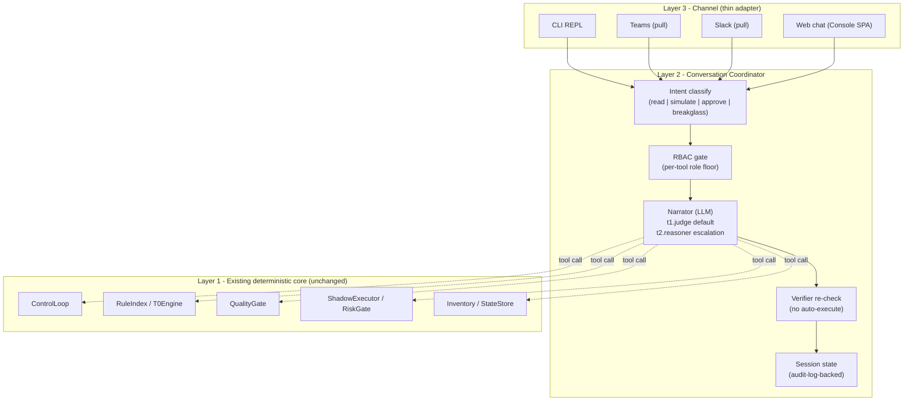

# 오퍼레이터 콘솔 (Conversational)

사람 오퍼레이터가 CLI, Teams, Slack, 웹 챗의 대화형 인터페이스로 FDAI에 **역으로 말할 수 있는** 방식입니다. 이 문서는
**대화형 surface**를 권위적으로 정의한다: 계층 아키텍처, tool 카탈로그, LLM
tier 모델, 세션 지속성, tool 별 RBAC, 안전 invariant, 현재 rollout status.

Push 방향 (시스템 → 사람) 알림은 [channels-and-notifications.md](channels-and-notifications-ko.md)에 있고,
읽기 전용 콘솔 SPA는
[project-structure.md § console/](../architecture/project-structure-ko.md#console-static-web-app)에 있습니다. Evidence provenance, stream recovery, localization 및 Architecture map resilience는 [console-evidence-and-resilience-ko.md](console-evidence-and-resilience-ko.md)가 소유합니다.

이 문서는 **pull 방향**, 즉 오퍼레이터가 묻고 시뮬레이션하고 승인하는 경로를 다룹니다.
Push와 pull은 같은 채널 credential과 audit 계약을 공유하지만 서로 다른 통합
surface입니다.

> 고객-무관: 아래의 모든 채널 id, LLM deployment 이름, 리소스 id, 그룹
> 이름은 placeholder. Fork는 config로 실제 값을 공급
> ([generic-scope.instructions.md](../../../.github/instructions/generic-scope.instructions.md)).

## 1. Framing - 무엇인가 (그리고 무엇이 아닌가)

오퍼레이터 콘솔은 **판단 authority 를 가지지 않는다**. FDAI의 판단
authority 는 이미 있는 곳에 그대로 남는다 - deterministic engine (T0),
quality gate (T2 verifier), risk gate, shipped Rego policy. 콘솔은
그 판단을 오퍼레이터가 검사하고, 변경을 시뮬레이션하고, 시스템이
이미 큐잉한 것을 승인하는 **대화형 surface** 이다.

세 property가 직접 따라온다:

- **LLM은 translator 이지 judge가 아님.** 자연어 in, tool call out; tool
  결과 in, 자연어 out. LLM은 execution eligibility를 절대 부여하지 않음 -
  오직 verifier만
  ([architecture.instructions.md § Design Principles](../../../.github/instructions/architecture.instructions.md#design-principles)).
- **Tool은 pipeline stage를 노출하고, primitive data source가 아님.**
  LLM이 진단으로 조합해야 하는 `query_log()` + `query_metric()` +
  `read_config()` 대신, 콘솔은 `describe_event()`, `explain_verdict()`,
  `simulate_change()`를 노출. 시스템이 이미 reasoning을 완료했음;
  오퍼레이터는 결과에 대해 묻는다.
- **성장은 카탈로그 성장이지, 모델 memory 성장이 아님.** 반복되는
  investigation 패턴은 discovery loop를 통해 새 룰 후보가 됨
  ([architecture.instructions.md § Rule Catalog](../../../.github/instructions/architecture.instructions.md#rule-catalog)) -
  불투명한 LLM 세션 memory가 아님. 대화 간에 persist 되는 모든 상태는
  `audit_log` + `operator_memory`에 살며, 감사가능 / export 가능 / CSP-중립.

### 1.1 공유 glossary에 추가된 어휘

다음 토큰들이
[architecture.instructions.md](../../../.github/instructions/architecture.instructions.md)
의 공유 어휘에 추가되며 참조하는 모든 문서에서 일관되게 사용된다:

- **operator-console** - 여기 문서화된 계층 surface.
- **narrator** - 오퍼레이터 콘솔의 LLM tier (translator 역할; judge 절대
  아님). T2 quality-gate 역할과는 별개 - 그건 제안된 액션에 대한 도메인
  reasoner.
- **operator-conversation** - 오퍼레이터와 콘솔 사이의 bounded exchange
  하나 (멀티-turn, RBAC-scoped, 감사됨).
- **console-tool** - narrator가 호출 가능한 노출된 pipeline stage 또는
  카탈로그 view 하나.

## 2. 3-layer 아키텍처

- **Layer 3 (Channel)**은 얇습니다. Adapter는 wire format과 `ConversationTurn` 사이에서 한 turn을
  변환하며 판단하지 않습니다. Streamed read는 provider task가 idle인 동안 progress 또는 evidence가
  없는 SSE comment heartbeat를 전송합니다. Stream을 닫으면 해당 task를 cancel하고 await합니다.
- **Layer 2 (Coordinator)**는 intent classification, RBAC gating, tool
  dispatch, verifier re-check, 세션 bookkeeping을 소유합니다. Core translator는 `Narrator`
  Protocol, web generation은 read API backend seam이므로 deployment가 provider를 바인딩할 수 있습니다.
- **Layer 1 (Core)**은 이미 shipping 중인 deterministic core 그대로.
  콘솔은 새 판단 경로, 새 지속성 저장소, 새 execution vector를 추가하지
  않는다. 콘솔 tool call은 기존 pipeline이 이미 만드는 법을 아는 call
  로 resolve.

### 2.1 모듈 맵

- [`src/fdai/core/conversation/`](../../../src/fdai/core/conversation)
  - `coordinator.py` - `ConversationCoordinator` (Layer 2 orchestrator).
  - `tools.py` - `ConsoleTool` Protocol + per-tool 구현체가 Layer 1
    모듈에만 delegate.
  - `narrator.py` - sync `Narrator` Protocol, deterministic verb schema와 RBAC-scoped descriptor.
  - `session.py` - core/CLI용 disposable `ConversationSession` projection. Production web transcript는
    principal-scoped `ConversationHistoryStore`가 소유합니다.
- [`cli/`](../../../cli)
  - `src/repl.ts` - 공유 `POST /chat` coordinator를 사용하는 IME-safe
    stdin/stdout 채널입니다.
  - `src/cockpit.ts` - 동일한 coordinator에 self-describing 화면 snapshot을
    게시하는 live SSE presentation입니다.
- [`src/fdai/core/conversation/channel_gateway.py`](../../../src/fdai/core/conversation/channel_gateway.py)
  - Sender 인증, message idempotency claim, coordinator 호출을 수행하고 durable delivery 구성 시
    provider send 전에 complete response를 저장합니다. [Durable delivery](durable-conversation-delivery-ko.md)가 verified binding과 recovery를 담당합니다.
- [`src/fdai/delivery/channels/`](../../../src/fdai/delivery/channels)
  - `teams.py` - bearer-token verification 이후 Bot Framework activity를 normalize하고 reply에
    injected publisher를 사용합니다. Payload가 제공한 reply URL을 신뢰하지 않습니다.
  - `slack.py` - timestamped Slack request signature를 검증하고 replay 또는 bot-authored event를
    차단하고 message를 normalize하고 reply에 injected publisher를 사용합니다.
  - Web chat은 인증된 read-console chat API를 계속 사용합니다. 전용 WebSocket adapter는 선택적
    future transport 작업으로 남습니다.
- Scheduler Runs, Automation Blueprints, Scheduled Continuations, [관리형 trajectory dataset](governed-trajectory-datasets-ko.md), [execution backend status](execution-backends-ko.md)는 read-only metadata를 제공합니다. 이 view에는 enable, submit, retry, cancel, cleanup, execute, approval control이 없고 credential 및 Thor identity를 제외하며 command는 SPA 밖에 유지됩니다.
- [`tools/chat.py`](../../../tools/chat.py) - core coordinator를 위한 headless
  JSONL 개발 harness입니다. 별도 policy 구현이 아닙니다.

CSP-중립 규칙은 그대로 유지: `core/conversation/`은 **오직** Protocol만
import. 모든 Azure SDK / httpx / Bot Framework 호출은 `delivery/` 아래
거주.

## 3. Tool 카탈로그

Tool은 **pipeline-stage view** 입니다. Core tool은 안정된 name, bounded `argument_hint`,
RBAC floor, side-effect class와 문서화된 failure surface를 가집니다. Web/provider-specific tool은
자체 typed request contract를 추가할 수 있습니다. 새 tool은 additive이며 rule이나 policy를
override하지 않습니다.

`RuntimeToolDiscovery`는 installed narrator schema에 search 및 describe를 제공합니다. Schema
metadata와 실제 installed tool name의 교집합을 만들고 coordinator와 동일한 RBAC ladder를
적용하며 name, verb, description, argument hint, RBAC floor, side-effect class만 반환합니다.
낮은 role principal은 높은 role tool을 discover할 수 없고 descriptor에는 handler 또는 invocation
capability가 없습니다. Discovery는 navigation을 개선할 뿐 새 authority를 부여하지 않습니다.

같은 projection은 deterministic channel verb `search_tools`, `describe_tool`과 typed read RPC
method `tools.search`, `tools.describe`로 제공됩니다. Channel call은 resolved `Principal`을
사용하고 RPC call은 caller가 제공한 role parameter가 아니라 server-authorized scope에서 role을
도출합니다. 두 surface 모두 descriptor만 반환하며 target을 invoke할 수 없습니다.

### 3.1 Day-1 tool 집합 (read-only + explain)

| Tool | 목적 | RBAC 하한 | Delegates to |
|------|---------|-----------|--------------|
| `describe_event(payload)` | 하나의 이벤트를 `EventIngest → TrustRouter → T0Engine`로 in-memory 실행 (PR 없음, audit write 없음); 결과 routing 결정 + 후보 룰 id 반환. | Reader | `EventIngest`, `TrustRouter`, `T0Engine` |
| `explain_verdict(event_id)` | 이미 처리된 이벤트의 audit trail을 읽어; tier, decision, citing 룰 id, verifier 리포트, mode 반환. | Reader | `StateStore.query_audit()` |
| `explore_catalog(query)` | Shipped rule 카탈로그 / action-type 카탈로그 / ontology 어휘를 id, keyword, 또는 resource_type으로 검색. | Reader | 로딩된 카탈로그 (I/O 없음) |
| `query_audit(filters)` | 구조화된 audit query: event id, actor, decision, mode, 시간 window 별. Paginate. | Reader | `StateStore.query_audit()` |
| `query_inventory(resource_type, filter)` | Server-owned Azure inventory-view count, list, type, location, resource-group, name, status, relationship query입니다. 제한된 allowlist field, active view, snapshot source/freshness만 반환하고 local VM 상태는 `az vm list --show-details`에서 읽으며 provider 실패는 unavailable로 표시합니다. | Reader | `InventoryGraphProvider` |
| `query_subscription_health()` | Server-configured Azure reader scope에서 Resource Graph inventory와 Resource Health를 병렬 query한 다음 bounded representative metric을 확인합니다. Caller-supplied scope를 허용하지 않고 명시적인 finding, coverage gap, freshness 및 truncation을 반환합니다. | Reader | `SubscriptionHealthProvider` |
| `capture_browser_evidence(policy_id, policy_version, source_url, stable_selectors)` | 정확한 server-owned policy 아래에서 credential이 없는 bounded capture를 submit합니다. Immutable artifact receipt를 반환하며 page 또는 interaction API를 반환하지 않습니다. | Reader | `BrowserEvidenceCaptureService` |

**Reader-하한 tool은 증명 가능하게 side-effect-free.** `describe_event`는
`EventIngest -> TrustRouter -> T0Engine`을 **메모리 내에서만** 실행: T1
embedding lookup, T2 모델, 외부 adapter, 어떤 mutation surface도
호출하지 않고, PR과 audit entry를 write 안 함. 그 `side_effect_class`는
`read` 이며, shadow-mode test가 executor / PR adapter / state store를 절대
건드리지 않음을 assert. 이것이 Reader 하한에서 안전한 이유입니다. Browser capture는 [브라우저 근거 수집](browser-evidence-ko.md) 계약을 따르며 Bragi는 browser handle을 받지 않습니다.

### 3.2 Week-1 추가 (write / approve / runbook)

| Tool | 목적 | RBAC 하한 | 참고 |
|------|---------|-----------|-------|
| `simulate_change(scenario)` | End-to-end `ControlLoop.process()`를 **shadow** mode로; publish 없이 executor outcome + 생성된 PR intent 반환. | Contributor | Shadow-only; 여전히 audit entry를 남김 → 오퍼레이터가 `query_audit`로 찾을 수 있음. |
| `approve_hil(approval_id, decision, justification)` | 큐잉된 HIL item 하나 해결. Verifier + `no_self_approval` invariant 재확인. | Approver | Approver 그룹; [security-and-identity.md](../architecture/security-and-identity-ko.md)의 PR gate enforcement와 동일 principal. |
| `list_hil()` | 호출자의 role에 visible 한 현재 큐잉된 HIL item 반환. | Approver | Reader-visible은 non-approver 에게 intent를 leak; Approver-scoped 유지. |
| `run_runbook(name, params, dry_run)` | `docs/runbooks/` 아래 하나의 runbook 실행. `dry_run=true`는 Contributor 요구; `dry_run=false`는 Owner 요구. | Contributor / Owner | 구체 runbook adapter (예: `db_dr_drill_cli`)는 이미 shipping; 이 tool은 이름으로 route. |
| `activate_break_glass(reason, expiry)` | TTL과 사유를 검증하고 Owner page 및 audit receipt를 생성합니다. | Reader | 현재 구현은 session principal/role을 변경하지 않으며 실제 elevation은 제공하지 않습니다. |

write 집합에 대한 두 명확화:

- **`simulate_change`가 audit entry를 write 하는 것은 "shadow는 절대
  mutate 안 함"을 위반하지 않음.** audit log는 append-only; *simulation이
  실행되었다는 것*을 기록하는 것은 관리 리소스의 mutation이 아니다.
  shadow-mode property test는 executor / PR / state-store write가 없음을
  assert 하며 audit append는 명시적으로 허용.
- **`list_hil` (Approver) vs read-console HIL view (Reader)는 다른
  surface.** read-only 콘솔 SPA는 Reader 에게 큐잉된 HIL item의 *존재와
  개수* (대시보드 tile)를 보여줌; `list_hil`은 *전체 item 상세* (target,
  proposed action, requester)를 반환하며 이는 민감한 intent를 드러낼 수
  있으므로 Approver-scoped 유지. 둘은 의도적으로 같은 가시성이 아님.

### 3.3 Month-1 추가 (관찰 depth)

| Tool | 목적 | RBAC 하한 | 의존 |
|------|---------|-----------|-------------|
| `query_log(query, window)` | Bounded single-workspace Log Analytics KQL query. | Reader | 신규 `AzureMonitorAdapter` |
| `query_metric(namespace, metric, window, aggregation)` | Azure Monitor metrics API. | Reader | 신규 `AzureMonitorAdapter` |
| `query_deployments(window)` | Git + ARM deployment-history join. | Reader | 신규 `DeploymentHistoryAdapter` |
| `correlate_incident(incident_id)` | 하나의 incident id에 대해 ingest event + audit + inventory + log + metric을 multi-signal correlate. | Reader | 위 셋 + `event_ingest` |

Month-1 추가는 콘솔을 multi-signal 인시덴트 대응 경험에 가깝게
만들어 주지만, 여전히 **이미 correlate 된** 결과를 surface;
correlator는 Layer 1에 살고, narrator 안에 살지 않는다.

### 3.4 Tool discovery 계약

각 tool은 다음을 선언:

- `name` - CLI-friendly snake_case verb (`describe-*` / `explore-*`
  접두사 taxonomy 없음; verb 자체가 카테고리).
- `description` - 한 문장, 영어, 마케팅 언어 없음.
- `argument_hint` - canonical verb parser가 기대하는 bounded argument shape. 각 tool은 호출 전
  자신의 typed/bounded validation을 다시 적용하며 invalid argument는 partial call로 진행하지 않습니다.
- `rbac_floor` - tool을 호출 MAY 하는 가장 낮은 role.
- `side_effect_class` - `read` / `simulate` / `approve` / `execute` /
  `breakglass`. Audit entry가 이 class를 carry 하므로 downstream
  analytics가 저렴하게 slice.
- `failure_modes` - tool의 docstring에 문서화된 타입화된 error surface.

`RuntimeToolDiscovery`와 `tools.search`/`tools.describe`는 handler나 invocation capability 없이
descriptor만 반환합니다. Narrator는 principal role에 허용된 같은 descriptor 목록만 봅니다.

## 4-6. 런타임 모델 (Narrator, DI seam, 세션 모델)

focused owner 문서로 이동했습니다: [operator-console-runtime-model-ko.md](operator-console-runtime-model-ko.md). Narrator LLM tier 모델(section 4), DI seam(section 5), 세션 모델 및 memory(section 6)를 다룹니다.

### 6. Session model + memory

[operator-console-runtime-model-ko.md#6-세션-모델--memory](operator-console-runtime-model-ko.md#6-세션-모델--memory) 참조.

## 7. 안전 invariant (chat은 이를 약화시키지 않음)

[coding-conventions.instructions.md § Safety](../../../.github/instructions/coding-conventions.instructions.md#safety)
의 4 autonomy invariant는 변경 없이 적용. Chat은 그 위에 자체적으로 3개를
추가.

### 7.1 기존 4 invariant

매 write-class tool call (`simulate_change` in enforce mode - 오늘 허용
안 됨 -, `approve_hil`, `run_runbook --live`)은 다음을 carry MUST:

1. **Stop-condition** - 기저 ActionType이 이미 하나를 선언; 콘솔은 추가
   하거나 제거하지 않음.
2. **Rollback path** - ActionType의 `rollback_contract` 재사용.
3. **Blast-radius limit** - ActionType의 `blast_radius` 블록 재사용;
   오퍼레이터는 자연어로 이를 widen 할 수 없음.
4. **Audit entry** - tool이 실제로 dispatch 하기 전에 coordinator가
   write.

### 7.2 Chat 특화 3 invariant

5. **매 write-class tool call 에서 verifier re-check.** Narrator가 write-
   class tool을 겨냥하는 `tool_calls` frame을 emit 한 후, coordinator는
   tool 인자에 대해 T0Engine + policy-as-code check를 재실행. Abstain /
   deny 시, tool call은 drop 되고 turn은 HIL로 fall through (§7.4 참조).
   이것이 "LLM은 execution eligibility를 절대 부여하지 않는다" 뒤의
   mechanical guarantee.
6. **Chat-scoped no self-approval.** `approve_hil`은 caller의 Entra
   `oid`가 큐잉된 item에 recorded 된 requester와 매치하면 caller가
   Owner를 holding 하고 있어도 refuse. PR gate
   ([security-and-identity.md](../architecture/security-and-identity-ko.md))와 동일한
   invariant; chat은 refuse 시 audit reason에 invariant 이름을 추가.
7. **BreakGlass 요청은 time-boxed 이고 명시적이어야 함.**
   `activate_break_glass`는 `(reason, expiry <= 4h)` 요구하고 configured
   Owner 모두에게 push-방향 Slack/Teams adapter
   ([channels-and-notifications.md](channels-and-notifications-ko.md))로
  페이지. Silent elevation 없음. **요청은 알림에 대해 fail-closed:**
   primary pager 채널이 down 이면 coordinator는 configured fallback 채널을
  시도; *어느* 채널도 달리버리를 확인하지 못하면 요청은 **거부**
   (audit 증인 없는 break-glass는 지연된 긴급보다 더 위험), 거부 자체도
  audit 되어 Owner가 시도를 볼 수 있음. 현재 shipped tool은 pager/audit receipt만 반환하고
  `ConversationSession`, `Principal`, RiskGate role axis를 변경하지 않으므로 승인 자격도 raise하지
  않습니다. 실제 session-scoped grant store와 dispatch integration이 추가되기 전에는 elevation이
  발생하지 않는 fail-safe 상태입니다. 향후 grant도 `auto`를 절대 반환하거나 자기 요청 승인을
  허용하면 안 됩니다(invariant 6 유지). 정확한 자격 의미는
   [user-rbac-and-identity.md § 2](user-rbac-and-identity-ko.md#2-롤-모델-4-tier--break-glass)
   에 정의되고 RiskGate role axis
   ([execution-model.md § 2.5](../decisioning/execution-model-ko.md#25-axis-f---role-rbac))가 mirror.

### 7.3 BreakGlass request receipt

현재 `ActivateBreakGlassTool` 결과는 `activated_at`, `expires_at`, redacted reason,
`pager_receipt`, `audit_id`를 포함합니다. `max_ttl_seconds` 기본/상한은 `14400`이며 adapter 생성 시
더 큰 값은 거부합니다. 이 결과는 authorization grant record가 아니며 session 종료/expiry를
enforcement하는 persistent grant store도 아직 없습니다. 따라서 어떤 downstream path도 이를
elevation evidence로 사용하면 안 됩니다.

### 7.4 LLM이 write를 제안할 때 사람 승인 fall-through

Narrator는 오퍼레이터가 "그냥 fix 해" 라고 말할 때
`run_runbook(dry_run=false)` 또는 `approve_hil`을 위한 `tool_call`을
emit MAY. Verifier re-check (invariant 5) 시:

- Verifier pass AND RBAC 충족 → tool call 진행.
- Verifier abstain 또는 RBAC 하한 미달 → coordinator는 기존 HIL 큐에
  review item을 file 하는 `enqueue_hil(...)` call로 substitute 하고
  오퍼레이터에게 "HIL item id X를 file 했어" 반환.
- 어떠한 상황에서도 dispatch 전 audit entry 없이 write는 발생하지 않음.

## 8. 채널 통합 (push vs pull)

채널 추상화 ([channels-and-notifications.md](channels-and-notifications-ko.md))
는 이미 push (시스템 → 사람)을 처리. 이 문서는 pull 방향 (사람 → 시스템)
을 push adapter와 **별개 adapter 및 config contract**로 제공합니다. Deployment는 같은 secret
provider 또는 workload identity를 재사용할 수 있지만 outbound notification matrix와 inbound
conversation enablement를 하나의 routing config로 합치지 않습니다. 분리가 중요한 이유는
send-only와 receive-plus-send의 trust posture 및 blast radius가 다르기 때문입니다.

공유 pull-direction contract, gateway, Slack signed ingress, Teams authenticated activity
normalizer, bounded Starlette route, Slack Web API publisher, Teams Bot Framework publisher는
구현되었습니다. Slack route는 timestamped signature를 검증합니다. Teams route는 activity JSON
parse 전에 injected bearer authenticator를 호출합니다. Reply publisher는 configured HTTPS
endpoint, injected app/workload credential, server-owned conversation resolution만 사용합니다.
`ProductionChannelRuntime`은 concrete Bot Framework JWT verifier, Teams principal resolver,
Slack secret/app credential, fixed endpoint publisher와 background gateway lifecycle을 조립합니다.
필수 credential 또는 identity binding이 없으면 traffic 전 startup에서 실패합니다. 이 binding은
`delivery/`에 유지되며 coordinator를 변경하지 않습니다.

`ChannelAccessService`는 해당 principal resolver의 sender-access foundation입니다. 각 channel은
`disabled`, `allowlist`, `pairing`을 선택합니다. Unknown sender는 principal로 resolve되지 않고
coordinator에 도달하지 않습니다. Pairing mode는 bounded expiring challenge를 발급하고 SHA-256
digest만 저장하고 channel별 pending request를 제한하고 별도 authorized approver를 요구하고
code를 constant time으로 검증하고 approved sender를 기존 FDAI principal에 mapping합니다.
Disabled 및 allowlist mode는 sender를 self-enroll하지 않습니다. PostgreSQL store는 replica 간
pending cap과 approval transition을 atomic하게 강제합니다. Native challenge delivery는 원래
thread에 reply하고 delivery 실패 시 pending digest를 조건부 삭제합니다. Code는 저장되거나
response metadata에 포함되지 않습니다.

`CrossChannelIdentityLinkService`는 두 channel sender가 같은 principal에 각각 독립 pairing된
후에만 explicit relation을 기록합니다. Same-channel link, self-approval, unapproved endpoint,
서로 다른 두 principal을 연결하려는 시도를 거부합니다. Durable link는 idempotent하며 principal
record, role, session, audit history를 merge하지 않습니다.

| 채널 | Push (기존) | Pull (이 문서) | 공유 config |
|---------|-----------------|-----------------|---------------|
| Teams | A1 HIL 및 outbound notification adapter | `TeamsBotChannel` + authenticated bounded activity route + workload-identity reply publisher + principal binding | 일부 identity/secret provider를 배포에서 재사용 가능 |
| Slack | `SlackWebhookChannel` 및 A1 adapter | `SlackBotChannel` + signed Events API route + fixed-endpoint Web API reply publisher | 일부 secret provider를 배포에서 재사용 가능 |
| Email | send-only | (계획 없음; 비동기, 인터랙티브에 부적합) | n/a |
| Webhook | send-only | (계획 없음; 호출자가 인터랙티브 protocol을 자체 소유해야) | n/a |
| Pager (PagerDuty) | send-only | (계획 없음) | n/a |
| SMS | send-only | (계획 없음) | n/a |
| Web chat | n/a | authenticated `POST /chat` 및 `POST /chat/stream` SSE | Console SPA/read API config |
| CLI | n/a | stdin/stdout UI가 shared read API `/chat` 호출 | local auth/read API config |

### 8.1 분리된 channel configuration

[`config/notifications-matrix.yaml`](../../../config/notifications-matrix.yaml)은 outbound
notification routing만 소유합니다. Conversation channel은 `FDAI_SLACK_CHANNEL_ENABLED`,
`FDAI_TEAMS_CHANNEL_ENABLED`, secret reference, Teams identity/principal binding, queue-capacity
contract를 별도로 사용합니다. Shared credential backend는 config ownership을 합친다는 뜻이 아닙니다.

## 9. 성장 모델 (catalog + operator memory)

콘솔은 시간이 지남에 따라 세 가지 결정론적 mechanism으로 나아진다.
모델-측 학습은 그 중 하나가 **아니다**.

### 9.1 Day 1

Day-1 콘솔은 답변 가능:

- "`example-rg`의 `network.nsg`에 어떤 룰이 적용되지?"
  → `query_inventory` + `explore_catalog`.
- "왜 event `<id>`가 HIL로 route 됐어?" → `explain_verdict`.
- "지난 24시간 `object-storage.public-access.deny`의 모든 audit entry를
  보여줘." → `query_audit`.
- "public access enabled로 storage account를 create 하면 loop이 뭘
  할까?" → `describe_event`.

Write 없음, runbook 없음, approval 없음 - 오리엔테이션만.

### 9.2 Week 1

`simulate_change`, `approve_hil`, `run_runbook --dry-run`, Teams / Slack
pull adapter 추가. 콘솔은 이제:

- End-to-end 변경을 shadow로 preview.
- PR flow가 사용하는 것과 동일한 identity gate로 큐잉된 HIL item 해결.
- 어느 채널에서든 shipped runbook ([docs/runbooks/](../../runbooks))을
  트리거.

### 9.3 Month 1

관찰 depth tool (§3.3)과 discovery-loop hook 추가:

- 같은 tool-argument shape이 rolling window 에서 구별되는 principal을
  가로질러 N 번 나타날 때 coordinator는 `console.recurrent_query` 시그널
  을 discovery-loop 입력 스트림에 publish (N은 configured; 기본 5 / 주).
- Rule-candidate generator ([rule-governance.md](../rules-and-detection/rule-governance-ko.md))
  가 여느 시그널처럼 그것을 받음; 결과 룰은 동일한 promotion pipeline을
  통해 shadow-first로 ship.

결과는 chat의 common investigation 패턴이 카탈로그의 first-class 룰이 됨 -
**콘솔은 카탈로그를 성장시키지, 자신을 성장시키지 않는다**.

## 10. Rollout reconciliation

초기 Day/Week/Month 계획은 구현 순서를 설명한 역사적 정보이며 현재 availability source가 아닙니다.

| Slice | 현재 상태 |
|-------|----------|
| Core/CLI translator | `Narrator`, `AzureOpenAINarratorModel`, coordinator, read tools, Python headless harness 및 shared-API TypeScript CLI가 제공됩니다. |
| Write/approval tools | simulate, HIL, runbook, proposal route가 제공됩니다. Break-glass는 §7.3의 pager/audit request receipt까지만 제공하며 elevation은 없습니다. |
| Teams/Slack conversation | `ProductionChannelRuntime`, authenticated ingress, principal resolution, publisher, durable reply option이 제공됩니다. 실제 배포 enablement/credential은 environment-owned입니다. |
| Web chat and memory | JSON/SSE chat, principal-scoped conversation history/preferences/memory, AnswerPlan 및 progressive verification이 제공됩니다. |
| Observation/discovery | `POST /read-investigations`는 Azure I/O 전에 durable latency evidence로 direct, streamed, detached execution을 선택합니다. Direct Command Deck 및 HTTP read는 owner-scoped result-replay ledger를 공유하며 streamed response가 닫히면 in-flight read를 cancel합니다. Dedicated reader binding이 있을 때만 등록되며 catalog presence만으로 provider health나 promotion을 주장하지 않습니다. |

Live Azure completion evidence와 capability promotion은 여전히 authoritative registry 및 deployment
verification에서 판단하며 이 문서의 phase 이름으로 추론하지 않습니다.

## 11. Testability

- **Coordinator** - property test: "verifier re-check는 매 write-class
  tool call 에서 실행", "RBAC 하한은 narrator가 tool 스키마를 보기 전에
  강제됨", "audit entry는 매 tool dispatch를 선행", "escalation은 tier
  와 trigger를 기록".
- **Narrator adapter** - Azure OpenAI endpoint 용 `httpx.MockTransport`를
  사용한 strict translator contract와 resolved deployment binding 검증.
- **Tool** - 각 tool은 `side_effect_class == read | simulate` 일 때 절대
  mutate 하지 않음을 보이는 shadow-mode test; `write` / `approve` test는
  verifier re-check gate를 보임.
- **Channel** - CLI REPL golden transcript, Teams Bot Framework activity/JWT, Slack signed HTTP
  Events API와 publisher receipt를 adapter test로 검증.
- **RBAC 매트릭스** - §3.1-§3.3의 하한이 적용됨을 증명하는 모든 (Role ×
  Tool) 셀에 대한 table-driven test.
- **Break-glass** - `activate_break_glass`가 `expiry > 4h`를 refuse하고 Owner notification 및
  audit receipt를 요구하며 session principal을 변경하지 않음을 증명하는 test. Persistent grant와
  session-end revocation은 아직 shipped contract가 아닙니다.
- **결정론성** - 같은 CLI transcript를 fake `Narrator`로 두
  번 실행하면 byte-identical audit trail을 생성 (고정된 timestamp와
  idempotency key 하에서).
- **세션 복구** - principal-scoped `ConversationHistoryStore`에서 session id로 이전 turn을
  reload하고 stable request idempotency가 duplicate append를 막는지 검증. Audit/ontology에는
  raw transcript가 아니라 hash와 reference만 남습니다.

## 12. 실패 모드

- **Narrator unavailable** - Chat T0 direct-hit로 fall through; turn이
  T0 패턴에 매치되지 않으면, canned "reasoning layer가 일시적으로
  unavailable; 다음은 direct query surface"로 응답하고 tool 목록 노출.
- **Write-class tool에 verifier abstain** - `enqueue_hil(...)`로
  substitute (§7.4 참조), HIL id 반환, audit reason `verifier_abstained`.
- **채널 adapter disconnect** - durable delivery가 구성되면 complete response와 terminal/ambiguous
  상태를 ledger에 남깁니다. 구성되지 않은 direct path도 durable conversation history를 session id로
  재개하지만 provider send를 exactly-once로 주장하지 않습니다.
- **Break-glass request receipt** - 현재 coordinator는 receipt를 elevated capability로 해석하지
  않습니다. 향후 grant integration은 매 tool call에서 TTL을 재검사하고 만료 시 refuse해야 합니다.
- **Tool 구현 raise** - tool의 타입화된 error surface (§3.4)가
  `ToolResult(status=error)`로 wrap; narrator는 exception traceback이
  아닌 구조화된 error를 봄.

## 13. 데이터 + wire 계약

focused owner 문서로 분리했습니다:

- [operator-console-wire-contracts-ko.md](operator-console-wire-contracts-ko.md) - audit entry, CLI REPL, approval callback(13.1-13.3), action submit, Python VM workbench, 그라운딩된 코드, 온톨로지 projection(13.6-13.9).
- [operator-console-view-snapshot-ko.md](operator-console-view-snapshot-ko.md) - self-describing screen 계약(13.4).
- [operator-console-incident-roster-ko.md](operator-console-incident-roster-ko.md) - 인시던트 목록 및 교정 이력(13.5).

## 14. MCP delivery 및 managed catalog

FDAI는 `src/fdai/delivery/mcp/` 아래 managed outbound catalog를 통해 외부 hosted MCP tool을
사용할 수 있습니다. Server는 disabled 상태로 install됩니다. Enable은 non-invoking
`tools/list` discovery를 실행하고 모든 ActionType-to-tool allowlist entry를 검증합니다.
Catalog mutation은 durable revision-CAS snapshot을 사용하며 manifest, health, revision, admin
audit record는 한 PostgreSQL transaction에서 commit됩니다. Periodic monitor가 health transition을
기록하고 enabled 및 healthy server만 routable합니다. Endpoint validation은 credential, query,
fragment, non-loopback plaintext HTTP를 거부합니다.

이 outbound catalog는 FDAI 자체를 MCP server로 publish하는 것과 구분됩니다. 현재 repository는
inbound MCP server process, `list_tools`/`call_tool` wire endpoint, external MCP principal mapping을
ship하지 않습니다. 따라서 fork가 문서만 근거로 FDAI tool을 MCP client에 expose하면 안 됩니다.

향후 inbound MCP proposal은 additive하게 같은 coordinator/RBAC를 재사용하고 anonymous caller를
거부하며 mTLS 또는 audience-scoped Entra token을 service `Principal`에 mapping하고 audit해야 합니다.
이것은 current capability가 아니라 별도 threat model, protocol, test, deployment gate가 필요한
future scope입니다.

## 15. Decision status

- **OD-C1 resolved** - strict core narrator prompt는 `AzureOpenAINarratorModel` code가 소유하고,
  broader prompt catalog는 `rule-catalog/prompts/base`, `packs`, `scenarios`, `tools` 구조를 사용합니다.
- **OD-C2 resolved** - principal-scoped user memory/preference와 별도 governed operator memory schema,
  provenance, consent, retention path가 구현되어 있습니다.
- **OD-C3 residual** - §7.3처럼 persistent BreakGlass grant/elevation은 아직 구현되지 않았습니다.
  향후 설계는 no-self-approval을 유지하고 distinct approver requirement를 별도로 승인해야 합니다.
- **OD-C4 current behavior** - CLI history는 process memory에서만 bounded navigation을 제공합니다.
  Persistent history file과 retention/redaction contract는 shipped 기능이나 현재 CLI의 blocker가 아닙니다.

## 16. 관련 문서

- [architecture.instructions.md](../../../.github/instructions/architecture.instructions.md) -
  trust routing, verifier authority.
- [action-ontology.md](../decisioning/action-ontology-ko.md) - 콘솔이 emit 하는
  `trigger_kind=operator_request` 축을 가진 ActionType 스키마 + coordinator
  가 validate 하는 `argument_schema`.
- [execution-model.md](../decisioning/execution-model-ko.md) - chat verifier re-check
  (§7.2)가 invoke 하는 통합 RiskGate + 모든 write-class tool call에
  대해 auto / HIL / deny를 결정하는 5-axis authority 매트릭스.
- [channels-and-notifications.md](channels-and-notifications-ko.md) - 이
  문서의 pull 측이 확장하는 push-방향 채널 매트릭스.
- [user-rbac-and-identity.md](user-rbac-and-identity-ko.md) - tool 매트릭스
  (§3)가 참조하는 RBAC role 집합.
- [security-and-identity.md](../architecture/security-and-identity-ko.md) - no-self-
  approval, execution identity, 안전 invariant.
- [prompt-composition.md](../decisioning/prompt-composition-ko.md) - narrator prompt
  layering, tool-schema 노출, Month 1이 소비 MAY 하는 debate
  orchestrator (Wave 4.5).
- [rule-governance.md](../rules-and-detection/rule-governance-ko.md) - Month-1 콘솔이 feed 하는
  discovery loop.
- [project-structure.md § console/](../architecture/project-structure-ko.md#console-static-web-app) -
  Month-1 web-chat 채널이 확장하는 read-only 콘솔 SPA.
