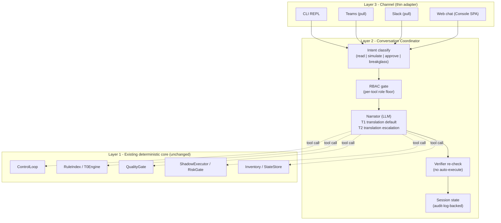

# FDAI Console 대화

사람 오퍼레이터가 CLI, Teams, Slack, 웹 챗을 통해 FDAI에 **역으로 말할 수 있는** 방식입니다. 별도
제품이 아닌 FDAI Console의 **대화형 표면**로서 계층 아키텍처, 도구 카탈로그, LLM tier, 세션
지속성, 도구별 RBAC, 안전 invariant, 롤아웃 상태를 정의합니다.

Push 방향 (시스템 → 사람) 알림은 [channels-and-notifications.md](channels-and-notifications-ko.md)에 있고,
운영 화면과 요청은 [console-operations-ko.md](console-operations-ko.md)에 정의되며 SPA는
[project-structure.md § 콘솔/](../architecture/project-structure-ko.md#console-static-web-app)에 있습니다. 근거 출처 이력, 스트림 복구, localization 및 아키텍처 지도 복원력은 [console-evidence-and-resilience-ko.md](console-evidence-and-resilience-ko.md)가 소유합니다. Login 초기화는 역할이 할당된 principal의 접근을 검증된 App 역할에서 도출하고 선택적 access-request 변환 결과를 요구하지 않으며, 역할이 없을 때 해당 변환 결과가 사용 불가이면 접근을 계속 차단합니다. 로컬 개발의 독립 서비스 어댑터는 모델 서술에만 Azure CLI를 사용할 수 있고 provider-read 또는 실행 권한은 없습니다. 온톨로지 맵은 `rule-catalog`와 `PANTHEON_SPECS`에서 생성된 하나의 카탈로그 지식 그래프를 렌더링하며 아키텍처 또는 런타임 인벤토리를 읽지 않습니다.
Settings > Integrations에서는 합성 자리 표시자로 운영 incident-open 이메일 렌더러를 미리 볼 수 있습니다. 이 GET-only 미리 보기는 이메일을 보내거나 승인 또는 실행 권한을 부여하지 않습니다.
인증된 active-incident 스트림은 idle Command Deck을 인시던트 선택자와 함께 열 수 있습니다. 이 선택자는 표현 힌트일 뿐이며 서버는 답변 전에 영속 인시던트와 근거를 다시 해석합니다.
Tab과 Deck이 idle 상태이면 브라우저에서 인시던트를 처음 관찰할 때 localized 읽기 전용 조사 턴을 한 번 제출합니다. Browser-local 인시던트 원장은 reload 뒤 재생을 억제하며, 인시던트 배지를 누르면 명시적으로 다시 조사할 수 있습니다.
인시던트 질문이 여러 기록과 같은 정도로 일치하면 최종 답변은 plain-text 안내 대신 범위가 제한된 후보 버튼을 포함합니다. 버튼은 해당 후보의 exact 인시던트 대화를 열고 localized 읽기 전용 조사 턴을 즉시 제출합니다.
버튼 click은 운영자의 명시적인 요청입니다. 자동 active-incident 스트림 열림은 managed-resource 액션을 제출하지 않습니다.

이 문서는 **pull 방향**, 즉 오퍼레이터가 묻고 시뮬레이션하고 승인하는 경로를 다룹니다.
Push와 pull은 같은 채널 자격 증명과 감사 계약을 공유하지만 서로 다른 통합
표면입니다.

> 고객-무관: 아래의 모든 채널 id, LLM 배포 이름, 리소스 id, 그룹
> 이름은 자리 표시자. 포크는 구성으로 실제 값을 공급
> ([generic-scope.instructions.md](../../../.github/instructions/generic-scope.instructions.md)).
## 1. Framing - 무엇인가 (그리고 무엇이 아닌가)

FDAI Console 대화 표면은 **판단 권한을 가지지 않습니다**. FDAI의 판단
권한 는 이미 있는 곳에 그대로 남는다 - 결정론적 엔진 (T0),
quality gate (T2 검증기), risk gate, shipped Rego 정책. 콘솔은
그 판단을 오퍼레이터가 검사하고, 변경을 시뮬레이션하고, 시스템이
이미 큐잉한 것을 승인하는 **대화형 표면** 이다.

세 속성이 직접 따라온다:

- **LLM은 translator이지 judge가 아님.** 자연어는 도구 호출이 되고 도구 결과는 자연어가 되며 실행 적격성은 오직 검증기만 부여합니다
 ([architecture.instructions.md § Design Principles](../../../.github/instructions/architecture.instructions.md#design-principles)).
- **도구는 기본 데이터 출처가 아니라 파이프라인 단계를 노출함.** 콘솔은 primitive log, metric,
 config query 대신 `describe_event()`, `explain_verdict()`, `simulate_change()`를 노출합니다.
 시스템이 이미 reasoning을 완료했으므로 오퍼레이터는 결과에 대해 질문합니다.
- **성장은 모델 기억이 아니라 카탈로그 성장임.** 반복되는 조사 패턴은 발견 루프를 통해 새 룰 후보가 됩니다
 ([architecture.instructions.md § Rule 카탈로그](../../../.github/instructions/architecture.instructions.md#rule-catalog)) -
 불투명한 세션 기억으로 남지 않습니다. 영속 대화 상태는 감사와 내보내기가 가능한 CSP-중립
 `audit_log` 및 `operator_memory` record에 저장됩니다.

완료된 답변은 off-path [대화 Assurance](../decisioning/conversation-assurance-ko.md) 루프에도 들어갑니다. JSON과 SSE 어댑터는 타입이 지정된 conversation-turn 서비스와 분리된 요청 설정, 근거, 진행 상황, 검증 및 terminal-delivery 보조 로직을 공유하면서 기존 wire 계약을 유지합니다.
최종 intake는 exact 검증 사유와 evidence-manifest 완전성을 보존합니다. 결과 요약, 맥락 선택, Azure 조사, 영속 전달 및 첨부 근거는 타입이 지정된 프로바이더가 계속 소유하고 어댑터 모듈은 표현과 영속성만 조정합니다.
버전 1.2 semantic projection은 서비스 분리 전반에서 이 경계를 보존합니다. `answered`는 exact release, principal manifest, 계획, 실행 receipt, 근거 참조를 요구하며 의존성을 사용할 수 없으면 typed limitation을 반환합니다.
하나의 Operator-owned Event Hubs Kafka adapter가 all-or-none topic, command identity, 멱등적 bounded JSON, projection 영속 후 commit, sibling DLQ를 사용해 proposal을 publish하고 projection을 consume합니다.
Terraform은 request와 projection topic을 고정합니다. Core는 검증된 query table을 렌더링하고 Operator는 영속 result를 기존 `done` event로 변환합니다.
주입된 provider가 우선하며 local narrator와 semantic transport는 상호 배타적입니다.
Operator API는 검토를 준비된으로 표시하거나 카탈로그 제안을 만들거나 권한을 부여하지 않습니다. 잘못된 답변 보고는 자율 재평가 근거만 추가하며 통제된 transition에는 exact 재생 근거와 기존 카탈로그 수명 주기가 계속 필요합니다.
### 1.1 공유 glossary에 추가된 어휘

다음 토큰들이
[architecture.instructions.md](../../../.github/instructions/architecture.instructions.md)
의 공유 어휘에 추가되며 참조하는 모든 문서에서 일관되게 사용된다:

- **operator-console** - 여기 문서화된 계층 표면.
- **서술기** - 오퍼레이터 콘솔의 LLM tier (translator 역할; judge 절대
 아님). T2 quality-gate 역할과는 별개 - 그건 제안된 액션에 대한 도메인
 reasoner.
- **operator-conversation** - 오퍼레이터와 콘솔 사이의 범위가 제한된 exchange
 하나 (멀티-turn, RBAC-scoped, 감사됨).
- **console-tool** - 서술기가 호출 가능한 노출된 파이프라인 단계 또는
 카탈로그 화면 하나.

T2 실행 적격성 검사 또는 불충분한 근거 처리에 대한 설명형 질문은 action-context 또는
intent-graph 도구보다 정본 glossary를 먼저 사용합니다. 이 우선순위는 개념 설명에만
적용됩니다. 정확한 액션, 승인, 상관관계 또는 멱등성 선택자가 있는 질문은 계속
서버가 소유한 액션 수명 주기 근거가 필요합니다.

## 2. 3-layer 아키텍처

```mermaid
flowchart TD
 subgraph L3["Layer 3 - Channel (thin adapter)"]
  CLI["CLI REPL"]
  TEAMS_PULL["Teams (pull)"]
  SLACK_PULL["Slack (pull)"]
  WEB["Web chat (Console SPA)"]
 end
 subgraph L2["Layer 2 - Conversation Coordinator"]
  NARR["Narrator (LLM)\nT1 translation default\nT2 translation escalation"]
  INTENT["Intent classify\n(read | simulate | approve | breakglass)"]
  RBAC["RBAC gate\n(per-tool role floor)"]
  VERIF["Verifier re-check\n(no auto-execute)"]
  SESS["Session state\n(audit-log-backed)"]
 end
 subgraph L1["Layer 1 - Existing deterministic core (unchanged)"]
  CL["ControlLoop"]
  RULES["RuleIndex / T0Engine"]
  QG["QualityGate"]
  EXEC["ShadowExecutor / RiskGate"]
  INV["Inventory / StateStore"]
 end
 CLI --> INTENT
 TEAMS_PULL --> INTENT
 SLACK_PULL --> INTENT
 WEB --> INTENT
 INTENT --> RBAC --> NARR --> VERIF --> SESS
 NARR -.tool call.-> CL
 NARR -.tool call.-> RULES
 NARR -.tool call.-> QG
 NARR -.tool call.-> EXEC
 NARR -.tool call.-> INV
```

- **계층 3 (채널)**은 얇습니다. 어댑터는 wire format과 `ConversationTurn` 사이에서 한 턴을 변환하며 판단하지 않습니다. Streamed 읽기는 프로바이더 작업이 idle인 동안 진행 상황 또는 근거가
 없는 SSE comment 하트비트를 전송합니다. 스트림을 닫으면 해당 작업을 취소하고 대기합니다.
 Web, Slack 및 Teams는 같은 ordered agent-activity 계약을 렌더링합니다. Bragi는 인계를 표시하고, 책임 관찰기는 정본 명령/결과 근거를 표시합니다. 에이전트 대화 대상 또는
 인시던트 연결에서 선택했거나 `Ask <agent>` 또는 `@<agent>`로 지정한 에이전트는 응답 소유자로
 유지됩니다. 해당 에이전트가 판단을 보류하고 턴을 다시 인계한 경우에만 Bragi가 응답 소유자가
 됩니다.
 에이전트 카드의 Ask는 간결한 projected-state 줄 목록으로 시작합니다. 더 긴 고정 맥락은 백엔드 이력용으로 화면에 표시하지 않으며 visible 보고는 범위가 제한된 2단어 burst로 스트림합니다.
 Web 조사는 수신한 가지 프레임만 경과 시간, 타입이 지정된 배지 및 staggered 상태 행으로 animate합니다. 최종 조사는 최종 답변 옆에 세션 헤더와 관찰된 단계를 계속 표시하며 민감정보가 제거된 명령 출력과 시각만 공개에 접어 둡니다. 관찰된 실행 단계와 연결된 출처 가지는 별도 행으로 반복하지 않고 해당 단계에 한 번만 표시합니다. Full workspace는 desktop 대화 기록에 최소 760 px을 확보하고 mobile 뷰포트에서는 horizontal 초과분 없이 전체 폭을 사용합니다. Phase 표시, 15 px 대화 규모, 하나의 dark 명령/코드 표면으로 운영 hierarchy를 실행 mock과 맞춥니다. 브라우저는 작업을 재생하거나 진행 상황을 invent하지 않습니다.
 관찰된 활동은 필수 `input_kind` 계약으로 실제 프로세스 명령과 정본 서버 조회를
 구분합니다. 인벤토리, subscription-health 및 read-investigation 활동은 `query`를 사용합니다.
 검증기가 승인한 타입이 지정된 조회, 권한, 스냅샷 출처 이력 및 범위가 제한된 결과 변환 결과를 렌더링하며
 Azure CLI argv 또는 exit 코드를 만들지 않습니다. Web은 검증된 인벤토리 조회를 `IQL`로
 표시하며 출처와 결과 공개를 각각 닫습니다. Strict 범위가 제한된 증적은 Azure CLI와 ARG에
 같은 최종 icon을 사용하고 인증된 구독 id, 범용 argv, 측정된 명령 소요 시간, 개수
 및 허용 목록된 미리 보기 행 최대 10개를 표시하면서 페이지 나누기 토큰은 민감정보 제거합니다. 행은 snapshot-refresh 작업을
 식별하며 브라우저는 IQL에서 명령을 재구성하지 않습니다. 유효한 증적이 없으면 프로바이더 행도
 만들지 않습니다. 다른 서버 조회는 `QUERY`를 유지하고
 프로세스 호출을 기록한 프로바이더 증적만 `command`를 사용합니다. Slack, Teams 및 영속
 재생은 조회/명령 구분을 보존합니다.
 Narrator 이정표는 다음 그룹이 시작되기 전에 앞선 활동 그룹을 settled 상태로 바꿉니다.
 Web은 이정표를 간결한 진행 상황 note로 표시하고 현재 그룹만 펼치며 completed 그룹을 causal
 순서로 복원합니다. Slack과 Teams는 같은 cumulative 민감정보가 제거된 활동 변환 결과를 수정합니다.
 일반 에이전트 대상과 인시던트 연결의 에이전트 값은 일치해야 하며 conflict는 근거 수집 전에 차단됩니다. Model-backed 답변은 global 읽기 전용 안전성을 먼저 유지하고 exact `conversation_policy` 일치에서만 선택된 변경할 수 없는 charter를 추가합니다. Dedicated 대상 세션은 후속 조치 턴 전반에서 검증된 에이전트 voice를 사용하고 self-role 질문은 내용 기반 주소를 가진 기능 사실에서 결정론적으로 렌더링하며, 일반 화면 위임은 Bragi 서술기를 유지합니다.
 Policy mismatch 또는 명시적 인계는 서술을 Bragi로 돌려보내며 charter는 근거, 권한 또는 도구 권한이 되지 않습니다. 주입되는 charter는 해당 턴용 변경할 수 없는 기준선과 operator-locale 계층으로 조립됩니다. 에이전트 근거는 해당 에이전트 턴의 프롬프트 계층 매니페스트와 다이제스트도 제공하므로 소진된 에스컬레이션 예산이나 근거 공백이 제약으로 명시됩니다.
 벤더 어댑터는 표현만 변경합니다. Slack은 조회, 명령 및 출력 본문에 plain-text 활동 블록을 사용하여 markup character가 관찰된 입력을 바꾸지 못하게 하며,
 게시, 스트림 갱신 및 편집에서 해당 블록을 보존합니다.
 Teams는 Adaptive 카드를 24,000 바이트 이하로 유지하고 생략된 활동 수를 표시하며 최종 책임 에이전트
 답변을 항상 보존합니다. 렌더러는 producer-side 부분 근거를
 `[UPSTREAM OUTPUT TRUNCATED]`로, vendor-limit clipping을 `[CHANNEL OUTPUT TRUNCATED]`로
 구분합니다.
 Full-workspace 웹 채팅은 대화 기록 중심으로 열립니다. 대화 이력과 현재 화면 다이제스트는 항상
 표시되는 열이 아니라 toolbar 패널입니다. Deck 헤더는 활성 경로를 표시하고, 다이제스트 토글과
 헤더는 근거 기록 수, 스냅샷 age 및 오래된 맥락 새로고침을 담당합니다. 작성기에는
 첨부, 질문 입력 및 보내기 또는 중지만 유지합니다. 전송된 이미지는 운영자 턴 안에 표시되며 검증된 이미지 첨부는 prompt-only semantic 도구 계획 수립과
 주어가 생략된 LLM 사용량 구체화를 우회하여 현재 이미지를 vision 서술에 전달합니다. 최종 검증은 해당 해석을 screen-verified로 취급하지 않고 현재 `conversation-image` 참조가 있는 검증되지 않은 답변으로 보존합니다. 측정된 LLM 사용량을 명시한 요청은 결정론적 도구 요청으로 유지합니다. 브라우저 대화 기록 캐시에는 이미지 서술자만 유지하고 인증된 이력 읽기가
 principal 범위 대화 이미지 저장소에서 바이트를 부하합니다. 복원된 대화 기록에는 마지막 기록 시각과
 새 대화 작업을 표시합니다. 표 cell의 ` ` 변형만 안전한 줄바꿈으로 바꾸고 다른 raw HTML은 텍스트로 유지합니다. 좁은 화면에서도 Markdown 표는 native 표 의미 규칙을 유지합니다.
- **계층 2 (조정기)**는 의도 분류, RBAC gating, 도구
 전달, 검증기 re-check, 세션 bookkeeping을 소유합니다. Core translator는 `Narrator`
 프로토콜을 사용합니다. `GroundedAnswerNarrator`도 구현하는 서술기는 완료된 성공
 `ToolResult`를 presentation-only 2차 pass에서 받습니다. 조정기는 원본 tool-result 턴을
 보존하고 새 도구 호출을 허용하지 않으며 렌더링 실패, 응답 한도 초과 또는 `evidence_ref`
 누락 시 결정론적 미리 보기로 대체 경로합니다. System 프롬프트는 `AnswerPlan`, 도구 side-effect
 등급, evidence-reference 개수 및 이전 대화 맥락 유무에서 결정론적으로 조립합니다.
 현재 인바운드/도구/결과 트랜잭션은 이전 맥락에서 제외합니다. Web 세대는 Operator API
 백엔드 경계이므로 배포가 프로바이더를 바인딩할 수 있습니다.
 `AnswerPlan.format`은 `table`, `chart`, `mixed`를 표현 선호 설정으로 유지합니다. 명시적인
 요청 format 또는 저장된 응답 선호 설정은 검증된 결과가 의미를 바꾸지 않고 해당 형태를
 지원할 때만 우선합니다. 적합한 읽기 근거가 준비되면 범위가 제한된 구조화된 모델 호출이 서버가
 선언한 자리로 `PresentationPlan`을 배치할 수 있습니다. 모델은 형태 메타데이터, 허용된
 slot-component 쌍, 커버리지 등급 및 운영자 요청만 받습니다. 행 값을 받지 않으며 title,
 사실, 단위, 임계값, 상태, 심각도, color, 링크 또는 근거 참조를 출력할 수 없습니다.
 계획은 자리 순서, 허용 목록에 있는 컴포넌트 하나, emphasis 및 supporting 상세의 초기 접힘 상태만 선택할
 수 있습니다. 필수 자리를 반복하거나 생략할 수 없습니다. `AnswerPlan.format`은 정본 Markdown
 텍스트 대체 경로를 계속 소유하고 `PresentationPlan`은 Console 산출물 배치만 소유합니다. 표현
 계획 수립은 정본 텍스트 format을 다시 작성하지 않습니다. 명시적인 format 또는 저장된 선호 설정이
 있으면 산출물을 생략하고 기존 표, chart, 목록 또는 산문 렌더러를 유지합니다.

 서버는 계획을 검증한 뒤 변경할 수 없는 근거를 범위가 제한된 `presentation_artifact` v1으로 compile합니다.
 컴파일러는 chart의 compatible 단위와 임계값 direction을 강제하고 부분 또는 잘린 커버리지를
 계속 표시하며 각 블록 참조를 최종 검증 증적에 바인딩합니다. 부분 출처가
 completed 자리를 제거하지 않습니다. 답변은 사용할 수 있는 검증된 사실을 모두 렌더링하고 누락된
 부분만 알 수 없음 또는 사용 불가로 표시합니다.
 Streamed evidence-fast-path 턴은 완전한 결정론적 계획으로 시작하고 선택적 mini-model 플래너를
 병렬로 실행하면서 정본 답변을 즉시 스트리밍합니다. 답변이 표시된 뒤 최종 이벤트는 valid
 alternative 배치를 최대 5초 동안만 기다립니다. 시간 초과, 취소, 잘못된 출력 또는 프로바이더
 실패에는 결정론적 계획을 유지합니다. Non-stream JSON 경로는 결정론적 계획을 바로 사용하며
 표현 계획 수립 때문에 근거 답변을 지연하지 않습니다. 관련 검증된 자리가 하나도 없을 때만
 계획 수립이 산출물을 반환하지 않을 수 있습니다. 모델, 스키마, 시간 초과 또는 컴파일러 실패에는
 결정론적 답변과 기본값 배치를 사용하므로 운영자는 가능한 최대 evidence-supported 답변을
 계속 받습니다. 기존 Markdown 표, fenced chart, bullet 및 산문 출력은 다른 채널과 이전
 클라이언트를 위한 compatibility 계약으로 유지합니다.
 Semantic 턴 플래너는 해당 요청의 범위가 제한된 기능만 strict structured-output 스키마로
 변환 결과합니다. 모든 객체는 additional 속성을 거부하고 declared 필드를 필수로
 표시합니다. 도구의 선택적 인자는 nullable 필드로 표현하며 조정기는 결정론적
 선택 검증 및 전달 전에 null 자리 표시자를 제거합니다.
 렌더링 후 코어 검증기가 변경할 수 없는 `ToolResult`에 없는 numeric 값, 비율, RFC3339
 시각 및 정본 룰, 이벤트, 인시던트, 상관관계, ActionType 식별자를 거부합니다.
 `current`, `live`, `latest` 같은 최신성 표현에는 해당 결과의 exact 시각이 필요합니다.
 Markdown 목록 ordinal, ordinary 리소스 별칭 및 식별자 내부 숫자는 formatting을 점유로
 오인하지 않도록 이 보수적 검사에서 제외합니다.
 의도 translation이 계속 모호한하면 선택적 `ClarificationNarrator`가 principal에게 보이는
 installed 도구 스키마만 받고 범위가 제한된 질문 하나를 반환할 수 있습니다. 이 경로는 도구를 호출하지
 않고 인자를 추측하지 않으며 프로바이더 실패 또는 one-question 형식 위반 시 결정론적 abstain
 응답으로 대체 경로합니다.
 선택적 `ContextualNarrator`는 범위가 제한된 이전 턴에서 단일 도구 후속 조치를 번역할 수 있습니다.
 이전 텍스트는 신뢰할 수 없는 데이터로 escape되며 파싱된 모든 scalar 인자는 Unicode 및 구분자
 정규화 후 현재 발화 또는 이전 턴에 실제로 존재해야 합니다. 누락되거나 invented 인자는
 도구 조회와 실행 전에 translation 전체를 폐기합니다. 이 프로토콜을 구현하지 않는 어댑터는 기존
 context-free `Narrator.translate` 동작을 유지합니다.
 Direct T0 matching에 실패한 compound 요청에서는 선택적 `ReadPlanNarrator`가 정본 명령
 두세 개를 제안할 수 있습니다. 조정기는 첫 호출 전에 모든 명령을 자체 grammar로 다시
 파싱하고 완전한 계획의 installed-tool 구성원, RBAC, 명령 distinctness 및
 `side_effect_class=read`를 검증합니다. 잘못된 계획은 아무것도 실행하지 않습니다. Valid 읽기는
 serial로 실행하고 단계별 tool-call/결과 쌍과 근거 참조를 보존한 뒤 같은 근거에 기반한
 표현 pass를 사용합니다. 읽기 하나가 실패하거나 사용 불가이면 remaining 계획을 중단하고 종합을 건너뜀하며 empty-screen 또는 서술기 출력 대신 결정론적 검증되지 않은 보류를 반환합니다.
 종합 전에 aggregator는 두 도구가 같은 `resource_id`, `scope_ref` 또는 `id`를 명시할 때만
 high-signal `state`, `status`, `verdict`, `mode`, `health`, `outcome` 필드를 비교합니다. 값이 다르면
 구조화된 conflict와 양쪽 근거를 보존하고 집계를 `abstain`으로 바꾼 뒤 모델 렌더링을
 건너뜀합니다. 서로 다른 신원은 비교하지 않습니다. 로컬 및 deployed interactive 읽기는 코어가 소유한 하나의 모드 정책을 사용하므로 같은 지연 시간 프로파일에서 같은 direct, streamed 또는 detached 모드를 선택합니다.
- **계층 1 (Core)**은 이미 shipping 중인 결정론적 코어 그대로.
 콘솔은 새 판단 경로, 새 지속성 저장소, 새 실행 vector를 추가하지
 않는다. 콘솔 도구 호출은 기존 파이프라인이 이미 만드는 법을 아는 호출
 로 해석.
### 2.1 모듈 맵

출처 인벤토리와 경계는 [Operator Console 모듈 지도 and Boundaries](operator-console-module-map-ko.md)가 소유합니다.

## 3. 도구 카탈로그

도구는 **pipeline-stage 화면** 입니다. Core 도구는 안정된 이름, 범위가 제한된 `argument_hint`,
RBAC 하한, side-effect 등급과 문서화된 실패 표면을 가집니다. Web/provider-specific 도구는
자체 타입이 지정된 요청 계약을 추가할 수 있습니다. 새 도구는 가산이며 룰이나 정책을
재정의하지 않습니다.

`RuntimeToolDiscovery`는 installed 서술기 스키마에 검색 및 describe를 제공합니다. 스키마 메타데이터와 실제 installed 도구 이름의 교집합을 만들고 조정기와 동일한 RBAC 단계 구조를 적용하며 이름, verb, description, 인자 힌트, RBAC 하한, side-effect 등급만 반환합니다. 낮은 역할 principal은 높은 역할 도구를 discover할 수 없고 서술자에는 핸들러 또는 호출 기능이 없습니다. 명시적 요청이 principal 역할보다 높은 도구로 해석되더라도 결정론적 거절은 도구, 필수 역할, 현재 역할을 표시하고 도구를 호출하지 않았음을 확인합니다. 발견은 탐색을 개선할 뿐 새 권한을 부여하지 않습니다.

같은 변환 결과는 결정론적 채널 verb `search_tools`, `describe_tool`과 타입이 지정된 읽기 RPC
메서드 `tools.search`, `tools.describe`로 제공됩니다. 채널 호출은 resolved `Principal`을
사용하고 RPC 호출은 호출자가 제공한 역할 매개변수가 아니라 server-authorized 범위에서 역할을
도출합니다. 두 표면 모두 서술자만 반환하며 대상을 invoke할 수 없습니다.
### 3.1 Day-1 도구 집합 (읽기 전용 + explain)

| 도구 | 목적 | RBAC 하한 | Delegates to |
|------|---------|-----------|--------------|
| `describe_event(payload)` | 하나의 이벤트를 `EventIngest → TrustRouter → T0Engine`로 in-memory 실행 (PR 없음, 감사 쓰기 없음); 결과 라우팅 결정 + 후보 룰 id 반환. | 읽기 담당 | `EventIngest`, `TrustRouter`, `T0Engine` |
| `explain_verdict(event_id)` | 이미 처리된 이벤트의 감사 trail을 읽어; tier, 결정, citing 룰 id, 검증기 리포트, 모드 반환. | 읽기 담당 | `StateStore.query_audit()` |
| `explore_catalog(query)` | Shipped 룰 카탈로그 / action-type 카탈로그 / 온톨로지 어휘를 id, 키워드, 또는 resource_type으로 검색. | 읽기 담당 | 로딩된 카탈로그 (I/O 없음) |
| `query_audit(filters)` | 구조화된 감사 조회: 이벤트 id, 행위자, 결정, 모드, 시간 구간 별. Paginate. | 읽기 담당 | `StateStore.query_audit()` |
| `query_llm_usage(group_by, lookback_days, usage_scope)` | 1-90일의 범위가 제한된 구간에서 일, 모델, 워크로드 범위 또는 모드별로 측정된 LLM 토큰 사용량을 읽습니다. 독립적인 Operator 서비스는 SELECT-only 런타임 역할로 `llm_invocation`에서 동일한 token-only 변환 결과를 제공하며 기록 및 대화 원장은 500개로 제한하지만 집계 개수는 정확하게 유지합니다. Operator-chat 기록으로 좁힐 수 있고, 측정된 가격 근거 없이 금액을 추정하지 않으며, 결정론적 산문, 표 또는 chart 출력을 반환합니다. `LlmCostPanel`은 `conversation_tool`로 이 도구를 선언하며 chat-enabled 조립에 선언된 기능이 없으면 시작이 실패합니다. | 읽기 담당 | `MeteringReader` |
| `query_inventory(resource_type, filter)` | 서버가 소유한 Azure 인벤토리 개수, 목록, 타입, 위치, resource-group, 이름, 상태, 관계 조회입니다. 스키마로 검증한 `inventory-query-language.yaml` 카탈로그가 자연어 용어, 상태와 연산 의미, 근거 권한, 그룹화, 변환 결과, 범위 기본값, 최신성 요구사항을 소유하고, Python은 질문별 별칭 없이 범용 토큰 matching과 타입이 지정된 조회 assembly만 수행합니다. Resource 타입은 별도의 정본 resource-type 카탈로그에서 가져옵니다. 타입이 지정된 조회가 근거 수집 전에 범위, 그룹화, 변환 결과, 워크로드 의도, state-history 의도, 최신성을 소유하므로 렌더러는 프롬프트를 다시 해석하지 않습니다. 한정되지 않은 화면 간 인벤토리 읽기는 서버가 소유한 구독 루트를 사용하고, current-view 표현을 명시하면 활성 아키텍처 화면을 유지합니다. Current-state 질문은 프로바이더 refresh barrier를 기다리고 stale 근거로 확정 답변을 하는 대신 사용 불가를 반환합니다. Degraded 또는 사용 불가 리소스 질문은 카탈로그 권한에 따라 `query_subscription_health`로 경로되며, 구체적인 resource-family 필터가 유지되어 다른 타입의 발견 사항을 제외합니다. 결과는 제한된 허용 목록 필드, 정확한 범위, 스냅샷 출처/최신성 및 모든 조건식에 일치하는 기록만 노출합니다. 명시적 semantic 상태 그룹은 서로 분리되고 근거 있는 zero-result 그룹도 표시할 수 있습니다. 상태 필터 답변은 정규화된 현재 operational 상태가 배포 또는 활동 로그 실패의 부재를 증명하지 않는다는 한계도 표시합니다. 스트림은 민감정보 제거된 서버 범위와 범위가 제한된 결과 메타데이터가 포함된 verifier-accepted 정본 `query_inventory` 연산을 노출합니다. 프로바이더 실패는 사용 불가로 표시합니다. 서버가 소유한 워크로드 프로바이더가 인벤토리와 일치하는 클러스터에 명시적으로 연결되지 않으면 AKS 결과는 클러스터 리소스만 포함합니다. 유효한 연결은 범위가 제한된 배포와 Pod 준비 상태를 추가하고, 일치하는 다른 클러스터는 명시적인 커버리지 공백으로 유지합니다. 현재 스냅샷은 워크로드가 해당 상태로 전이된 시각을 증명하지 않으며, Kubernetes 이벤트 또는 다른 이력 권한이 연결될 때까지 답변은 그 transition 시간을 미확정으로 유지합니다. | 읽기 담당 | `InventoryGraphProvider`, `KubernetesWorkloadProvider` |
| `query_subscription_scope()` | Current-subscription 신원 질문에 대해 server-configured 구독의 display 이름과 상태를 Azure Resource Manager에서 읽습니다. 결정론적 답변은 구독 ID를 마스킹하고 관측 시간을 포함하며 caller-supplied 범위를 허용하지 않습니다. | 읽기 담당 | `SubscriptionScopeProvider` |
| `query_subscription_health()` | 명시적인 구독 점검, 일반적인 service-outage 질문 및 카탈로그가 선택한 degraded 또는 사용 불가 리소스 collection에 대해 server-configured Azure 읽기 담당 범위를 점검합니다. 프로바이더는 resource-group 허용 목록을 기본으로 사용하며, 조립이 소유하는 명시적인 구독 모드는 interactive 로컬 상태 범위를 구독 인벤토리와 맞춥니다. Resource Graph 인벤토리와 Resource Health를 조회하고, ARG가 비어 있으면 구성된 범위의 현재 Resource Health 상태로 대체 경로한 다음 범위가 제한된 representative 메트릭을 확인합니다. 근거 있는 빈 그룹을 포함한 요청 상태 그룹을 보존합니다. Resource Health display 이름이 없으면 범위가 검증된 대상에서 이름, 프로바이더 타입 및 리소스 그룹을 정규화하고 raw 대상 ID는 노출하지 않습니다. Caller-supplied 범위 또는 모드를 허용하지 않고 발견 사항, cause 분류, 커버리지 공백, 최신성 및 잘림을 반환합니다. | 읽기 담당 | `SubscriptionHealthProvider` |
| `query_detection_readiness()` | Muninn StateSnapshot에서 Heimdall의 최신 AKS 준비 상태 판정을 읽고 6축 커버리지 공백과 권한 상한을 반환합니다. Azure를 탐색하거나 준비 상태를 다시 계산하지 않습니다. | 읽기 담당 | `DetectionReadinessReader` |
| `query_t2_recovery()` | 서버 StateStore에서 정제된 proposer 시도 증적을 읽습니다. 프로바이더 오류 텍스트를 노출하지 않고 retained 시도 개수, 복구 상태, 경로 역할, 실패 등급, 관측 시간 및 명시적인 legacy-detail 공백을 반환합니다. | 읽기 담당 | `T2RecoveryStateReader` |
| `query_configuration_baseline()` | 서버가 구성한 동결된 구성 기준선, 현재 범위의 관측값, 무결성이 고정된 정확한 DOCX 인용을 읽습니다. 호출자는 범위, 버전, 다이제스트, 문서 또는 변경 연산을 선택할 수 없습니다. 구조화된 topology가 없으면 알 수 없음으로 유지합니다. | 읽기 담당 | `ConfigurationDriftService` + `KnowledgeSource` |
| `capture_browser_evidence(policy_id, policy_version, source_url, stable_selectors)` | 정확한 서버가 소유한 정책 아래에서 자격 증명이 없는 범위가 제한된 수집을 제출합니다. 변경할 수 없는 산출물 증적을 반환하며 페이지 또는 interaction API를 반환하지 않습니다. | 읽기 담당 | `BrowserEvidenceCaptureService` |
일치하는 인벤토리 결과 집합은 40개 기록 제한을 적용하기 전에 정렬합니다. 목록은 기본적으로
리소스 이름순이며, 상태, 타입 또는 위치 그룹화를 명시하면 해당 그룹화 필드 다음에
리소스 이름순으로 정렬합니다. 렌더링 행과 영속 ordinal 후속 조치는 같은 순서를 사용합니다.
향후 VM 종료 질문은 catalog-owned `scheduled_shutdown` 조회 종류와
`compute.vm-shutdown-schedule` 리소스 타입을 사용합니다. 조회는 timezone-aware 서버 기준 시각과
closed `today_evening` 구간을 고정합니다. 프로바이더 어댑터는 검증된 `ComputeVmShutdownTask`
기록만 변환 결과하고 대상 ARM id는 노출하지 않은 채 대상 VM 이름과 리소스 그룹, 활성화된
상태, daily 로컬 시간, 프로바이더 timezone을 제공합니다. 결정론적 변환 결과는 예약 timezone에서
18:00부터 23:59 사이이며 아직 지나지 않은 활성화된 occurrence만 포함합니다. 비활성화된 예약은
결과가 아닙니다. 스냅샷이 잘린되거나 운영 커버리지에 예약 타입이 없거나 예약이
malformed이거나 timezone을 지원하지 않으면 어떤 VM도 종료되지 않는다고 단정하지 않고 사용 불가를
반환합니다.
구체적인 resource-type 조회에 완전한 lexical 상태 일치가 없으면 semantic 수집은 상태 또는
연산 후보만 제안할 수 있습니다. 모델 및 임베딩 후보는 해당 턴에서 프로바이더
조회를 실행하지 않습니다. 서버가 완전한 타입이 지정된 조회를 만들려면 exact/promoted 카탈로그 대응
또는 별도로 검증된 운영자 확인 증적이 필요합니다.
Semantic 계획 수립을 사용할 수 없거나, 결과가 모호하거나, 필요한 상태를 생략하면 서버는
결정론적 조회 골격이 포함된 타입이 지정된 interpretation 보류를 반환합니다. Type-only 골격을
실행하거나 해결되지 않은 modifier를 삭제하여 결과 범위를 넓히지 않습니다.
부정 상태 후보는 정본 카탈로그 상태에 대해 범위가 제한된 `not_in` 운영자를 사용합니다.
프로바이더 grounding은 같은 스냅샷에서 excluded 값을 해석하며, negation을 지원하지 않는
positive-state guess로 바꾸지 않습니다.
Exact 카탈로그 용어는 유일한 항목 gate가 아니라 T0 지연 시간 optimization으로 유지됩니다. 운영에
기존 T1 임베딩 연결이 있으면 같은 자격 증명 경로로 상태와 연산 description 및 예시를
검색합니다. Retrieved 개념은 `candidate_only`를 유지하고 인벤토리를 조회하지 않은 채 localized
명확화를 만듭니다. Embedder가 없거나 실패하면 해석기는 후보를 반환하지 않고
결정론적 보류가 권위 있는 상태를 유지합니다. 해석기는 카탈로그 vector를 빌드하거나 조회 embedder를 호출하기 전에 빈 프롬프트, 컨트롤 character 및 4,096자를 초과하는 텍스트를 거부합니다.
`FDAI_INVENTORY_SEMANTIC_ENABLED`는 이 명확화 기능을
`FDAI_CATALOG_SEARCH_ENABLED`와 독립적으로 제어합니다. Rule 검색을 비활성화해도 인벤토리
semantic 수집이 암묵적으로 비활성화되지 않습니다.
명확화는 dead end가 아닙니다. 이후 운영자 턴에서 exact promoted 카탈로그 표현식을
선택하면 결정론적하게 다시 compile하고 프로바이더 읽기를 수행할 수 있습니다. 이전 모델 또는
임베딩 인자는 조회 권한으로 재사용하지 않습니다.
Intent-graph 계획 수립은 완전한 결정론적 인벤토리 조회를 재정의할 수 없습니다.
Planner-supplied 상태 개념도 정본 카탈로그로 확인하며 잘못된 값은 차단되고 실행은
결정론적 조회를 사용합니다. 필요한 semantic 상태가 생략되면 보류 상태를 유지합니다.
필터가 없는 요약은 프로바이더가 관찰한 모든 리소스를 계속 보존하고 provider-native 타입별로 그룹화하며 resource-group 컨테이너와 topology-derived 기록을 리소스 합계에서 분리합니다.
Catalog-owned `scope_counts` 조회 종류는 조회를 리소스 그룹으로 좁히지 않고 하나의
fresh 스냅샷에서 provider-native 리소스와 resource-group 합계를 반환합니다. 타입 요약과
동일하게 컨테이너, derived-record, 잘림, 최신성 및 검증 공개를 유지합니다.
아키텍처는 범위가 제한된 화면 다이제스트에 선택된 리소스를 최대 하나만 게시합니다. Current-screen
service-summary 질문은 선택된 resource-group 이름을 선택자 힌트로만 사용할 수 있고, 서버
인벤토리가 정본 service-type 개수를 반환하기 전에 해당 그룹과 구성원을 다시 해석합니다.
선택이 없거나 malformed 또는 non-group이면 범위 권한을 만들지 않습니다.
Selected-group 상세 요청도 같은 경계를 사용합니다. Named 아키텍처 변환 결과는 raw
속성을 제거한 뒤 허용 목록에 있는 위치, resource-group 및 provider-type 필드만 유지합니다.
관찰된 operational 또는 power 상태가 우선하며 프로비저닝 상태는 마지막 display 대체 경로입니다.
결정론적 목록은 resource-group 컨테이너 자체와 프로바이더 타입이 없는 topology-derived
기록을 제외합니다.
인벤토리 기록은 displayed 상태의 출처 이력을 별도로 유지합니다. Catalog-owned
`state_coverage` 결과는 operational 및 power 근거를 직접 관찰로 취급하고,
provisioning-only 및 알 수 없음 근거는 operationally 사용 불가로 유지합니다. Selected-screen
이어가기는 범위가 제한된 그룹 선택자만 재사용하며 모든 기록을 서버 인벤토리에서 재확인합니다.
Catalog-owned `inventory_coverage` 결과는 확인한 프로바이더 타입과 skipped 및 실패한 타입을
분리해 보고합니다. 완전한 atomic 스냅샷은 skipped 0 및 실패한 0을 증명할 수 있지만,
잘린 스냅샷은 skipped 커버리지를 알 수 없음으로 유지합니다. Operational-state 한계는
별도 커버리지 등급이며 인벤토리 읽기 실패로 바꾸지 않습니다.
명시적인 구독 또는 platform-health 의도는 semantic 에이전트 또는 공개 웹 계획보다
결정론적 도구 precedence를 가집니다. Resource Health cause 분류는 서술 전에
platform 영향과 customer-initiated 상태를 분리합니다. Broad platform-impact 읽기는 대표
메트릭을 끄고 활성 서비스 Health 이벤트와 impacted 리소스를 조회하며 장애를 planned
maintenance 및 참고용과 분리합니다. 누락된 가용성 cause는 범위가 제한된 Resource Health
annotation으로 보강합니다. 서비스 Health 또는 annotation 조회가 사용 불가 또는 잘린이면
부분 커버리지 공백으로 유지하며 platform 영향 0을 증명할 수 없습니다.
Catalog-owned resource-health 이력 의도도 같은 결정론적 precedence를 가집니다. Parse한
조회 구간을 최대 24시간으로 제한하고 가용성 상태와 annotation을 chronological 순서로 병합한
뒤 customer-initiated, status-only 및 platform-initiated 개수를 보고합니다. Historical 근거가
없을 때 현재 ARM 상태로 대체하지 않습니다.
완전한 이력 답변은 최신 검증된 이벤트 리소스를 next-turn 선택자 힌트로 반환할 수 있습니다.
귀속 및 이력 후속 조치는 서버 범위에서 해당 리소스를 다시 해석하고 fresh 활동 로그
또는 Resource Health 근거를 수집해야 하며, 힌트 자체는 근거 권한이 되지 않습니다.
카탈로그 matching은 `와`, `과`를 포함한 일반적인 격조사 또는 접속 조사가 붙어도 Korean 조회 용어를
보존하므로 compound 비교에서 요청한 semantic 등급이 누락되지 않습니다.

**Reader-하한 도구는 증명 가능하게 side-effect-free.** `describe_event`는
`EventIngest -> TrustRouter -> T0Engine`을 **메모리 내에서만** 실행: T1
임베딩 조회, T2 모델, 외부 어댑터, 어떤 변경 표면도
호출하지 않고, PR과 감사 항목을 쓰기 안 함. 그 `side_effect_class`는
`read` 이며, shadow-mode 테스트가 실행기 / PR 어댑터 / 상태 저장소를 절대
건드리지 않음을 assert. 이것이 읽기 담당 하한에서 안전한 이유입니다. 브라우저 수집은 [브라우저 근거 수집](browser-evidence-ko.md) 계약을 따르며 Bragi는 브라우저 handle을 받지 않습니다.
### 3.2 Week-1 추가 (쓰기 / approve / 런북)

| 도구 | 목적 | RBAC 하한 | 참고 |
|------|---------|-----------|-------|
| `simulate_change(scenario)` | 종단 간 `ControlLoop.process()`를 **shadow** 모드로; publish 없이 실행기 결과 + 생성된 PR 의도 반환. | 기여자 | Shadow-only; 여전히 감사 항목을 남김 → 오퍼레이터가 `query_audit`로 찾을 수 있음. |
| `approve_hil(approval_id, decision, justification)` | 큐잉된 HIL 항목 하나 해결. 검증기 + `no_self_approval` invariant 재확인. | Approver | Approver 그룹; [security-and-identity.md](../architecture/security-and-identity-ko.md)의 PR gate 적용과 동일 principal. |
| `list_hil()` | 호출자의 역할에 visible 한 현재 큐잉된 HIL 항목 반환. | Approver | Reader-visible은 non-approver 에게 의도를 leak; Approver-scoped 유지. |
| `run_runbook(name, params, dry_run)` | `docs/runbooks/` 아래 하나의 런북 실행. `dry_run=true`는 기여자 요구; `dry_run=false`는 Owner 요구. | 기여자 / Owner | 구체 런북 어댑터 (예: `db_dr_drill_cli`)는 이미 shipping; 이 도구는 이름으로 경로. |
| `activate_break_glass(reason, expiry)` | TTL과 사유를 검증하고 Owner 페이지 및 감사 증적을 생성합니다. | 읽기 담당 | 현재 구현은 세션 principal/역할을 변경하지 않으며 실제 권한 상승은 제공하지 않습니다. |

쓰기 집합에 대한 두 명확화:

- **`simulate_change`가 감사 항목을 쓰기 하는 것은 "shadow는 절대
 mutate 안 함"을 위반하지 않음.** 감사 로그는 추가 전용; *시뮬레이션이
 실행되었다는 것*을 기록하는 것은 관리 리소스의 변경이 아니다.
 shadow-mode 속성 테스트는 실행기 / PR / state-store 쓰기가 없음을
 assert 하며 감사 덧붙이기는 명시적으로 허용.
- **`list_hil` (Approver) vs read-console HIL 화면 (읽기 담당)는 다른
 표면.** 읽기 전용 콘솔 SPA는 읽기 담당 에게 큐잉된 HIL 항목의 *존재와
 개수* (대시보드 tile)를 보여줌; `list_hil`은 *전체 항목 상세* (대상,
 proposed 액션, 요청자)를 반환하며 이는 민감한 의도를 드러낼 수
 있으므로 Approver-scoped 유지. 둘은 의도적으로 같은 가시성이 아님.
### 3.3 Month-1 추가 (관찰 깊이)

| 도구 | 목적 | RBAC 하한 | 의존 |
|------|---------|-----------|-------------|
| `query_log(query, window)` | 범위가 제한된 single-workspace 로그 Analytics KQL 조회. | 읽기 담당 | 신규 `AzureMonitorAdapter` |
| `query_metric(namespace, metric, window, aggregation)` | Azure Monitor metrics API. | 읽기 담당 | 신규 `AzureMonitorAdapter` |
| `query_deployments(window)` | Git + ARM deployment-history 결합. | 읽기 담당 | 신규 `DeploymentHistoryAdapter` |
| `correlate_incident(incident_id)` | 하나의 인시던트 id에 대해 ingest 이벤트 + 감사 + 인벤토리 + 로그 + 메트릭을 multi-signal correlate. | 읽기 담당 | 위 셋 + `event_ingest` |

`query_log`는 명시적인 범위가 제한된 KQL과 세 가지 자연어 진단 형태를 서버가 소유한 템플릿으로 처리합니다. 실패 요청 요약은 `AppRequests`를 작업과 결과 코드별로 그룹화하지만, 이 그룹이 근본 원인을 증명한다고 주장하지 않습니다. 오류 시그니처 시간 범위와 관련 로그 요청에는 정확한 시그니처 또는 선택된 맥락이 필요합니다. 맥락이 없으면 프로바이더나 서술기를 호출하지 않고 확인 질문을 반환합니다. 대표 오류 샘플은 고정 multi-table 템플릿을 사용하고, 요청 구간을 24시간으로 제한하며, cell을 렌더링하기 전에 시크릿 배정, bearer 값, 리소스 식별자, GUID, 이메일 주소, URL, IP 주소를 제거합니다. 추가 고정 템플릿은 가장 느린 관측 분산 추적의 구간을 순위화하고, 의존성 지연 시간을 집계하며, 느린 데이터베이스 의존성 호출을 나열합니다. 이 결과만으로 근본 원인, 인과적 기여 또는 데이터베이스 호출이 CPU 상승을 설명한다는 결론을 증명하지는 않습니다. 범위가 제한된 읽기 전용 오류 KQL을 실행하라는 자연어 요청은 서버가 소유한 오류 템플릿을 사용하고, 명시적인 영어 또는 한국어 minute/시간 구간을 24시간 상한으로 유지합니다. 프롬프트 텍스트는 실행 가능한 KQL이 되지 않습니다. workspace 프로바이더가 구성되지 않은 경우에도 같은 도구가 타입이 지정된 사용 불가 결과를 반환하며, current-screen, 인시던트, web 또는 서술기 근거로 대체 경로하지 않습니다.
제안, 승인, 실행, 결과 검증, 재시도 또는 멱등성에 대한 context-free 질문은 결정론적 action-context 보류를 사용합니다. 수명 주기 점유를 검증하기 전에 exact ActionType, 대상 리소스, 제안, 승인 또는 액션 증적을 제공해야 합니다. Current-screen, 저장소, 인시던트 및 서술기 근거는 통제된 기록을 대체하지 않으며, 이 보류는 변경이나 모델 호출을 수행하지 않습니다.
정확한 configuration-baseline 파일 이름은 action-context 분류보다 먼저 읽기 전용 기준선 도구를 선택합니다. "완화 도구를 호출하지 마세요"와 같은 부정 지시는 문서 읽기를 action-lifecycle 질문으로 바꾸지 않습니다. 결정론적 답변은 각 섹션에서 고정된 DOCX를 인용하고 사용할 수 없는 관계를 산문에서 추론하지 않고 알 수 없음으로 보고합니다. 일반적인 기준선 표현은 별도 키워드 라우터를 만들지 않고 검증된 semantic 계획 수립 경로에 유지됩니다.
Month-1 추가는 콘솔을 multi-signal 인시덴트 대응 경험에 가깝게
만들어 주지만, 여전히 **이미 correlate 된** 결과를 표면;
correlator는 계층 1에 살고, 서술기 안에 살지 않는다.
### 3.4 도구 발견 계약

각 도구는 다음을 선언:

- `name` - CLI-friendly snake_case verb (`describe-*` / `explore-*`
 접두사 taxonomy 없음; verb 자체가 카테고리).
- `description` - 한 문장, 영어, 마케팅 언어 없음.
- `argument_hint` - 정본 verb 파서가 기대하는 범위가 제한된 인자 형태. 각 도구는 호출 전
 자신의 타입이 지정된/범위가 제한된 검증을 다시 적용하며 잘못된 인자는 부분 호출로 진행하지 않습니다.
- `rbac_floor` - 도구를 호출 MAY 하는 가장 낮은 역할.
- `side_effect_class` - `read` / `simulate` / `approve` / `execute` /
 `breakglass`. 감사 항목이 이 등급을 carry 하므로 downstream
 analytics가 저렴하게 slice.
- `failure_modes` - 도구의 docstring에 문서화된 타입화된 오류 표면.

`RuntimeToolDiscovery`와 `tools.search`/`tools.describe`는 핸들러나 호출 기능 없이
서술자만 반환합니다. Narrator는 principal 역할에 허용된 같은 서술자 목록만 봅니다.

### 3.5 공개 웹 근거

공개 웹 검색 라우팅, 수집, 대안 탐색, 안전 경계 및 회귀 커버리지는
[operator-console-web-evidence-ko.md](operator-console-web-evidence-ko.md)에 정의되어 있습니다.
## 4-6. 런타임 모델 (Narrator, DI 경계, 세션 모델)

focused 소유자 문서로 이동했습니다: [operator-console-runtime-model-ko.md](operator-console-runtime-model-ko.md). Narrator LLM tier 모델(섹션 4), DI 경계(섹션 5), 세션 모델 및 기억(섹션 6)를 다룹니다.

### 6. 세션 모델 + 기억

[operator-console-runtime-model-ko.md#6-세션-모델--memory](operator-console-runtime-model-ko.md#6-세션-모델--memory) 참조.
## 7. 안전 invariant (chat은 이를 약화시키지 않음)

[coding-conventions.instructions.md § 안전성](../../../.github/instructions/coding-conventions.instructions.md#safety)
의 7개 자율 작업 안전조건은 변경 없이 적용. Chat은 그 위에 자체적으로 3개를
추가.

### 7.1 기존 7개 안전조건

매 write-class 도구 호출 (`simulate_change` in enforce 모드 - 오늘 허용
안 됨 -, `approve_hil`, `run_runbook --live`)은 다음을 carry MUST:

1. **Stop-condition** - 콘솔 변경 없이 기저 ActionType에서 상속.
2. **Rollback 경로** - ActionType의 `rollback_contract`에서 상속.
3. **Blast-radius 한도** - `blast_radius`에서 상속하며 자연어로 넓힐 수 없음.
4. **예행 실행 증적** - write-class 도구의 실제 운영 전달 전에 필요.
5. **Per-resource lock** - 브라우저가 아닌 실행 경로에서 획득.
6. **멱등성** - 재시도를 같은 액션에 연결하고 중복 변경을 억제.
7. **감사 항목** - 전달 전에 기록하고 최종 결과로 닫음.

### 7.2 Chat 특화 3 invariant

8. **매 write-class 도구 호출 에서 검증기 re-check.** Narrator가 write-
  등급 도구를 겨냥하는 `tool_calls` 프레임을 발행 한 후, 조정기는
  도구 인자에 대해 T0Engine + policy-as-code 검사를 재실행. Abstain /
  거부 시, 도구 호출은 폐기 되고 턴은 HIL로 fall through (§7.4 참조).
  이것이 "LLM은 실행 충족 여부를 절대 부여하지 않는다" 뒤의
  mechanical guarantee.
9. **Chat-scoped no 자기 승인.** `approve_hil`은 호출자의 Entra
  `oid`가 큐잉된 항목에 기록된 된 요청자와 매치하면 호출자가
  Owner를 holding 하고 있어도 refuse. PR gate
  ([security-and-identity.md](../architecture/security-and-identity-ko.md))와 동일한
  invariant; chat은 refuse 시 감사 사유에 invariant 이름을 추가.
10. **BreakGlass 요청은 time-boxed 이고 명시적이어야 함.**
  `activate_break_glass`는 `(reason, expiry <= 4h)` 요구하고 구성된
  Owner 모두에게 push-방향 Slack/Teams 어댑터
  ([channels-and-notifications.md](channels-and-notifications-ko.md))로
 페이지. Silent 권한 상승 없음. **요청은 알림에 대해 실패 시 차단:**
  기본 pager 채널이 down 이면 조정기는 구성된 대체 경로 채널을
 시도; *어느* 채널도 달리버리를 확인하지 못하면 요청은 **거부**
  (감사 증인 없는 break-glass는 지연된 긴급보다 더 위험), 거부 자체도
 감사 되어 Owner가 시도를 볼 수 있음. 현재 shipped 도구는 pager/감사 증적만 반환하고
 `ConversationSession`, `Principal`, RiskGate 역할 축을 변경하지 않으므로 승인 자격도 raise하지
 않습니다. 실제 session-scoped 권한 부여 저장소와 전달 통합이 추가되기 전에는 권한 상승이
 발생하지 않는 fail-safe 상태입니다. 향후 권한 부여도 `auto`를 절대 반환하거나 자기 요청 승인을
 허용하면 안 됩니다(safeguard 9 유지). 정확한 자격 의미는
  [user-rbac-and-identity.md § 2](user-rbac-and-identity-ko.md#2-롤-모델-4-tier--break-glass)
  에 정의되고 RiskGate 역할 축
  ([execution-model.md § 2.5](../decisioning/execution-model-ko.md#25-axis-f---role-rbac))가 mirror.

### 7.3 BreakGlass 요청 증적

현재 `ActivateBreakGlassTool` 결과는 `activated_at`, `expires_at`, 민감정보가 제거된 사유,
`pager_receipt`, `audit_id`를 포함합니다. `max_ttl_seconds` 기본/상한은 `14400`이며 어댑터 생성 시
더 큰 값은 거부합니다. 이 결과는 권한 확인 권한 부여 기록이 아니며 세션 종료/만료를
적용하는 persistent 권한 부여 저장소도 아직 없습니다. 따라서 어떤 downstream 경로도 이를
권한 상승 근거로 사용하면 안 됩니다.

### 7.4 LLM이 쓰기를 제안할 때 사람 승인 fall-through

Narrator는 오퍼레이터가 "그냥 fix 해" 라고 말할 때
`run_runbook(dry_run=false)` 또는 `approve_hil`을 위한 `tool_call`을
발행 MAY. 검증기 re-check (safeguard 8) 시:

- 검증기 pass AND RBAC 충족 → 도구 호출 진행.
- 검증기 abstain 또는 RBAC 하한 미달 → 조정기는 기존 HIL 큐에
 검토 항목을 파일 하는 `enqueue_hil(...)` 호출로 substitute 하고
 오퍼레이터에게 "HIL 항목 id X를 파일 했어" 반환.
- 어떠한 상황에서도 전달 전 감사 항목 없이 쓰기는 발생하지 않음.
## 8. 채널 통합 (push vs pull)

채널 추상화 ([channels-and-notifications.md](channels-and-notifications-ko.md))
는 이미 push (시스템 → 사람)을 처리. 이 문서는 pull 방향 (사람 → 시스템)
을 push 어댑터와 **별개 어댑터 및 구성 계약**로 제공합니다. 배포는 같은 시크릿
프로바이더 또는 워크로드 신원을 재사용할 수 있지만 아웃바운드 notification 매트릭스와 인바운드
대화 활성화를 하나의 라우팅 구성으로 합치지 않습니다. 분리가 중요한 이유는
send-only와 receive-plus-send의 trust 자세 및 영향 범위가 다르기 때문입니다.

공유 pull-direction 계약, 게이트웨이, Slack signed 유입, Teams 인증된 활동
정규화기, 범위가 제한된 Starlette 경로, Slack Web API 발행기, Teams Bot Framework 발행기는
구현되었습니다. Slack 경로는 timestamped 서명을 검증합니다. Teams 경로는 활동 JSON
parse 전에 injected bearer authenticator를 호출합니다. 회신 발행기는 구성된 HTTPS
엔드포인트, injected 앱/워크로드 자격 증명, 서버가 소유한 대화 해석만 사용합니다.
`ProductionChannelRuntime`은 구체적인 Bot Framework JWT 검증기, Teams principal 해석기,
Slack 시크릿/앱 자격 증명, fixed 엔드포인트 발행기와 background 게이트웨이 수명 주기를 조립합니다.
필수 자격 증명 또는 신원 연결이 없으면 트래픽 전 시작에서 실패합니다. 이 연결은
`delivery/`에 유지되며 조정기를 변경하지 않습니다.

`ChannelAccessService`는 해당 principal 해석기의 sender-access foundation입니다. 각 채널은
`disabled`, `allowlist`, `pairing`을 선택합니다. 알 수 없음 sender는 principal로 해석되지 않고
조정기에 도달하지 않습니다. Pairing 모드는 범위가 제한된 expiring 도전자를 발급하고 SHA-256
다이제스트만 저장하고 채널별 pending 요청을 제한하고 별도 authorized 승인자를 요구하고
코드를 constant 시간으로 검증하고 approved sender를 기존 FDAI principal에 대응합니다.
비활성화된 및 허용 목록 모드는 sender를 self-enroll하지 않습니다. PostgreSQL 저장소는 복제본 간
pending 상한과 승인 transition을 atomic하게 강제합니다. Native 도전자 전달은 원래
스레드에 회신하고 전달 실패 시 pending 다이제스트를 조건부 삭제합니다. 코드는 저장되거나
응답 메타데이터에 포함되지 않습니다.

`CrossChannelIdentityLinkService`는 두 채널 sender가 같은 principal에 각각 독립 pairing된
후에만 명시적 관계를 기록합니다. Same-channel 링크, 자기 승인, unapproved 엔드포인트,
서로 다른 두 principal을 연결하려는 시도를 거부합니다. 영속 링크는 멱등적하며 principal
기록, 역할, 세션, 감사 이력을 병합하지 않습니다.

| 채널 | Push (기존) | Pull (이 문서) | 공유 구성 |
|---------|-----------------|-----------------|---------------|
| Teams | A1 HIL 및 아웃바운드 notification 어댑터 | `TeamsBotChannel` + 인증된 범위가 제한된 활동 경로 + workload-identity 회신 발행기 + principal 연결 | 일부 신원/시크릿 프로바이더를 배포에서 재사용 가능 |
| Slack | `SlackWebhookChannel` 및 A1 어댑터 | `SlackBotChannel` + signed 이벤트 API 경로 + fixed-endpoint Web API 회신 발행기 | 일부 시크릿 프로바이더를 배포에서 재사용 가능 |
| 이메일 | send-only | (계획 없음; 비동기, 인터랙티브에 부적합) | n/a |
| Webhook | send-only | (계획 없음; 호출자가 인터랙티브 프로토콜을 자체 소유해야) | n/a |
| Pager (PagerDuty) | send-only | (계획 없음) | n/a |
| SMS | send-only | (계획 없음) | n/a |
| Web chat | n/a | 인증된 `POST /chat` 및 `POST /chat/stream` SSE | Console SPA/Operator API 구성 |
| CLI | n/a | stdin/stdout UI가 shared Operator API `/chat` 호출 | 로컬 auth/Operator API 구성 |

### 8.1 분리된 채널 구성

[`config/notifications-matrix.yaml`](../../../config/notifications-matrix.yaml)은 아웃바운드
notification 라우팅만 소유합니다. 대화 채널은 `FDAI_SLACK_CHANNEL_ENABLED`,
`FDAI_TEAMS_CHANNEL_ENABLED`, 시크릿 참조, Teams 신원/principal 연결, queue-capacity
계약을 별도로 사용합니다. Shared 자격 증명 백엔드는 구성 소유권을 합친다는 뜻이 아닙니다.
## 9. 성장 모델 (카탈로그 + 운영자 기억)

콘솔은 시간이 지남에 따라 세 가지 결정론적 방식으로 나아진다.
모델-측 학습은 그 중 하나가 **아니다**.

### 9.1 Day 1

Day-1 콘솔은 답변 가능:

- "`example-rg`의 `network.nsg`에 어떤 룰이 적용되지?"
 → `query_inventory` + `explore_catalog`.
- "왜 이벤트 `<id>`가 HIL로 경로 됐어?" → `explain_verdict`.
- "지난 24시간 `object-storage.public-access.deny`의 모든 감사 항목을
 보여줘." → `query_audit`.
- "공개 접근 활성화된으로 저장소 계정을 생성 하면 루프가 뭘
 할까?" → `describe_event`.

쓰기 없음, 런북 없음, 승인 없음 - 오리엔테이션만.

### 9.2 주 1

`simulate_change`, `approve_hil`, `run_runbook --dry-run`, Teams / Slack
pull 어댑터 추가. 콘솔은 이제:

- 종단 간 변경을 shadow로 미리 보기.
- PR 흐름이 사용하는 것과 동일한 신원 gate로 큐잉된 HIL 항목 해결.
- 어느 채널에서든 shipped 런북 ([docs/runbooks/](../../runbooks))을
 트리거.

### 9.3 월 1

관찰 깊이 도구 (§3.3)과 discovery-loop 훅 추가:

- 같은 tool-argument 형태가 rolling 구간 에서 구별되는 principal을
 가로질러 N 번 나타날 때 조정기는 `console.recurrent_query` 시그널
 을 discovery-loop 입력 스트림에 publish (N은 구성된; 기본 5 / 주).
- Rule-candidate generator ([rule-governance.md](../rules-and-detection/rule-governance-ko.md))
 가 여느 시그널처럼 그것을 받음; 결과 룰은 동일한 승격 파이프라인을
 통해 shadow-first로 ship.

결과는 chat의 common 조사 패턴이 카탈로그의 일급 룰이 됨 -
**콘솔은 카탈로그를 성장시키지, 자신을 성장시키지 않는다**.
## 10. 롤아웃 조정

초기 Day/주/월 계획은 구현 순서를 설명한 역사적 정보이며 현재 가용성 출처가 아닙니다.

| Slice | 현재 상태 |
|-------|----------|
| Core/CLI translator | `Narrator`, `AzureOpenAINarratorModel`의 근거에 기반한 답변 렌더링, 조정기, 읽기 도구, Python headless 실행 장치 및 shared-API TypeScript CLI가 제공됩니다. 의도 translation과 답변 렌더링은 별도 프롬프트를 사용하며 둘 다 결정론적 도구 및 RBAC 경계를 유지합니다. |
| 쓰기/승인 도구 | simulate, HIL, 런북, 제안 경로가 제공됩니다. Break-glass는 §7.3의 pager/감사 요청 증적까지만 제공하며 권한 상승은 없습니다. |
| Teams/Slack 대화 | `ProductionChannelRuntime`, 인증된 유입, principal 해석, 발행기, 영속 회신 옵션이 제공됩니다. 실제 배포 활성화/자격 증명은 environment-owned입니다. |
| Web chat and 기억 | JSON/SSE chat, principal 범위로 한정된 대화 이력/preferences/기억, AnswerPlan 및 progressive 검증이 제공됩니다. |
| 관측/발견 | `POST /read-investigations`는 Azure I/O 전에 영속 지연 시간 근거로 direct, streamed, detached 실행을 선택합니다. Direct Command Deck 및 HTTP 읽기는 owner-scoped result-replay 원장을 공유하며 streamed 응답이 닫히면 in-flight 읽기를 취소합니다. Dedicated 읽기 담당 연결이 있을 때만 등록되며 카탈로그 presence만으로 프로바이더 상태나 승격을 주장하지 않습니다. |
| 예측 및 Dynamic learning | `GET /forecast-learning`은 예측 closure와 게시 상태를 변환 결과하고, `GET /dynamic-assurance`는 영속 scalar/그래프 모델 요약과 trajectory closure 개수를 변환 결과합니다. 두 경로 모두 Reader-only이며 detector/모델 변경, 승격, 승인 또는 실행 컨트롤을 제공하지 않습니다. |

실제 운영 Azure 완료 근거와 기능 승격은 여전히 권위 있는 레지스트리 및 배포
검증에서 판단하며 이 문서의 phase 이름으로 추론하지 않습니다.
## 11. Testability

- **조정기** - 속성 테스트: "검증기 re-check는 매 write-class
 도구 호출 에서 실행", "RBAC 하한은 서술기가 도구 스키마를 보기 전에
 강제됨", "감사 항목은 매 도구 전달을 선행", "에스컬레이션은 tier
 와 트리거를 기록".
- **Narrator 어댑터** - Azure OpenAI 엔드포인트용 `httpx.MockTransport`를 사용하여 strict 의도
 translator, injection-isolated 근거에 기반한 답변 프롬프트, exact evidence-reference 보존 및
 resolved 배포 연결을 검증합니다.
- **도구** - 각 도구는 `side_effect_class == read | simulate` 일 때 절대
 mutate 하지 않음을 보이는 shadow-mode 테스트; `write` / `approve` 테스트는
 검증기 re-check gate를 보임.
- **채널** - CLI REPL golden 대화 기록, Teams Bot Framework 활동/JWT, Slack signed HTTP
 이벤트 API와 발행기 증적을 어댑터 테스트로 검증.
- **RBAC 매트릭스** - §3.1-§3.3의 하한이 적용됨을 증명하는 모든 (역할 ×
 도구) 셀에 대한 table-driven 테스트.
- **Break-glass** - `activate_break_glass`가 `expiry > 4h`를 refuse하고 Owner notification 및
 감사 증적을 요구하며 세션 principal을 변경하지 않음을 증명하는 테스트. Persistent 권한 부여와
 session-end 철회는 아직 shipped 계약이 아닙니다.
- **결정론성** - 같은 CLI 대화 기록을 가짜 `Narrator`로 두
 번 실행하면 byte-identical 감사 trail을 생성 (고정된 시각과
 멱등성 키 하에서).
- **세션 복구** - principal 범위로 한정된 `ConversationHistoryStore`에서 세션 id로 이전 턴을
 reload하고 고정된 요청 멱등성이 중복 덧붙이기를 막는지 검증. 감사/온톨로지에는
 raw 대화 기록이 아니라 해시와 참조만 남습니다.
## 12. 실패 모드

- **Narrator 사용 불가** - Chat T0 direct-hit로 fall through; 턴이
 T0 패턴에 매치되지 않으면, canned "reasoning 계층이 일시적으로
 사용 불가; 다음은 direct 조회 표면"로 응답하고 도구 목록 노출.
- **근거에 기반한 답변 렌더링 사용 불가 또는 잘못된** - 완료된 결정론적 도구 미리 보기를
 반환합니다. 모델이 빈 답변이나 oversized 답변을 반환하거나 필수 근거 참조를
 누락해도 같은 대체 경로를 사용합니다. 렌더링 실패는 도구 데이터, 상태, 권한 확인 또는
 실행 상태를 변경하지 않습니다.
- **Write-class 도구에 검증기 abstain** - `enqueue_hil(...)`로
 substitute (§7.4 참조), HIL id 반환, 감사 사유 `verifier_abstained`.
- **채널 어댑터 disconnect** - 영속 전달이 구성되면 완전한 응답과 최종/모호한
 상태를 원장에 남깁니다. 구성되지 않은 direct 경로도 영속 대화 이력을 세션 id로
 재개하지만 프로바이더 전송을 exactly-once로 주장하지 않습니다.
- **Break-glass 요청 증적** - 현재 조정기는 증적을 elevated 기능으로 해석하지
 않습니다. 향후 권한 부여 통합은 매 도구 호출에서 TTL을 재검사하고 만료 시 refuse해야 합니다.
- **도구 구현 raise** - 도구의 타입화된 오류 표면 (§3.4)가
 `ToolResult(status=error)`로 wrap; 서술기는 exception 스택 추적이
 아닌 구조화된 오류를 봄.
## 13. 데이터 + wire 계약

focused 소유자 문서로 분리했습니다:

- [operator-console-wire-contracts-ko.md](operator-console-wire-contracts-ko.md) - 감사 항목, CLI REPL, 승인 콜백(13.1-13.3), 액션 제출, Python VM workbench, 그라운딩된 코드, 온톨로지 변환 결과(13.6-13.9).
- [operator-console-view-snapshot-ko.md](operator-console-view-snapshot-ko.md) - self-describing 화면 계약(13.4).
- [operator-console-incident-roster-ko.md](operator-console-incident-roster-ko.md) - 인시던트 목록 및 교정 이력(13.5).
## 14. MCP 전달 및 managed 카탈로그

FDAI는 `services/core-control-plane/src/fdai/delivery/mcp/` 아래 managed 아웃바운드 카탈로그를 통해 외부 hosted MCP 도구를
사용할 수 있습니다. 서버는 비활성화된 상태로 install됩니다. 활성화는 non-invoking
`tools/list` 발견을 실행하고 모든 ActionType-to-tool 허용 목록 항목을 검증합니다.
카탈로그 변경은 영속 revision-CAS 스냅샷을 사용하며 매니페스트, 상태, 개정 번호, admin
감사 기록은 한 PostgreSQL 트랜잭션에서 커밋됩니다. 주기적 monitor가 상태 transition을
기록하고 활성화된 및 healthy 서버만 routable합니다. 엔드포인트 검증은 자격 증명, 조회,
fragment, non-loopback plaintext HTTP를 거부합니다.

이 아웃바운드 카탈로그는 FDAI 자체를 MCP 서버로 publish하는 것과 구분됩니다. 현재 저장소는
인바운드 MCP 서버 프로세스, `list_tools`/`call_tool` wire 엔드포인트, 외부 MCP principal 대응을
ship하지 않습니다. 따라서 포크가 문서만 근거로 FDAI 도구를 MCP 클라이언트에 expose하면 안 됩니다.

향후 인바운드 MCP 제안은 가산하게 같은 조정기/RBAC를 재사용하고 anonymous 호출자를
거부하며 mTLS 또는 audience-scoped Entra 토큰을 서비스 `Principal`에 대응하고 감사해야 합니다.
이것은 현재 기능이 아니라 별도 threat 모델, 프로토콜, 테스트, 배포 gate가 필요한
future 범위입니다.
## 15. 결정 상태

- **OD-C1 resolved** - strict 코어 서술기 프롬프트는 `AzureOpenAINarratorModel` 코드가 소유하고,
 broader 프롬프트 카탈로그는 `rule-catalog/prompts/base`, `packs`, `scenarios`, `tools` 구조를 사용합니다.
- **OD-C2 resolved** - principal 범위로 한정된 user 기억/선호 설정과 별도 통제된 운영자 기억 스키마,
 출처 이력, consent, 보존 경로가 구현되어 있습니다.
- **OD-C3 residual** - §7.3처럼 persistent BreakGlass 권한 부여/권한 상승은 아직 구현되지 않았습니다.
 향후 설계는 no-self-approval을 유지하고 서로 다른 승인자 요구사항을 별도로 승인해야 합니다.
- **OD-C4 현재 행동** - CLI 이력은 프로세스 기억에서만 범위가 제한된 탐색을 제공합니다.
 Persistent 이력 파일과 보존/민감정보 제거 계약은 shipped 기능이나 현재 CLI의 blocker가 아닙니다.
## 16. 관련 문서

- [architecture.instructions.md](../../../.github/instructions/architecture.instructions.md) -
 trust 라우팅, 검증기 권한.
- [action-ontology.md](../decisioning/action-ontology-ko.md) - 콘솔이 발행 하는
 `trigger_kind=operator_request` 축을 가진 ActionType 스키마 + 조정기
 가 validate 하는 `argument_schema`.
- [execution-model.md](../decisioning/execution-model-ko.md) - chat 검증기 re-check
 (§7.2)가 invoke 하는 통합 RiskGate + 모든 write-class 도구 호출에
 대해 auto / HIL / 거부를 결정하는 5-axis 권한 매트릭스.
- [channels-and-notifications.md](channels-and-notifications-ko.md) - 이
 문서의 pull 측이 확장하는 push-방향 채널 매트릭스.
- [user-rbac-and-identity.md](user-rbac-and-identity-ko.md) - 도구 매트릭스
 (§3)가 참조하는 RBAC 역할 집합.
- [security-and-identity.md](../architecture/security-and-identity-ko.md) - no-self-
 승인, 실행 신원, 안전 invariant.
- [prompt-composition.md](../decisioning/prompt-composition-ko.md) - 서술기 프롬프트
 layering, tool-schema 노출, 월 1이 소비 MAY 하는 debate
 오케스트레이터 (Wave 4.5).
- [rule-governance.md](../rules-and-detection/rule-governance-ko.md) - Month-1 콘솔이 피드 하는
 발견 루프.
- [project-structure.md § 콘솔/](../architecture/project-structure-ko.md#console-static-web-app) -
 Month-1 web-chat 채널이 확장하는 읽기 전용 콘솔 SPA.
