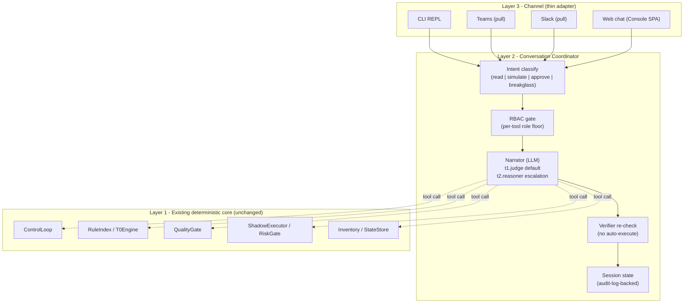

# Operator Console (Conversational)

How a human operator talks *back to* FDAI through a conversational interface across the CLI, Teams, Slack, and web chat. This
document is authoritative for the **conversational surface**: the layered
architecture, the tool catalog, the LLM tier model, session persistence,
per-tool RBAC, safety invariants, and current rollout status.

Push-direction notifications (system → human) live in
[channels-and-notifications.md](channels-and-notifications.md); the read-only
console SPA lives under
[project-structure.md § console/](../architecture/project-structure.md#console-static-web-app); evidence provenance, stream recovery, localization, and Architecture-map resilience are owned by [console-evidence-and-resilience.md](console-evidence-and-resilience.md).
This doc covers the **pull direction** - the operator asks, simulates,
approves - across every channel the notification doc already ships adapters
for. Push and pull share the same channel credentials and the same audit
contract, but they are distinct integration surfaces.

> Customer-agnostic: every channel id, LLM deployment name, resource id, and
> group name below is a placeholder. A fork supplies concrete values via
> config
> ([generic-scope.instructions.md](../../../.github/instructions/generic-scope.instructions.md)).

## 1. Framing - what this is (and what it is not)

The operator console does **not** carry judgment authority. FDAI's
judgment stays where it already is - the deterministic engine (T0),
the quality gate (T2 verifier), the risk gate, and the shipped Rego
policies. The console is the **conversational surface** through which
an operator inspects that judgment, simulates change, and approves
what the system has already queued.

Three properties follow directly:

- **LLM is a translator, not a judge.** Natural language in, tool calls out;
  tool results in, natural language out. The LLM never grants execution
  eligibility - only the verifier does
  ([architecture.instructions.md § Design Principles](../../../.github/instructions/architecture.instructions.md#design-principles)).
- **Tools expose pipeline stages, not primitive data sources.** Instead of
  `query_log()` + `query_metric()` + `read_config()` that the LLM must
  compose into a diagnosis, the console exposes
  `describe_event()`, `explain_verdict()`, `simulate_change()`. The system
  has already done the reasoning; the operator asks about the result.
- **Growth is catalog growth, not model memory growth.** Recurring
  investigation patterns become new rule candidates via the discovery loop
  ([architecture.instructions.md § Rule Catalog](../../../.github/instructions/architecture.instructions.md#rule-catalog)) -
  not opaque LLM session memory. Every state that persists across
  conversations lives in `audit_log` + `operator_memory` where it is
  auditable, exportable, and CSP-neutral.

### 1.1 Vocabulary added to the shared glossary

The following tokens are added to the shared vocabulary in
[architecture.instructions.md](../../../.github/instructions/architecture.instructions.md)
and are used consistently by every referring doc:

- **operator-console** - the layered surface documented here.
- **narrator** - the LLM tier of the operator console (translator role;
  never a judge). Distinct from the T2 quality-gate role, which is a
  domain reasoner over a proposed action.
- **operator-conversation** - one bounded exchange between an operator and
  the console (multi-turn, RBAC-scoped, audited).
- **console-tool** - one exposed pipeline stage or catalog view the narrator
  may call.

## 2. Three-layer architecture

- **Layer 3 (Channel)** is thin. Every adapter converts one turn between its wire format and a
  `ConversationTurn`; no judgment lives here. A streamed read sends SSE comment heartbeats while the
  provider task is idle, without progress or evidence. Stream close cancels and awaits that task.
- **Layer 2 (Coordinator)** owns intent classification, RBAC gating, tool
  dispatch, verifier re-check, and session bookkeeping. Core translation uses the `Narrator`
  Protocol. A narrator that also implements `GroundedAnswerNarrator` receives a completed
  successful `ToolResult` in a second presentation-only pass. The coordinator retains the
  original tool-result turn, accepts no new tool call, and falls back to the deterministic preview
  when rendering fails, exceeds the response bound, or omits an `evidence_ref`. Its system prompt is
  assembled deterministically from `AnswerPlan`, tool side-effect class, evidence-reference count,
  and the presence of prior conversation context. The current inbound/tool/result transaction is
  excluded from that prior context. Web generation uses the read API backend seam, so deployments
  can bind providers.
  After rendering, a core validator rejects numeric values, percentages, RFC3339 timestamps, and
  canonical rule, event, incident, correlation, or ActionType identifiers that do not occur in the
  immutable `ToolResult`. Freshness words such as `current`, `live`, or `latest` require an exact
  timestamp from that result. Markdown list ordinals, ordinary resource aliases, and numbers
  embedded in identifiers are excluded from this conservative check to avoid treating formatting
  as a claim.
  When intent translation remains ambiguous, an optional `ClarificationNarrator` sees only the
  installed tool schemas visible to the principal and may return one bounded question. This path
  invokes no tool, guesses no argument, and falls back to the deterministic abstain response when
  the provider fails or the response is not one question.
  An optional `ContextualNarrator` can translate a single-tool follow-up from bounded prior turns.
  Prior text is escaped as untrusted data, and every parsed scalar argument must occur in the
  current utterance or those prior turns after Unicode and separator normalization. Missing or
  invented arguments discard the translation before tool lookup and execution. Adapters that do
  not implement this protocol retain the original context-free `Narrator.translate` behavior.
  For a compound request that misses direct T0 matching, an optional `ReadPlanNarrator` may propose
  two or three canonical commands. The coordinator reparses every command with its own grammar and
  validates the complete plan for installed-tool membership, RBAC, distinct commands, and
  `side_effect_class=read` before the first call. Invalid plans execute nothing. Valid reads run
  serially, retain one tool-call/result pair per step, aggregate evidence references, and use the
  same grounded presentation pass. A failed read stops the remaining plan and skips synthesis.
  Before synthesis, the aggregator compares high-signal `state`, `status`, `verdict`, `mode`,
  `health`, and `outcome` fields only when two tools name the same `resource_id`, `scope_ref`, or
  `id`. Different values produce a structured conflict, preserve both evidence sets, change the
  aggregate to `abstain`, and skip model rendering. Different identities are not compared.
- **Layer 1 (Core)** is exactly the deterministic core that already ships.
  The console adds no new judgment path, no new persistence store, and no
  new execution vector. A console tool call resolves to a call the
  existing pipeline already knows how to make.

### 2.1 Module map

- [`src/fdai/core/conversation/`](../../../src/fdai/core/conversation)
  - `coordinator.py` - `ConversationCoordinator` (Layer 2 orchestrator).
  - `read_plan.py` - pure bounded-plan validation, serial read execution, result aggregation, and
    identity-scoped high-signal conflict detection.
  - `contextual_translation.py` - pure scalar argument provenance over current and prior turn text.
  - `grounded_answer_validation.py` - conservative canonical-ID, numeric, timestamp, freshness, and
    exact-ref checks over narrated output and immutable tool authority.
  - `tools.py` - `SystemConsoleTool` Protocol + per-tool implementations that
    delegate to Layer 1 modules only.
  - `narrator.py` - synchronous intent `Narrator`, optional `ContextualNarrator`, proposal-only
    `ReadPlanNarrator`, zero-execution `ClarificationNarrator`, and presentation-only
    `GroundedAnswerNarrator` Protocols, deterministic verb schemas, and RBAC-scoped descriptors.
  - `session.py` - disposable core/CLI `ConversationSession` projection. Principal-scoped
    `ConversationHistoryStore` owns production web transcripts.
- [`cli/`](../../../cli)
  - `src/repl.ts` - IME-safe stdin/stdout channel for the shared `POST /chat`
    coordinator.
  - `src/cockpit.ts` - live SSE presentation that publishes a
    self-describing screen snapshot to the same coordinator.
- [`src/fdai/core/conversation/channel_gateway.py`](../../../src/fdai/core/conversation/channel_gateway.py)
  - authenticates senders, claims message idempotency keys, calls the existing coordinator, and
    persists the complete response before provider send when durable delivery is configured.
    Verified bindings and recovery follow [durable delivery](durable-conversation-delivery.md).
- [`src/fdai/delivery/channels/`](../../../src/fdai/delivery/channels)
  - `teams.py` - normalizes Bot Framework activities after bearer-token verification and uses an
    injected publisher for replies. It never trusts a payload-supplied reply URL.
  - `slack.py` - verifies timestamped Slack request signatures, rejects replayed or bot-authored
    events, normalizes messages, and uses an injected publisher for replies.
  - Slack, Teams, and web attachment contracts converge through
    [conversation-attachments.md](conversation-attachments.md); web chat submits only already-ingested
    immutable document refs, and the resolver must return the exact requested citations in order.
    A dedicated WebSocket adapter remains optional future transport work.
- Scheduler Runs, Automation Blueprints, Scheduled Continuations, [governed trajectory datasets](governed-trajectory-datasets.md), and [execution backend status](execution-backends.md) expose read-only metadata. These views have no enable, submit, retry, cancel, cleanup, execute, or approval controls; omit credentials and Thor's identity; and keep commands outside the SPA.
- [`tools/chat.py`](../../../tools/chat.py) - headless JSONL development harness
  for the core coordinator. It is not a second policy implementation.

The CSP-neutral rule stays intact: `core/conversation/` imports **only**
Protocols. All Azure SDK / httpx / Bot Framework calls live under
`delivery/`.

## 3. Tool catalog

Tools are **pipeline-stage views**. A core tool has a stable name, bounded `argument_hint`, RBAC
floor, side-effect class, and documented failure surface. Web/provider-specific tools can add
their own typed request contracts. New tools are additive; they never override a rule or policy.

`RuntimeToolDiscovery` provides search and describe over installed narrator schemas. It
intersects schema metadata with the actually installed tool names, applies the same RBAC ladder as
the coordinator, and returns only name, verb, description, argument hint, RBAC floor, and
side-effect class. A lower-role principal cannot discover a higher-role tool, and descriptors
contain no handler or invocation capability. Discovery improves navigation; it grants no new
authority.

The same projection is available through the deterministic channel verbs `search_tools` and
`describe_tool`, and typed read RPC methods `tools.search` and `tools.describe`. Channel calls use
the resolved `Principal`; RPC calls derive the role from server-authorized scopes, never from a
caller-supplied role parameter. Both surfaces return descriptors only and cannot invoke the target.

### 3.1 Day-1 tool set (read-only + explain)

| Tool | Purpose | RBAC floor | Delegates to |
|------|---------|-----------|--------------|
| `describe_event(payload)` | Run one event through `EventIngest → TrustRouter → T0Engine` in memory (no PR, no audit write); return the resulting routing decision + candidate rule ids. | Reader | `EventIngest`, `TrustRouter`, `T0Engine` |
| `explain_verdict(event_id)` | Read the audit trail for one already-processed event; return the tier, decision, citing rule ids, verifier report, mode. | Reader | `StateStore.query_audit()` |
| `explore_catalog(query)` | Search the shipped rule catalog / action-type catalog / ontology vocabulary by id, keyword, or resource_type. | Reader | Loaded catalogs (no I/O) |
| `query_audit(filters)` | Structured audit query: by event id, actor, decision, mode, time window. Paginated. | Reader | `StateStore.query_audit()` |
| `query_inventory(resource_type, filter)` | Server-owned Azure inventory-view count, list, type, location, resource-group, name, status, and relationship queries. Returns bounded allowlisted fields plus active view and snapshot source/freshness; local VM state comes from `az vm list --show-details`; provider failure renders unavailable. | Reader | `InventoryGraphProvider` |
| `query_subscription_health()` | Inspect the server-configured Azure reader scope with parallel Resource Graph inventory and Resource Health queries, then bounded representative metric checks. Returns explicit findings, coverage gaps, freshness, and truncation without allowing caller-supplied scope. | Reader | `SubscriptionHealthProvider` |
| `capture_browser_evidence(policy_id, policy_version, source_url, stable_selectors)` | Submit a credential-free bounded capture under an exact server-owned policy. Returns an immutable artifact receipt; never returns a page or interaction API. | Reader | `BrowserEvidenceCaptureService` |

**Reader-floor tools are provably side-effect-free.** `describe_event`
runs `EventIngest -> TrustRouter -> T0Engine` **in memory only**: it does
not invoke T1 embedding lookups, T2 models, external adapters, or any
mutation surface, and it writes no PR and no audit entry. Its
`side_effect_class` is `read`, and a shadow-mode test asserts it never
touches the executor, the PR adapter, or the state store. This is what
keeps it safe at the Reader floor. Browser capture follows [Browser evidence collection](browser-evidence.md); Bragi never receives a browser handle.

### 3.2 Week-1 additions (write / approve / runbook)

| Tool | Purpose | RBAC floor | Notes |
|------|---------|-----------|-------|
| `simulate_change(scenario)` | End-to-end `ControlLoop.process()` in **shadow** mode; return the executor outcome + generated PR intent without publishing. | Contributor | Shadow-only; still writes an audit entry so the operator can find it in `query_audit`. |
| `approve_hil(approval_id, decision, justification)` | Resolve one queued HIL item. Verifier + `no_self_approval` invariant re-checked. | Approver | Approver group; same principal as PR gate enforcement in [security-and-identity.md](../architecture/security-and-identity.md). |
| `list_hil()` | Return currently queued HIL items visible to the caller's role. | Approver | Reader-visible would leak intent to non-approvers; kept Approver-scoped. |
| `run_runbook(name, params, dry_run)` | Execute one runbook under `docs/runbooks/`. `dry_run=true` requires Contributor; `dry_run=false` requires Owner. | Contributor / Owner | Concrete runbook adapters (e.g. `db_dr_drill_cli`) are already shipped; this tool routes by name. |
| `activate_break_glass(reason, expiry)` | Validate TTL/reason and create Owner-page and audit receipts. | Reader | The current implementation does not change the session principal/role or grant elevation. |

Two clarifications on the write set:

- **`simulate_change` writing an audit entry does not violate "shadow
  never mutates".** The audit log is append-only; recording *that a
  simulation ran* is not a mutation of any managed resource. The
  shadow-mode property test asserts no executor / PR / state-store write,
  and explicitly allows the audit append.
- **`list_hil` (Approver) vs the read-console HIL view (Reader) are
  different surfaces.** The read-only Console SPA shows Reader the
  *existence and count* of queued HIL items (dashboard tile); `list_hil`
  returns the *full item detail* (target, proposed action, requester),
  which can reveal sensitive intent, so it stays Approver-scoped. The two
  are intentionally not the same visibility.

### 3.3 Month-1 additions (observation depth)

| Tool | Purpose | RBAC floor | Depends on |
|------|---------|-----------|-------------|
| `query_log(query, window)` | Bounded, single-workspace Log Analytics KQL query. | Reader | new `AzureMonitorAdapter` |
| `query_metric(namespace, metric, window, aggregation)` | Azure Monitor metrics API. | Reader | new `AzureMonitorAdapter` |
| `query_deployments(window)` | Git + ARM deployment-history join. | Reader | new `DeploymentHistoryAdapter` |
| `correlate_incident(incident_id)` | Multi-signal correlation over ingest events + audit + inventory + logs + metrics for one incident id. | Reader | Above three + `event_ingest` |

The Month-1 additions bring the console close to a multi-signal
incident-response experience, but they still surface
**already-correlated** results; the correlator lives in Layer 1, not
inside the narrator.

### 3.4 Tool discovery contract

Each tool declares:

- `name` - CLI-friendly snake_case verb (no `describe-*` / `explore-*`
  prefix taxonomy; the verb itself is the category).
- `description` - one sentence, English, no marketing language.
- `argument_hint` - bounded argument shape expected by the canonical verb parser. Each tool
  reapplies typed and bounded validation before invocation; invalid arguments never become a
  partial call.
- `rbac_floor` - the lowest role that MAY call the tool.
- `side_effect_class` - `read` / `simulate` / `approve` / `execute` /
  `breakglass`. The audit entry carries this class so downstream analytics
  can slice cheaply.
- `failure_modes` - typed error surface documented in the tool's docstring.

`RuntimeToolDiscovery` and `tools.search`/`tools.describe` return descriptors without handlers or
invocation capability. The narrator sees only the same descriptors allowed by the principal role.

### 3.5 Public web evidence

Public web evidence is a deployment-level, read-only capability. It stays unavailable until the
deployment enables `FDAI_WEB_SEARCH_ENABLED` and configures an approved domain allowlist.

- **Eligibility:** An explicit operator request such as `search`, `find`, `look up`, `검색해줘`,
  `찾아봐`, or `구글링해줘` selects public web search without requiring a particular subject noun.
  These high-confidence patterns are the T0 fast path. When T0 returns `none` for an eligible
  open, list, comparison, proposal, or status question, a search-capable model returns strict JSON
  with `web` / `local` / `none`, confidence, reason code, and a normalized query. Low-confidence,
  malformed, or unavailable classification stays `none`. Current-screen, audit, inventory,
  catalog, and sensitive-data boundaries are applied before this semantic fallback.
- **Retrieval:** An eligible turn routes to a search-capable Azure Responses model candidate. The
  classifier converts multilingual public-search requests into a bounded English query; the search
  provider receives only that query and the domain allowlist, then returns a sanitized evidence
  snapshot. Bragi renders the answer with source URLs; it doesn't invent a replacement when search
  is unavailable. Bragi's answer-generation system prompt is not the search-intent authority.
- **Alternative discovery:** The classifier identifies the comparison subject and two to eight
  capabilities, then the coordinator deterministically rebuilds a capability-based query without
  the subject name. Alternatives use medium search context and request at least three distinct
  direct products so deterministic filtering can retain two. Results exclude self references,
  generic vendor homepages, conceptual
  frameworks or strategy guides, editorial or blog pages, generic documentation indexes, and
  duplicate pages from one product identity. Fewer than two distinct product sources makes the
  search unavailable. Bragi compares only cited capability
  overlap, marks unsupported criteria unknown, and labels the comparison partial rather than
  claiming functional equivalence or a winner.
- **Safety boundary:** Sensitive identifiers block retrieval before any provider call. Web snippets
  remain untrusted data, can't grant execution eligibility, and don't satisfy rule-catalog evidence
  requirements for an action.
- **Regression rubric:** A frozen 10-case English and Korean corpus checks explicit, colloquial,
  freshness, web-context, local-scope, and no-search intents. Each case passes only when both the
  structured route and provider-call behavior match the expected result. A separate live held-out
  check measures semantic classification and query normalization with English, Spanish, French,
  and Japanese prompts that aren't present in the T0 pattern set.
  Alternative discovery adds ten observable relevance checks for goal, subject, capabilities,
  candidate count and diversity, self exclusion, direct pages, and conceptual-content exclusion.

## 4-6. Runtime model (Narrator, DI seams, session model)

Moved to a focused owner document: [operator-console-runtime-model.md](operator-console-runtime-model.md). It covers the Narrator LLM tier model (section 4), DI seams (section 5), and the session model and memory (section 6).

### 6. Session model + memory

See [operator-console-runtime-model.md#6-session-model--memory](operator-console-runtime-model.md#6-session-model--memory).

## 7. Safety invariants (chat does not weaken them)

The four autonomy invariants from
[coding-conventions.instructions.md § Safety](../../../.github/instructions/coding-conventions.instructions.md#safety)
apply unchanged. Chat adds three of its own on top.

### 7.1 The four existing invariants

Every write-class tool call (`simulate_change` in enforce mode -
disallowed today - `approve_hil`, `run_runbook --live`) MUST carry:

1. **Stop-condition** - the underlying ActionType already declares one;
   the console does not add or remove.
2. **Rollback path** - reused from the ActionType's `rollback_contract`.
3. **Blast-radius limit** - reused from the ActionType's
   `blast_radius` block; the operator cannot widen it via natural
   language.
4. **Audit entry** - written by the coordinator before the tool actually
   dispatches.

### 7.2 Three chat-specific invariants

5. **Verifier re-check on every write-class tool call.** After the
   narrator emits a `tool_calls` frame that targets a write-class tool,
   the coordinator re-runs the T0Engine + policy-as-code check against
   the tool arguments. On abstain / deny, the tool call is dropped and
   the turn falls through to HIL (see §7.4). This is the mechanical
   guarantee behind "the LLM never grants execution eligibility".
6. **No self-approval, chat-scoped.** `approve_hil` refuses when the
   caller's Entra `oid` matches the requester recorded on the queued
   item, even if the caller holds Owner. This is the same invariant as
   the PR gate ([security-and-identity.md](../architecture/security-and-identity.md));
   chat adds the invariant name to the audit reason on refusal.
7. **A BreakGlass request must be time-boxed and explicit.** `activate_break_glass`
   requires `(reason, expiry <= 4h)` and pages every configured Owner via
   the push-direction Slack/Teams adapter
   ([channels-and-notifications.md](channels-and-notifications.md)). No
  silent elevation. **The request is fail-closed on notification:** if the
   primary pager channel is down, the coordinator tries the configured
  fallback channel; if *no* channel confirms delivery, the request is
   **refused** (a break-glass with no audit witness is more dangerous than
   a delayed emergency), and the refusal is itself audited so an Owner can
  see the attempt. The shipped tool returns pager and audit receipts only; it does not change
  `ConversationSession`, `Principal`, or the RiskGate role axis, so it raises no approval
  eligibility. Until a session-scoped grant store and dispatch integration exist, no elevation
  occurs. A future grant must never return `auto` or permit self-approval (invariant 6). The exact
   eligibility semantics are defined in
   [user-rbac-and-identity.md § 2](user-rbac-and-identity.md#2-role-model-4-tiers--break-glass)
   and mirrored by the RiskGate role axis
   ([execution-model.md § 2.5](../decisioning/execution-model.md#25-axis-f---role-rbac)).

### 7.3 BreakGlass request receipt

The current `ActivateBreakGlassTool` result contains `activated_at`, `expires_at`, a redacted
reason, `pager_receipt`, and `audit_id`. Its `max_ttl_seconds` default and ceiling are `14400`; a
larger adapter setting is rejected. This result is not an authorization grant record, and no
persistent store currently enforces session-end or expiry revocation. No downstream path may use
the receipt as elevation evidence.

### 7.4 Human approval fall-through when the LLM proposes a write

The narrator MAY, when the operator says "just fix it", emit a
`tool_call` for `run_runbook(dry_run=false)` or `approve_hil`. On the
verifier re-check (invariant 5):

- If verifier passes AND RBAC is satisfied → the tool call proceeds.
- If verifier abstains or RBAC is under the floor → the coordinator
  substitutes an `enqueue_hil(...)` call that files a review item in the
  existing HIL queue and returns "I filed a HIL item, id X" to the
  operator.
- Under no circumstance does the write happen without an audit entry
  before dispatch.

## 8. Channel integration (push vs pull)

The channel abstraction ([channels-and-notifications.md](channels-and-notifications.md))
already handles push (system → human). Pull uses **separate adapters and configuration contracts**.
A deployment can reuse a secret provider or workload identity, but it does not derive inbound
conversation enablement from the outbound notification matrix. This separation preserves the
different trust posture and blast radius of send-only and receive-plus-send surfaces.

The shared pull-direction contract, gateway, Slack signed ingress, Teams authenticated activity
normalizer, bounded Starlette routes, Slack Web API publisher, and Teams Bot Framework publisher
are implemented. The Slack route verifies timestamped signatures. The Teams route calls an
injected bearer authenticator before parsing activity JSON. Reply publishers use only configured
HTTPS endpoints, injected app/workload credentials, and server-owned conversation resolution.
`ProductionChannelRuntime` binds the concrete Bot Framework JWT verifier, Teams principal resolver,
Slack secrets/app credentials, fixed-endpoint publishers, and background gateway lifecycle.
Missing required credentials or identity bindings fail startup before traffic. Those bindings stay
in `delivery/`; they do not change the coordinator.

`ChannelAccessService` is the sender-access foundation for those principal resolvers. Each channel
selects `disabled`, `allowlist`, or `pairing`. Unknown senders resolve to no principal and never
reach the coordinator. Pairing mode issues a bounded, expiring challenge, stores only its SHA-256
digest, caps pending requests per channel, requires a separately authorized approver, verifies the
code in constant time, and maps the approved sender to an existing FDAI principal. Disabled and
allowlist modes never self-enroll a sender. The PostgreSQL store now enforces the pending cap and
approval transition atomically across replicas. Native challenge delivery replies in the originating
thread and conditionally removes the pending digest when delivery fails. The code is never stored or
placed in response metadata.

`CrossChannelIdentityLinkService` records an explicit relationship only after both channel senders
are independently paired to the same principal. It rejects same-channel links, self-approval,
unapproved endpoints, and any attempt to relate two distinct principals. The durable link is
idempotent and does not merge principal records, roles, sessions, or audit histories.

| Channel | Push (existing) | Pull (this doc) | Shared config |
|---------|-----------------|-----------------|---------------|
| Teams | A1 HIL and outbound notification adapters | `TeamsBotChannel` + authenticated bounded activity route + workload-identity reply publisher + principal binding | Deployments can reuse selected identity/secret providers. |
| Slack | `SlackWebhookChannel` and A1 adapter | `SlackBotChannel` + signed Events API route + fixed-endpoint Web API reply publisher | Deployments can reuse selected secret providers. |
| Email | send-only | (not planned; asynchronous, ill-suited to interactive) | n/a |
| Webhook | send-only | (not planned; caller must own an interactive protocol themselves) | n/a |
| Pager (PagerDuty) | send-only | (not planned) | n/a |
| SMS | send-only | (not planned) | n/a |
| Web chat | n/a | Authenticated `POST /chat` and `POST /chat/stream` SSE | Console SPA/read API config |
| CLI | n/a | stdin/stdout UI calling the shared read API `/chat` | local auth/read API config |

### 8.1 Separate channel configuration

[`config/notifications-matrix.yaml`](../../../config/notifications-matrix.yaml) owns outbound
notification routing only. Conversation channels use separate enablement, secret references,
Teams identity/principal bindings, and queue-capacity settings. Sharing a credential backend does
not merge configuration ownership.

## 9. Growth model (catalog + operator memory)

The console gets better over time via three deterministic mechanisms.
Model-side learning is **not** one of them.

### 9.1 Day 1

The Day-1 console can answer:

- "What rules apply to `network.nsg` in `example-rg`?"
  → `query_inventory` + `explore_catalog`.
- "Why did event `<id>` route to HIL?" → `explain_verdict`.
- "Show me every audit entry for `object-storage.public-access.deny` in
  the last 24h." → `query_audit`.
- "If I create a storage account with public access enabled, what would
  the loop do?" → `describe_event`.

No writes, no runbooks, no approvals - just orientation.

### 9.2 Week 1

Adds `simulate_change`, `approve_hil`, `run_runbook --dry-run`, and the
Teams / Slack pull adapters. The console can now:

- Preview a change end-to-end in shadow.
- Resolve queued HIL items with the same identity gate the PR flow uses.
- Trigger the shipped runbooks
  ([docs/runbooks/](../../runbooks)) from any channel.

### 9.3 Month 1

Adds the observation-depth tools (§3.3) and the discovery-loop hook:

- The coordinator publishes a `console.recurrent_query` signal to the
  discovery-loop input stream when the same tool-argument shape appears
  N times across distinct principals in a rolling window (N configured;
  default 5 / week).
- The rule-candidate generator
  ([rule-governance.md](../rules-and-detection/rule-governance.md)) receives that signal like
  any other; the resulting rule ships shadow-first through the same
  promotion pipeline.

The result is that a common investigation pattern in chat becomes a
first-class rule in the catalog - **the console grows the catalog, not
itself**.

## 10. Rollout reconciliation

The original Day/Week/Month sequence is historical implementation context, not the current
availability source.

| Slice | Current status |
|-------|----------------|
| Core/CLI translator | `Narrator`, grounded answer rendering in `AzureOpenAINarratorModel`, coordinator, read tools, Python headless harness, and shared-API TypeScript CLI ship. Intent translation and answer rendering use separate prompts; both retain the deterministic tool and RBAC boundary. |
| Write/approval tools | Simulation, HIL, runbook, and proposal routes ship. Break-glass stops at the pager/audit request receipt in §7.3 and grants no elevation. |
| Teams/Slack conversation | `ProductionChannelRuntime`, authenticated ingress, principal resolution, publishers, and optional durable replies ship; environment-owned enablement and credentials remain required. |
| Web chat and memory | JSON/SSE chat, principal-scoped history/preferences/memory, AnswerPlan, and progressive verification ship. |
| Observation/discovery | `POST /read-investigations` selects direct, streamed, or detached execution from durable latency evidence before Azure I/O. Direct Command Deck and HTTP reads share an owner-scoped result-replay ledger; closing a streamed response cancels its in-flight read. The surface is registered only with a dedicated reader binding; catalog presence alone proves neither provider health nor promotion. |
| Forecast learning | `GET /forecast-learning` projects due closure completeness, model/pipeline miss origin, publication and dead-letter debt, and retention debt from PostgreSQL. The route is Reader-only and exposes no detector mutation or promotion control. |

Live Azure completion evidence and capability promotion remain governed by deployment verification
and the authoritative registry, never inferred from phase names in this document.

## 11. Testability

- **Coordinator** - property tests: "verifier re-check runs on every
  write-class tool call", "RBAC floor is enforced before the narrator
  sees the tool schema", "audit entry precedes every tool dispatch",
  "escalation records tier and trigger".
- **Narrator adapter** - contract tests using `httpx.MockTransport` for the strict Azure OpenAI
  intent translator, injection-isolated grounded answer prompt, exact evidence-reference
  preservation, and resolved deployment binding.
- **Tools** - each tool has a shadow-mode test showing it never mutates
  when its `side_effect_class == read | simulate`; a `write` /
  `approve` test showing the verifier re-check gate.
- **Channels** - CLI REPL golden transcript, Teams Bot Framework activity/JWT, Slack signed HTTP
  Events API, and publisher receipts.
- **RBAC matrix** - table-driven test over every (Role × Tool) cell to
  prove the floor from §3.1-§3.3 is applied.
- **Break-glass** - tests prove `activate_break_glass` refuses `expiry > 4h`, requires Owner
  notification and audit receipts, and does not mutate the session principal. Persistent grants
  and session-end revocation are not shipped contracts.
- **Determinism** - two runs of the same CLI transcript through a fake
  `Narrator` produce byte-identical audit trails (given fixed
  timestamps and idempotency keys).
- **Session recovery** - principal-scoped `ConversationHistoryStore` reloads prior turns by session
  id, while stable request idempotency prevents duplicate appends. Audit/ontology retain hashes and
  references rather than raw transcripts.

## 12. Failure modes

- **Narrator unavailable** - fall through to Chat T0 direct-hit; if the
  turn does not match a T0 pattern, respond with a canned "reasoning
  layer is temporarily unavailable; here is the direct query surface"
  and expose the tools list.
- **Grounded answer rendering unavailable or invalid** - return the completed deterministic tool
  preview. The coordinator also uses this fallback when the model returns an empty or oversized
  answer or drops any required evidence reference. Rendering failure never changes tool data,
  status, authorization, or execution state.
- **Verifier abstain on write-class tool** - substitute
  `enqueue_hil(...)` (see §7.4), return the HIL id, audit reason
  `verifier_abstained`.
- **Channel adapter disconnects** - when durable delivery is configured, the complete response and
  terminal/ambiguous state remain in the ledger. The direct path still resumes durable conversation
  history by session id but does not claim exactly-once provider send.
- **Break-glass request receipt** - the coordinator does not interpret the receipt as elevated
  capability. A future grant integration must recheck TTL before every privileged tool call.
- **Tool implementation raises** - the tool's typed error surface (§3.4)
  is wrapped as a `ToolResult(status=error)`; the narrator sees a
  structured error, not an exception traceback.

## 13. Data + wire contracts

Split into focused owner documents:

- [operator-console-wire-contracts.md](operator-console-wire-contracts.md) - audit entry, CLI REPL, approval callback (13.1-13.3), action submit, Python VM workbench, grounded code, and ontology projection (13.6-13.9).
- [operator-console-view-snapshot.md](operator-console-view-snapshot.md) - the self-describing screen contract (13.4).
- [operator-console-incident-roster.md](operator-console-incident-roster.md) - incident roster and fix history (13.5).

## 14. MCP delivery and managed catalog

FDAI can consume externally hosted MCP tools through the managed outbound catalog under
`src/fdai/delivery/mcp/`. Servers install disabled. Enable performs a non-invoking `tools/list`
discovery and verifies every ActionType-to-tool allowlist entry. Catalog mutations use a durable
revision-CAS snapshot; manifest, health, revision, and the admin audit record commit in one
PostgreSQL transaction. A periodic monitor records health transitions, and only enabled, healthy
servers are routable. Endpoint validation rejects credentials, query strings, fragments, and
non-loopback plaintext HTTP.

This outbound catalog is distinct from publishing FDAI itself as an MCP server. The repository
currently ships no inbound MCP server process, `list_tools`/`call_tool` wire endpoint, or external
MCP principal mapping. A fork MUST NOT infer an FDAI-to-client MCP surface from this document.

A future inbound MCP proposal can additively reuse the coordinator and RBAC, reject anonymous
callers, map mTLS or audience-scoped Entra identities to service `Principal` records, and audit the
resolved role. That remains future scope requiring its own threat model, protocol tests, and
deployment gates.

## 15. Decision status

- **OD-C1 resolved** - the strict core narrator prompt lives in `AzureOpenAINarratorModel`; the
  broader prompt catalog uses `rule-catalog/prompts/base`, `packs`, `scenarios`, and `tools`.
- **OD-C2 resolved** - principal-scoped user memory/preferences and separate governed operator
  memory now have schemas, provenance, consent, and retention paths.
- **OD-C3 residual** - persistent BreakGlass grant/elevation is not implemented. A future design
  must retain no-self-approval and separately approve any distinct-approver requirement.
- **OD-C4 current behavior** - CLI history is bounded process-memory navigation only. A persistent
  history file and retention/redaction contract are neither shipped nor blockers for the current CLI.

## 16. Related docs

- [architecture.instructions.md](../../../.github/instructions/architecture.instructions.md) -
  trust routing, verifier authority.
- [action-ontology.md](../decisioning/action-ontology.md) - ActionType schema with the
  `trigger_kind` axis (`operator_request`) that the console emits, plus
  the `argument_schema` the coordinator validates against.
- [execution-model.md](../decisioning/execution-model.md) - the unified RiskGate the
  chat verifier re-check (§7.2) invokes, and the 5-axis authority
  matrix that decides auto / HIL / deny for every write-class tool call.
- [channels-and-notifications.md](channels-and-notifications.md) - the
  push-direction channel matrix this doc's pull side extends.
- [user-rbac-and-identity.md](user-rbac-and-identity.md) - the RBAC role
  set the tool matrix (§3) references.
- [security-and-identity.md](../architecture/security-and-identity.md) - no-self-approval,
  execution identity, safety invariants.
- [prompt-composition.md](../decisioning/prompt-composition.md) - narrator prompt
  layering, tool-schema exposure, debate orchestrator (Wave 4.5) that
  Month 1 may consume.
- [rule-governance.md](../rules-and-detection/rule-governance.md) - the discovery loop the
  Month-1 console feeds.
- [project-structure.md § console/](../architecture/project-structure.md#console-static-web-app) -
  the read-only console SPA the Month-1 web-chat channel extends.
