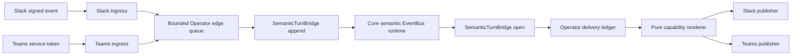

# 운영 A3 채널 런타임

이 문서는 운영 Teams 및 Slack A3 대화 edge의 인증된 유입, 범위가 제한된 프로바이더 발행,
수명 주기 조립, 영속 복구, 배포 격리 및 롤백을 소유합니다. 채널 중립 대화 및 표현 계약 주변의
전송을 완성하지만 새로운 판단 또는 실행 표면을 만들지 않습니다.

> **범위:** A3 읽기 및 초안 전용 요청을 포함합니다. Slack A1 승인, A2/A4 알림 정책, 문서
> 의미 전송, inline vision 및 관련 없는 채널 backlog는 기존 소유 문서에 유지합니다.
>
> **토폴로지:** 런타임은 기존 Operator Service distribution으로 만드는 권한 없는 edge
> adapter workload입니다. 독립적으로 release하는 여섯 번째 컨트롤 플레인 distribution이
> 아니며 Operator migration branch와 conversation table writer를 사용하고 Thor 신원을 받지
> 않습니다.

## 설계 개요

Edge는 프로바이더가 인증한 요청만 수락하고 벤더 신원을 구성된 FDAI principal 하나로 교체한 뒤
Operator가 소유한 inbound ledger에서 프로바이더 메시지를 claim합니다. Edge는
`SemanticTurnBridge.append()`를 통해 typed semantic request를 제출하고
`SemanticTurnBridge.open()`을 통해 principal 범위의 terminal projection을 기다린 뒤 하나의
presentation artifact를 compile합니다. Operator가 소유한 영속 전달은 순수 프로바이더 publisher가
전송하기 전에 이 artifact를 저장합니다. 시작 과정은 모든 필수 의존성을 해석하고 불확실한 전송을
조정한 뒤에만 Starlette가 트래픽을 받게 합니다.

## 구현 상태

### 구현 범위

| 영역 | 상태 | 근거 | 참고 |
|------|------|------|------|
| A3 edge 설계 및 소유권 | 구현됨 | [이슈 #235](https://github.com/dotnetpower/fdai/issues/235), 이 문서 쌍, Operator source 및 배포 root | 권한 없는 Operator distribution 설계를 구현했습니다. 통제된 프로바이더 및 배포 근거는 열린 상태입니다. |
| 인증된 유입 및 프로바이더 publisher | 구현됨 | `fdai_operator_service/families/conversation/channel_edge/`, 집중 edge 검사 81개 통과 | Operator-local Slack 및 Teams adapter는 정규 principal 교체, 범위가 제한된 유입, URL 없는 첨부 메타데이터, 고정 목적지, 엄격한 token audience 및 확정 확인 응답과 모호한 확인 응답의 구분을 강제합니다. 독립 런타임이 두 경로 계열을 연결합니다. |
| Operator migration 및 persistence | 구현됨 | `operator_a3_channel_delivery_20260819`, `channel_{delivery_models,message_ledger}.py`, `postgres_channel_{binding,delivery}.py`, live PostgreSQL 검사 9개 건너뛰기 없이 통과 | Operator branch가 inbound processing lease를 소유하고 Operator role에 channel table 6개만 부여합니다. Runtime-role 검사는 lease reclaim, permanent dedupe, binding uniqueness, idempotent delivery, claim 및 acknowledgement closure, process-loss ambiguity, breaker CAS 및 retention cleanup을 증명합니다. 독립 lifespan이 이 store를 연결합니다. |
| 의미 요청, 결과 및 영속 전달 파이프라인 | 구현됨 | `semantic_turn_runtime.py`, `channel_edge/{pipeline,pipeline_contracts,worker}.py`, 집중 edge 검사, live PostgreSQL 연결 검사 1개 건너뛰기 없이 통과 | Operator edge는 서버 소유 범위를 해석하고 typed 의미 요청을 영속화하며 principal 범위의 최종 변환 결과를 기다립니다. 프로바이더 I/O 전에 최종 응답을 저장하고 영속 전달 소유권을 확보한 뒤에만 inbound 소유권을 완료하며, 영속 차단기로 재시도와 프로세스 손실 복구를 제한합니다. 기한이 된 전송은 프로바이더 I/O 전에 활성 principal, scope, conversation 및 channel binding을 다시 검증합니다. |
| 실패 시 닫히는 런타임과 로컬/Azure workload | 구현됨 | `channel_edge/{application,composition,entry,environment,runtime}.py`, `.vscode/tasks.json`, `prepare-channel-edge-env.sh`, `infra/services/operator-service`, 보호된 배포 workflow 및 helper, 집중 배포 검사 126 + 28개 통과 | 독립 process는 health와 활성화된 webhook 경로만 노출하고 준비 상태 전에 활성화된 모든 의존성을 해석하며, private local input 또는 Key Vault reference와 전용 non-executor identity를 사용합니다. 보호된 enable, update, disable, health 및 자동 disabled-state rollback mechanism을 구현했습니다. Apply, 프로바이더 확인 응답 및 rollback 증적은 열린 상태입니다. |
| 독립 hardening | 구현됨 | [Hardening 캠페인](#hardening-캠페인), 집중 edge 검사 81개 통과, Ruff 및 strict mypy | 독립 round 10개를 완료했고 수락한 모든 finding에 집중 회귀를 추가했으며 검증된 Medium 이상 잔여가 없습니다. 보호된 런타임 근거는 별도 검증 gate로 유지합니다. |

### 구현 이력

| 날짜 | 상태 | 변경 | 근거 | 남은 작업 |
|------|------|------|------|-----------|
| 2026-08-19 | 진행 중 | Operator API 공동 hosting과 여섯 번째 service distribution을 비평에서 모두 거부한 뒤 권한 없는 edge workload 설계를 승인했습니다. | `current change`, [이슈 #235](https://github.com/dotnetpower/fdai/issues/235), route, tracking, translation 및 link 검사 | 구현, hardening, 검증 및 통제된 로컬/배포 증적 보존이 남았습니다. |
| 2026-08-19 | 구현됨 | Slack A3 exact-body verifier, 닫힌 workspace/sender admission, opaque file 정규화, 범위가 제한된 queue adapter, 고정 Web API publisher 및 확정/모호 확인 응답 구분을 추가했습니다. | `current change`, 집중 Slack, renderer 및 gateway 검사 76개와 Ruff, formatting, strict mypy 및 editor diagnostics 통과 | 활성화된 A3 경로를 주장하기 전에 Teams 전송과 운영 런타임 조립을 구현합니다. |
| 2026-08-19 | 구현됨 | 범위가 제한된 주입형 JWKS를 사용하는 고정 algorithm Bot Framework token 검증, exact tenant/principal/service URL admission, URL 없는 파일 정규화, 인증된 endpoint registry, 범위가 제한된 queue, 고정 Connector path와 audience 및 엄격한 확인 응답 parsing을 추가했습니다. Queue 거절은 endpoint binding을 남기지 않습니다. | `current change`, 집중 channel 및 gateway 검사 92개와 Ruff, formatting, strict mypy 및 editor diagnostics 통과 | 두 전송 중 하나라도 활성화하기 전에 영속 store와 fail-closed 런타임 조립을 추가합니다. |
| 2026-08-19 | 철회됨 | Conversation delivery table이 Operator Service 소유이고 동결된 root Alembic chain에 revision 0087을 추가할 수 없다는 service ownership 검증 결과에 따라 Core 소유 channel persistence slice를 철회했습니다. | Root migration head를 `20260819_0086`으로 복원했고 legacy inventory를 revision 88개와 table 105개로 복원했습니다. 집중 Core migration 검사 200개와 service-migration 검사 47개를 통과했습니다. | Core table writer 없이 Operator distribution에서 persistence와 edge 조립을 다시 구현합니다. |
| 2026-08-19 | 진행 중 | Edge를 Operator distribution으로 교정하고 기존 semantic-turn EventBus bridge를 재사용하며 inbound claim과 정확한 channel-table grant를 Operator service migration branch에 추가했습니다. | `current change`, `operator_a3_channel_delivery_20260819`, ownership manifest, service-migration 검사 47개 통과, loopback Operator branch를 새 head로 upgrade | Operator-local store, transport, lifecycle, workload, hardening 및 통제된 runtime 근거를 구현합니다. |
| 2026-08-19 | 구현됨 | Core implementation import 또는 다른 writer를 추가하지 않고 Operator-local inbound claim, 검증된 binding, outbound delivery, attempt, acknowledgement, retention 및 breaker store를 추가했습니다. | `current change`, Operator runtime role을 사용한 live loopback PostgreSQL 검사 9개를 건너뛰기 없이 통과했고 Ruff, formatting 및 strict mypy 통과 | Provider transport를 Operator 소유권으로 이동하고 semantic bridge와 fail-closed lifespan을 조립합니다. |
| 2026-08-19 | 구현됨 | 인증된 Slack 및 Teams 전송을 Operator distribution으로 이동하고 결정적 inbound replay, 의미 최종 변환 결과, 영속 소유권, 프로바이더 확인 응답 종결, 재시도 작업, 프로세스 손실 조정 및 영속 차단기 유입 제어를 조립했습니다. | 커밋 `3555ecf9c`, `current change`, 집중 채널 검사 32개, 파이프라인 및 worker 검사 10개, Operator runtime role을 사용한 live PostgreSQL 연결 검사 1개를 건너뛰기 없이 통과했고 Ruff 및 strict mypy 통과 | 실패 시 닫히는 Starlette lifespan에 의존성을 연결하고 로컬 및 배포 workload를 추가하며 대체된 Core prototype을 제거하고 통제된 근거를 보존합니다. |
| 2026-08-20 | 구현됨 | 독립 fail-closed Starlette workload, private 로컬 실행, 선택적 Operator-service Container App, 전용 non-executor identity와 최소 권한 역할, Key Vault reference, probe 및 rollback metadata를 추가했습니다. 대체된 Core transport와 Core PyJWT 의존성을 제거했습니다. | `current change`, edge package 검사 74개, shared 및 Operator channel 검사 110개, 로컬 실행 검사 3개, Ruff 및 strict mypy 통과, 플랫폼 및 Operator-service Terraform 검증 통과 | 독립 hardening을 완료한 뒤 통제된 로컬 프로바이더 및 보호된 plan/apply/rollback 근거를 보존합니다. |
| 2026-08-20 | 구현됨 | 독립 hardening round 10개를 완료했습니다. 플랫폼 범위를 벗어난 Slack timestamp를 server error 없이 거부하고, 로컬 secret을 읽기 전에 상속된 shell tracing을 끄며, 범위가 제한된 TTL 뒤 known Teams JWKS key를 갱신하고, 기한이 된 전송 전에 활성 principal/scope/conversation/channel binding을 다시 검증하며, 소유 runtime 및 credential resource를 정확히 한 번 닫습니다. | `current change`, 집중 edge 검사 81개, Ruff 및 strict mypy 통과, 수락한 모든 finding에 집중 회귀 추가 | Runtime 행을 `validated`로 올리기 전에 통제된 로컬 프로바이더 및 보호된 plan/apply/rollback 증적을 보존합니다. |
| 2026-08-20 | 구현됨 | 모든 A3 test를 Operator service suite에 귀속하고, shared `ExecutionVenue` 계약을 통해 venue를 선택하며, A3 design route에서 폐기한 Core prototype 경로를 제거해 exact-commit 구조 finding을 닫았습니다. | `current change`, 집중 service-suite, venue-contract, design-route, environment 및 composition 검사 | Runtime 행을 `validated`로 올리기 전에 통제된 로컬 프로바이더 및 보호된 plan/apply/rollback 증적을 보존합니다. |
| 2026-08-20 | 구현됨 | 별도 edge Container App을 거부하던 보호된 전달 gap을 닫았습니다. Platform plan은 전용 identity와 secret scope를 연결하고, Operator service plan은 명시적 edge enable 또는 disable transition, exact target identity와 image, 새 revision health, route 제거 및 primary revision 복구 전 자동 disabled-state rollback을 봉인합니다. | `current change`, 보호된 service 배포 및 workflow 계약 검사 126 + 28개, workflow YAML 및 rollback shell syntax 통과 | 승인된 credential store를 통해 실제 Slack 또는 Teams 프로바이더 credential과 principal-mapping profile 하나를 제공하고 로컬 provider 및 보호된 plan/apply/rollback 증적을 보존합니다. |
| 2026-08-20 | 구현됨 | 암묵적 action, plan 대체, 공개 route 잔존, secret 노출, identity 대체 및 복구 순서를 대상으로 보호된 rollout을 다시 검토했습니다. 수락한 finding 하나는 primary health 전에 disable route-removal proof를 실행하도록 교정했습니다. 의심 finding 8개는 분리된 primary/edge resource, exact transition 봉인 및 terminal rollback 검사로 기각했습니다. 검증된 Medium 이상 구현 잔여는 없습니다. | `current change`, 집중 수정 뒤 route-closure 및 자동 rollback 검사 2개 통과, 전체 보호된 배포 검사는 앞서 154개 통과 | Runtime 검증에는 실제 프로바이더 material과 통제된 증적이 계속 필요하며 이는 구현 잔여가 아닙니다. |

### 남은 작업

- [x] 이 문서의 모든 구현 범위를 완성하고 focused 검사를 통과합니다. Focused commit에 exact-diff 근거를 보존합니다.
- [x] 최소 10개 비평 round를 완료하고 Low 또는 기각된 잔여만 보존합니다.
- [ ] 저장소나 workflow 출력에 값을 노출하지 않고 local-only input, Key Vault, GitHub secret
  configuration 및 versionless secret-id variable을 통해 실제 Slack 또는 Teams 프로바이더
  profile과 principal mapping 하나를 구성합니다.
- [ ] 어떤 행이든 `validated`로 바꾸기 전에 통제된 로컬 및 보호된 배포
  plan/apply/provider-acknowledgement/rollback 증적을 보존합니다.

## 아키텍처 결정

### Edge workload를 선택한 이유

세 가지 배치를 검토했습니다.

| 배치 | 결정 | 이유 |
|------|------|------|
| Operator API process 공동 hosting | 거부 | 채널 secret, 공개 webhook 유입 및 프로바이더 확인 응답은 인증된 읽기 API process의 영향 범위를 넓힙니다. |
| 독립적으로 release하는 여섯 번째 service distribution | 거부 | 새 domain writer 또는 구현 격리 필요 없이 완료된 five-distribution N/N-1, migration, image 및 rollback 프로그램을 다시 열게 됩니다. |
| 기존 Operator distribution의 별도 edge Container App | 승인 | Cross-service implementation import 없이 소유 conversation writer, service migration branch 및 typed semantic EventBus bridge를 재사용하면서 공개 유입과 채널 자격 증명을 격리합니다. |

Edge workload는 독립 실행되고 별도로 scale할 수 있지만 package, writer 및 migration 소유권은
Operator Service에 유지합니다. Core는 EventBus를 통해 versioned semantic request만 받고 versioned
semantic projection만 반환합니다. 이 배포 구분은 고정된 다섯 service distribution 또는 15개
agent pantheon을 바꾸지 않습니다.

## 유입 및 발행

### Slack

Slack 유입은 구성된 signing secret, 프로바이더 시각, constant-time 비교 및 5분 replay 구간으로
정확한 raw request body를 검증합니다. URL verification과 bot이 아닌 message event만 수락합니다.
Bot event, retry duplicate, 지원하지 않는 subtype, malformed body, 알 수 없는 sender 또는 큰
메시지는 queue에 들어가지 않습니다.

정규화된 파일은 opaque file id, 안전한 leaf 이름, 양수 byte 크기 및 media-type hint만 유지합니다.
Payload URL은 버립니다. Private download는 기존 서버 소유 fetcher와 보호된 ingestion 계약 뒤에
유지합니다.

Slack 발행은 고정된 `chat.postMessage` 및 `chat.update` endpoint, 시작에서 해석한 bot token,
순수 Block Kit renderer, 유입 channel/thread 신원 및 엄격한 `ok=true`와 message timestamp 확인
응답을 사용합니다. 응답은 URL, token 또는 API method를 제공할 수 없습니다.

### Teams

Teams 유입은 operator 신원을 parsing하기 전에 Bot Framework bearer token을 검증합니다.
Authenticator는 범위가 제한된 cached JWKS의 RS256, application audience, 승인된 issuer,
`exp`, `nbf` 및 service URL claim을 검증합니다. Activity도 구성된 tenant,
`channelId=msteams`, 검증된 service URL 및 구성된 `aadObjectId`와 FDAI principal map에
일치해야 합니다.
Cache는 known key도 5분 뒤 갱신하므로 현재 JWKS에서 제거된 key를 process 수명 전체에서
계속 수락할 수 없습니다.

Teams 발행은 대화에 허용된 인증된 service URL만 해석하고 주입된 workload identity에서 Bot
Framework audience token을 얻으며 순수 Adaptive Card renderer를 사용하고 범위가 제한된 resource
id 확인 응답을 요구합니다. Activity payload는 다른 host 또는 token audience를 선택할 수 없습니다.

### Queue 및 상한

각 adapter는 범위가 제한된 queue 하나를 소유합니다. Queue 포화는 turn을 수락하지 않고
프로바이더에 맞는 범위가 제한된 재시도 응답을 반환합니다. Request byte, text, file, field,
identity, provider response 및 serialized card/block payload에는 독립 상한을 적용합니다. 지원하지
않는 입력은 queue 전에 실패합니다. 오류에는 request body, sender id, file name, credential 또는
provider text가 포함되지 않습니다.

## 영속 전달

Legacy migration `20260720_0047`은 변경하지 않습니다. Operator branch revision
`operator_a3_channel_delivery_20260819`가 inbound claim table과 정확한 role grant를 추가합니다.
Operator-local PostgreSQL adapter는 다음을 구현합니다.

- 검증된 principal binding create/read/revoke/list 연산
- idempotency 내용 충돌을 거부하는 변경 불가 응답 insert
- `FOR UPDATE SKIP LOCKED` due claim 및 lease-fenced finish
- 상태 종료와 같은 transaction의 attempt 및 acknowledgement 영속화
- 만료된 `sending`을 변경 불가 `ambiguous`로 바꾸는 process-loss 처리
- revision 기반 adapter breaker compare-and-set
- 만료 뒤 reclaim할 수 있는 processing lease와 프로바이더 redelivery를 영구적으로 억제하는
  completed claim

Database grant는 edge를 해당 channel table 6개로만 제한합니다. Audit append, ontology, policy,
Action, executor 또는 managed-resource grant를 받지 않습니다. 영속 response JSON은 artifact version,
fact, limitation, evidence reference, activity, progress 및 thread intent를 정확히 round-trip합니다.

## 런타임 수명 주기

`ChannelEdgeRuntime`은 최상위 Starlette lifespan에서 조립합니다.

1. 닫힌 environment/config schema와 활성화된 channel 집합을 검증합니다.
2. 값을 logging하지 않고 secret reference와 identity 의존성을 해석합니다.
3. Redirect를 끄고 timeout을 제한한 PostgreSQL 및 소유 HTTP client를 엽니다.
4. 인증된 adapter, principal resolver, 보호된 attachment ingestion, semantic bridge,
   presentation compiler, delivery coordinator 및 고정 경로를 만듭니다.
5. Readiness를 true로 바꾸거나 트래픽을 받기 전에 만료된 `sending` 행을 조정합니다.
6. 활성화된 adapter마다 감독되는 gateway consumer 하나를 시작합니다.
7. 종료 시 route 수락을 중지하고 queue를 닫고 consumer를 취소하고 기다린 뒤 provider를 정확히 한 번 닫으며 분리된 read/send task를 남기지 않습니다.

활성화된 channel에 secret, principal map, identity, endpoint policy, database, attachment dependency
또는 영속 전달 binding이 없으면 트래픽 전에 시작이 실패합니다. `/health/live`와
`/health/ready`는 content-free process 상태만 보고합니다. Channel, principal, endpoint,
credential, delivery 또는 queue identifier를 노출하지 않습니다.

## 배포 및 롤백

로컬 실행은 전용 비표준 backend port의 edge process 하나를 추가하고 표준 Console 및 Operator
port를 바꾸지 않습니다. 로컬과 배포는 같은 route, store, auth 검사, renderer, queue 상한,
reconciliation 및 health 계약을 사용합니다. 로컬 secret은 local-only이며 channel을 활성화했지만
구성하지 않은 경우 full-stack launcher가 시작을 거부합니다.

Azure는 기존 Operator Service image의 별도 Container App을 다음과 같이 사용합니다.

- 전용 user-assigned managed identity와 executor role 부재
- channel secret 값을 위한 Key Vault reference
- A3 webhook과 content-free health 표면만 제공하는 external HTTPS ingress
- 최소/최대 replica, CPU/memory, request-size 상한 및 startup/readiness/liveness probe
- service-owned PostgreSQL role과 cross-service implementation package 부재
- content 또는 identity가 없는 structured log 및 aggregate delivery metric

보호된 배포는 기존 VNet runner 경로를 따릅니다. Rollback은 Core, Operator API, offset, migration head
또는 channel binding을 바꾸지 않고 이전 disabled 또는 이전 image edge revision을 복원합니다.
Rollback rehearsal은 route 닫힘, 중복 최종 전송 없음, 정확한 identity role 및 기존 다섯 service
revision 불변을 입증합니다.

보호된 rollout은 state owner 두 개를 사용합니다. Platform plan은 전용 edge identity와 해당 ACR,
Event Hubs 및 versionless Key Vault secret role만 먼저 만듭니다. Operator service plan은 기존
Operator backend에서 edge Container App의 명시적 `enable`, 표준 image update 또는 `disable`
transition 하나를 봉인합니다. Exact apply는 edge resource id, workload identity 하나, attested
image, 새 healthy revision 및 HTTPS readiness를 검증합니다. 첫 enable이 실패하면 primary Operator
revision을 복원하기 전에 guard를 통과한 disabled-state plan을 적용하므로 부분적으로 생성된 공개
route가 자동 복구 뒤에 남지 않습니다.

## 실패 동작

| 실패 | 필요한 동작 |
|------|-------------|
| 잘못된 signature 또는 service token | `401`을 반환하고 queue에 넣지 않습니다. |
| 유효한 service, 알 수 없는 tenant 또는 principal | `403`을 반환하고 queue에 넣지 않습니다. |
| Malformed 또는 큰 요청 | `400` 또는 `413`을 반환하고 body를 보존하지 않습니다. |
| Queue full | 범위가 제한된 retry 상태를 반환하고 message를 claim하지 않습니다. |
| 중복 provider event | Coordinator, ingestion 또는 send를 재실행하지 않고 acknowledge합니다. |
| 확인 응답 전 provider 거부 | 범위가 제한된 retry를 위한 확정 실패를 기록합니다. |
| 중단되거나 malformed된 확인 응답 | 변경 불가 ambiguous duplicate risk를 기록하고 자동 repost하지 않습니다. |
| `sending` lease 중 process loss | Consumer 시작 전 startup reconciliation이 ambiguous로 닫습니다. |
| 지원하지 않는 artifact 또는 provider 기능 | 필수 제한, 근거, 권한 및 사용 불가 상태가 있는 읽을 수 있는 정본 text를 보냅니다. |
| Attachment 의존성 사용 불가 | Attachment support가 활성화되면 시작을 실패하고 아니면 inline processing 없이 해당 turn을 거부합니다. |

## Hardening 캠페인

구현 뒤 다음 독립 round를 최소한 실행합니다. 각 finding을 실행 가능한 근거로 재현하거나 기각한
뒤에만 round를 종료합니다. 수락한 Medium 이상 finding은 focused 회귀를 추가하고 새로운 round에서
수정된 경계를 다시 확인합니다.

1. Slack signature, timestamp, replay, challenge, retry 및 bot-loop 처리
2. Teams JWT, JWKS cache/refresh, issuer/audience/time, tenant, service URL 및 principal binding
3. Body, queue, attachment, text, field, block, card, response 및 aggregate byte 상한
4. Secret, token, endpoint, identity, payload, log, error 및 metric redaction
5. Principal/scope/thread binding, cross-channel continuity, self-substitution 및 confused deputy
6. PostgreSQL CAS, duplicate, reorder, concurrent claim, lease expiry, process loss 및 변경 불가 terminal state
7. Publisher fixed destination, acknowledgement parsing, edit/thread 대체 경로 및 duplicate risk
8. Startup all-or-none 조립, readiness, 종료 취소, task leak 및 dependency failure
9. 로컬/배포 parity, identity role, public ingress, Key Vault reference, probe 및 rollback
10. Contract/version replay, v1/v2 artifact degradation, 정본 fact parity 및 실행 권한 부재

검증된 Medium 이상 finding이 남아 있으면 round 10 이후에도 계속합니다. 최종 검토는 Low tradeoff를
별도로 기록하고 unit 또는 synthetic 근거를 배포 검증으로 승격하지 않습니다.

2026-08-20 캠페인은 round 10개를 모두 완료했습니다. 수락한 finding은 구현 이력에 기록한
범위가 제한된 Slack timestamp, 로컬 secret tracing, Teams JWKS freshness, 기한 도래 전달의
binding 재검증, 멱등적인 runtime 및 credential 종료 수정입니다. 누락된 Operator migration,
제한되지 않은 중복 처리, payload가 선택하는 목적지, 여섯 번째 distribution, executor 권한,
TCP-only liveness 및 v2 artifact 비호환성 주장은 소유 migration, 결정적 영속 id, 고정 endpoint,
Operator-distribution topology, no-authority 계약, HTTP probe 및 version-aware 정규화로 기각했습니다.
검증된 Medium 이상 잔여는 없습니다.

## 검증

집중 검사는 adapter 단위 테스트, ASGI route 테스트, PostgreSQL live 테스트, gateway 및 영속 전달
suite, boundary/import 검사, Terraform validate, 로컬 process smoke 및 보호된 배포
plan/apply/rollback 증적을 포함합니다. 각 focused commit 뒤
`make test-changed DIFF=<commit>^..<commit>`를 실행합니다.

## 관련 문서

| 자세히 알아볼 내용 | 문서 |
|-------------------|------|
| Channel category, trust 및 rich rendering | [채널과 알림](channels-and-notifications-ko.md) |
| 영속 binding 및 전달 복구 | [영속 대화 전달](durable-conversation-delivery-ko.md) |
| Attachment 안전 및 private fetch | [대화 첨부](conversation-attachments-ko.md) |
| Service graduation 및 identity 소유권 | [Service graduation 및 데이터 소유권](../architecture/service-graduation-and-ownership-ko.md) |
