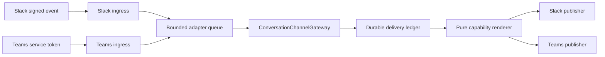

# Production A3 Channel Runtime

This document owns the production Teams and Slack A3 conversation edge: authenticated ingress,
bounded provider publishing, lifecycle composition, durable recovery, deployment isolation, and
rollback. It completes transport around the channel-neutral conversation and presentation
contracts without creating another judgment or execution surface.

> **Scope:** A3 reads and draft-only requests are in scope. Slack A1 approval, A2/A4 notification
> policy, document semantic transport, inline vision, and unrelated channel backlog remain with
> their existing owners.
>
> **Topology:** The runtime is an authority-free edge adapter workload built from the existing Core
> distribution. It is not a sixth independently releasable control-plane distribution, does not
> own a migration branch or domain writer, and never receives Thor's identity.

## Design at a glance

The edge accepts only provider-authenticated requests, replaces vendor identity with one configured
FDAI principal, and queues a bounded `InboundTurn`. Existing conversation coordination produces one
`OutboundResponse`; existing durable delivery persists it before a pure provider publisher sends
it. Startup resolves every required dependency and reconciles uncertain sends before Starlette
accepts traffic.

## Implementation status

### Implementation scope

| Area | State | Evidence | Notes |
|------|-------|----------|-------|
| A3 edge design and ownership | in-progress | [Issue #235](https://github.com/dotnetpower/fdai/issues/235); this document pair | The revised design passed critique; implementation and runtime evidence remain open. |
| Authenticated ingress and provider publishers | not-started | [Ingress and publishing](#ingress-and-publishing) | Existing A1 and A2/A4 adapters are not A3 publishers. |
| Durable runtime composition | not-started | [Runtime lifecycle](#runtime-lifecycle) | Migration 0047 exists; concrete PostgreSQL stores and production composition are absent. |
| Local and Azure edge workload | not-started | [Deployment and rollback](#deployment-and-rollback) | No route, entry point, local launch, or Container App exists yet. |
| Independent hardening | not-started | [Hardening campaign](#hardening-campaign) | Completion requires at least ten rounds and zero Medium-or-higher residuals. |

### Implementation history

| Date | State | Change | Evidence | Remaining |
|------|-------|--------|----------|-----------|
| 2026-08-19 | in-progress | Accepted the authority-free edge-workload design after critique rejected both Operator API co-hosting and a sixth service distribution. | `current change`; [Issue #235](https://github.com/dotnetpower/fdai/issues/235); route, tracking, translation, and link checks. | Implement, harden, validate, and retain governed local and deployed receipts. |

### Remaining work

- [ ] Implement every scope row and pass the focused and exact-diff checks in this document.
- [ ] Complete at least ten critique rounds and retain only Low or rejected residual findings.
- [ ] Retain governed local and protected deployed receipts before changing any row to `validated`.

## Architectural decision

### Why an edge workload

Three placements were evaluated:

| Placement | Decision | Reason |
|-----------|----------|--------|
| Operator API routes | Rejected | Channel secrets, public webhook ingress, and provider acknowledgement would widen the authenticated read API's blast radius and contradict its non-channel ownership. |
| Sixth independently releasable service distribution | Rejected | It would reopen the completed five-distribution N/N-1, migration, image, and rollback program without a new domain writer or implementation-isolation need. |
| Existing Core distribution, separate edge Container App | Accepted | It isolates public ingress and channel credentials with a dedicated identity while reusing the owning gateway and durable contracts without cross-service imports or a new writer. |

The edge workload is independently runnable and can scale separately, but package, contract, and
migration ownership remain with Core. This deployment distinction does not change the fixed five
service distributions or the fifteen-agent pantheon.

## Ingress and publishing

### Slack

Slack ingress verifies the exact raw request body with the configured signing secret, provider
timestamp, constant-time comparison, and a five-minute replay window. It accepts only URL
verification and non-bot message events. A bot event, retry duplicate, unsupported subtype,
malformed body, unknown sender, or oversized message never enters the queue.

Normalized files retain only an opaque file id, safe leaf name, positive byte size, and media-type
hint. Payload URLs are discarded. Private download remains behind the existing server-owned
fetcher and protected-ingestion contract.

Slack publishing uses fixed `chat.postMessage` and `chat.update` endpoints, a startup-resolved bot
token, the pure Block Kit renderer, the inbound channel/thread identity, and strict `ok=true` plus
message timestamp acknowledgement. The response cannot supply a URL, token, or API method.

### Teams

Teams ingress validates the Bot Framework bearer token before parsing operator identity. The
authenticator verifies RS256 against bounded cached JWKS, application audience, approved issuer,
`exp` and `nbf`, and the service URL claim. The activity must also match the configured tenant,
`channelId=msteams`, verified service URL, and a configured `aadObjectId` to FDAI principal map.

Teams publishing resolves only the authenticated service URL allowed for the conversation, obtains
a Bot Framework audience token from the injected workload identity, uses the pure Adaptive Card
renderer, and requires a bounded resource id acknowledgement. Activity payloads cannot select a
different host or token audience.

### Queue and bounds

Each adapter owns one bounded queue. Queue saturation returns a provider-appropriate retry response
without accepting the turn. Request bytes, text, files, fields, identities, provider responses,
and serialized card/block payloads have independent limits. Unsupported input fails before queue
admission. No error includes request bodies, sender ids, file names, credentials, or provider text.

## Durable delivery

Migration `20260720_0047` remains the schema owner. Concrete PostgreSQL adapters implement:

- verified principal binding create/read/revoke/list operations;
- immutable response insert with idempotency-content conflict rejection;
- `FOR UPDATE SKIP LOCKED` due claims and lease-fenced finish;
- attempt and acknowledgement persistence in the same transaction as state closure;
- process-loss conversion from expired `sending` to immutable `ambiguous`;
- revisioned adapter breaker compare-and-set;
- bounded inbound message claims that can be released only before protected ingestion completes.

Database grants keep the edge on those channel tables only. It receives no audit append, ontology,
policy, Action, executor, or managed-resource grant. Durable response JSON round-trips artifact
version, facts, limitations, evidence references, activities, progress, and thread intent exactly.

## Runtime lifecycle

`ProductionChannelRuntime` is composed in the top-level Starlette lifespan:

1. Validate the closed environment/config schema and enabled channel set.
2. Resolve secret references and identity dependencies without logging values.
3. Open PostgreSQL and the owned HTTP client with redirects disabled and bounded timeouts.
4. Build authenticated adapters, principal resolvers, protected attachment ingestion, gateway,
   delivery coordinator, and fixed routes.
5. Reconcile expired `sending` rows before marking readiness true or accepting traffic.
6. Start one supervised gateway consumer per enabled adapter.
7. On shutdown, stop route admission, close queues, cancel and await consumers, close providers,
   and leave no detached read or send task.

Startup fails before traffic when any enabled channel lacks a secret, principal map, identity,
endpoint policy, database, attachment dependency, or durable delivery binding. `/healthz` reports
only liveness and readiness booleans. It exposes no channel, principal, endpoint, credential,
delivery, or queue identifiers.

## Deployment and rollback

Local launch adds one edge process on a dedicated nonstandard backend port and keeps the standard
Console and Operator ports unchanged. Local and deployed use the same routes, stores, auth checks,
renderers, queue bounds, reconciliation, and health contract. Local secrets remain local-only and
the full-stack launcher fails closed when an enabled channel is not configured.

Azure uses a separate Container App from the existing Core image with:

- dedicated user-assigned managed identity and no executor roles;
- Key Vault references for channel secret values;
- external HTTPS ingress only on the A3 webhook and content-free health surface;
- minimum and maximum replicas, CPU/memory, request-size limits, and startup/readiness/liveness
  probes;
- service-owned PostgreSQL role and no cross-service implementation package;
- structured logs and aggregate delivery metrics without content or identity.

Protected deployment follows the existing VNet runner path. Rollback restores the prior disabled
or prior-image edge revision without changing Core, Operator, offsets, migration heads, or channel
bindings. A rollback rehearsal proves route closure, no duplicate terminal send, exact identity
roles, and five existing service revisions unchanged.

## Failure behavior

| Failure | Required behavior |
|---------|-------------------|
| Invalid signature or service token | Return `401`; enqueue nothing. |
| Valid service, unknown tenant or principal | Return `403`; enqueue nothing. |
| Malformed or oversized request | Return `400` or `413`; retain no body. |
| Queue full | Return bounded retry status; do not claim the message. |
| Duplicate provider event | Acknowledge without coordinator, ingestion, or send replay. |
| Provider rejection before acknowledgement | Record definitive failure for bounded retry. |
| Interrupted or malformed acknowledgement | Record immutable ambiguous duplicate risk; never repost automatically. |
| Process loss with `sending` lease | Startup reconciliation closes it as ambiguous before consumers start. |
| Unsupported artifact or provider capability | Send canonical readable text with mandatory limitations, evidence, authority, and unavailable state. |
| Attachment dependency unavailable | Fail startup when attachment support is enabled; otherwise reject that turn without inline processing. |

## Hardening campaign

Run at least these independent rounds after implementation. A round ends only after each finding is
reproduced or rejected against executable evidence. Every accepted Medium-or-higher finding gets a
focused regression and a new round rechecks the corrected boundary.

1. Slack signature, timestamp, replay, challenge, retry, and bot-loop handling.
2. Teams JWT, JWKS cache/refresh, issuer/audience/time, tenant, service URL, and principal binding.
3. Body, queue, attachment, text, field, block, card, response, and aggregate byte bounds.
4. Secret, token, endpoint, identity, payload, log, error, and metric redaction.
5. Principal/scope/thread binding, cross-channel continuity, self-substitution, and confused deputy.
6. PostgreSQL CAS, duplicate, reorder, concurrent claim, lease expiry, process loss, and immutable terminal state.
7. Publisher fixed destinations, acknowledgement parsing, edit/thread fallback, and duplicate risk.
8. Startup all-or-none composition, readiness, shutdown cancellation, task leaks, and dependency failure.
9. Local/deployed parity, identity roles, public ingress, Key Vault references, probes, and rollback.
10. Contract/version replay, v1/v2 artifact degradation, canonical fact parity, and no execution authority.

Continue beyond round ten while any verified Medium-or-higher finding remains. Final review records
Low tradeoffs separately and never promotes unit or synthetic evidence to deployed validation.

## Verification

Focused checks include adapter unit tests, ASGI route tests, PostgreSQL live tests, gateway and
durable-delivery suites, boundary/import checks, Terraform validation, local process smoke, and
protected deployed plan/apply/rollback receipts. Every focused commit runs
`make test-changed DIFF=<commit>^..<commit>` after commit.

## Related docs

| To learn about | Read |
|----------------|------|
| Channel categories, trust, and rich rendering | [Channels and notifications](channels-and-notifications.md) |
| Durable bindings and delivery recovery | [Durable conversation delivery](durable-conversation-delivery.md) |
| Attachment safety and private fetch | [Conversation attachments](conversation-attachments.md) |
| Service graduation and identity ownership | [Service graduation and data ownership](../architecture/service-graduation-and-ownership.md) |
