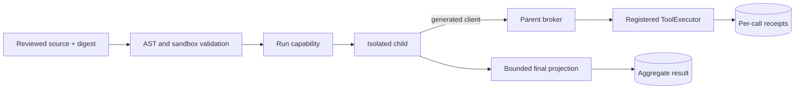

# 프로그래밍 방식 도구 파이프라인

프로그래밍 방식 도구 파이프라인은 검토된 Python 데이터 변환을 격리된 child에서 실행하고,
작은 등록 읽기 전용 FDAI 도구 집합을 호출합니다. Parent conversation에는 경계가 있는 최종
projection 하나만 반환하고, 호출별 receipt와 집계 통계는 model context 밖에 영구 저장합니다.

> **범위.** 이 surface는 결정적인 read, filter, join, aggregate 작업용입니다. Mutation,
> approval, scheduling, delegation, memory 변경, provider SDK 직접 접근, 재귀 pipeline 실행은
> 지원하지 않습니다.

## 한눈에 보는 설계

Request는 검토된 source를 SHA-256 digest 및 안정적인 idempotency key에 바인딩합니다. FDAI는
source를 검증하고 server-owned sandbox profile을 적용하며, 짧은 수명의 run capability를 발급한
뒤 immutable run specification을 주입된 `ProgrammaticPipelineRunner`에 보냅니다. Child는 생성된
`PipelineClient`만 호출할 수 있으며, 각 호출은 parent broker와 기존 등록 `ToolExecutor` dispatch
경로로 돌아옵니다.

## Immutable contract

Public request, result, per-call receipt, limit, statistics, generated-client contract, runner
specification, broker call, broker response는 frozen dataclass입니다. Mutable mapping은 child 경계를
넘지 않습니다. Input과 output은 canonical JSON string을 사용하므로 byte limit과 digest가 실제
전송 representation을 가리킵니다.

- **검토된 source:** 실행 직전에 다시 계산한 SHA-256 digest와 `reviewed_source_digest`가 같습니다.
- **Idempotency:** 완료된 `idempotency_key`는 두 번째 child를 시작하지 않고 저장된 aggregate를 반환합니다.
- **Compact result:** Conversation projection에는 terminal status, completeness, final JSON, receipt
  reference, call count, duration, output byte, truncation state가 포함됩니다.
- **Incomplete output:** Timeout, cancellation, child crash, runner failure, invalid envelope, final JSON
  overflow는 `complete=true` 또는 일부 final JSON을 반환하지 않습니다.

## Source policy

Programmatic profile은 일반 `PythonTask` policy를 변경하지 않고 기존 `core/python_task` AST
validator를 확장합니다. 검토된 source는 안전한 standard-library data module과 generated client
module의 `PipelineClient` 직접 import만 사용할 수 있습니다.

Validator는 다음을 차단합니다.

- `os`, `subprocess`, `socket`, provider SDK, local module을 포함한 data allowlist 밖의 import
- filesystem access, dynamic code, process creation, networking, runtime input
- trusted client implementation을 노출할 수 있는 private 또는 dunder introspection
- generated client module 자체 import 또는 `PipelineClient` 외 symbol import
- 재귀 pipeline call과 pipeline 형태 tool identifier

AST policy는 도달 가능한 언어 surface를 줄입니다. Bubblewrap가 계속 격리 authority입니다. Child는
read-only source mount, private temporary filesystem, 별도 broker socket, network가 없는 namespace,
Linux capability 없음, scrubbed environment만 받습니다.

## Capability와 broker

`PipelineCapabilityAuthority`는 run마다 random 256-bit-equivalent URL-safe token을 만들고 SHA-256
digest만 저장합니다. Authorization은 dispatch 전에 run, token digest, expiry, tool allowlist, call
input byte, one-time call id, 전체 call count를 검사합니다. Call id는 tool 실행 전에 소비하므로
모호한 call을 재시도해도 실행을 중복할 수 없습니다.

Broker는 provider를 직접 resolve하지 않습니다. 주입된 등록 `ToolExecutor`를 호출하여 composition
root의 일반 registry, argument schema, provider wrapper, access check, sandboxing, redaction, audit
동작을 유지합니다. Broker는 input/output digest, status, timing, byte count, opaque receipt reference를
포함하는 pipeline receipt를 추가합니다. Tool output overflow는 일부 결과가 아니라 receipt가 남는
failure입니다.

## Runner adapter

`ProgrammaticPipelineRunner`는 provider-neutral async protocol입니다.

- **Local runner:** 별도 source/socket directory를 만들고 Unix-socket broker를 시작하며, 새 process
  group에서 child를 실행하고 CPU/address-space limit을 적용합니다. Typed local-read shell command와
  같은 bubblewrap posture를 사용합니다. Timeout과 cancellation은 process group을 종료합니다. 모든
  terminal path에서 temporary directory와 socket을 정리합니다.
- **Azure-compatible runner:** Source, generated-client, submission digest와 byte limit을 검증한 뒤
  주입된 managed submission client에 위임합니다. Adapter는 Azure resource를 provision하지 않고 cloud
  credential도 전달하지 않습니다. Deployment는 pre-provisioned isolated job과 managed identity
  transport에 바인딩할 수 있습니다.

## 영속성

Alembic revision `20260720_0046`은 `programmatic_pipeline_call`과
`programmatic_pipeline_run`을 추가합니다. Call은 `(run_id, call_id)` 기준 append-only이며 run별 unique
sequence를 가집니다. Aggregate result는 `idempotency_key`를 key로 사용하고 status, source digest,
compact output, receipt reference, statistics를 보존합니다. Aggregate 완료 전에도 call을 저장하므로
마지막 tool call과 terminal result write 사이에 child가 실패해도 evidence가 남습니다.

## 측정

결정적 benchmark는 같은 tool-call count와 고정 round-trip cost를 사용해 반복 sequential
model-mediated turn과 pipeline projection 하나를 비교합니다. 고정 20-call fixture는 estimated
conversation context를 90% 넘게, estimated latency를 80% 넘게 줄입니다. 이는 fixture의 regression
threshold이며 production 성능 주장이 아닙니다.

## Operator surface

Console mutation control 또는 public execution route를 추가하지 않습니다. 향후 authenticated API는
같은 service를 통해 검토된 request를 submit할 수 있지만 capability token, runner transport detail,
privileged credential을 노출하면 안 됩니다.

## 관련 문서

| 알아볼 내용 | 읽을 문서 |
|-------------|----------|
| Source와 delivery layout | [프로젝트 구조](../architecture/project-structure-ko.md) |
| Source, test, adapter | [코드 맵](../architecture/code-map-ko.md) |
| Prompt composition의 등록 tool | [진화하는 시스템 프롬프트](../decisioning/prompt-composition-ko.md) |
| Local isolation posture | [App Shape](../../../.github/instructions/app-shape.instructions.md) |
