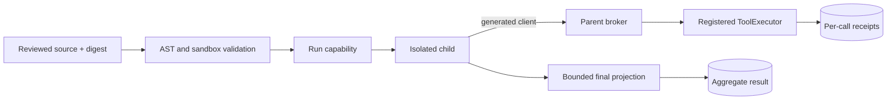

# 프로그래밍 방식 도구 파이프라인

프로그래밍 방식 도구 파이프라인은 검토된 Python 데이터 변환을 격리된 하위에서 실행하고,
작은 등록 읽기 전용 FDAI 도구 집합을 호출합니다. 상위 대화에는 경계가 있는 최종
변환 결과 하나만 반환하고, 호출별 증적과 집계 통계는 모델 맥락 밖에 영구 저장합니다.

> **범위.** 이 표면은 결정적인 읽기, 필터, 결합, 집계 작업용입니다. 변경,
> 승인, 예약, 위임, 기억 변경, 프로바이더 SDK 직접 접근, 재귀 파이프라인 실행은
> 지원하지 않습니다.

## 구현 상태

### 구현 범위

| 영역 | 상태 | 근거 | 참고 |
|------|------|------|------|
| 변경할 수 없는 계약 및 서비스 조정 | implemented | [`models.py`](../../../services/core-control-plane/src/fdai/core/programmatic_pipeline/models.py), [`service.py`](../../../services/core-control-plane/src/fdai/core/programmatic_pipeline/service.py), [`test_service.py`](../../../services/core-control-plane/tests/core/programmatic_pipeline/test_service.py) | 고정된 계약, 다이제스트 바인딩, 범위가 제한된 최종 결과 및 멱등한 집계 재사용이 구현됐고 집중 검사를 통과했습니다. |
| 출처 정책 및 생성된 클라이언트 경계 | implemented | [`validator.py`](../../../services/core-control-plane/src/fdai/core/python_task/validator.py), [`client.py`](../../../services/core-control-plane/src/fdai/core/programmatic_pipeline/client.py), [`test_programmatic_pipeline_validator.py`](../../../services/core-control-plane/tests/core/python_task/test_programmatic_pipeline_validator.py) | 집중 검사는 허용된 데이터 가져오기를 다루며 파일 시스템, 프로세스, 네트워크, 동적 코드, 내부 검사 및 재귀 파이프라인 우회 경로를 차단합니다. |
| 기능 권한 및 상위 브로커 | implemented | [`capability.py`](../../../services/core-control-plane/src/fdai/core/programmatic_pipeline/capability.py), [`broker.py`](../../../services/core-control-plane/src/fdai/core/programmatic_pipeline/broker.py), [`test_capability_and_broker.py`](../../../services/core-control-plane/tests/core/programmatic_pipeline/test_capability_and_broker.py) | 권한 부여, 일회성 호출 소비, 등록된 도구 호출, 바이트 한도 및 범위가 제한된 증적이 집중 검사를 통과했습니다. |
| 프로바이더 프로토콜 및 Azure 호환 어댑터 | implemented | [`programmatic_pipeline.py`](../../../services/core-control-plane/src/fdai/shared/providers/programmatic_pipeline.py), [`programmatic_pipeline.py`](../../../services/core-control-plane/src/fdai/delivery/azure/programmatic_pipeline.py), [`test_programmatic_pipeline.py`](../../../services/core-control-plane/tests/delivery/azure/test_programmatic_pipeline.py) | 프로바이더 중립 프로토콜과 엄격한 관리형 제출 어댑터가 구현됐고 주입된 클라이언트로 검사됐습니다. 실제 Azure 실행 증적은 아닙니다. |
| 로컬 격리 실행기 | not-started | [실행기 어댑터](#실행기-어댑터) | 문서에 정의된 Unix 소켓, 프로세스 그룹, 리소스 한도 및 Bubblewrap 실행기는 구체적인 프로덕션 구현이 없습니다. 검사는 메모리 내 실행기 대역을 사용합니다. |
| PostgreSQL 영속성 | implemented | [`20260720_0046_programmatic_pipeline.py`](../../../alembic/versions/20260720_0046_programmatic_pipeline.py), [`postgres_programmatic_pipeline.py`](../../../services/core-control-plane/src/fdai/delivery/persistence/postgres_programmatic_pipeline.py), [`test_postgres_programmatic_pipeline.py`](../../../services/core-control-plane/tests/persistence/test_postgres_programmatic_pipeline.py) | 스키마, 저장소, codec, 호출 증적 영속성 및 집계 결과 영속성이 지원되는 일회용 PostgreSQL 데이터베이스에서 세 건의 집중 사례를 건너뛰기 없이 통과했습니다. |
| 결정론적 벤치마크 | implemented | [`benchmark.py`](../../../services/core-control-plane/src/fdai/core/programmatic_pipeline/benchmark.py), [`test_benchmark.py`](../../../services/core-control-plane/tests/core/programmatic_pipeline/test_benchmark.py) | 고정된 20회 호출 회귀 fixture가 문서의 맥락 및 지연 시간 임계값을 검사합니다. 프로덕션 성능 근거는 아닙니다. |
| 프로덕션 조립 및 운영자 제출 | not-started | [`service.py`](../../../services/core-control-plane/src/fdai/core/programmatic_pipeline/service.py), [운영자 표면](#운영자-표면) | 서비스는 내보내지만 프로덕션 조립 호출자, 인증된 Operator API 경로 또는 콘솔 제출 표면이 없습니다. |

### 구현 이력

| 날짜 | 상태 | 변경 | 근거 | 남은 작업 |
|------|------|------|------|-----------|
| 2026-08-13 | in-progress | 이전 전달 이력을 재구성하지 않고 근거 범위 안에서 구현 원장을 도입했습니다. | `current change`; 범위 테이블에 나열된 현재 소스; 구성 요소 집중 검사 25건이 통과했고 PostgreSQL 검사는 2건이 통과했지만 `FDAI_DATABASE_URL`이 설정되지 않아 실제 데이터베이스 검사 1건을 건너뛰었습니다. | 로컬 실행기와 프로덕션 조립을 구현하고, 실제 영속성 검사를 통과하며, 관리되는 종단 간 근거를 보존해야 합니다. |
| 2026-08-14 | implemented | 실제 데이터베이스에서 호출과 집계 결과 round trip을 증명한 뒤 PostgreSQL 영속성을 승격했습니다. | `current change`; `test_postgres_programmatic_pipeline.py`가 지원되는 일회용 데이터베이스에서 세 건을 건너뛰기 없이 통과했습니다. | 로컬 실행기와 프로덕션 조립을 구현한 뒤 관리되는 종단 간 근거를 보존해야 합니다. |

### 남은 작업

- [ ] 문서에 정의된 Unix 소켓 브로커, 프로세스 그룹 종료, CPU 및 주소 공간 한도, Bubblewrap 격리와 모든 최종 경로의 정리 검사를 갖춘 로컬 `ProgrammaticPipelineRunner`를 구현합니다.
- [ ] 프로덕션 조립 루트에 `ProgrammaticPipelineService`를 바인딩하고 접근, 민감정보 제거 또는 감사 동작을 우회하지 않은 채 등록된 `ToolExecutor`를 통해 검토된 파이프라인을 실행하는 종단 간 집중 검사를 통과합니다.
- [x] 지원되는 실제 데이터베이스 fixture에서 PostgreSQL 파이프라인 영속성 검사를 통과하고, persistence 상태를 `implemented`로 높이기 전에 집중 검사 결과를 보존합니다.
- [ ] 검토된 출처 다이제스트 바인딩을 적용하고 기능 토큰, 실행기 전송 세부 정보 및 자격 증명이 API 경계를 넘지 않음을 증명하는 검사를 갖춘 경우에만 인증된 Operator API 제출 경로를 추가합니다.
- [ ] 범위 행을 `validated`로 높이기 전에 고정된 리비전에서 호출별 및 집계 감사 영속성, 중복 억제, 실패 정리 및 범위가 제한된 출력을 증명하는 관리되는 런타임 증적을 보존합니다.

## 한눈에 보는 설계

요청은 검토된 출처를 SHA-256 다이제스트 및 안정적인 멱등성 키에 바인딩합니다. FDAI는
출처를 검증하고 서버가 소유한 샌드박스 프로파일을 적용하며, 짧은 수명의 실행 기능을 발급한
뒤 변경할 수 없는 실행 명세를 주입된 `ProgrammaticPipelineRunner`에 보냅니다. 하위는 생성된
`PipelineClient`만 호출할 수 있으며, 각 호출은 상위 브로커와 기존 등록 `ToolExecutor` dispatch
경로로 돌아옵니다.

```mermaid
flowchart LR
    R[Reviewed source + digest] --> V[AST and sandbox validation]
    V --> C[Run capability]
    C --> X[Isolated child]
    X -->|generated client| B[Parent broker]
    B --> T[Registered ToolExecutor]
    T --> P[(Per-call receipts)]
    X --> O[Bounded final projection]
    O --> A[(Aggregate result)]
```

## 변경할 수 없는 계약

공개 요청, 결과, 호출별 증적, 한도, 통계, 생성된 클라이언트 계약, 실행기
명세, 브로커 호출, 브로커 응답은 고정된 데이터 클래스입니다. 변경 가능한 대응은 하위 경계를
넘지 않습니다. 입력과 출력은 정본 JSON 문자열을 사용하므로 바이트 한도와 다이제스트가 실제
전송 표현을 가리킵니다.

- **검토된 출처:** 실행 직전에 다시 계산한 SHA-256 다이제스트와 `reviewed_source_digest`가 같습니다.
- **멱등성:** 완료된 `idempotency_key`는 두 번째 하위를 시작하지 않고 저장된 집계를 반환합니다.
- **간결한 결과:** 대화 변환 결과에는 최종 상태, 완전성, 최종 JSON, 증적
  참조, 호출 개수, 소요 시간, 출력 바이트, 잘림 상태가 포함됩니다.
- **불완전한 출력:** 시간 초과, 취소, 하위 비정상 종료, 실행기 실패, 잘못된 묶음, 최종 JSON
  초과분은 `complete=true` 또는 일부 최종 JSON을 반환하지 않습니다.

## 출처 정책

Programmatic 프로파일은 일반 `PythonTask` 정책을 변경하지 않고 기존 `core/python_task` AST
검증기를 확장합니다. 검토된 출처는 안전한 standard-library data 모듈과 생성된 클라이언트
모듈의 `PipelineClient` 직접 가져오기만 사용할 수 있습니다.

검증기는 다음을 차단합니다.

- `os`, `subprocess`, `socket`, 프로바이더 SDK, 로컬 모듈을 포함한 data 허용 목록 밖의 가져오기
- 파일 시스템 접근, dynamic code, 프로세스 creation, networking, 런타임 입력
- trusted 클라이언트 구현을 노출할 수 있는 비공개 또는 dunder introspection
- 생성된 클라이언트 모듈 자체 가져오기 또는 `PipelineClient` 외 symbol 가져오기
- 재귀 파이프라인 호출과 파이프라인 형태 도구 identifier

AST 정책은 도달 가능한 언어 표면을 줄입니다. Bubblewrap가 계속 격리 authority입니다. 하위는
읽기 전용 출처 mount, 비공개 temporary 파일 시스템, 별도 브로커 소켓, 네트워크가 없는 이름 공간,
Linux 기능 없음, scrubbed 환경만 받습니다.

## 기능과 브로커

`PipelineCapabilityAuthority`는 실행마다 random 256-bit-equivalent URL-safe 토큰을 만들고 SHA-256
다이제스트만 저장합니다. 권한 확인은 dispatch 전에 실행, 토큰 다이제스트, 만료, 도구 허용 목록, 호출
입력 바이트, one-time 호출 id, 전체 호출 개수를 검사합니다. 호출 id는 도구 실행 전에 소비하므로
모호한 호출을 재시도해도 실행을 중복할 수 없습니다.

브로커는 프로바이더를 직접 해석하지 않습니다. 주입된 등록 `ToolExecutor`를 호출하여 조립
루트의 일반 레지스트리, 인자 스키마, 프로바이더 래퍼, 접근 검사, sandboxing, 민감정보 제거, 감사
동작을 유지합니다. 브로커는 입력/출력 다이제스트, 상태, timing, 바이트 개수, opaque 증적 참조를
포함하는 파이프라인 증적을 추가합니다. 도구 출력 초과분은 일부 결과가 아니라 증적이 남는
실패입니다.

## 실행기 어댑터

`ProgrammaticPipelineRunner`는 provider-neutral 비동기 프로토콜입니다.

- **로컬 실행기:** 별도 출처/소켓 디렉터리를 만들고 Unix-socket 브로커를 시작하며, 새 프로세스
  그룹에서 하위를 실행하고 CPU/address-space 한도를 적용합니다. 타입이 지정된 local-read shell 명령과
  같은 bubblewrap 자세를 사용합니다. 시간 초과와 취소는 프로세스 그룹을 종료합니다. 모든
  최종 경로에서 temporary 디렉터리와 소켓을 정리합니다.
- **Azure-compatible 실행기:** 출처, 생성된 클라이언트, submission 다이제스트와 바이트 한도를 검증한 뒤
  주입된 managed submission 클라이언트에 위임합니다. 어댑터는 Azure 리소스를 provision하지 않고 cloud
  자격 증명도 전달하지 않습니다. 배포는 pre-provisioned isolated 작업과 managed 신원
  전송 계층에 바인딩할 수 있습니다.

## 영속성

Alembic 개정 번호 `20260720_0046`은 `programmatic_pipeline_call`과
`programmatic_pipeline_run`을 추가합니다. 호출은 `(run_id, call_id)` 기준 추가 전용이며 실행별 unique
순서를 가집니다. 집계 결과는 `idempotency_key`를 키로 사용하고 상태, 출처 다이제스트,
간결한 출력, 증적 참조, 통계를 보존합니다. 집계 완료 전에도 호출을 저장하므로
마지막 도구 호출과 최종 결과 쓰기 사이에 하위가 실패해도 근거가 남습니다.
배포 조립은 저장소를 만들기 전에 SQLAlchemy 형식의 PostgreSQL URL을 plain psycopg
DSN으로 변환합니다. Live-database integration 모음은 저장소와 cleanup 연결에 같은 변환을
사용합니다.

## 측정

결정적 벤치마크는 같은 tool-call 개수와 고정 round-trip 비용을 사용해 반복 순차
model-mediated 턴과 파이프라인 변환 결과 하나를 비교합니다. 고정 20-call 고정본은 estimated
대화 맥락을 90% 넘게, estimated 지연 시간을 80% 넘게 줄입니다. 이는 고정본의 회귀
임계값이며 운영 성능 주장이 아닙니다.

## Operator 표면

Console 변경 control 또는 공개 실행 경로를 추가하지 않습니다. 향후 인증된 API는
같은 서비스를 통해 검토된 요청을 submit할 수 있지만 기능 토큰, 실행기 전송 계층 상세,
privileged 자격 증명을 노출하면 안 됩니다.

## 관련 문서

| 알아볼 내용 | 읽을 문서 |
|-------------|----------|
| 출처와 전달 배치 | [프로젝트 구조](../architecture/project-structure-ko.md) |
| 출처, test, 어댑터 | [코드 맵](../architecture/code-map-ko.md) |
| 프롬프트 조립의 등록 도구 | [진화하는 시스템 프롬프트](../decisioning/prompt-composition-ko.md) |
| 로컬 격리 자세 | [App Shape](../../../.github/instructions/app-shape.instructions.md) |
