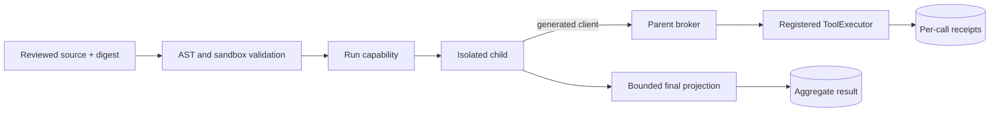

# Programmatic Tool Pipelines

Programmatic tool pipelines run reviewed Python data transformations in an isolated child while
calling a small set of registered read-only FDAI tools. The parent conversation receives one
bounded final projection, while per-call receipts and aggregate statistics remain durable outside
model context.

> **Scope.** This surface is for deterministic read, filter, join, and aggregate work. Mutation,
> approval, scheduling, delegation, memory changes, direct provider SDK access, and recursive
> pipeline execution are not supported.

## Design at a glance

A request binds reviewed source to its SHA-256 digest and a stable idempotency key. FDAI validates
the source, applies a server-owned sandbox profile, issues a short-lived run capability, and sends
an immutable run specification to an injected `ProgrammaticPipelineRunner`. The child can call only
the generated `PipelineClient`; each call returns through the parent broker and the existing
registered `ToolExecutor` dispatch path.

## Immutable contracts

The public request, result, per-call receipt, limits, statistics, generated-client contract, runner
specification, broker call, and broker response are frozen dataclasses. Mutable mappings do not
cross the child boundary. Inputs and outputs use canonical JSON strings so byte limits and digests
refer to the exact transferred representation.

- **Reviewed source:** `reviewed_source_digest` equals the SHA-256 digest recomputed immediately
  before execution.
- **Idempotency:** a completed `idempotency_key` returns the stored aggregate without starting a
  second child.
- **Compact result:** the conversation projection contains terminal status, completeness, final
  JSON, receipt references, call count, duration, output bytes, and truncation state.
- **Incomplete output:** timeout, cancellation, child crash, runner failure, invalid envelope, and
  final JSON overflow never return `complete=true` or partial final JSON.

## Source policy

The programmatic profile extends the existing `core/python_task` AST validator without changing
the general `PythonTask` policy. Reviewed source may import safe standard-library data modules and
`PipelineClient` directly from the generated client module.

The validator blocks:

- imports outside the data allowlist, including `os`, `subprocess`, `socket`, provider SDKs, and
  local modules;
- filesystem access, dynamic code, process creation, networking, and runtime input;
- private or dunder introspection that could expose the trusted client implementation;
- importing the generated client as a module or importing anything except `PipelineClient`; and
- recursive pipeline calls and pipeline-shaped tool identifiers.

The AST policy reduces the reachable language surface. Bubblewrap remains the isolation authority:
the child receives a read-only source mount, private temporary filesystem, separate broker socket,
no network namespace, no Linux capabilities, and a scrubbed environment.

## Capability and broker

`PipelineCapabilityAuthority` creates a random 256-bit-equivalent URL-safe token per run and stores
only its SHA-256 digest. Authorization checks the run, token digest, expiry, tool allowlist, call
input bytes, one-time call id, and total call count before dispatch. A call id is consumed before
the tool runs, so retrying an ambiguous call cannot duplicate execution.

The broker never resolves a provider directly. It invokes the injected registered `ToolExecutor`,
which preserves the composition root's normal registry, argument schema, provider wrapper, access
checks, sandboxing, redaction, and audit behavior. The broker adds a pipeline receipt with input and
output digests, status, timing, byte counts, and an opaque receipt reference. Tool output overflow
is a receipted failure rather than a partial result.

## Runner adapters

`ProgrammaticPipelineRunner` is the provider-neutral async protocol.

- **Local runner:** creates separate source and socket directories, starts a Unix-socket broker,
  launches the child in a new process group, applies CPU/address-space limits, and uses the same
  bubblewrap posture as typed local-read shell commands. Timeout and cancellation kill the process
  group. Temporary directories and sockets close on every terminal path.
- **Azure-compatible runner:** validates source, generated-client, and submission digests and byte
  limits, then delegates to an injected managed submission client. The adapter provisions no Azure
  resource and carries no cloud credential. A deployment can bind it to a pre-provisioned isolated
  job and managed identity transport.

## Persistence

Alembic revision `20260720_0046` adds `programmatic_pipeline_call` and
`programmatic_pipeline_run`. Calls are append-only by `(run_id, call_id)` with a unique sequence per
run. Aggregate results are keyed by `idempotency_key` and retain status, source digest, compact
output, receipt references, and statistics. Calls can land before aggregate completion, which
preserves evidence when the child fails between its final tool call and terminal result write.

## Measurement

The deterministic benchmark compares repeated sequential model-mediated turns with one pipeline
projection using the same tool-call count and fixed round-trip costs. The frozen 20-call fixture
reduces estimated conversation context by more than 90% and estimated latency by more than 80%.
These are regression thresholds for the fixture, not production performance claims.

## Operator surface

No console mutation control or public execution route is added. A future authenticated API may
submit a reviewed request through the same service, but it must not expose capability tokens,
runner transport details, or privileged credentials.

## Related docs

| To learn about | Read |
|----------------|------|
| Source and delivery layout | [Project Structure](../architecture/project-structure.md) |
| Source, tests, and adapters | [Code Map](../architecture/code-map.md) |
| Registered tools in prompt composition | [Evolving System Prompt](../decisioning/prompt-composition.md) |
| Local isolation posture | [App Shape](../../../.github/instructions/app-shape.instructions.md) |
