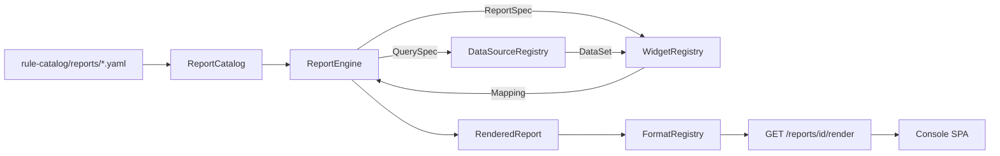

# 리포팅 서브시스템

포크가 FE 계약을 바꾸지 않고도 "어떤 형태의 리포트든" - 시계열
개요, 상위 N개 테이블, 비용 요약, SLO 소진 보드, 시그널 피드
롤업, 보안 사후 분석, 나중에 나올 FE 실험까지 - 만들 수 있게
해주는 선언적·확장 가능한 시각화 파이프라인입니다. 모든 것은 세
개의 레지스트리(보고 / 데이터 원본 / 위젯 / format)와 YAML 카탈로그
뒤에 있으며, 새 리포트 추가는 YAML 파일 하나, 새 데이터 소스
추가는 프로토콜 구현 하나로 끝납니다. 새 시각화 형태는 순수 백엔드 빌더와 검토된 SPA
렌더러가 모두 필요합니다.

계약상 읽기 전용입니다. 모든 라우트는 `GET`이며, 어떤 위젯도
아무것도 실행하지 않습니다. 이 서브시스템은 실행자 신원을 절대로
보유하지 않는 콘솔의 pull 절반입니다
([app-shape.instructions.md § 계층 Boundaries](../../../.github/instructions/app-shape.instructions.md#layer-boundaries-security)).

업계 참고 자료 조사는
[docs/internals/datadog-visualization-surface.md](../../internals/datadog-visualization-surface.md)를
보완하며, 여기서 실제로 shipping되는 카탈로그는 제품 관련성을
가진 유한 부분집합입니다.

## 왜 존재하는가

콘솔 pull 표면은 항상 일회성 `ReadPanel` 핸들러들(KPI 대시보드,
감사 로그, HIL 큐, [operator-console.md](operator-console.md))만
제공해왔습니다. 포크가 원하는 새 "보드"(비용, 표류, DR-drill
이력)가 생길 때마다 새 Python 핸들러, 손으로 짠 새 JSON, 새 FE
렌더러가 필요했습니다. 이는 확장되지 않습니다.

리포팅 서브시스템은 "새 리포트"를 선언적 YAML + (필요할 때만)
새 데이터소스로 바꿉니다. FE는 위젯 `type`을 키로 하는 범용
렌더러입니다 - 새 데이터소스를 wire하고 YAML을 드롭한 포크는
곧바로 라이브 보드를 얻고, **FE는 바뀌지 않습니다**.

## 아키텍처



네 개의 레지스트리, 하나의 엔진:

- `ReportCatalog` - `id -> ReportSpec`, YAML에서 로드.
- `DataSourceRegistry` - `name -> ReportDataSource` (비동기, 읽기 전용,
  I/O-bound).
- `WidgetRegistry` - `type -> WidgetBuilder` (sync, CPU-only, pure).
- `FormatRegistry` - `name -> FormatEncoder` (JSON / Markdown / CSV /
  ...).

엔진은 `ReportSpec`을 선언 순서대로 순회하고, 각 위젯의
`QuerySpec`을 명명된 데이터 원본에 넘기고, 반환된 `DataSet`을
매칭되는 빌더에 통과시킵니다. **위젯별 오류 격리**: 하나의 broken
출처나 문제 있는 빌더는 그 위젯을 `error` 설정 + 빈 `data`로
렌더하며, 다른 모든 위젯은 정상 렌더됩니다.

코드 지도 ([project-structure.md](../architecture/project-structure.md) 참조):

- `services/core-control-plane/src/fdai/core/reporting/` - 엔진 전체 (framework-neutral).
- `services/core-control-plane/src/fdai/core/reporting/composition.py` - 포크 조립
  루트용 `default_reporting_engine` factory.
- `services/operator-service/src/fdai_operator_service/` - 여덟 개의 `GET` 라우트.
- `rule-catalog/reports/` - YAML 카탈로그 + JSON 스키마.

### Console SPA 구현 상태

Console SPA는 이제 `/reports`의 **이력 > 리포트**와
`/reports/<report-id>` 정본 상세 경로를 제공합니다. 카탈로그와
런타임 레지스트리를 읽고, 선언된 변수를 제한된 컨트롤로 렌더링하며,
`GET /reports/<id>/render` 요청만 전송합니다. 공유 위젯 렌더러는
[`widget-capabilities.json`](../../../rule-catalog/reports/widget-capabilities.json)을
통해 업스트림 38개 타입을 모두 accounting합니다. 37개는 검토된 의미 HTML,
SVG 또는 CSS 기본 요소로 렌더링하고, `iframe`은 생성된 작업 흐름 표면에서
의도적으로 차단합니다. 기능 카탈로그는 SPA가 사용하며 테스트에서 백엔드
레지스트리와 exact-match하므로 새 업스트림 빌더가 사용 불가 작업 흐름 UI로 조용히
퇴화할 수 없습니다.

이 지원 타입으로 작성된 리포트는 FE 코드 변경 없이 표시됩니다. 새로 만든
visualization 타입에는 검토된 SPA 렌더러가 여전히 필요합니다. 레지스트리 경로는
실행 가능한 UI 코드 전달 경로가 아니라 기능 진단입니다. 렌더러가
제공되기 전 SPA는 raw JSON을 노출하거나 표시를 추정하지 않고 명시적
사용 불가 상태를 보여줍니다.

## 위젯 카탈로그

기본으로 제공되는 9개 계열의 빌더 36개와 engine-special `group`, `tabs`
컨테이너를 합쳐 38개 타입을 제공합니다. 각 빌더는 FE가 `type`을 키로
렌더링하는 Datadog-inspired `data` 페이로드를 방출합니다.

| 계열 | `type` | 페이로드 highlights |
|--------|--------|--------------------|
| graphs | `timeseries` | `series: [{label, labels, points: [[epoch_seconds, value]]}]` |
|        | `bar_chart` | `bars: [{label, value}]` |
|        | `pie_chart` | `slices: [{label, value, percent}], total` |
|        | `query_value` | `value, unit?, precision?` |
|        | `change` | `current, previous, delta_absolute, delta_ratio` |
|        | `distribution` | `buckets: [{le, count}]` |
|        | `heatmap` | `timeseries`와 동일 형태 (FE가 밴드로 그림) |
|        | `scatter_plot` | `points: [{x, y, group?}]` |
|        | `sparkline` | `series: [{label, values, min, max, last}]` |
|        | `gauge` | `value, min, max, ratio, unit?` |
|        | `progress_bar` | `current, target, ratio, unit?` |
| lists  | `table` | `columns, rows, total_rows` |
|        | `top_list` | `columns, rows, ranked_by, order, total_rows` |
|        | `list_stream` | `items, total_rows` newest-first |
|        | `event_stream` | 심각도 태그 포함 `items + counts_by_severity` |
| flows  | `funnel` | `stages: [{label, value, conversion_ratio}]` |
|        | `sankey` | `nodes, links: [{source, target, value}]` |
|        | `treemap` | `tiles: [{label, value, group?}]` sorted desc |
|        | `retention` | 코호트 grid `{periods, rows: [{cohort, values}]}` |
| reliability | `slo_summary` | `objective, attainment, target, error_budget, ...` |
|             | `alert_status` | `active, counts_by_severity, total` |
|             | `check_status` | `checks, summary: {ok, warn, fail, unknown}` |
|             | `service_summary` | `service, red: {rps, err, p50, p99}, health` |
|             | `flame_graph` | `roots: [{name, value, children}]` |
| 아키텍처 | `hostmap` | `tiles: [{host, value, group?}]` |
|              | `topology_map` | `nodes, edges: [{source, target, value?}]` |
|              | `geomap` | `points, areas` (mixed projections) |
| 비용   | `cost_summary` | `currency, total, rows: [{group, amount}]` |
|        | `budget_summary` | `budget, actual, variance, utilization` |
| 작업 흐름 | `process_steps` | 순서가 있는 `steps`, completed/합계, 진행 상황 ratio, 잘림 근거 |
|          | `comparison` | 필드별 `before`, `after`, `changed`, changed/합계 개수 |
| annotations | `free_text` | `body` (markdown) |
|             | `note` | `body, severity (info|warning|critical|ok)` |
|             | `image` | `src, alt, caption?`; non-https / non-raster 거부 |
|             | `iframe` | `src, height?, sandbox?`; https-only |
| composite | `group` | 재귀 children; 엔진 특별 처리 |
|           | `tabs` | 재귀 children; 엔진 특별 처리 |
|           | `split_graph` | `panels` (데이터셋.series에서 동시 확산) |

범용 렌더러는 specialized SDK가 불필요한 런타임 코드를 추가하는 경우 범위가 제한된
대체 경로를 사용합니다. `geomap`은 원격 지도 스크립트 없이 coordinate 및 지역 표를
렌더링하고, Sankey는 감사 가능한 weighted 간선 목록을 표시하며, flame 그래프는 깊이와
프레임 개수를 제한합니다. Raster `image` 출처는 브라우저에서 다시 검증하고 SVG,
자격 증명이 포함된 URL 및 non-HTTPS 체계를 거부합니다. `iframe`은 non-workflow
소비자를 위한 백엔드 빌더로 남지만 생성된 WorkflowApp 표면에서는 렌더링하지
않습니다.

포크는 `WidgetBuilder`를 구현하고 조립 시점에
`WidgetRegistry.register`를 호출해 새 백엔드 타입을 추가합니다.
`GET /reports/registry`를 통해 SPA는 해당 타입의 로컬 렌더러 지원 여부를
보고할 수 있습니다. 이미 지원되는 타입으로 만든 리포트는 FE 변경이 필요
없으며, 새 visualization 형태에는 SPA가 표시하기 전 작은 렌더러가 필요합니다.

## 데이터소스 카탈로그

제공되는 데이터 원본 어댑터는 기존 경계 또는 명시적인 로컬 출처를 감쌉니다. 기본 조립은
`audit`, `report_feed`, `security_assessment`, `metric`, `log_query`, `ontology`를 등록하고 프로바이더가
없으면 같은 이름의 `noop` 연결을 사용합니다. `static`, `callable`, `filesystem_manifest`는
테스트 또는 명시적 포크 등록에 사용할 수 있습니다.

각각 기존 경계를 감싸므로 리포팅
서브시스템은 새 I/O 기본 요소를 도입하지 않습니다:

| 이름 | Wraps | 샘플 projections |
|------|-------|--------------------|
| `audit` | duck-typed `AuditReader` (`ConsoleReadModel` 매치) | `rows`, `count_by_action_kind`, `count_by_mode`, `count_by_actor`, `count_by_correlation`, `series_hourly`, `series_daily`, `count_total` |
| `report_feed` | `core.report_feed.ReportFeed` | `rows`, `count_by_severity`, `count_by_category`, `count_by_kind`, `count_by_resource`, `latest_per_resource`, `count_total` |
| `security_assessment` | security category `ReportFeed` 신호 -> 결정론적 `SecurityAssessment` | `summary_value`, 심각도/category/리소스 개수, 컨트롤 상태/행, 권고, CVE, 출처, 긍정 컨트롤, 공백, 리소스, compliance, 근거 |
| `metric` | `shared.providers.metric.MetricProvider` | `series` (with `group_by`), `scalar_sum`, `percentiles` |
| `log_query` | `shared.providers.log_query.LogQueryProvider` | `rows`, `count_by_severity`, `pattern_group`, `series_hourly`, `count_total` |
| `ontology` | `OntologyInstanceStore` + `ProcessRuntimeStore` | 온톨로지 객체/링크/프로세스 변환 결과 |
| `static` / `noop` | 인메모리 | 고정 / 빈 결과; 테스트 시드 |
| `callable` | 임의의 sync/비동기 `(spec, since, until, variables) -> DataSet` 함수 | 콜러블이 선언 |
| `filesystem_manifest` | 파일시스템 `Path` | `rows`, `count_total`; `..` 탐색 거부 |

모든 데이터 원본은 **읽기 전용, 비동기**입니다. `core/`는
`delivery/`를 가져오기하지 않으며, `audit` 어댑터는 좁은 duck-typed
프로토콜을 받아 wire-up을 한 방향으로 유지합니다.

`ontology` 데이터 원본은 위젯에 전달하기 전에 모든 ObjectType 속성을 선언된
`access_scope`와 `purpose_binding`으로 변환 결과해야 합니다. 조립 루트가 신뢰된
ObjectType 레지스트리와 변환 결과 요청을 제공하며, 기본값은 용도가 없는 `reader`이므로
호출자 맥락 누락은 실패 시 차단입니다. 보고 YAML, 조회 매개변수, 보고 variable은 이 역할을
높이거나 용도를 추가할 수 없습니다. 민감정보가 제거된 값은 공유 자리 표시자와 범위가 제한된
`__redactions__` 메타데이터를 사용하며, 키 속성 자체가 민감정보가 제거된되면 raw 객체 키를 토폴로지
간선으로 내보내지 않습니다.

포크는 `ReportDataSource`를 구현하고
`DataSourceRegistry.register`를 호출해 새 출처(비용 관리,
클러스터 인벤토리, 커스텀 Postgres 화면 등)를 추가합니다.

### Security 평가 리포트

`rule-catalog/reports/security-assessment.yaml`은
`/reports/security-assessment`에서 읽기 전용 심층 평가를 제공합니다.
데이터 원본은 `SignalKind.SECURITY_ASSESSMENT` 기록을 정규화된 컨트롤 관측으로
변환하고 다른 security category 신호는 발견 사항으로 변환합니다. 한 렌더링 구간의
평가를 데이터 원본 내부에서 캐시하므로 20개 이상의 위젯이 underlying 피드를
위젯마다 반복 조회하지 않고 한 번만 조회합니다. 캐시에는 5초 TTL이 있어 동일 보고
구간이 stale 데이터를 무기한 유지하지 않습니다. 보고 구간 안에서는 각
`(control_id, resource_ref)` 쌍의 최신 관측만 현재 자세에 반영합니다. 이전
관측은 이력을 위해 영속 피드에 남지만 현재 평가에 중복 집계되지 않습니다.

출처 최신성은 구성 가능한 최신성 TTL을 기준으로 파생합니다. 프로바이더 오류는
보고에 도달하기 전에 범위가 제한된 exception 등급으로 축약되며 raw 프로바이더 응답 텍스트는
렌더링하지 않습니다.

페이지에는 executive 판정과 완전성 메트릭, 통과/근거/출처 커버리지,
컨트롤 상태, 심각도/category/리소스 분포를 표시합니다. 탭 테이블은 구성과
patch 컨트롤, 우선순위별 교정, CVE 적용 가능성, 데이터 출처 커버리지, 검증된
긍정 컨트롤, 알 수 없음 및 근거 공백, 리소스 rollup, compliance 대응, 근거
인용을 제공합니다. 사용할 수 없는 출처는 공백으로 렌더링되고 완전성을
낮추며 암묵적인 passing 컨트롤로 바뀌지 않습니다.

## Format 카탈로그

| 이름 | Content-Type | Notes |
|------|--------------|-------|
| `json` | `application/json` | 정본 FE 계약; UTF-8, 간결한 |
| `markdown` | `text/markdown; charset=utf-8` | Notebook 스타일; 행 cell HTML escape |
| `csv` | `text/csv; charset=utf-8` | Formula-injection 안전; 테이블 flatten |
| `html` | `text/html; charset=utf-8` | 독립 `<article>` 조각 |
| `text` | `text/plain; charset=utf-8` | stdout 친화 요약 |
| `ndjson` | `application/x-ndjson` | 헤더 라인 + 위젯별 한 라인 |
| `prometheus` **(명시적 선택)** | `text/plain; version=0.0.4` | scalar / timeseries만; 기본 등록 X |
| `pdf` **(대상 명시적 선택)** | `application/pdf` | 독립 Operator Service 어댑터이며 `pdf-report` extra가 설치되고 등록된 경우에만 표시 |

포크는 `FormatEncoder`를 구현하고 `FormatRegistry.register`를
호출해 `pdf` / `xlsx` / 무엇이든 추가합니다.

검토된 대상 어댑터는 다른 서비스 구현을 가져오지 않고 `core/` 밖의
`services/operator-service/src/fdai_operator_service/reporting/pdf_format.py`에 위치합니다.
Operator 경로는 JSON presentation과 같은 materialized report 묶음을 읽고, 어댑터는 기록된 값만
배치합니다. 모든 값을 escape하고 정본 source-envelope 다이제스트를 연결하며 사용 불가 및 오류
섹션을 보존하고 새로운 RCA 또는 권장 사항 분석을 수행하지 않습니다. 조립은 `pdf-report` package
extra를 가져오고 encoder가 등록된 경우에만 `pdf`를 표시합니다. 그렇지 않으면 명시적
`format=pdf` 요청은 projection에 접근하기 전에 실패합니다. 등록 전에 focused 페이지 나누기,
rendering, 다이제스트, 사용 불가 섹션 및 분석 부재 검사가 필요합니다.

선택적으로 기록된 감사 필드(`rca_impact`, `rca_contributing_factors`,
`rca_alternative_hypotheses`, `rca_recovery_validation`, `rca_control_gaps`,
`rca_recommendations`, `rca_limitations`)가 분석 chapter를 채웁니다. 각 필드는
`core/reporting/datasources/audit_rca.py`가 투영하는 범위가 제한된 대응 목록입니다.
향후 PDF 계층은 이러한 서버 소유 사실만 배치할 수 있으며 자체 분석을 수행하면 안 됩니다.

## FE JSON 계약

`GET /reports/{id}/render`는 반환합니다:

```json
{
  "id": "shadow-mode-daily",
  "version": "1.0.0",
  "name": "Shadow-Mode Daily Rollup",
  "description": "...",
  "generated_at": "2026-07-10T12:00:00+00:00",
  "provenance": {
    "availability": "available",
    "synthetic": false,
    "sources": [
      {
        "datasource": "audit",
        "source": "audit",
        "availability": "available",
        "synthetic": false,
        "as_of": "2026-07-10T11:59:30+00:00"
      }
    ]
  },
  "time_range": {
    "since": "2026-07-09T12:00:00+00:00",
    "until": "2026-07-10T12:00:00+00:00"
  },
  "variables": {"env": "prod"},
  "widgets": [
    {
      "id": "total-shadow",
      "type": "query_value",
      "title": "Shadow-mode entries (24h)",
      "data": {"value": 1200, "unit": "entries"},
      "options": {"unit": "entries"}
    },
    {
      "id": "broken",
      "type": "table",
      "title": "Broken",
      "data": {},
      "options": {},
      "error": "datasource error: RuntimeError: boom"
    }
  ],
  "tags": ["control-loop", "shadow-mode"]
}
```

`generated_at`은 근거 관찰 시각이 아니라 보고 렌더링 시각입니다.
`provenance.sources[].as_of`는 조립 루트가 제공할 수 있을 때 근거 최신성을
전달합니다. 데이터 원본 등록의 기본값은 `unknown`이며, 명시적 Noop 연결은
`availability=unavailable`, 로컬 static 출처는 `synthetic=true`로 보고합니다. Console은
이 상태를 라벨로 표시하며 최신 렌더링 시각을 최신 근거로 표현하지 않습니다.
Annotation-only 보고는 `availability=not_applicable`을 사용합니다.

카탈로그 요약은 각 보고가 재귀하게 선언한 데이터 원본 id를 포함합니다. URL에
명시적 보고 id가 없으면 콘솔은 데이터 원본이 명시적으로 사용 불가인 보고를 제외한
뒤 render-ready 기본값을 선택합니다. 알 수 없음 이전 방식 서술자는 후보로 유지하며 명시적
보고 id는 항상 보존하므로 사용 불가 근거가 다른 보고로 조용히 대체되지 않습니다.

FE는 `type`과 [위젯 카탈로그](#위젯-카탈로그)의 per-type `data`
스키마만 알면 됩니다. 새 리포트나 새 데이터 원본은 이 묶음을
바꾸지 않습니다.

## YAML 리포트 정의

전체 스키마: [`rule-catalog/reports/schema/report.schema.json`](../../../rule-catalog/reports/schema/report.schema.json).

```yaml
id: shadow-mode-daily
version: 1.0.0
name: Shadow-Mode Daily Rollup
description: |
  Yesterday's shadow-mode activity.
tags:
  - control-loop
  - shadow-mode
time_range:
  last: 1d          # relative_duration의 별칭; since/until 쌍도 가능
variables:
  - name: env
    default: prod
    values: [prod, staging]
widgets:
  - id: total-shadow
    type: query_value
    title: Shadow-mode entries (24h)
    query:
      datasource: audit
      parameters:
        projection: count_total
    options:
      unit: entries
  - id: by-mode
    type: bar_chart
    title: Enforce vs shadow
    query:
      datasource: audit
      parameters:
        projection: count_by_mode
```

로더 ([`core.reporting.catalog.load_report_catalog`](../../../services/core-control-plane/src/fdai/core/reporting/catalog.py)):

- 모든 파일을 JSON 스키마에 대해 validate
  (모든 레벨에서 `additionalProperties: false` - 오타는 첫 렌더가
  아닌 로드 시점에 실패);
- `allowed_widget_types` / `allowed_datasources`가 넘겨지면
  (조립 보조 로직이 항상 넘김), wire되지 않은 이름을 참조하는
  YAML은 로드-시점 오류;
- 파일 간 중복 리포트 id 거부;
- 다중 문서 YAML 거부.

현재 카탈로그에 제공되는 리포트 여섯 개:

- [`shadow-mode-daily.yaml`](../../../rule-catalog/reports/shadow-mode-daily.yaml) - 감사 KPI + top lists.
- [`signal-feed-overview.yaml`](../../../rule-catalog/reports/signal-feed-overview.yaml) - `category` 변수가 있는 report-feed 롤업.
- [`metric-explorer.yaml`](../../../rule-catalog/reports/metric-explorer.yaml) - 일반 파라미터화 메트릭 explorer.
- [`architecture-review-process.yaml`](../../../rule-catalog/reports/architecture-review-process.yaml) - 아키텍처 검토 프로세스 근거.
- [`incident-rca-dossier.yaml`](../../../rule-catalog/reports/incident-rca-dossier.yaml) - correlation-scoped RCA dossier.
- [`security-assessment.yaml`](../../../rule-catalog/reports/security-assessment.yaml) - security 컨트롤 평가.

## Operator API 라우트

여덟 개의 GET을 설정 가능한 접두사(기본 `/reports`) 아래에서
[`build_reporting_routes`](../../../services/operator-service/src/fdai_operator_service/)가
마운트:

| 경로 | 용도 |
|-------|---------|
| `GET /reports` | 모든 리포트 목록 (id, 이름, description, 버전, tags, 위젯 개수, declared variables) |
| `GET /reports/registry` | Wire된 데이터 원본 / widget-type / format 이름 |
| `GET /reports/formats` | encoder 카탈로그 (`name` + `content_type`) |
| `GET /reports/widget-types` | 등록된 위젯 타입 이름 |
| `GET /reports/datasources` | 등록된 데이터 원본 이름 |
| `GET /reports/health` | 엔진 진단 스냅샷 (counts + 구성) |
| `GET /reports/{id}` | 리포트 정의 전체 (로드된 `ReportSpec`의 변환 결과) |
| `GET /reports/{id}/render?format=json\|markdown\|csv\|html\|text\|ndjson\|pdf&<vars>` | 렌더된 페이로드이며 `pdf`는 Operator `pdf-report` extra가 있을 때만 제공됩니다. |

라우트는 `OperatorApiConfig.reporting`을 통해 기존 Operator API에
연결됩니다:

```python
from fdai.core.reporting.composition import default_reporting_engine
from fdai.delivery.operator_api.routes.reporting import ReportingConfig
from fdai.delivery.operator_api.main import OperatorApiConfig, build_app

engine, formats = default_reporting_engine(
    reports_root=Path("rule-catalog/reports"),
    audit_reader=console_read_model,
    report_feed=my_feed,
    metric_provider=container.metric_provider,
    log_query_provider=container.log_query_provider,
)
config = OperatorApiConfig(
    dev_mode=False,
    reporting=ReportingConfig(engine=engine, formats=formats),
)
app = build_app(authenticator=..., read_model=console_read_model, config=config)
```

모든 라우트는:

- 공통 reader-role 게이트를 통과;
- 데이터 원본 쿼리가 실행되기 전에 format 이름과 (엔진을 통해)
  변수 재정의를 validate;
- 알 수 없는 리포트에 404, 알 수 없는 format / 변수에 400, GET이
  아닌 메소드에 405 (Starlette 기본).

## 포크 확장 레시피

### 1. 리포트 추가

`rule-catalog/reports/` 아래 (또는 조립 루트가 함께
로드하는 fork-local 디렉토리에) YAML을 드롭. Python 변경 없음.

### 2. 데이터 원본 추가

```python
class CostManagementDataSource:
    name = "cost_management"

    async def query(self, spec, *, since, until, variables):
        ...
        return DataSet(rows=(...), columns=(...))

engine.datasource_registry().register(CostManagementDataSource(...))
```

`query.datasource: cost_management`를 사용하는 어떤 리포트 YAML도
이제 렌더됩니다.

### 3. 위젯 타입 추가

```python
class KpiTileBuilder:
    type_name = "kpi_tile"

    def build(self, *, spec, data):
        return {"value": data.scalar, "delta": spec.options.get("delta")}

engine.widget_registry().register(KpiTileBuilder())
```

`type: kpi_tile`을 사용하는 어떤 YAML도 이제 렌더되며;
`GET /reports/registry`가 새 타입을 광고합니다.

### 4. Format encoder 추가

```python
class PdfFormatEncoder:
    name = "pdf"
    content_type = "application/pdf"

    def encode(self, report):
        return _render_pdf(report.to_dict())

formats.register(PdfFormatEncoder())
```

해당 encoder를 등록하면 `GET /reports/{id}/render?format=pdf`가 동작할 수 있습니다.

### 5. 경로 접두사 변경

조립 시점에 `ReportingConfig(prefix="/dashboards")` 설정.
Factory가 접두사가 코어 또는 패널 라우트와 충돌하지 않는지
validate합니다.

## 안전과 불변

- **읽기 전용**. 이 표면에는 게시 / PUT / 삭제 / PATCH 라우트가
  존재하지 않으며; 상태를 변경하는 위젯 타입도 존재하지 않습니다
  ([app-shape.instructions.md § Anti-Patterns](../../../.github/instructions/app-shape.instructions.md#anti-patterns-avoid)).
- **경계에서 실패 시 차단**. 선언되지 않았거나 허용 목록 밖의 변수
  재정의는 데이터 원본이 건드려지기 전에 거부됩니다. 알 수 없는
  위젯 타입 또는 wire되지 않은 데이터 원본이 있는 YAML은
  catalog-load 시점에 거부됩니다.
- **위젯별 오류 격리**. 하나의 broken 출처가 전체 리포트를 실패
  시키지 않으며; 해당 위젯이 `error`가 설정된 상태로 렌더됩니다.
  `ReportFeed` 패턴을 미러링.
- **명시적 I/O 경계**. 기본 provider-backed 데이터 원본은 승인된 경계
  (`AuditReader`, `MetricProvider`, `LogQueryProvider`, `ReportFeed`, 온톨로지/프로세스 저장소)을
  감쌉니다. 로컬 `filesystem_manifest`와 `callable` 어댑터는 명시적 선택, 범위가 제한된, 읽기 전용
  등록입니다.
- **`core/`는 절대로 `delivery/`를 가져오기하지 않음**. 감사
  어댑터는 좁은 duck-typed 프로토콜을 받아 조립 wire-up을
  한 방향으로 유지합니다
  ([`scripts/quality/architecture/check-core-imports.sh`](../../../scripts/quality/architecture/check-core-imports.sh)가 강제).
- **ASCII-only markdown / 감사 표면**. Markdown encoder는 smart
  quotes / em-dash / NBSP를 방출하지 않으며;
  [`scripts/quality/repository/check-punctuation.sh`](../../../scripts/quality/repository/check-punctuation.sh)가 강제.

### 강화 (batch-5 비평 기반 통과)

shipped된 서브시스템을 OWASP + `app-shape` 관점에서 체계적으로
비평해 10개의 안전장치를 추가했습니다. 각 항목은
[`services/core-control-plane/tests/core/reporting/`](../../../services/core-control-plane/tests/core/reporting/)의
전용 테스트로 커버됩니다:

1. **CSV formula 주입** - `=` / `+` / `-` / `@` / 탭 / CR로
   시작하는 셀 앞에 `'` 접두사 (OWASP CSV 주입).
2. **Markdown HTML escape** - 행 셀은 `&` / `<` / `>` / `|` 이스케이프
   → 관대한 markdown viewer에서 인라인 HTML이 렌더되지 않음.
3. **이미지 확장자 허용 목록** - `png` / `jpg` / `jpeg` / `gif` /
   `webp` / `avif`만; `svg`는 스크립트 실행 가능성으로 거부.
4. **Per-widget 시간 초과** - `ReportEngineConfig.per_widget_timeout_seconds`
   가 각 데이터 원본 호출을 `asyncio.wait_for`로 감쌈; hang은 hang이
   아니라 오류 위젯이 됨.
5. **`$var` / `${var}` 치환** in `QuerySpec.parameters` (순수 함수
   `substitute`). 미선언 변수는 데이터 원본이 건드려지기 전
   `VariableRejectedError`.
6. **카탈로그 로더 크기 가드** - `max_file_size_bytes` / `max_files`
   / `max_widgets_per_report`가 악성 YAML의 기억 소비를 상한;
   로드 시점에 fail.
7. **보고 id / format 정규식 검증** at the Operator API 간선 → 경로
   탐색 시도가 카탈로그 조회에 도달하지 않음.
8. **Rendered 오류 길이 상한** - `ReportEngineConfig.max_error_message_chars`
   (기본값 512) 긴 스택 추적을 `...truncated` 마커와 함께 자름.
9. **감사 데이터 원본 tz-aware datetime** - `since` / `until`을
   UTC 강제 변환 (tz-naive 입력은 UTC로 취급) → naive 필터가
   정상 행을 조용히 제외하지 못함.
10. **Rendered widget-count 상한** - `ReportEngineConfig.max_widgets_per_report`
    (기본값 200) 초과 렌더를 sentinel 위젯 하나로 대체 → 응답 폭발
    방지.

### 강화 (batch-6 위젯 빌더 통과)

두 번째 비평은 확장된 위젯 빌더 카탈로그를 겨냥했다: 빌더는 신뢰할 수
없는 데이터소스 값을 변환하므로, 악의적/버그성 값이 직렬화를 깨거나 차트
순서를 뒤엎어서는 안 된다. 각 항목은
[`services/core-control-plane/tests/core/reporting/test_widgets_hardening.py`](../../../services/core-control-plane/tests/core/reporting/test_widgets_hardening.py)
가 커버한다:

1. **JSON 비유한 안전성** - `JsonFormatEncoder`가 `NaN` / `+-Inf`를
   재귀적으로 `null`로 바꾸고 `allow_nan=False` 설정 → 데이터소스 값이
   엄격한 JSON 파서가 거부하는 본문(RFC 8259엔 `NaN` / `Infinity` 토큰
   없음)를 절대 못 만든다.
2. **Flame-graph 순환 방지** - 순환/self-parent 행을 버려 항상 forest를
   방출; 순환은 `json.dumps` 시점에 `ValueError: Circular reference`를
   내며 이는 위젯별 격리 *밖*이라 리포트 전체를 실패시킨다.
3. **Graph 수치 강제** - `graphs._as_number`가 비유한 float를 거부 →
   gauge / 진행 상황 / pie / scatter / 변경이 `NaN`을 방출하지 않는다.
4. **비용 수치 강제** - `cost._numeric`가 비유한(`"nan"` / `"inf"` 문자열
   포함)을 거부 → 비용 합계는 항상 유한.
5. **흐름 수치 강제** - `flows._numeric_or_none`가 비유한을 거부 → funnel
   ratio / treemap 정렬이 well-defined.
6. **목록 정렬키 안전성** - `lists._numeric`가 비유한을 `-inf`로 매핑 →
   `NaN` 랭크가 `top_list` 순서를 스크램블하지 못한다.
7. **Sparkline 유한 안전 요약** - `min` / `max` / `last`를 유한 지점만으로
   계산; `None`/비수치 지점이 더는 `TypeError`를 내지 않는다.
8. **스트림 타임스탬프 정렬** - `list_stream` / `event_stream`이 수치 인식
   정렬키 사용 → 에포크 정수 타임스탬프가 올바르게 정렬(`str()` 정렬은
   `9`를 `100` 뒤에 놓았다).
9. **Pie 크기 기반 percent** - 슬라이스 percent를 크기(magnitude) 합에서
   도출 → 음수/혼합 부호 데이터가 percent `> 1`이나 부호합 나눗셈
   산출물을 못 만든다.
10. **`__all__` 배치** - 늦게 정의된 `EventStreamBuilder` /
    `RetentionBuilder`를 클래스 정의 뒤에서 내보내기 → `import *`와 정적
    분석이 일관.

## 구현 상태

### 구현 범위

| 영역 | 상태 | 근거 | 참고 |
|------|------|------|------|
| Core 계약, 레지스트리, engine, widget 및 기본 format | implemented | `services/core-control-plane/src/fdai/core/reporting/`; `services/core-control-plane/tests/core/reporting/` | Focused 테스트는 카탈로그 로딩, 한도, 치환, widget별 격리, 데이터 원본 계약, widget, format 및 hardening safeguard를 다룹니다. |
| 선언형 report 카탈로그 및 스키마 | implemented | `rule-catalog/reports/`; `rule-catalog/reports/schema/report.schema.json`; reporting 카탈로그 테스트 | 검토된 YAML report와 기능 메타데이터가 범위가 제한된 스키마를 통해 로드됩니다. |
| Operator API 읽기 경로 및 Console Reports 보기 | validated | `fdai_operator_service/reporting/incident_rca_projection.py`; `docs/baselines/incident-rca-report-assurance-2026-08-15.json`; focused Operator 및 Console 테스트 | 인증된 GET-only inventory, registry, audit-backed Incident RCA rendering 및 Console presentation이 변경 권한 없이 통과했습니다. |
| 권위 있는 데이터 원본 연결 및 운영 최신성 | in-progress | Reporting 데이터 원본 어댑터 및 출처 묶음 | 어댑터는 있지만 각 배포가 권위 있는 프로바이더를 연결하고 최신성, 사용 불가, 시간 초과 및 부분 widget 근거를 보존해야 합니다. |
| 선택적 PDF format 및 RCA dossier delivery | validated | `fdai_operator_service/reporting/pdf_format.py`; Operator operations 경로; `console/src/routes/reports.tsx`; `docs/baselines/incident-rca-report-assurance-2026-08-15.json`; focused Operator 및 Console 테스트 | 인증된 Browser Entra가 catalog와 registry 일치, redacted 묶음 및 38809-byte PDF를 검증하면서 공백을 보존하고 새 분석을 추가하지 않았습니다. |

### 구현 이력

| 날짜 | 상태 | 변경 | 근거 | 남은 작업 |
|------|------|------|------|-----------|
| 2026-08-14 | in-progress | 구현 ledger를 도입하고 선택적 PDF 구현 주장을 수정했으며 이전 출처 이력은 재구성하지 않았습니다. | `current change`; 구현 범위 표에 나열된 현재 reporting core, 카탈로그, Operator, Console 및 focused 검사입니다. | 권위 있는 데이터 원본 근거를 보존하고 PDF를 표시하기 전에 선택적 delivery를 구현해야 합니다. |
| 2026-08-14 | implemented | 독립 Operator Service에 opt-in PDF delivery를 추가하고 catalog와 runtime registry가 일치할 때만 Console 다운로드 컨트롤을 노출했습니다. | `current change`; service-local encoder, operations 경로 negotiation, package extra, Console 컨트롤, focused PDF, 경로, composition 및 Console 테스트입니다. | 인증된 inventory, render, 사용 불가, 오류 격리 및 읽기 전용 runtime 증적을 보존해야 합니다. |
| 2026-08-14 | implemented | Materialize되지 않은 generic operations row를 요구하는 대신 built-in Incident RCA dossier를 authoritative Operator audit reader에 연결했습니다. | `current change`; `incident_rca_projection.py`, composition binding, focused reader 테스트 3개 및 Operator family/composition 테스트 65개입니다. | 인증된 roster-to-RCA-to-report/PDF receipt를 보존해야 합니다. |
| 2026-08-15 | validated | Built-in Incident dossier에 대한 인증된 inventory, registry, audit-backed render, Console, PDF 및 no-RCA 사용 불가 근거를 보존했습니다. | `current change`; `docs/baselines/incident-rca-report-assurance-2026-08-15.json`; source `014974045e70e35c26e489fa238345cf70bc3ca3`에 중앙 receipt가 있습니다. | 더 넓은 프로덕션 데이터 원본 캠페인은 아래 열린 항목으로 유지합니다. |

### 남은 작업

- [ ] 각 프로덕션 데이터 원본에 대해 source 신원, cutoff, 최신성, 사용 불가 및 시간 초과 동작, 부분 widget 격리 및 synthetic-to-live 대체 부재를 보여주는 관리되는 render 증적을 보존합니다.
- [ ] Report inventory, 명시적 사용 불가 report 선택, variable 차단, 알 수 없는 format, render 오류 격리 및 읽기 전용 method 적용에 대한 인증된 Operator API 및 Console 증적을 보존합니다.
- [x] `pdf`를 표시하기 전에 선택적 PDF delivery 모듈, registry 연결, package extra, 인증된 GET-only 컨트롤 및 focused escape, 다이제스트, 페이지 나누기, 사용 불가 섹션, 분석 부재, no-network 테스트를 구현합니다.
- [ ] Delivery 의존성을 `core/`로 가져오지 않고 downstream format 추가를 `FormatEncoder`와 조립 등록 뒤에 유지합니다.

## 관련 문서

- [operator-console.md](operator-console-ko.md) - 이 리포트들이
  렌더되는 pull 표면.
- [project-structure.md](../architecture/project-structure-ko.md#customization-via-dependency-injection) -
  모든 포크가 wire하는 DI 경계 카탈로그.
- [docs/internals/datadog-visualization-surface.md](../../internals/datadog-visualization-surface.md) -
  이 서브시스템이 참조하는 산업 참고 viz 카탈로그.
