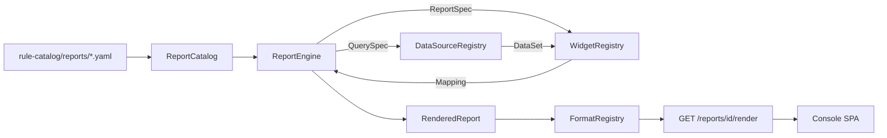

# Reporting Subsystem

Declarative, extensible visualization pipeline that lets a fork build
"any report shape" - time-series overviews, top-N tables, cost
summaries, SLO burn boards, signal-feed rollups, security postmortems,
future FE experiments - **without changing the FE contract**. Everything
lives behind three registries (datasource / widget / format) plus a
YAML catalog; adding a new report is a YAML file, adding a new data
source is one Protocol implementation, adding a new visualization shape
is one small pure function.

Read-only by contract. Every route is a `GET`; no widget executes
anything. The subsystem is the read half of the same console that never
holds the executor identity
([app-shape.instructions.md § Layer Boundaries](../../../.github/instructions/app-shape.instructions.md#layer-boundaries-security)).

Complements the survey of the industry reference in
[docs/internals/datadog-visualization-surface.md](../../internals/datadog-visualization-surface.md);
the shipping catalog here is a bounded, product-relevant subset.

## Why it exists

The console pull-surface has always shipped one-off `ReadPanel`
handlers (KPI dashboard, audit log, HIL queue,
[operator-console.md](operator-console.md)). Every new "board" that a
fork wanted (cost, drift, DR-drill history) meant a new Python handler,
a new hand-shaped JSON, and a new FE renderer. That does not scale.

The reporting subsystem turns "new report" into a declarative YAML plus,
at most, a new datasource. The FE is a generic renderer keyed on
widget `type` - so a fork that wires a new datasource and drops in a
YAML gets a live board immediately, and the FE **does not change**.

## Architecture



Four registries, one engine:

- `ReportCatalog` - `id -> ReportSpec`, loaded from YAML.
- `DataSourceRegistry` - `name -> ReportDataSource` (async, read-only,
  I/O-bound).
- `WidgetRegistry` - `type -> WidgetBuilder` (sync, CPU-only, pure).
- `FormatRegistry` - `name -> FormatEncoder` (JSON / Markdown / CSV /
  ...).

The engine walks a `ReportSpec` in declaration order, hands each
widget's `QuerySpec` to the named datasource, and passes the returned
`DataSet` through the matching builder. **Per-widget errors are
isolated**: one broken source or bogus builder renders that widget with
`error` set and empty `data`; every other widget still renders.

Code map (see [project-structure.md](../architecture/project-structure.md)):

- `src/fdai/core/reporting/` - the whole engine (framework-neutral).
- `src/fdai/core/reporting/composition.py` - `default_reporting_engine`
  factory for fork composition roots.
- `src/fdai/delivery/read_api/reporting.py` - the four `GET` routes.
- `rule-catalog/reports/` - the YAML catalog + JSON Schema.

### Console SPA implementation status

The Console SPA now exposes **History > Reports** at `/reports` and a
canonical detail route at `/reports/<report-id>`. It reads the catalog and
runtime registry, renders declared variables as bounded controls, and sends
only `GET /reports/<id>/render` requests. The shared widget renderer covers
every type used by the upstream report catalog: `query_value`, `bar_chart`,
`timeseries`, `top_list`, `table`, `list_stream`, `check_status`, and
`topology_map`, plus recursive `group` and keyboard-accessible `tabs`.

A report that uses these registered visual types appears without an FE code
change. A newly invented visualization type still needs a reviewed renderer
in the SPA. The registry route is a capability diagnostic, not executable UI
code delivery. Until that renderer ships, the SPA shows an explicit
unavailable state instead of exposing raw JSON or guessing a presentation.

## Widget catalog

35 upstream builders across seven families. Every builder emits a
Datadog-inspired `data` payload the FE renders keyed on `type`.

| Family | `type` | Payload highlights |
|--------|--------|--------------------|
| graphs | `timeseries` | `series: [{label, labels, points: [[epoch_seconds, value]]}]` |
|        | `bar_chart` | `bars: [{label, value}]` |
|        | `pie_chart` | `slices: [{label, value, percent}], total` |
|        | `query_value` | `value, unit?, precision?` |
|        | `change` | `current, previous, delta_absolute, delta_ratio` |
|        | `distribution` | `buckets: [{le, count}]` |
|        | `heatmap` | same shape as `timeseries` (FE draws bands) |
|        | `scatter_plot` | `points: [{x, y, group?}]` |
|        | `sparkline` | `series: [{label, values, min, max, last}]` |
|        | `gauge` | `value, min, max, ratio, unit?` |
|        | `progress_bar` | `current, target, ratio, unit?` |
| lists  | `table` | `columns, rows, total_rows` |
|        | `top_list` | `columns, rows, ranked_by, order, total_rows` |
|        | `list_stream` | `items, total_rows` newest-first |
|        | `event_stream` | severity-tagged `items + counts_by_severity` |
| flows  | `funnel` | `stages: [{label, value, conversion_ratio}]` |
|        | `sankey` | `nodes, links: [{source, target, value}]` |
|        | `treemap` | `tiles: [{label, value, group?}]` sorted desc |
|        | `retention` | cohort grid `{periods, rows: [{cohort, values}]}` |
| reliability | `slo_summary` | `objective, attainment, target, error_budget, ...` |
|             | `alert_status` | `active, counts_by_severity, total` |
|             | `check_status` | `checks, summary: {ok, warn, fail, unknown}` |
|             | `service_summary` | `service, red: {rps, err, p50, p99}, health` |
|             | `flame_graph` | `roots: [{name, value, children}]` |
| architecture | `hostmap` | `tiles: [{host, value, group?}]` |
|              | `topology_map` | `nodes, edges: [{source, target, value?}]` |
|              | `geomap` | `points, areas` (mixed projections) |
| cost   | `cost_summary` | `currency, total, rows: [{group, amount}]` |
|        | `budget_summary` | `budget, actual, variance, utilization` |
| annotations | `free_text` | `body` (markdown) |
|             | `note` | `body, severity (info|warning|critical|ok)` |
|             | `image` | `src, alt, caption?`; rejects non-https / non-raster |
|             | `iframe` | `src, height?, sandbox?`; https-only |
| composite | `group` | recursive children; engine-special-cased |
|           | `tabs` | recursive children; engine-special-cased |
|           | `split_graph` | `panels` fanned out from `DataSet.series` |

A fork adds a new backend type by implementing `WidgetBuilder` and calling
`WidgetRegistry.register` at composition time. `GET /reports/registry` lets
the SPA report whether that type has a local renderer. Reports built from
already-supported types need no FE change; a new visualization shape needs a
small renderer before the SPA can present it.

## Datasource catalog

Seven upstream adapters. Each wraps an existing seam so the reporting
subsystem introduces no new I/O primitive:

| Name | Wraps | Sample projections |
|------|-------|--------------------|
| `audit` | duck-typed `AuditReader` (matches `ConsoleReadModel`) | `rows`, `count_by_action_kind`, `count_by_mode`, `count_by_actor`, `count_by_correlation`, `series_hourly`, `series_daily`, `count_total` |
| `report_feed` | `core.report_feed.ReportFeed` | `rows`, `count_by_severity`, `count_by_category`, `count_by_kind`, `count_by_resource`, `latest_per_resource`, `count_total` |
| `metric` | `shared.providers.metric.MetricProvider` | `series` (with `group_by`), `scalar_sum`, `percentiles` |
| `log_query` | `shared.providers.log_query.LogQueryProvider` | `rows`, `count_by_severity`, `pattern_group`, `series_hourly`, `count_total` |
| `static` / `noop` | in-memory | fixed / empty result; test seed |
| `callable` | any sync/async `(spec, since, until, variables) -> DataSet` fn | as declared by the callable |
| `filesystem_manifest` | filesystem `Path` | `rows`, `count_total`; refuses `..` traversal |

Every datasource is **read-only, async**. `core/` never imports
`delivery/`; the `audit` adapter takes a narrow duck-typed Protocol so
the wire-up stays one-way.

A fork adds a new source (Cost Management, cluster inventory, custom
Postgres view) by implementing `ReportDataSource` and calling
`DataSourceRegistry.register`.

## Format catalog

| Name | Content-Type | Notes |
|------|--------------|-------|
| `json` | `application/json` | Canonical FE contract; UTF-8, compact |
| `markdown` | `text/markdown; charset=utf-8` | Notebook-style; HTML-escapes row cells |
| `csv` | `text/csv; charset=utf-8` | Formula-injection safe; flattens tables |
| `html` | `text/html; charset=utf-8` | Standalone `<article>` fragment |
| `text` | `text/plain; charset=utf-8` | Stdout-friendly summary |
| `ndjson` | `application/x-ndjson` | Header line + one line per widget |
| `prometheus` **(opt-in)** | `text/plain; version=0.0.4` | Scalar / timeseries widgets only; NOT registered by default |
| `pdf` **(opt-in)** | `application/pdf` | A4 evidence dossier; installed with the `pdf-report` extra and registered only when WeasyPrint imports cleanly |

A fork adds `pdf` / `xlsx` / whatever by implementing `FormatEncoder`
and calling `FormatRegistry.register`.

The upstream delivery adapter at `delivery/reporting/pdf_format.py` implements
the optional PDF format without importing WeasyPrint into `core/`. It escapes
all widget values, adds a source-envelope SHA-256, and renders cover,
at-a-glance, table-of-contents, chapter, and provenance surfaces. Install with
`uv sync --extra pdf-report`; deployments without the extra do not advertise
`pdf` in the format registry. The `incident-rca-dossier` catalog report uses
correlation-scoped audit projections for hypotheses, citations, causal hops,
response history, and chronology.

`incident-rca-dossier` uses a dedicated renderer rather than the generic
widget-per-page layout. Its FDAI-owned print language uses a solid Calm Slate
steel-blue cover, an executive brief, evidence-completeness score, and
13 chapters: incident profile and measured impact, chronology, root cause,
causal chain, contributing factors, alternatives, evidence register, response,
recovery validation, control gaps, corrective/preventive actions, limitations,
and the audit appendix. Content cards use uniform neutral hairlines, off-white
surfaces, and whitespace rather than colored top or left rails. The renderer
never fills an empty chapter with prose; it marks the evidence unavailable.

Print layout primitives are intentionally distinct from the browser mock's
layout implementation. Chronology uses a semantic table with repeated headers,
not CSS Grid or negative margins. The causal chain is native SVG (`rect`,
`line`, `polygon`, and `text`) with literal paint/font attributes so WeasyPrint
does not depend on CSS cascade support inside SVG. Pagination groups related
chapters and starts only profile, root-cause, response, and audit groups on a
new page. The customer-neutral reference fixture renders in nine pages rather
than reserving one page per chapter.

PDF regression tests render the real WeasyPrint box tree and enforce a 9-11
page range, full-width chronology table, full-width SVG diagram, and 13 intact
chapter headers. They also reject the retired grid timeline and grid causal
markup so the original narrow-card failure cannot return silently.

Optional recorded audit fields (`rca_impact`, `rca_contributing_factors`,
`rca_alternative_hypotheses`, `rca_recovery_validation`, `rca_control_gaps`,
`rca_recommendations`, and `rca_limitations`) populate the analytical chapters.
Each field is a bounded list of mappings projected by
`core/reporting/datasources/audit_rca.py`. The PDF layer only arranges these
server-owned facts and performs no analysis of its own.

## FE JSON contract

`GET /reports/{id}/render` returns:

```json
{
  "id": "shadow-mode-daily",
  "version": "1.0.0",
  "name": "Shadow-Mode Daily Rollup",
  "description": "...",
  "generated_at": "2026-07-10T12:00:00+00:00",
  "provenance": {
    "availability": "available",
    "synthetic": false,
    "sources": [
      {
        "datasource": "audit",
        "source": "audit",
        "availability": "available",
        "synthetic": false,
        "as_of": "2026-07-10T11:59:30+00:00"
      }
    ]
  },
  "time_range": {
    "since": "2026-07-09T12:00:00+00:00",
    "until": "2026-07-10T12:00:00+00:00"
  },
  "variables": {"env": "prod"},
  "widgets": [
    {
      "id": "total-shadow",
      "type": "query_value",
      "title": "Shadow-mode entries (24h)",
      "data": {"value": 1200, "unit": "entries"},
      "options": {"unit": "entries"}
    },
    {
      "id": "broken",
      "type": "table",
      "title": "Broken",
      "data": {},
      "options": {},
      "error": "datasource error: RuntimeError: boom"
    }
  ],
  "tags": ["control-loop", "shadow-mode"]
}
```

`generated_at` is the report render time, not the evidence observation time.
`provenance.sources[].as_of` carries evidence freshness when the composition
root can provide it. Datasource registrations default to `unknown`; explicit
Noop bindings report `availability=unavailable`, and local static sources
report `synthetic=true`. The console labels these states and never presents a
fresh render time as fresh evidence. Annotation-only reports use
`availability=not_applicable`.

Catalog summaries include the recursive datasource ids declared by each
report. When no report id is explicit in the URL, the console excludes reports
whose datasources are explicitly unavailable before choosing a render-ready
default. Unknown legacy descriptors remain eligible, and an explicit report id
is always preserved so unavailable evidence stays inspectable rather than
being silently replaced.

The FE only needs to know `type` and the per-type `data` schema in
[Widget catalog](#widget-catalog). New reports and new datasources do
not change this envelope.

## YAML report definition

Full schema: [`rule-catalog/reports/schema/report.schema.json`](../../../rule-catalog/reports/schema/report.schema.json).

```yaml
id: shadow-mode-daily
version: 1.0.0
name: Shadow-Mode Daily Rollup
description: |
  Yesterday's shadow-mode activity.
tags:
  - control-loop
  - shadow-mode
time_range:
  last: 1d          # alias for relative_duration; also since/until pair
variables:
  - name: env
    default: prod
    values: [prod, staging]
widgets:
  - id: total-shadow
    type: query_value
    title: Shadow-mode entries (24h)
    query:
      datasource: audit
      parameters:
        projection: count_total
    options:
      unit: entries
  - id: by-mode
    type: bar_chart
    title: Enforce vs shadow
    query:
      datasource: audit
      parameters:
        projection: count_by_mode
```

Loader ([`core.reporting.catalog.load_report_catalog`](../../../src/fdai/core/reporting/catalog.py)):

- validates every file against the JSON Schema
  (`additionalProperties: false` at every level - a typo fails at
  load time, not at first render);
- with `allowed_widget_types` / `allowed_datasources` (the composition
  helper passes them), a YAML that references an unwired name is a
  load-time error;
- rejects duplicate report ids across files;
- rejects multi-document YAML.

Three sample reports ship upstream:

- [`shadow-mode-daily.yaml`](../../../rule-catalog/reports/shadow-mode-daily.yaml) - audit KPI + top lists.
- [`signal-feed-overview.yaml`](../../../rule-catalog/reports/signal-feed-overview.yaml) - report-feed rollup with a `category` variable.
- [`metric-explorer.yaml`](../../../rule-catalog/reports/metric-explorer.yaml) - generic parameterized metric explorer.

## Read-API routes

Four GETs, mounted under a configurable prefix (default `/reports`) by
[`build_reporting_routes`](../../../src/fdai/delivery/read_api/routes/reporting.py):

| Route | Purpose |
|-------|---------|
| `GET /reports` | List every report (id, name, description, version, tags, widget count, declared variables) |
| `GET /reports/registry` | Wired datasource / widget-type / format names |
| `GET /reports/formats` | Encoder catalog with `name` + `content_type` |
| `GET /reports/widget-types` | Registered widget type names |
| `GET /reports/datasources` | Registered datasource names |
| `GET /reports/health` | Engine diagnostic snapshot (counts + config) |
| `GET /reports/{id}` | Full report definition (projection of the loaded `ReportSpec`) |
| `GET /reports/{id}/render?format=json\|markdown\|csv\|html\|text\|ndjson&<vars>` | The rendered payload |

The routes plug into the existing read-API through `ReadApiConfig.reporting`:

```python
from fdai.core.reporting.composition import default_reporting_engine
from fdai.delivery.read_api.reporting import ReportingConfig
from fdai.delivery.read_api.main import ReadApiConfig, build_app

engine, formats = default_reporting_engine(
    reports_root=Path("rule-catalog/reports"),
    audit_reader=console_read_model,
    report_feed=my_feed,
    metric_provider=container.metric_provider,
    log_query_provider=container.log_query_provider,
)
config = ReadApiConfig(
    dev_mode=False,
    reporting=ReportingConfig(engine=engine, formats=formats),
)
app = build_app(authenticator=..., read_model=console_read_model, config=config)
```

Every route:

- hits the shared reader-role gate;
- validates the format name and (via the engine) the variable overrides
  before any datasource query;
- returns 404 on unknown report, 400 on unknown format / variable, 405
  on any non-GET method (Starlette default).

## Fork extension recipes

### 1. Add a report

Drop a YAML under `rule-catalog/reports/` (or a fork-local directory
your composition root also loads). No Python change.

### 2. Add a datasource

```python
class CostManagementDataSource:
    name = "cost_management"

    async def query(self, spec, *, since, until, variables):
        ...
        return DataSet(rows=(...), columns=(...))

engine.datasource_registry().register(CostManagementDataSource(...))
```

Any report YAML with `query.datasource: cost_management` now renders.

### 3. Add a widget type

```python
class KpiTileBuilder:
    type_name = "kpi_tile"

    def build(self, *, spec, data):
        return {"value": data.scalar, "delta": spec.options.get("delta")}

engine.widget_registry().register(KpiTileBuilder())
```

Any YAML using `type: kpi_tile` now renders; `GET /reports/registry`
advertises the new type.

### 4. Add a format encoder

```python
class PdfFormatEncoder:
    name = "pdf"
    content_type = "application/pdf"

    def encode(self, report):
        return _render_pdf(report.to_dict())

formats.register(PdfFormatEncoder())
```

`GET /reports/{id}/render?format=pdf` now works.

### 5. Change the route prefix

Set `ReportingConfig(prefix="/dashboards")` at composition time. The
factory validates the prefix does not collide with a core or panel
route.

## Safety and invariants

- **Read-only**. No POST / PUT / DELETE / PATCH route exists on this
  surface; there is no widget type that mutates state
  ([app-shape.instructions.md § Anti-Patterns](../../../.github/instructions/app-shape.instructions.md#anti-patterns-avoid)).
- **Fail-closed at boundaries**. Variable overrides not declared or
  outside the allowlist are rejected before any datasource is
  touched. YAML with an unknown widget type or an unwired datasource
  is rejected at catalog-load time.
- **Per-widget error isolation**. A broken source never fails the whole
  report; the offending widget is rendered with `error` set. Mirrors
  the `ReportFeed` pattern.
- **No new I/O primitive**. Every datasource wraps an existing seam
  (`AuditReader`, `MetricProvider`, `LogQueryProvider`, `ReportFeed`) -
  the reporting subsystem does not introduce a new async boundary.
- **`core/` never imports `delivery/`**. The audit adapter takes a
  narrow duck-typed Protocol so the composition wire-up stays one-way
  (guarded by [`scripts/quality/architecture/check-core-imports.sh`](../../../scripts/quality/architecture/check-core-imports.sh)).
- **ASCII-only markdown / audit surfaces**. The markdown encoder ships
  no smart quotes / em-dash / NBSP; enforced by
  [`scripts/quality/repository/check-punctuation.sh`](../../../scripts/quality/repository/check-punctuation.sh).

### Hardening (batch-5 critique-driven pass)

Ten safeguards were added after a systematic OWASP + `app-shape`
critique of the shipped subsystem. Each is covered by a dedicated test
in [`tests/core/reporting/test_hardening.py`](../../../tests/core/reporting/test_hardening.py):

1. **CSV formula injection** - cells starting with `=` / `+` / `-` /
   `@` / TAB / CR are prefixed with `'` (OWASP CSV injection).
2. **Markdown HTML escape** - row cells escape `&` / `<` / `>` / `|`
   so a permissive markdown viewer never renders inline HTML.
3. **Image extension allowlist** - `png` / `jpg` / `jpeg` / `gif` /
   `webp` / `avif` only; `svg` is refused because it can carry
   script content.
4. **Per-widget timeout** - `ReportEngineConfig.per_widget_timeout_seconds`
   wraps each datasource call in `asyncio.wait_for`; a hang becomes an
   `error` widget instead of a request hang.
5. **`$var` / `${var}` substitution** in `QuerySpec.parameters` via
   the pure `substitute` helper. Undeclared references raise
   `VariableRejectedError` before the datasource is touched.
6. **Catalog loader size guards** - `max_file_size_bytes` /
   `max_files` / `max_widgets_per_report` cap memory exposure to a
   hostile YAML tree; violations fail at load, not at first render.
7. **Report id / format regex validation** at the read-API edge so a
   `../../etc/passwd` probe never reaches the catalog lookup.
8. **Rendered error length cap** - `ReportEngineConfig.max_error_message_chars`
   (default 512) truncates long tracebacks with a `...truncated` marker.
9. **Audit datasource tz-aware datetime comparison** - `since` /
   `until` are UTC-coerced (tz-naive input treated as UTC) so a naive
   filter cannot silently exclude legitimate rows.
10. **Rendered widget-count cap** - `ReportEngineConfig.max_widgets_per_report`
    (default 200) replaces oversize renders with a single sentinel
    widget instead of blowing up the response.

### Hardening (batch-6 widget-builder pass)

A second critique targeted the expanded widget-builder catalog: builders
transform untrusted datasource values, so a hostile or buggy value must
never crash serialization or misorder a chart. Each item is covered in
[`tests/core/reporting/test_widgets_hardening.py`](../../../tests/core/reporting/test_widgets_hardening.py):

1. **JSON non-finite safety** - `JsonFormatEncoder` recursively rewrites
   `NaN` / `+-Inf` to `null` and sets `allow_nan=False`, so a datasource
   value can never emit a body strict JSON parsers reject (RFC 8259 has
   no `NaN` / `Infinity` token).
2. **Flame-graph cycle prevention** - cyclic / self-parent rows are
   dropped so the emitted structure is always a forest; a cycle would
   otherwise raise `ValueError: Circular reference` at `json.dumps` time,
   *outside* the per-widget isolation, failing the whole report.
3. **Graph numeric coercion** - `graphs._as_number` rejects non-finite
   floats, so gauge / progress / pie / scatter / change never emit `NaN`.
4. **Cost numeric coercion** - `cost._numeric` rejects non-finite (incl.
   `"nan"` / `"inf"` strings) so a cost total is always finite.
5. **Flow numeric coercion** - `flows._numeric_or_none` rejects
   non-finite so funnel ratios / treemap sort stay well-defined.
6. **List sort-key safety** - `lists._numeric` maps non-finite to `-inf`
   so a `NaN` rank cannot scramble `top_list` ordering.
7. **Sparkline finite-safe summary** - `min` / `max` / `last` are
   computed from finite points only; a `None` / non-numeric point no
   longer raises `TypeError`.
8. **Stream timestamp ordering** - `list_stream` / `event_stream` use a
   numeric-aware sort key so epoch-integer timestamps order correctly
   (a `str()` sort put `9` after `100`).
9. **Pie magnitude percent** - slice percentages derive from the sum of
   magnitudes, so a negative or mixed-sign dataset cannot produce a
   percent `> 1` or a divide-by-signed-total artifact.
10. **`__all__` placement** - the late-defined `EventStreamBuilder` /
    `RetentionBuilder` are exported after their class definitions, not
    before, so `import *` and static analysis stay consistent.

## Related

- [operator-console.md](operator-console.md) - the pull surface these
  reports render inside.
- [project-structure.md](../architecture/project-structure.md#customization-via-dependency-injection) -
  the DI seam catalog every fork wires against.
- [docs/internals/datadog-visualization-surface.md](../../internals/datadog-visualization-surface.md) -
  the industry-reference viz catalog this subsystem draws from.
