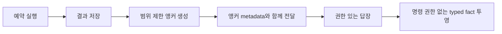

# 예약 결과 이어가기

이 문서는 하나의 예약 결과를 범위가 제한된 대화 앵커로 만드는 방법을 정의합니다.
오퍼레이터는 예약 텍스트를 명령이나 실행 권한으로 취급하지 않고 정확한 실행과 근거 창에서
대화를 이어갈 수 있습니다.

> 이어가기는 기본적으로 비활성화됩니다. 전달된 앵커 ID는 불투명 참조일 뿐 bearer credential이
> 아니며, broadcast 결과는 이어갈 수 없습니다.

## 설계 개요

대상 스케줄은 `origin_thread` 또는 `dedicated_thread`를 선택합니다. FDAI는 전달 전에 결과와
`ScheduledConversationAnchor`를 저장한 다음, 권한이 있는 오퍼레이터가 열 때 provenance label이
있는 데이터로 결과를 투영합니다.

## 계약

### 이어가기 정책

`continuation_mode`는 서버가 소유하며 세 가지 값을 사용합니다.

| 값 | 동작 |
|----|------|
| `none` | 기본값입니다. 결과에 이어가기 앵커가 없습니다. |
| `origin_thread` | 기록된 대화 또는 채널 thread로 결과를 전달합니다. |
| `dedicated_thread` | adapter가 지원하면 별도의 provider thread를 시작합니다. |

활성화된 정책에는 변경되지 않는 `ScheduledResultOrigin` metadata가 필요합니다. Origin은 channel
kind, channel reference, conversation reference, 선택적 thread reference, audience를 기록합니다.
Direct audience만 앵커를 생성할 수 있습니다.

### 앵커

`ScheduledConversationAnchor`는 다음 항목을 기록합니다.

- **ID**: 결정적 anchor id, task id, 정확한 단일 run id입니다.
- **권한**: owner principal과 스케줄이 관찰한 좁은 resource scope입니다.
- **출처**: 결과 SHA-256 digest, evidence reference, observation window입니다.
- **라우팅**: continuation mode와 변경되지 않는 origin metadata입니다.
- **수명 주기**: 생성 시각, 만료 시각, `active` 또는 `expired` 상태입니다.

반복 실행마다 서로 다른 앵커를 받습니다. 고유 run-id 제약으로 앵커 생성을 안전하게 재시도할 수
있으며, 한 실행을 다른 콘텐츠에 다시 연결하지 못합니다.

## 저장 및 전달 순서

예약 briefing coordinator는 다음 순서를 사용합니다.

1. 변경되지 않는 실행 결과와 digest를 저장합니다.
2. Compare-and-set 만료 의미 체계로 범위 제한 앵커를 생성합니다.
3. 앵커 ID를 metadata로 사용해 channel delivery를 저장하거나 전송합니다.
4. 앞 단계가 성공한 후에만 스케줄을 진행합니다.

1단계 후 프로세스가 중단되면 다음 claim은 run idempotency key를 재사용하고 같은 앵커를
생성합니다. 앵커 생성 또는 web delivery가 실패하면 스케줄은 진행되지 않습니다. Delivery retry는
저장된 응답을 재사용하며 briefing을 다시 생성하거나 예약 작업을 다시 실행하지 않습니다.

[durable outbound reply ledger](durable-conversation-delivery-ko.md)가 주입된 Slack/Teams path에서는
모호한 provider acknowledgement와 제한된 외부 재시도를 담당합니다. 이어가기 계약은 해당 ledger에
stable anchor id, run id, result digest, destination, thread mode를 제공합니다. Ledger가 없는 direct
adapter path는 usable receipt를 요구하지만 자체 retry를 추가하지 않습니다. 현재 scheduler CLI의
기본 continuation delivery binding은 web conversation store이며 external channel은 명시적 channel 및
outbound-ledger wiring이 필요합니다.

## 권한 및 개인 정보 보호

앵커 보유만으로는 액세스 권한을 얻지 못합니다. Resolution은 콘텐츠를 반환하기 전에 인증된
principal을 확인합니다.

- Task owner는 앵커를 resolve하고 expire할 수 있습니다.
- 다른 principal은 같은 좁은 scope를 명시적으로 포함한 authorization result가 필요합니다.
- Expired, guessed, cross-principal, cross-scope 요청은 같은 unavailable response를 반환합니다.
- Broadcast 및 fan-out 사본은 앵커를 생성하거나 resolve할 수 없습니다.

인증된 `/me/context` projection은 현재 principal이 소유한 앵커만 나열합니다. Open 및 expire
operation은 별도의 인증된 command route를 사용하고 audit event를 기록합니다.

## 대화 컨텍스트

앵커를 열면 정확한 run id, observation window, result digest, anchor id를 포함한 `TYPED_FACT`
entry가 생성됩니다. 예약 summary는 데이터로 유지됩니다.

- `trusted=false`는 텍스트가 trusted instruction layer가 되지 않도록 합니다.
- Metadata에 `instruction_authority=none`을 명시합니다.
- `provenance=scheduled-result`가 출처를 식별합니다.
- Evidence reference는 anchor와 delivery record에 계속 연결됩니다.

Typed fact는 후속 답변에 정보를 제공할 수 있지만 tool을 승인하거나 scope를 변경하거나 action을
승인하거나 표준 trust 및 risk path를 우회할 수 없습니다.

## 채널 동작

| 채널 | Origin thread | Dedicated thread | 성능 저하 동작 |
|------|---------------|------------------|----------------|
| Web | 기록된 대화에 idempotent assistant data turn 하나를 추가합니다. | 별도로 기록된 대화가 제공되면 사용합니다. | 대화가 없거나 권한이 없으면 전달을 차단합니다. |
| Slack | 기록된 `thread_ts`로 전송합니다. | Root message를 게시하고 acknowledgement를 provider thread reference로 사용합니다. | Adapter 또는 acknowledgement가 없으면 전달을 차단합니다. |
| Teams | `replyToId`로 전송합니다. | `replyToId` 없이 게시해 새 activity thread를 시작합니다. | Adapter 또는 acknowledgement가 없으면 전달을 차단합니다. |

Provider가 dedicated thread를 만들 수 없으면 구성된 capability policy가 허용할 때만 origin thread를
사용할 수 있습니다. Adapter는 delivery receipt에 성능 저하를 보고하며 audience를 조용히 넓히거나
broadcast continuation을 만들지 않습니다.

## 읽기 화면

Operations 화면은 읽기 전용입니다. Anchor state, exact run, scope, observation window, origin,
evidence count, result digest, expiry를 표시합니다. Open, expire, retry, execution button은 제공하지
않습니다. 인증된 operator channel과 command route가 해당 operation을 담당합니다.

## 감사 및 보존

Anchor creation, access denial, successful continuation, expiry는 기존 hash-chained audit store에
event를 추가합니다. Event는 result body를 복사하지 않고 anchor id, authenticated principal,
timestamp, stable idempotency key를 기록합니다.

Expiry는 즉시 resolution을 사용할 수 없게 하며 CAS 상태 변경은 shipped behavior입니다. Source
scheduled result, anchor, projected conversation entry를 legal-hold-aware transaction으로 함께 물리
삭제하는 retention worker는 아직 구현되지 않았습니다. 그 worker가 추가되기 전에는 expiry를
physical deletion 또는 legal-hold enforcement 완료로 표현하면 안 됩니다.

## 검증

다음 범위를 검증합니다.

- Owner, same-scope, cross-principal, cross-scope, guessed-id, expired-anchor resolution입니다.
- 서로 다른 recurring-run anchor, duplicate create collapse, broadcast denial입니다.
- Anchor creation 및 schedule advance 전에 result persistence가 완료됩니다.
- Web delivery retry collapse와 Slack/Teams thread-mode parity입니다.
- Typed-fact provenance와 instruction authority가 없다는 명시적 계약입니다.
- PostgreSQL row codec, compare-and-set expiry, migration head, 환경 조건부 live test입니다.

## 관련 문서

| 알아볼 내용 | 문서 |
|-------------|------|
| 예약 작업 및 자동화 제안 | [자동화 블루프린트](../decisioning/automation-blueprints-ko.md) |
| 양방향 채널 동작 | [채널 및 알림](channels-and-notifications-ko.md) |
| 대화 안전 및 도구 | [오퍼레이터 콘솔](operator-console-ko.md) |
| 제한된 prompt context | [프롬프트 구성](../decisioning/prompt-composition-ko.md) |
