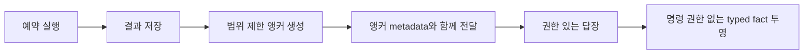

# 예약 결과 이어가기

이 문서는 하나의 예약 결과를 범위가 제한된 대화 앵커로 만드는 방법을 정의합니다.
오퍼레이터는 예약 텍스트를 명령이나 실행 권한으로 취급하지 않고 정확한 실행과 근거 창에서
대화를 이어갈 수 있습니다.

> 이어가기는 기본적으로 비활성화됩니다. 전달된 앵커 ID는 불투명 참조일 뿐 bearer 자격 증명이
> 아니며, broadcast 결과는 이어갈 수 없습니다.

## 설계 개요

대상 스케줄은 `origin_thread` 또는 `dedicated_thread`를 선택합니다. FDAI는 전달 전에 결과와
`ScheduledConversationAnchor`를 저장한 다음, 권한이 있는 오퍼레이터가 열 때 출처 이력 라벨이
있는 데이터로 결과를 투영합니다.

```mermaid
flowchart LR
  RUN[예약 실행] --> RESULT[결과 저장]
  RESULT --> ANCHOR[범위 제한 앵커 생성]
  ANCHOR --> DELIVERY[앵커 metadata와 함께 전달]
  DELIVERY --> REPLY[권한 있는 답장]
  REPLY --> FACT[명령 권한 없는 typed fact 투영]
```

## 계약

### 이어가기 정책

`continuation_mode`는 서버가 소유하며 세 가지 값을 사용합니다.

| 값 | 동작 |
|----|------|
| `none` | 기본값입니다. 결과에 이어가기 앵커가 없습니다. |
| `origin_thread` | 기록된 대화 또는 채널 스레드로 결과를 전달합니다. |
| `dedicated_thread` | 어댑터가 지원하면 별도의 프로바이더 스레드를 시작합니다. |

활성화된 정책에는 변경되지 않는 `ScheduledResultOrigin` 메타데이터가 필요합니다. 출처는 채널
kind, 채널 참조, 대화 참조, 선택적 스레드 참조, 대상을 기록합니다.
Direct 대상만 앵커를 생성할 수 있습니다.

### 제한된 구성 검토

Configuration-baseline review campaign은 기준선 버전, 다이제스트, 범위 하나를 고정하고 서로 다른 실행
id 세 개를 멱등적하게 수락합니다. 결정론적 결정이 `passed` 또는 `failed`이고 정확한 DOCX를
인용하며 변경, 승인, 완화, 지원하지 않는 점유 개수가 모두 0일 때만 검증된 실행으로
계산합니다. 차단된, 부분, uncited, mismatched, unsafe 실행이 있으면 세 번째 시도 후 campaign을
pause합니다.

검증된 실행 세 개는 campaign을 `ready-for-weekly`로 전환하고 세 실행 id가 포함된 strict-cron weekly
proposal을 inert 산출물로 생성합니다. 집약기는 작업을 생성하거나 활성화하지 않습니다. 구체화는
인증된 스케줄러 명령, event, 감사 경로를 계속 사용하므로 review 근거가 예약 변경 권한을
부여할 수 없습니다.

인증된 기여자는 필수 멱등성 키가 있는 별도 명령 경로로 fresh review 하나를 제출할 수
있습니다. Command는 campaign advance 전에 full 보고를 기록합니다. 세 번째 exact 실행이 ready 상태가
되면 FDAI는 세 실행의 fingerprint와 zero 변경 도구를 가진 비활성화된, shadow-only Automation 청사진을
제출합니다. 이 단계에서도 작업을 만들지 않습니다. 별도 Approver 또는 Owner가 후보를 수용해야
하며, 같은 검토자가 기존 인증된 `CreateScheduledTaskCommand`를 통해 materialize할 수 있습니다.
결과 strict weekly 작업은 normal 스케줄러 event 경로를 통해 그림자 모드의
`configuration.drift.check.requested`를 발행합니다. 재시도는 보고, campaign, 후보, 작업 신원에서
collapse됩니다.

Campaign 상태는 content-derived campaign id를 사용해 shared StateStore에 저장됩니다. 생성과 advance
연산은 상태 쓰기와 추가 전용 감사 항목을 원자적으로 결합합니다. 각 advance는 개정 번호를
증가시키고 범위가 제한된 재시도가 적용된 compare-and-set을 사용하므로 동시 실행이 서로를 덮어쓸 수 없습니다.
재시작 복구는 동일한 버전, 범위, 실행 증적, 상태, 개정 번호를 읽습니다. 중복 실행 id는
멱등적하게 유지됩니다.

중복 실행 id는 full 저장된 보고가 동일할 때만 멱등적합니다. 다른 결정, 발견 사항 set,
인용 set, safety counter 또는 performance 증적으로 id를 재사용하면 conflict가 발생하고 campaign을
advance할 수 없습니다. 실패한 campaign은 Approver가 별도 재개 명령을 사용할 때까지 pause 상태를
유지합니다. 재개는 완전한 실패한 실행 set을 변경할 수 없는 시도 이력으로 이동하고 compare-and-set으로
개정 번호를 증가시킨 뒤 빈 활성 시도를 시작합니다. 실패한 보고 또는 감사 기록을 삭제하지
않습니다.

### 앵커

`ScheduledConversationAnchor`는 다음 항목을 기록합니다.

- **ID**: 결정적 anchor id, 작업 id, 정확한 단일 실행 id입니다.
- **권한**: 소유자 principal과 스케줄이 관찰한 좁은 리소스 범위입니다.
- **출처**: 결과 SHA-256 다이제스트, 근거 참조, observation 구간입니다.
- **라우팅**: 이어가기 모드와 변경되지 않는 출처 메타데이터입니다.
- **수명 주기**: 생성 시각, 만료 시각, `active` 또는 `expired` 상태입니다.

반복 실행마다 서로 다른 앵커를 받습니다. 고유 run-id 제약으로 앵커 생성을 안전하게 재시도할 수
있으며, 한 실행을 다른 콘텐츠에 다시 연결하지 못합니다.

## 저장 및 전달 순서

예약 briefing 조정기는 다음 순서를 사용합니다.

1. 변경되지 않는 실행 결과와 다이제스트를 저장합니다.
2. Compare-and-set 만료 의미 체계로 범위 제한 앵커를 생성합니다.
3. 앵커 ID를 메타데이터로 사용해 채널 전달을 저장하거나 전송합니다.
4. 앞 단계가 성공한 후에만 스케줄을 진행합니다.

1단계 후 프로세스가 중단되면 다음 점유는 실행 멱등성 키를 재사용하고 같은 앵커를
생성합니다. 앵커 생성 또는 web 전달이 실패하면 스케줄은 진행되지 않습니다. 전달 재시도는
저장된 응답을 재사용하며 briefing을 다시 생성하거나 예약 작업을 다시 실행하지 않습니다.

[영속 outbound 회신 원장](durable-conversation-delivery-ko.md)가 주입된 Slack/Teams 경로에서는
모호한 프로바이더 확인 응답과 제한된 외부 재시도를 담당합니다. 이어가기 계약은 해당 원장에
고정된 anchor id, 실행 id, 결과 다이제스트, destination, 스레드 모드를 제공합니다. 원장이 없는 direct
어댑터 경로는 usable 증적을 요구하지만 자체 재시도를 추가하지 않습니다. 현재 스케줄러 CLI의
기본 이어가기 전달 연결은 web 대화 저장소이며 외부 채널은 명시적 채널 및
outbound-ledger wiring이 필요합니다.

## 권한 및 개인 정보 보호

앵커 보유만으로는 액세스 권한을 얻지 못합니다. 해석은 콘텐츠를 반환하기 전에 인증된
principal을 확인합니다.

- 작업 소유자는 앵커를 해석하고 expire할 수 있습니다.
- 다른 principal은 같은 좁은 범위를 명시적으로 포함한 권한 확인 결과가 필요합니다.
- Expired, guessed, cross-principal, cross-scope 요청은 같은 사용 불가 응답을 반환합니다.
- Broadcast 및 동시 확산 사본은 앵커를 생성하거나 해석할 수 없습니다.

인증된 `/me/context` 변환 결과는 현재 principal이 소유한 앵커만 나열합니다. Open 및 expire
연산은 별도의 인증된 명령 경로를 사용하고 감사 event를 기록합니다.

## 대화 컨텍스트

앵커를 열면 정확한 실행 id, observation 구간, 결과 다이제스트, anchor id를 포함한 `TYPED_FACT`
항목이 생성됩니다. 예약 요약은 데이터로 유지됩니다.

- `trusted=false`는 텍스트가 trusted instruction layer가 되지 않도록 합니다.
- 메타데이터에 `instruction_authority=none`을 명시합니다.
- `provenance=scheduled-result`가 출처를 식별합니다.
- 근거 참조는 anchor와 전달 기록에 계속 연결됩니다.

타입이 지정된 fact는 후속 답변에 정보를 제공할 수 있지만 도구를 승인하거나 범위를 변경하거나 액션을
승인하거나 표준 trust 및 risk 경로를 우회할 수 없습니다.

## 채널 동작

| 채널 | 출처 스레드 | Dedicated 스레드 | 성능 저하 동작 |
|------|---------------|------------------|----------------|
| Web | 기록된 대화에 멱등적 assistant data 턴 하나를 추가합니다. | 별도로 기록된 대화가 제공되면 사용합니다. | 대화가 없거나 권한이 없으면 전달을 차단합니다. |
| Slack | 기록된 `thread_ts`로 전송합니다. | 루트 message를 게시하고 확인 응답을 프로바이더 스레드 참조로 사용합니다. | 어댑터 또는 확인 응답이 없으면 전달을 차단합니다. |
| Teams | `replyToId`로 전송합니다. | `replyToId` 없이 게시해 새 활동 스레드를 시작합니다. | 어댑터 또는 확인 응답이 없으면 전달을 차단합니다. |

프로바이더가 dedicated 스레드를 만들 수 없으면 구성된 기능 정책이 허용할 때만 출처 스레드를
사용할 수 있습니다. 어댑터는 전달 증적에 성능 저하를 보고하며 대상을 조용히 넓히거나
broadcast 이어가기를 만들지 않습니다.

## 읽기 화면

Operations 화면은 읽기 전용입니다. Anchor 상태, exact 실행, 범위, observation 구간, 출처,
근거 개수, 결과 다이제스트, 만료를 표시합니다. Open, expire, 재시도, 실행 버튼은 제공하지
않습니다. 인증된 운영자 채널과 명령 경로가 해당 연산을 담당합니다.

## 감사 및 보존

Anchor creation, 접근 denial, successful 이어가기, 만료는 기존 hash-chained 감사 저장소에
event를 추가합니다. Event는 결과 본문을 복사하지 않고 anchor id, 인증된 principal,
시각, 고정된 멱등성 키를 기록합니다. 같은 수명 주기 event 재시도는 하나의 감사
기록으로 합쳐집니다. StateStore 싱크는 고정된 event 신원 점유와 감사 덧붙이기를 원자적으로
처리하므로, 재시도는 anchor 저장 후 누락된 감사를 보충하면서 완료된 감사를 중복하지 않습니다.

만료는 즉시 해석을 사용할 수 없게 하며 CAS 상태 변경은 shipped 행동입니다. 동시
만료 요청은 하나의 상태 변경으로 합쳐지고 CAS winner만 만료 감사 event를 추가합니다. CAS
loser는 두 번째 상태 변경을 주장하지 않고 이미 expired인 anchor를 확인합니다. 출처 scheduled
결과, anchor, projected 대화 항목을 legal-hold-aware 트랜잭션으로 함께 물리 삭제하는
보존 워커는 아직 구현되지 않았습니다. 그 워커가 추가되기 전에는 만료를 physical
deletion 또는 legal-hold 적용 완료로 표현하면 안 됩니다.

## 검증

다음 범위를 검증합니다.

- Owner, same-scope, cross-principal, cross-scope, guessed-id, expired-anchor 해석입니다.
- 서로 다른 recurring-run anchor, 중복 생성 collapse, broadcast denial입니다.
- Anchor creation 및 예약 advance 전에 결과 영속성이 완료됩니다.
- Web 전달 재시도 collapse와 Slack/Teams thread-mode parity입니다.
- Typed-fact 출처 이력과 instruction 권한이 없다는 명시적 계약입니다.
- PostgreSQL 행 codec, compare-and-set 만료, 동시 winner-only 감사, 멱등적 수명 주기 감사 재시도, 이행 head, 환경 조건부 실제 운영 테스트입니다.
- 구성 review evidence-run 멱등성, proposer self-review 차단, acceptance 전 작업 없음,
 strict weekly 구체화 및 중복 작업 suppression입니다.

## 관련 문서

| 알아볼 내용 | 문서 |
|-------------|------|
| 예약 작업 및 자동화 제안 | [자동화 블루프린트](../decisioning/automation-blueprints-ko.md) |
| 양방향 채널 동작 | [채널 및 알림](channels-and-notifications-ko.md) |
| 대화 안전 및 도구 | [오퍼레이터 콘솔](operator-console-ko.md) |
| 제한된 프롬프트 맥락 | [프롬프트 구성](../decisioning/prompt-composition-ko.md) |
