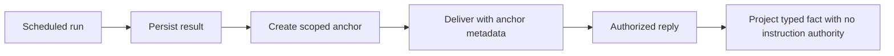

# Scheduled Result Continuations

This document defines how one scheduled result becomes a scoped conversation anchor. An operator
can continue from the exact run and evidence window without turning scheduled text into an
instruction or execution authorization.

> Continuation is disabled by default. A delivered anchor id is an opaque reference, not a bearer
> credential, and broadcast results are not continuable.

## Design at a glance

An eligible schedule selects `origin_thread` or `dedicated_thread`. FDAI persists the result and a
`ScheduledConversationAnchor` before delivery, then projects the result as provenance-labeled data
when an authorized operator opens it.

## Contracts

### Continuation policy

`continuation_mode` is server-owned and has three values:

| Value | Behavior |
|-------|----------|
| `none` | Default. The result has no continuation anchor. |
| `origin_thread` | Route the result to the recorded conversation or channel thread. |
| `dedicated_thread` | Start a separate provider thread when the adapter supports it. |

An enabled policy requires immutable `ScheduledResultOrigin` metadata. The origin records the
channel kind, channel reference, conversation reference, optional thread reference, and audience.
Only a direct audience can create an anchor.

### Bounded configuration reviews

A configuration-baseline review campaign pins one baseline version, digest, and scope. It accepts
three unique run ids idempotently. A run counts as verified only when the deterministic decision is
`passed` or `failed`, the exact DOCX is cited, and mutation, approval, mitigation, and unsupported
claim counts are all zero. A blocked, partial, uncited, mismatched, or unsafe run causes the campaign
to pause after its third attempt.

Three verified runs move the campaign to `ready-for-weekly` and produce an inert strict-cron weekly
proposal containing all three run ids. The reducer does not create or enable a task. Materialization
still uses the authenticated scheduler command, event, and audit path, so review evidence cannot
grant schedule mutation authority.

An authenticated Contributor can submit one fresh review through a separate command route with a
required idempotency key. The command records the full report before advancing the campaign. When
the third exact run becomes ready, FDAI submits a disabled, shadow-only Automation Blueprint with
zero mutation tools and fingerprints for all three runs. It still creates no task. A distinct
Approver or Owner must accept the candidate, and the same reviewer may then materialize it through
the existing authenticated `CreateScheduledTaskCommand`. The resulting strict weekly task emits
`configuration.drift.check.requested` in shadow mode through the normal scheduler event path.
Retries collapse at report, campaign, candidate, and task identities.

Campaign state is stored through the shared StateStore under a content-derived campaign id. Create
and advance operations atomically pair the state write with an append-only audit entry. Every
advance increments a revision and uses compare-and-set with bounded retry, so concurrent runs cannot
overwrite one another. Restart recovery reads the same version, scope, run receipts, state, and
revision. Duplicate run ids remain idempotent.

### Anchor

`ScheduledConversationAnchor` records:

- **Identity**: deterministic anchor id, task id, and one exact run id.
- **Authorization**: owner principal and the narrow resource scope observed by the schedule.
- **Provenance**: result SHA-256 digest, evidence references, and observation window.
- **Routing**: continuation mode and immutable origin metadata.
- **Lifecycle**: creation time, expiry, and `active` or `expired` state.

Each recurring run receives a distinct anchor. A unique run-id constraint makes anchor creation
safe to retry (idempotent) and blocks one run from being rebound to different content.

## Persistence and delivery ordering

The scheduled briefing coordinator uses this order:

1. Persist the immutable run result and its digest.
2. Create the scoped anchor with compare-and-set expiry semantics.
3. Persist or send the channel delivery using the anchor id as metadata.
4. Advance the schedule only after the preceding steps succeed.

If the process stops after step 1, the next claim reuses the run idempotency key and creates the
same anchor. If anchor creation or web delivery fails, the schedule remains unadvanced. Delivery
retry reuses the stored response and never regenerates the briefing or reruns scheduled work.

On Slack/Teams paths where the [durable outbound reply ledger](durable-conversation-delivery.md) is
injected, it owns ambiguous provider acknowledgements and bounded external retries. The
continuation contract supplies the stable anchor id, run id, result digest, destination, and thread
mode. A direct adapter path without the ledger requires a usable receipt but adds no retry. The
current scheduler CLI binds web conversation delivery by default; external channels require
explicit channel and outbound-ledger wiring.

## Authorization and privacy

Anchor possession never grants access. Resolution checks the authenticated principal before
returning content:

- The task owner can resolve and expire the anchor.
- Another principal needs an authorization result that explicitly includes the same narrow scope.
- Expired, guessed, cross-principal, and cross-scope requests return the same unavailable response.
- Broadcast and fan-out copies cannot create or resolve anchors.

The authenticated `/me/context` projection lists only anchors owned by the current principal.
Open and expire operations use separate authenticated command routes and write audit events.

## Conversation context

Opening an anchor creates a `TYPED_FACT` entry with the exact run id, observation window, result
digest, and anchor id. The scheduled summary remains data:

- `trusted=false` prevents the text from becoming a trusted instruction layer.
- `instruction_authority=none` is explicit in metadata.
- `provenance=scheduled-result` identifies the source.
- Evidence references remain attached to the anchor and delivery record.

The typed fact can inform a follow-up answer, but it cannot authorize a tool, change scope, approve
an action, or bypass the standard trust and risk path.

## Channel behavior

| Channel | Origin thread | Dedicated thread | Degradation |
|---------|---------------|------------------|-------------|
| Web | Append one idempotent assistant data turn to the recorded conversation. | Use a separate recorded conversation when one is supplied. | Missing or unauthorized conversation blocks delivery. |
| Slack | Send with the recorded `thread_ts`. | Post a root message and use its acknowledgement as the provider thread reference. | A missing adapter or acknowledgement blocks delivery. |
| Teams | Send with `replyToId`. | Post without `replyToId` to start a new activity thread. | A missing adapter or acknowledgement blocks delivery. |

When a provider cannot create a dedicated thread, the adapter can use the origin thread only when
its configured capability policy permits that degradation. It reports the degradation in the
delivery receipt; it does not silently widen the audience or create a broadcast continuation.

## Read surface

The Operations view is read-only. It shows the anchor state, exact run, scope, observation window,
origin, evidence count, result digest, and expiry. It exposes no open, expire, retry, or execution
button. Authenticated operator channels and command routes own those operations.

## Audit and retention

Anchor creation, access denial, successful continuation, and expiry append events to the existing
hash-chained audit store. Events record the anchor id, authenticated principal, timestamp, and a
stable idempotency key without copying the result body. Retrying the same lifecycle event collapses
onto one audit record. The StateStore sink claims the stable event identity and appends its audit
record atomically, so a retry can fill a missing post-anchor audit without duplicating a completed one.

Expiry immediately makes resolution unavailable, and the compare-and-set state transition is
shipped. Concurrent expiry attempts collapse onto one state transition and only its CAS winner
appends the expiry audit event; losing callers observe the already-expired anchor without claiming
a second transition. A legal-hold-aware retention worker that physically deletes the source result,
anchor, and projected conversation entry in one coordinated operation is not implemented yet.
Until it ships, expiry MUST NOT be presented as completed physical deletion or legal-hold enforcement.

## Verification

Coverage includes:

- Owner, same-scope, cross-principal, cross-scope, guessed-id, and expired-anchor resolution.
- Distinct recurring-run anchors, duplicate create collapse, and broadcast denial.
- Result persistence before anchor creation and schedule advance.
- Web delivery retry collapse and Slack/Teams thread-mode parity.
- Typed-fact provenance and explicit absence of instruction authority.
- PostgreSQL row codecs, compare-and-set expiry, concurrent winner-only audit, idempotent lifecycle audit retries, migration head, and environment-gated live tests.
- Configuration review evidence-run idempotency, proposer self-review denial, no task before
    acceptance, strict weekly materialization, and duplicate task suppression.

## Related docs

| To learn about | Read |
|----------------|------|
| Scheduled tasks and automation suggestions | [Automation blueprints](../decisioning/automation-blueprints.md) |
| Bidirectional channel behavior | [Channels and notifications](channels-and-notifications.md) |
| Conversation safety and tools | [Operator console](operator-console.md) |
| Bounded prompt context | [Prompt composition](../decisioning/prompt-composition.md) |
