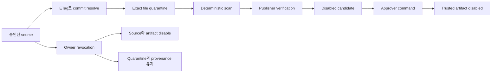

# 스킬 소스 관리

이 문서는 승인된 GitHub repository에서 runtime skill을 가져올 때 사용하는 durable source,
quarantine, refresh, approval, revocation 계약을 소유합니다. 외부 content는 deterministic scan과
publisher verification이 끝날 때까지 비활성으로 유지하며 Console SPA는 읽기 전용으로 유지합니다.

> 범위: source는 제한된 경로를 가져올 권한만 부여합니다. Tool, role, provider, runtime identity,
> execution authority는 부여하지 않습니다.

## 설계 요약

활성 `SkillSource`는 immutable Git commit 하나를 resolve하고 선언된 skill file만 가져와 exact
byte를 quarantine에 저장합니다. 통과한 artifact는 disabled update candidate가 됩니다. Approver는
기존 `TrustedArtifactInstaller`로 candidate를 설치할 수 있고 설치 결과는 disabled로 저장됩니다.
Owner는 PostgreSQL transaction 하나로 source와 installed artifact를 disable하고 quarantine row를
revoked로 표시하며 revocation record를 append할 수 있습니다. 이 lifecycle은 provenance를 삭제하지
않습니다.



## Source 계약

`SkillSource`는 immutable registration identity입니다. PostgreSQL store는 동일한 `source_id`로
registration field가 다른 두 번째 record가 들어오면 차단합니다.

| 필드 | 계약 |
|------|------|
| `source_id` | Stable lowercase identifier이며 manifest의 `source` 값입니다. |
| `kind` | `github_repository`입니다. 새 kind는 provider adapter와 검토가 필요합니다. |
| `location` | `owner/repository` 형식이며 credential이 포함된 URL은 허용하지 않습니다. |
| `allowed_path` | `SKILL.md`와 detached signature가 있는 안전한 상대 경로입니다. |
| `authentication_audience_ref` | SecretProvider key입니다. Resolve된 bearer 값은 저장하거나 log하지 않습니다. |
| `refresh_policy` | `manual` 또는 `scheduled`입니다. 활성 scheduled source만 runner에 들어갑니다. |

Source enable은 refresh를 허용하지만 installed skill을 enable하지 않습니다.

## Quarantine과 candidate

Adapter는 full commit SHA를 먼저 resolve한 뒤 `SKILL.md`, `SKILL.md.sig`, manifest가 선언한
reference만 요청합니다. Redirect, symlink, path mismatch, partial fetch, oversized content, invalid
UTF-8, authentication failure, rate limit은 candidate를 만들지 않습니다.

Quarantine은 다음을 저장합니다.

- JSONB에 인코딩된 exact file byte와 file별 SHA-256 digest
- immutable source revision과 artifact digest
- detached 64-byte publisher signature
- deterministic scanner version, finding, verdict, lifecycle state
- update인 경우 prior installed digest

Signature를 통과하면 quarantine state가 `proposed`로 바뀌고 `SkillUpdateCandidate` 하나가 생성됩니다.
Candidate는 항상 `disabled=true`를 유지하며 approval이 candidate를 enabled로 다시 쓰지 않습니다.

## PostgreSQL 소유권

Alembic revision `20260720_0045`는 다섯 table을 소유합니다.

| Table | 책임 |
|-------|------|
| `skill_source` | Registration metadata와 source enablement |
| `skill_quarantine` | Exact fetched byte, scan evidence, 유지되는 lifecycle state |
| `skill_update_candidate` | Disabled candidate identity, prior digest, creation time |
| `skill_revocation` | Append-only source와 digest revocation evidence |
| `skill_source_refresh_state` | ETag, revision, next refresh, retry time, bounded error count |

Concrete adapter는 `PostgresSkillSourceStore`, `PostgresSkillQuarantineStore`,
`PostgresSkillUpdateCandidateStore`, `PostgresSkillRevocationStore`,
`PostgresSkillSourceRefreshStateStore`입니다. Codec test가 exact round-trip을 확인하고 live-DB
integration test는 다섯 store를 실행하기 전에 Alembic head를 upgrade합니다.

## Refresh scheduling

`SkillSourceRefreshOrchestrator`는 활성 scheduled source를 나열하고 due refresh를 PostgreSQL에서
atomic하게 claim합니다. Claim은 `next_refresh_at`을 5분 hold로 전진시켜 두 replica가 같은 source를
동시에 가져오지 못하게 합니다.

- **변경 없음**: GitHub `304`는 ETag와 revision을 유지하고 error state를 reset하며 configured
  interval 뒤로 schedule합니다.
- **Update 있음**: Exact byte가 quarantine에 들어가고 verified candidate가 저장된 뒤에만 refresh
  state가 success를 기록합니다.
- **Rate limit**: `X-RateLimit-Reset`을 우선 사용합니다. 값이 없거나 이미 지난 경우 5분부터 시작해
  6시간을 상한으로 하는 bounded exponential backoff를 사용합니다.
- **기타 failure**: Exception type을 bounded error kind로 기록합니다. Token과 response body는
  포함하지 않습니다.

Production은 read API lifespan에서 runner를 시작합니다. `FDAI_SKILL_SOURCE_TICK_SECONDS`는 wake
interval을 제어하며 최소 30초여야 합니다. `FDAI_GITHUB_API_BASE`는 기본 GitHub API base를 다른
HTTPS GitHub endpoint로 바꿀 때 사용합니다.

## HTTP surface

Route group은 `ReadApiConfig.skill_sources`로 opt-in하며 server가 resolve한 authenticated principal을
사용합니다.

| Method와 route | 최소 authority | 목적 |
|----------------|----------------|------|
| `GET /api/v1/skill-sources/browse` | Reader | 활성 source를 나열합니다. |
| `GET /api/v1/skill-sources/search?q=` | Reader | 활성 source metadata를 검색합니다. |
| `GET /api/v1/skill-sources/{source_id}/inspect` | Reader | Refresh, quarantine, revocation evidence를 확인합니다. |
| `GET /api/v1/skill-sources/{source_id}/check-update` | Reader | ETag state와 newest disabled candidate를 읽습니다. |
| `GET /api/v1/skill-sources/{source_id}/candidates` | Reader | Disabled candidate를 나열합니다. |
| `POST /api/v1/skill-sources/{source_id}/approve-candidate` | Approver | Candidate를 재검증하고 disabled로 설치합니다. |
| `POST /api/v1/skill-sources/{source_id}/revoke` | Owner | Source와 그 source의 installed artifact를 모두 disable합니다. |

현재 Console SPA Skills route는 `/skills`를 읽으며 이 source-management endpoint를 아직 호출하지
않습니다. 향후 source-management view는 GET projection으로 제한하고 approval 또는 revocation
control을 제공하면 안 됩니다. POST route는 별도 authenticated administration surface이며 cloud
executor identity를 보유하지 않습니다.

## Approval과 revocation

Approval은 설치 전에 다음을 모두 다시 확인합니다.

- Source가 존재하고 계속 enabled 상태인지 확인합니다.
- Candidate가 해당 source 소속이며 여전히 `proposed` quarantine artifact와 일치하는지 확인합니다.
- Artifact digest가 revoked 상태가 아닌지 확인합니다.
- Exact stored byte에 대한 publisher trust가 계속 verify되는지 확인합니다.

그 다음 `TrustedArtifactInstaller`가 skill을 `TrustedArtifactState.DISABLED`로 저장합니다. Runtime
snapshot은 즉시 reload되므로 approval은 metadata를 바꾸지만 prompt eligibility를 부여하지 않습니다.

Revocation은 transaction 하나입니다. `PostgresSkillSourceRevoker`는 source를 disable하고 일치하는
quarantine row를 `revoked`로 변경하며 해당 source의 durable skill을 모두 disable하고 artifact
revision을 증가시킨 뒤 known digest마다 revocation row를 append합니다. `DELETE`는 실행하지 않습니다.
Commit 후 runtime snapshot을 reload하므로 이후 skill load는 revoked artifact를 사용할 수 없지만 audit과
quarantine evidence는 계속 inspect할 수 있습니다.

## 검증

이 subsystem을 변경할 때 다음 focused check를 사용합니다.

```bash
uv run pytest -q tests/core/supply_chain/test_skill_source_*.py
uv run pytest -q tests/persistence/test_postgres_skill_source*.py tests/persistence/test_postgres_skill_quarantine.py
uv run pytest -q tests/delivery/github/test_skill_source.py tests/delivery/read_api/test_skill_sources.py
uv run ruff check src/fdai/core/supply_chain/skill_source_*.py src/fdai/delivery/persistence/postgres_skill_*.py
uv run mypy src/fdai/core/supply_chain/skill_source_*.py src/fdai/delivery/persistence/postgres_skill_*.py
```

Live integration test는 `FDAI_DATABASE_URL`이 configured된 경우 실행하고 그렇지 않으면 명시적으로
skip을 보고합니다.

## 관련 문서

| 알아볼 내용 | 읽을 문서 |
|-------------|-----------|
| Runtime skill prompt eligibility | [../decisioning/prompt-composition-ko.md](../decisioning/prompt-composition-ko.md) |
| Console identity boundary | [operator-console-ko.md](operator-console-ko.md) |
| Durable trusted artifact | [../architecture/project-structure-ko.md](../architecture/project-structure-ko.md) |
| Source, test, owner map | [../architecture/code-map-ko.md](../architecture/code-map-ko.md) |
