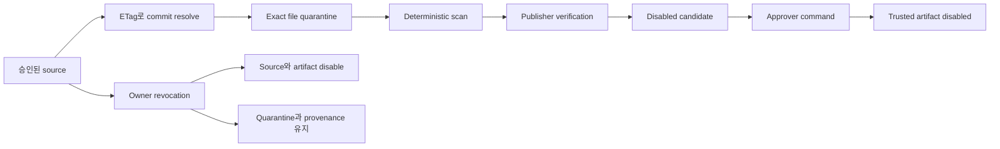

# 스킬 소스 관리

이 문서는 승인된 GitHub repository에서 런타임 skill을 가져올 때 사용하는 영속 출처,
격리 구역, refresh, 승인, 철회 계약을 소유합니다. 외부 content는 결정론적 검사와
발행기 검증이 끝날 때까지 비활성으로 유지하며 Console SPA는 읽기 전용으로 유지합니다.

> 범위: 출처는 제한된 경로를 가져올 권한만 부여합니다. 도구, 역할, 프로바이더, 런타임 신원,
> 실행 authority는 부여하지 않습니다.

## 설계 요약

활성 `SkillSource`는 변경할 수 없는 Git 커밋 하나를 해석하고 선언된 skill file만 가져와 exact
바이트를 격리 구역에 저장합니다. 통과한 산출물은 비활성화된 갱신 후보가 됩니다. Approver는
기존 `TrustedArtifactInstaller`로 후보를 설치할 수 있고 설치 결과는 비활성화된으로 저장됩니다.
Owner는 PostgreSQL 트랜잭션 하나로 출처와 installed 산출물을 비활성화하고 격리 구역 행을
철회된으로 표시하며 철회 기록을 덧붙이기할 수 있습니다. 이 수명 주기는 출처 이력을 삭제하지
않습니다.


```mermaid
flowchart LR
  SRC[승인된 source] --> FETCH[ETag로 commit resolve]
  FETCH --> QUAR[Exact file quarantine]
  QUAR --> SCAN[Deterministic scan]
  SCAN --> VERIFY[Publisher verification]
  VERIFY --> CAND[Disabled candidate]
  CAND --> APPROVE[Approver command]
  APPROVE --> INST[Trusted artifact disabled]
  SRC --> REVOKE[Owner revocation]
  REVOKE --> DISABLE[Source와 artifact disable]
  REVOKE --> KEEP[Quarantine과 provenance 유지]
```

## 출처 계약

`SkillSource`는 변경할 수 없는 registration 신원입니다. PostgreSQL 저장소는 동일한 `source_id`로
registration 필드가 다른 두 번째 기록이 들어오면 차단합니다.

| 필드 | 계약 |
|------|------|
| `source_id` | 고정된 lowercase identifier이며 매니페스트의 `source` 값입니다. |
| `kind` | `github_repository`입니다. 새 kind는 프로바이더 어댑터와 검토가 필요합니다. |
| `location` | `owner/repository` 형식이며 자격 증명이 포함된 URL은 허용하지 않습니다. |
| `allowed_path` | `SKILL.md`와 detached 서명이 있는 안전한 상대 경로입니다. |
| `authentication_audience_ref` | SecretProvider 키입니다. 해석된 bearer 값은 저장하거나 로그하지 않습니다. |
| `refresh_policy` | `manual` 또는 `scheduled`입니다. 활성 scheduled 출처만 실행기에 들어갑니다. |

출처 활성화는 refresh를 허용하지만 installed skill을 활성화하지 않습니다.

## 격리 구역과 후보

어댑터는 full 커밋 SHA를 먼저 해석한 뒤 `SKILL.md`, `SKILL.md.sig`, 매니페스트가 선언한
참조만 요청합니다. Redirect, symlink, 경로 mismatch, 부분 fetch, oversized content, 잘못된
UTF-8, authentication 실패, 비율 한도는 후보를 만들지 않습니다.

격리 구역은 다음을 저장합니다.

- JSONB에 인코딩된 exact file 바이트와 file별 SHA-256 다이제스트
- 변경할 수 없는 출처 개정 번호와 산출물 다이제스트
- detached 64-byte 발행기 서명
- 결정론적 scanner 버전, 발견 사항, 판정, 수명 주기 상태
- 갱신인 경우 이전 installed 다이제스트

서명을 통과하면 격리 구역 상태가 `proposed`로 바뀌고 `SkillUpdateCandidate` 하나가 생성됩니다.
후보는 항상 `disabled=true`를 유지하며 승인이 후보를 활성화된으로 다시 쓰지 않습니다.

## PostgreSQL 소유권

Alembic 개정 번호 `20260720_0045`는 다섯 표를 소유합니다.

| 표 | 책임 |
|-------|------|
| `skill_source` | Registration 메타데이터와 출처 활성화 |
| `skill_quarantine` | Exact fetched 바이트, 검사 근거, 유지되는 수명 주기 상태 |
| `skill_update_candidate` | 비활성화된 후보 신원, 이전 다이제스트, creation 시간 |
| `skill_revocation` | 추가 전용 출처와 다이제스트 철회 근거 |
| `skill_source_refresh_state` | ETag, 개정 번호, next refresh, 재시도 시간, 범위가 제한된 오류 개수 |

구체적인 어댑터는 `PostgresSkillSourceStore`, `PostgresSkillQuarantineStore`,
`PostgresSkillUpdateCandidateStore`, `PostgresSkillRevocationStore`,
`PostgresSkillSourceRefreshStateStore`입니다. Codec 테스트가 exact round-trip을 확인하고 live-DB
integration 테스트는 다섯 저장소를 실행하기 전에 Alembic head를 업그레이드합니다.

## Refresh 예약

`SkillSourceRefreshOrchestrator`는 활성 scheduled 출처를 나열하고 due refresh를 PostgreSQL에서
atomic하게 점유합니다. 점유는 `next_refresh_at`을 5분 보류로 전진시켜 두 복제본이 같은 출처를
동시에 가져오지 못하게 합니다.

- **변경 없음**: GitHub `304`는 ETag와 개정 번호를 유지하고 오류 상태를 reset하며 구성된
 간격 뒤로 예약합니다.
- **갱신 있음**: Exact 바이트가 격리 구역에 들어가고 검증된 후보가 저장된 뒤에만 refresh
 상태가 success를 기록합니다.
- **비율 한도**: `X-RateLimit-Reset`을 우선 사용합니다. 값이 없거나 이미 지난 경우 5분부터 시작해
 6시간을 상한으로 하는 범위가 제한된 exponential 재시도 대기를 사용합니다.
- **기타 실패**: Exception 타입을 범위가 제한된 오류 kind로 기록합니다. 토큰과 응답 본문은
 포함하지 않습니다.

오케스트레이터와 영속 점유 동작은 구현되어 있고 집중 테스트 근거가 있습니다. 현재 런타임
bootstrap은 오케스트레이터, 주기 실행기, 구체 GitHub 어댑터를 생성하지 않습니다. 따라서 실행기
소유권, 실행 간격 구성, GitHub 엔드포인트 구성은 배포된 동작이 아니라 운영 조립 작업으로 남아
있습니다.

## HTTP 표면

Operator Service workflow family가 이 경로를 등록하고 서버가 해석한 인증된 principal을
사용합니다.

| 메서드와 경로 | 최소 authority | 목적 |
|----------------|----------------|------|
| `GET /api/v1/skill-sources/browse` | Reader | 활성 출처를 나열합니다. |
| `GET /api/v1/skill-sources/search?q=` | Reader | 활성 출처 메타데이터를 검색합니다. |
| `GET /api/v1/skill-sources/{source_id}/inspect` | Reader | Refresh, 격리 구역, 철회 근거를 확인합니다. |
| `GET /api/v1/skill-sources/{source_id}/check-update` | Reader | ETag 상태와 newest 비활성화된 후보를 읽습니다. |
| `GET /api/v1/skill-sources/{source_id}/candidates` | Reader | 비활성화된 후보를 나열합니다. |
| `POST /api/v1/skill-sources/{source_id}/approve-candidate` | Approver | 멱등적인 후보 승인 proposal을 제출합니다. |
| `POST /api/v1/skill-sources/{source_id}/revoke` | Owner | 멱등적인 출처 철회 proposal을 제출합니다. |

현재 Console SPA Skills 경로는 `/skills`를 읽으며 이 source-management 엔드포인트를 아직 호출하지
않습니다. 향후 source-management 화면은 GET 변환 결과로 제한하고 승인 또는 철회
control을 제공하면 안 됩니다. GET 작업은 workflow read gateway를 사용합니다. POST 작업은
수락된 proposal을 반환하며 core administration service를 직접 호출하지 않습니다. Operator
Service는 cloud 실행기 신원을 보유하지 않습니다.

## 승인과 철회

Core `SkillSourceAdministrationService`는 설치 전에 다음을 모두 다시 확인합니다.

- 출처가 존재하고 계속 활성화된 상태인지 확인합니다.
- 후보가 해당 출처 소속이며 여전히 `proposed` 격리 구역 산출물과 일치하는지 확인합니다.
- 산출물 다이제스트가 철회된 상태가 아닌지 확인합니다.
- Exact stored 바이트에 대한 발행기 trust가 계속 verify되는지 확인합니다.

그 다음 `TrustedArtifactInstaller`가 skill을 `TrustedArtifactState.DISABLED`로 저장합니다. 런타임
스냅샷은 즉시 reload되므로 승인은 메타데이터를 바꾸지만 프롬프트 충족 여부를 부여하지 않습니다.

철회는 트랜잭션 하나입니다. `PostgresSkillSourceRevoker`는 출처를 비활성화하고 일치하는
격리 구역 행을 `revoked`로 변경하며 해당 출처의 영속 skill을 모두 비활성화하고 산출물
개정 번호를 증가시킨 뒤 known 다이제스트마다 철회 행을 덧붙이기합니다. `DELETE`는 실행하지 않습니다.
커밋 후 런타임 스냅샷을 reload하므로 이후 skill load는 철회된 산출물을 사용할 수 없지만 감사와
격리 구역 근거는 계속 inspect할 수 있습니다.

도메인 승인과 철회 구현은 현재 Operator Service proposal 작업이나 운영 런타임 조립에 연결되어
있지 않습니다.

## 구현 상태

현재 트리에는 결정론적 수명 주기와 영속 어댑터가 있지만 외부 출처 기능의 전체 경로는 아직
조립되지 않았습니다.

### 구현 범위

| 영역 | 상태 | 근거 | 참고 |
|------|------|------|------|
| 출처, 격리, 검사, 검증, 후보, 승인, 철회 도메인 수명 주기 | implemented | [`source_registry.py`](../../../services/core-control-plane/src/fdai/core/skills/source_registry.py), [`skill_source_pipeline.py`](../../../services/core-control-plane/src/fdai/core/supply_chain/skill_source_pipeline.py), [`skill_source_admin.py`](../../../services/core-control-plane/src/fdai/core/supply_chain/skill_source_admin.py), 집중 supply-chain 테스트 | 현재 집중 테스트는 등록, 갱신, 차단, 후보 생성, 승인 보호 조건, 철회 위임을 검사합니다. |
| PostgreSQL 스키마, 저장소, 영속 점유, 트랜잭션 철회 | implemented | [Alembic 개정 번호 `20260720_0045`](../../../alembic/versions/20260720_0045_skill_source_quarantine.py), [`postgres_skill_source.py`](../../../services/core-control-plane/src/fdai/delivery/persistence/postgres_skill_source.py), [`postgres_skill_quarantine.py`](../../../services/core-control-plane/src/fdai/delivery/persistence/postgres_skill_quarantine.py), codec 테스트 | 오프라인 저장소 테스트는 통과합니다. 실제 PostgreSQL 재시작 및 출처 이력 테스트는 존재하지만 `FDAI_DATABASE_URL`이 필요합니다. |
| Operator HTTP read 및 proposal 계약 | implemented | [`manifest.py`](../../../services/operator-service/src/fdai_operator_service/families/workflow/manifest.py), [`routes.py`](../../../services/operator-service/src/fdai_operator_service/families/workflow/routes.py), [`test_operator_workflow_family.py`](../../../services/operator-service/tests/test_operator_workflow_family.py) | Reader GET 경로와 Approver/Owner proposal 경로가 등록되어 있고 역할 테스트가 있습니다. 의도적으로 core 권한 구현을 가져오거나 호출하지 않습니다. |
| 구체 GitHub fetch 어댑터 | implemented | [`skill_source.py`](../../../services/core-control-plane/src/fdai/delivery/github/skill_source.py); [`test_skill_source.py`](../../../services/core-control-plane/tests/delivery/github/test_skill_source.py); focused 어댑터 테스트(`28 passed`) | 어댑터는 엄격한 ETag 지원과 함께 전체 불변 commit SHA를 해석하고 redirect, substitution, symlink, malformed content, 인증 실패, rate limit을 거부하면서 정확하고 범위가 제한된 regular file을 가져옵니다. Provider 및 credential 실패는 정제된 상태를 유지합니다. Runtime 조립은 별도 작업으로 남아 있습니다. |
| 운영 조립과 scheduled 실행기 | not-started | 현재 runtime/bootstrap 사용처 점검 | `SkillSourceRefreshService`, `SkillSourceRefreshOrchestrator`, `SkillSourceAdministrationService` 또는 해당 PostgreSQL 어댑터를 생성하는 bootstrap 경로가 없습니다. |
| Console 출처 관리 projection과 관리되는 런타임 근거 | not-started | 현재 Console 사용처 점검과 집중 테스트 실행 | Console은 출처 관리 경로를 호출하지 않으며 fetch-to-proposal 또는 승인/철회 실행을 입증하는 현재 런타임 증적이 없습니다. |

### 구현 이력

| 날짜 | 상태 | 변경 | 근거 | 남은 작업 |
|------|------|------|------|-----------|
| 2026-08-13 | in-progress | 구현 원장을 도입하고 오래된 운영 연결 및 HTTP 실행 설명을 바로잡았으며 집중 테스트 명령을 수정했습니다. 이전 구현 출처 이력은 재구성하지 않았습니다. | `current change`; 정확한 경로를 지정한 skill-source 및 Operator workflow suite의 `37 passed, 1 skipped`; 로드맵, 번역, 문장 부호, 한글, 문서 크기, 링크 검사. | 누락된 어댑터와 런타임 경로를 구현 및 연결하고, 실제 영속성을 검증하며, 읽기 전용 projection과 관리되는 런타임 근거를 기록합니다. |
| 2026-08-14 | implemented | 불변 개정 번호, conditional request, exact-path, content bound, authentication, redirect, rate-limit 강제를 갖춘 구체 GitHub skill-source 어댑터를 추가했습니다. | `current change`; `services/core-control-plane/src/fdai/delivery/github/skill_source.py`; `services/core-control-plane/tests/delivery/github/test_skill_source.py`; focused 어댑터 테스트 `21 passed`. | 독립 실행 가능한 소유 서비스를 조립하고 권한을 보유한 event 경로를 연결하며 실제 영속성을 검증하고 읽기 전용 projection을 노출합니다. |
| 2026-08-14 | implemented | 범위가 제한된 quoted entity tag만 수락하도록 conditional request를 강화하고 credential-provider exception context를 억제해 chained error로 secret이 유출되지 않게 했습니다. | `current change`; `services/core-control-plane/src/fdai/delivery/github/skill_source.py`; `services/core-control-plane/tests/delivery/github/test_skill_source.py`; focused 어댑터 테스트 `28 passed`. | Runtime 조립, 권한을 보유한 event 통합, live 영속성 및 읽기 전용 projection은 남아 있습니다. |

### 남은 작업

- [x] 변경 불가능한 개정 번호, 제한된 경로, redirect, symlink, 콘텐츠 크기, UTF-8,
  authentication, rate-limit 규칙을 강제하는 구체 GitHub `SkillSourceAdapter`를 구현하고 각
  거부 경로의 집중 어댑터 테스트를 통과시킵니다.
- [ ] 독립 실행되는 소유 서비스에서 출처 저장소, 격리 저장소, verifier factory, refresh
  service, administration service, scheduled orchestrator를 조립하고 집중 통합 테스트로 중복
  실행기 차단과 재시작 복구를 입증합니다.
- [ ] Core 구현을 Operator Service로 가져오지 않고 workflow read 및 proposal 작업을 권한을
  보유한 event 경로에 연결하며, 승인과 철회가 역할 제한, 멱등성, 기본 비활성화, replay 가능
  조건을 유지함을 입증합니다.
- [ ] `FDAI_DATABASE_URL`로 실제 PostgreSQL 재시작/철회 테스트를 실행하고 읽기 전용 Console
  projection을 추가한 뒤 refresh, 승인, 철회의 관리되는 런타임 증적을 기록합니다.

## 검증

이 subsystem을 변경할 때 다음 focused 검사를 사용합니다.

```bash
uv run pytest -q services/core-control-plane/tests/core/skills/test_source_registry.py
uv run pytest -q services/core-control-plane/tests/core/supply_chain/test_skill_source_admin.py services/core-control-plane/tests/core/supply_chain/test_skill_source_pipeline.py services/core-control-plane/tests/core/supply_chain/test_skill_source_refresh.py
uv run pytest -q services/core-control-plane/tests/persistence/test_postgres_skill_source.py services/core-control-plane/tests/persistence/test_postgres_skill_source_integration.py services/core-control-plane/tests/persistence/test_postgres_skill_quarantine.py
uv run pytest -q services/operator-service/tests/test_operator_workflow_family.py
uv run ruff check services/core-control-plane/src/fdai/core/supply_chain/skill_source_*.py services/core-control-plane/src/fdai/delivery/persistence/postgres_skill_*.py
uv run mypy services/core-control-plane/src/fdai/core/supply_chain/skill_source_*.py services/core-control-plane/src/fdai/delivery/persistence/postgres_skill_*.py
```

Live integration 테스트는 `FDAI_DATABASE_URL`이 구성된된 경우 실행하고 그렇지 않으면 명시적으로
건너뜀을 보고합니다.

## 관련 문서

| 알아볼 내용 | 읽을 문서 |
|-------------|-----------|
| 런타임 skill 프롬프트 충족 여부 | [../decisioning/prompt-composition-ko.md](../decisioning/prompt-composition-ko.md) |
| Console 신원 경계 | [operator-console-ko.md](operator-console-ko.md) |
| 영속 trusted 산출물 | [../architecture/project-structure-ko.md](../architecture/project-structure-ko.md) |
| 출처, 테스트, 소유자 map | [../architecture/code-map-ko.md](../architecture/code-map-ko.md) |
