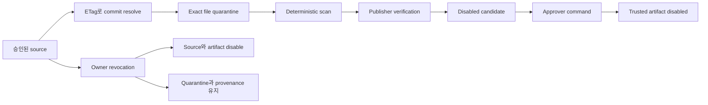

# 스킬 소스 관리

이 문서는 승인된 GitHub repository에서 런타임 skill을 가져올 때 사용하는 영속 출처,
격리 구역, refresh, 승인, 철회 계약을 소유합니다. 외부 content는 결정론적 검사와
발행기 검증이 끝날 때까지 비활성으로 유지하며 Console SPA는 읽기 전용으로 유지합니다.

> 범위: 출처는 제한된 경로를 가져올 권한만 부여합니다. 도구, 역할, 프로바이더, 런타임 신원,
> 실행 authority는 부여하지 않습니다.

## 설계 요약

활성 `SkillSource`는 변경할 수 없는 Git 커밋 하나를 해석하고 선언된 skill file만 가져와 exact
바이트를 격리 구역에 저장합니다. 통과한 산출물은 비활성화된 갱신 후보가 됩니다. Approver는
기존 `TrustedArtifactInstaller`로 후보를 설치할 수 있고 설치 결과는 비활성화된으로 저장됩니다.
Owner는 PostgreSQL 트랜잭션 하나로 출처와 installed 산출물을 비활성화하고 격리 구역 행을
철회된으로 표시하며 철회 기록을 덧붙이기할 수 있습니다. 이 수명 주기는 출처 이력을 삭제하지
않습니다.


```mermaid
flowchart LR
  SRC[승인된 source] --> FETCH[ETag로 commit resolve]
  FETCH --> QUAR[Exact file quarantine]
  QUAR --> SCAN[Deterministic scan]
  SCAN --> VERIFY[Publisher verification]
  VERIFY --> CAND[Disabled candidate]
  CAND --> APPROVE[Approver command]
  APPROVE --> INST[Trusted artifact disabled]
  SRC --> REVOKE[Owner revocation]
  REVOKE --> DISABLE[Source와 artifact disable]
  REVOKE --> KEEP[Quarantine과 provenance 유지]
```

## 출처 계약

`SkillSource`는 변경할 수 없는 registration 신원입니다. PostgreSQL 저장소는 동일한 `source_id`로
registration 필드가 다른 두 번째 기록이 들어오면 차단합니다.

| 필드 | 계약 |
|------|------|
| `source_id` | 고정된 lowercase identifier이며 매니페스트의 `source` 값입니다. |
| `kind` | `github_repository`입니다. 새 kind는 프로바이더 어댑터와 검토가 필요합니다. |
| `location` | `owner/repository` 형식이며 자격 증명이 포함된 URL은 허용하지 않습니다. |
| `allowed_path` | `SKILL.md`와 detached 서명이 있는 안전한 상대 경로입니다. |
| `authentication_audience_ref` | SecretProvider 키입니다. 해석된 bearer 값은 저장하거나 로그하지 않습니다. |
| `refresh_policy` | `manual` 또는 `scheduled`입니다. 활성 scheduled 출처만 실행기에 들어갑니다. |

출처 활성화는 refresh를 허용하지만 installed skill을 활성화하지 않습니다.

## 격리 구역과 후보

어댑터는 full 커밋 SHA를 먼저 해석한 뒤 `SKILL.md`, `SKILL.md.sig`, 매니페스트가 선언한
참조만 요청합니다. Redirect, symlink, 경로 mismatch, 부분 fetch, oversized content, 잘못된
UTF-8, authentication 실패, 비율 한도는 후보를 만들지 않습니다.

격리 구역은 다음을 저장합니다.

- JSONB에 인코딩된 exact file 바이트와 file별 SHA-256 다이제스트
- 변경할 수 없는 출처 개정 번호와 산출물 다이제스트
- detached 64-byte 발행기 서명
- 결정론적 scanner 버전, 발견 사항, 판정, 수명 주기 상태
- 갱신인 경우 이전 installed 다이제스트

서명을 통과하면 격리 구역 상태가 `proposed`로 바뀌고 `SkillUpdateCandidate` 하나가 생성됩니다.
후보는 항상 `disabled=true`를 유지하며 승인이 후보를 활성화된으로 다시 쓰지 않습니다.

## PostgreSQL 소유권

Alembic 개정 번호 `20260720_0045`는 다섯 표를 소유합니다.

| 표 | 책임 |
|-------|------|
| `skill_source` | Registration 메타데이터와 출처 활성화 |
| `skill_quarantine` | Exact fetched 바이트, 검사 근거, 유지되는 수명 주기 상태 |
| `skill_update_candidate` | 비활성화된 후보 신원, 이전 다이제스트, creation 시간 |
| `skill_revocation` | 추가 전용 출처와 다이제스트 철회 근거 |
| `skill_source_refresh_state` | ETag, 개정 번호, next refresh, 재시도 시간, 범위가 제한된 오류 개수 |

구체적인 어댑터는 `PostgresSkillSourceStore`, `PostgresSkillQuarantineStore`,
`PostgresSkillUpdateCandidateStore`, `PostgresSkillRevocationStore`,
`PostgresSkillSourceRefreshStateStore`입니다. Codec 테스트가 exact round-trip을 확인하고 live-DB
integration 테스트는 다섯 저장소를 실행하기 전에 Alembic head를 업그레이드합니다.

## Refresh 예약

`SkillSourceRefreshOrchestrator`는 활성 scheduled 출처를 나열하고 due refresh를 PostgreSQL에서
atomic하게 점유합니다. 점유는 `next_refresh_at`을 5분 보류로 전진시켜 두 복제본이 같은 출처를
동시에 가져오지 못하게 합니다.

- **변경 없음**: GitHub `304`는 ETag와 개정 번호를 유지하고 오류 상태를 reset하며 구성된
 간격 뒤로 예약합니다.
- **갱신 있음**: Exact 바이트가 격리 구역에 들어가고 검증된 후보가 저장된 뒤에만 refresh
 상태가 success를 기록합니다.
- **비율 한도**: `X-RateLimit-Reset`을 우선 사용합니다. 값이 없거나 이미 지난 경우 5분부터 시작해
 6시간을 상한으로 하는 범위가 제한된 exponential 재시도 대기를 사용합니다.
- **기타 실패**: Exception 타입을 범위가 제한된 오류 kind로 기록합니다. 토큰과 응답 본문은
 포함하지 않습니다.

운영은 Operator API lifespan에서 실행기를 시작합니다. `FDAI_SKILL_SOURCE_TICK_SECONDS`는 wake
간격을 제어하며 최소 30초여야 합니다. `FDAI_GITHUB_API_BASE`는 기본 GitHub API base를 다른
HTTPS GitHub 엔드포인트로 바꿀 때 사용합니다.

## HTTP 표면

경로 그룹은 `OperatorApiConfig.skill_sources`로 명시적 선택하며 서버가 해석한 인증된 principal을
사용합니다.

| 메서드와 경로 | 최소 authority | 목적 |
|----------------|----------------|------|
| `GET /api/v1/skill-sources/browse` | Reader | 활성 출처를 나열합니다. |
| `GET /api/v1/skill-sources/search?q=` | Reader | 활성 출처 메타데이터를 검색합니다. |
| `GET /api/v1/skill-sources/{source_id}/inspect` | Reader | Refresh, 격리 구역, 철회 근거를 확인합니다. |
| `GET /api/v1/skill-sources/{source_id}/check-update` | Reader | ETag 상태와 newest 비활성화된 후보를 읽습니다. |
| `GET /api/v1/skill-sources/{source_id}/candidates` | Reader | 비활성화된 후보를 나열합니다. |
| `POST /api/v1/skill-sources/{source_id}/approve-candidate` | Approver | 후보를 재검증하고 비활성화된으로 설치합니다. |
| `POST /api/v1/skill-sources/{source_id}/revoke` | Owner | 출처와 그 출처의 installed 산출물을 모두 비활성화합니다. |

현재 Console SPA Skills 경로는 `/skills`를 읽으며 이 source-management 엔드포인트를 아직 호출하지
않습니다. 향후 source-management 화면은 GET 변환 결과로 제한하고 승인 또는 철회
control을 제공하면 안 됩니다. 게시 경로는 별도 인증된 administration 표면이며 cloud
실행기 신원을 보유하지 않습니다.

## 승인과 철회

승인은 설치 전에 다음을 모두 다시 확인합니다.

- 출처가 존재하고 계속 활성화된 상태인지 확인합니다.
- 후보가 해당 출처 소속이며 여전히 `proposed` 격리 구역 산출물과 일치하는지 확인합니다.
- 산출물 다이제스트가 철회된 상태가 아닌지 확인합니다.
- Exact stored 바이트에 대한 발행기 trust가 계속 verify되는지 확인합니다.

그 다음 `TrustedArtifactInstaller`가 skill을 `TrustedArtifactState.DISABLED`로 저장합니다. 런타임
스냅샷은 즉시 reload되므로 승인은 메타데이터를 바꾸지만 프롬프트 충족 여부를 부여하지 않습니다.

철회는 트랜잭션 하나입니다. `PostgresSkillSourceRevoker`는 출처를 비활성화하고 일치하는
격리 구역 행을 `revoked`로 변경하며 해당 출처의 영속 skill을 모두 비활성화하고 산출물
개정 번호를 증가시킨 뒤 known 다이제스트마다 철회 행을 덧붙이기합니다. `DELETE`는 실행하지 않습니다.
커밋 후 런타임 스냅샷을 reload하므로 이후 skill load는 철회된 산출물을 사용할 수 없지만 감사와
격리 구역 근거는 계속 inspect할 수 있습니다.

## 검증

이 subsystem을 변경할 때 다음 focused 검사를 사용합니다.

```bash
uv run pytest -q services/core-control-plane/tests/core/supply_chain/test_skill_source_*.py
uv run pytest -q services/core-control-plane/tests/persistence/test_postgres_skill_source*.py services/core-control-plane/tests/persistence/test_postgres_skill_quarantine.py
uv run pytest -q services/core-control-plane/tests/delivery/github/test_skill_source.py services/operator-service/tests/
uv run ruff check services/core-control-plane/src/fdai/core/supply_chain/skill_source_*.py services/core-control-plane/src/fdai/delivery/persistence/postgres_skill_*.py
uv run mypy services/core-control-plane/src/fdai/core/supply_chain/skill_source_*.py services/core-control-plane/src/fdai/delivery/persistence/postgres_skill_*.py
```

Live integration 테스트는 `FDAI_DATABASE_URL`이 구성된된 경우 실행하고 그렇지 않으면 명시적으로
건너뜀을 보고합니다.

## 관련 문서

| 알아볼 내용 | 읽을 문서 |
|-------------|-----------|
| 런타임 skill 프롬프트 충족 여부 | [../decisioning/prompt-composition-ko.md](../decisioning/prompt-composition-ko.md) |
| Console 신원 경계 | [operator-console-ko.md](operator-console-ko.md) |
| 영속 trusted 산출물 | [../architecture/project-structure-ko.md](../architecture/project-structure-ko.md) |
| 출처, 테스트, 소유자 map | [../architecture/code-map-ko.md](../architecture/code-map-ko.md) |
