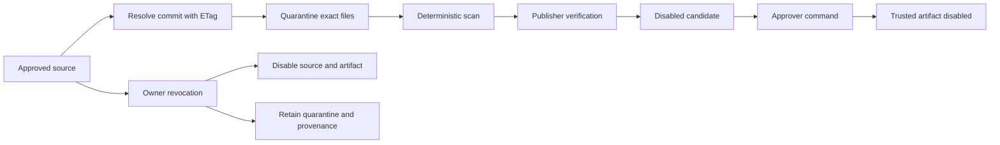

# Skill Source Management

This document owns the durable source, quarantine, refresh, approval, and revocation contracts for
runtime skills fetched from approved GitHub repositories. It keeps external content inert until
deterministic scanning and publisher verification finish, and it keeps the Console SPA read-only.

> Scope: a source grants permission to fetch a bounded path. It does not grant a tool, role,
> provider, runtime identity, or execution authority.

## Design at a glance

An enabled `SkillSource` resolves one immutable Git commit, fetches only its declared skill files,
and stores exact bytes in quarantine. A passing artifact becomes a disabled update candidate.
An Approver can install that candidate through the existing `TrustedArtifactInstaller`, which
persists it disabled. An Owner can revoke a source in one PostgreSQL transaction that disables the
source and installed artifacts, marks quarantine rows revoked, and appends revocation records.
Nothing in this lifecycle deletes provenance.



## Source contract

`SkillSource` is an immutable registration identity. The PostgreSQL store rejects a second record
with the same `source_id` when any registration field differs.

| Field | Contract |
|-------|----------|
| `source_id` | Stable lowercase identifier and manifest `source` value. |
| `kind` | `github_repository`; additional kinds require a new provider adapter and review. |
| `location` | Repository identifier in `owner/repository` form, never a credential-bearing URL. |
| `allowed_path` | Safe relative path containing `SKILL.md` and its detached signature. |
| `authentication_audience_ref` | SecretProvider key. The resolved bearer value is never persisted or logged. |
| `refresh_policy` | `manual` or `scheduled`. Only enabled scheduled sources enter the runner. |

Enabling a source allows refresh. It does not enable an installed skill.

## Quarantine and candidates

The adapter first resolves a full commit SHA and then requests only `SKILL.md`, `SKILL.md.sig`,
and references declared by that manifest. Redirects, symlinks, path mismatches, partial fetches,
oversized content, invalid UTF-8, authentication failures, and rate limits produce no candidate.

Quarantine stores:

- exact file bytes encoded in JSONB with per-file SHA-256 digests;
- the immutable source revision and artifact digest;
- the detached 64-byte publisher signature;
- deterministic scanner version, findings, verdict, and lifecycle state;
- the prior installed digest when the refresh is an update.

A passing signature changes quarantine state to `proposed` and creates one
`SkillUpdateCandidate`. Candidates always retain `disabled=true`; approval never rewrites the
candidate as enabled.

## PostgreSQL ownership

Alembic revision `20260720_0045` owns five tables:

| Table | Responsibility |
|-------|----------------|
| `skill_source` | Registration metadata and source enablement. |
| `skill_quarantine` | Exact fetched bytes, scan evidence, and retained lifecycle state. |
| `skill_update_candidate` | Disabled candidate identity, prior digest, and creation time. |
| `skill_revocation` | Append-only source and digest revocation evidence. |
| `skill_source_refresh_state` | ETag, revision, next refresh, retry time, and bounded error count. |

`PostgresSkillSourceStore`, `PostgresSkillQuarantineStore`,
`PostgresSkillUpdateCandidateStore`, `PostgresSkillRevocationStore`, and
`PostgresSkillSourceRefreshStateStore` are the concrete adapters. Codec tests verify exact
round-trips, and the live-DB integration test upgrades Alembic head before exercising all five.

## Refresh scheduling

`SkillSourceRefreshOrchestrator` lists enabled scheduled sources and atomically claims each due
refresh in PostgreSQL. The claim advances `next_refresh_at` by a five-minute hold so two replicas
cannot fetch the same source concurrently.

- **Not modified**: GitHub `304` preserves the ETag and revision, resets error state, and schedules
  the configured interval.
- **Updated**: exact bytes enter quarantine and a verified candidate is stored before refresh state
  reports success.
- **Rate limited**: `X-RateLimit-Reset` is preferred. If absent or expired, bounded exponential
  backoff starts at five minutes and caps at six hours.
- **Other failures**: the exception type is recorded as a bounded error kind. Tokens and response
  bodies are not included.

Production starts the runner with the read API lifespan. `FDAI_SKILL_SOURCE_TICK_SECONDS` controls
the wake interval and must be at least 30 seconds. `FDAI_GITHUB_API_BASE` may replace the default
GitHub API base with another HTTPS GitHub endpoint.

## HTTP surfaces

The route group is opt-in through `ReadApiConfig.skill_sources` and uses the authenticated
principal resolved by the server.

| Method and route | Minimum authority | Purpose |
|------------------|-------------------|---------|
| `GET /api/v1/skill-sources/browse` | Reader | List enabled sources. |
| `GET /api/v1/skill-sources/search?q=` | Reader | Search enabled source metadata. |
| `GET /api/v1/skill-sources/{source_id}/inspect` | Reader | Inspect refresh, quarantine, and revocation evidence. |
| `GET /api/v1/skill-sources/{source_id}/check-update` | Reader | Read ETag state and newest disabled candidate. |
| `GET /api/v1/skill-sources/{source_id}/candidates` | Reader | List disabled candidates. |
| `POST /api/v1/skill-sources/{source_id}/approve-candidate` | Approver | Reverify and install one candidate disabled. |
| `POST /api/v1/skill-sources/{source_id}/revoke` | Owner | Disable the source and every installed artifact from it. |

The current Console SPA Skills route reads `/skills`; it does not yet call these source-management
endpoints. A future source-management view is limited to the GET projections and MUST expose no
approval or revocation control. POST routes are separate authenticated administration surfaces and
hold no cloud executor identity.

## Approval and revocation

Approval rechecks all of the following before installation:

- the source exists and remains enabled;
- the candidate belongs to that source and still matches a `proposed` quarantine artifact;
- the artifact digest is not revoked;
- publisher trust still verifies over the exact stored bytes.

`TrustedArtifactInstaller` then stores the skill as `TrustedArtifactState.DISABLED`. The runtime
snapshot reloads immediately, so approval changes metadata but grants no prompt eligibility.

Revocation is one transaction. `PostgresSkillSourceRevoker` disables the source, changes matching
quarantine rows to `revoked`, disables every durable skill whose `source` matches, increments
artifact revisions, and appends one revocation row per known digest. It issues no `DELETE`. After
commit, the runtime snapshot reloads, so later skill loads cannot use the revoked artifact while
audit and quarantine evidence remain inspectable.

## Verification

Use these focused checks while changing this subsystem:

```bash
uv run pytest -q tests/core/supply_chain/test_skill_source_*.py
uv run pytest -q tests/persistence/test_postgres_skill_source*.py tests/persistence/test_postgres_skill_quarantine.py
uv run pytest -q tests/delivery/github/test_skill_source.py tests/delivery/read_api/test_skill_sources.py
uv run ruff check src/fdai/core/supply_chain/skill_source_*.py src/fdai/delivery/persistence/postgres_skill_*.py
uv run mypy src/fdai/core/supply_chain/skill_source_*.py src/fdai/delivery/persistence/postgres_skill_*.py
```

The live integration test runs when `FDAI_DATABASE_URL` is configured and otherwise reports an
explicit skip.

## Related docs

| To learn about | Read |
|----------------|------|
| Runtime skill prompt eligibility | [../decisioning/prompt-composition.md](../decisioning/prompt-composition.md) |
| Console identity boundary | [operator-console.md](operator-console.md) |
| Durable trusted artifacts | [../architecture/project-structure.md](../architecture/project-structure.md) |
| Source, test, and owner map | [../architecture/code-map.md](../architecture/code-map.md) |
