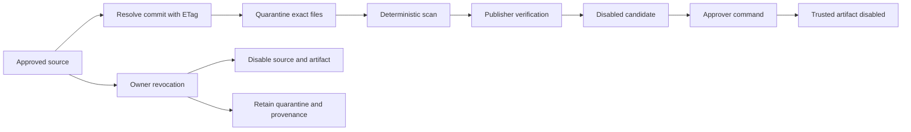

# Skill Source Management

This document owns the durable source, quarantine, refresh, approval, and revocation contracts for
runtime skills fetched from approved GitHub repositories. It keeps external content inert until
deterministic scanning and publisher verification finish, and it keeps the Console SPA read-only.

> Scope: a source grants permission to fetch a bounded path. It does not grant a tool, role,
> provider, runtime identity, or execution authority.

## Design at a glance

An enabled `SkillSource` resolves one immutable Git commit, fetches only its declared skill files,
and stores exact bytes in quarantine. A passing artifact becomes a disabled update candidate.
An Approver can install that candidate through the existing `TrustedArtifactInstaller`, which
persists it disabled. An Owner can revoke a source in one PostgreSQL transaction that disables the
source and installed artifacts, marks quarantine rows revoked, and appends revocation records.
Nothing in this lifecycle deletes provenance.


```mermaid
flowchart LR
    SRC[Approved source] --> FETCH[Resolve commit with ETag]
    FETCH --> QUAR[Quarantine exact files]
    QUAR --> SCAN[Deterministic scan]
    SCAN --> VERIFY[Publisher verification]
    VERIFY --> CAND[Disabled candidate]
    CAND --> APPROVE[Approver command]
    APPROVE --> INST[Trusted artifact disabled]
    SRC --> REVOKE[Owner revocation]
    REVOKE --> DISABLE[Disable source and artifact]
    REVOKE --> KEEP[Retain quarantine and provenance]
```

## Source contract

`SkillSource` is an immutable registration identity. The PostgreSQL store rejects a second record
with the same `source_id` when any registration field differs.

| Field | Contract |
|-------|----------|
| `source_id` | Stable lowercase identifier and manifest `source` value. |
| `kind` | `github_repository`; additional kinds require a new provider adapter and review. |
| `location` | Repository identifier in `owner/repository` form, never a credential-bearing URL. |
| `allowed_path` | Safe relative path containing `SKILL.md` and its detached signature. |
| `authentication_audience_ref` | SecretProvider key. The resolved bearer value is never persisted or logged. |
| `refresh_policy` | `manual` or `scheduled`. Only enabled scheduled sources enter the runner. |

Enabling a source allows refresh. It does not enable an installed skill.

## Quarantine and candidates

The adapter first resolves a full commit SHA and then requests only `SKILL.md`, `SKILL.md.sig`,
and references declared by that manifest. Redirects, symlinks, path mismatches, partial fetches,
oversized content, invalid UTF-8, authentication failures, and rate limits produce no candidate.

Quarantine stores:

- exact file bytes encoded in JSONB with per-file SHA-256 digests;
- the immutable source revision and artifact digest;
- the detached 64-byte publisher signature;
- deterministic scanner version, findings, verdict, and lifecycle state;
- the prior installed digest when the refresh is an update.

A passing signature changes quarantine state to `proposed` and creates one
`SkillUpdateCandidate`. Candidates always retain `disabled=true`; approval never rewrites the
candidate as enabled.

## PostgreSQL ownership

Alembic revision `20260720_0045` owns five tables:

| Table | Responsibility |
|-------|----------------|
| `skill_source` | Registration metadata and source enablement. |
| `skill_quarantine` | Exact fetched bytes, scan evidence, and retained lifecycle state. |
| `skill_update_candidate` | Disabled candidate identity, prior digest, and creation time. |
| `skill_revocation` | Append-only source and digest revocation evidence. |
| `skill_source_refresh_state` | ETag, revision, next refresh, retry time, and bounded error count. |

`PostgresSkillSourceStore`, `PostgresSkillQuarantineStore`,
`PostgresSkillUpdateCandidateStore`, `PostgresSkillRevocationStore`, and
`PostgresSkillSourceRefreshStateStore` are the concrete adapters. Codec tests verify exact
round-trips, and the live-DB integration test upgrades Alembic head before exercising all five.

## Refresh scheduling

`SkillSourceRefreshOrchestrator` lists enabled scheduled sources and atomically claims each due
refresh in PostgreSQL. The claim advances `next_refresh_at` by a five-minute hold so two replicas
cannot fetch the same source concurrently.

- **Not modified**: GitHub `304` preserves the ETag and revision, resets error state, and schedules
  the configured interval.
- **Updated**: exact bytes enter quarantine and a verified candidate is stored before refresh state
  reports success.
- **Rate limited**: `X-RateLimit-Reset` is preferred. If absent or expired, bounded exponential
  backoff starts at five minutes and caps at six hours.
- **Other failures**: the exception type is recorded as a bounded error kind. Tokens and response
  bodies are not included.

The orchestrator and durable claim behavior are implemented and focused-test-backed. The current
runtime bootstrap does not instantiate the orchestrator, a periodic runner, or a concrete GitHub
adapter. Runner ownership, wake interval configuration, and GitHub endpoint configuration therefore
remain production composition work rather than deployed behavior.

## HTTP surfaces

The Operator Service workflow family registers these routes and uses the authenticated principal
resolved by the server.

| Method and route | Minimum authority | Purpose |
|------------------|-------------------|---------|
| `GET /api/v1/skill-sources/browse` | Reader | List enabled sources. |
| `GET /api/v1/skill-sources/search?q=` | Reader | Search enabled source metadata. |
| `GET /api/v1/skill-sources/{source_id}/inspect` | Reader | Inspect refresh, quarantine, and revocation evidence. |
| `GET /api/v1/skill-sources/{source_id}/check-update` | Reader | Read ETag state and newest disabled candidate. |
| `GET /api/v1/skill-sources/{source_id}/candidates` | Reader | List disabled candidates. |
| `POST /api/v1/skill-sources/{source_id}/approve-candidate` | Approver | Submit an idempotent candidate-approval proposal. |
| `POST /api/v1/skill-sources/{source_id}/revoke` | Owner | Submit an idempotent source-revocation proposal. |

The current Console SPA Skills route reads `/skills`; it does not yet call these source-management
endpoints. A future source-management view is limited to the GET projections and MUST expose no
approval or revocation control. GET operations use the workflow read gateway. POST operations return
an accepted proposal and do not call the core administration service directly; the Operator Service
holds no cloud executor identity.

## Approval and revocation

The core `SkillSourceAdministrationService` rechecks all of the following before installation:

- the source exists and remains enabled;
- the candidate belongs to that source and still matches a `proposed` quarantine artifact;
- the artifact digest is not revoked;
- publisher trust still verifies over the exact stored bytes.

`TrustedArtifactInstaller` then stores the skill as `TrustedArtifactState.DISABLED`. The runtime
snapshot reloads immediately, so approval changes metadata but grants no prompt eligibility.

Revocation is one transaction. `PostgresSkillSourceRevoker` disables the source, changes matching
quarantine rows to `revoked`, disables every durable skill whose `source` matches, increments
artifact revisions, and appends one revocation row per known digest. It issues no `DELETE`. After
commit, the runtime snapshot reloads, so later skill loads cannot use the revoked artifact while
audit and quarantine evidence remain inspectable.

The domain approval and revocation implementations are not currently bound to the Operator Service
proposal operations or a production runtime composition.

## Implementation status

The current tree contains the deterministic lifecycle and durable adapters, but it does not yet
compose an end-to-end external-source capability.

### Implementation scope

| Area | State | Evidence | Notes |
|------|-------|----------|-------|
| Source, quarantine, scan, verification, candidate, approval, and revocation domain lifecycle | implemented | [`source_registry.py`](../../../services/core-control-plane/src/fdai/core/skills/source_registry.py), [`skill_source_pipeline.py`](../../../services/core-control-plane/src/fdai/core/supply_chain/skill_source_pipeline.py), [`skill_source_admin.py`](../../../services/core-control-plane/src/fdai/core/supply_chain/skill_source_admin.py), and focused supply-chain tests | Current focused tests cover registration, refresh, blocking, proposal creation, approval guards, and revocation delegation. |
| PostgreSQL schema, stores, durable claims, and transactional revocation | implemented | [Alembic revision `20260720_0045`](../../../alembic/versions/20260720_0045_skill_source_quarantine.py), [`postgres_skill_source.py`](../../../services/core-control-plane/src/fdai/delivery/persistence/postgres_skill_source.py), [`postgres_skill_quarantine.py`](../../../services/core-control-plane/src/fdai/delivery/persistence/postgres_skill_quarantine.py), and codec tests | Offline store tests pass. The live PostgreSQL restart and provenance test exists but requires `FDAI_DATABASE_URL`. |
| Operator HTTP read and proposal contracts | implemented | [`manifest.py`](../../../services/operator-service/src/fdai_operator_service/families/workflow/manifest.py), [`routes.py`](../../../services/operator-service/src/fdai_operator_service/families/workflow/routes.py), and [`test_operator_workflow_family.py`](../../../services/operator-service/tests/test_operator_workflow_family.py) | Reader GET routes and Approver/Owner proposal routes are registered and role-tested. They intentionally do not import or call the core authority implementation. |
| Concrete GitHub fetch adapter | implemented | [`skill_source.py`](../../../services/core-control-plane/src/fdai/delivery/github/skill_source.py); [`test_skill_source.py`](../../../services/core-control-plane/tests/delivery/github/test_skill_source.py); focused adapter tests (`28 passed`) | The adapter resolves a full immutable commit SHA with strict ETag support and fetches exact bounded regular files while rejecting redirects, substitutions, symlinks, malformed content, authentication failures, and rate limits. Provider and credential failures remain redacted. Runtime composition remains separate. |
| Production composition and scheduled runner | not-started | Current runtime/bootstrap usage audit | No bootstrap path instantiates `SkillSourceRefreshService`, `SkillSourceRefreshOrchestrator`, `SkillSourceAdministrationService`, or their PostgreSQL adapters. |
| Console source-management projection and governed runtime evidence | not-started | Current Console usage audit and focused test run | The Console does not call the source-management routes, and no current runtime receipt proves fetch-to-proposal or approval/revocation execution. |

### Implementation history

| Date | State | Change | Evidence | Remaining |
|------|-------|--------|----------|-----------|
| 2026-08-13 | in-progress | Adopted the implementation ledger, corrected stale production-binding and HTTP execution claims, and repaired the focused test command; earlier implementation provenance was not reconstructed. | `current change`; `37 passed, 1 skipped` from the exact-path skill-source and Operator workflow suite; roadmap, translation, punctuation, Hangul, size, and link checks. | Implement and bind the missing adapter and runtime path, validate live persistence, expose the read-only projection, and record governed runtime evidence. |
| 2026-08-14 | implemented | Added the concrete GitHub skill-source adapter with immutable revision, conditional request, exact-path, content-bound, authentication, redirect, and rate-limit enforcement. | `current change`; `services/core-control-plane/src/fdai/delivery/github/skill_source.py`; `services/core-control-plane/tests/delivery/github/test_skill_source.py`; focused adapter tests `21 passed`. | Compose the independently runnable owner, connect the authority-bearing event path, validate live persistence, and expose the read-only projection. |
| 2026-08-14 | implemented | Hardened conditional requests to accept only bounded quoted entity tags and suppressed credential-provider exception context so secrets cannot escape through chained errors. | `current change`; `services/core-control-plane/src/fdai/delivery/github/skill_source.py`; `services/core-control-plane/tests/delivery/github/test_skill_source.py`; focused adapter tests `28 passed`. | Runtime composition, authority-bearing event integration, live persistence, and the read-only projection remain open. |

### Remaining work

- [x] Implement a concrete GitHub `SkillSourceAdapter` that enforces immutable revision, bounded path,
  redirect, symlink, content-size, UTF-8, authentication, and rate-limit rules, with focused adapter
  tests for every rejection path.
- [ ] Compose the source stores, quarantine stores, verifier factory, refresh service,
  administration service, and scheduled orchestrator in the independently runnable owning service;
  prove duplicate-runner exclusion and restart recovery with focused integration tests.
- [ ] Connect workflow read and proposal operations to the authority-bearing event path without
  importing core implementations into the Operator Service, and prove approval and revocation remain
  role-gated, idempotent, disabled-by-default, and replayable.
- [ ] Run the live PostgreSQL restart/revocation test with `FDAI_DATABASE_URL`, add the read-only
  Console projection, and record governed runtime receipts for refresh, approval, and revocation.

## Verification

Use these focused checks while changing this subsystem:

```bash
uv run pytest -q services/core-control-plane/tests/core/skills/test_source_registry.py
uv run pytest -q services/core-control-plane/tests/core/supply_chain/test_skill_source_admin.py services/core-control-plane/tests/core/supply_chain/test_skill_source_pipeline.py services/core-control-plane/tests/core/supply_chain/test_skill_source_refresh.py
uv run pytest -q services/core-control-plane/tests/persistence/test_postgres_skill_source.py services/core-control-plane/tests/persistence/test_postgres_skill_source_integration.py services/core-control-plane/tests/persistence/test_postgres_skill_quarantine.py
uv run pytest -q services/operator-service/tests/test_operator_workflow_family.py
uv run ruff check services/core-control-plane/src/fdai/core/supply_chain/skill_source_*.py services/core-control-plane/src/fdai/delivery/persistence/postgres_skill_*.py
uv run mypy services/core-control-plane/src/fdai/core/supply_chain/skill_source_*.py services/core-control-plane/src/fdai/delivery/persistence/postgres_skill_*.py
```

The live integration test runs when `FDAI_DATABASE_URL` is configured and otherwise reports an
explicit skip.

## Related docs

| To learn about | Read |
|----------------|------|
| Runtime skill prompt eligibility | [../decisioning/prompt-composition.md](../decisioning/prompt-composition.md) |
| Console identity boundary | [operator-console.md](operator-console.md) |
| Durable trusted artifacts | [../architecture/project-structure.md](../architecture/project-structure.md) |
| Source, test, and owner map | [../architecture/code-map.md](../architecture/code-map.md) |
