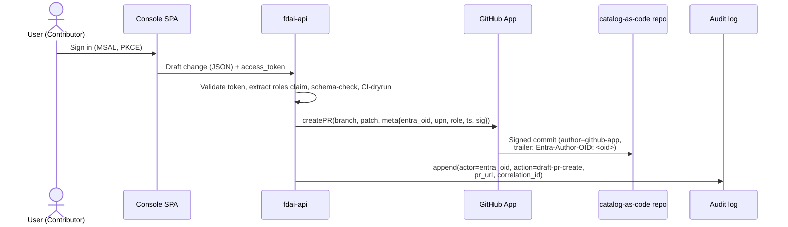
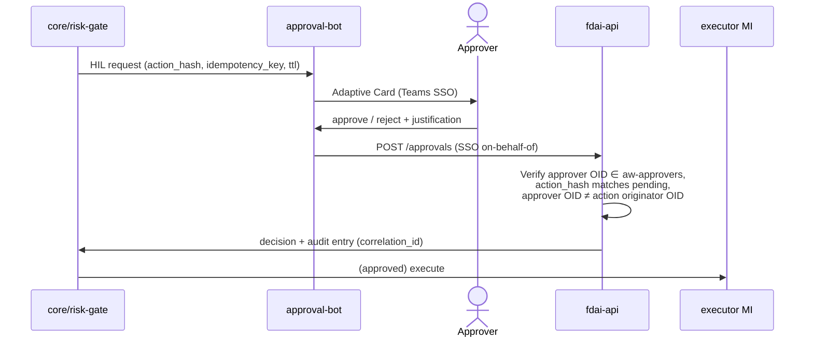

# 사용자 RBAC와 Entra 아이덴티티

**사람 사용자** 가 콘솔, ChatOps, catalog-as-code 저장소에서 어떻게 인증되고 인가되고
감사되는가. 이 문서는 사람 아이덴티티 모델의 진실 원본입니다; 비-사람 아이덴티티(executor
Managed Identity, GitHub App, Teams bot)는 여전히 [security-and-identity-ko.md](../architecture/security-and-identity-ko.md) 와
[deploy-and-onboard-ko.md](../deployment/deploy-and-onboard-ko.md) 가 관장.

*사람* 측면의 P0 blocker "최종 아이덴티티 매핑 (외부 IdP ↔ Entra ↔ Managed Identity)"
([security-and-identity-ko.md#open-decisions](../architecture/security-and-identity-ko.md#open-decisions))
을 해결; executor-측 매핑은 거기 선언된 대로 유지.

> RBAC(이 문서)은 *사람이 무엇을 조작할 수 있나*에 답한다. 별개의, 독립적으로 해석되는
> 축인 [agent-stewardship-and-handover-ko.md](agent-stewardship-and-handover-ko.md)는
> FDAI가 업무를 넘겨받은 지금 *15개 에이전트를 각각 누가 소유하나*(책임 + 에스컬레이션 +
> 인수인계)에 답한다. 한 사람이 보통 둘 다에 속하지만, steward라는 사실만으로는 RBAC
> capability가 부여되지 않는다.

> 고객-비종속: 아래 모든 그룹 이름, app registration 이름, GUID는 **placeholder** ;
> 포크가 config로 실제 값 공급
> ([generic-scope.instructions.md](../../../.github/instructions/generic-scope.instructions.md)).

## 1. 상기하는 설계 원칙

세 안전 원칙이 이 설계를 관장; 아래 모든 선택이 이들을 보존:

1. **자기승인 없음** - governance 변경 요청자(PR 저자, HIL 트리거)는 승인자가 되어선 안 됨.
   CI + GitHub CODEOWNERS로 강제, 롤 분리로 아님.
2. **승인 ≠ 실행** - 어떤 사람 롤도 executor Managed Identity를 보유하지 않음. 사람은 작성·
   리뷰·승인; MI가 실행.
3. **콘솔은 읽기 전용** - 콘솔은 절대 라이브 카탈로그를 변형하거나 액션을 실행하지 않음
   ([app-shape.instructions.md](../../../.github/instructions/app-shape.instructions.md)). 편집
  흐름의 목표 계약은 콘솔 사용자를 대신해 GitHub App이 작성하는 draft PR입니다. 현재
  GitOps adapter는 remediation PR만 게시하며, 사용자 draft-governance API는 아직 없습니다.

## 2. 롤 모델 (4티어 + Break-Glass)

Azure RBAC(Reader / Contributor / Owner) 모델. 일상 4개 롤 + 하나의 분리된 break-glass
그룹. 롤은 **의도적으로 coarse-grained** - 차별화는 더 많은 롤 추가가 아니라 CI 검사,
CODEOWNERS 경로, 앱 레벨 정당화에서 옴.

| # | 롤 | Entra 보안 그룹 | 유사 | 가능 |
|---|-----|----------------|------|------|
| 1 | **Reader** | `aw-readers` | Azure Reader | 콘솔 조회: KPI 대시보드, 감사 로그, shadow 결과, HIL 큐 |
| 2 | **Contributor** | `aw-contributors` | Azure Contributor | Reader + 규칙, 룰셋, 할당, exemption, override 초안 PR 작성 |
| 3 | **Approver** | `aw-approvers` | (Reviewer) | Reader + governance PR 리뷰/승인 + 런타임 HIL 요청 승인 + enforce 승격 / exemption / override 승인 (고위험은 quorum - §5 참조) |
| 4 | **Owner** | `aw-owners` | Azure Owner | Approver + kill-switch 트리거 + Entra 그룹 멤버십 관리 + 인프라 IaC 적용 |
| - | **Break-Glass** | `aw-break-glass` | (별도 비상 계정) | Console 조회, kill-switch, 비상 access grant capability만 가집니다. Runtime HIL 승인 capability는 없으며 Owner의 superset이 아닙니다. |

**티어 추가 없이 모델을 안전하게 유지하는 규칙**

- 사용자는 여러 그룹에 소속 가능(예: Contributor와 Approver 모두), 하지만 **자기승인 없음**
  CI 검사가 여전히 자신의 PR 승인을 블록. 검사는 그룹 멤버십이 아니라 PR 저자 trailer와
  리뷰어의 Entra OID를 비교.
- **Break-Glass는 Owner 안에 중첩되지 않음.** 별도 관리 그룹; Owner 계정도 `aw-break-glass`
  에 없으면 break-glass 액션을 authorize하지 않음. 이는 Owner 계정이 손상되어도 blast radius
  제한.
- **활성화 시 검증된 자격을 보존합니다.** Token 확인 과정은 유효 역할에서 `BreakGlass`를
  제거하지만 별도의 자격 플래그를 유지합니다. 시간 제한 활성화는 긴급 역할을 추가하기 전에
  이 플래그를 확인합니다.
- **현재 activation 경계.** `RoleResolver.activate_break_glass`는 incident id와 future expiry를
  검증하는 pure activation primitive입니다. Production API에는 이를 호출하는 endpoint, persistent
  activation store, TTL enforcement composition이 아직 없습니다. 따라서 token의 BreakGlass claim만으로
  runtime principal이 elevation되지 않으며, HIL approval eligibility도 생기지 않습니다.
- **PIM은 선택**. 상류는 요구하지 않음. Entra ID P2 있는 포크는 just-in-time 활성화를 위해
  `aw-approvers` / `aw-owners` 위에 PIM을 얹을 수 있지만, 기본 모델은 P1에서 작동.

## 3. 페르소나 → 액션 매트릭스

| 액션 | Reader | Contributor | Approver | Owner | Break-Glass |
|------|:------:|:-----------:|:--------:|:-----:|:-----------:|
| 콘솔 조회 | ✓ | ✓ | ✓ | ✓ | ✓ |
| 규칙 / 룰셋 draft PR 작성 | | ✓ | ✓ | ✓ | |
| 할당 / exemption / override draft PR 작성 | | ✓ | ✓ | ✓ | |
| 표준 governance PR 리뷰 + 승인 | | | ✓ | ✓ | |
| `audit → deny / remediate` 승격 승인 (quorum) | | | ✓ | ✓ | |
| Exemption 승인 (time-boxed) | | | ✓ | ✓ | |
| Override 승인 (long-lived 가능) | | | ✓ | ✓ | |
| 런타임 HIL 요청 승인 | | | ✓ | ✓ | |
| 런타임 HIL 요청 승인 (비상) | | | | | |
| 글로벌 kill-switch 트리거 | | | | ✓ | ✓ |
| 비상 스코프 접근 부여 | | | | | ✓ |
| `aw-*` 그룹 멤버십 관리 | | | | ✓ | |
| 인프라 IaC 적용 (deployer) | | | | ✓ | |
| Executor Managed Identity 보유 | (절대) - MI는 비-사람 |||||

Production API는 durable command service가 연결된 경우에만 `POST /system/kill-switch`를
노출합니다. Owner 또는 externally activated BreakGlass role은 capability check를 통과하지만,
현재 production auth composition에는 BreakGlass activation path가 없으므로 일반 token resolution에서
도달 가능한 emergency caller는 Owner입니다. Reader, Contributor, Approver는 호출할 수 없습니다.
이 endpoint는 console button이 아니며 executor identity를 사용하지 않고 revision state 변경과
audit entry를 원자적으로 기록합니다.

## 4. Entra ID 아티팩트

### 4.1 목표 App Registration

세 registration, 각각 자체 오디언스와 권한 표면. 분할이 SPA-발행 토큰이 backend 관리 스코프를
운반하는 것을 방지.

> Repository는 제공된 tenant, audience, client 및 role/group 값을 소비합니다. 현재 Terraform은
> 이 registration이나 App Role assignment를 프로비저닝하지 않습니다.

| App Registration | 타입 | 오디언스 | 노트 |
|------------------|------|---------|------|
| `fdai-console-spa` | SPA (PKCE, secret 없음) | `fdai-api` 스코프 요청 | 콘솔 사인인만 |
| `fdai-api` | Web API | `api://<guid>` | 콘솔 + ChatOps backend가 호출; **App Roles** (§4.4) 선언, 모든 요청의 `roles` claim 검증 |
| `fdai-approval-bot` | Bot (Azure Bot channel registration) | `fdai-api` on-behalf-of Teams SSO | Adaptive Card HIL 승인 |

Redirect URI, tenantId, clientId는 **fork-provided** 이며 config로 주입.

### 4.2 보안 그룹 (slots)

상류가 slot 정의; 포크가 Entra `objectId` 값 공급. 시작 config 검증이 필수 slot 누락 시
fail fast (deny-by-default).

```yaml
# shared/config schema (upstream slot definition)
rbac:
  entra:
    tenant_id: <fork-provided>
    groups:
      readers:       <objectId>   # required
      contributors:  <objectId>   # required
      approvers:     <objectId>   # required
      owners:        <objectId>   # required
      break_glass:   <objectId>   # required (may be an empty group but must exist)
```

그룹 명명(`aw-readers` 등) 은 권장 관례; 런타임에는 objectId만 소비됨.

### 4.3 Conditional Access

CA는 Entra ID P1에서 가능(P2 불필요). 그룹별 권장 정책:

| 대상 그룹 | 요건 |
|-----------|------|
| `aw-approvers`, `aw-owners` | **Phishing-resistant MFA** (FIDO2 / Windows Hello for Business / cert-based); text/phone OTP는 **거부** |
| `aw-owners` | 추가로 **compliant device** 또는 hybrid Entra-joined 요구 |
| `aw-break-glass` | Named-location 제한, 전용 하드웨어 토큰, 지속 사인인 알림 |
| 모든 `aw-*` 그룹 | 레거시 인증 프로토콜 블록 |

### 4.4 App Roles (토큰 표면)

API는 **App Roles를 canonical token surface로 우선 사용**합니다. App Roles는 `fdai-api` app
registration에 선언되고 Enterprise Applications 뷰에서 `aw-*` 그룹에 할당되며 access token의
`roles` claim으로 전달됩니다. Migration compatibility를 위해 `roles`가 비어 있고 inline `groups`
claim이 사용 가능한 경우 `RoleResolver`는 configured objectId mapping을 fallback으로 사용합니다.
Group-overage token에는 이 fallback이 불가능하므로 FDAI App Role이 반드시 필요합니다.

| App Role 값 | 할당 대상 (Entra 보안 그룹) |
|-------------|--------------------------|
| `Reader` | `aw-readers` |
| `Contributor` | `aw-contributors` |
| `Approver` | `aw-approvers` |
| `Owner` | `aw-owners` |
| `BreakGlass` | `aw-break-glass` |

App Roles를 canonical surface로 쓰는 이유:

- **테넌트 간 이식 가능.** App Role 값은 코드에 정의된 상수; 그룹 `objectId` 는 테넌트마다
  다름. 포크는 코드가 아니라 그룹 할당을 변경.
- **Groups-overage 실패 없음.** 200개가 넘는 그룹에 속한 사용자의 token은 기본으로
  `groups` claim을 생략하지만 `roles` claim은 영향을 받지 않습니다. Overage token에 FDAI
  App Role이 없으면 API는 principal을 조용히 미할당 처리하지 않고 구성 오류로 fail closed합니다.
- **앱-스코프 최소권한.** App Roles는 `fdai-api` 에만 적용; 손상된 토큰의 blast
  radius를 넓히기 위해 다른 곳에서 재사용될 수 없음.

그룹 멤버십은 **관리 표면** 유지(Owners가 Entra Portal로 멤버 추가/제거); App Roles는 API가
보는 **토큰 표면**.

## 5. Governance 액션 강제 (CI + CODEOWNERS)

Coarse 롤은 PR과 API 레이어에서 **quorum + justification + 저자≠승인자** 검사로 안전하게
만들어짐:

> **구현 상태**: 런타임에는 capability 검사, `RoleEnforcer.no_self_approval`, risk-gate quorum이
> 구현되어 있습니다. 아래 PR trailer, diff-risk, reviewer OID, justification 검사는 목표 CI
> 계약이며 현재 `.github/workflows/`에는 구현되어 있지 않습니다. 현재 `.github/CODEOWNERS`는
> exemption, risk classification 및 framework surface를 upstream owner에게 라우팅하지만 아래
> `@aw-approvers` 템플릿 전체를 구현하지 않습니다.

### 5.1 목표 CODEOWNERS (단일 승인자 그룹, 경로-기반 리뷰어 카운트)

```
# CODEOWNERS
rule-catalog/rules/**              @aw-approvers
rule-catalog/assignments/**        @aw-approvers
rule-catalog/exemptions/**         @aw-approvers
rule-catalog/overrides/**          @aw-approvers
```

모든 governance PR은 최소 하나의 `@aw-approvers` 리뷰어 필요. CI가 **diff 컨텐트** 에 기반해
그 요건을 올림:

| Diff 패턴 (CI 감지) | 필요 승인 (`@aw-approvers`) |
|--------------------|---------------------------|
| 규칙 텍스트 또는 룰셋 변경 | **1** |
| 할당 파라미터 변경 (effect 승격 없음) | **1** |
| 할당 `effect` 승격 `audit → deny / remediate` | **2 (quorum)** |
| Exemption 생성 / 갱신 | **2 (quorum)** |
| Override 생성 / 수정 | **2 (quorum)** |

Quorum-2는 "elevated approver" 그룹 도입 없이 구체화된 shadow→enforce 승격 게이트
([architecture.instructions.md](../../../.github/instructions/architecture.instructions.md)).

### 5.2 목표 CI 검사 (상류 제공, 포크 설정)

- **저자-아님-승인자**: PR 저자의 Entra OID trailer(§6)와 모든 리뷰어의 Entra OID 파싱;
  어떤 리뷰어의 OID가 저자 OID와 같으면 실패.
- **저자-롤-검사**: PR 저자의 토큰(draft PR 생성 시 캡처)은 `Contributor` 또는 상위 롤
  (`Approver`, `Owner`)을 포함하는 `roles` claim을 운반해야 함. 롤은 draft-생성 시점에 PR
  trailer에 스탬프되어 CI가 리뷰 시점에 Entra를 재쿼리하지 않음.
- **Justification-존재**: 고위험 diff(위 quorum-2 행)의 경우 PR description은 `N` 문자 이상의
  `Justification:` 블록을 포함해야 함(`N` 은 설정됨).
- **서명 커밋 / 서명 trailer**: 리뷰어 승인은 특정 PR head 커밋에 바인딩; 승인 후 force-push는
  무효화하고 리뷰 재요청.

### 5.3 앱 레벨 정당화 (런타임 HIL)

목표 Adaptive Card 승인 계약은 `justification` 필드를 필수로 하고 `""` / 누락 값을 `400`으로
거부합니다. 현재 HMAC callback은 `justification`을 문자열로 검증하지만 빈 문자열을 허용합니다.
현재 강제되는 경계는 callback 서명과 replay window, no-self-approval, 선택적 signed
`actor_roles` capability, registry/coordinator의 typed decision입니다.

```jsonc
POST /hil/{approval_id}/decision
{
  "approval_id": "hil-2026-07-04-abc123",
  "decision": "approve",
  "actor_oid": "approver-oid",
  "justification": "verified rollback plan in runbook X; safe within maintenance window"
}
```

## 6. 목표 아이덴티티 흐름: 콘솔 → Draft PR → 감사

목표 흐름은 쓰기를 **GitHub App** 에 위임하여 콘솔의 읽기 전용 경계를 보존하고 사용자의 Entra
OID를 no-self-approval과 감사 상관관계 검사까지 전달합니다. 현재 `GitOpsPrAdapter`는 executor가
생성한 remediation draft PR을 게시하지만, 콘솔 draft-governance endpoint, Entra OID trailer,
사람 OID와 GitHub 로그인 매핑 저장소는 구현되어 있지 않습니다.



- SPA는 절대 GitHub PAT를 보유하지 않음. 카탈로그로의 쓰기 접근은 GitHub App에만 속함.
- 커밋의 git author는 GitHub App; 사람 사용자의 Entra OID는 커밋 trailer
  (`Entra-Author-OID: <guid>`) 와 PR body에 동승. CI가 그 trailer를 파싱.
- 사용자의 Entra OID ↔ GitHub 로그인 매핑은 `shared/providers/` 인터페이스 뒤에 포크가 저장.
  매핑 부재 → API가 draft를 `403` 으로 거부.

## 7. ChatOps HIL 흐름

이것은 HIL 승인 hop의 아이덴티티 뷰. 그 뒤의 **채널 추상화** - 카테고리, 신뢰 티어, 벤더별
규칙, fallback 정책 - 는 [channels-and-notifications-ko.md](channels-and-notifications-ko.md)
에 있음.

> **현재 경계**: Teams conversation ingress는 Bot Framework JWT와 same-tenant principal
> binding을 검증합니다. Runtime HIL 결정은 선택적으로 등록되는 HMAC-signed
> `POST /hil/{approval_id}/decision` callback이 registry 또는 `HilResumeCoordinator`에 typed
> decision을 전달합니다. 아래 Teams SSO OBO 교환과 App Role을 포함한 사용자 callback은 목표
> 흐름이며 아직 구현되어 있지 않습니다.



- 현재 callback은 timestamp, URL `approval_id`, body를 HMAC에 바인딩합니다. Registry 또는 parked
  coordinator는 이 identifier를 pending item과 대조하고 idempotent terminal decision을 강제합니다.
- No-self-approval은 signed callback actor OID와 pending item의 submitter OID를 비교합니다. 향후
  사람이 작성한 governance PR에서 이 identity를 종단으로 전달하는 것은 목표 흐름에 남아 있습니다.

## 8. 감사 상관관계

목표 governance 흐름은 네 시스템에 같은 `correlation_id`를 남겨 단일 결정을 종단으로
재구성합니다. 현재 typed HIL 및 IAM 경로는 자체 state-and-audit 상관관계를 기록하지만 Entra
사인인, GitHub PR, Teams OBO 및 core audit을 하나로 잇는 흐름은 구현되어 있지 않습니다.

| 소스 | 기록 내용 |
|------|----------|
| Entra 사인인 로그 | 누가 사인인, MFA 방법, 디바이스, 위치 |
| `fdai-api` 액션 로그 | 어떤 API 호출, `justification`, `entra_oid`, `correlation_id` |
| GitHub PR 이벤트 | PR 저자 trailer, 리뷰어 승인, CI 검사 결과 |
| `core/audit` | 최종 결정, 티어, executor / 승인자 아이덴티티, idempotency 키 |

상관 ID는 흐름의 첫 사용자-개시 액션에서 `fdai-api` 가 생성하고 GitHub(PR body),
Adaptive Card, 코어 감사 writer로 전파.

## 9. 포크 vs 상류 분리

아래 표는 목표 소유권 분리입니다. 현재 상류에는 역할/capability, Entra verifier와 resolver,
RBAC group slot, IAM request/directory 계약, remediation PR adapter가 있습니다. App registration
manifest template, 사람 OID와 GitHub 로그인 mapping provider 및 governance PR CI는 아직 없습니다.

| 항목 | 상류 (이 리포) | 포크 |
|------|--------------|------|
| App registration manifest 템플릿 (스코프, redirect URI 스키마) | ✓ | tenantId, clientId 값 |
| Config 스키마의 Entra 보안 그룹 **slot** | ✓ | 각 slot의 objectId 값 |
| Conditional Access 정책 **요건** (문서화로) | ✓ | tenant-측 정책 생성 |
| CODEOWNERS 템플릿 | ✓ | GitHub 팀 이름 매핑 |
| `entra-oid ↔ github-login` 매핑 **인터페이스** (`shared/providers/`) | ✓ | 실제 매핑 데이터 |
| Justification 필드 + CI diff-risk 분류기 | ✓ | `N` (최소 길이) 튠, 경로 패턴 |
| Break-glass 알림 채널 | ✓ (인터페이스) | 실제 채널 바인딩 |

## 10. 사인인 흐름 참조

§6와 §7의 흐름 뒤 구체 프로토콜 세부사항. 모든 타이밍 값은 권장; 포크는 Conditional Access로
튠.

### 10.1 콘솔 (SPA) - OIDC + PKCE 있는 Authorization Code

- **라이브러리**: MSAL.js v3 (`@azure/msal-browser`). Implicit Flow 없음.
- **테넌트**: 포크당 single-tenant (`accountsInHomeTenantOnly`); guest 접근은 Entra B2B
  초대 통해(§10.5).
- **Redirect**: 콘솔은 anonymous 표면 없음. 로드 시 MSAL에 유효 세션이 없으면 즉시
  `/authorize` 로 리다이렉트.
- **토큰 저장**: access + id 토큰은 메모리 또는 `sessionStorage`(절대 `localStorage` 아님);
  refresh는 MSAL `acquireTokenSilent` 가 관리.
- **자동 토큰 시간 제한**: 콘솔은 기본적으로 `acquireTokenSilent`를 최대 10초 동안
  기다립니다. 토큰 획득이 멈추면 현재 패널을 계속 로드 상태로 두지 않고 재시도 작업이 있는
  인증 오류를 표시합니다. 포크의 아이덴티티 정책에 다른 제한 시간이 필요한 경우
  `VITE_AUTH_TOKEN_TIMEOUT_MS`를 양의 정수로 설정할 수 있습니다.
- **만료된 API 세션**: 구성된 read 또는 ingestion API가 `401`을 반환하면 현재 data surface를
  닫고 전체 화면 sign-in recovery view로 전환합니다. Standard read, chat, workflow, command,
  SSE stream에 동일하게 적용합니다. Identity provider 요청과 `403` access decision은 이 전환을
  시작하지 않습니다. 하나의 shared fetch observer가 overlapping owner, idempotent cleanup 및 다른
  owner가 global fetch function을 교체한 뒤의 재설치를 지원하며, cleanup은 해당 replacement를
  덮어쓰지 않습니다.
- **사인아웃**: `/logout?post_logout_redirect_uri=...` 이 콘솔 세션과 테넌트의 Entra 세션
  모두 클리어.

> **로컬 개발**: 로컬 로그인 선택기에서 dev bypass를 제공할 때 콘솔은 먼저 토큰 없이
> core read endpoint를 호출합니다. 이 probe가 성공한 경우에만 현재 세션의 bypass를
> 저장합니다. `401` 또는 `403`이면 선택기를 유지하고 운영자에게 Entra 로그인을 안내하므로,
> 인증을 강제하는 로컬 API에 깨진 anonymous 세션으로 진입하지 않습니다.

```mermaid
sequenceDiagram
  actor U as User
  participant SPA as Console SPA (MSAL)
  participant E as Entra ID
  participant API as fdai-api
  U->>SPA: navigate https://console.<fork>/
  SPA->>E: /authorize (client_id=spa, scope=api://<api>/access + openid,<br/>response_type=code, PKCE)
  E->>U: sign-in prompt
  U->>E: credentials
  E->>E: Conditional Access evaluate<br/>(approvers/owners → phishing-resistant MFA)
  E-->>U: MFA challenge (if triggered)
  U->>E: FIDO2 / WHfB response
  E->>SPA: /callback?code=...
  SPA->>E: /token (code + PKCE verifier)
  E->>SPA: id_token + access_token(aud=api://<api>) + refresh_token
  SPA->>API: GET /me + Authorization: Bearer <access_token>
  API->>API: verify signature (JWKS), aud, iss, exp;<br/>extract oid, upn, roles
  API->>SPA: {oid, upn, roles, correlation_id}
  SPA->>SPA: role-based UI render
```

### 10.2 API 토큰 검증

API는 다음처럼 모든 요청 검증(deny by default):

1. **서명** via Entra JWKS (`https://login.microsoftonline.com/<tenant>/discovery/v2.0/keys`).
2. **오디언스** 가 `api://<fdai-api-guid>` 와 같음.
3. **발급자** 가 포크의 tenant 발급자 URL과 같음.
4. **만료 안 됨** (`exp`) 과 **not-before 유효** (`nbf`).
5. **역할 해석** - `roles` App Role을 먼저 사용합니다. 이 claim이 비어 있고 inline `groups`
  claim을 사용할 수 있으면 configured objectId mapping으로 fallback합니다. Group-overage token에
  App Role이 없으면 fail closed합니다. 어떤 known role도 해석되지 않으면 protected endpoint는
  `403`을 반환합니다. `aw-readers`로 자동 프로비저닝하지 않습니다.
6. **안정 아이덴티티** 는 `oid` (Entra 사용자 objectId). `upn`/email은 정보성; 감사와
   자기승인 없음은 `oid` 사용.

1-4단계는 제네릭
[`EntraJwtVerifier`](../../../src/fdai/delivery/read_api/entra_verifier.py) (PyJWT +
`PyJWKClient`)가 upstream에서 구현; 5-6단계는
[`RoleResolver`](../../../src/fdai/core/rbac/resolver.py)가 구현. 이 verifier는
customer-agnostic - 포크는 값만 env로 공급:

| Env var | 필수 | 기본값 | 용도 |
|---------|:----:|--------|------|
| `FDAI_ENTRA_TENANT_ID` | yes | - | 포크의 단일 tenant; 발급자 + JWKS URI 파생. |
| `FDAI_API_AUDIENCE` | yes | - | `fdai-api` App ID URI (`api://<fdai-api-guid>`); 토큰 `aud` 가 이것과 같아야 함. |
| `FDAI_ENTRA_ISSUER` | no | `https://login.microsoftonline.com/<tenant>/v2.0` | v1-토큰 앱용 오버라이드 (`https://sts.windows.net/<tenant>/`). |
| `FDAI_ENTRA_JWKS_URI` | no | tenant의 `.../discovery/v2.0/keys` | 소버린 / 에어갭 클라우드용 오버라이드. |

JWKS는 지연 fetch 후 프로세스 내 캐시; 요청별 검증은 로컬 RSA 크립토라, 동기
`ClaimsVerifier` 계약이 이벤트 루프를 막지 않고 유지됨.

### 10.3 첫 사인인 (미할당 사용자)

유효한 Entra 자격증명 있지만 `aw-*` 그룹 멤버십 없는 사용자는 콘솔에 도달할 수 있지만 어떤
capability도 얻어선 안 됨:

- Entra 인증 성공, `roles` claim 비어 있음.
- API는 한 화면 메시지와 함께 `403` 반환: 그룹에 추가되려면 Owner에 연락.
- 역할이 필요한 endpoint는 `403`을 반환하고, role-optional `GET /iam/self`는 Access Required
  화면에 필요한 self-service projection을 제공합니다. 전용 `sign-in-denied` 감사 이벤트는
  아직 구현되어 있지 않습니다.

### 10.4 ChatOps (Teams) 사인인

Teams SSO OBO 승인에 대한 목표 계약은 다음과 같습니다:

- Adaptive Card "Approve"/"Reject" 클릭은 Teams SSO 토큰과 함께 봇에 도달.
- 봇은 Teams 토큰을 `fdai-api` 오디언스 토큰으로 교환하는 **On-Behalf-Of (OBO)**
  플로우 실행.
- API 검증(§10.2)은 동일; `roles` claim은 `Approver` 또는 `Owner` 를 포함해야 함. 할당 없는
  첫 Teams 사용자는 같은 `403` 메시지.

### 10.5 Guest (Entra B2B) 사용자

외부 협업자는 **Entra B2B 초대** 로 온보딩, 포크 테넌트에 guest `oid` 생성. 권장 포크 정책:

- Guest는 `aw-readers` 에 추가될 수 있고 - justification과 함께 - `aw-contributors`.
- Guest를 `aw-approvers`, `aw-owners`, `aw-break-glass`에 추가하지 않는 것이 좋습니다. Repository는
  현재 이 사람 역할 정책을 검사하는 bootstrap membership check를 제공하지 않으므로 포크의 Entra
  관리 프로세스에서 강제해야 합니다.
- Conditional Access 정책은 guest와 멤버에 균일 적용.

### 10.6 프로그래매틱 접근 (로컬 dev, CI)

사람 사용자는 절대 PAT나 장기 시크릿을 보유하지 않음:

- **Azure-backed 로컬 콘솔**: `FDAI_READ_API_LOCAL_ENTRA=1`이 canonical interactive 개발
  모드입니다. 브라우저는 Entra로 로그인하고 API는 production과 동일하게 JWT 서명, issuer,
  audience, lifetime, App Role을 검증합니다. 서버의 Azure CLI 세션은 Microsoft Graph, Azure
  Resource Graph, Azure OpenAI 같은 Azure adapter에만 단기 token을 제공하며 브라우저
  principal을 대체하지 않습니다. App Role이 없는 principal에는 접근 요청 페이지가 표시되고,
  bearer token이 없으면 fail closed합니다.
- **CLI principal 대안**: 브라우저 로그인이 필요하지 않을 때
  `FDAI_READ_API_LOCAL_AZURE_CLI=1`과 `VITE_LOCAL_AZURE_CLI_AUTH=1`은 현재 CLI 사용자를 고정된
  로컬 역할 상한으로 projection합니다. 이는 명시적 대안이며 canonical full-stack profile이
  아닙니다.
- **Synthetic fixture**: 익명 권한 부여, static 사용자, seed audit record 및 scenario replay는
  pytest의 `app(test_fixtures=True)`에서만 사용할 수 있습니다. Interactive 개발 데이터 원본이
  아닙니다.
- **직접 API 클라이언트**: 개발 테넌트의 전용 `fdai-api-dev` 오디언스로 범위가 지정된
  토큰을 요청합니다. 10.2절의 표준 서명, 오디언스, issuer, 만료, App Role 검사가 그대로
  적용됩니다.
- **CI**: workload identity federation (OIDC), [deployment-ko.md](../deployment/deployment-ko.md) 에서
  이미 필수. GitHub Actions와 Azure DevOps 모두 지원.
- **PAT는 금지**. CI의 secret scanning이 우발적 커밋 블록
  ([coding-conventions.instructions.md](../../../.github/instructions/coding-conventions.instructions.md)).

### 10.7 Break-Glass 사인인

- Break-glass는 **전용 계정** (사람의 개인 계정 아님), 물리적 보관하의 하드웨어 FIDO2 키로
  저장.
- 모든 사인인에 대한 break-glass 알림과 상승된 감사 기록은 배포 운영 계약입니다. 현재
  production API에는 activation endpoint, persistent activation store 또는 알림 composition이
  없습니다.
- `BreakGlass` entitlement는 `RoleResolver.activate_break_glass`로 별도 활성화되어야 합니다.
  활성화된 `BreakGlass`만으로 kill-switch와 비상 access grant capability를 가질 수 있으며
  `Owner`와 `BreakGlass`를 동시에 요구하지 않습니다.
- Break-glass 자격증명 로테이션과 드릴 주기는
  [security-and-identity-ko.md](../architecture/security-and-identity-ko.md) 에 선언.

## 11. 콘솔 설정 및 액세스 요청

Settings activity bar 그룹은 콘솔의 클라우드 권한을 넓히지 않고 여섯 개의 안정적인 경로를
제공합니다.

| 경로 | 목적 |
|------|------|
| `/settings/general` | 브라우저 로컬 표시, 언어, 모션 및 답변 검증 환경 설정입니다. |
| `/settings/models` | 해결된 T1/T2 모델, 라이프사이클 및 지연 시간 근거, 로그인 사용자의 T1 narrator 선호, runtime state를 변경하지 않는 distinct-publisher T2 catalog 초안 builder입니다. |
| `/settings/memory` | Provider가 등록된 경우 durable operator guidance를 표시하고, 그렇지 않으면 명시적인 unavailable 상태를 표시합니다. |
| `/settings/iam` | 로그인 principal, App Role, 유효 기능, 참조된 사용자 및 액세스 요청입니다. |
| `/settings/integrations` | ID, 전달 및 운영자 채널 연결의 읽기 전용 상태입니다. |
| `/settings/diagnostics` | Read API 엔드포인트 및 인증 세션 진단입니다. |

`/settings`는 `/settings/general`의 호환성 alias로 유지됩니다. Settings는 하단 탐색
그룹이므로 선택하면 이전 도메인 메뉴를 남기지 않고 다른 운영자 도메인과 같은 Explorer
패턴을 엽니다.

### 11.1 IAM projection

`GET /iam`은 서버가 검증한 principal, 고정된 다섯 역할 정의 및 유효 capability 합집합을
반환합니다. `GET /iam/access-requests`는 해당 principal이 볼 수 있는 요청을 반환합니다.
Access request ID는 Owner에게만 표시됩니다. Reader, Contributor 및 Approver 요청은 `403`을
받습니다. Users 및 Access requests 탭은 잠금 아이콘과 함께 계속 표시되며, 탭을 선택하면
상호 작용을 무시하지 않고 즉시 Access denied surface를 렌더링합니다. 역할이 없는 사용자는
role-optional `GET /iam/self` projection을 통해 자신의 요청만 봅니다.

Users 탭은 범위가 제한된 두 원본을 결합합니다. 검증된 로그인 principal과 표시 가능한
액세스 요청에 참조된 사용자를 보여줍니다. Owner는 `GET /iam/directory/users?q=...`를 통해
구성된 `HumanIdentityDirectory`를 검색하고 계정을 선택해 통제된 액세스 요청을 미리 채울
수도 있습니다. 브라우저는 provider 자격 증명을 받지 않습니다.

`GET /iam/directory/roster`는 FDAI enterprise application의 live App Role assignment를
projection합니다. Entra adapter는 service principal을 찾고 각 App Role id를 역할 값에
mapping하며, 할당된 그룹을 transitive membership으로 확장합니다. 직접 사용자 할당과 그룹을
통한 할당은 stable subject id로 병합됩니다. Users 탭은 People 및 Groups를 필터링하지만 역할
요청은 활성 상태인 사람에게만 제공됩니다.

`HumanIdentityDirectory`는 cloud-provider-neutral 계약입니다. 각 adapter는 안정적인
`provider`, `subject_id`, 사용자 이름, 표시 이름, 사용자 유형 및 활성 상태를 반환합니다.
Microsoft Entra ID가 구현된 adapter이며 managed identity 및 application permission
`User.Read.All`, `GroupMember.Read.All`로 Microsoft Graph `/users` 및 역할 그룹 멤버십을
사용합니다. AWS IAM Identity Center와 Google
Cloud Identity adapter는 향후 범위입니다. 동일한 Protocol을 구현하면 core service, API
payload 또는 콘솔을 변경하지 않고 추가할 수 있습니다.

API는 통제된 역할 요청을 수락하기 전에 구성된 provider를 기록하고
`get_by_subject_id`로 subject, 사용자 이름 및 활성 상태를 확인합니다. Client가 제공한
provider label은 ID backend를 선택하지 않습니다.

Interactive local mode는 synthetic directory로 fallback하지 않습니다. Microsoft Graph
adapter는 서버의 Azure CLI credential을 사용해 FDAI service principal, live App Role
assignment 및 transitive group member를 찾습니다. 따라서 alias 검색, 역할 roster 및 access
request 대상은 로그인한 tenant의 실제 데이터를 반영하며 provider credential은 브라우저
외부에 유지됩니다. Offline fixture identity는 pytest 전용입니다.

### 11.2 통제된 요청 흐름

Contributor 이상 역할은 다음 필드로 `POST /iam/access-requests`를 제출할 수 있습니다.

| 필드 | 규칙 |
|------|------|
| `idempotency_key` | 필수입니다. 동일한 의도로 재사용하면 기존 요청을 반환하고 다른 의도로 재사용하면 `409`를 반환합니다. |
| `identity_provider` | Client의 정보용 값입니다. API가 구성된 adapter 이름을 기록합니다. |
| `target_subject_id` | 해당 provider의 안정적인 계정 subject입니다. 마이그레이션 중에는 기존 `target_oid` 입력도 허용됩니다. |
| `target_username` | 검토를 위한 사람이 읽을 수 있는 이름 또는 UPN입니다. 권한 부여는 이 값을 신뢰하지 않습니다. |
| `operation` | `grant`, `revoke` 또는 `set`입니다. `set`은 행별 역할 dropdown 변경을 표현합니다. |
| `role` | `Reader`, `Contributor`, `Approver` 또는 `Owner`입니다. 일반 `BreakGlass` 요청은 차단됩니다. |
| `justification` | 20-2000자입니다. 요청 및 감사 이벤트와 함께 저장됩니다. |

API는 검증된 토큰에서 요청자와 capability를 도출합니다. 각 요청과
`iam.access-requested` hash-chain 항목을 하나의 transaction에 저장합니다. 검토 결정도 같은
state-and-audit transaction을 사용합니다. 요청 검토는 안정적인 `request_id`를 직접 조회하므로
목록 projection이 pagination된 후에도 오래된 요청을 검토할 수 있습니다. 응답 상태는
`pending`입니다. Form 제출은 요청을 승인하거나 Entra 그룹 멤버십을 변경하지 않습니다.

승인은 ChatOps 또는 거버넌스 PR 경로에 유지됩니다. 승인 후 Owner가 테넌트의 ID 관리
프로세스를 통해 허용 목록에 포함된 `aw-*` 그룹 변경을 반영합니다. 이 분리를 통해 브라우저,
Read API 및 executor ID가 Microsoft Graph 멤버십 권한을 갖지 않도록 유지합니다.

### 11.3 역할이 없는 첫 로그인

FDAI App Role이 없는 인증된 사용자는 운영자 shell에 진입하지 않습니다. 콘솔은 역할이
필요 없는 `GET /iam/self`를 호출하고 다음 항목을 포함한 Access Required 화면을 렌더링합니다.

- 검증된 계정
- self-service로 사용할 수 있는 유일한 역할인 `Reader`
- 선택적 메시지
- 제출 후 현재 request ID 및 `pending` 상태
- 다시 확인 및 로그아웃 작업

`POST /iam/access-requests/self`는 검증된 토큰에서 대상 subject를 도출합니다. 동일 subject에
대한 `grant Reader`만 허용합니다. 브라우저 body를 수정해도 다른 subject, 상위 역할 또는
revoke 요청은 차단됩니다.

요청은 요청자, provider subject, 역할 및 감사 상관관계와 함께 Settings > Identity and
access에서 Owner에게 표시됩니다. Owner는 IAM에서 justification과 함께 `approve` 또는
`reject`를 기록할 수 있습니다. API는 self-approval을 차단하고 불변 요청과 별도로 결정을
저장하며 `iam.access-reviewed` 감사 항목을 기록합니다. 고위험 런타임 승인은 ChatOps와 기존
Approvals surface에 유지됩니다. IAM 검토는 자율 작업을 승인하지 않습니다.

승인된 IAM 요청은 `approved` 상태이지만 다음 토큰에 역할이 포함되기 전에 provider 측 그룹
할당이 여전히 필요합니다. 승인 principal과 할당 principal은 분리됩니다. 향후 provider
automation은 요청 또는 검토 계약을 변경하지 않고 승인된 projection을 소비할 수 있습니다.

## 12. Open Decisions

- [ ] API가 `entra_oid ↔ github_login` 매핑을 감사와 같은 PostgreSQL(단일 저장소)에 저장할지
      별도의 포크 소유 아이덴티티 저장소에 저장할지.
- [ ] Diff-risk 티어별 정확한 `Justification` 최소 길이(현재 config-only).
- [ ] Owner가 Break-Glass 멤버도 될 수 있는지(기본: **아니오**; 포크 부트스트랩에서 CI로 강제).
- [ ] `aw-owners` 와 `aw-break-glass` 멤버십 로테이션 주기(수동 접근 리뷰 vs P2 Entra Access
      Reviews).
- [ ] 콘솔의 "draft change" UI가 P1(Change Safety만)에 실릴지 P3(3개 버티컬 모두)에 실릴지
      - [rule-governance-ko.md](../rules-and-detection/rule-governance-ko.md#open-decisions) 저작-UI 결정에 의존.
- [ ] Guest 사용자가 `Contributor` 로 할당될 수 있는지 아니면 `Reader` 전용에만 머물러야
      하는지(§10.5 기본은 justification과 함께 Contributor 허용).
- [ ] 콘솔 세션 최대 수명 값(Conditional Access 설정); 기본 권장: idle 8시간, 절대 24시간.
