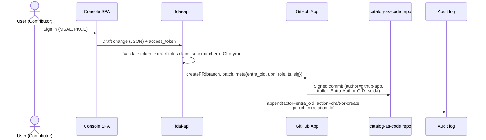
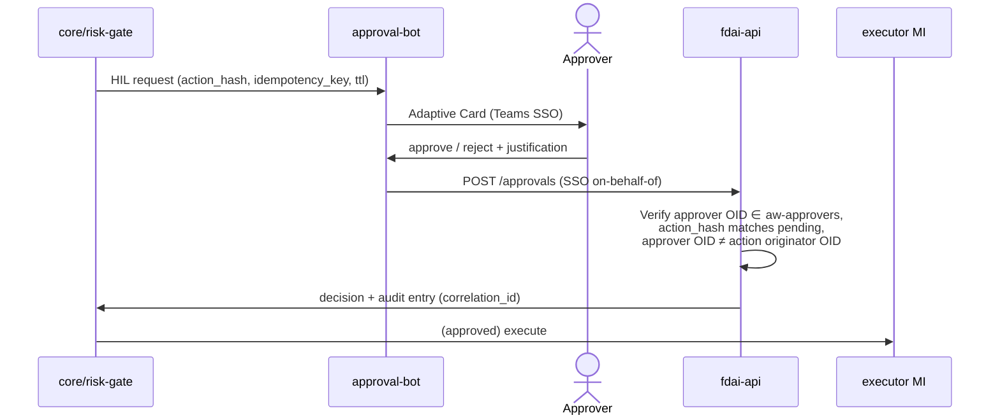

# 사용자 RBAC와 Entra 아이덴티티

**사람 사용자** 가 콘솔, ChatOps, catalog-as-code 저장소에서 어떻게 인증되고 인가되고
감사되는가. 이 문서는 사람 아이덴티티 모델의 진실 원본입니다; 비-사람 아이덴티티(executor
Managed Identity, GitHub App, Teams bot)는 여전히 [security-and-identity-ko.md](../architecture/security-and-identity-ko.md) 와
[deploy-and-onboard-ko.md](../deployment/deploy-and-onboard-ko.md) 가 관장.

*사람* 측면의 P0 blocker "최종 아이덴티티 매핑 (외부 IdP ↔ Entra ↔ Managed Identity)"
([security-and-identity-ko.md#open-decisions](../architecture/security-and-identity-ko.md#open-decisions))
을 해결; executor-측 매핑은 거기 선언된 대로 유지.

> RBAC(이 문서)은 *사람이 무엇을 조작할 수 있나*에 답한다. 별개의, 독립적으로 해석되는
> 축인 [agent-stewardship-and-handover-ko.md](agent-stewardship-and-handover-ko.md)는
> FDAI가 업무를 넘겨받은 지금 *15개 에이전트를 각각 누가 소유하나*(책임 + 에스컬레이션 +
> 인수인계)에 답한다. 한 사람이 보통 둘 다에 속하지만, steward라는 사실만으로는 RBAC
> capability가 부여되지 않는다.

> 고객-비종속: 아래 모든 그룹 이름, app registration 이름, GUID는 **placeholder** ;
> 포크가 config로 실제 값 공급
> ([generic-scope.instructions.md](../../../.github/instructions/generic-scope.instructions.md)).

## 1. 상기하는 설계 원칙

세 안전 원칙이 이 설계를 관장; 아래 모든 선택이 이들을 보존:

1. **자기승인 없음** - governance 변경 요청자(PR 저자, HIL 트리거)는 승인자가 되어선 안 됨.
   CI + GitHub CODEOWNERS로 강제, 롤 분리로 아님.
2. **승인 ≠ 실행** - 어떤 사람 롤도 executor Managed Identity를 보유하지 않음. 사람은 작성·
   리뷰·승인; MI가 실행.
3. **콘솔은 읽기 전용** - 콘솔은 절대 라이브 카탈로그를 변형하거나 액션을 실행하지 않음
   ([app-shape.instructions.md](../../../.github/instructions/app-shape.instructions.md)). 편집
   흐름은 콘솔 사용자를 대신해 GitHub App이 작성하는 draft PR.

## 2. 롤 모델 (4티어 + Break-Glass)

Azure RBAC(Reader / Contributor / Owner) 모델. 일상 4개 롤 + 하나의 분리된 break-glass
그룹. 롤은 **의도적으로 coarse-grained** - 차별화는 더 많은 롤 추가가 아니라 CI 검사,
CODEOWNERS 경로, 앱 레벨 정당화에서 옴.

| # | 롤 | Entra 보안 그룹 | 유사 | 가능 |
|---|-----|----------------|------|------|
| 1 | **Reader** | `aw-readers` | Azure Reader | 콘솔 조회: KPI 대시보드, 감사 로그, shadow 결과, HIL 큐 |
| 2 | **Contributor** | `aw-contributors` | Azure Contributor | Reader + 규칙, 룰셋, 할당, exemption, override 초안 PR 작성 |
| 3 | **Approver** | `aw-approvers` | (Reviewer) | Reader + governance PR 리뷰/승인 + 런타임 HIL 요청 승인 + enforce 승격 / exemption / override 승인 (고위험은 quorum - §5 참조) |
| 4 | **Owner** | `aw-owners` | Azure Owner | Approver + kill-switch 트리거 + Entra 그룹 멤버십 관리 + 인프라 IaC 적용 |
| - | **Break-Glass** | `aw-break-glass` | (뱄도 비상 계정) | 비상 스코프 부여, kill-switch override, 그리고 정규 Approver/Owner 가 부재 시 **time-boxed 비상 HIL 승인 자격** (paired-approver, no self-approval); 멤버십은 작은 전용 세트, 자격증명은 하드웨어 MFA로 봉인, 모든 사인인이 알림 발동 |

**티어 추가 없이 모델을 안전하게 유지하는 규칙**

- 사용자는 여러 그룹에 소속 가능(예: Contributor와 Approver 모두), 하지만 **자기승인 없음**
  CI 검사가 여전히 자신의 PR 승인을 블록. 검사는 그룹 멤버십이 아니라 PR 저자 trailer와
  리뷰어의 Entra OID를 비교.
- **Break-Glass는 Owner 안에 중첩되지 않음.** 별도 관리 그룹; Owner 계정도 `aw-break-glass`
  에 없으면 break-glass 액션을 authorize하지 않음. 이는 Owner 계정이 손상되어도 blast radius
  제한.
- **PIM은 선택**. 상류는 요구하지 않음. Entra ID P2 있는 포크는 just-in-time 활성화를 위해
  `aw-approvers` / `aw-owners` 위에 PIM을 얹을 수 있지만, 기본 모델은 P1에서 작동.

## 3. 페르소나 → 액션 매트릭스

| 액션 | Reader | Contributor | Approver | Owner | Break-Glass |
|------|:------:|:-----------:|:--------:|:-----:|:-----------:|
| 콘솔 조회 | ✓ | ✓ | ✓ | ✓ | ✓ |
| 규칙 / 룰셋 draft PR 작성 | | ✓ | ✓ | ✓ | |
| 할당 / exemption / override draft PR 작성 | | ✓ | ✓ | ✓ | |
| 표준 governance PR 리뷰 + 승인 | | | ✓ | ✓ | |
| `audit → deny / remediate` 승격 승인 (quorum) | | | ✓ | ✓ | |
| Exemption 승인 (time-boxed) | | | ✓ | ✓ | |
| Override 승인 (long-lived 가능) | | | ✓ | ✓ | |
| 런타임 HIL 요청 승인 | | | ✓ | ✓ | |
| 런타임 HIL 요청 승인 (비상, break-glass 활성, paired) | | | | | ✓ |
| 글로벌 kill-switch 트리거 | | | | ✓ | ✓ |
| 비상 스코프 접근 부여 | | | | | ✓ |
| `aw-*` 그룹 멤버십 관리 | | | | ✓ | |
| 인프라 IaC 적용 (deployer) | | | | ✓ | |
| Executor Managed Identity 보유 | (절대) - MI는 비-사람 |||||

## 4. Entra ID 아티팩트

### 4.1 App Registration

세 registration, 각각 자체 오디언스와 권한 표면. 분할이 SPA-발행 토큰이 backend 관리 스코프를
운반하는 것을 방지.

| App Registration | 타입 | 오디언스 | 노트 |
|------------------|------|---------|------|
| `fdai-console-spa` | SPA (PKCE, secret 없음) | `fdai-api` 스코프 요청 | 콘솔 사인인만 |
| `fdai-api` | Web API | `api://<guid>` | 콘솔 + ChatOps backend가 호출; **App Roles** (§4.4) 선언, 모든 요청의 `roles` claim 검증 |
| `fdai-approval-bot` | Bot (Azure Bot channel registration) | `fdai-api` on-behalf-of Teams SSO | Adaptive Card HIL 승인 |

Redirect URI, tenantId, clientId는 **fork-provided** 이며 config로 주입.

### 4.2 보안 그룹 (slots)

상류가 slot 정의; 포크가 Entra `objectId` 값 공급. 시작 config 검증이 필수 slot 누락 시
fail fast (deny-by-default).

```yaml
# shared/config schema (upstream slot definition)
rbac:
  entra:
    tenant_id: <fork-provided>
    groups:
      readers:       <objectId>   # required
      contributors:  <objectId>   # required
      approvers:     <objectId>   # required
      owners:        <objectId>   # required
      break_glass:   <objectId>   # required (may be an empty group but must exist)
```

그룹 명명(`aw-readers` 등) 은 권장 관례; 런타임에는 objectId만 소비됨.

### 4.3 Conditional Access

CA는 Entra ID P1에서 가능(P2 불필요). 그룹별 권장 정책:

| 대상 그룹 | 요건 |
|-----------|------|
| `aw-approvers`, `aw-owners` | **Phishing-resistant MFA** (FIDO2 / Windows Hello for Business / cert-based); text/phone OTP는 **거부** |
| `aw-owners` | 추가로 **compliant device** 또는 hybrid Entra-joined 요구 |
| `aw-break-glass` | Named-location 제한, 전용 하드웨어 토큰, 지속 사인인 알림 |
| 모든 `aw-*` 그룹 | 레거시 인증 프로토콜 블록 |

### 4.4 App Roles (토큰 표면)

API는 원시 그룹 claim이 아니라 **App Roles** 로 authorize. App Roles는 `fdai-api` app
registration에 선언되고 Enterprise Applications 뷰에서 `aw-*` 그룹에 할당; 사인인 사용자의
access token은 API가 직접 검증하는 `roles` claim(예: `"roles": ["Approver"]`)을 운반.

| App Role 값 | 할당 대상 (Entra 보안 그룹) |
|-------------|--------------------------|
| `Reader` | `aw-readers` |
| `Contributor` | `aw-contributors` |
| `Approver` | `aw-approvers` |
| `Owner` | `aw-owners` |
| `BreakGlass` | `aw-break-glass` |

원시 그룹 claim 대신 App Roles를 쓰는 이유:

- **테넌트 간 이식 가능.** App Role 값은 코드에 정의된 상수; 그룹 `objectId` 는 테넌트마다
  다름. 포크는 코드가 아니라 그룹 할당을 변경.
- **Groups-overage 실패 없음.** >200 그룹 소속 사용자는 기본으로 토큰에서 `groups` claim
  생략, Graph 조회 강제; `roles` claim은 영향 없음.
- **앱-스코프 최소권한.** App Roles는 `fdai-api` 에만 적용; 손상된 토큰의 blast
  radius를 넓히기 위해 다른 곳에서 재사용될 수 없음.

그룹 멤버십은 **관리 표면** 유지(Owners가 Entra Portal로 멤버 추가/제거); App Roles는 API가
보는 **토큰 표면**.

## 5. Governance 액션 강제 (CI + CODEOWNERS)

Coarse 롤은 PR과 API 레이어에서 **quorum + justification + 저자≠승인자** 검사로 안전하게
만들어짐:

### 5.1 CODEOWNERS (단일 승인자 그룹, 경로-기반 리뷰어 카운트)

```
# CODEOWNERS
rule-catalog/rules/**              @aw-approvers
rule-catalog/assignments/**        @aw-approvers
rule-catalog/exemptions/**         @aw-approvers
rule-catalog/overrides/**          @aw-approvers
```

모든 governance PR은 최소 하나의 `@aw-approvers` 리뷰어 필요. CI가 **diff 컨텐트** 에 기반해
그 요건을 올림:

| Diff 패턴 (CI 감지) | 필요 승인 (`@aw-approvers`) |
|--------------------|---------------------------|
| 규칙 텍스트 또는 룰셋 변경 | **1** |
| 할당 파라미터 변경 (effect 승격 없음) | **1** |
| 할당 `effect` 승격 `audit → deny / remediate` | **2 (quorum)** |
| Exemption 생성 / 갱신 | **2 (quorum)** |
| Override 생성 / 수정 | **2 (quorum)** |

Quorum-2는 "elevated approver" 그룹 도입 없이 구체화된 shadow→enforce 승격 게이트
([architecture.instructions.md](../../../.github/instructions/architecture.instructions.md)).

### 5.2 CI 검사 (상류 제공, 포크 설정)

- **저자-아님-승인자**: PR 저자의 Entra OID trailer(§6)와 모든 리뷰어의 Entra OID 파싱;
  어떤 리뷰어의 OID가 저자 OID와 같으면 실패.
- **저자-롤-검사**: PR 저자의 토큰(draft PR 생성 시 캡처)은 `Contributor` 또는 상위 롤
  (`Approver`, `Owner`)을 포함하는 `roles` claim을 운반해야 함. 롤은 draft-생성 시점에 PR
  trailer에 스탬프되어 CI가 리뷰 시점에 Entra를 재쿼리하지 않음.
- **Justification-존재**: 고위험 diff(위 quorum-2 행)의 경우 PR description은 `N` 문자 이상의
  `Justification:` 블록을 포함해야 함(`N` 은 설정됨).
- **서명 커밋 / 서명 trailer**: 리뷰어 승인은 특정 PR head 커밋에 바인딩; 승인 후 force-push는
  무효화하고 리뷰 재요청.

### 5.3 앱 레벨 정당화 (런타임 HIL)

런타임 HIL 승인(Adaptive Card) 은 승인 요청에 `justification` 필드 필요; API는 `""` / 누락
값을 `400` 으로 거부. 이는 PIM 활성화-사유의 등가물, 롤 활성화 시점이 아니라 결정 시점에 적용.

```jsonc
POST /api/v1/approvals
{
  "approval_id": "hil-2026-07-04-abc123",
  "decision": "approve",
  "justification": "verified rollback plan in runbook X; safe within maintenance window"
}
```

## 6. 아이덴티티 흐름: 콘솔 → Draft PR → 감사

콘솔은 쓰기를 **GitHub App** 에 위임하여 읽기 전용을 보존. 사용자의 Entra OID는 no-self-
approval과 감사 상관관계 검사를 위해 종단으로 보존.



- SPA는 절대 GitHub PAT를 보유하지 않음. 카탈로그로의 쓰기 접근은 GitHub App에만 속함.
- 커밋의 git author는 GitHub App; 사람 사용자의 Entra OID는 커밋 trailer
  (`Entra-Author-OID: <guid>`) 와 PR body에 동승. CI가 그 trailer를 파싱.
- 사용자의 Entra OID ↔ GitHub 로그인 매핑은 `shared/providers/` 인터페이스 뒤에 포크가 저장.
  매핑 부재 → API가 draft를 `403` 으로 거부.

## 7. ChatOps HIL 흐름

이것은 HIL 승인 hop의 아이덴티티 뷰. 그 뒤의 **채널 추상화** - 카테고리, 신뢰 티어, 벤더별
규칙, fallback 정책 - 는 [channels-and-notifications-ko.md](channels-and-notifications-ko.md)
에 있음.



- 승인은 **액션-바인딩**: 각 Adaptive Card는 pending 항목의 `idempotency_key` 와
  `action_hash` 를 운반; 다른 액션에 대한 재생은 API가 거부.
- 승인자-아님-발원자: 사람이 작성한 변경에 대응해 생성된 HIL 항목(드문 - 대부분은 리스크 게이트에서
  자율로) 의 경우, API는 발원 변경의 저자 OID와 매칭되는 승인자를 블록.

## 8. 감사 상관관계

Governance 결정은 네 시스템에 흔적을 남김. 각각 같은 `correlation_id` 를 운반하여 단일
결정을 종단으로 재구성 가능:

| 소스 | 기록 내용 |
|------|----------|
| Entra 사인인 로그 | 누가 사인인, MFA 방법, 디바이스, 위치 |
| `fdai-api` 액션 로그 | 어떤 API 호출, `justification`, `entra_oid`, `correlation_id` |
| GitHub PR 이벤트 | PR 저자 trailer, 리뷰어 승인, CI 검사 결과 |
| `core/audit` | 최종 결정, 티어, executor / 승인자 아이덴티티, idempotency 키 |

상관 ID는 흐름의 첫 사용자-개시 액션에서 `fdai-api` 가 생성하고 GitHub(PR body),
Adaptive Card, 코어 감사 writer로 전파.

## 9. 포크 vs 상류 분리

| 항목 | 상류 (이 리포) | 포크 |
|------|--------------|------|
| App registration manifest 템플릿 (스코프, redirect URI 스키마) | ✓ | tenantId, clientId 값 |
| Config 스키마의 Entra 보안 그룹 **slot** | ✓ | 각 slot의 objectId 값 |
| Conditional Access 정책 **요건** (문서화로) | ✓ | tenant-측 정책 생성 |
| CODEOWNERS 템플릿 | ✓ | GitHub 팀 이름 매핑 |
| `entra-oid ↔ github-login` 매핑 **인터페이스** (`shared/providers/`) | ✓ | 실제 매핑 데이터 |
| Justification 필드 + CI diff-risk 분류기 | ✓ | `N` (최소 길이) 튠, 경로 패턴 |
| Break-glass 알림 채널 | ✓ (인터페이스) | 실제 채널 바인딩 |

## 10. 사인인 흐름 참조

§6와 §7의 흐름 뒤 구체 프로토콜 세부사항. 모든 타이밍 값은 권장; 포크는 Conditional Access로
튠.

### 10.1 콘솔 (SPA) - OIDC + PKCE 있는 Authorization Code

- **라이브러리**: MSAL.js v3 (`@azure/msal-browser`). Implicit Flow 없음.
- **테넌트**: 포크당 single-tenant (`accountsInHomeTenantOnly`); guest 접근은 Entra B2B
  초대 통해(§10.5).
- **Redirect**: 콘솔은 anonymous 표면 없음. 로드 시 MSAL에 유효 세션이 없으면 즉시
  `/authorize` 로 리다이렉트.
- **토큰 저장**: access + id 토큰은 메모리 또는 `sessionStorage`(절대 `localStorage` 아님);
  refresh는 MSAL `acquireTokenSilent` 가 관리.
- **사인아웃**: `/logout?post_logout_redirect_uri=...` 이 콘솔 세션과 테넌트의 Entra 세션
  모두 클리어.

```mermaid
sequenceDiagram
  actor U as User
  participant SPA as Console SPA (MSAL)
  participant E as Entra ID
  participant API as fdai-api
  U->>SPA: navigate https://console.<fork>/
  SPA->>E: /authorize (client_id=spa, scope=api://<api>/access + openid,<br/>response_type=code, PKCE)
  E->>U: sign-in prompt
  U->>E: credentials
  E->>E: Conditional Access evaluate<br/>(approvers/owners → phishing-resistant MFA)
  E-->>U: MFA challenge (if triggered)
  U->>E: FIDO2 / WHfB response
  E->>SPA: /callback?code=...
  SPA->>E: /token (code + PKCE verifier)
  E->>SPA: id_token + access_token(aud=api://<api>) + refresh_token
  SPA->>API: GET /me + Authorization: Bearer <access_token>
  API->>API: verify signature (JWKS), aud, iss, exp;<br/>extract oid, upn, roles
  API->>SPA: {oid, upn, roles, correlation_id}
  SPA->>SPA: role-based UI render
```

### 10.2 API 토큰 검증

API는 다음처럼 모든 요청 검증(deny by default):

1. **서명** via Entra JWKS (`https://login.microsoftonline.com/<tenant>/discovery/v2.0/keys`).
2. **오디언스** 가 `api://<fdai-api-guid>` 와 같음.
3. **발급자** 가 포크의 tenant 발급자 URL과 같음.
4. **만료 안 됨** (`exp`) 과 **not-before 유효** (`nbf`).
5. **Roles claim 존재** - `roles` 가 비어 있으면 "administrator assignment required" body와
   함께 `403` 응답. `aw-readers` 로 **자동 프로비저닝 없음**; 명시적 할당이 유일한 진입 경로.
6. **안정 아이덴티티** 는 `oid` (Entra 사용자 objectId). `upn`/email은 정보성; 감사와
   자기승인 없음은 `oid` 사용.

1-4단계는 제네릭
[`EntraJwtVerifier`](../../../src/fdai/delivery/read_api/entra_verifier.py) (PyJWT +
`PyJWKClient`)가 upstream에서 구현; 5-6단계는
[`RoleResolver`](../../../src/fdai/core/rbac/resolver.py)가 구현. 이 verifier는
customer-agnostic - 포크는 값만 env로 공급:

| Env var | 필수 | 기본값 | 용도 |
|---------|:----:|--------|------|
| `FDAI_ENTRA_TENANT_ID` | yes | - | 포크의 단일 tenant; 발급자 + JWKS URI 파생. |
| `FDAI_API_AUDIENCE` | yes | - | `fdai-api` App ID URI (`api://<fdai-api-guid>`); 토큰 `aud` 가 이것과 같아야 함. |
| `FDAI_ENTRA_ISSUER` | no | `https://login.microsoftonline.com/<tenant>/v2.0` | v1-토큰 앱용 오버라이드 (`https://sts.windows.net/<tenant>/`). |
| `FDAI_ENTRA_JWKS_URI` | no | tenant의 `.../discovery/v2.0/keys` | 소버린 / 에어갭 클라우드용 오버라이드. |

JWKS는 지연 fetch 후 프로세스 내 캐시; 요청별 검증은 로컬 RSA 크립토라, 동기
`ClaimsVerifier` 계약이 이벤트 루프를 막지 않고 유지됨.

### 10.3 첫 사인인 (미할당 사용자)

유효한 Entra 자격증명 있지만 `aw-*` 그룹 멤버십 없는 사용자는 콘솔에 도달할 수 있지만 어떤
capability도 얻어선 안 됨:

- Entra 인증 성공, `roles` claim 비어 있음.
- API는 한 화면 메시지와 함께 `403` 반환: 그룹에 추가되려면 Owner에 연락.
- 미할당 사인인도 **`sign-in-denied`** 감사 엔트리(actor `oid`, 사유 `no-role`)를 쓰므로
  프로빙이 보임.

### 10.4 ChatOps (Teams) 사인인

Teams는 이미 인증된 Entra 세션 실행 중이므로 승인은 Teams SSO를 탐:

- Adaptive Card "Approve"/"Reject" 클릭은 Teams SSO 토큰과 함께 봇에 도달.
- 봇은 Teams 토큰을 `fdai-api` 오디언스 토큰으로 교환하는 **On-Behalf-Of (OBO)**
  플로우 실행.
- API 검증(§10.2)은 동일; `roles` claim은 `Approver` 또는 `Owner` 를 포함해야 함. 할당 없는
  첫 Teams 사용자는 같은 `403` 메시지.

### 10.5 Guest (Entra B2B) 사용자

외부 협업자는 **Entra B2B 초대** 로 온보딩, 포크 테넌트에 guest `oid` 생성. 권장 포크 정책:

- Guest는 `aw-readers` 에 추가될 수 있고 - justification과 함께 - `aw-contributors`.
- Guest는 `aw-approvers`, `aw-owners`, `aw-break-glass` 에 **추가되어선 안 됨**. 포크 부트스트랩
  검사가 그러한 할당을 거부(멤버십 sync 시점에 deny-by-default).
- Conditional Access 정책은 guest와 멤버에 균일 적용.

### 10.6 프로그래매틱 접근 (로컬 dev, CI)

사람 사용자는 절대 PAT나 장기 시크릿을 보유하지 않음:

- **로컬 콘솔 시드 harness**: `FDAI_READ_API_LOCAL_AZURE_CLI=1`은
  `az login --use-device-code`에서 선택한 대화형 사용자를 확인합니다. API는 활성 계정을
  검사하고, 안정적인 Entra `oid`를 얻는 데만 단기 ARM 토큰을 디코딩합니다. 토큰은 로컬
  API 프로세스 안에 유지되고 브라우저로 전달되지 않습니다. 투영된 principal은 고정된
  `Contributor` 개발 상한을 가지며 `RUNTIME_ENV`가 `staging` 또는 `prod`이면 차단됩니다.
- **직접 API 클라이언트**: 개발 테넌트의 전용 `fdai-api-dev` 오디언스로 범위가 지정된
  토큰을 요청합니다. 10.2절의 표준 서명, 오디언스, issuer, 만료, App Role 검사가 그대로
  적용됩니다.
- **CI**: workload identity federation (OIDC), [deployment-ko.md](../deployment/deployment-ko.md) 에서
  이미 필수. GitHub Actions와 Azure DevOps 모두 지원.
- **PAT는 금지**. CI의 secret scanning이 우발적 커밋 블록
  ([coding-conventions.instructions.md](../../../.github/instructions/coding-conventions.instructions.md)).

### 10.7 Break-Glass 사인인

- Break-glass는 **전용 계정** (사람의 개인 계정 아님), 물리적 보관하의 하드웨어 FIDO2 키로
  저장.
- 모든 사인인은 break-glass 알림 채널에 즉시 알림 발동, 상승된 감사 엔트리 씀.
- 계정은 `Owner` 와 `BreakGlass` App Role을 동시에 보유; 둘 다 kill-switch와 비상 부여에
  필요.
- Break-glass 자격증명 로테이션과 드릴 주기는
  [security-and-identity-ko.md](../architecture/security-and-identity-ko.md) 에 선언.

## 11. Open Decisions

- [ ] API가 `entra_oid ↔ github_login` 매핑을 감사와 같은 PostgreSQL(단일 저장소)에 저장할지
      별도의 포크 소유 아이덴티티 저장소에 저장할지.
- [ ] Diff-risk 티어별 정확한 `Justification` 최소 길이(현재 config-only).
- [ ] Owner가 Break-Glass 멤버도 될 수 있는지(기본: **아니오**; 포크 부트스트랩에서 CI로 강제).
- [ ] `aw-owners` 와 `aw-break-glass` 멤버십 로테이션 주기(수동 접근 리뷰 vs P2 Entra Access
      Reviews).
- [ ] 콘솔의 "draft change" UI가 P1(Change Safety만)에 실릴지 P3(3개 버티컬 모두)에 실릴지
      - [rule-governance-ko.md](../rules-and-detection/rule-governance-ko.md#open-decisions) 저작-UI 결정에 의존.
- [ ] Guest 사용자가 `Contributor` 로 할당될 수 있는지 아니면 `Reader` 전용에만 머물러야
      하는지(§10.5 기본은 justification과 함께 Contributor 허용).
- [ ] 콘솔 세션 최대 수명 값(Conditional Access 설정); 기본 권장: idle 8시간, 절대 24시간.
