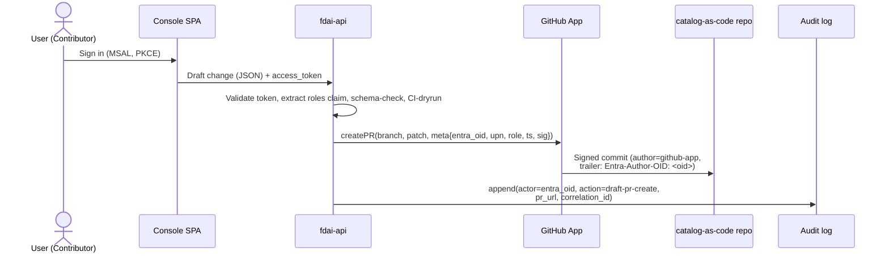
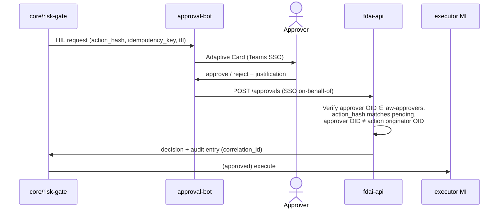

# 사용자 RBAC와 Entra 아이덴티티

**사람 사용자** 가 콘솔, ChatOps, catalog-as-code 저장소에서 어떻게 인증되고 인가되고
감사되는가. 이 문서는 사람 아이덴티티 모델의 진실 원본입니다; 비-사람 아이덴티티(실행기
Managed Identity, GitHub App, Teams bot)는 여전히 [security-and-identity-ko.md](../architecture/security-and-identity-ko.md) 와
[deploy-and-onboard-ko.md](../deployment/deploy-and-onboard-ko.md) 가 관장.

*사람* 측면의 P0 blocker "최종 아이덴티티 매핑 (외부 IdP ↔ Entra ↔ Managed Identity)"
([security-and-identity-ko.md#open-decisions](../architecture/security-and-identity-ko.md#open-decisions))
을 해결; executor-측 매핑은 거기 선언된 대로 유지.

> RBAC(이 문서)은 *사람이 무엇을 조작할 수 있나*에 답한다. 별개의, 독립적으로 해석되는
> 축인 [agent-stewardship-and-handover-ko.md](agent-stewardship-and-handover-ko.md)는
> FDAI가 업무를 넘겨받은 지금 *15개 에이전트를 각각 누가 소유하나*(책임 + 에스컬레이션 +
> 인수인계)에 답한다. 한 사람이 보통 둘 다에 속하지만, 담당자라는 사실만으로는 RBAC
> 기능이 부여되지 않는다.

> 고객-비종속: 아래 모든 그룹 이름, 앱 registration 이름, GUID는 **자리 표시자** ;
> 포크가 구성으로 실제 값 공급
> ([generic-scope.instructions.md](../../../.github/instructions/generic-scope.instructions.md)).

## 1. 상기하는 설계 원칙

세 안전 원칙이 이 설계를 관장; 아래 모든 선택이 이들을 보존:

1. **자기승인 없음** - 거버넌스 변경 요청자(PR 저자, HIL 트리거)는 승인자가 되어선 안 됨.
 CI + GitHub CODEOWNERS로 강제, 롤 분리로 아님.
2. **승인 ≠ 실행** - 사람은 작성, 검토, 승인하고 executor Managed Identity만 실행합니다.
3. **콘솔은 비특권 표면** - 범위가 제한된 요청을 제출할 수 있지만 executor identity를 받거나
  리소스를 변경하지 않습니다. 카탈로그 초안은 GitHub App PR을 사용합니다
  ([console-operations-ko.md](console-operations-ko.md)).

Operator Service는 token 검증과 server-owned App Role 해석 후에만 role을 serialize하며 browser payload는 이를 넓힐 수 없습니다. Core는 read 전에 principal-scoped purpose를 재검사하고 broker command identity는 executor 권한을 부여하지 않습니다.
계약은 ordinary role 4개와 고정된 topic만 허용하고 readiness에는 bridge worker 두 개가 모두 필요하며 transactional storage와 replay는 모든 projection을 request, principal, result digest에 bind합니다.

## 2. 롤 모델 (4티어 + Break-Glass)

Azure RBAC(읽기 담당 / 기여자 / Owner) 모델. 일상 4개 롤 + 하나의 분리된 break-glass
그룹. 롤은 **의도적으로 coarse-grained** - 차별화는 더 많은 롤 추가가 아니라 CI 검사,
CODEOWNERS 경로, 앱 레벨 정당화에서 옴.

| # | 롤 | Entra 보안 그룹 | 유사 | 가능 |
|---|-----|----------------|------|------|
| 1 | **읽기 담당** | `aw-readers` | Azure 읽기 담당 | 콘솔 조회: KPI 대시보드, 감사 로그, shadow 결과, HIL 큐 |
| 2 | **기여자** | `aw-contributors` | Azure 기여자 | 읽기 담당 + 초안 PR 작성 및 범위가 제한된 읽기 조사 시작 |
| 3 | **Approver** | `aw-approvers` | (검토자) | 읽기 담당 + 거버넌스 PR 리뷰/승인 + 런타임 HIL 요청 승인 + enforce 승격 / exemption / 재정의 승인 (고위험은 quorum - §5 참조) |
| 4 | **Owner** | `aw-owners` | Azure Owner | Approver + 비상 정지 트리거 + Entra 그룹 멤버십 관리 + 인프라 IaC 적용 |
| - | **Break-Glass** | `aw-break-glass` | (별도 비상 계정) | Console 조회, 비상 정지, 비상 접근 권한 부여 기능만 가집니다. 런타임 HIL 승인 기능은 없으며 Owner의 superset이 아닙니다. |

**티어 추가 없이 모델을 안전하게 유지하는 규칙**

- 사용자는 여러 그룹에 소속 가능(예: 기여자와 Approver 모두), 하지만 **자기승인 없음**
 CI 검사가 여전히 자신의 PR 승인을 블록. 검사는 그룹 멤버십이 아니라 PR 저자 trailer와
 리뷰어의 Entra OID를 비교.
- **Break-Glass는 Owner 안에 중첩되지 않음.** 별도 관리 그룹; Owner 계정도 `aw-break-glass`
 에 없으면 break-glass 액션을 authorize하지 않음. 이는 Owner 계정이 손상되어도 영향 범위
 제한.
- **활성화 시 검증된 자격을 보존합니다.** 토큰 확인 과정은 유효 역할에서 `BreakGlass`를
 제거하지만 별도의 자격 플래그를 유지합니다. 시간 제한 활성화는 긴급 역할을 추가하기 전에
 이 플래그를 확인합니다.
- **현재 activation 경계.** `RoleResolver.activate_break_glass`는 인시던트 id와 future 만료를
 검증하는 pure activation 기본 요소입니다. 운영 API에는 이를 호출하는 엔드포인트, persistent
 activation 저장소, TTL 적용 조립이 아직 없습니다. 따라서 토큰의 BreakGlass 점유만으로
 런타임 principal이 elevation되지 않으며, HIL 승인 충족 여부도 생기지 않습니다.
- **PIM은 선택**. 상류는 요구하지 않음. Entra ID P2 있는 포크는 just-in-time 활성화를 위해
 `aw-approvers` / `aw-owners` 위에 PIM을 얹을 수 있지만, 기본 모델은 P1에서 작동.

## 3. 페르소나 → 액션 매트릭스

| 액션 | 읽기 담당 | 기여자 | Approver | Owner | Break-Glass |
|------|:------:|:-----------:|:--------:|:-----:|:-----------:|
| 콘솔 조회 | ✓ | ✓ | ✓ | ✓ | ✓ |
| 범위가 제한된 읽기 조사 시작 | | ✓ | ✓ | ✓ | |
| 규칙 / 룰셋 초안 PR 작성 | | ✓ | ✓ | ✓ | |
| 할당 / exemption / 재정의 초안 PR 작성 | | ✓ | ✓ | ✓ | |
| 표준 거버넌스 PR 리뷰 + 승인 | | | ✓ | ✓ | |
| `audit → deny / remediate` 승격 승인 (quorum) | | | ✓ | ✓ | |
| Exemption 승인 (time-boxed) | | | ✓ | ✓ | |
| 재정의 승인 (수명이 긴 가능) | | | ✓ | ✓ | |
| 런타임 HIL 요청 승인 | | | ✓ | ✓ | |
| 런타임 HIL 요청 승인 (비상) | | | | | |
| 글로벌 비상 정지 트리거 | | | | ✓ | ✓ |
| 비상 스코프 접근 부여 | | | | | ✓ |
| 제한된 런타임 설정 관리 | | | | ✓ | |
| `aw-*` 그룹 멤버십 관리 | | | | ✓ | |
| 인프라 IaC 적용 (deployer) | | | | ✓ | |
| 실행기 Managed Identity 보유 | (절대) - MI는 비-사람 |||||

운영 API는 영속 명령 서비스가 연결된 경우에만 `POST /system/kill-switch`를
노출합니다. Owner 또는 externally activated BreakGlass 역할은 기능 검사를 통과하지만,
현재 운영 auth 조립에는 BreakGlass activation 경로가 없으므로 일반 토큰 해석에서
도달 가능한 emergency 호출자는 Owner입니다. 읽기 담당, 기여자, Approver는 호출할 수 없습니다.
이 엔드포인트는 콘솔 버튼이 아니며 실행기 신원을 사용하지 않고 개정 번호 상태 변경과
감사 항목을 원자적으로 기록합니다.

## 4. Entra ID 아티팩트

### 4.1 목표 App Registration

세 registration, 각각 자체 오디언스와 권한 표면. 분할이 SPA-발행 토큰이 백엔드 관리 스코프를
운반하는 것을 방지.

> 저장소는 제공된 테넌트, 대상, 클라이언트 및 역할/그룹 값을 소비합니다. 현재 Terraform은
> 이 registration이나 App 역할 배정을 프로비저닝하지 않습니다.

| App Registration | 타입 | 오디언스 | 노트 |
|------------------|------|---------|------|
| `fdai-console-spa` | SPA (PKCE, 시크릿 없음) | `fdai-api` 스코프 요청 | 콘솔 사인인만 |
| `fdai-api` | Web API | `api://<guid>` | 콘솔 + ChatOps 백엔드가 호출; **App Roles** (§4.4) 선언, 모든 요청의 `roles` 점유 검증 |
| `fdai-approval-bot` | Bot (Azure Bot 채널 registration) | `fdai-api` on-behalf-of Teams SSO | Adaptive 카드 HIL 승인 |

Redirect URI, tenantId, clientId는 **fork-provided** 이며 구성으로 주입.

### 4.2 보안 그룹 (slots)

상류가 slot 정의; 포크가 Entra `objectId` 값 공급. 시작 구성 검증이 필수 slot 누락 시
fail fast (deny-by-default).

```yaml
# shared/config schema (upstream slot definition)
rbac:
 entra:
 tenant_id: <fork-provided>
 groups:
  readers:  <objectId> # required
  contributors: <objectId> # required
  approvers:  <objectId> # required
  owners:  <objectId> # required
  break_glass: <objectId> # required (may be an empty group but must exist)
```

그룹 명명(`aw-readers` 등) 은 권장 관례; 런타임에는 objectId만 소비됨.

### 4.3 Conditional 접근

CA는 Entra ID P1에서 가능(P2 불필요). 그룹별 권장 정책:

| 대상 그룹 | 요건 |
|-----------|------|
| `aw-approvers`, `aw-owners` | **Phishing-resistant MFA** (FIDO2 / Windows Hello for Business / cert-based); 텍스트/phone OTP는 **거부** |
| `aw-owners` | 추가로 **compliant device** 또는 hybrid Entra-joined 요구 |
| `aw-break-glass` | Named-location 제한, 전용 하드웨어 토큰, 지속 사인인 알림 |
| 모든 `aw-*` 그룹 | 레거시 인증 프로토콜 블록 |

### 4.4 App Roles (토큰 표면)

API는 **App Roles를 정본 토큰 표면으로 우선 사용**합니다. App Roles는 `fdai-api` 앱
registration에 선언되고 Enterprise Applications 뷰에서 `aw-*` 그룹에 할당되며 접근 토큰의
`roles` 점유로 전달됩니다. 이행 compatibility를 위해 `roles`가 비어 있고 inline `groups`
점유가 사용 가능한 경우 `RoleResolver`는 구성된 objectId 대응을 대체 경로로 사용합니다.
Group-overage 토큰에는 이 대체 경로가 불가능하므로 FDAI App 역할이 반드시 필요합니다.

| App 역할 값 | 할당 대상 (Entra 보안 그룹) |
|-------------|--------------------------|
| `Reader` | `aw-readers` |
| `Contributor` | `aw-contributors` |
| `Approver` | `aw-approvers` |
| `Owner` | `aw-owners` |
| `BreakGlass` | `aw-break-glass` |

App Roles를 정본 표면으로 쓰는 이유:

- **테넌트 간 이식 가능.** App 역할 값은 코드에 정의된 상수; 그룹 `objectId` 는 테넌트마다
 다름. 포크는 코드가 아니라 그룹 할당을 변경.
- **Groups-overage 실패 없음.** 200개가 넘는 그룹에 속한 사용자의 토큰은 기본으로
 `groups` 점유를 생략하지만 `roles` 점유는 영향을 받지 않습니다. Overage 토큰에 FDAI
 App 역할이 없으면 API는 principal을 조용히 미할당 처리하지 않고 구성 오류로 실패 시 차단합니다.
- **앱-스코프 최소권한.** App Roles는 `fdai-api` 에만 적용; 손상된 토큰의 영향
 radius를 넓히기 위해 다른 곳에서 재사용될 수 없음.

그룹 멤버십은 **관리 표면** 유지(Owners가 Entra Portal로 멤버 추가/제거); App Roles는 API가
보는 **토큰 표면**.

## 5. 거버넌스 액션 강제 (CI + CODEOWNERS)

Coarse 롤은 PR과 API 레이어에서 **quorum + justification + 저자≠승인자** 검사로 안전하게
만들어짐:

> **구현 상태**: 런타임에는 기능 검사, `RoleEnforcer.no_self_approval`, risk-gate quorum이
> 구현되어 있습니다. 아래 PR trailer, diff-risk, 검토자 OID, justification 검사는 목표 CI
> 계약이며 현재 `.github/workflows/`에는 구현되어 있지 않습니다. 현재 `.github/CODEOWNERS`는
> exemption, risk 분류 및 framework 표면을 upstream 소유자에게 라우팅하지만 아래
> `@aw-approvers` 템플릿 전체를 구현하지 않습니다.

### 5.1 목표 CODEOWNERS (단일 승인자 그룹, 경로-기반 리뷰어 카운트)

```
# CODEOWNERS
rule-catalog/rules/**    @aw-approvers
rule-catalog/assignments/**  @aw-approvers
rule-catalog/exemptions/**   @aw-approvers
rule-catalog/overrides/**   @aw-approvers
```

모든 거버넌스 PR은 최소 하나의 `@aw-approvers` 리뷰어 필요. CI가 **diff 컨텐트** 에 기반해
그 요건을 올림:

| Diff 패턴 (CI 감지) | 필요 승인 (`@aw-approvers`) |
|--------------------|---------------------------|
| 규칙 텍스트 또는 룰셋 변경 | **1** |
| 할당 파라미터 변경 (효과 승격 없음) | **1** |
| 할당 `effect` 승격 `audit → deny / remediate` | **2 (quorum)** |
| Exemption 생성 / 갱신 | **2 (quorum)** |
| 재정의 생성 / 수정 | **2 (quorum)** |

Quorum-2는 "elevated 승인자" 그룹 도입 없이 구체화된 shadow→enforce 승격 게이트
([architecture.instructions.md](../../../.github/instructions/architecture.instructions.md)).

### 5.2 목표 CI 검사 (상류 제공, 포크 설정)

- **저자-아님-승인자**: PR 저자의 Entra OID trailer(§6)와 모든 리뷰어의 Entra OID 파싱;
 어떤 리뷰어의 OID가 저자 OID와 같으면 실패.
- **저자-롤-검사**: PR 저자의 토큰(초안 PR 생성 시 캡처)은 `Contributor` 또는 상위 롤
 (`Approver`, `Owner`)을 포함하는 `roles` 점유를 운반해야 함. 롤은 draft-생성 시점에 PR
 trailer에 스탬프되어 CI가 리뷰 시점에 Entra를 재쿼리하지 않음.
- **Justification-존재**: 고위험 diff(위 quorum-2 행)의 경우 PR description은 `N` 문자 이상의
 `Justification:` 블록을 포함해야 함(`N` 은 설정됨).
- **서명 커밋 / 서명 trailer**: 리뷰어 승인은 특정 PR head 커밋에 바인딩; 승인 후 force-push는
 무효화하고 리뷰 재요청.

### 5.3 앱 레벨 정당화 (런타임 사람 승인)

목표 Adaptive 카드 승인 계약은 `justification` 필드를 필수로 하고 `""` / 누락 값을 `400`으로
거부합니다. 현재 HMAC 콜백은 `justification`을 문자열로 검증하지만 빈 문자열을 허용합니다.
현재 강제되는 경계는 콜백 서명과 재생 구간, no-self-approval, 선택적 signed
`actor_roles` 기능, 레지스트리/조정기의 타입이 지정된 결정입니다.

```jsonc
POST /hil/{approval_id}/decision
{
 "approval_id": "hil-2026-07-04-abc123",
 "decision": "approve",
 "actor_oid": "approver-oid",
 "justification": "verified rollback plan in runbook X; safe within maintenance window"
}
```

## 6. 목표 아이덴티티 흐름: 콘솔 → 초안 PR → 감사

목표 흐름은 저장소 쓰기를 **GitHub App** 에 위임하여 콘솔의 비특권 경계를 보존하고 사용자의
Entra OID를 no-self-approval과 감사 상관관계 검사까지 전달합니다. 현재 `GitOpsPrAdapter`는 실행기가
생성한 교정 초안 PR을 게시하지만, 콘솔 draft-governance 엔드포인트, Entra OID trailer,
사람 OID와 GitHub 로그인 매핑 저장소는 구현되어 있지 않습니다.


```mermaid
sequenceDiagram
 actor U as User (Contributor)
 participant SPA as Console SPA
 participant API as fdai-api
 participant GHA as GitHub App
 participant REPO as catalog-as-code repo
 participant AUD as Audit log
 U->>SPA: Sign in (MSAL, PKCE)
 SPA->>API: Draft change (JSON) + access_token
 API->>API: Validate token, extract roles claim, schema-check, CI-dryrun
 API->>GHA: createPR(branch, patch, meta{entra_oid, upn, role, ts, sig})
 GHA->>REPO: Signed commit (author=github-app,<br/>trailer: Entra-Author-OID: <oid>)
 API->>AUD: append(actor=entra_oid, action=draft-pr-create,<br/>pr_url, correlation_id)
```

- SPA는 절대 GitHub PAT를 보유하지 않음. 카탈로그로의 쓰기 접근은 GitHub App에만 속함.
- 커밋의 git 작성자는 GitHub App; 사람 사용자의 Entra OID는 커밋 trailer
 (`Entra-Author-OID: <guid>`) 와 PR 본문에 동승. CI가 그 trailer를 파싱.
- 사용자의 Entra OID ↔ GitHub 로그인 매핑은 `shared/providers/` 인터페이스 뒤에 포크가 저장.
 매핑 부재 → API가 초안을 `403` 으로 거부.

## 7. ChatOps 사람 승인 흐름

이것은 HIL 승인 홉의 아이덴티티 뷰. 그 뒤의 **채널 추상화** - 카테고리, 신뢰 티어, 벤더별
규칙, 대체 경로 정책 - 는 [channels-and-notifications-ko.md](channels-and-notifications-ko.md)
에 있음.

> **현재 경계**: Teams 대화 유입은 Bot Framework JWT와 same-tenant principal
> 연결을 검증합니다. 런타임 HIL 결정은 선택적으로 등록되는 HMAC-signed
> `POST /hil/{approval_id}/decision` 콜백이 레지스트리 또는 `HilResumeCoordinator`에 타입이 지정된
> 결정을 전달합니다. 아래 Teams SSO OBO 교환과 App 역할을 포함한 사용자 콜백은 목표
> 흐름이며 아직 구현되어 있지 않습니다.


```mermaid
sequenceDiagram
 participant CORE as core/risk-gate
 participant BOT as approval-bot
 actor A as Approver
 participant API as fdai-api
 participant EX as executor MI
 CORE->>BOT: HIL request (action_hash, idempotency_key, ttl)
 BOT->>A: Adaptive Card (Teams SSO)
 A->>BOT: approve / reject + justification
 BOT->>API: POST /approvals (SSO on-behalf-of)
 API->>API: Verify approver OID ∈ aw-approvers,<br/>action_hash matches pending,<br/>approver OID ≠ action originator OID
 API->>CORE: decision + audit entry (correlation_id)
 CORE->>EX: (approved) execute
```

- 현재 콜백은 시각, URL `approval_id`, 본문을 HMAC에 바인딩합니다. 레지스트리 또는 parked
 조정기는 이 식별자를 pending 항목과 대조하고 멱등적 최종 결정을 강제합니다.
- No-self-approval은 signed 콜백 행위자 OID와 pending 항목의 submitter OID를 비교합니다. 향후
 사람이 작성한 거버넌스 PR에서 이 신원을 종단으로 전달하는 것은 목표 흐름에 남아 있습니다.

## 8. 감사 상관관계

목표 거버넌스 흐름은 네 시스템에 같은 `correlation_id`를 남겨 단일 결정을 종단으로
재구성합니다. 현재 타입이 지정된 HIL 및 IAM 경로는 자체 state-and-audit 상관관계를 기록하지만 Entra
사인인, GitHub PR, Teams OBO 및 코어 감사를 하나로 잇는 흐름은 구현되어 있지 않습니다.

| 소스 | 기록 내용 |
|------|----------|
| Entra 사인인 로그 | 누가 사인인, MFA 방법, 디바이스, 위치 |
| `fdai-api` 액션 로그 | 어떤 API 호출, `justification`, `entra_oid`, `correlation_id` |
| GitHub PR 이벤트 | PR 저자 trailer, 리뷰어 승인, CI 검사 결과 |
| `core/audit` | 최종 결정, 티어, 실행기 / 승인자 아이덴티티, 멱등성 키 |

상관 ID는 흐름의 첫 사용자-개시 액션에서 `fdai-api` 가 생성하고 GitHub(PR 본문),
Adaptive 카드, 코어 감사 쓰기 담당으로 전파.

## 9. 포크 vs 상류 분리

아래 표는 목표 소유권 분리입니다. 현재 상류에는 역할/기능, Entra 검증기와 해석기,
RBAC 그룹 slot, IAM 요청/디렉터리 계약, 교정 PR 어댑터가 있습니다. App registration
매니페스트 템플릿, 사람 OID와 GitHub 로그인 대응 프로바이더 및 거버넌스 PR CI는 아직 없습니다.

| 항목 | 상류 (이 리포) | 포크 |
|------|--------------|------|
| App registration 매니페스트 템플릿 (스코프, redirect URI 스키마) | ✓ | tenantId, clientId 값 |
| 구성 스키마의 Entra 보안 그룹 **slot** | ✓ | 각 slot의 objectId 값 |
| Conditional 접근 정책 **요건** (문서화로) | ✓ | tenant-측 정책 생성 |
| CODEOWNERS 템플릿 | ✓ | GitHub 팀 이름 매핑 |
| `entra-oid ↔ github-login` 매핑 **인터페이스** (`shared/providers/`) | ✓ | 실제 매핑 데이터 |
| Justification 필드 + CI diff-risk 분류기 | ✓ | `N` (최소 길이) 튠, 경로 패턴 |
| Break-glass 알림 채널 | ✓ (인터페이스) | 실제 채널 바인딩 |

## 10. 사인인 흐름 참조

§6와 §7의 흐름 뒤 구체 프로토콜 세부사항. 모든 타이밍 값은 권장; 포크는 Conditional 접근으로
튠.

### 10.1 콘솔 (SPA) - OIDC + PKCE 있는 권한 확인 코드

- **라이브러리**: MSAL.js v3 (`@azure/msal-browser`). 암묵적 흐름 없음.
- **테넌트**: 포크당 single-tenant (`accountsInHomeTenantOnly`); 게스트 접근은 Entra B2B
 초대 통해(§10.5).
- **Redirect**: 콘솔은 anonymous 표면 없음. 로드 시 MSAL에 유효 세션이 없으면 즉시
 `/authorize` 로 리다이렉트.
- **토큰 저장**: 접근 + id 토큰은 메모리 또는 `sessionStorage`(절대 `localStorage` 아님);
 refresh는 MSAL `acquireTokenSilent` 가 관리.
- **자동 토큰 시간 제한**: 콘솔은 기본적으로 `acquireTokenSilent`를 최대 10초 동안
 기다립니다. 토큰 획득이 멈추면 현재 패널을 계속 로드 상태로 두지 않고 재시도 작업이 있는
 인증 오류를 표시합니다. 포크의 아이덴티티 정책에 다른 제한 시간이 필요한 경우
 `VITE_AUTH_TOKEN_TIMEOUT_MS`를 양의 정수로 설정할 수 있습니다.
- **만료된 API 세션**: 구성된 읽기 또는 인제스트 API가 `401`을 반환하면 현재 데이터 표면을
 닫고 전체 화면 sign-in 복구 화면으로 전환합니다. Standard 읽기, 인증된 bridge-owned chat 상태, chat, 작업 흐름, 명령,
 SSE 스트림에 동일하게 적용합니다. 신원 프로바이더 요청과 `403` 접근 결정은 이 전환을
 시작하지 않습니다. 하나의 shared fetch 관찰기가 overlapping 소유자, 멱등적 정리 및 다른
 소유자가 global fetch 함수를 교체한 뒤의 재설치를 지원하며, 정리는 해당 replacement를
 덮어쓰지 않습니다.
- **사인아웃**: `/logout?post_logout_redirect_uri=...` 이 콘솔 세션과 테넌트의 Entra 세션
 모두 클리어.

> **로컬 개발**: 로컬 로그인 선택기에서 dev bypass를 제공할 때 콘솔은 먼저 토큰 없이
> 코어 읽기 엔드포인트를 호출합니다. 이 탐색이 성공한 경우에만 현재 세션의 bypass를
> 저장합니다. `401` 또는 `403`이면 선택기를 유지하고 운영자에게 Entra 로그인을 안내하므로,
> 인증을 강제하는 로컬 API에 깨진 anonymous 세션으로 진입하지 않습니다.

```mermaid
sequenceDiagram
 actor U as User
 participant SPA as Console SPA (MSAL)
 participant E as Entra ID
 participant API as fdai-api
 U->>SPA: navigate https://console.<fork>/
 SPA->>E: /authorize (client_id=spa, scope=api://<api>/access + openid,<br/>response_type=code, PKCE)
 E->>U: sign-in prompt
 U->>E: credentials
 E->>E: Conditional Access evaluate<br/>(approvers/owners → phishing-resistant MFA)
 E-->>U: MFA challenge (if triggered)
 U->>E: FIDO2 / WHfB response
 E->>SPA: /callback?code=...
 SPA->>E: /token (code + PKCE verifier)
 E->>SPA: id_token + access_token(aud=api://<api>) + refresh_token
 SPA->>API: GET /me + Authorization: Bearer <access_token>
 API->>API: verify signature (JWKS), aud, iss, exp;<br/>extract oid, upn, roles
 API->>SPA: {oid, upn, roles, correlation_id}
 SPA->>SPA: role-based UI render
```

### 10.2 API 토큰 검증

API는 다음처럼 모든 요청 검증(거부 by 기본값):

1. **서명** via Entra JWKS (`https://login.microsoftonline.com/<tenant>/discovery/v2.0/keys`).
2. **오디언스** 가 `api://<fdai-api-guid>` 와 같음.
3. **발급자** 가 포크의 테넌트 발급자 URL과 같음.
4. **만료 안 됨** (`exp`) 과 **not-before 유효** (`nbf`).
5. **역할 해석** - `roles` App 역할을 먼저 사용합니다. 이 점유가 비어 있고 inline `groups`
 점유를 사용할 수 있으면 구성된 objectId 대응으로 대체 경로합니다. Group-overage 토큰에
 App 역할이 없으면 실패 시 차단합니다. 어떤 known 역할도 해석되지 않으면 protected 엔드포인트는
 `403`을 반환합니다. `aw-readers`로 자동 프로비저닝하지 않습니다.
6. **안정 아이덴티티** 는 `oid` (Entra 사용자 objectId). `upn`/이메일은 정보성; 감사와
 자기승인 없음은 `oid` 사용.

1-4단계는 제네릭
[`EntraJwtVerifier`](../../../services/operator-service/src/fdai_operator_service/auth.py) (PyJWT +
`PyJWKClient`)가 upstream에서 구현; 5-6단계는
[`RoleResolver`](../../../services/core-control-plane/src/fdai/core/rbac/resolver.py)가 구현. 이 검증기는
customer-agnostic - 포크는 값만 env로 공급:

| Env var | 필수 | 기본값 | 용도 |
|---------|:----:|--------|------|
| `FDAI_ENTRA_TENANT_ID` | yes | - | 포크의 단일 테넌트; 발급자 + JWKS URI 파생. |
| `FDAI_API_AUDIENCE` | yes | - | `fdai-api` App ID URI (`api://<fdai-api-guid>`); 토큰 `aud` 가 이것과 같아야 함. |
| `FDAI_ENTRA_ISSUER` | no | `https://login.microsoftonline.com/<tenant>/v2.0` | v1-토큰 앱용 오버라이드 (`https://sts.windows.net/<tenant>/`). |
| `FDAI_ENTRA_JWKS_URI` | no | 테넌트의 `.../discovery/v2.0/keys` | 소버린 / 에어갭 클라우드용 오버라이드. |

JWKS는 지연 fetch 후 프로세스 내 캐시; 요청별 검증은 로컬 RSA 크립토라, 동기
`ClaimsVerifier` 계약이 이벤트 루프를 막지 않고 유지됨.

### 10.3 첫 사인인 (미할당 사용자)

유효한 Entra 자격증명 있지만 `aw-*` 그룹 멤버십 없는 사용자는 콘솔에 도달할 수 있지만 어떤
기능도 얻어선 안 됨:

- Entra 인증 성공, `roles` 점유 비어 있음.
- API는 한 화면 메시지와 함께 `403` 반환: 그룹에 추가되려면 Owner에 연락.
- 역할이 필요한 엔드포인트는 `403`을 반환하고, role-optional `GET /iam/self`는 접근 필수
 화면에 필요한 self-service 변환 결과를 제공합니다. 전용 `sign-in-denied` 감사 이벤트는
 아직 구현되어 있지 않습니다.

### 10.4 ChatOps (Teams) 사인인

Teams SSO OBO 승인에 대한 목표 계약은 다음과 같습니다:

- Adaptive 카드 "Approve"/"거부" 클릭은 Teams SSO 토큰과 함께 봇에 도달.
- 봇은 Teams 토큰을 `fdai-api` 오디언스 토큰으로 교환하는 **On-Behalf-Of (OBO)**
 플로우 실행.
- API 검증(§10.2)은 동일; `roles` 점유는 `Approver` 또는 `Owner` 를 포함해야 함. 할당 없는
 첫 Teams 사용자는 같은 `403` 메시지.

### 10.5 게스트 (Entra B2B) 사용자

외부 협업자는 **Entra B2B 초대** 로 온보딩, 포크 테넌트에 게스트 `oid` 생성. 권장 포크 정책:

- 게스트는 `aw-readers` 에 추가될 수 있고 - justification과 함께 - `aw-contributors`.
- 게스트를 `aw-approvers`, `aw-owners`, `aw-break-glass`에 추가하지 않는 것이 좋습니다. 저장소는
 현재 이 사람 역할 정책을 검사하는 초기화 구성원 검사를 제공하지 않으므로 포크의 Entra
 관리 프로세스에서 강제해야 합니다.
- Conditional 접근 정책은 게스트와 멤버에 균일 적용.

### 10.6 프로그래매틱 접근 (로컬 dev, CI)

사람 사용자는 절대 PAT나 장기 시크릿을 보유하지 않음:

- **Azure-backed 로컬 콘솔**: `FDAI_OPERATOR_API_LOCAL_ENTRA=1`이 정본 interactive 개발
 모드입니다. 브라우저는 Entra로 로그인하고 API는 운영과 동일하게 JWT 서명, 발급자,
 대상, lifetime, App 역할을 검증합니다. 서버의 Azure CLI 세션은 Microsoft Graph, Azure
 Resource Graph 및 로컬 Azure OpenAI 서술 같은 Azure 어댑터에만 단기 토큰을 제공하며 브라우저
 principal을 대체하지 않습니다. Event Hubs 토큰 refresh는 변경 가능한 Azure CLI 기본값 계정이 아니라
 준비된 런타임 테넌트와 구독에 고정됩니다. App 역할이 없는 principal에는 접근 요청 페이지가 표시되고,
 bearer 토큰이 없으면 실패 시 차단합니다. Full-stack 준비 단계는 두 개의 고정 loopback 출처를
 구성된 SPA 등록에 안전하게 재시도할 수 있는 방식으로 동기화합니다. 테넌트가 다르거나 Graph
 권한이 부족하면 sign-in 후 redirect가 깨진 상태로 남지 않도록 시작을 중단합니다.
- **CLI principal 대안**: 브라우저 로그인이 필요하지 않을 때
 `FDAI_OPERATOR_API_LOCAL_AZURE_CLI=1`과 `VITE_LOCAL_AZURE_CLI_AUTH=1`은 현재 CLI 사용자를 고정된
 로컬 역할 상한으로 변환 결과합니다. 이는 명시적 대안이며 정본 full-stack 프로파일이
 아닙니다.
- **Synthetic 고정본**: 익명 권한 부여, static 사용자, 시드 감사 기록 및 시나리오 재생은
 pytest의 `app(test_fixtures=True)`에서만 사용할 수 있습니다. Interactive 개발 데이터 원본이
 아닙니다.
- **직접 API 클라이언트**: 개발 테넌트의 전용 `fdai-api-dev` 오디언스로 범위가 지정된
 토큰을 요청합니다. 10.2절의 표준 서명, 오디언스, 발급자, 만료, App 역할 검사가 그대로
 적용됩니다.
- **CI**: 워크로드 신원 federation (OIDC), [deployment-ko.md](../deployment/deployment-ko.md) 에서
 이미 필수. GitHub Actions와 Azure DevOps 모두 지원.
- **PAT는 금지**. CI의 시크릿 검사가 우발적 커밋 블록
 ([coding-conventions.instructions.md](../../../.github/instructions/coding-conventions.instructions.md)).

### 10.7 Break-Glass 사인인

- Break-glass는 **전용 계정** (사람의 개인 계정 아님), 물리적 보관하의 하드웨어 FIDO2 키로
 저장.
- 모든 사인인에 대한 break-glass 알림과 상승된 감사 기록은 배포 운영 계약입니다. 현재
 운영 API에는 activation 엔드포인트, persistent activation 저장소 또는 알림 조립이
 없습니다.
- `BreakGlass` 권한은 `RoleResolver.activate_break_glass`로 별도 활성화되어야 합니다.
 활성화된 `BreakGlass`만으로 비상 정지와 비상 접근 권한 부여 기능을 가질 수 있으며
 `Owner`와 `BreakGlass`를 동시에 요구하지 않습니다.
- Break-glass 자격증명 로테이션과 드릴 주기는
 [security-and-identity-ko.md](../architecture/security-and-identity-ko.md) 에 선언.

## 11. 콘솔 설정 및 액세스 요청

Settings 활동 bar 그룹은 콘솔의 클라우드 권한을 넓히지 않고 일곱 개의 안정적인 경로를
제공합니다.

| 경로 | 목적 |
|------|------|
| `/settings/general` | 브라우저 로컬 표시, 언어, 모션 및 답변 검증 환경 설정입니다. |
| `/settings/models` | 해결된 T1/T2 모델, 라이프사이클 및 지연 시간 근거, 로그인 사용자의 T1 서술기 선호, 런타임 상태를 변경하지 않는 distinct-publisher T2 카탈로그 초안 빌더입니다. Interactive 로컬은 테넌트 식별자, 엔드포인트 또는 자격 증명을 복사하지 않고 준비된 resolved-model 산출물에서 이 화면을 materialize합니다. |
| `/settings/runtime-policies` | 허용 목록된 런타임 정책의 정제된 환경, 영속 재정의 및 effective 값을 표시합니다. Interactive 로컬은 준비 상태를 추론하지 않고 검증된 준비 환경에서 진단과 구성된 통합 상태를 materialize합니다. 읽기 담당은 조회하고 Owner는 개정 번호 및 감사 검사를 통해 업데이트합니다. |
| `/settings/memory` | 프로바이더가 등록된 경우 영속 운영자 지침을 표시하고, 그렇지 않으면 명시적인 사용 불가 상태를 표시합니다. |
| `/settings/iam` | 로그인 principal, App 역할, 유효 기능, 참조된 사용자 및 액세스 요청입니다. |
| `/settings/integrations` | ID, 전달 및 운영자 채널 연결의 읽기 전용 상태입니다. |
| `/settings/diagnostics` | Operator API 엔드포인트 및 인증 세션 진단입니다. |

`/settings`는 `/settings/general`의 호환성 별칭으로 유지됩니다. Settings는 하단 탐색
그룹이므로 선택하면 이전 도메인 메뉴를 남기지 않고 다른 운영자 도메인과 같은 Explorer
패턴을 엽니다.

### 11.1 IAM 변환 결과

`GET /iam`은 서버가 검증한 principal, 고정된 다섯 역할 정의 및 유효 기능 합집합을
반환합니다. `GET /iam/access-requests`는 해당 principal이 볼 수 있는 요청을 반환합니다.
접근 요청 ID는 Owner에게만 표시됩니다. 읽기 담당, 기여자 및 Approver 요청은 `403`을
받습니다. Users 및 접근 requests 탭은 잠금 아이콘과 함께 계속 표시되며, 탭을 선택하면
상호 작용을 무시하지 않고 즉시 접근 거부된 표면을 렌더링합니다. 역할이 없는 사용자는
role-optional `GET /iam/self` 변환 결과를 통해 자신의 요청만 봅니다.
역할이 할당된 principal의 `GET /iam/self`는 검증된 App 역할에서 콘솔 접근을 직접 도출하므로 access-request 변환 결과에 의존하지 않습니다. 역할이 없는 principal은 계속 해당 변환 결과가 필요하며, 사용 불가이면 어떤 접근도 얻지 못합니다.

Users 탭은 범위가 제한된 두 원본을 결합합니다. 검증된 로그인 principal과 표시 가능한
액세스 요청에 참조된 사용자를 보여줍니다. Owner는 `GET /iam/directory/users?q=...`를 통해
구성된 `HumanIdentityDirectory`를 검색하고 계정을 선택해 통제된 액세스 요청을 미리 채울
수도 있습니다. 브라우저는 프로바이더 자격 증명을 받지 않습니다.

`GET /iam/directory/roster`는 FDAI enterprise 애플리케이션의 실제 운영 App 역할 배정을
변환 결과합니다. Entra 어댑터는 서비스 principal을 찾고 각 App 역할 id를 역할 값에
대응하며, 할당된 그룹을 transitive 구성원으로 확장합니다. 직접 사용자 할당과 그룹을
통한 할당은 고정된 대상 id로 병합됩니다. Users 탭은 People 및 Groups를 필터링하지만 역할
요청은 활성 상태인 사람에게만 제공됩니다.

`HumanIdentityDirectory`는 cloud-provider-neutral 계약입니다. 각 어댑터는 안정적인
`provider`, `subject_id`, 사용자 이름, 표시 이름, 사용자 유형 및 활성 상태를 반환합니다.
Microsoft Entra ID가 구현된 어댑터이며 managed 신원 및 애플리케이션 권한
`User.Read.All`, `GroupMember.Read.All`로 Microsoft Graph `/users` 및 역할 그룹 멤버십을
사용합니다. AWS IAM 신원 Center와 Google
Cloud 신원 어댑터는 향후 범위입니다. 동일한 프로토콜을 구현하면 코어 서비스, API
페이로드 또는 콘솔을 변경하지 않고 추가할 수 있습니다.

API는 통제된 역할 요청을 수락하기 전에 구성된 프로바이더를 기록하고
`get_by_subject_id`로 대상, 사용자 이름 및 활성 상태를 확인합니다. 클라이언트가 제공한
프로바이더 라벨은 ID 백엔드를 선택하지 않습니다.

다섯 번째 Assignments 탭은 Owner 전용입니다. `POST /iam/assignment-cases`는 정확한 활성
대상을 다시 검증하고 변경 불가능한 역할, 임무, 목표 및 사유 의도를 기록합니다. 리비전 기반
제출 및 검토 명령은 CAS를 사용합니다. `GET /iam/assignments`는 관측된 디렉터리 역할, 구성된 담당
체계 맵, 할당 케이스 및 인수인계 가용성만 조인합니다. 누락된 프로바이더 또는 인수인계 근거는
`null` 또는 `not_connected`로 유지하며 어떤 경로도 Graph 쓰기 프로바이더를 받지 않습니다.

일치하는 검토 후 담당 체계 병합이 끝나면 거버넌스 서비스가 멱등
`ops.apply-human-access` 요청 하나를 타입이 지정된 유입에 게시합니다. 런타임 전용 어댑터는
전용 관리 ID, 구성된 읽기 담당, 기여자, Approver, Owner 그룹 ID, 제한된 apply, verify,
롤백 호출을 사용합니다. BreakGlass, 동적 그룹, role-assignable 그룹, 임의 그룹 ID를
차단합니다. 이 경로는 별도 승격 전까지 관찰 전용입니다.

Interactive 로컬 모드는 synthetic 디렉터리로 대체 경로하지 않습니다. Microsoft Graph
어댑터는 서버의 Azure CLI 자격 증명을 사용해 FDAI 서비스 principal, 실제 운영 App 역할
배정 및 transitive 그룹 member를 찾습니다. 따라서 별칭 검색, 역할 명단 및 접근
요청 대상은 로그인한 테넌트의 실제 데이터를 반영하며 프로바이더 자격 증명은 브라우저
외부에 유지됩니다. Offline 고정본 신원은 pytest 전용입니다.

### 11.2 통제된 요청 흐름

기여자 이상 역할은 다음 필드로 `POST /iam/access-requests`를 제출할 수 있습니다.

| 필드 | 규칙 |
|------|------|
| `idempotency_key` | 필수입니다. 동일한 의도로 재사용하면 기존 요청을 반환하고 다른 의도로 재사용하면 `409`를 반환합니다. |
| `identity_provider` | 클라이언트의 정보용 값입니다. API가 구성된 어댑터 이름을 기록합니다. |
| `target_subject_id` | 해당 프로바이더의 안정적인 계정 대상입니다. 마이그레이션 중에는 기존 `target_oid` 입력도 허용됩니다. |
| `target_username` | 검토를 위한 사람이 읽을 수 있는 이름 또는 UPN입니다. 권한 부여는 이 값을 신뢰하지 않습니다. |
| `operation` | `grant`, `revoke` 또는 `set`입니다. `set`은 행별 역할 dropdown 변경을 표현합니다. |
| `role` | `Reader`, `Contributor`, `Approver` 또는 `Owner`입니다. 일반 `BreakGlass` 요청은 차단됩니다. |
| `justification` | 20-2000자입니다. 요청 및 감사 이벤트와 함께 저장됩니다. |

API는 검증된 토큰에서 요청자와 기능을 도출합니다. 각 요청과
`iam.access-requested` hash-chain 항목을 하나의 트랜잭션에 저장합니다. 검토 결정도 같은
state-and-audit 트랜잭션을 사용합니다. 요청 검토는 안정적인 `request_id`를 직접 조회하므로
목록 변환 결과가 페이지 나누기된 후에도 오래된 요청을 검토할 수 있습니다. 응답 상태는
`pending`입니다. 양식 제출은 요청을 승인하거나 Entra 그룹 멤버십을 변경하지 않습니다.

승인은 ChatOps 또는 거버넌스 PR 경로에 유지됩니다. 승인 후 Owner가 테넌트의 ID 관리
프로세스를 통해 허용 목록에 포함된 `aw-*` 그룹 변경을 반영합니다. 이 분리를 통해 브라우저,
Operator API 및 실행기 ID가 Microsoft Graph 멤버십 권한을 갖지 않도록 유지합니다.

### 11.3 역할이 없는 첫 로그인

FDAI App 역할이 없는 인증된 사용자는 운영자 shell에 진입하지 않습니다. 콘솔은 역할이
필요 없는 `GET /iam/self`를 호출하고 다음 항목을 포함한 접근 필수 화면을 렌더링합니다.

- 검증된 계정
- self-service로 사용할 수 있는 유일한 역할인 `Reader`
- 선택적 메시지
- 제출 후 현재 요청 ID 및 `pending` 상태
- 다시 확인 및 로그아웃 작업

`POST /iam/access-requests/self`는 검증된 토큰에서 대상 대상을 도출합니다. 동일 대상에
대한 `grant Reader`만 허용합니다. 브라우저 본문을 수정해도 다른 대상, 상위 역할 또는
철회 요청은 차단됩니다.

요청은 요청자, 프로바이더 대상, 역할 및 감사 상관관계와 함께 Settings > 신원 and
접근에서 Owner에게 표시됩니다. Owner는 IAM에서 justification과 함께 `approve` 또는
`reject`를 기록할 수 있습니다. API는 자기 승인을 차단하고 불변 요청과 별도로 결정을
저장하며 `iam.access-reviewed` 감사 항목을 기록합니다. 고위험 런타임 승인은 ChatOps와 기존
Approvals 표면에 유지됩니다. IAM 검토는 자율 작업을 승인하지 않습니다.

승인된 IAM 요청은 `approved` 상태이지만 다음 토큰에 역할이 포함되기 전에 프로바이더 측 그룹
할당이 여전히 필요합니다. 승인 principal과 할당 principal은 분리됩니다. 향후 프로바이더
자동화는 요청 또는 검토 계약을 변경하지 않고 승인된 변환 결과를 소비할 수 있습니다.

## 12. 열림 Decisions

- [ ] API가 `entra_oid ↔ github_login` 매핑을 감사와 같은 PostgreSQL(단일 저장소)에 저장할지
  별도의 포크 소유 아이덴티티 저장소에 저장할지.
- [ ] Diff-risk 티어별 정확한 `Justification` 최소 길이(현재 config-only).
- [ ] Owner가 Break-Glass 멤버도 될 수 있는지(기본: **아니오**; 포크 부트스트랩에서 CI로 강제).
- [ ] `aw-owners` 와 `aw-break-glass` 멤버십 로테이션 주기(수동 접근 리뷰 vs P2 Entra 접근
  Reviews).
- [ ] 콘솔의 "초안 변경" UI가 P1(변경 안전성만)에 실릴지 P3(3개 버티컬 모두)에 실릴지
  - [rule-governance-ko.md](../rules-and-detection/rule-governance-ko.md#open-decisions) 저작-UI 결정에 의존.
- [ ] 게스트 사용자가 `Contributor` 로 할당될 수 있는지 아니면 `Reader` 전용에만 머물러야
  하는지(§10.5 기본은 justification과 함께 기여자 허용).
- [ ] 콘솔 세션 최대 수명 값(Conditional 접근 설정); 기본 권장: idle 8시간, 절대 24시간.
