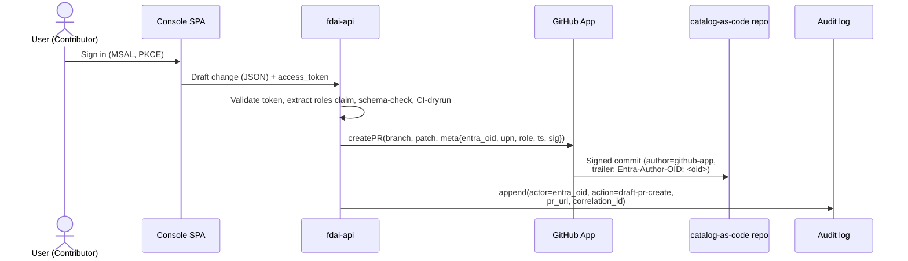
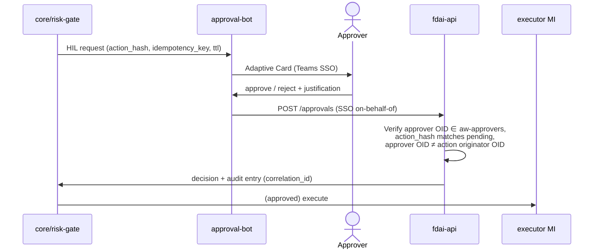

# User RBAC and Entra Identity

How **human users** authenticate, are authorized, and are audited across the console,
ChatOps, and the catalog-as-code repository. This file is authoritative for the human
identity model; non-human identities (executor Managed Identity, GitHub App, Teams bot)
remain governed by [security-and-identity.md](../architecture/security-and-identity.md) and
[deploy-and-onboard.md](../deployment/deploy-and-onboard.md).

It resolves the P0 blocker "final identity mapping (external IdP ↔ Entra ↔ Managed
Identity)" from [security-and-identity.md#open-decisions](../architecture/security-and-identity.md#open-decisions)
for the *human* side; the executor-side mapping stays as declared there.

> RBAC (this file) answers *what a human may operate*. A separate, independently
> resolved axis, [agent-stewardship-and-handover.md](agent-stewardship-and-handover.md),
> answers *who owns each of the 15 agents* now that FDAI runs the work (accountability
> + escalation + handover). A person is typically in both; being a steward grants no
> RBAC capability by itself.

> Customer-agnostic: all group names, app registration names, and GUIDs below are
> **placeholders**; a fork supplies the real values via config
> ([generic-scope.instructions.md](../../../.github/instructions/generic-scope.instructions.md)).

## 1. Design Principles Recalled

Three safety principles govern this design; every choice below preserves them:

1. **No self-approval** - the requester of a governance change (PR author, HIL trigger)
   MUST NOT be the approver. Enforced by CI + GitHub CODEOWNERS, not by role separation.
2. **Approval ≠ execution** - no human role holds the executor Managed Identity. Humans
   author, review, and approve; the MI executes.
3. **Console is read-only** - the console never mutates the live catalog or executes
   actions ([app-shape.instructions.md](../../../.github/instructions/app-shape.instructions.md)).
  The target editing contract uses draft PRs authored by a GitHub App on behalf of the
  console user. The current GitOps adapter publishes remediation PRs only; there is no
  user draft-governance API yet.

## 2. Role Model (4 tiers + Break-Glass)

Modeled on Azure RBAC (Reader / Contributor / Owner). Four everyday roles plus one
segregated break-glass group. Roles are **coarse-grained on purpose** - differentiation
comes from CI checks, CODEOWNERS paths, and app-level justification, not from adding
more roles.

| # | Role | Entra Security Group | Analog | May do |
|---|------|----------------------|--------|--------|
| 1 | **Reader** | `aw-readers` | Azure Reader | View console: KPI dashboard, audit log, shadow results, HIL queue |
| 2 | **Contributor** | `aw-contributors` | Azure Contributor | All of Reader + author draft PRs for rules, rule-sets, assignments, exemptions, overrides |
| 3 | **Approver** | `aw-approvers` | (Reviewer) | All of Reader + review/approve governance PRs + approve runtime HIL requests + approve enforce promotions / exemptions / overrides (quorum applies to high-risk - see §5) |
| 4 | **Owner** | `aw-owners` | Azure Owner | All of Approver + trigger kill-switch + manage Entra group membership + apply infra IaC |
| - | **Break-Glass** | `aw-break-glass` | (separate emergency account) | Console view, kill-switch, and emergency access-grant capabilities only. It has no runtime HIL approval capability and isn't an Owner superset. |

**Rules that keep the model safe without adding tiers**

- A user MAY belong to multiple groups (e.g. both Contributor and Approver), but the
  **no-self-approval** CI check still blocks them from approving their own PR. The check
  compares Entra OIDs on PR author trailer and reviewer, not group membership.
- **Break-Glass is NOT nested inside Owner**. It is a separately managed group; an Owner
  account is not authorized for break-glass actions unless also in `aw-break-glass`. This
  bounds blast radius even if an Owner account is compromised.
- **Activation preserves verified entitlement**. Token resolution removes `BreakGlass` from
  effective roles but retains a separate eligibility flag. Time-boxed activation checks that
  flag before adding the emergency role.
- **Current activation boundary.** `RoleResolver.activate_break_glass` is a pure activation
  primitive that validates an incident id and future expiry. The production API has no endpoint,
  persistent activation store, or TTL-enforcement composition that invokes it. A BreakGlass token
  claim therefore doesn't elevate a runtime principal or grant HIL approval eligibility.
- **PIM is optional**. Upstream does not require it. A fork with Entra ID P2 MAY layer PIM
  on top of `aw-approvers` / `aw-owners` for just-in-time activation, but the default
  model works on P1.

## 3. Persona → Action Matrix

| Action | Reader | Contributor | Approver | Owner | Break-Glass |
|--------|:------:|:-----------:|:--------:|:-----:|:-----------:|
| View console | ✓ | ✓ | ✓ | ✓ | ✓ |
| Author rule / rule-set draft PR | | ✓ | ✓ | ✓ | |
| Author assignment / exemption / override draft PR | | ✓ | ✓ | ✓ | |
| Review + approve standard governance PR | | | ✓ | ✓ | |
| Approve `audit → deny / remediate` promotion (quorum) | | | ✓ | ✓ | |
| Approve exemption (time-boxed) | | | ✓ | ✓ | |
| Approve override (may be long-lived) | | | ✓ | ✓ | |
| Approve runtime HIL request | | | ✓ | ✓ | |
| Approve runtime HIL request (emergency) | | | | | |
| Trigger global kill-switch | | | | ✓ | ✓ |
| Grant emergency scoped access | | | | | ✓ |
| Manage `aw-*` group membership | | | | ✓ | |
| Apply infra IaC (deployer) | | | | ✓ | |
| Hold the executor Managed Identity | (never) - the MI is non-human |||||

The production API exposes `POST /system/kill-switch` only when a durable command service is
wired. Owner and externally activated Break-Glass roles pass its capability check, but the current
production auth composition has no BreakGlass activation path, so Owner is the emergency caller
reachable through normal token resolution. Reader, Contributor, and Approver cannot call it. The
endpoint is not a console button, uses no executor identity, and atomically records the revisioned
state change with its audit entry.

## 4. Entra ID Artifacts

### 4.1 Target App Registrations

Three registrations, each with its own audience and permission surface. Splitting them
prevents an SPA-issued token from carrying backend management scopes.

> The repository consumes supplied tenant, audience, client, and role/group values. Terraform
> doesn't currently provision these registrations or their App Role assignments.

| App Registration | Type | Audience | Notes |
|------------------|------|----------|-------|
| `fdai-console-spa` | SPA (PKCE, no secret) | requests `fdai-api` scopes | Console sign-in only |
| `fdai-api` | Web API | `api://<guid>` | Called by console + ChatOps backend; declares **App Roles** (§4.4) and validates the `roles` claim on every request |
| `fdai-approval-bot` | Bot (Azure Bot channel registration) | Teams SSO on-behalf-of `fdai-api` | Adaptive Card HIL approvals |

Redirect URIs, tenantId, and clientId are **fork-provided** and injected via config.

### 4.2 Security Groups (slots)

Upstream defines the slots; a fork supplies the Entra `objectId` values. Startup config
validation fails fast when a required slot is missing (deny-by-default).

```yaml
# shared/config schema (upstream slot definition)
rbac:
  entra:
    tenant_id: <fork-provided>
    groups:
      readers:       <objectId>   # required
      contributors:  <objectId>   # required
      approvers:     <objectId>   # required
      owners:        <objectId>   # required
      break_glass:   <objectId>   # required (may be an empty group but must exist)
```

Group naming (`aw-readers` etc.) is a recommended convention; only the objectId is
consumed at runtime.

### 4.3 Conditional Access

CA is available on Entra ID P1 (no P2 required). Recommended policies per group:

| Target group | Requirement |
|--------------|-------------|
| `aw-approvers`, `aw-owners` | **Phishing-resistant MFA** (FIDO2 / Windows Hello for Business / cert-based); text/phone OTP is **denied** |
| `aw-owners` | Additionally require **compliant device** or hybrid Entra-joined |
| `aw-break-glass` | Named-location restriction, dedicated hardware token, and continuous sign-in alert |
| All `aw-*` groups | Block legacy authentication protocols |

### 4.4 App Roles (token surface)

The API prefers **App Roles** as its canonical token surface. App Roles are declared on the
`fdai-api` app registration and assigned to the `aw-*` groups in the Enterprise Applications
view; a signed-in user's access token then carries a `roles` claim (for example,
`"roles": ["Approver"]`). For migration compatibility, `RoleResolver` falls back to configured
objectId mappings when `roles` is empty and inline `groups` are available. That fallback isn't
possible for group-overage tokens, which require an FDAI App Role.

| App Role value | Assigned to (Entra security group) |
|----------------|------------------------------------|
| `Reader` | `aw-readers` |
| `Contributor` | `aw-contributors` |
| `Approver` | `aw-approvers` |
| `Owner` | `aw-owners` |
| `BreakGlass` | `aw-break-glass` |

Why App Roles over raw group claims:

- **Portable across tenants.** App Role values are constants defined in code; group
  `objectId`s differ per tenant. A fork changes group assignments, not code.
- **No groups-overage failure.** A user in >200 groups omits the `groups` claim from their
  token by default, while the `roles` claim is unaffected. If an overage token has no FDAI
  App Role, the API fails closed with an actionable configuration error instead of treating
  the principal as silently unassigned.
- **App-scoped least privilege.** App Roles apply only to `fdai-api`; they cannot
  be reused elsewhere to widen a compromised token's blast radius.

Group memberships remain the **administration surface** (Owners add/remove members via the
Entra Portal); App Roles are the **token surface** the API sees.

## 5. Governance Action Enforcement (CI + CODEOWNERS)

Coarse roles are made safe by **quorum + justification + author≠approver** checks at the
PR and API layer:

> **Implementation status**: Runtime capability checks, `RoleEnforcer.no_self_approval`, and
> risk-gate quorum are implemented. The PR trailer, diff-risk, reviewer OID, and justification
> checks below are the target CI contract and aren't implemented in `.github/workflows/`.
> Current `.github/CODEOWNERS` routes exemptions, risk classification, and framework surfaces to
> the upstream owner; it doesn't implement the complete `@aw-approvers` template below.

### 5.1 Target CODEOWNERS (single approver group, path-based reviewer count)

```
# CODEOWNERS
rule-catalog/rules/**              @aw-approvers
rule-catalog/assignments/**        @aw-approvers
rule-catalog/exemptions/**         @aw-approvers
rule-catalog/overrides/**          @aw-approvers
```

Every governance PR requires at least one `@aw-approvers` reviewer. CI raises that
requirement based on **diff content**:

| Diff pattern (CI-detected) | Required approvals from `@aw-approvers` |
|----------------------------|-----------------------------------------|
| Rule text or rule-set change | **1** |
| Assignment parameter change (no effect promotion) | **1** |
| Assignment `effect` promotion `audit → deny / remediate` | **2 (quorum)** |
| Exemption create / renew | **2 (quorum)** |
| Override create / modify | **2 (quorum)** |

Quorum-2 is the shadow→enforce promotion gate ([architecture.instructions.md](../../../.github/instructions/architecture.instructions.md))
made concrete without introducing an "elevated approver" group.

### 5.2 Target CI Checks (upstream-provided, fork-configured)

- **Author-is-not-approver**: parse PR author's Entra OID trailer (§6) and every reviewer's
  Entra OID; fail if any reviewer's OID equals the author's OID.
- **Author-role-check**: PR author's token (captured when the draft PR was created) MUST
  carry a `roles` claim containing `Contributor` or a superset role (`Approver`, `Owner`).
  The role is stamped into the PR trailer at draft-creation time so CI does not re-query
  Entra at review time.
- **Justification-present**: for high-risk diffs (quorum-2 rows above), the PR description
  MUST contain a `Justification:` block ≥ N characters (`N` is configured).
- **Signed-commit / signed-trailer**: reviewer approvals are bound to the specific PR head
  commit; a force-push after approval invalidates and re-requests review.

### 5.3 App-Level Justification (runtime HIL)

The target Adaptive Card approval contract requires `justification` and rejects missing or empty
values with `400`. The current HMAC callback validates that `justification` is a string but allows
an empty string. Its enforced boundary is the callback signature and replay window,
no-self-approval, optional signed `actor_roles` capability, and a typed registry/coordinator
decision.

```jsonc
POST /hil/{approval_id}/decision
{
  "approval_id": "hil-2026-07-04-abc123",
  "decision": "approve",
  "actor_oid": "approver-oid",
  "justification": "verified rollback plan in runbook X; safe within maintenance window"
}
```

## 6. Target Identity Flow: Console → Draft PR → Audit

The target flow preserves the console's read-only boundary by delegating writes to a **GitHub
App** and carrying the user's Entra OID through no-self-approval and audit correlation. The
current `GitOpsPrAdapter` publishes executor-generated remediation draft PRs, but the console
draft-governance endpoint, Entra OID trailer, and human OID-to-GitHub-login mapping store aren't
implemented.



- The SPA never holds a GitHub PAT. Write access to the catalog belongs only to the
  GitHub App.
- The commit's git author is the GitHub App; the human user's Entra OID travels in a
  commit trailer (`Entra-Author-OID: <guid>`) and in the PR body. CI parses that trailer.
- The user's Entra OID ↔ GitHub login mapping is stored by the fork behind the
  `shared/providers/` interface. Missing mapping → the API rejects the draft with `403`.

## 7. ChatOps HIL Flow

This is the identity view of the HIL approval hop. The **channel abstraction** behind it -
categories, trust tiers, per-vendor rules, and fallback policy - lives in
[channels-and-notifications.md](channels-and-notifications.md).

> **Current boundary**: Teams conversation ingress verifies a Bot Framework JWT and same-tenant
> principal binding. Runtime HIL decisions use an optionally registered HMAC-signed
> `POST /hil/{approval_id}/decision` callback that passes a typed decision to the registry or
> `HilResumeCoordinator`. The Teams SSO OBO exchange and user callback carrying App Roles below
> are a target flow and aren't implemented yet.



- The current callback binds its HMAC to the timestamp, URL `approval_id`, and body. The registry
  or parked coordinator resolves that identifier against a pending item and enforces idempotent
  terminal decisions.
- No-self-approval compares the signed callback actor OID with the pending item's submitter OID.
  End-to-end propagation from a future human-authored governance PR remains part of the target
  flow.

## 8. Audit Correlation

The target governance flow leaves the same `correlation_id` in four systems so a single decision
is reconstructable end-to-end. Current typed HIL and IAM paths record their own correlated state
and audit entries, but Entra sign-in, GitHub PR, Teams OBO, and core audit aren't wired into one
end-to-end flow.

| Source | What it records |
|--------|-----------------|
| Entra sign-in log | who signed in, MFA method, device, location |
| `fdai-api` action log | which API call, with `justification`, `entra_oid`, `correlation_id` |
| GitHub PR events | PR author trailer, reviewer approvals, CI check results |
| `core/audit` | final decision, tier, executor / approver identity, idempotency key |

Correlation ID is generated by `fdai-api` on the first user-initiated action of a
flow and propagated to GitHub (PR body), Adaptive Cards, and the core audit writer.

## 9. Fork vs Upstream Split

The table below is the target ownership split. The current upstream includes roles and
capabilities, the Entra verifier and resolver, RBAC group slots, IAM request/directory contracts,
and a remediation PR adapter. App registration manifest templates, a human OID-to-GitHub-login
mapping provider, and governance PR CI aren't implemented yet.

| Item | Upstream (this repo) | Fork |
|------|----------------------|------|
| App registration manifest templates (scopes, redirect URI schema) | ✓ | tenantId, clientId values |
| Entra security group **slots** in config schema | ✓ | objectId values for each slot |
| Conditional Access policy **requirements** (as documentation) | ✓ | tenant-side policy creation |
| CODEOWNERS template | ✓ | GitHub team name mapping |
| `entra-oid ↔ github-login` mapping **interface** (`shared/providers/`) | ✓ | actual mapping data |
| Justification field + CI diff-risk classifier | ✓ | tune `N` (min length), path patterns |
| Break-glass alerting channel | ✓ (interface) | actual channel binding |

## 10. Sign-In Flow Reference

Concrete protocol details behind the flows in §6 and §7. All timing values are
recommendations; a fork tunes them via Conditional Access.

### 10.1 Console (SPA) - OIDC + Authorization Code with PKCE

- **Library**: MSAL.js v3 (`@azure/msal-browser`). No Implicit Flow.
- **Tenant**: single-tenant per fork (`accountsInHomeTenantOnly`); guest access is via
  Entra B2B invitation (§10.5).
- **Redirect**: the console has no anonymous surface. On load, if MSAL has no valid
  session, it redirects to `/authorize` immediately.
- **Token store**: access + id tokens in memory or `sessionStorage` (never
  `localStorage`); refresh managed by MSAL `acquireTokenSilent`.
- **Silent token timeout**: the console waits up to 10 seconds by default for
  `acquireTokenSilent`. If acquisition stalls, it shows an authentication error with a
  retry action instead of leaving the current panel loading indefinitely. A fork can set
  `VITE_AUTH_TOKEN_TIMEOUT_MS` to a positive integer when its identity policy needs a
  different bound.
- **Expired API session**: a `401` from the configured read or ingestion API closes the current
  data surface and switches to the full-screen sign-in recovery view. This applies to standard
  reads, chat, workflows, commands, and SSE streams. Identity-provider requests and `403` access
  decisions don't trigger this transition. One shared fetch observer supports overlapping owners,
  idempotent cleanup, and reinstallation after another owner replaces the global fetch function;
  cleanup never overwrites that replacement.
- **Sign-out**: `/logout?post_logout_redirect_uri=...` clears both console session and the
  Entra session for the tenant.

> **Local development**: When the local login chooser exposes the dev bypass, the console
> first calls a core read endpoint without a token. It stores the session-scoped bypass only
> after that probe succeeds. A `401` or `403` keeps the chooser open and directs the operator
> to Entra sign-in, so an auth-enforcing local API cannot be entered as a broken anonymous
> session.

```mermaid
sequenceDiagram
  actor U as User
  participant SPA as Console SPA (MSAL)
  participant E as Entra ID
  participant API as fdai-api
  U->>SPA: navigate https://console.<fork>/
  SPA->>E: /authorize (client_id=spa, scope=api://<api>/access + openid,<br/>response_type=code, PKCE)
  E->>U: sign-in prompt
  U->>E: credentials
  E->>E: Conditional Access evaluate<br/>(approvers/owners → phishing-resistant MFA)
  E-->>U: MFA challenge (if triggered)
  U->>E: FIDO2 / WHfB response
  E->>SPA: /callback?code=...
  SPA->>E: /token (code + PKCE verifier)
  E->>SPA: id_token + access_token(aud=api://<api>) + refresh_token
  SPA->>API: GET /me + Authorization: Bearer <access_token>
  API->>API: verify signature (JWKS), aud, iss, exp;<br/>extract oid, upn, roles
  API->>SPA: {oid, upn, roles, correlation_id}
  SPA->>SPA: role-based UI render
```

### 10.2 API Token Validation

The API validates every request as follows (deny by default):

1. **Signature** via Entra JWKS (`https://login.microsoftonline.com/<tenant>/discovery/v2.0/keys`).
2. **Audience** equals `api://<fdai-api-guid>`.
3. **Issuer** equals the fork's tenant issuer URL.
4. **Not expired** (`exp`) and **not-before valid** (`nbf`).
5. **Role resolution** - prefer `roles` App Roles. If that claim is empty and inline `groups` are
  available, fall back to configured objectId mappings. Fail closed when an overage token has no
  App Role. If no known role resolves, protected endpoints return `403`. There is **no
  auto-provisioning** to `aw-readers`.
6. **Stable identity** is `oid` (Entra user objectId). `upn`/email are informational only;
   audit and no-self-approval use `oid`.

Steps 1-4 are implemented upstream by the generic
[`EntraJwtVerifier`](../../../src/fdai/delivery/read_api/entra_verifier.py) (PyJWT +
`PyJWKClient`); steps 5-6 by [`RoleResolver`](../../../src/fdai/core/rbac/resolver.py). The
verifier is customer-agnostic - a fork supplies only values, via env:

| Env var | Required | Default | Purpose |
|---------|:--------:|---------|---------|
| `FDAI_ENTRA_TENANT_ID` | yes | - | The fork's single tenant; derives issuer + JWKS URI. |
| `FDAI_API_AUDIENCE` | yes | - | The `fdai-api` App ID URI (`api://<fdai-api-guid>`); token `aud` MUST equal it. |
| `FDAI_ENTRA_ISSUER` | no | `https://login.microsoftonline.com/<tenant>/v2.0` | Override for a v1-token app (`https://sts.windows.net/<tenant>/`). |
| `FDAI_ENTRA_JWKS_URI` | no | tenant's `.../discovery/v2.0/keys` | Override for sovereign / air-gapped clouds. |

The JWKS is fetched lazily and cached in-process; per-request validation is local RSA
crypto, so the sync `ClaimsVerifier` contract holds without blocking the event loop.

### 10.3 First Sign-In (unassigned users)

A user with valid Entra credentials but no `aw-*` group membership can reach the console
but MUST NOT gain any capability:

- Entra authentication succeeds, `roles` claim is empty.
- API returns `403` with a one-screen message: contact an Owner to be added to a group.
- Role-protected endpoints return `403`, while role-optional `GET /iam/self` provides the
  self-service projection for the Access Required screen. A dedicated `sign-in-denied` audit
  event isn't implemented yet.

### 10.4 ChatOps (Teams) Sign-In

The target contract for Teams SSO OBO approval is:

- The Adaptive Card "Approve"/"Reject" click reaches the bot with a Teams SSO token.
- The bot performs the **On-Behalf-Of (OBO)** flow to exchange the Teams token for an
  `fdai-api` audience token.
- API validation (§10.2) is identical; the `roles` claim MUST contain `Approver` or
  `Owner`. A first-time Teams user with no assignment gets the same `403` message.

### 10.5 Guest (Entra B2B) Users

External collaborators are onboarded via **Entra B2B invitation**, producing a guest
`oid` in the fork tenant. Recommended fork policy:

- Guests MAY be added to `aw-readers` and - with justification - `aw-contributors`.
- Guests shouldn't be added to `aw-approvers`, `aw-owners`, or `aw-break-glass`. The repository
  doesn't currently ship a bootstrap membership check for this human-role policy, so a fork must
  enforce it in its Entra administration process.
- Conditional Access policies apply uniformly to guests and members.

### 10.6 Programmatic Access (local dev, CI)

Human users never hold PATs or long-lived secrets:

- **Azure-backed local console**: `FDAI_READ_API_LOCAL_ENTRA=1` is the canonical
  interactive development mode. The browser signs in through Entra, and the API
  verifies the JWT signature, issuer, audience, lifetime, and App Roles exactly as
  production does. The server's Azure CLI session supplies short-lived tokens only to
  Azure adapters such as Microsoft Graph, Azure Resource Graph, and Azure OpenAI; it
  never replaces the browser principal. A principal with no App Role sees the
  access-request page, and a missing bearer token fails closed.
- **CLI principal alternative**: `FDAI_READ_API_LOCAL_AZURE_CLI=1` and
  `VITE_LOCAL_AZURE_CLI_AUTH=1` project the current CLI user with a fixed local role
  ceiling when browser sign-in isn't required. This is an explicit alternative, not the
  canonical full-stack profile.
- **Synthetic fixtures**: anonymous authorization, static users, seed audit records,
  and scenario replay are available only through `app(test_fixtures=True)` under
  pytest. They aren't an interactive development data source.
- **Direct API client**: request a token scoped to a dedicated `fdai-api-dev` audience
  against a development tenant. The standard signature, audience, issuer, expiry, and
  App-Role checks in section 10.2 still apply.
- **CI**: workload identity federation (OIDC), already required by
  [deployment.md](../deployment/deployment.md). GitHub Actions and Azure DevOps both support it.
- **PATs aren't supported**. Secret scanning in CI blocks accidental commits
  ([coding-conventions.instructions.md](../../../.github/instructions/coding-conventions.instructions.md)).

### 10.7 Break-Glass Sign-In

- Break-glass is a **dedicated account** (not a human's personal account), stored with a
  hardware FIDO2 key in physical custody.
- Alerting on every sign-in and writing an elevated audit record are deployment operations
  requirements. The production API currently has no activation endpoint, persistent activation
  store, or alerting composition.
- A verified `BreakGlass` entitlement must be activated separately through
  `RoleResolver.activate_break_glass`. Active BreakGlass alone carries kill-switch and emergency
  access-grant capabilities; the capability model doesn't require simultaneous `Owner` and
  `BreakGlass` roles.
- Break-glass credential rotation and drill cadence are declared in
  [security-and-identity.md](../architecture/security-and-identity.md).

## 11. Console Settings and Access Requests

The Settings activity-bar group gives operators six stable routes without widening the
console's cloud permissions:

| Route | Purpose |
|-------|---------|
| `/settings/general` | Browser-local display, language, motion, and answer-verification preferences. |
| `/settings/models` | Resolved T1/T2 models, lifecycle and latency evidence, the signed-in user's T1 narrator preference, and a distinct-publisher T2 catalog draft builder that never changes runtime state. |
| `/settings/memory` | Durable operator guidance when a provider is registered; otherwise an explicit unavailable state. |
| `/settings/iam` | Signed-in principal, App Roles, effective capabilities, referenced users, and access requests. |
| `/settings/integrations` | Read-only identity, delivery, and operator-channel connection status. |
| `/settings/diagnostics` | Read API endpoint and authentication-session diagnostics. |

`/settings` remains a compatibility alias for `/settings/general`. Settings is a bottom
navigation group, so selecting it opens the same Explorer pattern used by the operator
domains instead of leaving the previous domain menu visible.

### 11.1 IAM projection

`GET /iam` returns the server-verified principal, the five fixed role definitions, and the
effective capability union. `GET /iam/access-requests` returns requests visible to that
principal. Access-request identities are Owner-only; Reader, Contributor, and Approver
requests receive `403`. The Users and Access requests tabs remain visible with a lock icon;
selecting either tab renders an immediate Access denied surface instead of ignoring the
interaction. An unassigned user sees only their own request through the role-optional
`GET /iam/self` projection.

The Users tab combines two bounded sources. It shows the verified signed-in principal and
users referenced by visible access requests. An Owner can also search the configured
`HumanIdentityDirectory` through `GET /iam/directory/users?q=...` and select an account to
prefill a governed access request. The browser never receives provider credentials.

`GET /iam/directory/roster` projects the FDAI enterprise application's live App Role
assignments. The Entra adapter discovers the service principal, maps each App Role id to its
role value, and expands assigned groups through transitive membership. Direct user
assignments and group-derived assignments are merged by stable subject id. The Users tab can
filter People and Groups, but role requests are available only for active people.

`HumanIdentityDirectory` is cloud-provider-neutral. Every adapter returns a stable
`provider`, `subject_id`, username, display name, user type, and active flag. Microsoft
Entra ID is the implemented adapter and uses Microsoft Graph `/users` with managed identity
and the application permissions `User.Read.All` and `GroupMember.Read.All`. AWS IAM Identity Center and Google Cloud
Identity adapters are future scope; they can implement the same Protocol without changing
the core service, API payload, or console.

Before the API accepts a governed role request, it stamps the configured provider and uses
`get_by_subject_id` to verify the subject, username, and active state. Client-supplied
provider labels never select the identity backend.

Interactive local mode doesn't fall back to a synthetic directory. The Microsoft Graph
adapter uses the server's Azure CLI credential to discover the FDAI service principal, its
live App Role assignments, and transitive group members. Alias search, the role roster, and
access-request targets therefore reflect the signed-in tenant while provider credentials
remain outside the browser. Offline fixture identities remain pytest-only.

### 11.2 Governed request flow

A Contributor or higher role can submit `POST /iam/access-requests` with these fields:

| Field | Rule |
|-------|------|
| `idempotency_key` | Required. Reuse with the same intent returns the existing request; reuse with different intent returns `409`. |
| `identity_provider` | Informational client value. The API stamps the configured adapter name. |
| `target_subject_id` | Stable account subject from that provider. Legacy `target_oid` input remains accepted during migration. |
| `target_username` | Human-readable name or UPN for review. Authorization never relies on this value. |
| `operation` | `grant`, `revoke`, or `set`. `set` expresses the per-row role dropdown change. |
| `role` | `Reader`, `Contributor`, `Approver`, or `Owner`. Routine `BreakGlass` requests are blocked. |
| `justification` | 20-2000 characters. Stored with the request and audit event. |

The API derives the requester and capabilities from the validated token. It stores each
request and its `iam.access-requested` hash-chain entry in one transaction. Review decisions
use the same state-and-audit transaction. Request review looks up the stable `request_id`
directly, so older requests remain reviewable after the list projection is paginated. The
response status is `pending`; submitting the form doesn't approve the request or change
Entra group membership.

Approval stays in ChatOps or the governance pull-request path. After approval, an Owner
applies the allowlisted `aw-*` group change through the tenant's identity-administration
process. This separation keeps the browser, read API, and executor identity away from
Microsoft Graph membership permissions.

### 11.3 First sign-in without a role

An authenticated user with no FDAI App Role doesn't enter the operator shell. The console
calls role-optional `GET /iam/self` and renders an Access Required screen with:

- the verified account;
- the only self-service role available, `Reader`;
- an optional message;
- the current request id and `pending` status after submission;
- check-again and sign-out actions.

`POST /iam/access-requests/self` derives the target subject from the verified token. It
allows only `grant Reader` for that same subject. Requests for another subject, a higher
role, or a revoke are blocked even if the browser body is modified.

The request appears in Settings > Identity and access for an Owner, including the requester,
provider subject, role, and audit correlation. An Owner can record `approve` or `reject` with
a justification in IAM. The API blocks self-approval and stores the decision separately from
the immutable request, with an `iam.access-reviewed` audit entry. High-risk runtime approvals
remain in ChatOps and the regular Approvals surface; an IAM review never approves an
autonomous action.

An approved IAM request has status `approved` but still requires the provider-side group
assignment before the user's next token carries the role. Approval and assignment remain
separate principals. Provider automation can consume the approved projection later without
changing the request or review contract.

## 12. Open Decisions

- [ ] Whether the API stores the `entra_oid ↔ github_login` mapping in the same
      PostgreSQL as audit (single store) or in a separate fork-owned identity store.
- [ ] The exact `Justification` minimum length per diff-risk tier (currently config-only).
- [ ] Whether Owner may also be a Break-Glass member (default: **no**; enforce via CI in
      fork bootstrap).
- [ ] The rotation cadence for `aw-owners` and `aw-break-glass` membership (manual access
      review vs P2 Entra Access Reviews).
- [ ] Whether the console's "draft change" UI ships in P1 (Change domain only) or P3 (all
      three verticals) - depends on
      [rule-governance.md](../rules-and-detection/rule-governance.md#open-decisions) authoring-UI decision.
- [ ] Whether guest users MAY be assigned `Contributor` at all, or must stay `Reader`-only
      (§10.5 default allows Contributor with justification).
- [ ] Console session max-lifetime value (Conditional Access setting); default
      recommendation: 8 hours idle, 24 hours absolute.
