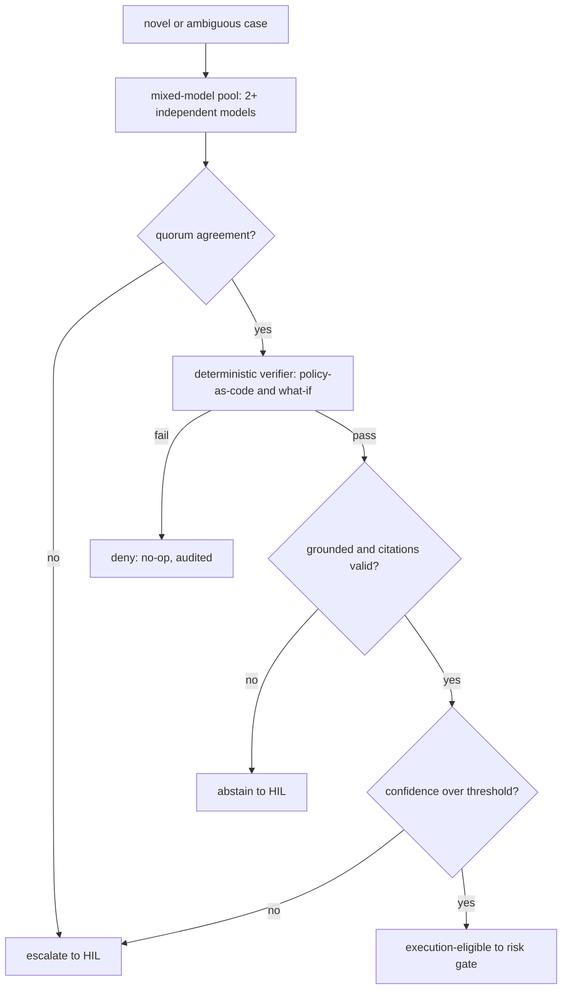
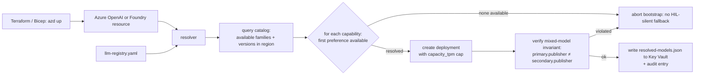
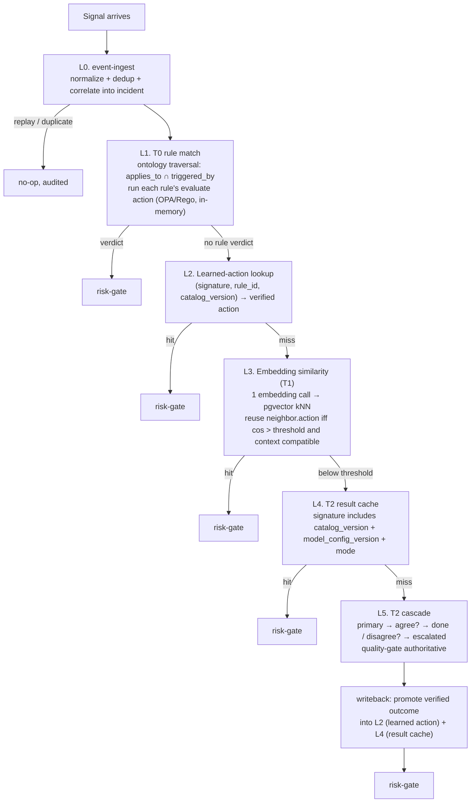
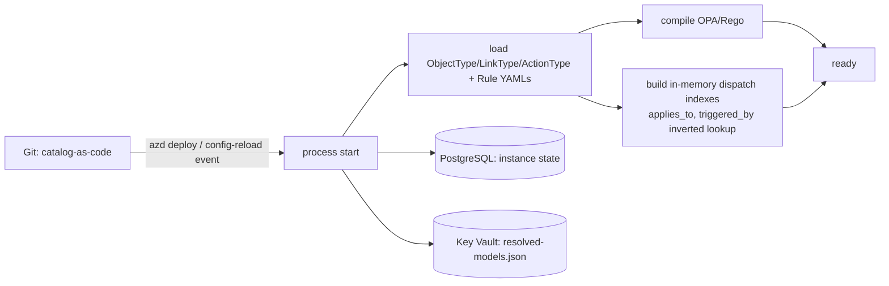

# LLM Strategy

The design **uses the LLM less**, not more. A model is the **T2** fallback, reached only after
T0 and T1 cannot resolve a case, and its output is never trusted for execution until
deterministic verification approves it. Execution eligibility is granted by that verification,
**never by the model**. This file expands the tier and quality-gate rules in
[architecture.instructions.md](../../.github/instructions/architecture.instructions.md) and
the threat model in [security-and-identity.md](security-and-identity.md).

> Model names below are recommendations to **confirm at adoption time**. Availability,
> pricing, and preview status change; pick the concrete model by measured cost/quality on the
> scenario set, never by assumption. No specific model is fixed by this document.

## Model Tiers

Coverage figures are **targets to validate against a measured baseline**
([goals-and-metrics.md](goals-and-metrics.md)), not guarantees. They partition one event
stream, so T0+T1+T2 sum to ~100%; T0 (~70-80%) is documented in
[architecture.instructions.md](../../.github/instructions/architecture.instructions.md).

| Tier | Role | Model class | Coverage target | Cost profile |
|------|------|-------------|-----------------|--------------|
| **T0** | deterministic engine | **no model** | ~70-80% | zero tokens |
| **T1** | similarity + light judgment | **embedding model** + **small/cheap LLM** | ~15-20% | very low |
| **T2** | reasoning on novel/ambiguous cases | **frontier LLMs (2+ independent)** | ~5-10% | highest; mixed-model cross-check required |

### Tier Boundaries

- **T0 → T1** when no rule yields a deterministic verdict but the case is not novel.
- **T1 → T2** only when T1 **abstains**: no exact rule match, embedding similarity to prior
  resolved incidents falls below a configured score threshold, and no learned action applies.
- Similarity thresholds and the abstain conditions are **configuration**, not hard-coded.

## T1 - Lightweight Tier

- **Embeddings**: a small embedding model to vectorize incidents and match past patterns.
  Prefer a cost-efficient hosted embedding model, or a local sentence-transformer where data
  residency or cost demands it (see [Data Privacy](#data-privacy-and-residency)). Store
  vectors next to state (e.g. pgvector).
- **Small judgment model**: a small/cheap instruction model to classify routine cases and
  select a learned action. Keep prompts short and grounded; treat inputs as untrusted
  (see [Prompt-Injection Defense](#prompt-injection-defense)).
- Goal: absorb ~15-20% of events without a frontier round-trip.

## T2 - Reasoning Tier (Quality Gate Required)

T2 handles only novel or ambiguous cases (~5-10%). Its output must pass the quality gate
before it can execute. The model **generates a candidate**; the deterministic verifier decides
eligibility.

- **Mixed-model cross-check**: run **two or more independent models** on the same judgment.
  Independence means genuinely distinct providers/weights - do **not** count two endpoints
  serving the same base model, since correlated errors defeat the check.
  - **Agreement predicate**: agreement is on the **normalized structured action** (target
    resource, operation, parameters), not free text. Compare canonicalized action objects for
    semantic equivalence, not string identity.
  - **N models and quorum**: with N ≥ 3, require a configured quorum (e.g. majority); no quorum
    → escalate. A 2-of-2 tie (disagreement) escalates to HIL, never auto-resolves.
  - **Cost control**: prefer a **cascade** - run the cheaper reasoner first and invoke the
    second only when its self-consistency or grounding signal is weak - so the full N-model
    fan-out is spent only on genuinely hard cases.
  - **Provenance (reproducibility)**: the decision records **each model's vote**
    (`QualityDecision.model_votes`: `model_id`, proposed action type, agreed) - not just the
    agreement count - so a T2 judgment is reconstructable from the append-only audit, the
    replay property the log promises.
- **Verifier**: a **deterministic** check, independent of any model, re-validates the candidate
  action against policy-as-code and what-if/dry-run before it is execution-eligible. The
  verifier - not model text - is the authority.
- **Grounding (RAG)**: force citation of the rules/policies/docs that justify the judgment,
  and **validate that each cited item exists in the rule catalog and actually supports the
  claim** (guards against fabricated citations). **Abstain** when the answer is ungrounded.
- **Threshold gating**: schema, policy, what-if, and security-scan checks must all pass and a
  computed **confidence** must clear a threshold. Confidence is derived from verifier and
  cross-check signals (agreement, grounding validity, historical success) - **never from a
  model's self-reported confidence**, which is unreliable. Below threshold routes to HIL.

### Outcome Semantics

- **eligible** - all gates pass; hand to the risk gate.
- **abstain** - no grounded, supported answer; take no autonomous action, route to HIL.
- **disagree/escalate** - models fail quorum; route to HIL.
- **deny** - verifier or policy rejects the candidate; no-op, audited.

All four are typed, audited outcomes; only **eligible** can proceed toward execution.



### Rubric Gate (hallucination filter)

An optional fifth leg scores the candidate's reasoning against fixed criteria
(faithfulness, evidence-action alignment, completeness, coherence) and folds the
minimum score into confidence with `min()` - **subtractive only**, so a rubric can
lower eligibility but never raise it. Ships shadow-first (judge-and-log until a
promotion gate is met) and fails closed to HIL on evaluator error. The judge MUST be a
distinct publisher from the proposer (a model must not grade its own answer). Full
design: [hallucination-rubric-gate.md](hallucination-rubric-gate.md).

## Prompt-Injection Defense

Event payloads and tool outputs are **untrusted** and may carry direct or indirect prompt
injection ([security-and-identity.md](security-and-identity.md)).

- Treat all payload and tool-output text as **data, not instructions**; the model must not
  follow instructions embedded in it. Delimit and quarantine untrusted spans in the prompt.
- **Indirect injection**: outputs returned from tools/RAG are re-fed to the model - apply the
  same quarantine and never let retrieved text change the action contract.
- The **verifier and policy re-check are the authority**; a candidate that only "sounds"
  approved but fails deterministic checks is denied.
- Redact secrets and identifiers **before** any model call (see below), so an injection cannot
  exfiltrate them through generated output.

## Data Privacy and Residency

- **Minimize and redact**: strip secrets, connection strings, and any customer/tenant/
  subscription identifiers from prompts before a model call; send the least payload needed.
- **Residency routing**: route sensitive events to a local/in-region model (e.g. local
  embeddings) by config; do not send restricted data to an external endpoint.
- **No-train / retention**: prefer endpoints with a **no-training** guarantee and minimal
  retention for submitted prompts; record the chosen posture per capability in config.

## Provider Abstraction

- All model calls go through a **provider-neutral client** in `shared/` so models can be
  swapped without touching `core/tiers`.
- Configure models by capability, not hard-coded name: `t1.embedding`, `t1.judge`,
  `t2.reasoner.primary`, `t2.reasoner.secondary`, `t2.rca`.
- **Client contract**: enforce request timeouts, structured/JSON-schema output, token
  accounting, and reproducible settings (temperature 0 and a fixed seed where supported) so
  cross-checks and replays are comparable.
- **Versioned mapping**: the capability→concrete-model mapping is versioned; the exact model
  IDs and config version used for a decision are recorded in the audit log for replay.
- Route to Azure OpenAI, other Azure Foundry models, or third-party endpoints purely by config,
  keeping the core CSP-neutral.

## Model Provisioning and Lifecycle

Model availability, versions, and deprecations shift continuously. Hard-coding a model id
guarantees rot. The provisioning model below keeps the capability→concrete-model mapping
**automatic at bootstrap and reviewed at update time**, with model changes flowing through
the same shadow-before-enforce discipline as any other change.

### Capability Preferences Registry

Upstream defines the *capabilities* and a **preference list per capability**; a fork
overrides preferences to match its region, compliance posture, or cost target. The registry
is catalog-as-code (path `rule-catalog/llm-registry.yaml`) reviewed like any other
governance artifact.

```yaml
# rule-catalog/llm-registry.yaml (upstream defaults; fork MAY override)
models:
  t1.embedding:
    preferences:
      - { publisher: OpenAI, family: text-embedding-3-small }
      - { publisher: OpenAI, family: text-embedding-3-large }
    sku: Standard
    capacity_tpm: 100_000
  t1.judge:                       # small/cheap default (mini tier)
    preferences:
      - { publisher: OpenAI, family: gpt-4o-mini }
    capacity_tpm: 40_000
  t2.reasoner.primary:            # first frontier reasoner
    preferences:
      - { publisher: OpenAI, family: gpt-4o }
      - { publisher: OpenAI, family: gpt-4-turbo }
    capacity_tpm: 20_000
  t2.reasoner.secondary:          # mixed-model peer - MUST be a distinct publisher
    preferences:
      - { publisher: Anthropic, family: claude-opus-4 }
      - { publisher: MistralAI, family: mistral-large-2 }
    capacity_tpm: 10_000
  t2.reasoner.escalated:          # Opus-class ceiling, on-demand only
    preferences:
      - { publisher: OpenAI, family: o1 }
      - { publisher: Anthropic, family: claude-opus-4 }
    invocation: on_disagreement                # not on every T2 call
    capacity_tpm: 5_000
```

Rules the registry enforces (MUST, at config load):

- **Family, not version.** Preferences pin the model *family* (e.g. `gpt-4o-mini`); the
  bootstrap resolver picks the latest stable version at provisioning time and records it in
  the resolved mapping. Never pin a dated version in the registry - it hides deprecation.
- **`capacity_tpm` is a cost ceiling.** Overflow degrades to HIL (per Cost Controls);
  provisioning a capacity below the fork's measured minimum is a config-load error.
- **Escalated capability is opt-in per invocation** (`invocation: on_disagreement`); it is
  not called on every T2 request and never bypasses the quality gate.
- **RCA reasoner is opt-in per invocation** (`invocation: on_novel_case`, capability
  `t2.rca`); it fires only on a novel incident the deterministic tiers could not resolve,
  and its output is refused unless grounded on the supplied evidence (see
  [observability-and-detection.md](observability-and-detection.md) section 4).

### Bootstrap Provisioner

At `azd up` (or equivalent) the resolver reads the registry, queries the Azure OpenAI /
Foundry catalog for the target region, and provisions **one deployment per capability**.
The resolved `{capability → deployment}` mapping is written to Key Vault and audited.

The full **deployer-permission gate table** (what happens when the deployer identity lacks
`Cognitive Services Contributor`, when a preferred family is missing from the region, when
`capacity_tpm` quota is short, or when the mixed-model invariant cannot be satisfied) is
authored in
[dev-and-deploy-parity.md § Deployer-Scoped LLM Provisioning](dev-and-deploy-parity.md#deployer-scoped-llm-provisioning);
this section shows the happy-path shape.



**Bootstrap invariants (MUST, fail-fast)**

- Every capability provisions from at least one preference. Zero-match aborts the
  bootstrap - the deployer must expand the region or update the registry.
- `t2.reasoner.primary.publisher` and `t2.reasoner.secondary.publisher` MUST differ
  (Mixed-Model Family Strategies below). Same-publisher pairs abort the bootstrap.
- The resolved mapping records `{deployment, family, version, publisher}` per capability
  so the audit log can name the exact model that decided any case.

### Runtime Resolution

Core code depends only on the capability contract. `resolved-models.json` is loaded from
Key Vault at startup; a stale reference (deployment deleted or 404) **fail-closes to HIL**,
not to a different capability.

```python
# core/tiers/t2-reasoning/reasoner.py (illustrative)
primary   = client.for_capability("t2.reasoner.primary")
secondary = client.for_capability("t2.reasoner.secondary")
cand_a = primary.chat(...)
cand_b = secondary.chat(...)
if not agree(cand_a, cand_b):
    escalated = client.for_capability("t2.reasoner.escalated")   # cost-capped
    return arbitrate(cand_a, cand_b, escalated.chat(...))
return quorum_result(cand_a, cand_b)
```

- No model id appears in `core/`.
- A missing deployment is treated as an outage: the request routes to HIL and emits an
  operational alert (A2 per [channels-and-notifications.md](channels-and-notifications.md#3-categories-a1a4)).
  A silent switch to a different capability isn't supported.

### Narrator Latency Routing (T1-Only)

The console chat backend (`fdai.delivery.read_api.chat.LatencyRoutedChatBackend`)
wraps N deployments of the `t1.judge` mini stack and per turn picks the candidate with
the lowest rolling p50 latency. It ships enabled whenever the resolver emits two or
more entries under `resolved-models.json`'s `narrator_candidates` array; a single
entry falls back to the plain `AzureAdChatBackend` (see the "Auto-populate narrator"
subsection of [dev-and-deploy-parity.md](dev-and-deploy-parity.md)).

The router is scoped to **T1 narrator traffic only** and MUST NOT be extended to
T2 capabilities without a separate design review. Two hard constraints keep the
T1 vs T2 boundary intact:

- **Mixed-model invariant** ([architecture.instructions.md § Quality Gate](../../.github/instructions/architecture.instructions.md#llm-quality-gate-required-for-t2)):
  `t2.reasoner.primary.publisher != t2.reasoner.secondary.publisher`. A latency
  router optimises for speed of an individual call, which conflicts with the
  requirement to always run two *distinct* families in parallel. A "fastest T2"
  policy would silently collapse the cross-check to whichever family happened to
  win the last round, defeating the whole point of the quality gate.
- **Judge/critic determinism**: the composer binds `t1.judge`, `t2.critic`, and
  the debate orchestrator to specific deployment names in
  [composition.py](../../src/fdai/composition.py). Swapping the *judge* deployment
  mid-run without a config-level opt-in is a behaviour change we do not want to
  hide inside a routing wrapper.

If a fork wants a latency-routed *judge*, that is a governance-level change:
declare a new capability (e.g. `t1.judge.fast-pool`) with its own quality gate,
route via the composer, and audit the swap - do not thread it through the
narrator router.

### Reconciler Job

A weekly Container Apps Job (same environment as core; no separate compute) watches three
signals and **proposes changes via draft PR** - it never mutates the live registry or
swaps deployments autonomously.

| Signal | Trigger | Reconciler action |
|--------|---------|-------------------|
| Newer family available | catalog now offers a family listed higher in `preferences` (or a new family the fork wants to pin) | draft PR raising the preference order; A2 alert |
| Deprecation notice ≤ 60 days | Azure deprecation feed matches an in-use deployment | draft PR that reorders to a still-supported family; A2 alert **and** a `governance_pr_aging_weekly` digest hit if unmerged |
| Capacity / quality drift | measured 429 rate, latency, or hallucination-rate regression per Quality Measurement | issue (not PR) proposing a preference re-order; A2 alert |

Rules the reconciler obeys (MUST):

- **Never auto-swap the production mapping.** Even a hard deprecation opens a draft PR.
  If the deprecation date passes with no merged replacement, the capability's tier
  **degrades to HIL** rather than silently downgrading to a cheaper family.
- **Shadow before enforce for models too.** A merged registry change re-runs the resolver
  in shadow: the new deployment is provisioned in parallel, the quality-measurement replay
  scores it against the frozen scenario set, and only a clean replay promotes the
  `resolved-models.json` cutover.
- **PR reviewers** on `rule-catalog/llm-registry.yaml` are Owner-tier - a model swap is a
  high-blast-radius governance change.

### Mixed-Model Family Strategies

The quality gate needs two independent model families. Which pair a fork actually gets is
a bootstrap-time choice:

| Mode | Where the secondary lives | When to pick |
|------|---------------------------|--------------|
| `azure-foundry` (default) | Anthropic / Mistral / Cohere models served through Azure AI Foundry model catalog | region and compliance allow non-OpenAI Foundry models; single billing surface |
| `external` | secondary via a direct third-party endpoint (Anthropic API, etc.) | required family unavailable in Foundry for the region |
| `hil-only` | no secondary provisioned; every T2 case routes to HIL | fork cannot obtain a second family (temporarily); explicit opt-in |

The chosen mode is a config value (`llm.mixed_model_mode`); the bootstrap resolver reads
it and enforces the invariant accordingly. Switching modes later is a governance PR, not
a runtime toggle.

### Fork vs Upstream Split

| Item | Upstream (this repo) | Fork |
|------|----------------------|------|
| Capability names (`t1.judge`, `t2.reasoner.primary`, ...) | ✓ | - |
| `llm-registry.yaml` default preferences (mini → Opus tier) | ✓ | region / compliance / cost overrides |
| Bootstrap resolver script + IaC hooks | ✓ | subscription / region / naming |
| Reconciler Job (schedule, deprecation feed parser, draft-PR opener) | ✓ | cron timezone, alert channel |
| `resolved-models.json` schema + Key Vault path | ✓ | actual values (fork tenant only) |
| Mixed-model family invariant | ✓ | choose `azure-foundry` / `external` / `hil-only` |
| Azure OpenAI / Foundry resource IaC | ✓ (Bicep templates) | subscription / region / SKU tier |

## Rule-to-Decision Lookup Pipeline

The tier percentages in [Model Tiers](#model-tiers) are the *outcome* of a deliberate
**layered lookup pipeline**: an incoming event traverses cheap-to-expensive layers, and a
frontier LLM (L5) is reached only when every cheaper layer abstains. The pipeline is built
on a typed **ontology**: rules, resources, signals, and actions are ontology entities, and
matching them is a deterministic graph traversal rather than a text-similarity guess.

The ontology framing borrows the object-type / link-type / action-type separation from a
prior AGI ontology design (typed objects with cardinality-aware links, functions integrated
into actions via `required_interfaces` and `submission_criteria`), applied to CSP resources
and rules. This gives every rule a deterministic dispatch path and every reuse a
canonical, hashable signature.

### Ontology Foundation

Every runtime concept is one of four **ObjectTypes**. Concrete instances live in
`shared/contracts/` and `rule-catalog/schema/`.

| ObjectType | Meaning | Backing |
|------------|---------|---------|
| `Resource` | a target under governance (Azure resource; CSP-neutral schema, populated by the provider adapter) | `shared/providers/` |
| `Rule` | a deterministic control with an intent (`applies_to`, `evaluates`, `remediates`) | `rule-catalog/` |
| `Signal` | a typed observation (Activity Log line, drift diff, cost anomaly, canary result) - the primitive that enters `event-ingest` | `shared/contracts/event` |
| `Finding` | a rule match on a resource at a point in time, with context and severity | derived at runtime; persisted in the audit store |

Relationships are **typed LinkTypes** with cardinality metadata, so traversal is O(indexed
lookup), not scan. Each declaration also carries `is_transitive`, `is_causal`, and
`temporal_order` flags so the traversal engine knows when a recursive expansion is safe and
when a Finding-chain query must respect time.

| LinkType | Cardinality | Transitive | Meaning |
|----------|-------------|:---------:|---------|
| `applies_to` | Rule → ResourceType (M:M) | - | which resource types the rule may match |
| `triggered_by` | Rule → SignalType (M:M) | - | which signals cause the rule to be evaluated |
| `evaluates` | Rule → Property (M:M) | - | which resource properties the rule reads |
| `remediates` | Rule → ActionType (M:1) | - | which ontology action the rule proposes on match |
| `resource_of` | Signal → Resource (M:1) | - | which resource the signal is about |
| `overrides` | Override → Rule (M:1) | - | the override targets this rule (see [rule-governance.md](rule-governance.md#overrides)) |
| `causes` / `prevents` | Rule → Outcome (M:M, causal) | - | causal metadata that T2 may reason over (rare) |
| `precedes` / `follows` | Finding → Finding (M:M, temporal) | - | correlation of related findings on one incident |
| `contains` | Resource → Resource (M:1, child→parent) | ✓ | ownership / scope containment: subscription→resource-group→resource, VNet→subnet, cluster→node-pool. Recursive CTE walks the whole chain. Populated by the [inventory adapter](csp-neutrality.md#5-inventory-contract--resource-graph). |
| `attached_to` | Resource → Resource (M:1) | - | lifetime-bound attachment: NIC→VM, disk→VM, private-endpoint→target. Removing the parent breaks the child. |
| `depends_on` | Resource → Resource (M:M) | - | logical reference required for correct operation: ContainerApp→Key-Vault / ACR / Postgres, managed-identity→app. Broken edges degrade the dependent, not the target. |
| `peered_with` *(Phase 3+)* | Resource ↔ Resource (M:M, symmetric) | - | reachable-by-network symmetric peer: VNet peering, cross-region replicas. |
| `routes_to` *(Phase 3+)* | Resource → Resource (M:1) | - | traffic path or reference: UDR next-hop, private-DNS zone link. |

Traversal is directional and cached; a `Signal` of type `T` on a `Resource` of type `R`
resolves to exactly the set of rules where `triggered_by ∋ T` and `applies_to ∋ R` via
two index intersections - no text search, no model call.

The Resource→Resource links (`contains`, `attached_to`, `depends_on`, and later
`peered_with` / `routes_to`) are what let the risk-gate compute an *actual* blast radius
instead of the three-value enum in [risk-classification.md](risk-classification.md), and
what let T2 be prompted with a **depth-2 neighborhood subgraph** around the target
resource - grounded, cited context instead of a bare resource id. Their authoritative
source is the [inventory contract](csp-neutrality.md#5-inventory-contract--resource-graph);
`core/` never queries a cloud SDK for them. New link kinds MUST be added to
`shared/contracts/ontology/link-type.json` before an adapter can emit them - an
unrecognized link, like an unrecognized `ResourceType`, opens an issue rather than
auto-registering (self-extending ontology, see [Fork Extension](#fork-extension-self-extending-ontology)).

### Rule as Ontology Artifact

The rule schema in [rule-catalog-collection.md](rule-catalog-collection.md) is extended
with the ontology fields the pipeline dispatches on. Existing fields are unchanged;
ontology fields are additive and validated by CI at load.

```yaml
# rule-catalog/rules/example.yaml (illustrative fragment; full schema in rule-catalog-collection.md)
id: object-storage.public-access.deny
version: 1.2.0
source: authored
severity: high
category: security
resource_type: object-storage
check_logic: <opa-package-ref>            # deterministic evaluator
remediation: <action-ref>                 # points to an ontology ActionType instance

# ── ontology fields (new; CI-validated) ──
applies_to:    [object-storage]
triggered_by:  [property.public_access.changed, config.public_access.enabled]
evaluates:     [object-storage.public_access]
remediates:    remediate.disable-public-access
required_interfaces: [Evaluable, Remediable]   # submission_criteria enforced at load
submission_criteria:
  - property_exists: object-storage.public_access
  - link_exists: resource_of                    # a Signal MUST reference a Resource
provenance: { ... }
```

`required_interfaces` and `submission_criteria` follow the same
Functions-plus-Interfaces pattern as the referenced ontology design: a rule is only
dispatchable when its interface contract is satisfied on the runtime object, and CI
rejects a rule whose `applies_to` / `triggered_by` cannot be resolved against the
schema registry.

### Pipeline Stages and ActionTypes (distinct concepts)

Two things are called "action" in this system and MUST NOT be conflated:

- **PipelineStage** - where in the layered lookup a decision was made. This is an
  **audit vocabulary**, not a schema artifact. Every audit-log entry records the
  `pipeline_stage` field so the decision path is reconstructable end-to-end. Stages are
  read-only from the executor's perspective (no CSP mutation happens here except at
  `remediate`).
- **ActionType** - a **CSP-neutral mutation category** with a rollback contract. Declared
  in `shared/contracts/ontology/action-type.json`; instances (e.g.
  `remediate.disable-public-access`) live in the catalog and are referenced from a rule's
  `remediates` field. This is the schema artifact.

Only `remediate` couples the two: it is a PipelineStage (the executor step) whose
output is an ActionType **instance** applied to a Resource. `escalate` / `abstain` / `deny`
are terminal stages that never invoke an ActionType.

**PipelineStage vocabulary** (recorded in `audit_log.pipeline_stage`):

| PipelineStage | Layer | Cost | Preconditions | Terminal? |
|---------------|-------|------|---------------|:---------:|
| `L1_evaluate` | L1 (T0) | pure function, in-memory OPA/Rego | rule's `applies_to` matches Resource; `check_logic` compiled | - |
| `L1_simulate` (what-if) | L1 (T0) | pure function against declarative state | resource state snapshot available | - |
| `L2_reuse` | L2 | O(1) indexed SELECT | `(signature, rule_id, catalog_version)` hit in learned-action store | - |
| `L3_similarity` | L3 (T1) | 1 embedding + pgvector kNN | context compatibility check passes on the neighbor | - |
| `L4_cache_hit` | L4 | O(1) key lookup | signature match within TTL and catalog / model version | - |
| `L5_reason` | L5 (T2) | frontier LLM (primary + secondary; escalated on disagreement) | quality-gate authoritative | - |
| `remediate` | risk-gate ⇒ executor ⇒ delivery | apply an ActionType instance to a Resource | policy-as-code verifier passed; all ActionType preconditions hold | - |
| `escalate` | risk-gate ⇒ ChatOps | HIL request | no cheaper layer resolved the case | ✓ |
| `abstain` | any layer | audited no-op | grounding unavailable or verifier abstained | ✓ |
| `deny` | any layer | audited no-op | risk-classification blocked the action | ✓ |

Only `L5_reason` invokes the LLM. Every other stage is deterministic and executes in
microseconds to milliseconds.

### ActionType Contract

An **ActionType** ([schema](../../src/fdai/shared/contracts/ontology/action-type.json))
declares one CSP-neutral mutation category and the safety invariants for every instance
of it. All fields except `preconditions` / `stop_conditions` / `blast_radius` /
`description` are required.

- `name` - stable id (e.g. `remediate.disable-public-access`).
- `operation` - CSP-neutral verb from the enum below.
- `interfaces` - runtime contracts the executor honors; risk-gate composes its feature
  vector from this set.
- `rollback_contract` - how instances are undone. **`none` is not a valid value**; every
  ActionType MUST declare an undo path, even a best-effort one. Genuinely one-way
  mutations set `irreversible: true` (below) and are routed HIL+quorum by
  risk-classification, they do NOT silence rollback.
- `irreversible` - true only when the pre-action state cannot be fully restored (e.g.
  `purge` of a soft-deleted resource). Rollback_contract is still required and describes
  best-effort recovery.
- `default_mode` - new upstream ActionTypes MUST default to `shadow`; only the trivial
  no-op categories (`observe`, `revert` bound to an audited prior action) may ship with
  `enforce`.
- `promotion_gate` - measurable criteria (`min_shadow_days`, `min_samples`,
  `min_accuracy`, `max_policy_escapes`) a shadow-mode ActionType MUST clear on the
  frozen scenario set before an assignment can promote it to enforce. Rule assignments
  may tighten these values, never loosen them.
- `preconditions[]` - deterministic checks the T0 verifier evaluates BEFORE the action
  reaches the risk-gate. A failing precondition MUST abstain, never partially apply.
- `stop_conditions[]` - deterministic conditions the executor evaluates DURING or AFTER
  apply. Any true value auto-halts and triggers rollback per `rollback_contract`.
- `blast_radius` - how the risk-gate computes the blast-radius classification dimension
  for an instance. `static_enum` uses a fixed bucket; `graph_derived` walks Resource →
  Resource links (default: `contains` + reverse `depends_on`, depth 2) and counts
  affected Resources. Instances exceeding `max_affected_resources` abstain and escalate.
  Traversal implementation lands with the risk-gate (P2); P1 only records the declaration.

#### Operation Verbs

The `operation` enum is CSP-neutral. Each verb has a fixed semantic so rule authors and
provider adapters agree on intent.

| Verb | Semantic | Rollback default |
|------|----------|------------------|
| `create` | provision a new Resource | `pr_revert` (destroy in the same PR) |
| `update` | in-place property change (non-destructive) | `pr_revert` (prior property values in the diff) |
| `delete` | remove a CSP-level Resource | `snapshot_restore` (pre-delete snapshot) |
| `disable` | turn off without deleting | `state_forward_only` via `enable` |
| `enable` | inverse of `disable` | `state_forward_only` via `disable` |
| `tag` | metadata-only mutation | `pr_revert` |
| `drop` | DB-DDL removal (schema / object) | `pitr` |
| `purge` | soft-delete then hard-delete; `irreversible: true` | best-effort `snapshot_restore` |
| `scale` | count / SKU adjustment | `pr_revert` to prior spec |
| `restart` | in-place process/pod bounce | none required (transient); `scripted` if step spans nodes |
| `failover` | trigger managed failover; `RequiresMaintenanceWindow` | `scripted` (failback) |
| `rotate` | secret / cert rotation | `snapshot_restore` (prior version retained) |
| `revert` | explicit rollback of a prior action instance | `pr_revert` on the revert PR itself |
| `attach` | create a Resource → Resource link (PE→target, MI→App, disk→VM) | `state_forward_only` via `detach` |
| `detach` | remove such a link | `state_forward_only` via `attach` |
| `quarantine` | network/policy isolation without deletion | `state_forward_only` (lift the isolation policy) |

#### Interfaces

The `interfaces` set on an ActionType names runtime contracts the executor MUST honor. A
missing interface is not "allowed anything" - the risk-gate refuses to auto-execute an
ActionType whose interface set does not cover the safety-invariant requirements for its
`operation`.

| Interface | Meaning |
|-----------|---------|
| `ControlPlane` | Touches only CSP metadata / configuration (never user data). Baseline for auto candidates. |
| `DataPlaneMutating` | Touches user data. **HIL by default** regardless of blast radius. |
| `IdempotentByKey` | Safe to retry with the same idempotency key; the executor's dedup uses this key. |
| `RateLimited` | Must respect a bucket cap (per-resource, per-tier, or global); overflow degrades to HIL. |
| `RequiresInventoryFresh` | MUST NOT fire if the target Resource's inventory record is stale beyond `freshness_ttl`. Prevents acting on ghost resources - the inventory contract ([csp-neutrality.md § 5](csp-neutrality.md#5-inventory-contract--resource-graph)) supplies the freshness cursor. |
| `GraphTraversalRequired` | Blast-radius calculation depends on Resource → Resource links (`contains` / `attached_to` / `depends_on`). If the graph is unavailable, the ActionType abstains. |
| `CrossResource` | Mutation touches multiple Resources; the executor acquires N per-resource locks in a deterministic order to stay deadlock-free. |
| `AsymmetricRollback` | Rollback path is not the exact inverse (e.g. PITR may lose Δ-data). Forces auto → HIL demotion; auto is never selected regardless of other dimensions. |
| `RequiresMaintenanceWindow` | Only executes inside an approved window (P3 chaos / DR). Missing window scheduler → abstain, never fall through to a bare execute. |


### Layered Lookup Pipeline



**Expected hit distribution** (design targets, subject to measurement per
[goals-and-metrics.md](goals-and-metrics.md)):

| Layer | Cost per hit | Design share of incoming events |
|-------|--------------|--------------------------------|
| L0 dedup / correlate | µs | folds N events → 1 incident (compression, not a coverage number) |
| L1 T0 | µs, in-memory | ~70-80% |
| L2 learned-action | ms, indexed SELECT | grows over time as L5 outcomes distill down |
| L3 embedding similarity | ~1 embedding call + kNN | remainder of the T1 ~15-20% band |
| L4 T2 cache | O(1) key | absorbs repeats of unresolved-but-recent cases |
| L5 T2 cascade | frontier LLM | **~5-10% only** - the actual token spend |

Two structural consequences:

- **LLM usage decreases over time**, not increases. Every L5 verified outcome writes back
  to L2, so a recurring case that took a full T2 cascade last week is a hash lookup this
  week. This is the concrete mechanism behind the "use the LLM less" principle.
- **A rule change invalidates the right rows automatically** (see below). No manual cache
  bust; no stale reuse survives a promotion or a demotion.

### Signature Composition

The signature that keys L2 and L4 is a canonical hash over ontology-typed fields, so
recording and reuse are semantics-aware, not string-similar.

```text
signature = sha256(
  Signal.type,
  canonical(Signal.params),                # sorted, redacted, typed
  Resource.type,
  canonical(Resource.props),               # only props referenced by evaluates
  Rule.id, Rule.version,
  Catalog.version,
  Model.config.version,                    # L4 only; L2 omits (model-independent reuse)
  Mode                                     # shadow | enforce
)
```

- **Redaction runs before hashing** so a secret can never enter a signature.
- **Only properties named in `evaluates`** participate, so unrelated resource churn does
  not invalidate reuse.
- **Catalog / model version bumps** and **shadow ↔ enforce transitions** force new
  signatures, guaranteeing the invalidation rules in [Cost Controls](#cost-controls) are
  applied without a separate cache-flush step.

### Reuse Audit (every layer, including hits)

Autonomy requires that a decision - including one produced by a reuse - is fully
attributable. Every layer writes an audit entry with:

- `layer` (L1..L5)
- `rule_id` and `rule_version` that fired
- `signature` and how it matched (exact hit / cos similarity + score / cache age)
- `reused_from`: back-reference to the audit_id whose outcome was reused (L2/L4)
- `mode` (shadow / enforce) and the resulting risk-gate decision

A reuse without a resolvable `reused_from` is a defect - the audit chain must be walkable
from any decision back to the L5 outcome that originally verified it, and forward to the
rule/model versions in effect.

### Fork Extension (self-extending ontology)

The ontology is **domain-agnostic in the core** and **extensible per fork**, mirroring the
self-extending principle of the referenced ontology design. A fork adds a new resource
type by registering an `ObjectType` and its property/link contracts through
`shared/providers/`; upstream never edits `core/` to accept it.

- New `Resource` subtypes register through the provider interface and inherit the pipeline
  automatically - `evaluate`, `reuse`, and `similarity` work over them with no code change
  in `core/`.
- New `LinkType`s (e.g. a fork-specific causal relation) declare their cardinality,
  transitivity, and reasoning metadata; unused links stay inert.
- New `ActionType`s (e.g. a fork-specific delivery adapter) declare their
  `required_interfaces` and `submission_criteria`; a rule that references an unregistered
  action fails at catalog load, not at runtime.
- Autoprovisioning: an unrecognized ResourceType observed in a Signal opens an issue
  (never auto-registers), so the ontology extends by review, not by drift.

### Ontology Storage Layout

The ontology adds **no new datastore**. Every artifact lands in one of three existing
surfaces the minimum inventory already provisions
([deploy-and-onboard.md](deploy-and-onboard.md#azure-resource-inventory-minimum-set)):
**Git** (catalog-as-code), **PostgreSQL + pgvector**, and **Key Vault**.

| Artifact | Nature | Storage | Path / table |
|----------|--------|---------|--------------|
| `ObjectType` / `LinkType` / `ActionType` definitions | static, versioned, reviewed | **Git** | `shared/contracts/ontology/*.json`, `rule-catalog/schema/*.json` |
| `Rule` instances (with ontology dispatch fields) | static, versioned | **Git** | `rule-catalog/rules/*.yaml` |
| Assignments / Exemptions / Overrides | static, versioned | **Git** | `rule-catalog/{assignments,exemptions,overrides}/` |
| Compiled dispatch indexes (`applies_to`, `triggered_by`) | derived at boot | **In-memory** | `trust-router`, `t0-deterministic` sidecars |
| `Resource` instances (observed inventory) | discovered at runtime | **PostgreSQL** | `ontology_resource` |
| `Signal` instances (raw events) | transient | **Event Hubs Kafka topic** in flight; only correlation window state persists | queue + `signal_correlation` |
| `Finding` instances (rule matches) | audited, persistent | **PostgreSQL** | `ontology_finding` + `audit_log` |
| `Link` instances (Signal→Resource, Finding→Finding, Resource→Resource `contains` / `attached_to` / `depends_on`, ...) | runtime + audit | **PostgreSQL** | `ontology_link` |
| Learned actions (L2) | persistent, catalog-version scoped | **PostgreSQL** | `learned_action` |
| Embeddings (L3) | persistent, HNSW-indexed | **PostgreSQL + pgvector** | `ontology_embedding` |
| T2 result cache (L4) | TTL-bounded | **PostgreSQL** | `t2_cache` (partition by `catalog_version`) |
| Audit chain | append-only, hash-chained | **PostgreSQL** | `audit_log` |
| `resolved-models.json` | runtime config | **Key Vault** | (see [Model Provisioning and Lifecycle](#model-provisioning-and-lifecycle)) |

**Single-store default (MUST)**

PostgreSQL Flexible + pgvector is one store, one backup path, one operational surface.
A dedicated graph database (Neo4j / AGE) is **not** provisioned - the runtime traversals
we need (`Signal → Rule` via `triggered_by ∩ applies_to`) are two indexed intersections,
covered by B-tree + GIN indexes. Re-evaluate at Phase 4 only if measurement shows
multi-hop causal queries exceed relational latency budgets on the same scenario set.

**Schema sketch** (illustrative - column names are stable; exact types tuned in the
inventory PR):

```sql
CREATE TABLE ontology_object_type (
  type_id            text PRIMARY KEY,
  schema_version     text NOT NULL,
  schema             jsonb NOT NULL
);

CREATE TABLE ontology_link_type (
  link_type_id       text PRIMARY KEY,
  source_type        text NOT NULL,
  target_type        text NOT NULL,
  cardinality        text NOT NULL,
  is_transitive      boolean DEFAULT false,
  is_causal          boolean DEFAULT false,
  temporal_order     boolean DEFAULT false
);

CREATE TABLE ontology_resource (
  resource_id        text PRIMARY KEY,
  type               text NOT NULL REFERENCES ontology_object_type(type_id),
  props              jsonb NOT NULL,        -- redacted before write
  first_seen         timestamptz NOT NULL,
  last_seen          timestamptz NOT NULL
);
CREATE INDEX ix_resource_type       ON ontology_resource(type);
CREATE INDEX ix_resource_props_gin  ON ontology_resource USING gin(props jsonb_path_ops);

CREATE TABLE ontology_finding (
  finding_id         text PRIMARY KEY,
  rule_id            text NOT NULL,
  rule_version       text NOT NULL,
  resource_id        text NOT NULL REFERENCES ontology_resource(resource_id),
  signal_id          text NOT NULL,
  verdict            text NOT NULL,
  severity           text NOT NULL,
  context            jsonb NOT NULL,
  audit_id           text NOT NULL,
  created_at         timestamptz NOT NULL
);
CREATE INDEX ix_finding_rule_resource ON ontology_finding(rule_id, resource_id);

CREATE TABLE ontology_link (
  from_id            text NOT NULL,
  from_type          text NOT NULL,
  link_type          text NOT NULL REFERENCES ontology_link_type(link_type_id),
  to_id              text NOT NULL,
  to_type            text NOT NULL,
  link_props         jsonb DEFAULT '{}',
  created_at         timestamptz NOT NULL,
  PRIMARY KEY (from_id, link_type, to_id)
);
CREATE INDEX ix_link_out ON ontology_link(from_type, from_id, link_type);
CREATE INDEX ix_link_in  ON ontology_link(to_type, to_id, link_type);

CREATE TABLE learned_action (             -- L2
  signature          text PRIMARY KEY,
  rule_id            text NOT NULL,
  rule_version       text NOT NULL,
  catalog_version    text NOT NULL,       -- partition key candidate
  action             jsonb NOT NULL,
  reused_from        text NOT NULL,       -- back-reference to origin audit_id
  created_at         timestamptz NOT NULL
);
CREATE INDEX ix_learned_by_rule ON learned_action(rule_id, catalog_version);

CREATE TABLE ontology_embedding (         -- L3
  embedding_id       text PRIMARY KEY,
  kind               text NOT NULL,
  ref_id             text NOT NULL,
  vec                vector(1536) NOT NULL
);
CREATE INDEX ix_emb_hnsw ON ontology_embedding USING hnsw (vec vector_cosine_ops);

CREATE TABLE t2_cache (                   -- L4
  signature          text PRIMARY KEY,
  catalog_version    text NOT NULL,
  model_config_ver   text NOT NULL,
  mode               text NOT NULL,       -- 'shadow' | 'enforce'
  outcome            jsonb NOT NULL,
  expires_at         timestamptz NOT NULL
);
CREATE INDEX ix_t2_cache_expiry ON t2_cache(expires_at);
```

Notes on the schema:

- `resource.props` is stored **redacted**; the raw payload lives as a pointer in
  `audit_log` under the same identity and privacy rules as
  [security-and-identity.md § Data Protection](security-and-identity.md#data-protection).
- `learned_action` and `t2_cache` are **partitioned by `catalog_version`** so a rule
  promotion bumps the version and the stale partition is dropped in one operation - no
  per-row cache-flush command needed.
- All primary keys are **deterministic hashes** (`MD5(name)[:12]`-style or SHA256 for
  signatures), so replay and cross-service references reproduce the same id.

### Boot and Reload



- **Static artifacts source of truth is Git; instance state source of truth is PostgreSQL.**
  The two layers never overlap.
- A catalog PR merge → `catalog_version` bump → dispatch indexes rebuild → the new version
  travels into every subsequent signature. **Old L2 / L4 entries become unreachable
  automatically**; no explicit invalidation command exists.

## Cost Controls

- **Cache** T1/T2 results keyed by a signature that includes the **normalized event
  signature + rule-catalog version + model-config version + shadow/enforce mode**. This makes
  the cache correct across change: a catalog or model-config bump invalidates stale entries.
- **Invalidation**: apply a TTL and invalidate on rule-catalog promotion; **never** serve an
  `auto` result for a case that a fresh evaluation would send to HIL, and never reuse a
  shadow-mode result to satisfy an enforce-mode decision.
- **Budget guards**: per-tier token budgets and rate limits; overflow degrades to HIL, never to
  an ungated auto-action.
- **Provider failure handling**: on timeout, rate-limit, or outage, fail **closed** - retry
  with bounded backoff, fall back to the secondary provider, then a circuit breaker degrades
  to HIL. Never retry indefinitely and never auto-execute an unverified candidate.
- **Event-driven**: models are invoked only on the residual events that reach T1/T2.

## Improving T1 (Distillation)

To keep shifting load down-tier (the "use the LLM less" lever), T1 can be strengthened over
time - options to evaluate, not commitments:

- **Learned-action reuse**: promote verified T2 outcomes into learned actions T1 can match.
- **Distillation / fine-tuning**: distill accepted, verified T2 judgments into the small T1
  model to raise its coverage.
- **Constraint**: training data and fine-tuned artifacts must be **customer-agnostic** and stay
  in a downstream fork, never committed upstream
  ([generic-scope.instructions.md](../../.github/instructions/generic-scope.instructions.md)).
  A distilled model changes nothing about the gate: its output still passes the verifier.

## Quality Measurement

- **Eval harness**: a versioned golden scenario set with expected verdicts; models are scored
  offline via replay before promotion, producing a per-model, per-tier scorecard.
- **Hallucination rate**: measured as the share of generated candidates whose citations fail
  the grounding-validity check or whose action the verifier rejects, sampled and periodically
  human-labeled - not self-reported by the model.
- Track accuracy and hallucination rate per model and per tier; **regressions auto-block
  promotion** (shadow→enforce stays in shadow) per
  [security-and-identity.md](security-and-identity.md).
- Mixed-model disagreement rate is a monitored signal; a rising rate flags drift or a bad
  model. These feed the KPIs in [goals-and-metrics.md](goals-and-metrics.md).

## Open Decisions

Decide each by **measured cost/quality on the scenario set**, not assumption.

- [ ] Fork-side registry overrides: which preferences a specific fork pins in
      `rule-catalog/llm-registry.yaml` for its region and compliance posture.
- [ ] Default **mixed-model family strategy** (`azure-foundry` vs `external` vs
      `hil-only`) - the upstream ships all three; each fork must pick one at bootstrap.
- [ ] Reconciler cadence and the concrete deprecation-feed source for Azure OpenAI /
      Foundry (weekly is the default recommendation).
- [ ] Embedding model: hosted vs local (data residency, cost).
- [ ] Quorum size / N and the disagreement-escalation policy for mixed-model.
- [ ] Confidence-threshold values per vertical (Resilience, Change Safety, Cost Governance).
- [ ] Redaction ruleset and residency routing per event class.
- [ ] Cache TTL and the catalog-version invalidation trigger.
- [ ] Whether to distill T2 outcomes into T1, and the fork-side training pipeline.
