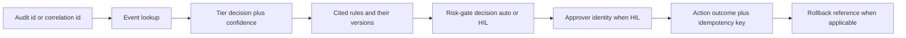

# 운영과 검증(Operating and Verification)

새로 프로비저닝된 배포부터 FDAI가 **살아 있고, 올바르며, 정상 동작 중**인지 어떻게
아는가. 이 문서는 **자체 관측성(self-observability)** : 시스템이 자신에 대해 어떻게 보고하는가.
시스템이 **감시하는 환경에 대해 감지하는 것**인
[observability-and-detection-ko.md](observability-and-detection-ko.md) 와 구별됩니다. 프레젠테이션
/ 대시보드 레이아웃은 이 문서의 범위 밖입니다.

[deploy-and-onboard-ko.md](deploy-and-onboard-ko.md) (프로비저닝) 과
[startup-and-lifecycle-ko.md](startup-and-lifecycle-ko.md) (부트스트랩) 보완. Azure 초점:
비-Azure 프로바이더는 TBD
([Implementation Focus](../../.github/copilot-instructions.md#implementation-focus-must)).

## 자체 헬스 신호(Self-Health Signals)

건강한 배포가 지속적으로 emit해야 하는 신호. 모든 신호는 알림 규칙에 1:1 매핑 (
[Alert Routing](#alert-routing) 참조).

| 신호 | 목적 | 잡히는 실패 모드 |
|------|------|----------------|
| **Liveness probe** (컨테이너별) | 컨테이너 프로세스 살아있음 | crash loop |
| **Readiness probe** (컨테이너별) | 의존성 도달 가능 | Kafka 브로커 / Key Vault reference / DB 없이 부팅 |
| **Adapter healthcheck** (provider 어댑터별) | Kafka 브로커 도달 가능 (Event Hubs `:9093`), Key Vault reference 해석 가능, Diagnostic-Settings 포워더 건강, OPA에 카탈로그 로드, T2 모델 엔드포인트 도달 가능 | 조용한 의존성 드롭 |
| **Event lag** (ingest부터 첫 티어 결정까지) | 티어별 지연 | ingress backpressure |
| **DLQ depth** (큐/토픽별) | dead-letter 누적 | poison 메시지, 컨슈머 실패 |
| **Cold-start rate + duration** | scale-to-zero warm-up 비용 | 데드라인 미스 (HIL로 라우팅) |
| **Verifier failure rate** | T2 verifier abstain / fail 비율 | verifier 정확도 드리프트 |
| **Mixed-model disagreement rate** | 교차 검사 불일치 | 모델 저하 |
| **Rollback rate** | 나중에 되돌린 액션 | 잘못 조정된 규칙이나 액션 |
| **Override rate** | 규칙당 override 생성/수정 | 잘 맞지 않는 규칙 (discovery 루프에 공급) |
| **Discovery loop pass rate** | 후보 → quality gate 통과 % | 루프 드리프트 |
| **Kill-switch state** | on / off | 억제된 비상 자세 |
| **Canary result** | 합성 루프 왕복 | 조용한 ingress 사망 |
| **Time since last successful canary** | 신선도 | 모니터의 모니터 |

신호는 OpenTelemetry로 설정된 backend로 emit
([deployment-ko.md#observability-slos-and-alerting](deployment-ko.md#observability-slos-and-alerting)).

## 합성 카나리 이벤트(Synthetic Canary Event)

Scale-to-zero, 이벤트-기반 시스템은 특정한 조용한 실패 모드가 있음: **이벤트가 도착하지 않음
→ 건강해 보임**. 완화: 주기적 카나리.

- 알려진 페이로드의 **합성 이벤트** 가 카나리 서비스에서 실제 이벤트가 사용하는 같은 이벤트
  버스로 고정 주기로 emit.
- 카나리 이벤트는 마커를 운반하여 **리스크 게이트가 항상 no-op 감사 엔트리로 short-circuit** -
  절대 어떤 리소스도 변형하지 않음.
- **전체 루프** - `ingest → correlation → tier decision → audit entry` - 이 bounded 예산 내에
  완료되어야 함; 완료 실패는 [operational 라인](#alert-routing) 에서 SLO-burn 알림 발동.
- 카나리는 **버전됨**, **속도 상한**, idempotency 키가 실제 이벤트와 구별되어 카나리 샘플이
  회귀 측정이나 자율 discovery 루프의 observe 스테이지를 오염시킬 수 없음.
- 카나리는 **kill-switch on** 과 **kill-switch off** 상태 모두에서 실행되어 kill-switch 자체가
  증명되어 유지.

**TBD**: 카나리 주기, 정확한 페이로드 형상, 왕복 예산.

## Post-Deploy Smoke 테스트

모든 승격 후 라이브 배포에 대해 실행되는 자동 테스트. 실패한 smoke 테스트는 **승격을 중단하고
트래픽을 롤백**
([deployment-ko.md#release-and-rollback](deployment-ko.md#release-and-rollback)).

1. **Adapter 도달성** - Kafka 왕복 (Event Hubs `:9093` 프로브 토픽에 produce + consume),
   Key Vault reference 해석, probe 테이블에 DB write + delete,
   T2 모델 엔드포인트 저비용 ping (모델별, 교차 검사 대상 포함).
2. **Config 로드** - 배포된 이미지가 자신의 버전, 카탈로그 ref, config 해시를 보고; 값들이
   예상 릴리스 매니페스트와 일치.
3. **카나리 왕복** - 하나의 합성 이벤트 발사, 감사 엔트리가 예산 내에 랜딩 검증.
4. **Shadow 결정 정확성** - 대표 이벤트 픽스처 세트를 shadow 모드로 공급; 판정이 golden 기대와
   일치 (회귀 스위트).
5. **Kill-switch 검사** - kill-switch **on** 토글, 윈도우 동안 모든 액션이 abstain 검증
   (카나리로 프로빙); **off** 토글, 정상 결정 재개 검증. 두 상태 모두 감사 엔트리를 남김.
6. **HIL dry-run** - 합성 고위험 finding이 HIL 채널로 라우팅, 승인자가 승인(실행하지 않는
   dry-run harness에서), 감사 트레일이 두 hop 모두 기록.

**TBD**: 픽스처 구성, 스텝별 예산, 승격-게이트 배선.

## Alert Routing

두 독립적인 라인, 각각 소유자와 채널. 구체적 채널 이름/소유권 매트릭스는 포크 책임. 채널
선택, 신뢰 티어링, fallback 규칙은
[channels-and-notifications-ko.md](channels-and-notifications-ko.md) 에 정의; 이 섹션은 그
모델의 알림-측 뷰.

| 라인 | 신호 소스 | 라우트 |
|------|-----------|--------|
| **Operational** | SLO burn, DLQ depth, verifier 실패율, cold-start 데드라인 미스, adapter 불건강, canary miss, IaC drift, 시크릿 만료 임박 | on-call 로테이션 (paging 채널) |
| **HIL** | 고위험 finding, enforce-promotion 요청, override 요청, exemption-expiry 경고, break-glass 요청 | Teams HIL 채널 |

모든 알림에 적용되는 규칙:

- 알림은 **actionable** 해야 함: 각 알림은 (a) 대시보드 패널, (b) 런북, (c) 해당하면 상관
  감사 id에 링크.
- **De-duplication**:
  [observability-and-detection-ko.md](observability-and-detection-ko.md) 의 상관관계 규칙에
  따라 상관된 알림은 접힘; 한 근원의 알림 폭풍은 여러 페이지가 아니라 하나의 페이지.
- **Fallback 채널**: 주 채널(Teams / paging) 도달 불가 시 HIL 항목은 상태 저장소에 큐잉되고
  보조 채널로 알림; fallback 경로에서 auto-execute 없음.

**TBD**: 구체적 채널-소유권 매트릭스와 fallback 채널 선택.

## 감사 조사 흐름

상관 id 또는 감사 id를 주면 운영자가 고정 경로를 걷습니다. 각 hop은 검색이 아니라 **쓰기
시점에 캡처된 저장 링크** - 왕복은 O(1) 조회.

감사 기록은 [security-and-identity-ko.md](security-and-identity-ko.md) 에 따라 append-only이며
hash-chain됨; 같은 워크는 shadow와 enforce 이벤트에 대해 동작(모드가 모든 엔트리에 기록됨).

## 런북 세트

모든 자동 액션은 운영자 대상 런북을 가짐. 런북은
[generic-scope.instructions.md](../../.github/instructions/generic-scope.instructions.md) 에
따라 **fork-local** `runbooks/` 폴더에 존재(상류에 커밋되지 않음). 상류는 **런북 템플릿 +
필수 섹션** 을 제공; 구체적 텍스트는 포크별 작성.

| 런북 | 목적 | 트리거 |
|------|------|--------|
| **Kill-switch drill** | 모든 auto-execution 중단, 모든 경로가 abstain 검증 | 운영 인시던트, 스케줄 드릴 |
| **DLQ drain** | dead-lettered 이벤트 검사, 리플레이, 또는 폐기 (idempotency-key 가드 포함) | DLQ depth 알림 |
| **Drift 조정** | IaC drift를 PR로 조정 (조용한 apply 없음) | 스케줄 drift 알림 |
| **Application rollback** | 이전 컨테이너 revision으로 트래픽 시프트 | SLO burn, 에러 스파이크, smoke-test 실패 |
| **Action rollback** | 액션당 변경 되돌리기(git revert, snapshot restore, replica-promotion undo) | rollback 요청, auto-demotion |
| **DR failover** | state + 백업으로부터 컨트롤 플레인을 대체 리전으로 실패 이관 | 리전 outage |
| **Override 철회** | 활성 override 제거, 해당 스코프의 기저 규칙 재활성화 | 규칙 개정, 리스크 변경 |
| **Catalog rollback** | 이전 rule-catalog 버전으로 되돌리기 | 나쁜 규칙 세트 승격 |
| **Break-glass** | 감사 + 자동 만료 하에 범위된 비상 접근 부여 | 검증된 비상 |

모든 런북이 명시해야 하는 것:

- **전제조건** (권한, 선행 알림).
- **정확한 명령** (또는 정확한 콘솔 네비게이션), copy-paste 가능.
- **검증** (동작했음을 증명하는 무엇을 확인).
- **런북 자체의 롤백** (운영자 스텝의 undo).
- 런북이 남기는 **감사 트레일**.

**TBD**: 런북 템플릿과 그 필수-섹션 스키마.

## 버전과 설정 노출

시스템은 언제든 특별 접근 없이 기계-읽기·사람-읽기 가능하게 노출해야 함:

- 배포된 이미지 **digest** 와 semantic 버전 태그.
- 규칙 카탈로그 **버전 태그 + 컨텐트 해시**.
- **Config 해시** (라이브 런타임 설정에 대한 안정 합; 시크릿 제외).
- 규칙별 **effect + enforcement 플래그** - 각 규칙/스코프에 대해 "지금 무엇이 enforce 되는가".
- 스코프별 **override 카운트** (리스트 뷰에 링크).
- **자율 discovery 루프 상태** (활성/비활성, 마지막 사이클 타임스탬프, 마지막 사이클 통과율).
- **마지막 성공 카나리** 이후 경과 시간.
- **Kill-switch 상태** 와 현재 윈도우의 **break-glass 사용**.

컨텐트만; 프레젠테이션 / 대시보드 레이아웃은 별도 정의.

## Open Decisions

- [ ] 합성 카나리 주기, 페이로드 형상, 왕복 예산.
- [ ] Smoke-테스트 스위트 구성(픽스처 세트, 스텝별 예산, 승격-게이트 배선).
- [ ] 알림 채널 소유권 매트릭스(포크 vs 상류) 와 fallback 채널 선택.
- [ ] 런북 템플릿 - 필수 섹션, 포맷, 모든 자동 액션에 런북 존재 여부 CI 검사.
- [ ] 감사 조사 흐름을 위한 보존 윈도우와 쿼리 모델.
- [ ] Cold-start 데드라인 값
      ([startup-and-lifecycle-ko.md](startup-and-lifecycle-ko.md#cold-start-scale-to-zero-specifics) 와 공유).
