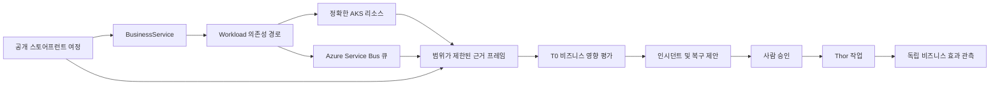

# AKS 상거래 비즈니스 시나리오

이 문서는 공개 Azure Kubernetes Service(AKS) 스토어프런트를 비즈니스 서비스 목표,
워크로드 근거, 결정론적 진단, 통제된 복구에 연결하는 재사용 가능한 상거래 시나리오를
정의합니다. 고정된 FDAI 에이전트 판테온을 사용하며 클러스터 신원, 도메인, 인증서,
엔드포인트, 자격 증명, 승격 상태는 배포 구성에 둡니다.

> **범위:** 이 시나리오는 일반적인 상품 탐색 및 주문 처리 서비스의 복원력을
> 시연합니다. 상위 AKS Store Demo를 운영 환경용 참조 아키텍처로 간주하지 않습니다.
>
> **권한 경계:** 브라우저 검사, 원격 분석, 진단, 계획 수립은 읽기 전용입니다.
> Kubernetes 변경은 일반 안전성 검토, 사람 승인, 승격, 독립 효과 검증 요건을
> 충족할 때까지 관찰 모드에 머뭅니다.

## 설계 개요

이 시나리오는 검토된 비즈니스 토폴로지를 정확한 AKS 리소스 위에 투영합니다. 범위가
제한된 수집기는 Kubernetes 상태, Azure 메시징 메트릭, 워크로드 SLO, 브라우저 관측을
결합합니다. 그 다음 T0 결정론적 리듀서가 명시적인 근거 공백과 함께 하나의 비즈니스
영향 평가를 기록합니다. 동일한 평가는 인시던트를 열고 복구를 제안할 수 있지만 실행
권한을 부여하지 않습니다.

## 비즈니스 토폴로지

패키지는 두 비즈니스 서비스와 해당 배포 워크로드를 선언합니다.

| 비즈니스 서비스 | 워크로드 | 필수 의존성 경로 |
|------------------|----------|------------------|
| 상품 탐색 | 스토어프런트, 상품 API | 스토어프런트 -> 상품 API |
| 주문 처리 | 스토어프런트, 주문 API, 큐, 주문 처리기, 주문 저장소 | 스토어프런트 -> 주문 API -> 큐 -> 주문 처리기 -> 주문 저장소 |

시나리오는 `BusinessService`, `Workload`, `ServiceObjective`, `implemented_by`,
`workload_depends_on`, `service_has_service_objective`를 재사용합니다. 배포 구성은 각
워크로드를 정확한 현재 Resource에 연결합니다. 서비스와 리소스 간 매핑이 없거나
충돌하면 평가를 판단 보류 상태로 유지합니다.

## 근거 계약

하나의 평가는 공통 시간 구간을 사용하며 출처 신원, 범위, 기준 시점, 최신성, 완전성,
출처, 합성 여부를 보존합니다.

| 근거 범주 | 필수 관측 | 실패 동작 |
|-----------|-----------|-----------|
| Kubernetes | 정확한 Deployment, Pod, Service, EndpointSlice, 리비전, 준비 상태 근거 | 신원이 없거나 세대가 불완전하면 사용할 수 없습니다. |
| 메시징 | 하나의 큐에 대한 활성, 수신, 완료, 포기, 배달 못 한 편지 메시지 수 | 큐 차원이 없거나 구간이 잘리면 사용할 수 없습니다. |
| 브라우저 근거 | 안정적인 선택자를 사용하는 읽기 전용 HTTPS 스토어프런트 캡처 | 리디렉션, DNS, 정책, 선택자 실패 시 사용할 수 없습니다. |
| 합성 여정 | 상품 탐색, 장바구니, 주문 제출, 범위가 제한된 완료 관측 | 고객 또는 주문 페이로드를 보존하지 않고 실패 단계와 시간을 기록합니다. |
| 워크로드 SLO | 가용성, 지연 시간, 주문 완료 최신성 평가 | 표본이 부족하면 정상 결과로 바꾸지 않습니다. |
| 변경 근거 | 현재 워크로드 리비전 및 범위가 제한된 배포 변경 참조 | 시간상 인접성은 가설을 지원할 수 있지만 원인을 증명하지 않습니다. |

Browser Evidence는 계속 `GET`과 `HEAD`만 허용합니다. 상태를 변경하는 주문 제출 여정은
신원 권한이 없는 별도 Playwright 작업자에서 실행하고 집계 관측만 내보냅니다. 이
작업자는 현재 유효하고 범위가 제한된 standing authorization 참조를 요구하며 같은
출처의 `POST /api/orders` 하나만 허용합니다. 클라우드 관리 신원, 파일 접근, 클립보드
접근, 작업 권한은 갖지 않습니다.

작업자는 가로챈 각 요청을 보내기 직전에 권한을 다시 확인하고, 허용된 주문 POST 한 번을
전송 전에 집계합니다. 중복 POST, 다른 출처 요청 또는 만료된 권한은 화면에 성공 대화상자가
표시되더라도 여정을 무효로 만듭니다. 브라우저 시작, 탐색, 주문 제출에 하나의 전체 시간
제한을 적용하며, 결과에는 시작 시각이 아니라 완료 시각을 기록합니다. 이러한 검사는 임의의
권한 참조를 인증하거나 배포 격리를 증명하지 않습니다. 해당 전제 조건은 작업자 활성화 시
별도로 충족해야 합니다.
여정이 성공하려면 정확히 제출된 주문 POST에 대한 2xx 응답도 필요합니다. 성공 대화상자가
표시되어도 HTTP 응답이 없거나 실패하면 성공으로 처리하지 않습니다. 주문 본문 없이 HTTP
상태만 보관하며, 전송 접수만으로 주문 처리 완료를 증명하지는 않습니다.

## 결정론적 평가

리듀서는 정확히 하나의 기본 상태와 0개 이상의 보조 신호를 반환합니다.

| 상태 | 최소 근거 |
|------|-----------|
| `healthy` | 완전한 필수 출처, 정상 SLO, 준비된 의존성 경로, 증가하지 않는 백로그 |
| `catalog_unavailable` | 상품 탐색 여정 실패와 상품 API 엔드포인트 또는 워크로드 사용 불가 |
| `order_backlog` | 구간 내 수신량이 완료량을 초과하고 활성 메시지가 증가 |
| `dead_letter_growth` | 완전한 큐 구간에서 배달 못 한 편지 수가 증가 |
| `dependency_pressure` | 큐 또는 주문 저장소 압력이 저하된 주문 처리 SLO와 일치 |
| `deployment_regression` | 알려진 리비전 이후 SLO 저하와 정확한 롤아웃 실패 근거 |
| `recovered` | 이전 저하 평가 뒤 완전하고 정상인 비즈니스 및 리소스 근거 |
| `held` | 필수 근거가 없거나 오래되거나 충돌하거나 잘렸거나 모호하게 매핑됨 |

평가는 영향받는 비즈니스 서비스와 의존성 경로를 식별합니다. 출처가 완전한 구간을
증명할 때만 수치를 보고합니다. Kubernetes 상태만으로 매출, 영향받은 사용자, 근본
원인을 추론하지 않습니다.

정상 및 복구 결과에는 서비스별 합성 가용성 관찰의 성공, 모든 워크로드의 명확한 준비 상태,
모든 SLO의 명확한 미위반 상태가 추가로 필요합니다. 알려진 저하 분류에 해당하지 않으면서
이러한 정상 근거 중 하나라도 없으면 `health_not_proven`을 기록하고 `held`를 유지합니다.
큐에 적체가 없더라도 주문 접수 실패를 정상이나 복구로 처리하지 않습니다. 이 검사는 주문
접수 탐지기를 구현하거나 인시던트를 생성하거나 권한을 부여하거나 복구를 승인하지 않습니다.

## 에이전트 책임

### 주문 접수 전용 감지기

**초기 설계:** RabbitMQ 기반 데모에서는 필수 큐 메트릭 수를 줄여 기존 주문 처리 투영을
재사용합니다. **검토:** 이 방식은 관측하지 않은 처리와 배송을 정상으로 표현하고, 승인된
시험 트래픽을 조작된 근거와 혼동하게 만듭니다.

**수정 설계:** 기존 주문 처리 계약은 유지합니다. 별도의 `OrderAcceptanceAnalyzer`는
명시적으로 연결된 Deployment 하나에 대한 공통 Analyzer 발견 사항만 생성합니다. 시간 제한이
있는 운영 의도에는 클러스터, 네임스페이스, 이름, 불변 UID, Resource 참조, 최소 복제본 수,
서로 다른 실패 관측의 임계값을 지정합니다. 현재 Kubernetes 관측과 순서가 있으며 중복되지 않는
주문 접수 시도는 구성된 최신성 구간에 속해야 합니다. 샘플이나 알 수 없는 결과는 장애 또는
복구의 근거가 되지 않습니다. 합성 고객 트래픽은 계속 합성 트래픽으로 표시하며 운영 트래픽으로
바꿔 표시하지 않습니다.

원본 어댑터는 근거를 정규화할 뿐 신뢰를 부여하지 않습니다. Incident 게시 전에 별도로 주입된
검증기가 시험 주문 권한 참조를 포함한 정확한 운영 의도와 관측의 다이제스트에 대해 보관된
확인 기록을 인증해야 합니다. 검증 누락, 불완전하거나 충돌하는 근거, 만료된 운영 의도,
UID 불일치, 오래된 관측 또는 부족한 시험 횟수는 발견 사항 생성을 보류합니다. 패키지는
무조건 허용하는 검증기를 제공하지 않습니다. 배포에서 실제 확인 기록 검증 어댑터와 읽기 전용
관측 어댑터를 연결한 뒤 감지기를 등록해야 합니다.

보관된 확인 기록의 검증 어댑터는 배포에서 고정한 Ed25519 공개 키와 필드가 엄격히 제한된
`aks-commerce.acceptance-receipt` 버전 `1.0.0` 기록을 사용합니다. 서명은 근거 다이제스트,
정책, 대상, 발급자, 수집기, 시험 주문 권한 참조 및 유효 시간을 묶습니다. 최신 신뢰 상태를
읽어 해당 키가 철회되지 않았음을 명시적으로 확인해야 합니다. 검증기는 서명 키나 실행기
자격 증명을 갖지 않습니다. 수집기, 확인 기록 발급자 및 실행기의 신원은 서로 달라야 하며,
기록의 진위 확인이 신뢰할 수 있는 수집이나 공급자 효과 검증을 대신하지는 않습니다.
패키지는 I/O를 수행하지 않는 `AcceptanceReceiptIssuer`를 제공합니다. 이 구성 요소는 발급자,
수집기 및 실행기의 서로 다른 신원을 요구하고, 정확한 근거에서 검증 참조를 파생하며, 주입된
Ed25519 키로 필드가 제한된 확인 기록에 서명합니다. `AcceptanceTrustLifecycle`은 키 ID 하나를
한 번만 활성화하고 철회를 별도의 변경 불가능한 감사 marker로 기록합니다. 같은 철회 재전달은
무작업이며 공개 키 검증기는 사용할 때마다 marker를 확인합니다. 두 구성 요소 모두 비공개 키를
불러오거나 수집기를 인증하거나 데이터베이스 역할을 부여하거나 작업을 시작하지 않습니다. 키
mount, 인증된 원본 수집, 신뢰 소유자 신원, 분리된 데이터베이스 권한 및 작업 예약은 계속
배포에서 관리합니다.

실제 Kubernetes 읽기 어댑터는 GET만 사용하고 Deployment와 Service UID, 제어기 세대,
선택자, EndpointSlice 소유권 및 준비된 엔드포인트의 Pod-ReplicaSet-Deployment 연결을
검증합니다. 대상 버전을 다시 읽고 잘린 목록과 조회 중 변경을 거부하며, 응답당 256 KiB와
전체 스냅샷 5초로 제한합니다. 관측자의 읽기 권한은 Thor의 확장 권한과 분리합니다.
불변 관측과 확인 기록은 기존 상태 저장소와 기록별 원자적 감사를 사용합니다. 저장 전에
서명을 확인하고 Analyzer가 사용하는 시점에도 다시 검증합니다.

패키지 진입점 `fdai-aks-commerce-analyze`는 배포된 환경에서 제한된 관측 주기 하나를
실행합니다. `FDAI_AKS_ACCEPTANCE_JSON`에는 `intent`, `trust`, `executor_identity`,
`severity`, `publication_window_seconds`만 포함합니다. 신뢰 항목은 발급자, 수집 신원 및
공개 키 바이트만 담습니다. 기존 `FDAI_STATE_STORE_DSN`, `FDAI_MI_CLIENT_ID`,
`KAFKA_BOOTSTRAP_SERVERS`, `KAFKA_TOPIC_EVENTS`로 서비스 소유 저장소와 관측 전용
이벤트 버스를 연결합니다. 작업은 공통 발행 원장과 발견 사항 저장소를 사용하며, 운영 환경에서
메모리 저장소로 대체하지 않습니다. 구성이나 근거가 없으면 준비 상태를 실패로 처리합니다.
독립 발급자의 키 연결, 인증된 시험 주문 수집, 신뢰 소유자 런타임 연결, 최소 데이터베이스
권한 및 작업 예약은 배포에서 제공해야 합니다. 라이브러리 구성 요소 설치만으로 실제 관측
루프가 성립하지는 않습니다.
진입점은 공통 실행 위치 및 버스 보안 해석기를 사용합니다. 시작 또는 공급자 호출이 실패하면
공급자 진단 원문 대신 고정된 사용 불가 이유와 0이 아닌 종료 상태를 반환합니다.

주문 접수가 반복해서 실패하고 설정된 복제본과 준비된 복제본이 모두 0이며 준비된 서비스
엔드포인트도 없으면 `aks_commerce.order_acceptance_unavailable`을 생성합니다. 유지보수,
HPA 제어 및 경쟁하는 다른 작성자가 모두 명시적으로 없을 때만 별도의 비활성 `ops.scale-out`
후보로 0에서 검토된 최소 복제본 수까지 복원할 수 있습니다. 후보는 관측된 UID와 리소스 버전을
유지하며 승인, 승격 또는 실행 권한을 부여하지 않습니다. 접수 성공에는 준비된 복제본,
엔드포인트 및 주문의 긍정적 근거가 필요하며, 이것만으로 Incident를 종료하지 않습니다.
공통 게시 경로와 Heimdall이 이벤트 중복 방지 및 Incident 소유권을 유지하고, Thor만 별도로
허용된 작업을 실행합니다. 주문 처리, 결제, 배송 및 매출은 이 감지기의 범위가 아닙니다.

### 인시던트 수신과 Thor 소유 실행

**초기 통합 설계:** 감지기의 작업 인자를 이벤트에 전달하거나 자동 발견 사항을 운영자 요청으로
전달합니다. **검토:** 첫 방식은 생성자가 제어하는 작업 데이터를 신뢰하고, 두 번째 방식은
실재하지 않는 사람 요청자를 만듭니다. 승인을 받아도 오래된 관측이 최신으로 바뀌지는 않습니다.
**수정 설계:** 정확한 정규 이벤트
`analyzer.aks_commerce.order_acceptance_unavailable.observed`를 `AnomalyActionSource`로
Forseti에 등록합니다. commerce 조회기는 감지 단계와 같은 보관 원본 및 서명 검증을 사용합니다.
Forseti는 최신의 정확한 대상 후보를 조회하고 별도 사람 승인을 요구하며 기존 위험 및 맥락
상한을 유지합니다. 원본 조회가 실패해도 다른 규칙으로 대체하지 않습니다.

`AcceptanceGuardedExecutor`는 Thor의 기존 실행기에 전달하기 직전에 서명된 근거를 다시
읽습니다. 근거가 없거나 인자가 바뀌면 승인된 ActionRun을 수정하지 않고 전달을 보류합니다.
이 검사는 7개 안전장치, 승격, 현재 사람 권한 또는 격리된 전송 경로를 구현하거나 대신하지
않습니다. 로컬 테스트는 실제 Huginn, Heimdall, Forseti, Var, Thor 처리기를 연결해 승인 전
실행 없음, 승인 후 단일 실행, 중복 억제, 근거 철회, 승인 신원 변경, shadow 모드 및 감사
의존성 부재에 따른 거부를 확인합니다. 테스트의 권한과 외부 효과는 합성 입력이며 실제 승인이
아닙니다. 실제 워크로드를 복구하려면 운영 활성화와 독립된 효과 종결에 필요한 입력을 연결하고 검증해야
합니다.

자료 저장소는 원래 정규 scale Action을 이상 신호의 상관관계 및 ActionRun 멱등성 키와
구분해 보존합니다. 격리 발행 어댑터는 불변 자료를 읽고 기존 안전장치 클라이언트의 최종
발행 경계에서 서명된 근거와 현재 권한을 다시 확인합니다. 자료가 없거나 교체, 만료 또는
손상되면 발행을 보류합니다. 불명확하거나 격리된 결과는 알 수 없는 상태로 남으며 복구
성공이나 자동 재시도로 처리하지 않습니다. 어댑터는 원래 승인, 승격 또는 준비 입력을
만들어 대신할 수 없습니다.

**종결 설계:** 브로커나 공급자 증적만으로 불확실한 실행 상태를 해제할 수 없습니다. 일반적인
성공 ActionRun 관측기를 재사용하면 격리된 시도를 놓치거나 전달을 복구와 혼동할 수 있습니다.
설정된 대상과 보존된 주문 접수 Action에 대해서만 최초 종결 계획을 보존합니다. 선택적
래퍼는 원래 종결 내용을 바꾸지 않고 전달합니다. 기존 원자적 종결 저장소가 상태를 대조해
종결하려면 독립적으로 서명된 잠금 해제 이후의 근거가 원래 Action, 해제된 잠금, 대상 세대 및
이전 종결 상태와 일치해야 합니다. 다른 대상과 사람 접근 종결은 기존 동작을 유지합니다.
원본 맥락이 없으면 보류하며 잠금 해제 증적을 만들거나 작업을 사후 승인해서는 안 됩니다.

설치된 `aks-commerce-closure` 공급자는 주문 접수 구성이 있을 때만 기존 종결 저장소를
감쌉니다. 설정된 대상의 준비된 Action에 대해 정확한 최초 맥락을 보존하고 원래 결정은 바꾸지
않고 전달합니다. Action 자료에는 원래 관측 참조도 포함됩니다. 이전 자료도 읽을 수 있지만
관측 참조가 없으면 효과 종결을 증명할 수 없습니다. Thor는 원래 명령 원장에서 다시 확인한
명령 ID만 연결합니다.

Heimdall의 기존 ActionRun 훅은 `execution_unknown`을 포함한 비-shadow 주문 접수 시도를
관측합니다. 대조기는 원래 명령, 일치하는 공급자 증적, 전체 Action 다이제스트, 잠금 해제
근거, 대상 세대 및 이전 격리 상태를 읽습니다. 공급자 완료와 최초 종결 모두 이후의 새
리소스·주문 관측이 서명으로 확인되어야 독립 감사 근거를 보존하고 기존 원자적 대조 빌더를
사용합니다. 신원 불일치, 오래되거나 철회된 근거, 주문 실패 또는 잠금 해제 맥락 누락은
격리를 해제하지 않습니다. 정확한 과거 재전달은 현재 건강 상태를 주장하거나 감사 전이를
추가하지 않고 보존된 종결만 반환합니다. 다른 대상과 shadow 실행은 기존 동작을 유지합니다.
명령이나 효과 근거가 없으면 다시 처리할 수 있는 핸들러 실패를 반환합니다. 따라서 기존
at-least-once 전달은 지연된 근거가 도착한 뒤 원래 ActionRun을 다시 처리할 수 있으며, 과거
종결 재생은 변경 작업을 다시 전달하지 않습니다. 정확한 종결 뒤 Heimdall은 기존 복구 관측
토픽에 검증된 효과 기록 하나를 게시합니다. Thor는 원래 Action, 대상, 매개 변수 및 멱등성
세대를 다시 확인한 뒤 단독으로 `execution_unknown`을 `succeeded`로 바꾸고 종결 및 효과
참조를 보존하며 `operational_success=true`와 `effect_verification_status=verified`를
게시합니다. 별도의 내부 소비자는 해당 감지 에피소드가 열릴 때 원자적으로 연결된 Incident
ID만 최소 합법 수명 주기 경로로 종결합니다. 이 방식은 같은 리소스에서 나중에 발생한
에피소드를 잘못 종결하지 않습니다. Console은 권위 있는 최종 ActionRun 및 Incident 변환
결과를 재사용하며 브로커 또는 공급자 접수로 성공을 추론하지 않습니다.

`PreparedAcceptanceSource`는 승인용 결정 게시 전에 Forseti 아래에서 실행됩니다. 서명된
관측과 정확한 인자를 다시 검증하고 자동 트리거 및 카탈로그 스키마를 확인한 뒤 공유
ActionBuilder와 RiskGate를 사용합니다. 원래 Action과 검토한 Rule 다이제스트를 원자적
감사와 함께 보존합니다. 정확한 재전달은 같은 자료를 재사용하며 변경된 인자, 정책 또는
모드로 자료를 교체하지 않습니다. 준비가 없으면 shadow를 유지합니다. 제공된 scale ActionType은
독립된 두 사람의 승인을 요구하며 준비 단계가 정족수를 줄이거나 기존 상한을 높일 수 없습니다.

`AcceptanceCurrentAuthority`는 정책을 갱신하고 원래 Rule 및 ActionType 내용을 대조하며
공유 위험 표와 승격 상태를 적용한 뒤 Var의 영속 최종 승인을 읽습니다. 서로 다른 승인자의
현재 자격, 원래 승인 만료 시각 및 안전 상태를 다시 확인합니다. 발행 어댑터는 공유 격리
클라이언트의 발행 경계에서 이 검사를 반복합니다.
Core는 시작할 때 `FDAI_AKS_ACCEPTANCE_JSON`이 있는 경우에만 설치된 `fdai.acceptance_recovery`
진입점 중 `aks-commerce` 하나를 로드합니다. `FDAI_AKS_ACCEPTANCE_RULE_ID`는 로드된
카탈로그의 검토 완료 Rule을 선택합니다. 해당 Rule은 `fdai.aks_commerce.order_acceptance.v1`,
`kubernetes.deployment`, `ops.scale-out`을 참조해야 합니다. Rule이 없거나 다른 감지기를
가리키거나, 영속 승격 또는 격리 안전장치 연결이 없거나,
`FDAI_PANTHEON_APPROVER_ACTIONS_JSON` 정책이 없으면 조립을 거부합니다. 시작 과정은 관측,
승인, 승격 또는 공급자 효과를 만들지 않습니다. 다른 대상은 기존 Thor 전달기를 유지합니다.
패키지는 런타임이 이미 소유한 StateStore, ActionBuilder, RiskGate, 위험 표, 승격 갱신,
승인 정책 및 안전 상태를 사용합니다. 안전 상태가 연결되지 않으면 보류합니다.
실제 원본 발급, 독립된 효과 종결, 적격한 승격 및 배포된 관측자와 실행기의 정확한 범위는
계속 필요합니다. 패키지를 로드했다는 사실만으로 이 요건을 충족하지는 않습니다.

구성 진입점은 `AksCommerceAnalyzer`를 공용 `InvestigationCoordinator` 및
`AnalyzerTickRunner`에 등록할 수 있습니다. 상거래 조정기는 평가를 먼저 보관하고, 분석기는
완전하고 현재 유효한 장애 관찰을 반환합니다. 공용 실행기가 이벤트 발행, 영속적인 중복
억제, 전송 결과가 불확실할 때의 대조 확인을 담당합니다. 에이전트를 직접 호출하거나
인시던트를 직접 기록하지 않습니다. Huginn이 이벤트를 정규화하고, Heimdall이 기존 반복
근거 및 심각도 정책을 적용한 뒤 공식 인시던트 수명 주기로 사례를 생성합니다. 같은 평가를
재생하면 이벤트 식별자를 유지합니다. 설정된 발행 시간 구간이 다르면 같은 대상의 상관관계
안에서 별도 근거로 유지합니다. 발행이 실패하거나 결과가 불확실하면 전달 성공으로 보고하지
않습니다. 서버 소유 설정이 정확한 대상, 정식 리소스 종류, 심각도, 발행 간격 및 근거의
최대 허용 경과 시간을 지정합니다.

명시적인 이벤트 버스 연결과 정확한 서비스별 대상 설정이 없으면 발행하지 않습니다. 이
연결은 보류, 정상, 복구, 오래된 평가 및 합성 평가를 인시던트 생성 신호로 사용하지 않습니다.
보관된 평가나 브로커 접수 결과는 작업 권한을 부여하지 않습니다. 주문 접수 전용 감지기는
이 투영 대신 앞에서 정의한 별도의 근거 프로필을 사용합니다.
런타임 등록과 실제 워크로드, SLO 및 지표 출처는 배포 연동이 더 필요합니다. 공개된 어댑터만으로
관찰 루프를 시작하거나 실제 기록을 생성하지는 않습니다.

Thor는 유일한 실행 에이전트입니다. 격리 실행기는 Thor의 실행 런타임이며, 두 번째 에이전트나
독립적인 복구 결정 주체가 아닙니다. 기존 승인 및 승격 경로를 통과하고 안전장치에 연결된
Thor 소유 명령에 대해서만 Kubernetes API를 호출합니다. Heimdall은 효과를 독립적으로
검증하며, Console과 상거래 조정기는 변경 자격 증명을 갖지 않습니다. 이 연결은 프로세스를
통합하거나 로컬 실행 권한을 활성화하지 않습니다.

에이전트 이름이나 역할 연결은 바뀌지 않습니다.

- **Huginn**은 정규화된 여정, 메시징, Kubernetes, 변경 수신을 담당합니다.
- **Heimdall**은 이상, SLO, 독립 복구 관측을 담당합니다.
- **Forseti**는 결정론적 비즈니스 영향 평가와 근거 기반 RCA를 담당합니다.
- **Freyr와 Njord**는 범위가 제한된 용량 및 비용 조언을 제공합니다.
- **Odin**은 서비스 복구, 변경 안전성, 비용 목표를 중재합니다.
- **Var**는 필요한 현재 사람 승인을 전달합니다.
- **Thor**는 자격을 갖춘 정확한 대상 작업만 전달합니다.
- **Vidar와 Saga**는 롤백 준비 상태와 추가 전용 감사 근거를 보존합니다.
- **Bragi**는 오퍼레이터의 로캘로 평가를 표시합니다.

## 통제된 Kubernetes 작업

첫 작업 집합은 의도적으로 좁게 유지합니다.

| 작업 | 정확한 대상 | 복구 계약 |
|------|-------------|-----------|
| 워크로드 다시 시작 | 컨트롤러가 소유한 하나의 Pod UID | 대체 Pod가 준비됩니다. 되돌릴 수 없는 다시 시작임을 명시합니다. |
| 워크로드 확장 | 하나의 Deployment UID와 관측된 세대 | 검증 실패 시 이전 replica 수를 복원합니다. |
| 롤아웃 되돌리기 | 하나의 Deployment UID와 현재 리비전 | 선택한 롤백으로 복구되지 않으면 작업 전 리비전을 복원합니다. |

일반 AKS 런타임은 등록된 작업을 격리된 실행기로 전달합니다. 해당 ServiceAccount는
구성된 런타임 namespace의 Pod와 Deployment만 변경할 수 있습니다. 상거래 효과 검증기는
시나리오에 한정된 조건부 관측기로 남으며, 일반 런타임에 권한을 부여하거나 실제 복구를
증명하지 않습니다.

각 작업은 관찰 모드로 시작하며 중지 조건, 검증된 롤백, 영향 범위, 성공한 서버 측
dry run, 논리적 대상 잠금, 안정적인 멱등성 키, 2단계 감사를 요구합니다. 성공하려면
별도의 Heimdall 관측이 리소스 복구와 예상 비즈니스 효과를 모두 확인해야 합니다.
Kubernetes API 수락은 성공이 아닙니다.

주문 접수 전용 효과 검증은 작업 소유자가 신뢰할 수 있는 경로로 제공한 정확한 ActionRun,
공급자 확인 기록, 대상 UID, 복제본 수, 적용 시각 및 작업 전 근거 참조를 사용합니다.
모든 복구 시험 주문과 리소스 관측은 적용 시각 이후의 새 근거여야 합니다. 검증기는 새 확인
기록을 인증하고 검증 후에도 최신성을 다시 확인하며, 정확한 목표 복제본 수와 준비된
엔드포인트 및 주문 접수 성공의 긍정적 근거를 요구합니다. `verified`, `not_recovered`,
`held` 근거만 반환하며 Incident를 닫거나 작업을 재시도하거나 승격을 변경하지 않습니다.
실제 실행을 종료하려면 작업 소유자의 인계와 Heimdall 수명 주기 연결이 추가로 필요합니다.

## 공개 스토어프런트 배포

시나리오 랩 프로필은 다음 경계를 사용해 상거래 워크로드를 배포합니다.

- 프로필은 전용 `aks-store-demo` 클러스터를 생성하며 다른 기존 FDAI 또는 공유
  클러스터를 선택하지 않습니다.
- 폐기 가능한 랩은 로컬 구독 인벤토리가 비공개 네트워크 경로 없이 클러스터를 관측할
  수 있도록 AKS 관리 API를 공개합니다. Microsoft Entra 인증, Azure RBAC, 로컬 계정
  비활성화는 계속 필수이며 이 엔드포인트는 익명 접근이나 애플리케이션 접근 권한을
  부여하지 않습니다.
- 스토어프런트만 공개 애플리케이션 표면으로 둡니다.
- 공개 접근은 HTTPS, 배포에서 제공한 DNS 이름, 신뢰할 수 있는 인증서 참조를 사용합니다.
- 관리 UI, API, 큐, 데이터베이스, 실행기는 비공개로 유지합니다.
- 시나리오가 준비되었다고 보고하기 전에 AKS 모니터링, Container Insights, Managed
  Prometheus, 필수 애플리케이션 원격 분석을 사용하도록 설정합니다.
- 배포가 소유하는 association은 Azure Policy가 소유한 유효 subnet NSG를 교체하지
  않습니다. Preflight는 기본 inbound deny rule을 검증하고 private-endpoint subnet과
  stress VM NIC는 명시적인 Terraform 소유 association을 유지합니다.
- 배포는 스토어프런트 URL과 불투명한 리소스 참조를 출력합니다. 테넌트 값을
  커밋하지 않습니다.
- 일반 apply는 모든 교체를 계속 거부합니다. 일회성 `recreate-aks` 작업은 검토된
  비공개-공개 클러스터 교체와 해당 클러스터 범위 역할 할당만 허용하고 정확한 사람
  확인을 요구하며, 그 밖의 모든 파괴적 주소를 거부합니다.

Gateway API를 장기 수신 계약으로 권장합니다. Ingress 호환 프로필은 지원 기간과 이행
경로를 기록한 기간 제한 랩에서만 사용할 수 있습니다.

## 오퍼레이터 환경

Console 경로는 하나의 서비스 중심 인시던트 보기를 제공합니다.

1. 현재 비즈니스 상태와 SLO 영향
2. 정확한 의존성 경로와 영향받는 워크로드
3. 최신성과 공백을 포함한 큐, 브라우저, Kubernetes, 변경 근거
4. 제안됨, 승인 대기, 승인됨, 완료됨 복구 상태
5. 독립 리소스 및 비즈니스 효과 검증
6. 추가 전용 감사 계보

사용할 수 없는 근거는 계속 표시하며 해당 근거 표면으로 연결합니다. 브라우저는 원시
값에서 비즈니스 영향, 권한, 성공을 구성하지 않습니다.

## 전달 및 검증

구현은 다음 의존성 순서로 진행합니다.

1. 비즈니스 토폴로지, 목표, 규칙, 작업 흐름을 패키지로 제공합니다.
2. 범위가 제한된 큐와 브라우저 관측 어댑터를 추가합니다.
3. 결정론적 평가와 내구성 있는 변환 결과를 추가합니다.
4. 인증된 Operator 및 Console 보기를 제공합니다.
5. shadow 우선 Kubernetes 어댑터와 독립 검증을 추가합니다.
6. 공개 HTTPS 시나리오 랩 프로필을 추가합니다.
7. 로컬에서 검증한 뒤 별도로 승인한 실제 Azure 증적을 보존합니다.

실제 배포는 일반 FDAI 정확한 계획 작업 흐름을 사용합니다. 이 설계는 테넌트, 구독,
리소스 그룹, 도메인, 인증서, Terraform 계획을 선택하지 않습니다.
보호된 scenario workflow는 Terraform provider와 backend 접근을 정확하게 검증된 deploy
runner Managed Identity에 결속합니다. Azure CLI session이 클러스터 plan에 사용할 주변
user, service principal 또는 node identity를 선택하지 않습니다.

## 관련 문서

| 알아볼 내용 | 읽을 문서 |
|-------------|-----------|
| 구현 상태와 남은 작업 | [AKS 상거래 구현 ledger](../../roadmap-implementation/operations/aks-commerce-business-scenario.md) |
| 정확한 AKS 리소스 근거 | [AKS 진단 근거 평면](../architecture/aks-diagnostic-evidence-plane-ko.md) |
| 브라우저 수집 제한 | [브라우저 근거 수집](../interfaces/browser-evidence-ko.md) |
| 워크로드 SLO 하위 시스템 | [범위 확장 및 구조적 미비점](../fork-and-sequencing/scope-expansion-ko.md) |
| Kubernetes 작업 안전성 | [실행 모델](../decisioning/execution-model-ko.md) |
