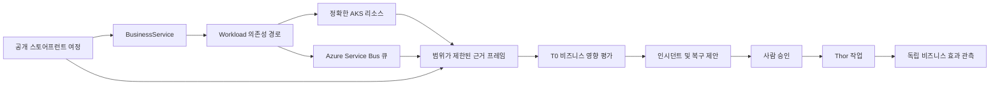

# AKS 상거래 비즈니스 시나리오

이 문서는 공개 Azure Kubernetes Service(AKS) 스토어프런트를 비즈니스 서비스 목표,
워크로드 근거, 결정론적 진단, 통제된 복구에 연결하는 재사용 가능한 상거래 시나리오를
정의합니다. 고정된 FDAI 에이전트 판테온을 사용하며 클러스터 신원, 도메인, 인증서,
엔드포인트, 자격 증명, 승격 상태는 배포 구성에 둡니다.

> **범위:** 이 시나리오는 일반적인 상품 탐색 및 주문 처리 서비스의 복원력을
> 시연합니다. 상위 AKS Store Demo를 운영 환경용 참조 아키텍처로 간주하지 않습니다.
>
> **권한 경계:** 브라우저 검사, 원격 분석, 진단, 계획 수립은 읽기 전용입니다.
> Kubernetes 변경은 일반 안전성 검토, 사람 승인, 승격, 독립 효과 검증 요건을
> 충족할 때까지 관찰 모드에 머뭅니다.

## 설계 개요

이 시나리오는 검토된 비즈니스 토폴로지를 정확한 AKS 리소스 위에 투영합니다. 범위가
제한된 수집기는 Kubernetes 상태, Azure 메시징 메트릭, 워크로드 SLO, 브라우저 관측을
결합합니다. 그 다음 T0 결정론적 리듀서가 명시적인 근거 공백과 함께 하나의 비즈니스
영향 평가를 기록합니다. 동일한 평가는 인시던트를 열고 복구를 제안할 수 있지만 실행
권한을 부여하지 않습니다.

## 비즈니스 토폴로지

패키지는 두 비즈니스 서비스와 해당 배포 워크로드를 선언합니다.

| 비즈니스 서비스 | 워크로드 | 필수 의존성 경로 |
|------------------|----------|------------------|
| 상품 탐색 | 스토어프런트, 상품 API | 스토어프런트 -> 상품 API |
| 주문 처리 | 스토어프런트, 주문 API, 큐, 주문 처리기, 주문 저장소 | 스토어프런트 -> 주문 API -> 큐 -> 주문 처리기 -> 주문 저장소 |

시나리오는 `BusinessService`, `Workload`, `ServiceObjective`, `implemented_by`,
`workload_depends_on`, `service_has_service_objective`를 재사용합니다. 배포 구성은 각
워크로드를 정확한 현재 Resource에 연결합니다. 서비스와 리소스 간 매핑이 없거나
충돌하면 평가를 판단 보류 상태로 유지합니다.

## 근거 계약

하나의 평가는 공통 시간 구간을 사용하며 출처 신원, 범위, 기준 시점, 최신성, 완전성,
출처, 합성 여부를 보존합니다.

| 근거 범주 | 필수 관측 | 실패 동작 |
|-----------|-----------|-----------|
| Kubernetes | 정확한 Deployment, Pod, Service, EndpointSlice, 리비전, 준비 상태 근거 | 신원이 없거나 세대가 불완전하면 사용할 수 없습니다. |
| 메시징 | 하나의 큐에 대한 활성, 수신, 완료, 포기, 배달 못 한 편지 메시지 수 | 큐 차원이 없거나 구간이 잘리면 사용할 수 없습니다. |
| 브라우저 근거 | 안정적인 선택자를 사용하는 읽기 전용 HTTPS 스토어프런트 캡처 | 리디렉션, DNS, 정책, 선택자 실패 시 사용할 수 없습니다. |
| 합성 여정 | 상품 탐색, 장바구니, 주문 제출, 범위가 제한된 완료 관측 | 고객 또는 주문 페이로드를 보존하지 않고 실패 단계와 시간을 기록합니다. |
| 워크로드 SLO | 가용성, 지연 시간, 주문 완료 최신성 평가 | 표본이 부족하면 정상 결과로 바꾸지 않습니다. |
| 변경 근거 | 현재 워크로드 리비전 및 범위가 제한된 배포 변경 참조 | 시간상 인접성은 가설을 지원할 수 있지만 원인을 증명하지 않습니다. |

Browser Evidence는 계속 `GET`과 `HEAD`만 허용합니다. 상태를 변경하는 주문 제출 여정은
신원 권한이 없는 별도 Playwright 작업자에서 실행하고 집계 관측만 내보냅니다. 이
작업자는 현재 유효하고 범위가 제한된 standing authorization 참조를 요구하며 같은
출처의 `POST /api/orders` 하나만 허용합니다. 클라우드 관리 신원, 파일 접근, 클립보드
접근, 작업 권한은 갖지 않습니다.

## 결정론적 평가

리듀서는 정확히 하나의 기본 상태와 0개 이상의 보조 신호를 반환합니다.

| 상태 | 최소 근거 |
|------|-----------|
| `healthy` | 완전한 필수 출처, 정상 SLO, 준비된 의존성 경로, 증가하지 않는 백로그 |
| `catalog_unavailable` | 상품 탐색 여정 실패와 상품 API 엔드포인트 또는 워크로드 사용 불가 |
| `order_backlog` | 구간 내 수신량이 완료량을 초과하고 활성 메시지가 증가 |
| `dead_letter_growth` | 완전한 큐 구간에서 배달 못 한 편지 수가 증가 |
| `dependency_pressure` | 큐 또는 주문 저장소 압력이 저하된 주문 처리 SLO와 일치 |
| `deployment_regression` | 알려진 리비전 이후 SLO 저하와 정확한 롤아웃 실패 근거 |
| `recovered` | 이전 저하 평가 뒤 완전하고 정상인 비즈니스 및 리소스 근거 |
| `held` | 필수 근거가 없거나 오래되거나 충돌하거나 잘렸거나 모호하게 매핑됨 |

평가는 영향받는 비즈니스 서비스와 의존성 경로를 식별합니다. 출처가 완전한 구간을
증명할 때만 수치를 보고합니다. Kubernetes 상태만으로 매출, 영향받은 사용자, 근본
원인을 추론하지 않습니다.

## 에이전트 책임

에이전트 이름이나 역할 연결은 바뀌지 않습니다.

- **Huginn**은 정규화된 여정, 메시징, Kubernetes, 변경 수신을 담당합니다.
- **Heimdall**은 이상, SLO, 독립 복구 관측을 담당합니다.
- **Forseti**는 결정론적 비즈니스 영향 평가와 근거 기반 RCA를 담당합니다.
- **Freyr와 Njord**는 범위가 제한된 용량 및 비용 조언을 제공합니다.
- **Odin**은 서비스 복구, 변경 안전성, 비용 목표를 중재합니다.
- **Var**는 필요한 현재 사람 승인을 전달합니다.
- **Thor**는 자격을 갖춘 정확한 대상 작업만 전달합니다.
- **Vidar와 Saga**는 롤백 준비 상태와 추가 전용 감사 근거를 보존합니다.
- **Bragi**는 오퍼레이터의 로캘로 평가를 표시합니다.

## 통제된 Kubernetes 작업

첫 작업 집합은 의도적으로 좁게 유지합니다.

| 작업 | 정확한 대상 | 복구 계약 |
|------|-------------|-----------|
| 워크로드 다시 시작 | 컨트롤러가 소유한 하나의 Pod UID | 대체 Pod가 준비됩니다. 되돌릴 수 없는 다시 시작임을 명시합니다. |
| 워크로드 확장 | 하나의 Deployment UID와 관측된 세대 | 검증 실패 시 이전 replica 수를 복원합니다. |
| 롤아웃 되돌리기 | 하나의 Deployment UID와 현재 리비전 | 선택한 롤백으로 복구되지 않으면 작업 전 리비전을 복원합니다. |

각 작업은 관찰 모드로 시작하며 중지 조건, 검증된 롤백, 영향 범위, 성공한 서버 측
dry run, 논리적 대상 잠금, 안정적인 멱등성 키, 2단계 감사를 요구합니다. 성공하려면
별도의 Heimdall 관측이 리소스 복구와 예상 비즈니스 효과를 모두 확인해야 합니다.
Kubernetes API 수락은 성공이 아닙니다.

## 공개 스토어프런트 배포

시나리오 랩 프로필은 다음 경계를 사용해 상거래 워크로드를 배포합니다.

- 스토어프런트만 공개 애플리케이션 표면으로 둡니다.
- 공개 접근은 HTTPS, 배포에서 제공한 DNS 이름, 신뢰할 수 있는 인증서 참조를 사용합니다.
- 관리 UI, API, 큐, 데이터베이스, 실행기는 비공개로 유지합니다.
- 시나리오가 준비되었다고 보고하기 전에 AKS 모니터링, Container Insights, Managed
  Prometheus, 필수 애플리케이션 원격 분석을 사용하도록 설정합니다.
- 배포가 소유하는 association은 Azure Policy가 소유한 유효 subnet NSG를 교체하지
  않습니다. Preflight는 기본 inbound deny rule을 검증하고 private-endpoint subnet과
  stress VM NIC는 명시적인 Terraform 소유 association을 유지합니다.
- 배포는 스토어프런트 URL과 불투명한 리소스 참조를 출력합니다. 테넌트 값을
  커밋하지 않습니다.

Gateway API를 장기 수신 계약으로 권장합니다. Ingress 호환 프로필은 지원 기간과 이행
경로를 기록한 기간 제한 랩에서만 사용할 수 있습니다.

## 오퍼레이터 환경

Console 경로는 하나의 서비스 중심 인시던트 보기를 제공합니다.

1. 현재 비즈니스 상태와 SLO 영향
2. 정확한 의존성 경로와 영향받는 워크로드
3. 최신성과 공백을 포함한 큐, 브라우저, Kubernetes, 변경 근거
4. 제안됨, 승인 대기, 승인됨, 완료됨 복구 상태
5. 독립 리소스 및 비즈니스 효과 검증
6. 추가 전용 감사 계보

사용할 수 없는 근거는 계속 표시하며 해당 근거 표면으로 연결합니다. 브라우저는 원시
값에서 비즈니스 영향, 권한, 성공을 구성하지 않습니다.

## 전달 및 검증

구현은 다음 의존성 순서로 진행합니다.

1. 비즈니스 토폴로지, 목표, 규칙, 작업 흐름을 패키지로 제공합니다.
2. 범위가 제한된 큐와 브라우저 관측 어댑터를 추가합니다.
3. 결정론적 평가와 내구성 있는 변환 결과를 추가합니다.
4. 인증된 Operator 및 Console 보기를 제공합니다.
5. shadow 우선 Kubernetes 어댑터와 독립 검증을 추가합니다.
6. 공개 HTTPS 시나리오 랩 프로필을 추가합니다.
7. 로컬에서 검증한 뒤 별도로 승인한 실제 Azure 증적을 보존합니다.

실제 배포는 일반 FDAI 정확한 계획 작업 흐름을 사용합니다. 이 설계는 테넌트, 구독,
리소스 그룹, 도메인, 인증서, Terraform 계획을 선택하지 않습니다.

## 관련 문서

| 알아볼 내용 | 읽을 문서 |
|-------------|-----------|
| 구현 상태와 남은 작업 | [AKS 상거래 구현 ledger](../../roadmap-implementation/operations/aks-commerce-business-scenario.md) |
| 정확한 AKS 리소스 근거 | [AKS 진단 근거 평면](../architecture/aks-diagnostic-evidence-plane-ko.md) |
| 브라우저 수집 제한 | [브라우저 근거 수집](../interfaces/browser-evidence-ko.md) |
| 워크로드 SLO 하위 시스템 | [범위 확장 및 구조적 미비점](../fork-and-sequencing/scope-expansion-ko.md) |
| Kubernetes 작업 안전성 | [실행 모델](../decisioning/execution-model-ko.md) |
