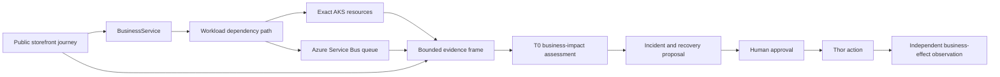

# AKS Commerce Business Scenario

This document defines a reusable commerce scenario that connects a public Azure Kubernetes Service
(AKS) storefront to business-service objectives, workload evidence, deterministic diagnosis, and
governed recovery. It uses the fixed FDAI agent pantheon and keeps cluster identities, domains,
certificates, endpoints, credentials, and promotion state in deployment configuration.

> **Scope:** The scenario demonstrates resilience for a generic browse and order-fulfillment
> service. It does not make the upstream AKS Store Demo a production reference architecture.
>
> **Authority boundary:** Browser checks, telemetry, diagnosis, and planning are read-only.
> Kubernetes changes remain in observation mode until the normal safety check, human approval,
> promotion, and independent effect-verification requirements are satisfied.

## Design at a glance

The scenario projects a reviewed business topology over exact AKS resources. A bounded collector
joins Kubernetes state, Azure messaging metrics, workload service-level objectives (SLOs), and
browser observations. A T0 deterministic reducer then records one business-impact assessment with
explicit evidence gaps. The same assessment can open an incident and propose a recovery, but it
never grants execution authority.

## Business topology

The package declares two business services and their deployable workloads:

| Business service | Workloads | Required dependency path |
|------------------|-----------|--------------------------|
| Catalog browse | Storefront, product API | Storefront -> product API |
| Order fulfillment | Storefront, order API, queue, order processor, order store | Storefront -> order API -> queue -> order processor -> order store |

The scenario reuses `BusinessService`, `Workload`, `ServiceObjective`, `implemented_by`,
`workload_depends_on`, and `service_has_service_objective`. Deployment configuration binds each
workload to an exact current Resource. Missing or conflicting service-to-resource mapping keeps the
assessment held for review.

## Evidence contract

One assessment uses a common time window and preserves source identity, scope, cutoff, freshness,
completeness, provenance, and synthetic status.

| Evidence family | Required observations | Failure behavior |
|-----------------|-----------------------|------------------|
| Kubernetes | Exact Deployment, Pod, Service, EndpointSlice, revision, and readiness evidence | Missing identity or incomplete generation is unavailable. |
| Messaging | Active, incoming, completed, abandoned, and dead-letter message counts for one queue | Missing queue dimension or truncated window is unavailable. |
| Browser evidence | Read-only HTTPS storefront capture with stable selectors | Redirect, DNS, policy, or selector failure is unavailable. |
| Synthetic journey | Browse, cart, order submission, and bounded completion observation | A failed step records the step and duration without retaining customer or order payloads. |
| Workload SLO | Availability, latency, and order-completion freshness evaluations | Insufficient samples do not become a healthy result. |
| Change evidence | Current workload revision and a bounded deployment-change reference | Temporal proximity supports a hypothesis but never proves cause. |

Browser Evidence continues to allow only `GET` and `HEAD`. The state-changing order submission
journey runs in a separate identity-free Playwright worker and emits only aggregate observations.
It requires a current bounded standing-authorization reference, permits one same-origin
`POST /api/orders`, and has no cloud management identity, file access, clipboard access, or action
authority.

The worker rechecks authorization immediately before every intercepted request and counts the
single permitted order POST before dispatch. Duplicate POSTs, cross-origin requests, or expired
authority invalidate the journey even when the page displays a success dialog. One overall
timeout bounds browser launch, navigation, and submission; each result records completion time
rather than launch time. These checks do not authenticate an arbitrary authorization reference
or prove deployment isolation; those prerequisites remain part of worker activation.
Successful journeys also require a 2xx response to the exact submitted order POST. A success
dialog with an absent or failed HTTP response remains unsuccessful. Only the HTTP status is
retained, never the order payload; transport acceptance still does not prove fulfillment.

## Deterministic assessment

The reducer returns exactly one primary state and zero or more supporting signals:

| State | Minimum evidence |
|-------|------------------|
| `healthy` | Complete required sources, healthy SLOs, ready dependency path, and no growing backlog |
| `catalog_unavailable` | Failed browse journey plus unavailable product API endpoint or workload |
| `order_backlog` | Incoming exceeds completed work and active messages increase across the window |
| `dead_letter_growth` | Dead-letter count increases in a complete queue window |
| `dependency_pressure` | Queue or order store pressure aligns with a degraded fulfillment SLO |
| `deployment_regression` | Degraded SLO after a known revision plus exact rollout failure evidence |
| `recovered` | A prior degraded assessment followed by complete healthy business and resource evidence |
| `held` | Required evidence is missing, stale, conflicting, truncated, or ambiguously mapped |

The assessment identifies an affected business service and dependency path. It reports counts only
when the source proves a complete window. It does not infer revenue, affected users, or root cause
from Kubernetes health alone.

Healthy and recovered results additionally require a successful service-specific synthetic
availability observation, every workload explicitly ready, and every SLO explicitly unbreached.
If no known degraded classification matches but any of those positive proofs is absent, retain
`held` with `health_not_proven`. Failed order acceptance with an idle queue must not fall through
to healthy or recovered. This guard does not itself implement an order-acceptance detector,
create an incident, grant a permission, or approve a recovery.

## Agent responsibilities

### Order-acceptance-only detector

**Initial design:** Reuse the fulfillment projection with fewer required queue metrics for the
RabbitMQ-backed demo. **Critique:** That would describe unobserved processing and delivery as
healthy and mix authorized test traffic with fabricated evidence.

**Revised design:** Keep the existing fulfillment contract unchanged. A separate
`OrderAcceptanceAnalyzer` emits only canonical Analyzer findings for one explicitly bound
Deployment. A time-bounded operating intent names its cluster, namespace, name, immutable UID,
Resource reference, minimum replica count, and distinct failed-probe threshold. Current Kubernetes
observations and ordered, unique order-acceptance attempts must share the configured freshness
window. A sample or unknown result never establishes failure or recovery. Synthetic customer
traffic remains marked as synthetic traffic; it is not relabeled as production traffic.

The source normalizes evidence without granting trust. Before incident publication, a separately
injected verifier must authenticate a retained receipt for the exact intent-and-observation digest,
including the probe authorization reference. Missing verification, incomplete or conflicting
evidence, expired intent, UID mismatch, stale observations, or insufficient probes withholds the
finding. No permissive verifier is supplied by the package. Deployment must bind the actual
receipt-verification and read-only observation adapters before registration.

The retained-receipt adapter uses deployment-pinned Ed25519 public keys and an exact, closed
`aks-commerce.acceptance-receipt` version `1.0.0` record. The signature binds the evidence digest,
policy, target, issuer, collector, probe authorization references, and validity window. A fresh
trust-state read must explicitly confirm that the key is not revoked. The verifier has no signing
key or executor credential. Collector, receipt issuer, and executor identities remain distinct;
receipt authenticity never substitutes for trustworthy collection or provider effect verification.
The package supplies a no-I/O `AcceptanceReceiptIssuer` that requires distinct issuer, collector,
and executor identities, derives the verification reference from the exact evidence, and signs the
closed receipt with an injected Ed25519 key. `AcceptanceTrustLifecycle` activates one key id once
and records revocation as a separate immutable audited marker; exact revocation replay is a no-op,
and the public-key verifier checks the marker on every use. Neither component loads a private key,
authenticates the collector, grants a database role, or starts a job. Deployment still owns key
mounts, authenticated source collection, trust-owner identity, disjoint database grants, and job
scheduling.

The concrete Kubernetes reader uses GET only, verifies Deployment and Service UIDs, controller
generation, selectors, EndpointSlice ownership, and the Pod-to-ReplicaSet-to-Deployment chain
for ready endpoints. It re-reads target versions, rejects truncated lists and raced observations,
and bounds each response to 256 KiB and the complete snapshot to five seconds. The observer's
read grants remain separate from Thor's scale grants. Immutable observations and receipts use
the existing state store with per-record atomic audit; ingestion verifies signatures before
retention and the Analyzer verifies them again at use time.

The package entry point `fdai-aks-commerce-analyze` runs one bounded deployed observation tick.
`FDAI_AKS_ACCEPTANCE_JSON` contains exactly `intent`, `trust`, `executor_identity`, `severity`,
and `publication_window_seconds`. Trust entries contain only issuer, source identity, and public
key bytes. Existing `FDAI_STATE_STORE_DSN`, `FDAI_MI_CLIENT_ID`, `KAFKA_BOOTSTRAP_SERVERS`, and
`KAFKA_TOPIC_EVENTS` bind the service-owned store and observer-only event bus. The job uses the
shared publication ledger and finding receipt store, never an in-memory production fallback.
Missing configuration or evidence fails readiness. Deployment must still provide the independent
issuer key binding, authenticated probe collection, trust-owner runtime binding, least-privilege
database grants, and job scheduling; installed library components alone do not establish a live
observation loop.
The entry point uses the shared venue and bus-security resolver. Startup or provider failures
return a nonzero status with a fixed unavailable reason, never raw provider diagnostic text.

Repeated failed acceptance with zero desired and ready replicas and no ready service endpoints
produces `aks_commerce.order_acceptance_unavailable`. A separate inert `ops.scale-out` candidate
may restore zero to the reviewed minimum only when maintenance, HPA ownership, and competing
writers are all explicitly absent. It retains the observed UID and resource version and grants no
approval, promotion, or execution authority. Acceptance success requires positive ready-replica,
endpoint, and order evidence and never closes an Incident by itself. The shared publisher and
Heimdall retain event deduplication and Incident ownership; Thor alone executes an independently
admitted action. Fulfillment, payment, delivery, and revenue remain outside this detector's scope.

### Incident ingress and Thor-owned execution

**Initial integration design:** Forward detector action arguments in the event, or route an
automatic finding as an operator request. **Critique:** Either choice trusts producer-controlled
action data or invents a human initiator. An approval also cannot make old observations current.
**Revised design:** Register the exact canonical event
`analyzer.aks_commerce.order_acceptance_unavailable.observed` with Forseti through
`AnomalyActionSource`. The commerce source reuses the same retained-source and signature admission
as detection. Forseti resolves a current exact-target candidate, forces separate human approval,
and keeps the existing risk and context ceilings. Source failure cannot fall through to a rule.

`AcceptanceGuardedExecutor` adds a fresh signed-evidence read immediately before delegating to
Thor's existing executor. Missing proof or changed arguments withhold dispatch rather than edit
an approved ActionRun. It does not implement or replace the seven safeguards, promotion, current
human authorization, or isolated transport. Local tests connect actual Huginn, Heimdall, Forseti,
Var, and Thor handlers and prove no effect before approval, single execution after approval,
replay suppression, and denial under revoked evidence, changed approval identity, shadow mode,
or missing audit dependency. Tests use synthetic authority and external effects, not live approvals.
Production activation and independent effect closure still need their own inputs and evidence
before this path can restore a live workload.

The material store preserves the original canonical scale Action separately from the anomaly
correlation and ActionRun idempotency key. The isolated dispatch adapter reads that immutable
material and repeats signed-evidence and current-authority admission at the existing safeguard
client's final publication boundary. Missing, replaced, expired, or corrupted material withholds
dispatch. An ambiguous or quarantined result remains unknown, never recovered or automatically
retried. These adapters cannot manufacture original approval, promotion, or preparation inputs.

**Closure design:** A broker or provider receipt cannot release an uncertain execution. Reusing
the ordinary successful-ActionRun observer would miss quarantined attempts and could confuse
dispatch with recovery. Preserve the initial closure plan only for the configured target and its
retained acceptance Action. This optional decorator delegates the original closure unchanged.
Independent signed post-release evidence must match the original Action, released lock, target
generation and closure predecessor before the existing atomic closure store may reconcile it.
Other targets and human-access closure retain their existing behavior. Missing original context
remains held; no component may invent a release receipt or retrospectively approve an action.

The installed `aks-commerce-closure` provider now wraps the existing closure store only when
acceptance configuration is present. It retains exact initial context for a prepared Action at
the configured target and delegates the original decision unchanged. The Action includes its
original observation references; older material remains readable but cannot prove effect closure
without those references. Thor links only command IDs read back from the original command journal.

Heimdall's existing ActionRun hook now observes non-shadow acceptance attempts, including
`execution_unknown`. The reconciler reads the original command, matching provider receipt,
full Action digest, released-lock evidence, target generation and quarantine predecessor. It
requires a new signed resource-and-order observation after both provider completion and initial
closure, retains independent audit evidence, then uses the existing atomic reconciliation builder.
Incorrect identity, stale or revoked evidence, failed orders or missing release context leave
quarantine unresolved. Exact historical replay returns its retained closure without asserting
current health or adding another audit transition. Other targets and shadow runs stay unchanged.
Missing command or effect evidence raises a retryable handler failure. Existing at-least-once
delivery can therefore reprocess the original ActionRun after delayed evidence arrives; historical
closure replay never dispatches the mutation again. After exact closure, Heimdall publishes one
verified-effect record on its existing recovery-observation topic. Thor rechecks the original
Action, target, parameters and idempotency generation, then alone changes `execution_unknown` to
`succeeded`, persists the closure and effect references, and emits `operational_success=true` with
`effect_verification_status=verified`. A separate internal consumer resolves only the Incident id
atomically bound when that detector episode opened, using the minimum legal lifecycle path. This
prevents a later episode on the same resource from being resolved accidentally. Console reuses the
authoritative terminal ActionRun and Incident projections; it does not infer success from broker or
provider acceptance.

`PreparedAcceptanceSource` now runs under Forseti before the approval-facing decision is published.
It revalidates the signed observation and exact arguments, checks the automatic trigger and
catalog schema, and uses the shared ActionBuilder and RiskGate. It retains the original Action
and reviewed Rule digest with atomic audit. Exact replay reuses that material; changed arguments,
policy or mode cannot replace it. Missing preparation remains shadow. The shipped scale ActionType
requires two independent people; preparation cannot reduce its quorum or raise an existing ceiling.

`AcceptanceCurrentAuthority` refreshes policy, matches original Rule and ActionType contents,
applies the shared risk table and promotion state, and reads Var's durable final approval. It
rechecks each distinct human's current eligibility, the original approval expiry, and safety state.
The dispatch adapter repeats this check at the shared isolated client's publication boundary.
Core startup now loads exactly one installed `fdai.acceptance_recovery` entry point named
`aks-commerce` only when `FDAI_AKS_ACCEPTANCE_JSON` is present. `FDAI_AKS_ACCEPTANCE_RULE_ID`
selects an already reviewed Rule from the loaded catalog: it must reference
`fdai.aks_commerce.order_acceptance.v1`, `kubernetes.deployment`, and `ops.scale-out`.
Missing or unrelated Rules, absent durable promotion or isolated safeguard bindings, and an absent
`FDAI_PANTHEON_APPROVER_ACTIONS_JSON` policy reject composition. Startup creates no observation,
approval, promotion, or provider effect. Unrelated targets retain their existing Thor dispatcher.
The package uses the same StateStore, ActionBuilder, RiskGate, risk table, promotion refresh,
approval policy and safety state already owned by the runtime. Unbound safety stays held.
Live source issuance, independent effect closure, eligible promotion and exact deployed
observer/executor scope remain required; successful package loading does not satisfy them.

The composition root may register `AksCommerceAnalyzer` with the shared `InvestigationCoordinator`
and `AnalyzerTickRunner`. The commerce coordinator retains each assessment before the analyzer
returns a complete, current degraded finding. The shared runner owns event publication, durable
duplicate suppression, and uncertain-send reconciliation. It does not call an agent or write an
Incident directly. Huginn normalizes the event; Heimdall applies its existing repeated-evidence and
severity policy before the canonical Incident lifecycle opens a case. Replaying an assessment
preserves the event identity. Observations in distinct configured publication buckets provide
distinct evidence in one target's correlation. A failed or uncertain publisher cannot be reported
as successful delivery. A server-owned binding supplies the exact target, canonical resource kind,
severity, publication interval, and evidence freshness ceiling.

The publisher remains disabled without an explicit event-bus binding and exact service-to-target
configuration. Held, healthy, recovered, stale, and synthetic assessment frames are not incident
triggers through this bridge. A retained projection or broker receipt grants no action authority.
The order-acceptance-only detector uses the separate evidence profile above, not this projection.
Runtime registration and the live workload, SLO, and metric sources still require deployment
integration; the exported adapter alone does not start an observation loop or create live records.

Thor is the only execution agent. The isolated Executor is Thor's execution runtime, not a second
agent or an independent recovery decision maker. It may call the Kubernetes API only for a
Thor-owned, safeguard-bound command admitted through the existing approval and promotion path.
Heimdall verifies effects independently; Console and the commerce coordinator never hold mutation
credentials. This integration does not merge processes or enable local execution authority.

No agent names or role bindings change:

- **Huginn** owns normalized journey, messaging, Kubernetes, and change ingress.
- **Heimdall** owns anomaly, SLO, and independent recovery observations.
- **Forseti** owns the deterministic business-impact assessment and any grounded RCA.
- **Freyr and Njord** provide bounded capacity and cost advice.
- **Odin** arbitrates service recovery, change safety, and cost objectives.
- **Var** carries required current human approval.
- **Thor** dispatches only an eligible exact-target action.
- **Vidar and Saga** retain rollback readiness and append-only audit evidence.
- **Bragi** presents the assessment in the operator's locale.

## Governed Kubernetes actions

The first action set is deliberately narrow:

| Action | Exact target | Recovery contract |
|--------|--------------|-------------------|
| Restart workload | One controller-owned Pod UID | Replacement Pod becomes ready; forward-only restart remains explicit. |
| Scale workload | One Deployment UID and observed generation | Restore the prior replica count if verification fails. |
| Roll back rollout | One Deployment UID and current revision | Restore the pre-action revision if the selected rollback does not recover. |

The generic AKS runtime routes these registered actions through the isolated Executor. Its
ServiceAccount can mutate only Pods and Deployments in the configured runtime namespace. The
commerce effect verifier remains a scenario-specific conditional observer and does not grant the
generic runtime authority or prove a live recovery.

Each action starts in observation mode and requires a stop condition, tested rollback, impact
scope, successful server-side dry run, logical-target lock, stable idempotency key, and two-phase
audit. Success requires a distinct Heimdall observation of both resource recovery and the expected
business effect. Kubernetes API acceptance is not success.

Acceptance-only effect verification consumes a trusted action-owner expectation with the exact
ActionRun, provider receipt, target UID, replica count, application time, and pre-action references.
Every recovery probe and resource observation must follow that application time and use distinct
evidence. The verifier authenticates the new receipt, rechecks freshness after verification, and
requires the exact expected desired count plus positive ready-endpoint and order-acceptance proof.
It returns `verified`, `not_recovered`, or `held` evidence without closing an Incident, retrying
an action, or changing promotion. The action-owner handoff and Heimdall lifecycle binding remain
required before this read-only result can close a real run.

## Public storefront deployment

The scenario-lab profile deploys the commerce workload with these boundaries:

- The profile creates the dedicated `aks-store-demo` cluster and never selects another existing
  FDAI or shared cluster.
- The disposable lab exposes the AKS management API publicly for local subscription inventory
  without private-network routing. Microsoft Entra authentication, Azure RBAC, and disabled local
  accounts remain mandatory; the endpoint grants no anonymous or application access.
- Trivy and Checkov suppressions for public API access and absent authorized IP ranges stay
  adjacent to this one disposable cluster resource. They do not suppress another AKS finding or
  weaken the authentication and authorization controls above.
- The storefront is the only public application surface; the public management API is not an
  application endpoint.
- Public access uses HTTPS, a deployment-supplied DNS name, and a trusted certificate reference.
- The administration UI, APIs, queue, database, and executor remain private.
- AKS monitoring, Container Insights, managed Prometheus, and required application telemetry are
  enabled before the scenario reports ready.
- Deployment-owned associations do not replace an Azure Policy-owned effective subnet NSG.
  Preflight verifies its default inbound deny rule, while the private-endpoint subnet and stress
  VM NIC retain their explicit Terraform-owned associations.
- The deployment emits the storefront URL and opaque resource references as outputs. It does not
  commit tenant values.
- Ordinary apply continues to reject every replacement. A one-time `recreate-aks` operation accepts
  only the reviewed private-to-public cluster replacement and its cluster-scoped role assignments,
  requires exact human confirmation, and rejects any other destructive address.

Gateway API is the preferred long-term ingress contract. An ingress compatibility profile may be
used only for a time-bounded lab where its support window and migration path are recorded.

## Operator experience

The Console route presents one service-oriented incident view:

1. Current business state and SLO impact.
2. The exact dependency path and affected workloads.
3. Queue, browser, Kubernetes, and change evidence with freshness and gaps.
4. Proposed, pending, approved, or completed recovery state.
5. Independent resource and business-effect verification.
6. Append-only audit lineage.

Unavailable evidence remains visible and links to its owning evidence surface. The browser never
constructs business impact, authority, or success from raw values.

## Delivery and validation

Implementation proceeds in these dependency-ordered slices:

1. Package the business topology, objectives, rules, and workflow.
2. Add bounded queue and browser observation adapters.
3. Add deterministic assessment and durable projection.
4. Expose authenticated Operator and Console views.
5. Add shadow-first Kubernetes adapters and independent verification.
6. Add the public-HTTPS scenario-lab profile.
7. Validate locally, then retain a separately approved live Azure receipt.

Live deployment uses the ordinary FDAI exact-plan workflow. This design does not select a tenant,
subscription, resource group, domain, certificate, or Terraform plan.
The protected scenario workflow binds Terraform provider and backend access to the exact verified
deploy runner Managed Identity. An Azure CLI session never selects an ambient user, service
principal, or node identity for cluster planning.

## Related docs

| To learn about | Read |
|----------------|------|
| Implementation status and remaining work | [AKS commerce implementation ledger](../../roadmap-implementation/operations/aks-commerce-business-scenario.md) |
| Exact AKS resource evidence | [AKS Diagnostic Evidence Plane](../architecture/aks-diagnostic-evidence-plane.md) |
| Browser collection limits | [Browser Evidence Collection](../interfaces/browser-evidence.md) |
| Workload SLO subsystem | [Scope Expansion and Structural Gaps](../fork-and-sequencing/scope-expansion.md) |
| Kubernetes action safety | [Execution Model](../decisioning/execution-model.md) |
