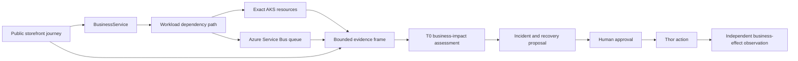

# AKS Commerce Business Scenario

This document defines a reusable commerce scenario that connects a public Azure Kubernetes Service
(AKS) storefront to business-service objectives, workload evidence, deterministic diagnosis, and
governed recovery. It uses the fixed FDAI agent pantheon and keeps cluster identities, domains,
certificates, endpoints, credentials, and promotion state in deployment configuration.

> **Scope:** The scenario demonstrates resilience for a generic browse and order-fulfillment
> service. It does not make the upstream AKS Store Demo a production reference architecture.
>
> **Authority boundary:** Browser checks, telemetry, diagnosis, and planning are read-only.
> Kubernetes changes remain in observation mode until the normal safety check, human approval,
> promotion, and independent effect-verification requirements are satisfied.

## Design at a glance

The scenario projects a reviewed business topology over exact AKS resources. A bounded collector
joins Kubernetes state, Azure messaging metrics, workload service-level objectives (SLOs), and
browser observations. A T0 deterministic reducer then records one business-impact assessment with
explicit evidence gaps. The same assessment can open an incident and propose a recovery, but it
never grants execution authority.

## Business topology

The package declares two business services and their deployable workloads:

| Business service | Workloads | Required dependency path |
|------------------|-----------|--------------------------|
| Catalog browse | Storefront, product API | Storefront -> product API |
| Order fulfillment | Storefront, order API, queue, order processor, order store | Storefront -> order API -> queue -> order processor -> order store |

The scenario reuses `BusinessService`, `Workload`, `ServiceObjective`, `implemented_by`,
`workload_depends_on`, and `service_has_service_objective`. Deployment configuration binds each
workload to an exact current Resource. Missing or conflicting service-to-resource mapping keeps the
assessment held for review.

## Evidence contract

One assessment uses a common time window and preserves source identity, scope, cutoff, freshness,
completeness, provenance, and synthetic status.

| Evidence family | Required observations | Failure behavior |
|-----------------|-----------------------|------------------|
| Kubernetes | Exact Deployment, Pod, Service, EndpointSlice, revision, and readiness evidence | Missing identity or incomplete generation is unavailable. |
| Messaging | Active, incoming, completed, abandoned, and dead-letter message counts for one queue | Missing queue dimension or truncated window is unavailable. |
| Browser evidence | Read-only HTTPS storefront capture with stable selectors | Redirect, DNS, policy, or selector failure is unavailable. |
| Synthetic journey | Browse, cart, order submission, and bounded completion observation | A failed step records the step and duration without retaining customer or order payloads. |
| Workload SLO | Availability, latency, and order-completion freshness evaluations | Insufficient samples do not become a healthy result. |
| Change evidence | Current workload revision and a bounded deployment-change reference | Temporal proximity supports a hypothesis but never proves cause. |

Browser Evidence continues to allow only `GET` and `HEAD`. The state-changing order submission
journey runs in a separate identity-free Playwright worker and emits only aggregate observations.
It requires a current bounded standing-authorization reference, permits one same-origin
`POST /api/orders`, and has no cloud management identity, file access, clipboard access, or action
authority.

## Deterministic assessment

The reducer returns exactly one primary state and zero or more supporting signals:

| State | Minimum evidence |
|-------|------------------|
| `healthy` | Complete required sources, healthy SLOs, ready dependency path, and no growing backlog |
| `catalog_unavailable` | Failed browse journey plus unavailable product API endpoint or workload |
| `order_backlog` | Incoming exceeds completed work and active messages increase across the window |
| `dead_letter_growth` | Dead-letter count increases in a complete queue window |
| `dependency_pressure` | Queue or order store pressure aligns with a degraded fulfillment SLO |
| `deployment_regression` | Degraded SLO after a known revision plus exact rollout failure evidence |
| `recovered` | A prior degraded assessment followed by complete healthy business and resource evidence |
| `held` | Required evidence is missing, stale, conflicting, truncated, or ambiguously mapped |

The assessment identifies an affected business service and dependency path. It reports counts only
when the source proves a complete window. It does not infer revenue, affected users, or root cause
from Kubernetes health alone.

## Agent responsibilities

No agent names or role bindings change:

- **Huginn** owns normalized journey, messaging, Kubernetes, and change ingress.
- **Heimdall** owns anomaly, SLO, and independent recovery observations.
- **Forseti** owns the deterministic business-impact assessment and any grounded RCA.
- **Freyr and Njord** provide bounded capacity and cost advice.
- **Odin** arbitrates service recovery, change safety, and cost objectives.
- **Var** carries required current human approval.
- **Thor** dispatches only an eligible exact-target action.
- **Vidar and Saga** retain rollback readiness and append-only audit evidence.
- **Bragi** presents the assessment in the operator's locale.

## Governed Kubernetes actions

The first action set is deliberately narrow:

| Action | Exact target | Recovery contract |
|--------|--------------|-------------------|
| Restart workload | One controller-owned Pod UID | Replacement Pod becomes ready; forward-only restart remains explicit. |
| Scale workload | One Deployment UID and observed generation | Restore the prior replica count if verification fails. |
| Roll back rollout | One Deployment UID and current revision | Restore the pre-action revision if the selected rollback does not recover. |

Each action starts in observation mode and requires a stop condition, tested rollback, impact
scope, successful server-side dry run, logical-target lock, stable idempotency key, and two-phase
audit. Success requires a distinct Heimdall observation of both resource recovery and the expected
business effect. Kubernetes API acceptance is not success.

## Public storefront deployment

The scenario-lab profile deploys the commerce workload with these boundaries:

- The profile creates the dedicated `aks-store-demo` cluster and never selects another existing
  FDAI or shared cluster.
- The storefront is the only public application surface.
- Public access uses HTTPS, a deployment-supplied DNS name, and a trusted certificate reference.
- The administration UI, APIs, queue, database, and executor remain private.
- AKS monitoring, Container Insights, managed Prometheus, and required application telemetry are
  enabled before the scenario reports ready.
- Deployment-owned associations do not replace an Azure Policy-owned effective subnet NSG.
  Preflight verifies its default inbound deny rule, while the private-endpoint subnet and stress
  VM NIC retain their explicit Terraform-owned associations.
- The deployment emits the storefront URL and opaque resource references as outputs. It does not
  commit tenant values.

Gateway API is the preferred long-term ingress contract. An ingress compatibility profile may be
used only for a time-bounded lab where its support window and migration path are recorded.

## Operator experience

The Console route presents one service-oriented incident view:

1. Current business state and SLO impact.
2. The exact dependency path and affected workloads.
3. Queue, browser, Kubernetes, and change evidence with freshness and gaps.
4. Proposed, pending, approved, or completed recovery state.
5. Independent resource and business-effect verification.
6. Append-only audit lineage.

Unavailable evidence remains visible and links to its owning evidence surface. The browser never
constructs business impact, authority, or success from raw values.

## Delivery and validation

Implementation proceeds in these dependency-ordered slices:

1. Package the business topology, objectives, rules, and workflow.
2. Add bounded queue and browser observation adapters.
3. Add deterministic assessment and durable projection.
4. Expose authenticated Operator and Console views.
5. Add shadow-first Kubernetes adapters and independent verification.
6. Add the public-HTTPS scenario-lab profile.
7. Validate locally, then retain a separately approved live Azure receipt.

Live deployment uses the ordinary FDAI exact-plan workflow. This design does not select a tenant,
subscription, resource group, domain, certificate, or Terraform plan.
The protected scenario workflow binds Terraform provider and backend access to the exact verified
deploy runner Managed Identity. An Azure CLI session never selects an ambient user, service
principal, or node identity for cluster planning.

## Related docs

| To learn about | Read |
|----------------|------|
| Implementation status and remaining work | [AKS commerce implementation ledger](../../roadmap-implementation/operations/aks-commerce-business-scenario.md) |
| Exact AKS resource evidence | [AKS Diagnostic Evidence Plane](../architecture/aks-diagnostic-evidence-plane.md) |
| Browser collection limits | [Browser Evidence Collection](../interfaces/browser-evidence.md) |
| Workload SLO subsystem | [Scope Expansion and Structural Gaps](../fork-and-sequencing/scope-expansion.md) |
| Kubernetes action safety | [Execution Model](../decisioning/execution-model.md) |
