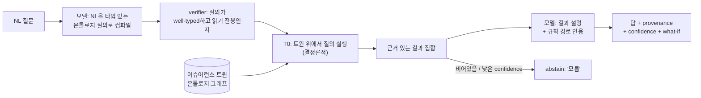

# 어슈어런스 트윈 (질의가능하고 선제적이며 검증가능한 리뷰)

"아키텍처 리뷰 에이전트" 요청에 대한 FDAI의 답은 문서 인덱스에 붙인 챗봇이
아닙니다. 그것은 **어슈어런스 트윈(Assurance Twin)** 입니다: 거버넌스 대상 구독의
질의가능하고 온톨로지에 근거한 디지털 트윈으로, 질문에 결정론적으로 답하고, 누가
요청하기 전에 변경을 리뷰하며, 교정을 제안(실행은 절대 하지 않음)합니다. 모델은
자연어를 타입이 있는 그래프 질의로 컴파일하고 마지막에 결과를 산문으로 렌더링합니다;
답 자체는 트윈 위에서 결정론적 엔진이 산출하므로, 모델의 주장이 아니라 **구성에 의해**
근거가 있고 검증가능합니다.

> **범위**: 고객-비종속. 트윈의 스키마, 규칙, 임계값은 제네릭합니다; 포크는 `Inventory`
> 시임과 자신의 규칙 세트를 통해 자체 리소스 모집단을 공급합니다. 고객 값, 테넌트 id,
> 리소스 이름은 여기에 존재하지 않습니다
> ([generic-scope.instructions.md](../../../.github/instructions/generic-scope.instructions.md)).

> **위치**: 트윈은 온톨로지 그래프 위의 **읽기 전용 투영(변환 결과)** 입니다. 특권
> 아이덴티티를 절대 보유하지 않습니다. 모든 변경은 여전히
> `risk-gate -> executor -> delivery` 를 거치며,
> [app-shape.instructions.md](../../../.github/instructions/app-shape.instructions.md) 의
> 읽기 전용 표면 규칙을 보존합니다. 질문에 답하는 것은 결코 액션이 아닙니다.

## 이 문서가 다루는 것

이 문서는 아키텍처 리뷰, Q&A, 평가 리포트 유스케이스를 deterministic-first,
event-driven, risk-gated 설계를 저하시키지 않으면서 커버하는 리뷰/어슈어런스 표면을
규정합니다. [llm-strategy-ko.md](../architecture/llm-strategy-ko.md) 의 온톨로지,
[architecture.instructions.md](../../../.github/instructions/architecture.instructions.md) 의
계층 라우터와 quality 게이트,
[observability-and-detection-ko.md](../rules-and-detection/observability-and-detection-ko.md) 의 탐지 발견 사항,
[deployment-preflight-ko.md](../deployment/deployment-preflight-ko.md) 의 배포 analyzer를 재사용합니다.
새 서브시스템 `core/assurance_twin/` 하나와 전달 인텐트 하나를 추가하며, 나머지는
기존 부품의 조합입니다.

> **구현 상태**: `core/assurance_twin/`에는 in-memory 변환 결과, 검증된 결정론적 조회,
> 자세 보고 조립, publisher-neutral 검토 glue, 시뮬레이션 fidelity 원장,
> 활성/challenger 효과 모델 및 범위가 제한된 Dynamic 런타임 조정기가 있고 focused tests가 이를
> 검증합니다. T1 reuse는 injected current-state 요청 프로바이더와 모델 레지스트리를 통해 이를 호출하고
> 실행 충족 여부를 바꾸지 않는 shadow 감사를 기록합니다. 운영 인벤토리 조립, model-backed NL 컴파일러, ChatOps
> 의도, Checks API 발행기, discovery-loop 훅, twin 전용 ReadPanel은 아직 연결되지 않았습니다.
> 아래 주변 검토, action-bridging, self-improving 전달 흐름은 목표 설계입니다. 별도의
> Security 평가 보고 피드와 Azure analyzer는 현재 reporting subsystem에 구현되어 있습니다.
> Operational 계획 수립에는 이제 목표별로 검증된 활성 및 challenger 효과 모델을 적용하는
> 읽기 전용 Twin 어댑터가 있습니다. 누락되거나 future-cutoff인 모델은 unscorable이며 divergence는
> 후보를 검토 대상으로 표시합니다. 어댑터는 근거만 만들고 실행을 선택하지 않습니다.
> Dynamic V2는 변경할 수 없는 operational 상태 trajectory, 범위가 제한된 typed-path propagation,
> interaction 용어, 활성 trajectory에서 평가되는 필수 trajectory-wide 불변식, 독립적인
> 결과 종결, 그래프 런타임 조정기, StateStore trajectory-episode 원장, off-path
> 종결 실행기 및 영속 활성/challenger graph-model 레지스트리를 추가합니다. 종결 실행기는
> 완전한 matched 또는 mismatched 독립적인 관측의 challenger 구획만 갱신하고 활성
> 모델을 mutate하거나 promote하지 않았음을 감사합니다. 컨트롤 루프는 명시적으로 injected 그래프
> 조정기를 받아 shadow 근거만 기록하며 운영 그래프 요청, 모델 및 observed-trajectory
> 출처 어댑터는 배포 연결로 남습니다.

## 왜 챗봇이 아닌가

retrieval-augmented 챗봇은 다섯 가지 구조적 결함을 안고 리뷰 유스케이스에 답합니다.
트윈은 각각을 뒤집습니다.

| 챗봇의 한계 | 결과 | 어슈어런스 트윈의 전환 |
|--------------------|-------------|----------------------|
| **Reactive** - 물어봐야만 답함 | 리뷰 큐 리드타임을 재현(요청 대기, 그다음 사람 대기) | **주변** - 요청이 존재하기 전에 변경 이벤트에서 선제적으로 리뷰 |
| **Ungrounded** - 산문에 대한 벡터 유사도 | 환각 판정이 배포까지 도달 | **Ontology-grounded** - 답은 규칙 경로가 인용된 결정론적 그래프 질의 |
| **Stateless** - 실제 estate가 아니라 문서를 읽음 | "왜 non-compliant인가"에 대한 실제 근거 없음 | **Stateful twin** - 인벤토리 delta로 최신화되는 구독의 라이브 투영 |
| **Inert** - 정보만 반환하고 멈춤 | 사람이 여전히 손으로 고침 | **Action-bridging** - 답이 shadow remediation-PR 제안을 실을 수 있음 |
| **Static** - 인덱스가 stale됨 | 정책 변경 후 틀린 답 | **Self-improving** - 답 못한/abstain한 질문이 규칙 발견 루프로 투입 |

## 다섯 가지 전환

### 1. 주변 (reactive에서 proactive로)

트윈은 요청이 아니라 이벤트에서 변경을 리뷰합니다. 변경 신호가 도착하면(IaC pull 요청
열림, Activity Log 리소스 쓰기, 표류 차이), `event-ingest` 가 정규화하고, 트윈이 scratch
투영에 차이를 적용하며, T0가 영향받는 규칙을 평가하고, 결과가 리뷰로 되돌아 게시됩니다 -
PR의 Checks API 주석 또는 인시던트의 발견 사항. "요청 시 배포 후 평가" 케이스가 "변경 시,
요청 없이 평가됨"이 됩니다.

예: 개발자가 비공개 엔드포인트 없이 저장소 계정을 추가하는 IaC PR을 엽니다. 리뷰가
요청되기 전에 트윈이 검사를 게시합니다: `차단된 - object-storage.private-endpoint.필수
(규칙 인용), 해석: 비공개 엔드포인트 추가 또는 exemption 적용`.

### 2. Ontology-grounded (수집에서 그래프 질의로)

트윈은 산문 인덱스가 아니라 온톨로지 그래프입니다. 모든 거버넌스 대상 리소스는 `Resource`
ObjectType이고; 관계는 기존의 타입 있는 LinkType(`contains`, `attached_to`, `depends_on`)이며,
규칙 매치는 `Finding` 입니다([llm-strategy-ko.md](../architecture/llm-strategy-ko.md) 참조). "왜 이 리소스가
non-compliant인가"는 구체적인 근거 체인을 반환하는 그래프 탐색으로 답합니다, 예:

```text
Resource:storage-x --attached_to--> Resource:subnet-y
subnet-y --contains(-1)--> vnet-z
Finding: storage-x violates rule:object-storage.private-endpoint.required
 evidence: rule path + evaluated property (publicNetworkAccess=Enabled)
```

체인은 결정론적이고 재현가능합니다: 같은 트윈 상태는 누가 묻든 어떻게 표현하든 같은 답을
산출합니다.

### 3. Verifiable (text-to-answer가 아니라 text-to-query)

이것이 핵심 메커니즘입니다. 모델은 **자연어 질문을 타입 있는 온톨로지 질의로 컴파일**하고,
마지막에 **결과를 산문으로 렌더링**하는 데 쓰입니다. 사실의 출처는 결코 모델이 아닙니다.



- **컴파일이 검증됨**: 컴파일된 질의는 온톨로지 스키마에 대해 well-typed여야 하고 읽기
 전용이어야 합니다; 검사를 통과하지 못한 질의는 실행되지 않고 거부됩니다. 이는 T2
 검증기와 동일한 실패 시 차단 자세입니다.
- **답은 계층을 거침**: 정확한 규칙/그래프 매치는 **T0** 에서 해결되고; 알려진 패턴에
 가까운 모호한 질문은 **T1** 유사도를 쓰며; 진정으로 새롭거나 모호한 질문만 **T2** 에
 도달하고, T2 출력은 표시되기 전에
 [quality 게이트](../../../.github/instructions/architecture.instructions.md#llm-quality-gate-required-for-t2)
 (mixed-model 교차 검증, 검증기, grounding)를 통과합니다.
- **grounding 아니면 abstain**: 모든 답은 그것을 정당화하는 규칙과 그래프 노드를 인용합니다.
 근거를 댈 수 없는 답은 추측 대신 "모름"을 반환합니다. 환각은 프롬프트 튜닝이 아니라
 구성에 의해 차단됩니다.

### 4. Action-bridging (inert에서 제안으로)

답은 제안된 수정을 실을 수 있지만, 트윈은 결코 실행하지 않습니다. 질문이 고칠 수 있는
발견 사항으로 해소되면, 트윈은 규칙의 `remediates` ActionType로부터 만든 **shadow
remediation-PR 제안**을 붙일 수 있습니다. 그것에 대해 행동하는 것은 기존의 gated 경로입니다:
`risk-gate -> executor -> delivery`, 고위험은 무엇이든 HIL로
([risk-classification-ko.md](../decisioning/risk-classification-ko.md) 참조). 챗과 콘솔은 읽기 전용
표면으로 남습니다; 제안은 PR로의 링크이지 mutate하는 버튼이 아닙니다.

예: "비공개 엔드포인트 없는 저장소 계정을 고쳐줘"는 발견 사항 집합으로 해소됩니다; 트윈은
리소스당 하나의 shadow remediation-PR을 엽니다(blast-radius 상한 아래 배치), 각각 롤백
계약을 가지며 HIL로 라우팅됩니다. 사람이 승인하기 전에는 아무것도 바뀌지 않습니다.

### 5. Self-improving (static에서 living으로)

질문은 발견 신호입니다. 트윈이 **abstain** 한 질문, 또는 커버하는 규칙이 없는 반복 질문은
[architecture.instructions.md](../../../.github/instructions/architecture.instructions.md) 의
자율 규칙 발견 루프로 후보로 발행됩니다(HIL 패턴과 재정의를 지켜보는 것과 같은 루프).
후보는 출처 이력을 실으며 카탈로그에 들어가기 전에 표준 quality 게이트를 통과합니다; 트윈은
카탈로그를 직접 mutate하지 않습니다. 따라서 지식 표면은 stale되는 대신 estate를 추적합니다.

## 시뮬레이터로서의 트윈 (그래프 전체에 대한 what-if)

액션별 what-if 검증기
([architecture.instructions.md](../../../.github/instructions/architecture.instructions.md#llm-quality-gate-required-for-t2))
는 단일 변경의 효과를 예측합니다. 트윈은 이를 그래프 전체로 일반화합니다: 제안된 변경을
**scratch 투영**에 적용하고 라이브 estate에 손대기 전에 결과를 평가합니다. 하나의
시뮬레이션 표면이 세 버티컬 모두를 서비스하며, 그래서 트윈은 설계를 복잡하게 하는 게
아니라 단순화합니다.

| 버티컬 | 시뮬레이션 질문 | 답하는 방법 |
|----------|---------------------|-------------|
| **변경 안전성** | 이 변경의 영향 범위는? 하류에서 무엇이 깨지는가? | 변경된 `Resource` 로부터 `attached_to` / `depends_on` 탐색; 영향 집합 + 새로 위반된 규칙 보고 |
| **복원력 (DR)** | estate가 목표 RPO/RTO를 만족하는가? 무엇이 장애 조치되는가? | 리전/존 손실 시나리오를 트윈에 대해 재생; 복구 경로 없는 리소스와 예상 RPO/RTO 갭 보고 |
| **비용 거버넌스** | 이 변경/이 최적화의 비용 델타는? | 투영에 SKU/스케일 델타 적용; 예상 unit-cost 변화 보고 |

- **읽기 전용이고 결정론적**: 시뮬레이션은 scratch 투영만 mutate하고, 라이브 estate나
 감사 저장소는 절대 건드리지 않습니다. 이는 T0 성격의 패스입니다: 정적 그래프 평가가
 대부분을 해결하고, 범위가 제한된 읽기 전용 프로브가 나머지를 확증합니다,
 [deployment-preflight-ko.md](../deployment/deployment-preflight-ko.md) 가 하는 것과 정확히 같습니다.
- **Shadow-first**: 각 시뮬레이션 파생 발견 사항은 shadow 모드로 배포되고, 정확도와
 false-positive 비율이 고정된 시나리오 세트에서 측정된 후에만 shadow-to-enforce 규칙에
 따라 승격됩니다([goals-and-metrics-ko.md](../architecture/goals-and-metrics-ko.md)).
- **Fidelity 측정**: `core/assurance_twin/fidelity.py`
 (`SimulationFidelityLedger`) 가 그 승격의 메커니즘이다. 각 **예측된** 효과(비용 delta,
 blast-radius 개수, RPO/RTO 공백)를 안정적인 prediction id 로 **실제** 관측 결과와 조인해
 예측기별 MAE, MAPE, within-tolerance 비율을 누적한다. `is_reliable` 은 이를 실패 시 차단
 승격 신호로 바꾼다: 최소 표본 수 미만이거나 MAPE 기준 초과인 예측기는 신뢰할 수 없으므로,
 호출자는 그것을 shadow 에 유지(또는 강등)한다. 이는 측정되지 않은 what-if 가 oracle 로
 작동하는 것을 막는다 - 실현되지 않는 시뮬레이션은 강제 적용 자격을 자동으로 잃는다.
- **적응하지만 promotion-gated**: `effect_model.py`는 versioned 활성 모델로 no-op 및 액션
 가지를 평가하고 별도 challenger는 기준 시점 이후의 scorable `ResponseOutcome`에서만 학습합니다.
 Scheduled growth 작업은 optimistic 동시성으로 challenger 개정 번호를 저장하며 활성 키를
 교체하지 않습니다. 활성/challenger divergence 또는 `quasi_experimental` 미만 근거는
 검토를 요구합니다. `rca/temporal_causality.py`는 선택적 confounder 조정, reverse-direction
 검사 및 multiple-testing 보정을 포함한 differenced lag 상관관계를 추가합니다. 이
 observational 경로는 최대 `predictive_precedence`까지만 도달하고 experimental causal grade를
 만들지 않습니다.
 `runtime.py`는 최대 32개 current-state 가지의 활성 및 challenger 모델을 로드합니다. 활성
 모델 누락, 낮은 근거 또는 divergence는 검토를 요구하며 T1 호출자는 abstain 상태를 유지하고
 learned 액션을 정상 re-verification 경로로 보냅니다.

### 운영 연결 및 가드

`FDAI_DYNAMIC_CONFIG_JSON`은 배포된 코어 런타임에서 scalar Dynamic을 활성화합니다. Strict
객체는 ActionType별 메트릭, 목표, 효과 delta, uncertainty, divergence 및 최신성 설정,
exact 활성/challenger 모델 기록, causal 증적 다이제스트 허용 목록을 포함합니다. 시작은 부분
필드, 알 수 없음 필드, 누락된 모델 쌍, 충돌하는 영속 모델 또는 허용 목록에 없는 증적을 가진
모델을 차단합니다. 이 설정이 없으면 Dynamic은 명시적으로 사용 불가 상태를 유지하고 기존
결정론적 라우팅은 변경되지 않습니다.

Azure 어댑터는 promoted 인벤토리 근거의 `operational_context.metric_values`를 읽고 범위가 제한된
액션 가지 하나를 만듭니다. 활성/challenger 모델은 영속 StateStore 레지스트리에서 가져옵니다.
구성된 Dynamic 시뮬레이션은 T1 reuse가 안전성 검토에 들어가기 전 lower-only 가드가 됩니다.
사용 불가 요청, 누락된 모델, divergence, 그래프 검토 사유, 불변식 실패 또는 누락된
Dynamic 감사 근거는 사람 검토로 라우팅됩니다. Prediction은 액션을 승인하거나 자율성
상한을 높일 수 없습니다.

### Graph-wide temporal Dynamic

기존 액션/메트릭 모델은 첫 번째 Dynamic 계층으로 유지됩니다. Graph-wide 시뮬레이션은 이를
`OperationalStateTrajectory`, `GraphEffectModel`, `DynamicInvariant`, `TrajectoryOutcome`으로
확장합니다. Trajectory는 온톨로지 release, 그래프 및 인벤토리 개정 번호, 근거 기준 시점, horizon,
정규화된 객체/메트릭 구획, intervention 참조, watermark, 완전성, 잘림 및
결정론적 다이제스트를 고정합니다. 대화 및 실행 `TrajectoryEnvelope`와 구별되며 어느
기록도 자체적으로 프로바이더 상태 근거가 아닙니다.

Graph propagation은 fixed 간선, 깊이, 구획, horizon 한계 아래 선언된 LinkType 경로만 따릅니다.
결정론적 토폴로지 효과를 검증된 활성 모델보다 먼저 적용합니다. Interaction 용어는 병렬
액션 효과를 linear sum으로 취급하지 않게 합니다. 모델 누락, stale 기준 시점, cycle, 사용 불가
기준선, 잘림, 낮은 causal grade 또는 활성/challenger divergence는 검토를 요구합니다.
Challenger prediction은 가지 순위를 정하지 않습니다.

모든 그래프 시뮬레이션 요청은 비어 있지 않고 범위가 제한된인 불변식 튜플을 전달합니다. Simulator는
각 불변식을 활성 trajectory에서 평가하고 정확한 불변식별 결과를 반환합니다. Violation 또는
unscorable 불변식은 고정된 검토 사유를 추가하며 권한을 높일 수 없습니다. 실행 중 관찰된
불변식 violation은 실행 중 계획을 rewrite할 수 없으며 forward 전달을 중지하고 기존 타입이 지정된
복구 경로에 다시 진입합니다.

Graph 런타임은 시뮬레이션 근거를 반환하기 전에 predicted 다이제스트, exact trajectory 및 challenger
모델 참조를 StateStore trajectory 원장에 기록합니다. Heimdall의 완전한 독립적인 관측은 `close_trajectory_outcome`을
통해 에피소드를 matched 또는 mismatched로 종료합니다. 신원 mismatch, censoring, incompleteness 및
unscorable 비교는 에피소드를 열림 상태로 두며 모델을 갱신하지 않습니다. 동일한 종결 재생은
no-op이고 conflicting 재생은 실패 시 차단됩니다. Off-path 그래프 종결 실행기는 완전한 comparable
challenger 구획에 대해서만 learning 관측을 만들고 `StateStoreGraphEffectModelRegistry`를 통해
적용합니다. 활성 그래프 모델은 별도의 검토된 승격 근거가 적용될 때까지 변경할 수 없는 상태를
유지합니다. Scheduled growth 작업은 텔레메트리 grace 구간 이후 구성된 메트릭 프로바이더를 통해 due 열림
에피소드를 관측하는 `MetricGraphTrajectoryOutcomeSource`를 사용합니다. 모든 predicted 구획에 독립적인
finite 근거가 있을 때만 종결 명령을 생성하며, 그렇지 않으면 값을 날조하지 않고 에피소드를
열림 상태로 유지합니다.

`GET /dynamic-assurance`는 scalar/그래프 모델 개수, 샘플/오류 요약 및 열림/closed trajectory
에피소드를 제공하는 Reader-only 영속 변환 결과입니다. 모델 등록, 승격, 승인 또는 실행
명령을 노출하지 않습니다.

## 평가 리포트 (구독 자세, 온디맨드)

변경별 선제 리뷰는 estate 전체 리포트로 조합됩니다. 현재 트윈에 대해 적용가능한 모든
규칙을 실행하면 `PostureAssessmentReport` 가 산출됩니다 - `DeploymentReadinessReport`
([deployment-preflight-ko.md](../deployment/deployment-preflight-ko.md))를 단일 배포에서 구독 전체로
일반화한 것입니다. 각 항목은 동일한 세 필수 부분을 유지합니다 - 근거 있는 근거(인용된
규칙), 심각도, 구체적인 레버에 매핑된 해석 - 그래서 리포트는 단순 점수가 아니라
실행가능합니다. 콘솔은 읽기 전용 `ReadPanel` 라우트를 통해 이를 렌더링하며
([project-structure-ko.md](../architecture/project-structure-ko.md)); 특권 호출을 하지 않습니다.

### 심층 보안 평가

보안 범위 리포트는 severity-only 발견 사항 목록보다 더 많은 맥락을 유지합니다.
Collector는 Azure Resource Graph 속성, 서버 매개변수, Defender 평가, WAF
기록, 정책 compliance, 진단 설정, 버전/참고용 일치를
`SecurityControlObservation` 값으로 정규화합니다. 각 관측은 현재값과 기대값,
컨트롤 상태, 적용 가능성, 출처와 수집 시각, 근거 참조, 교정과
검증 단계, 우선순위와 조치 기한, CVE 적용 가능성과 patch 상태, compliance 대응,
managed-service patch note를 기록합니다.

적용 가능성은 범위가 제한된 enum(`applicable`, `not_applicable`, `unknown`)이며 관측
시각은 timezone-aware입니다. `unknown` 컨트롤은 실행 가능한 권고가 아니라
근거 공백입니다. 권고는 근거가 있는 교정 텍스트를 가진 fail 또는 경고
컨트롤에서만 파생합니다.

평가는 각 사실을 제공한 출처를 기록합니다.

| 출처 데이터 | 추출하는 정보 |
|-------------|---------------|
| Azure Resource Graph 리소스 속성 | AKS 버전, 비공개 API, RBAC, 네트워크 정책, Entra/local-account 상태, 워크로드 신원, 이미지 cleaner, add-on, 업그레이드 채널과 MySQL 네트워크, 백업, HA, encryption, 버전 |
| Azure Resource Graph `sku` 및 `kind` | AKS와 MySQL 서비스 계층 및 리소스 종류 |
| AKS node-pool 리소스 속성 | 노드 이미지 버전, secure boot, virtual TPM |
| MySQL 서버 매개변수 | Secure 전송 계층, 허용 TLS 버전, 감사 로깅 |
| Azure Monitor 진단 설정 | 승인된 platform 로그와 메트릭이 근거 저장소로 라우팅되는지 여부 |
| Defender for Cloud 평가 | 런타임 protection 커버리지와 actionable unhealthy 발견 사항 |
| 애플리케이션 게이트웨이 WAF 로그 | Matched/차단된 룰, attack 상세, 리소스, 이벤트 근거 |
| Security bulletin 및 참고용 일치 | CVE id, 적용 가능성, patch 상태, 출처 URL, managed-service backport note |
| Rule 및 compliance 메타데이터 | 기대값, 근거 설명, 교정, 검증, priority, 조치 기한, compliance 컨트롤 |
| Report-feed 시각 및 출처 오류 | 근거 구간, 출처 가용성, 부분 읽기, 최신성 공백 |

관측된 ARG 또는 ARM 인벤토리 스냅샷이 promote되면 인벤토리 작업은 범위가 제한된 행
상한 아래에서 활성 AKS, node-pool, MySQL 기록만 읽고 결정론적 Azure analyzer를
실행한 다음 시각이 있는 컨트롤 신호를 영속 보고 피드에 기록합니다.
Supplemental 프로바이더는 서버 매개변수, diagnostic-setting 상태, Defender 커버리지,
참고용 일치를 추가할 수 있습니다. 프로바이더가 구성되지 않았으면 해당 컨트롤과
출처 커버리지는 컨트롤 실패가 아니라 `unknown` 또는 `unavailable`로 남습니다.

`build_security_assessment`는 순수하고 결정론적인 접기로 유지됩니다. Verdict와 함께
다음을 파생합니다.

- 발견 사항, 룰, 리소스, 리소스 타입, 컨트롤, 근거 개수
- 통과, fail, 경고, not-applicable, 알 수 없음 컨트롤 개수
- 컨트롤 통과 비율, 근거 커버리지, 출처 커버리지
- category 및 리소스 타입 분포
- 긍정 컨트롤과 알 수 없음 컨트롤
- due 시각과 검증 단계를 포함한 우선순위별 권고
- CVE 적용 가능성, patch 상태, compliance 대응
- available, 부분, 사용 불가, stale 데이터 출처 개수

`clear` 판정은 관측된 위험만 설명하며 평가가 완전하다는 뜻은 아닙니다.
`completion_status`, 출처 커버리지, stale 출처, 알 수 없음 컨트롤, 누락된 근거를
계속 표시하므로 프로바이더를 사용할 수 없는 상태가 잘못된 clean 결과로 바뀌지 않습니다.

읽기 전용 `Security Assessment` 카탈로그 보고는 기존 Reports 페이지에서 이 변환 결과를
렌더링합니다. KPI, control-status, chart, 표, 그룹, tabs, note 위젯을 재사용하므로
새 브라우저 실행 표면이나 특권 신원을 도입하지 않습니다.

## 모듈 배치

서브시스템은 `core/assurance_twin/` 에 있으며 다른 모든 코어 서브시스템처럼 `shared/`
계약과 프로바이더만 가져옵니다
([project-structure-ko.md](../architecture/project-structure-ko.md)). 클라우드 SDK도 특권 아이덴티티도
보유하지 않습니다.

| 컴포넌트 | 책임 |
|-----------|----------------|
| `projection` | 변경할 수 없는 in-memory 기준선을 만들고 scratch 차이를 적용합니다. 운영 `Inventory.full_snapshot()` + `delta()` 유지는 목표 연결입니다. |
| `query` | 결정론적 pattern 컴파일러로 well-typed 읽기 전용 조회를 검증하고 실행합니다. Model-backed 컴파일러는 프로토콜 목표입니다. |
| `review` | Precomputed 발견 사항을 `IacReviewPublisher`로 게시합니다. Change-signal 평가와 운영 발행기는 목표 연결입니다. |
| `report` | 발견 사항으로부터 `PostureAssessmentReport` 를 조립 |
| `chat` | 변경할 수 없는 근거에 기반한 chat-session 값과 영속성 프로토콜을 제공합니다. 브라우저 또는 전달 연결은 없습니다. |
| `graph_effect` / `graph_runtime` | 범위가 제한된 그래프 효과를 전파하고 필수 active-trajectory 불변식을 평가하며 review-only 시뮬레이션 근거를 반환합니다. |
| `trajectory_ledger` | Predicted trajectory 에피소드를 저장하고 완전한 comparable 결과만 StateStore를 통해 atomically close합니다. |
| `graph_closure` | 독립적인 관측을 off-path로 배출하고 challenger 구획을 갱신하며 활성 변경과 승격이 없었음을 감사합니다. |

목표 전달은 기존 `chatops` 어댑터에 인텐트 하나를 추가하고(질문 입력, 근거 있는 답 출력)
제안과 Checks API 리뷰에 `gitops-pr` 어댑터를 재사용합니다. 현재 저장소에는
`IacReviewPublisher` 프로토콜과 테스트 double만 있고 운영 발행기 또는 ChatOps 연결은
없습니다. 이를 추가하더라도 새 특권 표면을 도입하지 않습니다.

## 안전 자세

- **읽기 전용 트윈, gated 실행**: 트윈과 모든 답은 읽기 전용입니다; 변경으로의 유일한
 경로는 `risk-gate -> executor` 로 진입하는 제안이며, 7개 안전조건(stop-condition, 롤백,
 blast-radius 제한, 예행 실행, 리소스 잠금, 멱등성, 감사 항목)은 거기서 강제됩니다.
- **실패 시 차단**: 근거 댈 수 없는 답은 abstain하고; 잘못 타입되거나 읽기 전용이 아닌 컴파일된
 질의는 거부되며; stale된 트윈(`Inventory` 최신성이 `freshness_ttl` 초과)은 ghost 데이터로
 답하는 대신 estate 상태 질문에 답하기를 거부합니다, `RequiresInventoryFresh`
 ([llm-strategy-ko.md](../architecture/llm-strategy-ko.md))를 반영.
- **신뢰할 수 없는 입력**: 질문 텍스트와 변경 페이로드는 신뢰할 수 없으며 프롬프트 주입을
 실을 수 있습니다; 검증기와 읽기 전용 질의 계약이 권위이지, 모델의 자유 텍스트가 아닙니다
 (위협 모델은 [security-and-identity-ko.md](../architecture/security-and-identity-ko.md)).
- **감사됨**: 모든 제안, 리뷰, 시뮬레이션 파생 발견 사항은 그 근거와 함께 감사 항목을
 씁니다; 제안을 산출하지 않는 읽기 전용 질문은 로그되지만 액션이 아닙니다.

## 페이즈

트윈은 기존 페이즈 위에 점진적으로 착지합니다; 새 계층도, risk 게이트가 이미 관장하지 않는 새
자율성도 도입하지 않습니다.

| 페이즈 | 착지하는 것 | 게이트 |
|-------|------------|------|
| **P2** ([phase-2-quality-and-t1-ko.md](../phases/phase-2-quality-and-t1-ko.md)) | 인벤토리로부터 트윈 투영; 검증된 text-to-query; quality 게이트를 통한 근거 있는 답; abstain-to-discovery 피드백 | 답은 근거가 있거나 abstain; 시나리오 세트에서 근거 없는 답 0 |
| **P3** ([phase-3-integrated-loop-ko.md](../phases/phase-3-integrated-loop-ko.md)) | 주변 변경별 리뷰; 변경/DR/FinOps에 대한 그래프 전체 시뮬레이션; shadow remediation-PR 제안; `PostureAssessmentReport` 패널 | 각 시뮬레이션 발견 사항은 강제 적용 전에 shadow-first로 측정 |

## 다음 단계

| 배우고 싶은 것 | 읽을 문서 |
|----------------|------|
| 트윈이 질의하는 온톨로지 | [llm-strategy-ko.md](../architecture/llm-strategy-ko.md) |
| 답이 거치는 계층과 quality 게이트 | [architecture.instructions.md](../../../.github/instructions/architecture.instructions.md#llm-quality-gate-required-for-t2) |
| 리포트가 일반화하는 배포 analyzer | [deployment-preflight-ko.md](../deployment/deployment-preflight-ko.md) |
| 리뷰가 소비하는 탐지 발견 사항 | [observability-and-detection-ko.md](../rules-and-detection/observability-and-detection-ko.md) |
| 서브시스템이 리포에서 있는 위치 | [project-structure-ko.md](../architecture/project-structure-ko.md) |
| 제안이 어떻게 risk-classify되는가 | [risk-classification-ko.md](../decisioning/risk-classification-ko.md) |
