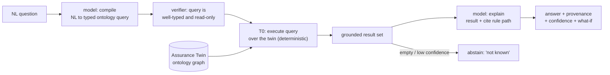

# Assurance Twin (queryable, proactive, verifiable review)

FDAI's answer to the "architecture review agent" request is not a chatbot
bolted onto a document index. It is an **Assurance Twin**: a queryable,
ontology-grounded digital twin of the governed subscription that answers
questions deterministically, reviews changes before anyone asks, and proposes
(never executes) remediation. A model compiles natural language into typed graph
queries and explains the results; the answer itself is produced by the
deterministic engine over the twin, so it is grounded and verifiable by
construction, not by a model's say-so.

> **Scope**: customer-agnostic. The twin's schema, rules, and thresholds are
> generic; a fork supplies its own resource population through the `Inventory`
> seam and its own rule set. No customer values, tenant ids, or resource names
> live here
> ([generic-scope.instructions.md](../../../.github/instructions/generic-scope.instructions.md)).

> **Where it sits**: the twin is a **read-only projection** over the ontology
> graph. It never holds a privileged identity. Every mutation still flows
> through `risk-gate -> executor -> delivery`, preserving the read-only surface
> rule in
> [app-shape.instructions.md](../../../.github/instructions/app-shape.instructions.md).
> Answering a question is never an action.

## What this doc covers

This document specifies the review/assurance surface that covers the
architecture-review, Q&A, and assessment-report use cases without regressing the
deterministic-first, event-driven, risk-gated design. It reuses the ontology in
[llm-strategy.md](../architecture/llm-strategy.md#ontology-foundation), the tiered router and
quality gate in
[architecture.instructions.md](../../../.github/instructions/architecture.instructions.md),
the detection findings in
[observability-and-detection.md](../rules-and-detection/observability-and-detection.md), and the
deployment analyzer in [deployment-preflight.md](../deployment/deployment-preflight.md). It
adds one new subsystem, `core/assurance_twin/`, and one delivery intent; the rest
is composition of existing parts.

> **Implementation status**: `core/assurance_twin/` contains an in-memory projection,
> verified deterministic query execution, posture-report assembly, publisher-neutral review
> glue, and a simulation-fidelity ledger, all covered by focused tests. Production inventory
> composition, a model-backed NL compiler, ChatOps intent, Checks API publisher, discovery-loop
> hook, and twin-specific ReadPanel aren't wired yet. The ambient-review, action-bridging, and
> self-improving delivery flows below are target design. A separate Security Assessment report
> feed and Azure analyzer are implemented in the current reporting subsystem.

## Why not a chatbot

A retrieval-augmented chatbot answers the review use cases with five structural
defects. The twin inverts each one.

| Chatbot limitation | Consequence | Assurance Twin shift |
|--------------------|-------------|----------------------|
| **Reactive** - answers only when asked | reproduces the review-queue lead time (wait for a request, then wait for a human) | **Ambient** - reviews changes proactively on the change event, before a request exists |
| **Ungrounded** - vector similarity over prose | hallucinated verdicts reach a deploy | **Ontology-grounded** - answers are deterministic graph queries with a cited rule path |
| **Stateless** - reads documents, not the live estate | no real evidence for "why is this non-compliant" | **Stateful twin** - a live projection of the subscription kept fresh by inventory delta |
| **Inert** - returns information and stops | a human still fixes it by hand | **Action-bridging** - an answer can carry a shadow remediation-PR proposal |
| **Static** - the index goes stale | wrong answers after a policy change | **Self-improving** - unanswered / abstained questions feed the rule discovery loop |

## The five shifts

### 1. Ambient (reactive to proactive)

The twin reviews changes on the event, not on request. When a change signal
arrives (an IaC pull request opened, an Activity Log resource write, a drift
diff), `event-ingest` normalizes it, the twin applies the diff to a scratch
projection, T0 evaluates the affected rules, and the result is posted back as a
review - a Checks API annotation on the PR, or a finding on the incident. The
"assess after deploy on request" case becomes "assessed on change, unprompted".

Example: a developer opens an IaC PR that adds a storage account without a
private endpoint. Before any review is requested, the twin posts a Check:
`blocked - object-storage.private-endpoint.required (rule cited), resolution:
add private endpoint or apply exemption`.

### 2. Ontology-grounded (retrieval to graph query)

The twin is the ontology graph, not a prose index. Every governed resource is a
`Resource` ObjectType; relationships are the existing typed LinkTypes
(`contains`, `attached_to`, `depends_on`), and rule matches are `Finding`s (see
[llm-strategy.md](../architecture/llm-strategy.md#ontology-foundation)). "Why is this resource
non-compliant" is answered by a graph traversal that returns a concrete evidence
chain, for example:

```text
Resource:storage-x --attached_to--> Resource:subnet-y
subnet-y --contains(-1)--> vnet-z
Finding: storage-x violates rule:object-storage.private-endpoint.required
  evidence: rule path + evaluated property (publicNetworkAccess=Enabled)
```

The chain is deterministic and reproducible: the same twin state yields the same
answer regardless of who asks or how the question is phrased.

### 3. Verifiable (text-to-query, not text-to-answer)

This is the core mechanism. The model is used to **compile a natural-language
question into a typed ontology query** and, at the end, to **render the result
back into prose**. It is never the source of the fact.



- **Compilation is verified**: the compiled query MUST be well-typed against the
  ontology schema and MUST be read-only; a query that fails the check is rejected,
  not executed. This is the same fail-closed posture as the T2 verifier.
- **Answers route through the tiers**: an exact rule/graph match resolves at
  **T0**; a fuzzy question near a known pattern uses **T1** similarity; only a
  genuinely novel or ambiguous question reaches **T2**, and T2 output clears the
  [quality gate](../../../.github/instructions/architecture.instructions.md#llm-quality-gate-required-for-t2)
  (mixed-model cross-check, verifier, grounding) before it is shown.
- **Grounding or abstain**: every answer cites the rules and graph nodes that
  justify it. An answer that cannot be grounded returns "not known", never a
  guess. Hallucination is closed off by construction, not by prompt tuning.

### 4. Action-bridging (inert to proposing)

An answer may carry a proposed fix, but the twin never executes. When a question
resolves to a fixable Finding, the twin can attach a **shadow remediation-PR
proposal** built from the rule's `remediates` ActionType. Acting on it is the
existing gated path: `risk-gate -> executor -> delivery`, with HIL for anything
high risk (see [risk-classification.md](../decisioning/risk-classification.md)). Chat and the
console remain read-only surfaces; a proposal is a link to a PR, never a button
that mutates.

Example: "fix the storage accounts missing a private endpoint" resolves to a set
of Findings; the twin opens one shadow remediation-PR per resource (batched under
the blast-radius cap), each with a rollback contract, and routes to HIL. Nothing
changes until a human approves.

### 5. Self-improving (static to living)

Questions are a discovery signal. A question the twin **abstains** on, or a
recurring question with no covering rule, is emitted as a candidate to the
autonomous rule discovery loop in
[architecture.instructions.md](../../../.github/instructions/architecture.instructions.md)
(the same loop that watches HIL patterns and overrides). The candidate carries
provenance and passes the standard quality gate before it can enter the catalog;
the twin never mutates the catalog directly. The knowledge surface therefore
tracks the estate instead of going stale.

## Twin as simulator (what-if over the whole graph)

The per-action what-if verifier
([architecture.instructions.md](../../../.github/instructions/architecture.instructions.md#llm-quality-gate-required-for-t2))
predicts the effect of a single change. The twin generalizes it to the whole
graph: apply a proposed change to a **scratch projection** and evaluate the
consequences before anything touches the live estate. One simulation surface
serves all three verticals, which is why the twin simplifies rather than
complicates the design.

| Vertical | Simulation question | Answered by |
|----------|---------------------|-------------|
| **Change Safety** | what is the blast radius of this change? what breaks downstream? | traverse `attached_to` / `depends_on` from the changed `Resource`; report affected set + newly-violated rules |
| **Resilience (DR)** | does the estate meet target RPO/RTO? what fails over? | replay a region/zone-loss scenario against the twin; report resources without a recovery path and the projected RPO/RTO gap |
| **Cost Governance** | what is the cost delta of this change / this optimization? | apply the SKU/scale delta on the projection; report the projected unit-cost change |

- **Read-only and deterministic**: a simulation mutates only the scratch
  projection, never the live estate or the audit store. It is a T0-flavored pass:
  static graph evaluation resolves most of it; bounded read-only probes confirm
  the rest, exactly as [deployment-preflight.md](../deployment/deployment-preflight.md) does.
- **Shadow-first**: each simulation-derived finding ships in shadow mode and is
  promoted per the shadow-to-enforce rule only after its accuracy and
  false-positive rate are measured on the frozen scenario set
  ([goals-and-metrics.md](../architecture/goals-and-metrics.md)).
- **Fidelity-measured**: `core/assurance_twin/fidelity.py`
  (`SimulationFidelityLedger`) is the mechanism behind that promotion. It joins
  each **predicted** effect (cost delta, blast-radius count, RPO/RTO gap) with
  the **actual** observed outcome by a stable prediction id and accumulates
  per-predictor MAE, MAPE, and a within-tolerance rate. `is_reliable` turns
  those into a fail-closed promotion signal: a predictor below a minimum sample
  count or above a MAPE bar is not reliable, so the caller keeps it in (or demotes
  it back to) shadow. This stops an unmeasured what-if from acting as an oracle -
  a simulation that does not come true loses its enforce eligibility automatically.

## Assessment report (subscription posture, on demand)

The proactive per-change review composes into a full-estate report. Running every
applicable rule against the current twin produces a `PostureAssessmentReport` - a
generalization of the `DeploymentReadinessReport`
([deployment-preflight.md](../deployment/deployment-preflight.md)) from a single deploy to the
whole subscription. Each entry keeps the same three required parts - grounded
evidence (a cited rule), a severity, and a resolution mapped to a concrete lever -
so the report is actionable, not just a score. The console renders it through a
read-only `ReadPanel` route
([project-structure.md](../architecture/project-structure.md#injectable-seams)); it issues no
privileged calls.

### Deep security assessment

The security-scoped report keeps more context than a severity-only finding
list. Collectors normalize Azure Resource Graph properties, server parameters,
Defender assessments, WAF records, policy compliance, diagnostic settings, and
version/advisory matches into `SecurityControlObservation` values. Each
observation records the current and expected values, control status,
applicability, source and collection time, evidence references, remediation and
validation steps, priority and due interval, CVE applicability and patch state,
compliance mappings, and managed-service patch notes.

Applicability is a bounded enum (`applicable`, `not_applicable`, `unknown`) and
observation timestamps are timezone-aware. An `unknown` control is an evidence
gap, not an actionable recommendation. Recommendations are derived only from
failed or warning controls with grounded remediation text.

The assessment records which source supplied each fact:

| Source data | Information extracted |
|-------------|-----------------------|
| Azure Resource Graph resource properties | AKS version, private API, RBAC, network policy, Entra/local-account state, workload identity, image cleaner, add-ons, upgrade channels; MySQL network, backup, HA, encryption, and version |
| Azure Resource Graph `sku` and `kind` | AKS and MySQL service tier and resource kind |
| AKS node-pool resource properties | Node image version, secure boot, and virtual TPM |
| MySQL server parameters | Secure transport, allowed TLS versions, and audit logging |
| Azure Monitor diagnostic settings | Whether approved platform logs and metrics are routed to an evidence store |
| Defender for Cloud assessments | Runtime protection coverage and actionable unhealthy findings |
| Application Gateway WAF logs | Matched/blocked rules, attack details, resource, and event evidence |
| Security bulletins and advisory matches | CVE id, applicability, patch state, source URL, and managed-service backport note |
| Rule and compliance metadata | Expected value, rationale, remediation, validation, priority, due interval, and compliance controls |
| Report-feed timestamps and source errors | Evidence window, source availability, partial reads, and freshness gaps |

After an observed ARG or ARM inventory snapshot is promoted, the inventory job
reads only the active AKS, node-pool, and MySQL records under a bounded row cap,
runs the deterministic Azure analyzer, and writes timestamped control signals to
the durable report feed. Supplemental providers can add server parameters,
diagnostic-setting state, Defender coverage, and advisory matches. When they are
not configured, their controls and source coverage remain `unknown` or
`unavailable` instead of failing the control.

`build_security_assessment` remains a pure deterministic fold. It derives the
verdict and also reports:

- finding, rule, resource, resource-type, control, and evidence counts;
- pass, fail, warning, not-applicable, and unknown control counts;
- control pass rate, evidence coverage, and source coverage;
- category and resource-type distributions;
- positive controls and unknown controls;
- prioritized recommendations with due timestamps and validation steps;
- CVE applicability, patch status, and compliance mappings;
- available, partial, unavailable, and stale data-source counts.

A `clear` verdict describes the observed risk only. It does not imply that the
assessment is complete. `completion_status`, source coverage, stale sources,
unknown controls, and missing evidence stay visible so an unavailable provider
cannot turn into a false clean result.

The read-only `Security Assessment` catalog report renders these projections
through the existing Reports page. It uses KPI, control-status, chart, table,
group, tabs, and note widgets, so no new browser execution surface or
privileged identity is introduced.

## Module placement

The subsystem lives in `core/assurance_twin/` and imports only `shared/`
contracts and providers, like every other core subsystem
([project-structure.md](../architecture/project-structure.md#module-boundaries)). It holds no
cloud SDK and no privileged identity.

| Component | Responsibility |
|-----------|----------------|
| `projection` | Build immutable in-memory baselines and apply scratch diffs. Production `Inventory.full_snapshot()` + `delta()` maintenance is a target binding. |
| `query` | Verify and execute well-typed read-only queries with a deterministic pattern compiler. A model-backed compiler is a Protocol target. |
| `review` | Publish precomputed findings through `IacReviewPublisher`. Change-signal evaluation and a production publisher are target bindings. |
| `report` | assemble the `PostureAssessmentReport` from Findings |
| `chat` | Provide immutable grounded chat-session values and a persistence Protocol; no browser or delivery binding. |

Target delivery adds one intent to the existing `chatops` adapter (question in, grounded answer
out) and reuses the `gitops-pr` adapter for proposals and Checks API reviews. The current
repository has only the `IacReviewPublisher` Protocol and test double, not a production publisher
or ChatOps binding. Adding them doesn't introduce a new privileged surface.

## Safety posture

- **Read-only twin, gated execution**: the twin and every answer are read-only;
  the only path to a mutation is a proposal that enters `risk-gate -> executor`,
  with the four safety invariants (stop-condition, rollback, blast-radius limit,
  audit entry) enforced there, not in the twin.
- **Fail closed**: an ungroundable answer abstains; a mis-typed or non-read-only
  compiled query is rejected; a stale twin (`Inventory` freshness beyond
  `freshness_ttl`) refuses to answer estate-state questions rather than answer
  from ghost data, mirroring `RequiresInventoryFresh`
  ([llm-strategy.md](../architecture/llm-strategy.md)).
- **Untrusted input**: question text and change payloads are untrusted and may
  carry prompt injection; the verifier and the read-only query contract are the
  authority, never the model's free text (threat model in
  [security-and-identity.md](../architecture/security-and-identity.md)).
- **Audited**: every proposal, review, and simulation-derived finding writes an
  audit entry with its grounding; a read-only question that produces no proposal
  is logged but is not an action.

## Phasing

The twin lands incrementally on top of the existing phases; it introduces no new
tier and no new autonomy that the risk gate does not already govern.

| Phase | What lands | Gate |
|-------|------------|------|
| **P2** ([phase-2-quality-and-t1.md](../phases/phase-2-quality-and-t1.md)) | twin projection from inventory; verified text-to-query; grounded answers via the quality gate; abstain-to-discovery feedback | answers are grounded or abstain; zero ungrounded answers on the scenario set |
| **P3** ([phase-3-integrated-loop.md](../phases/phase-3-integrated-loop.md)) | ambient per-change review; whole-graph simulation for Change/DR/FinOps; shadow remediation-PR proposals; `PostureAssessmentReport` panel | each simulation finding measured shadow-first before enforce |

## Next steps

| To learn about | Read |
|----------------|------|
| the ontology the twin queries | [llm-strategy.md](../architecture/llm-strategy.md#ontology-foundation) |
| the tiers and quality gate answers route through | [architecture.instructions.md](../../../.github/instructions/architecture.instructions.md#llm-quality-gate-required-for-t2) |
| the deploy analyzer the report generalizes | [deployment-preflight.md](../deployment/deployment-preflight.md) |
| detection findings the review consumes | [observability-and-detection.md](../rules-and-detection/observability-and-detection.md) |
| where the subsystem sits in the repo | [project-structure.md](../architecture/project-structure.md#module-boundaries) |
| how proposals are risk-classified | [risk-classification.md](../decisioning/risk-classification.md) |
