# 코드 보안 점검 결과

이 문서는 FDAI가 소스 코드 보안 점검 결과를 근본 원인마다 하나의 정본 이슈로 만들고, 모호하지
않은 심각도 하나, 결정론적 우선순위, 그리고 개발자가 GitHub Copilot이나 Claude Code로 실행할 수
있는 대화형 조치 팩을 제공하는 방법을 정의합니다. FDAI는 자체 스캔 레인의 결과와 Microsoft
MDASH(Codename MDASH 에이전트형 코드 스캐너), GitHub code scanning, Opengrep, Trivy 및 기타
생산자의 SARIF(Static Analysis Results Interchange Format) 보고서에 같은 모델을 적용합니다.

> **범위:** 이 경로에서 FDAI는 고객 저장소를 직접 수정하지 않습니다. 개발자가 자신의 권한으로
> 로컬에서 조치하고, FDAI는 재스캔으로 검증하기 전까지 반환된 모든 상태를 주장으로 취급합니다.
> 새 기능은 shadow 모드, 즉 FDAI가 관찰하고 기록하지만 변경하지 않는 모드로 시작합니다.

> **상태:** 결정론적 코어, 카탈로그, 서명된 조치 팩, 팩 레지스트리, 반출 검사, 재스캔 검증,
> 오탐 판정, Heimdall 검토 drift, 알림, 운영자 CLI, 결정론 스캔 레인
> ([코드 보안 스캔](code-security-scanning-ko.md)), 오프패스 LLM 렌즈 레인, 약점 검증기, 평가 도구,
> 읽기 전용 Console 화면이 구현되었습니다.
> [구현 원장](../../roadmap-implementation/operations/code-security-findings.md)을 참조하세요.

## 설계 개요

에이전트형 코드 스캐너를 시범 도입한 조직은 세 가지 문제를 보고합니다. 심각도 기준이 모호하고,
하나의 약점이 서로 다른 심각도로 여러 번 나타나며, 사람이 하나씩 조치하기에는 결과가 너무
많습니다. FDAI는 각 문제를 결정론적으로 해결합니다:

| 문제 | FDAI의 대응 |
|------|-------------|
| 모호한 심각도 | 심각도, 신뢰도, 위협, 노출, 우선순위를 별도 축으로 나눕니다. 심각도는 버전이 관리되는 기준표를 통해 검증된 사실에서 산출하고, 확인되지 않은 사실은 명시적인 범위로 표시합니다. |
| 한 항목, 여러 심각도 | 개별 보고를 근본 원인과 수정 위치마다 하나의 이슈로 합칩니다. 이슈에는 사용자에게 보이는 심각도가 정확히 하나 있고, 그 값을 결정한 인스턴스를 함께 표시합니다. |
| 사람이 하나씩 조치하기에 너무 많은 결과 | 이슈를 수정 그룹으로 묶어 조치 팩으로 내보냅니다. 코딩 에이전트가 개발자에게 범위와 깊이를 묻고, 그룹 단위로 수정, 테스트, 검사, 커밋을 진행합니다. |

예: MDASH와 Opengrep이 모두 `src/db.py:42`에서 SQL 주입을 보고하고, MDASH는 Critical로,
Opengrep은 경고로 표시합니다. FDAI는 두 SARIF 파일을 수집하고 두 생산자의 심각도를
`source_severity`로 보존합니다. 공격자 위치가 아직 검증되지 않았으므로 신뢰도 `corroborated`,
심각도 `undetermined (medium to critical)`인 이슈 하나를 만들고, 우선순위 P2를 부여한 뒤 수정
그룹 `FG-002`에 넣습니다. 개발자가 `/fdai-remediate`를 실행해 깊이 D2를 고르면, 에이전트는
회귀 테스트와 함께 매개변수화된 쿼리를 커밋합니다.

## 파이프라인

```mermaid
flowchart LR
    A[Acquire exact revision] --> B[Prepare attack surface]
    B --> C[Scan lanes]
    C --> D[Ingest SARIF]
    D --> E[Canonical issues]
    E --> F[Severity and priority]
    F --> G[Fix groups and pack]
    G --> H[Developer session]
    H --> I[Result import]
    I --> J[Rescan verification]
```

| 레인 | 생산자 | 검증 전 신뢰도 |
|------|--------|----------------|
| 결정론 | FDAI가 작성한 규칙을 쓰는 Opengrep 같은 규칙 엔진, OSV-Scanner, gitleaks, Trivy | `reported` |
| LLM 렌즈 | 우선순위가 매겨진 코드와 코드 속성 그래프 문맥을 보는 약점 유형별 렌즈 | `hypothesis` |
| 외부 | MDASH, GitHub code scanning, Defender 또는 SARIF 2.1.0 생산자 | `reported` |

독립된 생산자 둘 이상이 하나의 근본 원인에 동의하고 그중 하나 이상이 LLM 레인이 아니면 신뢰도가
`corroborated`로 올라갑니다. 결정론적 약점 검증기만 신뢰도를 `verified`로, 재현 가능한 동적
입증만 `proven`으로 올릴 수 있습니다. 모델 간 합의로는 이 단계에 도달할 수 없습니다.

## SARIF 수집

어느 생산자가 만들었든 모든 SARIF 문서는 신뢰할 수 없는 입력입니다. 수집 과정은 다음과 같습니다:

- **입력 제한:** 파싱 전후로 바이트, 중첩 깊이, 실행, 결과, 위치, 코드 흐름 수에 상한을 적용하고,
  크기를 넘거나 형식이 잘못된 입력은 거부합니다.
- **역참조 없음:** 아티팩트 URI, 외부 속성 파일, 도움말 URI, 링크는 데이터로만 취급합니다.
- **경로 정규화:** 저장소 상대 경로만 받습니다. 절대 `file:` 경로는 명시적으로 구성된 소스 루트를
  기준으로만 상대 경로로 바꾸고, 상위 디렉터리 탐색은 차단합니다.
- **텍스트 정리:** 제어 문자와 양방향 재정의 문자를 제거하고 모든 텍스트 필드를 잘라냅니다.
- **제외 기록:** 억제된 결과, 실패가 아닌 결과, 위치가 없거나 해석할 수 없는 결과는 이유별로
  집계해 커버리지 한계로 표시합니다.

레인과 정확한 리비전은 호출자가 지정합니다. 둘 다 문서에서 읽지 않습니다.

## 심각도 모델

| 축 | 값 | 출처 |
|----|----|------|
| 심각도 | `critical`, `high`, `medium`, `low` 또는 하한과 상한이 있는 `undetermined` | [심각도 기준표](../../../rule-catalog/code-security/severity-rubric.yaml)를 통한 검증된 사실 |
| 신뢰도 | `hypothesis`, `reported`, `corroborated`, `verified`, `proven` | 레인, 검증기, 입증 |
| 위협 | 알려진 악용(CISA Known Exploited Vulnerabilities, KEV)과 악용 예측(EPSS) | 고정된 위협 정보 스냅샷 |
| 노출 | `exposed`, `internal`, `not_deployed`, `unknown` | 런타임 인벤토리 |
| 우선순위 | 조치 기한이 있는 `P0`부터 `P4` | 첫 일치 규칙을 쓰는 [우선순위 정책](../../../rule-catalog/code-security/priority-policy.yaml) |

- **사실:** 각 인스턴스에는 영향, 공격 경로, 필요 권한, 사용자 상호작용이라는 네 가지 사실이
  있습니다. 각 사실은 검증되었거나 알 수 없음 상태입니다. 사실은 결정론적 검증기, 인벤토리 또는
  권한 있는 사람에게서 오며, 스캐너 텍스트에서는 가져오지 않습니다.
- **범위:** 하한은 알 수 없는 사실을 가장 덜 심각한 값으로, 상한은 가장 심각한 값으로
  계산합니다. 두 등급이 같으면 그 등급이 심각도가 됩니다. 다르면 `undetermined`와 함께, 검증되면
  한쪽 경계를 움직일 수 있는 `deciding_facts`를 표시합니다.
- **영향 범위:** 영향을 알 수 없으면 [약점 유형](../../../rule-catalog/code-security/weakness-classes.yaml)이
  범위를 정합니다. 명령 주입은 항상 코드 실행이고, SQL 주입은 데이터 읽기 또는 쓰기입니다.
- **권고:** 의존성 권고는 생산자가 보고한 CVSS 기본 점수를 사용합니다. 점수가 서로 다르면 하나를
  임의로 고르지 않고 범위로 표시합니다.
- **위협과 노출:** KEV 등재 여부와 런타임 노출은 우선순위와 조치 기한만 바꿉니다. 심각도는 바꾸지
  않습니다.
- **외부 등급:** MDASH, SARIF, 규칙 엔진의 등급은 참고용 `source_severity`로 남습니다.

기준표 점수는 CVSS(Common Vulnerability Scoring System)의 기본 지표 개념에 맞춘 결정론적
판정표입니다. CVSS 점수는 아닙니다.

## 정본 이슈와 수정 그룹

| 단계 | 의미 | 표시되는 심각도 |
|------|------|-----------------|
| 개별 보고 | 하나의 생산자, 레인, 계층에서 나온 결과 하나 | `source_severity`만 |
| 인스턴스 | 소스에서 싱크까지의 경로 하나, 또는 의존성 계층 하나 | 상세 화면에서만 |
| 이슈 | 하나의 수정 위치에 있는 근본 원인 하나 | 사용자에게 보이는 유일한 심각도 |
| 수정 그룹 | 하나의 일관된 변경으로 함께 고쳐지는 이슈 | 구성원 중 가장 높은 우선순위 |

- **코드 결과:** 같은 약점 유형과 같은 수정 위치를 공유하면 하나로 합칩니다. 수정 위치는 SARIF
  기본 위치의 경로와 시작 줄이며, 생산자는 이 위치를 싱크에 둡니다. 같은 싱크로 들어오는 서로 다른
  소스 경로는 인스턴스가 됩니다.
- **CWE 처리:** CWE(Common Weakness Enumeration) ID가 약점 유형에 정확히 포함될 때만 인정합니다.
  CWE 상하위 관계만으로는 합치지 않으며, 목록에 없는 CWE는 생산자와 규칙을 키로 하는
  `unclassified` 묶음에 남습니다.
- **의존성:** 같은 패키지를 가리키고 권고 별칭(CVE, GHSA, OSV)을 하나라도 공유하면 합칩니다.
  lockfile, 이미지, 워크로드 계층은 인스턴스가 됩니다.
- **이슈 심각도:** 이슈의 하한은 인스턴스 하한 중 가장 높은 값입니다. 상한과 결정 인스턴스는
  상한이 가장 높은 인스턴스에서 가져옵니다.
- **수정 그룹:** 의존성 이슈는 패키지별로, 비밀 정보는 파일별로, 그 밖의 코드 이슈는 약점 유형과
  파일별로 묶습니다. 각 그룹에는 허용 경로, 조치 지침, 최대 깊이, 프로젝트 루트, 테스트 명령이
  있습니다. 업그레이드와 구성 변경이 코드 변경보다 먼저 옵니다.

## 조치 팩

조치 팩은 FDAI가 모델 없이 결정론적으로 만드는 읽기 전용 변환 결과입니다:

| 구성 | 목적 |
|------|------|
| `REMEDIATE.prompt.md` | 도구에 중립적인 대화형 절차 |
| `adapters/` | GitHub Copilot 프롬프트 파일, Claude Code 명령, AGENTS 조각 |
| `findings/` | 색인, 그룹별 상세, 정본 SARIF |
| `policy/remediation-policy.json` | 팩 한도와 diff 검사 규칙 |
| `tools/` | 표준 라이브러리만 쓰는 도우미: `fdai_remediate.py`, `fdai_pack_runtime.py`, `fdai_diff_guard.py` |
| `pack.manifest.json` | 파일별 SHA-256, 기준 커밋, 카탈로그 버전, 만료 시각, 커버리지 한계 |

세션은 프롬프트가 안내하고 도우미가 강제하는 상태 기계입니다:

1. **사전 점검:** 다이제스트, 만료, 기준 커밋 포함 여부, 깨끗한 작업 트리, 재개 상태를 확인합니다.
2. **요약:** 우선순위, 심각도, 신뢰도별 이슈 수와 커버리지 한계를 보여 줍니다.
3. **범위 질문:** 대상, 신뢰도, 깊이, 진행 방식, 커밋, 테스트, 실패 처리를 한 번에 하나씩
   묻습니다. 권장 선택지를 먼저 제시합니다.
4. **계획과 브랜치:** 순서가 정해진 수정 그룹을 승인받은 뒤 `fdai/sec/<pack_id>`를 만듭니다.
5. **그룹 반복:** 재검증, 분류, 수정, 테스트, 검사, 커밋, 체크포인트를 진행합니다.
6. **마무리:** `result/remediation-result.json`을 작성하고 사람이 할 후속 작업을 나열합니다.
   push와 pull request는 명시적으로 동의한 경우에만 진행합니다.

| 깊이 | 에이전트 작업 |
|------|---------------|
| D0 분류 | 수정하지 않고 각 이슈를 확인하거나 반박합니다 |
| D1 완화 | 경계에서 최소한으로 완화하며, 이슈는 열린 상태로 남습니다 |
| D2 수정 | 근본 원인을 고치고, 테스트 하네스가 있으면 회귀 테스트를 추가합니다 |
| D3 강화 | D2에 더해 같은 패턴의 변형도 고칩니다 |
| `plan_only` | 인증 우회처럼 설계 변경이 필요한 유형에 대한 계획 메모 |

diff 검사기는 허용 경로 밖의 수정, 스캐너 무시 파일, 팩 파일, 추가된 억제 주석, 건너뛴 테스트,
비활성화된 TLS 검증, 삼킨 예외, 삭제된 테스트, 제거된 단언, 바이너리 변경, 크기를 넘는 diff를
차단합니다. 같은 모듈이 도우미와 서버에서 실행됩니다.

**데이터 보호:**

- **최소화 모드:** 외부 코딩 에이전트 서비스로 취약점 상세를 보낼 수 없는 조직을 위해 코드 흐름,
  인스턴스 소스 경로, 허용 경로의 코드 흐름 파일, 스캐너 메시지를 뺍니다.
- **비공개 파일:** 운영자 CLI는 소유자만 접근할 수 있는 권한으로 팩을 기록합니다. FDAI의 팩 기록은
  팩 밖에 둡니다.
- **공개 제한:** 커밋 메시지에는 약점 유형과 이슈 ID만 넣습니다.

**무결성과 반출 통제:**

- **서명:** FDAI는 정확한 매니페스트 바이트를 Ed25519 키로 서명해 DSSE 봉투
  (`pack.manifest.dsse.json`)에 담습니다. 매니페스트에 모든 파일의 다이제스트가 있으므로 서명
  하나로 팩 전체를 인증합니다. 도우미는 개발자가 FDAI에서 별도 경로로 받은 공개 키로 표준
  라이브러리 기반 RFC 8032 검증기를 사용해 서명을 확인합니다(`verify --trusted-key`).
  매니페스트에 적힌 키 ID만으로는 신뢰하지 않습니다.
- **레지스트리와 폐기:** FDAI는 내보낸 모든 팩(ID, 매니페스트 다이제스트, 기준 커밋, 이슈, 만료)을
  팩 레지스트리에 기록합니다. 결과 가져오기는 이 기록만 읽으며, 폐기된 팩의 결과는 거부합니다.
- **반출 검사:** 배포 환경이 승인한 코딩 에이전트 제공자에게만 팩을 내보냅니다. 승인 항목에는
  데이터 상주 위치, 학습 미사용 약속, 보존 기간, 승인 종료일, 받을 수 있는 팩 모드가 있습니다.
  업스트림 정책은 아무 제공자도 승인하지 않으므로, 설치 환경이 제공자를 등록하기 전까지 반출이
  차단됩니다. 운영자 CLI의 기본값은 최소화 모드입니다.

## 결과 가져오기와 검증

가져오기는 결과를 FDAI 자체의 팩 기록에 묶습니다. 팩 ID, 매니페스트 다이제스트, 기준 커밋, 만료,
폐기 여부, 이슈 소속, 상태 어휘, 커밋 ID를 확인합니다. 모든 상태는 주장으로 남습니다:

| 주장 | 다음 단계 |
|------|-----------|
| `fixed_claimed`, `mitigated_claimed`, `stale_or_already_fixed` | 주장한 커밋을 재스캔 |
| `claimed_false_positive` | 권한 있는 사람의 판정 |
| `deferred`, `failed`, `plan_only`, `not_attempted` | 없음 |

이슈는 새 트리를 재스캔할 때 같거나 명시적으로 더 새로운 스캐너, 규칙, 카탈로그 버전을 쓰고,
커버리지가 기준선 이상이며, 근본 원인 패턴이 더 이상 발견되지 않을 때만 수정된 것으로 처리됩니다.
MDASH와 GitHub code scanning 이슈는 해당 도구의 새 스캔이 필요합니다.

FDAI는 내보낼 때 기준 커버리지 증적과 이슈 스냅샷을 팩 기록과 함께 저장합니다. 증적에는
생산자별로 규칙 버전, 모든 실행이 완료를 보고했는지, 잘린 실행이 있는지, 분석한 파일 목록이
기록됩니다. SARIF로 신뢰성 있게 전달할 수 없는 사실, 즉 규칙 버전, 저장소 전체 분석 여부, 기준
버전을 대체하는 규칙 버전은 운영자가 명시할 수 있으며, 이렇게 명시한 값은 그 사실과 함께
기록됩니다. 수정 검증은 주장마다 하나의 판정을 반환합니다:

| 판정 | 조건 |
|------|------|
| `fixed_verified` | 재스캔이 주장한 커밋을 대상으로 하고, 이슈를 보고한 모든 생산자에 대해 커버리지가 동등하며, 근본 원인과 일치하는 재스캔 이슈가 없음 |
| `still_present` | 커버리지가 동등하고, 다른 줄에서라도 근본 원인과 일치하는 재스캔 이슈가 있음 |
| `inconclusive` | 완료 미보고, 잘림, 분석되지 않은 파일, 대체 선언 없는 규칙 버전 변경, 다른 커밋 같은 커버리지 공백이 있음 |
| `not_applicable` | 재스캔이 필요 없는 주장 |

오탐 주장은 주장한 사람이 아닌 다른 사람이 승인 참조와 근거를 기록해 판정합니다. 명시적으로
선택한 단일 운영자 프로필에서만 한 주체가 두 역할을 함께 맡을 수 있습니다. 검증 기록과 판정
기록은 팩의 변경 불가능한 검토 로그에 추가됩니다.

## 에이전트 소유권과 권한

- **새 에이전트와 토픽 없음:** 스캐너와 팩 생성은 작업자와 어댑터이며 판테온 에이전트가 아니고,
  AgentSpec 집합도 바뀌지 않습니다.
- **검토 신호:** 스캔은 건수, 노출, 커버리지 완전성, 최대 20개의 불투명한 이슈 ID를 담은 엄격한
  검토 패키지를 만듭니다. 경로, 코드, 심볼, 스캐너 텍스트는 담지 않으며
  `review_required: true`와 `grants_authority: false`를 선언합니다.
- **Heimdall:** 주입된 변환기가 패키지를 검증하고, Heimdall이 자신이 소유한 `object.drift`
  토픽(`event_type: code_security.findings_drift`)에 shadow 상한으로 게시합니다. 결정 값은
  `urgent`(P0 이슈), `open`, `clear`, `coverage_incomplete` 중 하나입니다. LLM은 사용하지 않습니다.
- **Forseti와 Saga:** Forseti는 다른 검토 필수 drift와 같은 방식으로 판정해 사람 승인 결정
  (`hil` verdict)을 내리고, Saga가 그 판정을 감사합니다.
- **알림:** A2 경로(`code_security_operational_alert`)는 긴급, 알려진 악용, 커버리지 불완전 경고를
  전달하고, A4 경로(`digest_code_security_findings_daily`)는 요약을 전달합니다. 둘 다 영어와
  한국어로 표시되며 별칭, 리비전, 건수만 담습니다. 배포 환경의 매트릭스에 두 경로 중 하나라도
  없으면 승인 채널로 대체하지 않고 계획 단계에서 실패합니다.
- **LLM 렌즈 레인:** 핫패스 LLM 사용은 선언된 위치로 제한되므로, 렌즈 레인은 스캔 작업 안에서
  출력이 비활성 가설뿐인 오프패스 작업자로 실행됩니다
  ([코드 보안 스캔](code-security-scanning-ko.md#llm-렌즈-레인)).
- **Console 화면:** `publish-review --record-state`와 `scan --record-state`는 각 검토 묶음을 저장소
  리비전마다 한 번 상태 저장소에 기록하며, 데이터베이스 위치는 `FDAI_STATE_STORE_DSN`에서만
  읽습니다. 이미 기록된 리비전에 다른 묶음이 오면 거부합니다. Operator API는 읽기 역할에
  `GET /code-security/reviews`를 제공하고, Console의 **감사·증적 > 코드 보안** 화면은 판단, 우선순위와
  신뢰도별 건수, 노출, 커버리지를 보여 줍니다. 형식이 잘못된 행은 보류된 기록으로 표시되며, 이
  화면에는 승인, 실행, 조치 컨트롤이 없습니다.
- **팩 레지스트리:** `--registry state-store`는 팩 기록, 폐기, 반출 시점 기준선, 추가 전용 검토
  기록을 로컬 디렉터리 대신 상태 저장소에 보관합니다. 리비전 비교 후 설정 방식을 사용하므로 동시에
  들어온 검토가 사라지지 않습니다. `GET /code-security/packs`는 팩마다 상태, 이슈 수, 최신 수정 검증
  판정 건수, 인정된 오탐을 보여 줍니다. 기준선, 위치, 판단 근거 문구, 승인 참조는 표시하지 않습니다.
- **설치:** 이 경로는 FDAI의 세 가지 설치 경로에 어떤 검사도 추가하지 않습니다.

## 라이선스

CWE ID는 출처를 표기해 참조합니다. OWASP ASVS는 참조만 합니다(CC BY-SA 4.0). FDAI는 Semgrep Rules
License 콘텐츠를 포함하지 않으며 비공개 코드에 CodeQL CLI를 실행하지 않습니다. 대신 고객이 만든
SARIF를 수집합니다. 조치 지침과 규칙은 FDAI가 직접 작성합니다.

## 실패 시 동작

| 조건 | 결과 |
|------|------|
| 형식이 잘못되었거나, 크기를 넘거나, 너무 깊은 SARIF | 형식화된 수집 오류가 발생하고 아무것도 수집하지 않습니다 |
| 서로 다른 리비전의 개별 보고 | 정본화가 해당 묶음을 거부합니다 |
| 알 수 없는 사실 | 범위와 결정 사실을 포함한 `undetermined` 심각도 |
| 팩 한도 초과 | 가장 시급한 이슈가 있는 그룹을 남기고 나머지는 커버리지 한계로 집계합니다 |
| 변조, 만료 또는 범위 밖의 팩 | 도우미 검증이 실패하고 가져오기가 결과를 거부합니다 |
| 검사 위반 | 커밋하지 않고 위반 내용을 개발자에게 보고합니다 |

## 평가 도구

운영자 CLI의 `evaluate` 명령은 레이블이 붙은 평가 자료에 실제 파이프라인을 실행하고, 자료
다이제스트와 카탈로그 버전을 담은 증적을 기록합니다. 각 사례는 생산자의 개별 보고와 검토자가
기대하는 이슈를 나열하며, 이슈마다 수정 위치, 구성 보고, 검토자 등급, 선택적인 검증된 사실을
포함합니다. 평가 도구는 다음을 보고합니다.

- 중복 제거의 쌍 단위 정밀도와 재현율, 잘못 병합된 쌍과 잘못 분리된 쌍
- 기대한 수정 위치 기준의 이슈 단위 탐지 정밀도와 재현율
- 사실을 제공하기 전에는 검토자 등급이 하한-상한 범위 안에 드는 비율, 레이블된 사실을 제공한
  뒤에는 정확 일치율과 이차 가중 카파
- 재실행 안정성과 모든 코드 줄이 이동한 뒤의 재스캔 매칭

평가 자료는 합격 하한을 선언하며, 하나라도 하한에 못 미치면 명령이 실패합니다. 업스트림 평가
자료인 `rule-catalog/code-security/evaluation/synthetic-corpus.yaml`은 작성자가 직접 레이블을 붙인
합성 자료입니다. 이 자료는 연결과 재현성을 입증할 뿐, 루브릭 보정을 입증하지는 않습니다.

## 검증

집중 테스트는 카탈로그 검증, 적대적 SARIF, 경로 정규화, 심각도 재현성, 레인 간과 계층 간 중복
제거, 서로 다른 근본 원인의 비병합, KEV와 노출의 심각도 분리, 팩 결정성과 다이제스트, 최소화 모드,
도우미의 표준 라이브러리 전용 import, 검사 규칙(이름 변경, 따옴표로 묶인 경로, 옵션 형태의 참조
포함), 결과 거부 사유, 임시 git 저장소에서의 종단 간 도우미 세션을 다룹니다. 평가 테스트는 평가
도구가 잘못된 분리, 수정 위치 누락, 등급 불일치를 찾아낸다는 것을 입증합니다.

## 관련 문서

| 알아볼 내용 | 문서 |
|-------------|------|
| 제공 상태와 남은 작업 | [구현 원장](../../roadmap-implementation/operations/code-security-findings.md) |
| 결정론 스캔 레인과 샌드박스 | [코드 보안 스캔](code-security-scanning-ko.md) |
| 클라우드 보안 평가 | [Assurance Twin](assurance-twin-ko.md) |
| 취약점과 위협 정보 출처 | [규칙 카탈로그 수집](../rules-and-detection/rule-catalog-collection-ko.md) |
| 고정된 에이전트 역할 | [에이전트 판테온](../agents/agent-pantheon-ko.md) |
| LLM 계층과 데이터 상주 | [LLM 전략](../architecture/llm-strategy-ko.md) |
| 추적 이슈 | [Issue #1966](https://github.com/dotnetpower/fdai/issues/1966) |
