# Code Security Findings (Detected Issues)

This document defines how FDAI turns source-code security findings into one canonical issue per
root cause, with one unambiguous severity, a deterministic priority, and a conversational
remediation pack that a developer can run with GitHub Copilot or Claude Code. FDAI uses the same
model for findings from its own scanning lanes and for SARIF (Static Analysis Results Interchange
Format) reports from Microsoft MDASH (Codename MDASH agentic code scanner), GitHub code scanning,
Opengrep, Trivy, and other producers.

> **Scope:** FDAI never edits a customer repository on this path. Developers remediate locally
> under their own authority, and FDAI treats every returned status as a claim until a rescan
> verifies it. New capabilities start in shadow mode, where FDAI observes and logs but doesn't
> act.

> **Status:** The deterministic core, catalog, signed remediation pack, pack registry, export
> gate, rescan verification, false-positive adjudication, Heimdall review drift, notifications,
> operator CLI, the deterministic scanning lane ([Code Security Scanning](code-security-scanning.md)),
> the off-path LLM lens lane, weakness verifiers, the evaluation harness, and the Console view with
> source-separated reviews and repository scan requests are implemented. See the [implementation ledger](../../roadmap-implementation/operations/code-security-findings.md).

## Design at a glance

Organizations that pilot agentic code scanners report three problems: severity criteria are
ambiguous, one weakness appears several times at different severities, and too many findings
arrive for people to fix one by one. FDAI addresses each one deterministically:

| Problem | FDAI response |
|---------|---------------|
| Ambiguous severity | Separate axes for severity, confidence, threat, exposure, and priority. Severity comes from verified facts through a versioned rubric, and unknown facts produce an explicit range. |
| One item, many severities | Occurrences collapse into one issue per root cause and fix site. The issue carries exactly one user-visible severity and names the instance that governs it. |
| Too many findings to fix by hand | Issues group into fix groups and export as a remediation pack. A coding agent interviews the developer for scope and depth, then fixes, tests, guards, and commits one group at a time. |

Example: MDASH and Opengrep both report SQL injection at `src/db.py:42`, MDASH as Critical and
Opengrep as a warning. FDAI ingests both SARIF files, keeps both producer severities as
`source_severity`, creates one issue with confidence `corroborated` and severity
`undetermined (medium to critical)` because the attacker position is not yet verified, assigns
priority P2, and places it in fix group `FG-002`. The developer runs `/fdai-remediate`, picks
depth D2, and the agent commits a parameterized query with a regression test.

## Pipeline

| Lane | Producer | Confidence before verification |
|------|----------|--------------------------------|
| Deterministic | Rule engines such as Opengrep with FDAI-authored rules, OSV-Scanner, gitleaks, and Trivy | `reported` |
| LLM lens | Weakness-specific lenses over ranked code and code-property-graph context | `hypothesis` |
| External | MDASH, GitHub code scanning, Defender, or any SARIF 2.1.0 producer | `reported` |

Two or more independent producers that agree on one root cause, with at least one non-LLM lane,
raise confidence to `corroborated`. Only a deterministic weakness verifier raises it to
`verified`, and only reproducible dynamic proof raises it to `proven`. Model agreement never grants
those levels.

## SARIF ingestion

Every SARIF document is untrusted, whichever producer created it. Ingestion:

- **Bounds input:** byte, nesting-depth, run, result, location, and code-flow limits apply before and
  after parsing, and oversize or malformed input fails closed.
- **Never dereferences:** artifact URIs, external property files, help URIs, and links stay data.
- **Normalizes paths:** only repository-relative paths are accepted. An absolute `file:` path is
  relativized only against an explicitly configured source root, and traversal is rejected.
- **Sanitizes text:** control and bidirectional-override characters are removed, and every text
  field is truncated.
- **Records drops:** suppressed, non-failure, location-less, and unresolvable results are counted
  by reason and listed as coverage limits.

The caller names the lane and the exact revision. Neither is read from the document.

## Severity model

| Axis | Values | Source |
|------|--------|--------|
| Severity | `critical`, `high`, `medium`, `low`, or `undetermined` with a floor and ceiling | Verified facts through the [severity rubric](../../../rule-catalog/code-security/severity-rubric.yaml) |
| Confidence | `hypothesis`, `reported`, `corroborated`, `verified`, `proven` | Lanes, verifiers, and proof |
| Threat | Known exploitation (CISA Known Exploited Vulnerabilities, KEV) and exploit prediction (EPSS) | Pinned threat-intelligence snapshot |
| Exposure | `exposed`, `internal`, `not_deployed`, `unknown` | Runtime inventory |
| Priority | `P0` to `P4` with a due interval | First-match [priority policy](../../../rule-catalog/code-security/priority-policy.yaml) |

- **Facts:** each instance has four facts: impact, attack vector, privileges required, and user
  interaction. Each is verified or unknown. Facts come from deterministic verifiers, inventory, or
  authorized people, never from scanner text.
- **Range:** the floor evaluates unknown facts at their least severe value and the ceiling at their
  most severe value. Equal bands produce that band. Different bands produce `undetermined` plus the
  `deciding_facts` whose verification would move a bound.
- **Impact range:** when impact is unknown, the [weakness class](../../../rule-catalog/code-security/weakness-classes.yaml)
  bounds it. Command injection is always code execution; SQL injection is data read or write.
- **Advisories:** dependency advisories use the producer-reported CVSS base score. Disagreeing
  scores stay visible as a range instead of one silently chosen value.
- **Threat and exposure:** KEV membership and runtime exposure change priority and due date only.
  They never change severity.
- **External labels:** MDASH, SARIF, and rule-engine labels remain `source_severity` for reference.

Rubric points are a deterministic decision table aligned with the base-metric concepts of the
Common Vulnerability Scoring System (CVSS). They are not a CVSS score.

## Canonical issues and fix groups

| Level | Meaning | Severity shown |
|-------|---------|----------------|
| Occurrence | One result from one producer, lane, and layer | `source_severity` only |
| Instance | One source-to-sink path, or one dependency layer | Detail view only |
| Issue | One root cause at one fix site | The only user-visible severity |
| Fix group | Issues that one coherent change fixes | Highest member priority |

- **Code findings:** findings merge when they share a weakness class and the same fix site. A fix
  site is the path and start line of the primary SARIF location, which producers place at the
  sink. Distinct source paths into that sink become instances.
- **CWE handling:** only exact Common Weakness Enumeration (CWE) membership in a weakness class
  counts. CWE ancestry never merges findings, and an unlisted CWE stays in an `unclassified`
  bucket keyed by producer and rule.
- **Dependencies:** findings merge when they name the same package and share any advisory alias
  (CVE, GHSA, or OSV). Lockfile, image, and workload layers become instances. Package identity
  follows the ecosystem: PyPI names compare after PEP 503 normalization and npm names
  case-insensitively, so `PyJWT` and `pyjwt` are one package. Other ecosystems, such as Go
  module paths, keep the exact name.
- **Issue severity:** the issue floor is the highest instance floor. The ceiling and the governing
  instance come from the instance with the highest ceiling.
- **Fix groups:** dependency issues group by package, secrets by file, and other code issues by
  weakness class and file. Each group lists allowed paths, guidance, maximum depth, project root,
  and test commands. Upgrades and configuration come before code changes.

## Remediation pack

A remediation pack is a deterministic read projection that FDAI renders without a model:

| Content | Purpose |
|---------|---------|
| `REMEDIATE.prompt.md` | Tool-neutral conversational procedure |
| `adapters/` | GitHub Copilot prompt file, Claude Code command, and an AGENTS snippet |
| `findings/` | Index, per-group detail, and canonical SARIF |
| `policy/remediation-policy.json` | Pack limits and diff-guard rules |
| `tools/` | Standard-library helper: `fdai_remediate.py`, `fdai_pack_runtime.py`, `fdai_diff_guard.py` |
| `pack.manifest.json` | SHA-256 per file, base commit, catalog versions, expiry, coverage limits |

The session is a state machine that the prompt guides and the helper enforces:

1. **Preflight:** verify digests, expiry, base-commit ancestry, a clean tree, and resume state.
2. **Summary:** show issues by priority, severity, and confidence, plus coverage limits.
3. **Scope interview:** ask one question at a time about targets, confidence, depth, pace,
   commits, tests, and failure handling. Recommended options come first.
4. **Plan and branch:** approve the ordered fix groups, then create `fdai/sec/<pack_id>`.
5. **Group loop:** re-validate, triage, fix, test, guard, commit, and checkpoint.
6. **Wrap-up:** write `result/remediation-result.json` and list human follow-ups. Push and pull
   requests happen only after explicit consent.

| Depth | Agent work |
|-------|------------|
| D0 Triage | Confirm or refute each issue without editing |
| D1 Mitigate | Minimal boundary mitigation; the issue stays open |
| D2 Fix | Root-cause fix plus a regression test when a harness exists |
| D3 Harden | D2 plus variants of the same pattern |
| `plan_only` | Plan note for design-change classes such as authentication bypass |

The diff guard rejects edits outside allowed paths, scanner ignore files, pack files, added
suppressions, skipped tests, disabled TLS verification, swallowed exceptions, deleted tests,
removed assertions, binary changes, and oversize diffs. The same module runs in the helper and on
the server.

**Data protection:**

- **Minimized mode:** omits code flows, instance source paths, code-flow files in allowed paths,
  and scanner messages for organizations that cannot send vulnerability detail to an external
  coding-agent service.
- **Private files:** the operator CLI writes the pack with owner-only permissions. FDAI's pack
  record stays outside the pack.
- **Disclosure limits:** commit messages contain only weakness classes and issue IDs.

**Integrity and export control:**

- **Signing:** FDAI signs the exact manifest bytes with an Ed25519 key in a DSSE envelope
  (`pack.manifest.dsse.json`). Because the manifest lists every file digest, one signature
  authenticates the whole pack. The helper verifies it with a standard-library RFC 8032
  verifier against a public key the developer obtains from FDAI out of band
  (`verify --trusted-key`). The key id in the manifest is never trusted on its own.
- **Registry and revocation:** FDAI records every exported pack (id, manifest digest, base
  commit, issues, expiry) in a pack registry. Result import reads only that record, and a
  revoked pack's results are rejected.
- **Export gate:** a pack is exported only for a coding-agent provider that the deployment
  approved, with its data residency, a no-training commitment, retention, an approval end date,
  and the pack modes it may receive. The upstream policy approves nothing, so export fails
  closed until an installation lists a provider. The operator CLI defaults to minimized mode.

## Result import and verification

Import binds a result to FDAI's own pack record. It checks the pack id, manifest digest, base
commit, expiry, revocation, issue membership, status vocabulary, and commit ids. Every status stays
a claim:

| Claim | Next step |
|-------|-----------|
| `fixed_claimed`, `mitigated_claimed`, `stale_or_already_fixed` | Rescan of the claimed commit |
| `claimed_false_positive` | Adjudication by an authorized person |
| `deferred`, `failed`, `plan_only`, `not_attempted` | None |

An issue becomes fixed only when a rescan of the new tree uses the same or explicitly newer
scanner, rule, and catalog versions, has coverage at least equal to the baseline, and no longer
finds the root-cause pattern. MDASH and GitHub code scanning issues need a new scan from that tool.

At export, FDAI stores a baseline coverage receipt and an issue snapshot with the pack record. A
receipt records, per producer, the rules version, whether every run reported completion, whether
any run was truncated, and which files were analyzed. The operator can assert facts that SARIF
can't carry reliably, such as the rules version, full-repository analysis, or a rules version that
supersedes the baseline. Those assertions are recorded as such. Fix verification returns one
verdict per claim:

| Verdict | Condition |
|---------|-----------|
| `fixed_verified` | The rescan targets the claimed commit, coverage is equivalent for every producer that reported the issue, and no rescan issue matches the root cause |
| `still_present` | Coverage is equivalent and a rescan issue matches the root cause, even at another line |
| `inconclusive` | Any coverage gap, such as unreported completion, truncation, an unanalyzed file, a changed rules version without declared supersession, or a different commit |
| `not_applicable` | The claim needs no rescan |

A false-positive claim is decided by a person other than the claimant, with a recorded approval
reference and a rationale. Only an explicitly selected single-operator profile lets one principal
hold both roles. Verification and adjudication records are appended to the pack's immutable
review log.

## Agent ownership and authority

- **No new agent or topic:** scanners and pack rendering are workers and adapters, not pantheon
  agents, and the AgentSpec set is unchanged.
- **Accountable agent:** Heimdall owns source-code security vulnerability observation. Scanners,
  local folder scans, and the Console scan-request worker hand Heimdall a review package; its
  `read_drift_status` conversation tool answers from the newest recorded review per repository.
- **Review signal:** a scan produces a strict review package with counts, exposure, coverage
  completeness, and up to twenty opaque issue ids. It carries no paths, code, symbols, or scanner
  text, and declares `review_required: true` and `grants_authority: false`. Schema `1.1.0` adds
  `source` (kind `local_path`, `git_repository`, or `external_sarif`; a provider token such as
  `local`, `github`, or `mdash`; revision kind `commit` or `snapshot`; trigger `cli`, `console`, or
  `schedule`; and the request id of a Console scan) and the sorted producer names. Producer names
  that aren't short display tokens are dropped. `1.0.0` packages stay valid.
- **External SARIF:** `publish-review --source-provider mdash` labels an imported MDASH or other
  external report, so the Console shows it apart from FDAI's own scans.
- **Heimdall:** an injected projector validates the package and Heimdall publishes it on its owned
  `object.drift` topic (`event_type: code_security.findings_drift`) with a shadow ceiling. The
  decision is `urgent` (P0 issues), `open`, `clear`, or `coverage_incomplete`. No LLM is involved.
- **Forseti and Saga:** Forseti judges the drift like other review-required drift, which yields a
  human-approval decision (`hil` verdict), and Saga audits that verdict.
- **Notifications:** an A2 route (`code_security_operational_alert`) carries urgent,
  known-exploited, and coverage-incomplete alerts, and an A4 route
  (`digest_code_security_findings_daily`) carries the digest. Both are localized in English and
  Korean and contain only aliases, revisions, and counts. Both routes are governed matrix
  changes that need governance review. If a deployment's matrix lacks either route, planning
  plans nothing and reports the missing routes as a notification gap. It never falls back to the
  approval channel, and the review is still published and recorded.
- **LLM lens lane:** hot-path LLM use is limited to declared places, so the lens lane runs as an
  off-path worker inside the scan job whose output is inert hypotheses
  ([Code Security Scanning](code-security-scanning.md#llm-lens-lane)).
- **Console view:** `publish-review --record-state` and `scan --record-state` store each review
  package once per repository revision in the state store, reading the database location from
  `FDAI_STATE_STORE_DSN` only. Different findings for a recorded revision are refused; the same
  findings from another trigger are a duplicate. The Operator API serves
  `GET /code-security/reviews`, `/repositories`, and `/scan-requests` to reader roles, and the
  Console **Evidence > Code security** route shows decisions, counts by priority and confidence,
  exposure, coverage, and each review's source and trigger, with a filter for local folders, git
  repositories, external SARIF, and unlabeled reviews. Malformed rows appear as withheld records.
- **Scan requests:** Contributors and Owners can request a scan of a registered repository through
  `POST /code-security/scan-requests`. The route only queues a typed proposal for the scan worker
  described in [Code Security Scanning](code-security-scanning.md#repository-scans-from-the-console);
  the view still offers no approval, execution, or remediation control.
- **Pack registry:** `--registry state-store` keeps pack records, revocation, the export baseline,
  and the append-only review log in the state store instead of a local directory, with
  revision compare-and-set so concurrent reviews are never lost. `GET /code-security/packs`
  shows each pack's state, issue count, latest fix-verification verdict counts, and accepted false
  positives. It never shows baselines, locations, rationale, or approval references.
- **Installation:** this path adds no gate to the three FDAI installation paths.

## Licensing

CWE identifiers are referenced with attribution. OWASP ASVS is reference-only (CC BY-SA 4.0).
FDAI does not bundle Semgrep Rules License content or run the CodeQL CLI on private code; it
ingests customer-produced SARIF instead. Guidance text and rules are FDAI-authored.

## Failure behavior

| Condition | Outcome |
|-----------|---------|
| Malformed, oversize, or too-deep SARIF | Typed ingestion error; nothing ingested |
| Occurrences from different revisions | Canonicalization refuses the batch |
| Unknown facts | `undetermined` severity with range and deciding facts |
| Pack limits exceeded | Groups with the most urgent issues are kept; the rest are counted as a coverage limit |
| Tampered, expired, or out-of-scope pack | Helper verification fails; import rejects the result |
| Guard violation | No commit; violations are reported to the developer |

## Evaluation harness

The operator CLI `evaluate` command runs the real pipeline against a labeled corpus and writes a receipt
with the corpus digest and catalog versions. Each case lists producer occurrences and the issues a
reviewer expects, with the fix site, members, reviewer band, and optional verified facts. The
harness reports:

- dedup pairwise precision and recall with false-merge and false-split pairs;
- issue-level detection precision and recall at the expected fix site;
- reviewer-band containment in the floor-to-ceiling range before facts, then exact agreement and
  quadratic-weighted kappa over every issue whose severity is determined, either by the labeled
  facts or already without them, as with a dependency advisory score;
- rerun stability, and rescan matching after every code line shifts.

Each case has a kind, `code` or `dependency`, and the receipt repeats every metric per kind and
split so code issues and dependencies are measured separately.

The corpus declares acceptance floors, and the command fails below any of them. The upstream
corpus, `rule-catalog/code-security/evaluation/synthetic-corpus.yaml`, is synthetic and labeled by
its author. It proves the wiring and reproducibility, not rubric calibration.

`curated-advisories.yaml` is built from real advisories published between July 2025 and September
2026. Each case models Trivy (CVE id, NVD score) and OSV-Scanner (GHSA id, GitHub score) as
they report the package. The reviewer band is the GitHub Advisory Database's reviewed severity,
an independent label, and cases are split into `dev` and `holdout`. It found a real defect:
producers that spell one PyPI package differently produced duplicate issues until package
identity followed the ecosystem rules above.

Its code cases come from 16 reviewed advisories, two for each of eight injection-family CWEs,
selected mechanically by GHSA id. Each case models two SAST lanes at the first line the single fix
commit removed, and its facts map mechanically from the advisory's CVSS v3 vector. The code cases
found that the cross-site scripting impact range was too narrow: a critical stored script fell
outside the claimed range, so the class now reaches `data_write`. They also measure how closely
the fact rubric agrees with independent labels. The rubric has no attack-complexity fact, so it
can rate an issue one band above the advisory.

## Verification

Focused tests cover catalog validation, adversarial SARIF, path normalization, severity
reproducibility, cross-lane and cross-layer dedup, non-merging of distinct root causes, KEV and
exposure isolation from severity, pack determinism and digests, minimized mode, standard-library
helper imports, guard rules (including renames, quoted paths, and option-shaped references),
result rejection reasons, and an end-to-end helper session in a temporary git repository. The
evaluation tests prove the harness detects false splits, fix-site misses, and band disagreement.

## Related docs

| To learn about | Read |
|----------------|------|
| Delivery status and remaining work | [Implementation ledger](../../roadmap-implementation/operations/code-security-findings.md) |
| Deterministic scanning lane and sandbox | [Code Security Scanning](code-security-scanning.md) |
| Cloud security assessment | [Assurance Twin](assurance-twin.md) |
| Vulnerability and threat-intel sources | [Rule Catalog Collection](../rules-and-detection/rule-catalog-collection.md) |
| Fixed agent roles | [Agent Pantheon](../agents/agent-pantheon.md) |
| LLM tiers and data residency | [LLM Strategy](../architecture/llm-strategy.md) |
| Tracking issue | [Issue #1966](https://github.com/dotnetpower/fdai/issues/1966) |
