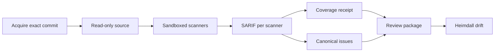

# 코드 보안 스캔

이 문서는 FDAI가 소스 코드를 직접 스캔하는 방법을 정의합니다. 정확한 리비전을 확보하고,
격리된 샌드박스에서 결정론적 스캐너를 실행하며, 커버리지를 정직하게 기록하는 방법을 다룹니다.
결과는 [코드 보안 점검 결과](code-security-findings-ko.md)에서 설명하는 정본 이슈 모델, 심각도,
우선순위, 조치 팩으로 이어집니다.

> **범위:** 스캔은 코드를 읽고 근거를 만들 뿐입니다. 저장소를 수정하지 않고, 코드를 확보한 뒤에는
> 네트워크에 접속하지 않습니다. 저장소 코드는 선택 사항인 [입증 레인](#입증-레인선택)에서만,
> 모든 싱크를 기록용 후크로 바꾼 일회용 샌드박스 안에서 실행합니다. 스캐너 결과는 검토 흐름과
> 사람이 처리 방법을 정하기 전까지 아무 효력이 없습니다.

> **상태:** 결정론 레인(코드 확보, 샌드박스, 스캐너 카탈로그, FDAI 규칙 팩, 스캔 작업, CLI),
> 오프패스 LLM 렌즈 레인, 승격 게이트를 갖춘 Python·오염 약점 검증기, 선택 사항인 Python 입증
> 레인이 구현되었습니다.
> [구현 원장](../../roadmap-implementation/operations/code-security-scanning.md)을 참조하세요.

## 설계 개요

스캔 작업은 저장소 리비전 하나를 SARIF(Static Analysis Results Interchange Format) 보고서,
커버리지 증적, 정본 이슈, Heimdall용 검토 패키지로 바꿉니다:

예: 운영자가 `payments-api`의 커밋 `a1b2...`에 대해 Opengrep과 gitleaks를 연결한 상태로 `scan`을
실행합니다. FDAI는 정확히 그 커밋을 가져와 읽기 전용으로 추출하고, 두 스캐너를 네트워크 없이
실행합니다. 그리고 `opengrep.sarif`, `gitleaks.sarif`, `receipt.json`을 기록합니다.
`osv-scanner`가 설치되어 있지 않으므로 커버리지는 불완전으로 표시되고, Heimdall은 깨끗한
결과 대신 `coverage_incomplete` 검토를 게시합니다.

## 소스 확보

- **정확한 커밋:** 작업은 전체 ID로 커밋 하나를 비공개 bare 저장소로 가져오고, 가져온 커밋이
  요청한 ID와 같은지 확인합니다.
- **실행 시 저장소 코드 없음:** 커밋의 트리를 `.git` 없이 내용 주소 기반 디렉터리로 추출하고,
  모든 파일에서 쓰기 권한을 제거합니다.
- **자격 증명:** HTTP 인증 헤더는 환경 구성으로만 git에 전달됩니다. argv, 로그, 추출된 트리에는
  나타나지 않습니다.
- **한도:** 아카이브 크기와 git 제한 시간에 상한이 있으며, 실패하면 스캔 전에 작업을 멈춥니다.

## 스캐너 샌드박스

각 스캐너는 다음 조건의 bubblewrap 프로세스 하나로 실행됩니다:

| 통제 | 설정 |
|------|------|
| 네임스페이스 | 새 사용자, PID, IPC, UTS, 네트워크 네임스페이스(`--unshare-all`)를 사용하므로 네트워크가 없습니다 |
| 소스 | 확보한 트리를 `/source`에 읽기 전용으로 연결 |
| 선택 마운트 | FDAI 규칙 팩을 `/rules`에, 오프라인 취약점 데이터베이스를 `/cache`에 읽기 전용으로 연결 |
| 쓰기 가능 경로 | 비공개 tmpfs `/scratch`와 `/tmp`만 |
| 환경 | 모두 지운 뒤 `HOME`, `TMPDIR`, `PATH`만 설정 |
| 한도 | CPU 시간, 주소 공간, 파일 크기 한도와 실제 경과 시간 제한 |
| 출력 | 스캐너별 바이트 한도까지 표준 출력을 읽음 |

완료 여부는 샌드박스가 직접 관찰합니다. 스캐너가 제한 시간과 출력 한도 안에서 지정된 성공 코드로
종료한 경우에만 실행이 완료된 것으로 봅니다. 이 관찰 결과는 스캐너가 SARIF에서 주장하는 내용보다
우선하며, 실패한 실행은 해당 생산자를 불완전으로 표시합니다.

## 스캐너 카탈로그

[스캐너 카탈로그](../../../rule-catalog/code-security/scanners.yaml)는 각 결정론적 스캐너의 argv
템플릿, 마운트, 성공 코드, 제한 시간, 출력 한도를 선언합니다. 허용되는 자리 표시자는
`{source}`, `{rules}`, `{cache}`뿐이며, 그 밖의 값이 있으면 불러오기가 실패합니다.

| 스캐너 | 용도 | 필요 항목 |
|--------|------|-----------|
| `opengrep` | FDAI가 작성한 오염 추적 및 패턴 규칙 | 규칙 팩 |
| `gitleaks` | 하드코딩된 비밀 정보(출력에서 가림) | 없음 |
| `osv-scanner` | lockfile 기반 취약한 의존성 | 오프라인 OSV 데이터베이스 |
| `trivy-config` | 인프라와 컨테이너 구성 오류 | 없음 |
| `trivy-vuln` | 취약한 패키지 | 오프라인 Trivy 데이터베이스 |

FDAI는 이 도구들을 재배포하지 않습니다. 배포 환경이 각 스캐너 ID를 설치된 실행 파일에 연결합니다.
연결되지 않은 필수 스캐너, 오프라인 데이터베이스가 없는 스캐너, 실패한 실행, 잘못된 SARIF는 각각
커버리지 한계가 됩니다.

## FDAI 규칙 팩

[규칙 팩](../../../rule-catalog/code-security/rules/)에는 Python, JavaScript와 TypeScript, Java,
Go용으로 FDAI가 작성한 규칙 22개가 있습니다. 각 규칙은 다음 조건을 따릅니다:

- 약점 유형에 대응하는 CWE를 정확히 하나 지니므로 결과가 `unclassified`로 분류되지 않습니다.
- 신뢰할 수 없는 데이터나 안전하지 않은 옵션이 보일 때만 싱크를 지적해 정밀도를 우선합니다.
- 엔진의 테스트 모드가 확인하는 양성(`ruleid:`) 및 음성(`ok:`) 테스트 데이터가 있습니다.

외부 규칙 텍스트를 복사하지 않으므로 규칙 팩에는 외부 규칙 라이선스가 적용되지 않습니다. 테스트
데이터는 의도적으로 취약하게 작성되었으며 import하거나 실행하지 않습니다. Python 테스트 데이터는
저장소 전체 제외 대신 파일 단위 지시문으로 저장소 lint에서 제외됩니다.

## 커버리지 증적

작업은 SARIF 실행 메타데이터와 자체 관찰로 증적을 만듭니다:

- **완료:** 스캐너의 보고가 아니라 샌드박스가 관찰합니다.
- **저장소 전체:** 완료된 모든 스캐너에 대해 명시합니다. 각 스캐너가 추출된 트리 전체를 스캔하기
  때문입니다.
- **규칙 버전:** 스캐너 ID, SARIF의 도구 버전, 그리고 규칙 기반 스캐너라면 규칙 팩의 다이제스트를
  묶습니다. 따라서 규칙이 바뀌면, 새 버전이 이전 버전을 대체한다고 선언하지 않는 한 이후의
  재스캔은 동등하지 않은 것으로 판정됩니다.
- **생산자:** 도구가 스스로 보고하는 이름이 아니라 FDAI가 실행한 스캐너의 카탈로그 생산자입니다.
  에디션과 모드에 따라 `Opengrep OSS`나 두 스캐너에 공통인 `Trivy` 같은 이름이 보고되며, 그대로
  쓰면 규칙 버전과 관측된 완료 여부가 실행과 연결되지 않습니다.

모든 필수 스캐너가 연결되어 완료되고 올바른 SARIF를 만든 경우가 아니면 검토는
`coverage_incomplete`가 됩니다.

## 스캔 실행 이미지

`services/core-control-plane/docker/code-security-scanner.Dockerfile`은 스캔 작업과 Opengrep,
gitleaks, OSV-Scanner, Trivy를 하나로 묶습니다. 각 바이너리는 버전과 SHA-256으로, 기본 이미지는
다이제스트로 고정됩니다. 진입점은 두 단계로 동작합니다.

1. `fdai-scan-runner prepare SOURCE_DIR`는 Trivy와 OSV 오프라인 데이터베이스를 캐시에 갱신합니다.
   네트워크를 쓰는 유일한 단계입니다.
2. `fdai-scan-runner scan ...`은 카탈로그의 모든 스캐너와 캐시를 연결한 뒤 스캔 작업을 실행합니다.
   모든 스캐너는 네트워크 없는 bubblewrap 샌드박스 안에서 실행됩니다.

bubblewrap에는 비특권 사용자 네임스페이스가 필요하므로 컨테이너 런타임이 이를 허용해야 합니다.
Docker에서는 `--security-opt seccomp=unconfined --security-opt apparmor=unconfined`가 필요합니다.

예: 2026-10-07 이 이미지로 고정된 커밋의 OWASP NodeGoat를 스캔했습니다. 다섯 스캐너가 모두
샌드박스에서 완료되어 커버리지가 완전했습니다. 스캐너 원시 결과 423개는 정본 이슈 202개가 되었고,
그중 78개는 둘 이상의 스캐너가 교차 확인했으며 3개는 JavaScript 코드 주입 검증기가 `verified`로
확인했습니다. 이 실행에서 호스트 테스트로는 재현되지 않던 결함 세 가지도 찾아 고쳤습니다.

- Opengrep은 Semgrep의 `--metrics` 옵션을 거부합니다.
- gitleaks는 샌드박스의 사용자 네임스페이스 안에서 `/dev/stdout`으로 보고서를 쓰지 못합니다.
- 도구가 스스로 보고하는 이름(`Opengrep OSS`, 두 모드에 공통인 `Trivy`)이 카탈로그 생산자와 달라
  증적에서 규칙 팩 다이제스트가 빠졌습니다.

## LLM 렌즈 레인

렌즈 레인은 권한 확인 누락처럼 규칙이 놓치는 약점 유형을 찾습니다. 선택 사항이며, 스캔 작업
안에서 에이전트 핫패스 밖으로 실행되고, 아무 효력 없는 가설만 만듭니다:

1. **결정론적 선택:** 읽기 전용 소스를 정렬된 순서로 탐색하고, 외부 의존성, 크기 초과, 바이너리,
   UTF-8이 아닌 파일은 건너뜁니다. 그리고 [렌즈 카탈로그](../../../rule-catalog/code-security/lenses.yaml)의
   싱크 힌트와 일치하는 줄 주변에서 범위가 제한된 발췌를 고릅니다.
2. **여러 모델 계열에 질의:** 각 발췌를 줄 번호가 붙은 신뢰할 수 없는 JSON 데이터로 설정된 모든
   모델에 보냅니다. 엄격한 JSON 스키마 응답을 사용하고, 도구는 사용하지 않으며, 요청 바이트 상한을
   적용합니다.
3. **코드로 검증:** 인용한 줄이 발췌 안에 있고, 싱크 힌트와 일치하며, 렌즈의 CWE 중 하나를 사용할
   때만 후보를 남깁니다.
4. **정족수 요구:** 서로 다른 모델 계열 둘 이상이 줄 허용 범위 안에서 근거가 확인된 후보를 보고할
   때만 개별 보고를 만듭니다.

남은 후보는 `llm_lens` 레인으로 정본화에 들어갑니다. 신뢰도는 `hypothesis`이므로 단독으로는 경고
우선순위에 도달할 수 없습니다. 결정론적 생산자나 외부 생산자가 같은 근본 원인을 보고할 때만
교차 확인되며, [약점 검증기](#약점-검증기)가 흐름을 확인할 때만 `verified`가 됩니다. 모델 계열이
둘 미만이면 레인을 실행하지 않습니다. 예산 소진, 모델 실패, 건너뛴
파일은 `receipt.json`의 렌즈 메모로 기록됩니다. 레인이 선택 사항이므로 이 메모는 결정론적
커버리지를 바꾸지 않습니다. 모든 결과가 코드에서 근거 확인과 정족수를 통과해야 하므로, 모델에게
지시하려는 코드 텍스트가 결과를 추가할 수는 없습니다.

배포 환경은 연결된 Managed Identity로 모델을 호출합니다. 로컬 개발에서는 `--lens-identity azure-cli`가
대신 운영자의 기존 `az` 로그인을 사용합니다. 증적에는 렌즈 보고서 전체(호출, 오류, 근거 없음·렌즈 범위
밖·정족수 미달로 거부된 후보)와 남은 모든 가설의 위치가 기록됩니다.

실제 검증(2026-10-07): FDAI 개발 계정의 `gpt-4.1-mini`와 `gpt-4o`가 결함 다섯 개와 안전한 대응 코드 세
개를 심어 둔 합성 Flask 모듈을 검토했습니다. 오류 없는 18회 호출에서 근거 없는 주장 6개를 거부하고 근거가
확인된 가설 7개를 남겼습니다. 남은 가설은 심어 둔 결함 다섯 개를 모두 포함했고 안전한 대응 코드는 하나도
포함하지 않았습니다. 공개 검색 경로의 인증 누락이라는 추가 가설 하나는 오탐이며, 아무 효력 없는
`hypothesis`로 남습니다.

예: 두 모델 계열이 모두 `missing-authorization` 렌즈에서 CWE-639로 8번째 줄
`Order.query.get(order_id)`를 인용합니다. FDAI는 `hypothesis` 개별 보고 하나를 남깁니다. 사람이나
다른 생산자가 확인하기 전까지 이슈의 우선순위는 P3입니다.

## 약점 검증기

약점 검증기는 결정론적 검증 단계입니다. 스캔 작업 안에서 정본화가 끝난 뒤 같은 읽기 전용 트리를
대상으로 실행되며, 확인된 이슈의 신뢰도를 `verified`로 올립니다.
[검증기 카탈로그](../../../rule-catalog/code-security/verifiers.yaml)는 약점 클래스마다 확인할
싱크와 인정할 정화 함수, 검증 가드를 나열합니다. Python은 명령 주입, 코드 주입, 안전하지 않은
역직렬화, SQL 주입, 경로 조작을 다룹니다.

검증기는 지원되는 이슈마다 수정 위치 파일을 가져오거나 실행하지 않고 구문 분석합니다. import와
별칭을 따라가며 수정 위치 줄에서 카탈로그 싱크 호출을 찾고, 감싸는 함수 안에서 흐름을 구분하는
함수 내부 오염 분석을 실행합니다. 다음 조건을 모두 만족할 때만 이슈가 `verified`가 됩니다.

1. **공격자 입력원:** 싱크의 위험한 인자가 진입점 데코레이터가 붙은 함수의 매개변수나 요청
   속성에서 옵니다. 타입이 지정된 경로 변환기, 숫자나 UUID로 주석된 매개변수는 입력원이 아닙니다.
   `verified`는 네트워크에서 도달할 수 있는 흐름을 뜻하므로 명령줄 인자 같은 로컬 입력도 입력원이
   아닙니다.
2. **정화 없음:** `shlex.quote`나 `os.path.basename` 같은 카탈로그 정화 함수가 흐름을 끊지
   않습니다. 값에 대한 허용 목록이나 검증 가드가 있으면 두 분기 모두에서 오염을 제거합니다.
3. **도달 가능:** 싱크가 `return`이나 `raise` 뒤, 또는 항상 거짓인 분기 안에 있지 않습니다.
4. **정확한 리비전:** 이슈와 확보한 트리의 커밋이 같습니다.

그 밖의 결과는 신뢰도를 바꾸지 않으며, `no_sink_at_fix_site`, `argument_not_attacker_controlled`,
`unreachable`, `unsupported_language` 같은 사유와 함께 `receipt.json`에 기록됩니다. 검증기는
신뢰도를 낮추거나, 심각도를 바꾸거나, 이슈를 닫지 않습니다. 분석은 확인하지 않는 쪽으로
보수적이므로, 확인되지 않은 이슈가 안전하다는 근거는 아닙니다. 운영자 CLI의
`export --verify-repository`는 MDASH 결과 같은 외부 SARIF에도 같은 검증기를 확보한 정확한
리비전에 대해 실행합니다.

예: Opengrep이 함수 안의 `os.system(request.args['cmd'])`에서 CWE-78을 보고합니다. 검증기는 싱크를
찾고, 인자를 `request.args`까지 추적하며, 정화 함수가 없음을 확인한 뒤 이슈를 `verified`로
표시합니다. 함수가 먼저 `cmd not in ALLOWED`를 검사하고 중단한다면 이슈는 `reported`로 남습니다.

### 다른 언어와 승격 게이트

JavaScript와 TypeScript, Java, C#에서는 `rules/verify/` 아래의 FDAI 작성 Opengrep 오염 모드 규칙이
같은 역할을 합니다. 각 규칙은 요청 입력원(Express의 `req`, 서블릿과 Spring 요청 매개변수, ASP.NET
요청 컬렉션과 바인딩된 액션 매개변수), 정화 함수, 각 싱크의 위험한 인자를 선언합니다. 규칙은 스캔
작업에서 규칙 팩과 함께 실행됩니다. 검증기 규칙에서 나온 결정론 레인의 Opengrep 또는 Semgrep 개별
보고가 같은 정본 이슈에 속할 때만 이슈가 확인되므로, 외부 SARIF가 규칙 이름을 흉내 내어 검증을
주장할 수 없습니다.

검증기는 측정된 근거로 승격된 뒤에만 `verified`를 부여합니다.
[검증기 평가 자료](../../../rule-catalog/code-security/evaluation/verifier-corpus.yaml)는 의도적으로
취약하게 만든 공개 프로젝트(NodeGoat, Juice Shop, WebGoat, dvcsharp-api, pygoat)를 정확한 커밋으로
고정합니다. 레이블은 Juice Shop의 소스 주석과 코딩 과제 판정을 포함해 각 프로젝트 자체 문서에서
가져옵니다. 운영자 CLI의 `evaluate-verifiers`는 각 프로젝트를 해당 커밋으로 가져오고, 프로젝트 코드를
실행하지 않은 채 두 종류의 검증기를 돌린 뒤, 검증기별 정밀도와 재현율을 담은 증적을 기록합니다.
정밀도가 평가 자료의 하한인 0.90 이상이고 참 양성이 하나 이상이면 검증기가 승격되며, 검증기
카탈로그의 승격 목록은 이 증적과 일치해야 합니다. 나머지 검증기는 shadow로 실행되어 결과를
`verifier_in_shadow`로 기록할 뿐 신뢰도를 올리지 않습니다.

예: 2026-10-07 증적은 다섯 클래스 모두의 Python 검증기와 JavaScript 코드 주입·SQL 주입, Java SQL
주입·경로 조작, C# SQL 주입 오염 규칙을 정밀도 1.0으로 승격했습니다. JavaScript 경로 조작 규칙은 경로가
서버 측 조회나 존재 확인을 거친 Juice Shop의 안전한 읽기 세 곳과 일치했으므로 shadow에 남습니다.
명령 주입 규칙처럼 실제 코드 근거가 없는 규칙도 shadow에 남습니다. 평가 자료가 규칙 개발에 쓰였고
표본이 작으므로 별도로 보관한 벤치마크는 아닙니다.

## 입증 레인(선택)

입증 레인은 동적 단계입니다. 결과를 추론하는 대신 재현합니다. 기본으로 꺼져 있으며
`scan --prove`로만 실행되고, 승격된 검증기가 이미 `verified`로 표시한 Python 이슈 가운데 명령 주입,
코드 주입, 안전하지 않은 역직렬화, SQL 주입, 경로 조작에만 적용됩니다.

표준 라이브러리만 쓰는 하네스가 스캐너와 같은 bubblewrap 샌드박스 안에서 샌드박스의 시스템
Python으로 실행됩니다. 네트워크와 자격 증명이 없고, 환경이 비워지며, 소스는 읽기 전용이고, CPU,
메모리, 파일 크기, 시간 한도가 적용됩니다. 하네스는 수정 위치 모듈을 가져오면서 사용할 수 없는 서드파티
import는 아무 동작도 하지 않는 대체 객체로 처리하고, 각 싱크를 실제 명령, 평가, 역직렬화, 쿼리, 파일
접근을 수행하지 않고 기록만 하는 후크로 바꿉니다. 그런 다음 모든 요청 필드와 매개변수에 클래스별
페이로드를 넣어 감싸는 함수를 호출합니다. 페이로드가 악용 가능한 형태로 싱크에 도달할 때만 이슈가
`proven`이 됩니다.

| 클래스 | 페이로드 | 입증 조건 |
|--------|----------|-----------|
| 명령 주입 | `x;`와 표식 | 셸 규칙을 따르는 분석기가 명령 구분자 뒤에서 표식을 봅니다 |
| 코드 주입 | 표식 | 평가되는 텍스트를 구문 분석했을 때 표식이 문자열이 아닌 이름입니다 |
| SQL 주입 | `x'`와 표식 | 표식 앞의 따옴표가 이스케이프되지 않고 남습니다 |
| 경로 조작 | `../../`와 표식 | 상위 경로 이동이 파일 작업까지 그대로 도달합니다 |
| 안전하지 않은 역직렬화 | 인코딩된 표식 바이트 | 공격자 바이트가 로더에 도달합니다 |

따라서 따옴표 처리, 이스케이프, 매개변수화된 쿼리, `basename`, 실패한 import가 있으면 이슈는
`verified`에 머뭅니다. 고정된 커밋의 pygoat에서는 검증된 이슈 아홉 개가 모두 입증되었습니다. 테스트는
같은 하네스를 `shlex.quote`, `repr`, 매개변수화된 `sqlite3`, `basename`을 쓰는 안전한 변형에도 실행하며,
모두 입증되지 않아야 통과합니다.

## 실패 시 동작

| 조건 | 결과 |
|------|------|
| 커밋을 가져올 수 없거나 요청과 다름 | 작업이 멈추고 아무것도 스캔하지 않습니다 |
| 스캐너 미설치 또는 오프라인 데이터베이스 없음 | 커버리지 한계가 되며 검토는 `coverage_incomplete`입니다 |
| 제한 시간 초과, 출력 한도 초과, 예상하지 못한 종료 코드 | 실행이 불완전하고 잘린 것으로 표시되며 그 SARIF는 무시됩니다 |
| 잘못된 SARIF | 커버리지 한계가 되며 해당 생산자를 불완전으로 표시합니다 |
| 크기 제한이 없거나 적대적인 SARIF 내용 | [SARIF 수집](code-security-findings-ko.md#sarif-수집)이 거부하거나 정리합니다 |
| 렌즈 레인의 모델 계열이 둘 미만 | 렌즈 레인을 실행하지 않고 이유를 렌즈 메모에 기록합니다 |
| 근거가 없거나, 렌즈와 무관하거나, 정족수에 미달한 모델 출력 | 버리고 렌즈 보고서에 집계합니다 |
| 지원하지 않는 언어나 클래스, 크기 초과, 구문 분석 불가, 범위를 벗어나는 파일 | 검증기 결과가 `unsupported`이며 신뢰도는 그대로입니다 |
| 싱크 없음, 정화됨, 검증됨, 도달 불가 | 검증기 결과가 사유와 함께 `not_verified`이며 신뢰도는 그대로입니다 |
| 승격되지 않은 검증기의 일치 | 결과가 `verifier_in_shadow` 사유와 함께 `not_verified`이며 신뢰도는 그대로입니다 |
| 입증 중 import 실패, 시간 초과, 싱크에서 악용 가능한 페이로드 없음 | 결과가 사유와 함께 `not_proven`이며 신뢰도는 `verified`로 유지됩니다 |

## 검증

집중 테스트는 카탈로그 검증, 규칙 팩 분류와 테스트 데이터 커버리지, 샌드박스 명령 격리, 실제
bubblewrap 실행(소스 쓰기 불가, 네트워크 인터페이스 없음, 잘림, 제한 시간, 실패 코드), 정확한
커밋 확보, 스캔 작업의 종단 간 흐름을 다룹니다. 규칙 팩은 Semgrep 호환 엔진의 테스트 모드로
검증했으며 규칙 22개가 모두 통과했습니다. 렌즈 테스트는 결정론적 선택, 근거 확인, CWE 필터링,
모델 계열 간 정족수, 예산과 실패 보고, 그리고 실제 모델 호출 없이 모의 전송으로 확인한 어댑터의
도구 없는 엄격 스키마 요청을 다룹니다. 검증기 테스트는 지원하는 모든 클래스에서 공격자가 제어하는
흐름을 확인하고, 매개변수화된 쿼리, 정화 함수, 허용 목록 가드, 타입이 지정된 매개변수, 안전한
로더, 재할당, 도달할 수 없는 싱크, 로컬 입력, 심볼릭 링크 탈출, 리비전 불일치는 거부합니다. 실제 `trivy` 바이너리를 샌드박스 안에서 실행했고, 그
SARIF는 수집 과정을 거쳤습니다.

## 관련 문서

| 알아볼 내용 | 문서 |
|-------------|------|
| 제공 상태와 남은 작업 | [구현 원장](../../roadmap-implementation/operations/code-security-scanning.md) |
| 이슈, 심각도, 우선순위, 조치 팩 | [코드 보안 점검 결과](code-security-findings-ko.md) |
| LLM 계층과 데이터 상주 | [LLM 전략](../architecture/llm-strategy-ko.md) |
| 추적 이슈 | [Issue #1966](https://github.com/dotnetpower/fdai/issues/1966) |
