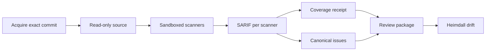

# 코드 보안 스캔

이 문서는 FDAI가 소스 코드를 직접 스캔하는 방법을 정의합니다. 정확한 리비전을 확보하고,
격리된 샌드박스에서 결정론적 스캐너를 실행하며, 커버리지를 정직하게 기록하는 방법을 다룹니다.
결과는 [코드 보안 점검 결과](code-security-findings-ko.md)에서 설명하는 정본 이슈 모델, 심각도,
우선순위, 조치 팩으로 이어집니다.

> **범위:** 스캔은 코드를 읽고 근거를 만들 뿐입니다. 저장소를 수정하지 않고, 저장소의 코드를
> 실행하지 않으며, 코드를 확보한 뒤에는 네트워크에 접속하지 않습니다. 스캐너 결과는 검토 흐름과
> 사람이 처리 방법을 정하기 전까지 아무 효력이 없습니다.

> **상태:** 결정론 레인(코드 확보, 샌드박스, 스캐너 카탈로그, FDAI 규칙 팩, 스캔 작업, CLI)과
> 오프패스 LLM 렌즈 레인이 구현되었습니다.
> [구현 원장](../../roadmap-implementation/operations/code-security-scanning.md)을 참조하세요.

## 설계 개요

스캔 작업은 저장소 리비전 하나를 SARIF(Static Analysis Results Interchange Format) 보고서,
커버리지 증적, 정본 이슈, Heimdall용 검토 패키지로 바꿉니다:

예: 운영자가 `payments-api`의 커밋 `a1b2...`에 대해 Opengrep과 gitleaks를 연결한 상태로 `scan`을
실행합니다. FDAI는 정확히 그 커밋을 가져와 읽기 전용으로 추출하고, 두 스캐너를 네트워크 없이
실행합니다. 그리고 `opengrep.sarif`, `gitleaks.sarif`, `receipt.json`을 기록합니다.
`osv-scanner`가 설치되어 있지 않으므로 커버리지는 불완전으로 표시되고, Heimdall은 깨끗한
결과 대신 `coverage_incomplete` 검토를 게시합니다.

## 소스 확보

- **정확한 커밋:** 작업은 전체 ID로 커밋 하나를 비공개 bare 저장소로 가져오고, 가져온 커밋이
  요청한 ID와 같은지 확인합니다.
- **실행 시 저장소 코드 없음:** 커밋의 트리를 `.git` 없이 내용 주소 기반 디렉터리로 추출하고,
  모든 파일에서 쓰기 권한을 제거합니다.
- **자격 증명:** HTTP 인증 헤더는 환경 구성으로만 git에 전달됩니다. argv, 로그, 추출된 트리에는
  나타나지 않습니다.
- **한도:** 아카이브 크기와 git 제한 시간에 상한이 있으며, 실패하면 스캔 전에 작업을 멈춥니다.

## 스캐너 샌드박스

각 스캐너는 다음 조건의 bubblewrap 프로세스 하나로 실행됩니다:

| 통제 | 설정 |
|------|------|
| 네임스페이스 | 새 사용자, PID, IPC, UTS, 네트워크 네임스페이스(`--unshare-all`)를 사용하므로 네트워크가 없습니다 |
| 소스 | 확보한 트리를 `/source`에 읽기 전용으로 연결 |
| 선택 마운트 | FDAI 규칙 팩을 `/rules`에, 오프라인 취약점 데이터베이스를 `/cache`에 읽기 전용으로 연결 |
| 쓰기 가능 경로 | 비공개 tmpfs `/scratch`와 `/tmp`만 |
| 환경 | 모두 지운 뒤 `HOME`, `TMPDIR`, `PATH`만 설정 |
| 한도 | CPU 시간, 주소 공간, 파일 크기 한도와 실제 경과 시간 제한 |
| 출력 | 스캐너별 바이트 한도까지 표준 출력을 읽음 |

완료 여부는 샌드박스가 직접 관찰합니다. 스캐너가 제한 시간과 출력 한도 안에서 지정된 성공 코드로
종료한 경우에만 실행이 완료된 것으로 봅니다. 이 관찰 결과는 스캐너가 SARIF에서 주장하는 내용보다
우선하며, 실패한 실행은 해당 생산자를 불완전으로 표시합니다.

## 스캐너 카탈로그

[스캐너 카탈로그](../../../rule-catalog/code-security/scanners.yaml)는 각 결정론적 스캐너의 argv
템플릿, 마운트, 성공 코드, 제한 시간, 출력 한도를 선언합니다. 허용되는 자리 표시자는
`{source}`, `{rules}`, `{cache}`뿐이며, 그 밖의 값이 있으면 불러오기가 실패합니다.

| 스캐너 | 용도 | 필요 항목 |
|--------|------|-----------|
| `opengrep` | FDAI가 작성한 오염 추적 및 패턴 규칙 | 규칙 팩 |
| `gitleaks` | 하드코딩된 비밀 정보(출력에서 가림) | 없음 |
| `osv-scanner` | lockfile 기반 취약한 의존성 | 오프라인 OSV 데이터베이스 |
| `trivy-config` | 인프라와 컨테이너 구성 오류 | 없음 |
| `trivy-vuln` | 취약한 패키지 | 오프라인 Trivy 데이터베이스 |

FDAI는 이 도구들을 재배포하지 않습니다. 배포 환경이 각 스캐너 ID를 설치된 실행 파일에 연결합니다.
연결되지 않은 필수 스캐너, 오프라인 데이터베이스가 없는 스캐너, 실패한 실행, 잘못된 SARIF는 각각
커버리지 한계가 됩니다.

## FDAI 규칙 팩

[규칙 팩](../../../rule-catalog/code-security/rules/)에는 Python, JavaScript와 TypeScript, Java,
Go용으로 FDAI가 작성한 규칙 22개가 있습니다. 각 규칙은 다음 조건을 따릅니다:

- 약점 유형에 대응하는 CWE를 정확히 하나 지니므로 결과가 `unclassified`로 분류되지 않습니다.
- 신뢰할 수 없는 데이터나 안전하지 않은 옵션이 보일 때만 싱크를 지적해 정밀도를 우선합니다.
- 엔진의 테스트 모드가 확인하는 양성(`ruleid:`) 및 음성(`ok:`) 테스트 데이터가 있습니다.

외부 규칙 텍스트를 복사하지 않으므로 규칙 팩에는 외부 규칙 라이선스가 적용되지 않습니다. 테스트
데이터는 의도적으로 취약하게 작성되었으며 import하거나 실행하지 않습니다. Python 테스트 데이터는
저장소 전체 제외 대신 파일 단위 지시문으로 저장소 lint에서 제외됩니다.

## 커버리지 증적

작업은 SARIF 실행 메타데이터와 자체 관찰로 증적을 만듭니다:

- **완료:** 스캐너의 보고가 아니라 샌드박스가 관찰합니다.
- **저장소 전체:** 완료된 모든 스캐너에 대해 명시합니다. 각 스캐너가 추출된 트리 전체를 스캔하기
  때문입니다.
- **규칙 버전:** 스캐너 ID, SARIF의 도구 버전, 그리고 규칙 기반 스캐너라면 규칙 팩의 다이제스트를
  묶습니다. 따라서 규칙이 바뀌면, 새 버전이 이전 버전을 대체한다고 선언하지 않는 한 이후의
  재스캔은 동등하지 않은 것으로 판정됩니다.

모든 필수 스캐너가 연결되어 완료되고 올바른 SARIF를 만든 경우가 아니면 검토는
`coverage_incomplete`가 됩니다.

## LLM 렌즈 레인

렌즈 레인은 권한 확인 누락처럼 규칙이 놓치는 약점 유형을 찾습니다. 선택 사항이며, 스캔 작업
안에서 에이전트 핫패스 밖으로 실행되고, 아무 효력 없는 가설만 만듭니다:

1. **결정론적 선택:** 읽기 전용 소스를 정렬된 순서로 탐색하고, 외부 의존성, 크기 초과, 바이너리,
   UTF-8이 아닌 파일은 건너뜁니다. 그리고 [렌즈 카탈로그](../../../rule-catalog/code-security/lenses.yaml)의
   싱크 힌트와 일치하는 줄 주변에서 범위가 제한된 발췌를 고릅니다.
2. **여러 모델 계열에 질의:** 각 발췌를 줄 번호가 붙은 신뢰할 수 없는 JSON 데이터로 설정된 모든
   모델에 보냅니다. 엄격한 JSON 스키마 응답을 사용하고, 도구는 사용하지 않으며, 요청 바이트 상한을
   적용합니다.
3. **코드로 검증:** 인용한 줄이 발췌 안에 있고, 싱크 힌트와 일치하며, 렌즈의 CWE 중 하나를 사용할
   때만 후보를 남깁니다.
4. **정족수 요구:** 서로 다른 모델 계열 둘 이상이 줄 허용 범위 안에서 근거가 확인된 후보를 보고할
   때만 개별 보고를 만듭니다.

남은 후보는 `llm_lens` 레인으로 정본화에 들어갑니다. 신뢰도는 `hypothesis`이므로 단독으로는 경고
우선순위에 도달할 수 없으며, 결정론적 생산자나 외부 생산자가 같은 근본 원인을 보고할 때만
교차 확인됩니다. 모델 계열이 둘 미만이면 레인을 실행하지 않습니다. 예산 소진, 모델 실패, 건너뛴
파일은 `receipt.json`의 렌즈 메모로 기록됩니다. 레인이 선택 사항이므로 이 메모는 결정론적
커버리지를 바꾸지 않습니다. 모든 결과가 코드에서 근거 확인과 정족수를 통과해야 하므로, 모델에게
지시하려는 코드 텍스트가 결과를 추가할 수는 없습니다.

예: 두 모델 계열이 모두 `missing-authorization` 렌즈에서 CWE-639로 8번째 줄
`Order.query.get(order_id)`를 인용합니다. FDAI는 `hypothesis` 개별 보고 하나를 남깁니다. 사람이나
다른 생산자가 확인하기 전까지 이슈의 우선순위는 P3입니다.

## 실패 시 동작

| 조건 | 결과 |
|------|------|
| 커밋을 가져올 수 없거나 요청과 다름 | 작업이 멈추고 아무것도 스캔하지 않습니다 |
| 스캐너 미설치 또는 오프라인 데이터베이스 없음 | 커버리지 한계가 되며 검토는 `coverage_incomplete`입니다 |
| 제한 시간 초과, 출력 한도 초과, 예상하지 못한 종료 코드 | 실행이 불완전하고 잘린 것으로 표시되며 그 SARIF는 무시됩니다 |
| 잘못된 SARIF | 커버리지 한계가 되며 해당 생산자를 불완전으로 표시합니다 |
| 크기 제한이 없거나 적대적인 SARIF 내용 | [SARIF 수집](code-security-findings-ko.md#sarif-수집)이 거부하거나 정리합니다 |
| 렌즈 레인의 모델 계열이 둘 미만 | 렌즈 레인을 실행하지 않고 이유를 렌즈 메모에 기록합니다 |
| 근거가 없거나, 렌즈와 무관하거나, 정족수에 미달한 모델 출력 | 버리고 렌즈 보고서에 집계합니다 |

## 검증

집중 테스트는 카탈로그 검증, 규칙 팩 분류와 테스트 데이터 커버리지, 샌드박스 명령 격리, 실제
bubblewrap 실행(소스 쓰기 불가, 네트워크 인터페이스 없음, 잘림, 제한 시간, 실패 코드), 정확한
커밋 확보, 스캔 작업의 종단 간 흐름을 다룹니다. 규칙 팩은 Semgrep 호환 엔진의 테스트 모드로
검증했으며 규칙 22개가 모두 통과했습니다. 렌즈 테스트는 결정론적 선택, 근거 확인, CWE 필터링,
모델 계열 간 정족수, 예산과 실패 보고, 그리고 실제 모델 호출 없이 모의 전송으로 확인한 어댑터의
도구 없는 엄격 스키마 요청을 다룹니다. 실제 `trivy` 바이너리를 샌드박스 안에서 실행했고, 그
SARIF는 수집 과정을 거쳤습니다.

## 관련 문서

| 알아볼 내용 | 문서 |
|-------------|------|
| 제공 상태와 남은 작업 | [구현 원장](../../roadmap-implementation/operations/code-security-scanning.md) |
| 이슈, 심각도, 우선순위, 조치 팩 | [코드 보안 점검 결과](code-security-findings-ko.md) |
| LLM 계층과 데이터 상주 | [LLM 전략](../architecture/llm-strategy-ko.md) |
| 추적 이슈 | [Issue #1966](https://github.com/dotnetpower/fdai/issues/1966) |
