# 코드 보안 스캔

이 문서는 FDAI가 소스 코드를 직접 스캔하는 방법을 정의합니다. 정확한 리비전을 확보하고,
격리된 샌드박스에서 결정론적 스캐너를 실행하며, 커버리지를 정직하게 기록하는 방법을 다룹니다.
결과는 [코드 보안 점검 결과](code-security-findings-ko.md)에서 설명하는 정본 이슈 모델, 심각도,
우선순위, 조치 팩으로 이어집니다.

> **범위:** 스캔은 코드를 읽고 근거를 만들 뿐입니다. 저장소를 수정하지 않고, 코드를 확보한 뒤에는
> 네트워크에 접속하지 않습니다. 저장소 코드는 선택 사항인 [입증 레인](#입증-레인선택)에서만,
> 모든 싱크를 기록용 후크로 바꾼 일회용 샌드박스 안에서 실행합니다. 스캐너 결과는 검토 흐름과
> 사람이 처리 방법을 정하기 전까지 아무 효력이 없습니다.

> **상태:** 결정론 레인(코드 확보, 샌드박스, 스캐너 카탈로그, FDAI 규칙 팩, 스캔 작업, CLI),
> 오프패스 LLM 렌즈 레인, 승격 게이트를 갖춘 Python·오염 약점 검증기, Python·JavaScript·네이티브·
> Java·C#용 선택 입증 레인, 보고서를 만드는 로컬 폴더 스캔, 등록된 저장소에 대한 Console 스캔
> 요청이 구현되었습니다.
> [구현 원장](../../roadmap-implementation/operations/code-security-scanning.md)을 참조하세요.

## 설계 개요

스캔 작업은 저장소 리비전 하나를 SARIF(Static Analysis Results Interchange Format) 보고서,
커버리지 증적, 정본 이슈, Heimdall용 검토 패키지로 바꿉니다:



예: 운영자가 `payments-api`의 커밋 `a1b2...`에 대해 Opengrep과 gitleaks를 연결한 상태로 `scan`을
실행합니다. FDAI는 정확히 그 커밋을 가져와 읽기 전용으로 추출하고, 두 스캐너를 네트워크 없이
실행합니다. 그리고 `opengrep.sarif`, `gitleaks.sarif`, `receipt.json`을 기록합니다.
`osv-scanner`가 설치되어 있지 않으므로 커버리지는 불완전으로 표시되고, Heimdall은 깨끗한
결과 대신 `coverage_incomplete` 검토를 게시합니다.

## 소스 확보

- **정확한 커밋:** 작업은 전체 ID로 커밋 하나를 비공개 bare 저장소로 가져오고, 가져온 커밋이
  요청한 ID와 같은지 확인합니다.
- **실행 시 저장소 코드 없음:** 커밋의 트리를 `.git` 없이 내용 주소 기반 디렉터리로 추출하고,
  모든 파일에서 쓰기 권한을 제거합니다.
- **자격 증명:** HTTP 인증 헤더는 환경 구성으로만 git에 전달됩니다. argv, 로그, 추출된 트리에는
  나타나지 않습니다.
- **한도:** 아카이브 크기와 git 제한 시간에 상한이 있으며, 실패하면 스캔 전에 작업을 멈춥니다.

## 스캐너 샌드박스

### 준비된 소스 전달

확보 단계와 스캔 단계의 경계에서는 `prepare-scan` 다음에
`scan --prepared-source DIR --prepared-digest SHA256`을 실행합니다. 확보 단계가 내보내는 것은
추출한 트리와 버전이 지정된 매니페스트뿐입니다. 매니페스트에는 별칭, 정확한 리비전, 트리 ID,
소스 출처와 상대 파일 이름·실행 권한 비트·내용의 다이제스트가 들어갑니다. 반환된 매니페스트
다이제스트는 스캐너가 쓸 수 있는 볼륨 밖에 보관하세요. 스캐너는 매니페스트를 이 값과 비교하고
스캔 전후에 트리를 검사합니다. 변경된 트리, 심볼릭 링크, 특수 파일, `.git` 디렉터리, 크기 제한
초과 입력은 준비된 스캔을 명시적으로 중단합니다. 조용히 제외하는 항목은 없습니다.

준비된 트리는 읽기 전용이고 확보 단계의 자격 증명을 포함하지 않습니다. 자격 증명이 없는 별도
스캐너 프로세스에서는 다른 경로에 연결할 수도 있습니다. 준비된 모드에서는 소스를 가져오거나
실시간 렌즈를 켜거나 버스에 게시하거나 상태 저장소에 쓰지 않습니다. 로컬 보고서, SARIF, 증적만
씁니다. 기존 로컬 스캔과 통합 작업자 스캔은 현재 동작을 유지합니다.

이 전달 방식은 제안된 배포 런타임의 첫 번째 경계를 구현할 뿐, 전체 오케스트레이션을 구현하지는
않습니다. 체크섬은 입력 바이트를 연결하지만 스캐너 완료를 증명하거나 신뢰할 수 없는 결과를 권위
있는 것으로 만들지는 않습니다. 독립적인 완료 근거, 결과 기록 경계, 최소 권한 상태 접근, Kata
작업 오케스트레이션은 배포의 선행 조건으로 남아 있습니다.

### 결정론적 결과 수락

준비된 결정론적 스캔은 스캐너가 쓸 수 있는 산출물과 별도로, 변경할 수 없는 프로세스 관측값을
조정기 메모리에 보관합니다. 후보를 반환하기 전에 수락 어댑터는 조정기의 소스 ID와 카탈로그
연결을 사용해, 확보한 표준 출력 바이트를 기존 SARIF 수집, 정규화, 검증기, 커버리지, 검토
파이프라인으로 다시 처리합니다. ID 불일치, 알 수 없거나 중복된 스캐너, 관측값 누락, 완료 여부의
모순, 발견 사항이나 커버리지의 차이는 거부합니다. 후보의 검토 파일이나 증적 파일은 수락 근거로
읽지 않습니다.

기록 어댑터는 재구성 검증에 성공한 결과만 씁니다. 모델이나 동적 입증에 의한 신뢰도 상승은 이
결정론적 어댑터로 수락하지 않으며, 로컬 입증 스캔은 계속 사용할 수 있습니다. 기존 리비전에
대해서는 검토 충돌 검사를 마친 뒤 이슈 상세를 저장합니다. 기존 상세 행의 검토 다이제스트가 다르면
충돌을 보고합니다. 두 쓰기 사이에 중단되면 상세가 없을 수는 있지만, 충돌하는 검토가 그 상세를
채울 수는 없습니다.

이는 로컬 조정기가 소유하는 관측 계약이며 원격 증명은 아닙니다. 분산 Kata 실행에는 인증된
관측 전달, 스캐너 VM과 분리된 자격 증명, 제한된 상태 접근, 작업자 오케스트레이션이 여전히
필요합니다. 신뢰할 수 없는 증적에서 복사한 관측값을 전달하는 것은 이 계약을 충족하지 않습니다.

### 스캐너 프로세스 통제

각 스캐너는 다음 조건의 bubblewrap 프로세스 하나로 실행됩니다:

| 통제 | 설정 |
|------|------|
| 네임스페이스 | 새 사용자, PID, IPC, UTS, 네트워크 네임스페이스(`--unshare-all`)를 사용하므로 네트워크가 없습니다 |
| 소스 | 확보한 트리를 `/source`에 읽기 전용으로 연결 |
| 선택 마운트 | FDAI 규칙 팩을 `/rules`에, 오프라인 취약점 데이터베이스를 `/cache`에 읽기 전용으로 연결 |
| 쓰기 가능 경로 | 비공개 tmpfs `/scratch`와 `/tmp`만 |
| 환경 | 모두 지운 뒤 `HOME`, `TMPDIR`, `PATH`만 설정 |
| 한도 | CPU 시간, 주소 공간, 파일 크기 한도와 실제 경과 시간 제한 |
| 출력 | 스캐너별 바이트 한도까지 표준 출력을 읽음 |

완료 여부는 샌드박스가 직접 관찰합니다. 스캐너가 제한 시간과 출력 한도 안에서 지정된 성공 코드로
종료한 경우에만 실행이 완료된 것으로 봅니다. 이 관찰 결과는 스캐너가 SARIF에서 주장하는 내용보다
우선하며, 실패한 실행은 해당 생산자를 불완전으로 표시합니다.

## 스캐너 카탈로그

[스캐너 카탈로그](../../../rule-catalog/code-security/scanners.yaml)는 각 결정론적 스캐너의 argv
템플릿, 마운트, 성공 코드, 제한 시간, 출력 한도를 선언합니다. 허용되는 자리 표시자는
`{source}`, `{rules}`, `{cache}`뿐이며, 그 밖의 값이 있으면 불러오기가 실패합니다.

| 스캐너 | 용도 | 필요 항목 |
|--------|------|-----------|
| `opengrep` | FDAI가 작성한 오염 추적 및 패턴 규칙 | 규칙 팩 |
| `gitleaks` | 하드코딩된 비밀 정보(출력에서 가림) | 없음 |
| `osv-scanner` | lockfile 기반 취약한 의존성 | 오프라인 OSV 데이터베이스 |
| `trivy-config` | 인프라와 컨테이너 구성 오류 | 없음 |
| `trivy-vuln` | 취약한 패키지 | 오프라인 Trivy 데이터베이스 |

FDAI는 이 도구들을 재배포하지 않습니다. 배포 환경이 각 스캐너 ID를 설치된 실행 파일에 연결합니다.
연결되지 않은 필수 스캐너, 오프라인 데이터베이스가 없는 스캐너, 실패한 실행, 잘못된 SARIF는 각각
커버리지 한계가 됩니다.

## FDAI 규칙 팩

[규칙 팩](../../../rule-catalog/code-security/rules/)에는 Python, JavaScript와 TypeScript, Java,
Go용으로 FDAI가 작성한 규칙 22개가 있습니다. 각 규칙은 다음 조건을 따릅니다:

- 약점 유형에 대응하는 CWE를 정확히 하나 지니므로 결과가 `unclassified`로 분류되지 않습니다.
- 신뢰할 수 없는 데이터나 안전하지 않은 옵션이 보일 때만 싱크를 지적해 정밀도를 우선합니다.
- 엔진의 테스트 모드가 확인하는 양성(`ruleid:`) 및 음성(`ok:`) 테스트 데이터가 있습니다.

외부 규칙 텍스트를 복사하지 않으므로 규칙 팩에는 외부 규칙 라이선스가 적용되지 않습니다. 테스트
데이터는 의도적으로 취약하게 작성되었으며 import하거나 실행하지 않습니다. Python 테스트 데이터는
저장소 전체 제외 대신 파일 단위 지시문으로 저장소 lint에서 제외됩니다.

## 커버리지 증적

작업은 SARIF 실행 메타데이터와 자체 관찰로 증적을 만듭니다:

- **완료:** 스캐너의 보고가 아니라 샌드박스가 관찰합니다.
- **저장소 전체:** 완료된 모든 스캐너에 대해 명시합니다. 각 스캐너가 추출된 트리 전체를 스캔하기
  때문입니다.
- **규칙 버전:** 스캐너 ID, SARIF의 도구 버전, 그리고 규칙 기반 스캐너라면 규칙 팩의 다이제스트를
  묶습니다. 따라서 규칙이 바뀌면, 새 버전이 이전 버전을 대체한다고 선언하지 않는 한 이후의
  재스캔은 동등하지 않은 것으로 판정됩니다.
- **생산자:** 도구가 스스로 보고하는 이름이 아니라 FDAI가 실행한 스캐너의 카탈로그 생산자입니다.
  에디션과 모드에 따라 `Opengrep OSS`나 두 스캐너에 공통인 `Trivy` 같은 이름이 보고되며, 그대로
  쓰면 규칙 버전과 관측된 완료 여부가 실행과 연결되지 않습니다.

모든 필수 스캐너가 연결되어 완료되고 올바른 SARIF를 만든 경우가 아니면 검토는
`coverage_incomplete`가 됩니다.

## 스캔 실행 이미지

`services/core-control-plane/docker/code-security-scanner.Dockerfile`은 스캔 작업과 Opengrep,
gitleaks, OSV-Scanner, Trivy를 하나로 묶습니다. 각 바이너리는 버전과 SHA-256으로, glibc 기반
Debian 이미지는 다이제스트로 고정됩니다. 이 파일은 두 대상을 빌드합니다.

- **`runtime`(기본):** 모든 스캐너와 Python 입증 레인을 담습니다.
- **`prover`:** 같은 이미지에 Node.js, AddressSanitizer와 UndefinedBehaviorSanitizer를 쓰는 gcc,
  OpenJDK 21, SHA-512로 고정한 .NET SDK를 더합니다. 그러면 `--prove`가 Python, JavaScript,
  네이티브, Java, C# 이슈를 재현할 수 있습니다. sanitizer 런타임이 musl을 지원하지 않으므로 이미지는
  glibc 기반입니다.

진입점은 두 단계로 동작합니다.

1. `fdai-scan-runner prepare SOURCE_DIR`는 Trivy와 OSV 오프라인 데이터베이스를 캐시에 갱신합니다.
   네트워크를 쓰는 유일한 단계입니다. 잠금 파일이 없는 폴더에는 검사할 의존성이 없으므로,
   OSV-Scanner의 "패키지 소스 없음" 종료는 이 단계를 실패시키지 않습니다.
2. `fdai-scan-runner scan ...`은 카탈로그의 모든 스캐너, 캐시, 이미지에 있는 각 입증 도구를 연결한 뒤
   스캔 작업을 실행합니다. 모든 스캐너는 네트워크 없는 bubblewrap 샌드박스 안에서 실행되며, 입증
   도구는 `--prove`가 있을 때만 쓰입니다.

bubblewrap에는 비특권 사용자 네임스페이스가 필요하므로 컨테이너 런타임이 이를 허용해야 합니다.
Docker에서는 `--security-opt seccomp=unconfined --security-opt apparmor=unconfined`가 필요합니다.

예: 2026-10-07 이 이미지로 고정된 커밋의 OWASP NodeGoat를 스캔했습니다. 다섯 스캐너가 모두
샌드박스에서 완료되어 커버리지가 완전했습니다. 스캐너 원시 결과 423개는 정본 이슈 202개가 되었고,
그중 78개는 둘 이상의 스캐너가 교차 확인했으며 3개는 JavaScript 코드 주입 검증기가 `verified`로
확인했습니다. 이 실행에서 호스트 테스트로는 재현되지 않던 결함 세 가지도 찾아 고쳤습니다.

- Opengrep은 Semgrep의 `--metrics` 옵션을 거부합니다.
- gitleaks는 샌드박스의 사용자 네임스페이스 안에서 `/dev/stdout`으로 보고서를 쓰지 못합니다.
- 도구가 스스로 보고하는 이름(`Opengrep OSS`, 두 모드에 공통인 `Trivy`)이 카탈로그 생산자와 달라
  증적에서 규칙 팩 다이제스트가 빠졌습니다.

예: 2026-10-09 입증 레인 테스트를 `prover` 이미지 안의 bubblewrap에서 실행했습니다. Python,
JavaScript, 네이티브, Java, C# 예제가 각각 수정 위치에서 `proven`이 되었고, 안전한 짝은 입증되지
않았습니다. 첫 실행에서 샌드박스가 `/etc/ld.so.cache` 없이 입증 인터프리터를 고정 경로에 연결한다는
점이 드러났으므로, 이미지는 `libpython`을 로더의 기본 경로에 연결합니다.

## CLI 진입점

핵심 control-plane 패키지는 모든 코드 보안 명령을 위한 지원 CLI 표면으로 `fdai-code-security`
실행 파일을 설치합니다. 소스 체크아웃에서는 `uv run --package fdai-core-control-plane
fdai-code-security`로 실행할 수 있고, 스캔 실행 이미지는 같은 진입점을 가상 환경에 설치해
스캔과 작업자에 사용합니다. 모듈 형식(`python -m fdai.delivery.code_security_cli`)은 구현과 테스트
경로로 남아 있으며 사용자 설치 계약은 아닙니다.

## 로컬 폴더 스캔과 보고서

FDAI 배포가 없어도 내 컴퓨터의 폴더를 스캔하고 읽기 쉬운 보고서를 받을 수 있습니다.
`--repository`와 `--revision` 대신 `--path`를 지정합니다.

- **기본은 커밋된 코드:** 폴더가 git 작업 트리의 루트이면 정확한 `HEAD` 커밋을 스캔하므로,
  커밋하지 않은 변경은 결과에 들어가지 않습니다.
- **커밋하지 않은 스냅샷:** `--include-uncommitted`를 지정하면 git이 추적할 파일, 즉 추적 중인
  파일과 무시되지 않은 미추적 파일을 스캔합니다. git 밖의 폴더라면 모든 일반 파일을 스캔합니다.
  FDAI는 파일을 내용 주소 기반 스냅샷으로 복사하고, 그 SHA-256 다이제스트를 리비전 대신
  사용합니다. 심볼릭 링크는 따라가지 않으며 크기와 파일 수 제한이 적용됩니다.
- **보고서:** `--report DIR`은 `report.md`, `report.html`, `report.json`을 소유자 전용 권한으로
  씁니다. 판단, 스캐너 커버리지, 건수와 함께 정본 이슈마다 우선순위, 심각도, 신뢰도, 취약점 유형,
  CWE 또는 권고 ID, 수정 위치, 탐지 도구를 한 행으로 보여 줍니다. 소스 코드, 스캐너 메시지, 코드
  흐름, 비밀 값은 넣지 않습니다. `--report-locale ko`를 지정하면 한국어 레이블로 씁니다.
- **별칭:** `--repo-alias`의 기본값은 폴더 이름입니다.

스냅샷에는 커밋이 없으므로 조치 팩이나 수정 확인의 기준으로 쓸 수 없습니다. 둘 중 하나가
필요하면 먼저 커밋하세요.

`scripts/operations/code-security-scan.sh FOLDER`는 같은 스캔을 스캔 실행 이미지에서 실행합니다.
처음 실행할 때 이미지를 빌드하고 오프라인 데이터베이스를 내려받은 뒤, `--network none`으로
스캔합니다.

```bash
scripts/operations/code-security-scan.sh ~/src/payments-api --include-uncommitted --locale ko
```

검증된 이슈도 재현하려면 `--prove`를 추가합니다. 그러면 래퍼가 `prover` 이미지 대상을 빌드해
실행합니다.

예: 개발자가 커밋하지 않은 파일이 하나 있는 체크아웃을 스캔합니다. 스캐너 다섯 개가 모두
샌드박스 안에서 완료되고, 커밋하지 않은 `draft.py`의 명령 주입이 커밋된 것과 나란히 나타나며,
lockfile 권고는 패키지 이름과 함께 표시됩니다. 보고서에는 코드 원문이 나타나지 않습니다.

## Console에서 저장소 스캔

운영자는 Console의 **코드 보안** 화면에서 등록된 GitHub 저장소의 스캔을 FDAI에 요청할 수
있습니다. 결과의 책임 에이전트는 Heimdall이며, 요청 자체는 어떤 권한도 부여하지 않습니다.

1. **등록:** Owner가 Console(`POST /code-security/repositories`)이나
   `fdai-code-security repo-register`로 `owner/repository` 위치에 대한 별칭과 기본 ref(생략하면 저장소의
   기본 브랜치를 가리키는 `HEAD`), 노출을 등록합니다. 사용과 사용 안 함으로 스캔을 켜고 끕니다. Console에서 한 변경은 작업자가 스캔보다 먼저
   적용하는 정형 제안(`code_security.repository_change`)입니다. 모든 변경은 비교 후 설정 방식을 쓰고
   요청자를 기록한 Heimdall 명의의 감사 항목을 추가합니다. 별칭을 다른 위치로 바꿀 수는 없습니다.
2. **요청:** Contributor 또는 Owner가 별칭과 선택적인 브랜치, 태그, 커밋을 담아
   `POST /code-security/scan-requests`를 보냅니다. Operator API는 본문을 검증하고 정형 제안
   (`code_security.scan_request`)을 지속 아웃박스에 저장합니다. 스캔하거나 저장소 상태를 읽지는
   않습니다.
3. **스캔:** 범위가 제한된 작업자 `fdai-code-security process-scan-requests`가 대기 중인 요청을
   임대 방식으로 하나씩 가져와 요청자 역할과 등록을 다시 확인하고, ref를 정확한 커밋으로 바꾼 뒤
   샌드박스에서 스캔하고, 시작 경로 `console`과 요청 ID를 담아 검토를 기록합니다. 버스가 연결되어
   있으면 Heimdall이 `object.drift`에 검토를 게시합니다.
4. **결과:** 제안은 범위가 제한된 요약(리비전, 판단, 이슈 수, 커버리지)과 함께 완료되거나, 사유
   코드와 함께 거부되어 닫힙니다. Console은 요청과 상태를 목록으로 보여 줍니다.

작업자는 배포 환경의 GitHub App(`FDAI_GITHUB_APP_*`) 또는 토큰(`FDAI_GITOPS_TOKEN`) 환경에서
저장소 접근 권한을 읽고, 토큰마다 등록된 저장소 하나와 읽기 전용 contents 권한으로 범위를
좁힙니다. 자격 증명이 없으면 공개 저장소만 스캔할 수 있습니다. 작업자는 예약 실행이나 일회성
실행을 위한 배치 작업이며 폴링 데몬이 아닙니다. 스캔 실행 이미지는
`fdai-scan-runner process-requests`로 작업자를 시작합니다.

[Knowledge GitHub 연결](../../runbooks/knowledge-github-sources-ko.md)에서도 공개 읽기 접근이나 배포의
읽기 전용 GitHub App 자격 증명 참조를 사용해 검증된 저장소 소스를 등록할 수 있습니다. 저장소의
출처 근거는 기존 등록에 유지되고 자격 증명 원문은 저장하지 않습니다. 새 Knowledge 연결은 스캔이
비활성인 상태로 시작합니다. Owner가 스캔을 별도로 활성화하므로 Knowledge 읽기 접근만으로 스캔을
요청하거나 활성화할 수 없습니다. Knowledge 연결을 끊어도 독립적으로 부여한 스캔 권한은 취소하지
않습니다.

| 거부 사유 | 의미 |
|-----------|------|
| `request_malformed` | 저장된 본문이 정형 별칭과 ref가 아닙니다 |
| `requester_role_insufficient` | 스캔 요청자에게 Contributor와 Owner 역할이 모두 없었거나, 등록 요청자가 Owner가 아니었습니다 |
| `repository_not_registered` / `repository_disabled` | 이 별칭은 스캔하거나 켜고 끌 수 없습니다 |
| `repository_conflict` | 등록하려는 별칭이 이미 다른 위치에 연결되어 있습니다 |
| `source_unavailable` | ref, 저장소, 자격 증명을 확인하지 못했습니다 |
| `scan_failed` / `review_conflict` | 스캔이 실패했거나, 그 커밋에 다른 발견 사항이 이미 있습니다 |
| `attempts_exhausted` | 요청을 세 번 넘게 가져갔습니다 |

### 예약 스캔

`fdai-code-security process-scheduled-scans --max-repositories N`은 활성화된 등록을 별칭 순서대로,
각 기본 ref에서 요청 작업자와 같은 실행기, 자격 증명, 샌드박스로 스캔합니다. 별칭 순서는 실행마다
순환합니다. 각 검토는 트리거
`schedule`로, 요청 ID 없이 기록되며 버스가 연결되어 있으면 게시됩니다. 저장소마다 결과는 하나입니다.
`published`, 요청 작업자와 같은 `source_unavailable`, `scan_failed`, `review_conflict` 이유가 붙은
`failed`, 또는 활성화된 저장소가 배치 허용 수보다 많을 때 `schedule_capacity` 이유가 붙은
`deferred`입니다. 한 저장소의 실패가 다른 저장소를 멈추지 않으며, 스캔한 저장소 중 하나라도 실패하면
명령은 `ok: false`를 보고합니다. 스캔 실행 이미지는 `fdai-scan-runner process-schedule`로 이 명령을
시작합니다.

영속적인 커서는 실패한 시도를 포함해 저장소 시도가 최종 결과에 도달할 때마다 앞으로 이동합니다.
다음 실행은 그 별칭 뒤에서 시작하고 끝에 도달하면 처음으로 돌아갑니다. 따라서 범위가 제한된
배치가 처음 몇 개 별칭만 반복해서 검사하고 뒤쪽 등록을 계속 미루지는 않습니다. 제안된 `CronJob`
동시 실행 정책에 따라 예약 조정기는 한 번에 하나만 실행하세요.

예: 2026-10-09 임시 데이터베이스에서 `--max-repositories 1`로 실행하자 공개 저장소 OWASP NodeGoat
등록을 `HEAD`에서 스캔했습니다. 커밋 `c5cb68a7`로 확인하고 이슈 202개를 트리거 `schedule`로
기록했습니다. 활성화된 두 번째 등록은 `deferred`로 보고되었고, 비활성 등록은 건너뛰었습니다.

## 배포 스캔 런타임(제안)

이 절은 아직 구현되지 않은 설계입니다. 배포 환경이 노드 보안 통제를 약화하지 않고, 예약 스캔과
Console 요청 worker용으로 스캔 실행 이미지를 실행하는 방법을 설명합니다. 2026-10-09의 독립 검토를
반영해 자격 증명과 스캐너의 분리, 승인 규칙, 캐시 처리를 아래처럼 정했습니다.

**문제.** bubblewrap에는 비특권 사용자 네임스페이스가 필요합니다. Kubernetes 기본 런타임인 `runc`는
노드의 seccomp와 AppArmor 프로필을 적용하므로 이를 막습니다. 공유 노드에서 pod를 `Unconfined`
프로필로 실행하면 샌드박스를 벗어난 코드가 다른 워크로드와 함께 쓰는 노드 커널에 닿을 수 있으므로,
FDAI는 그렇게 하지 않습니다.

**런타임.** AKS에서는 스캐너를
[Pod Sandboxing](https://learn.microsoft.com/azure/aks/use-pod-sandboxing)(Kata Containers)으로
실행합니다. Pod Sandboxing은 pod마다 가벼운 VM과 별도의 게스트 커널을 줍니다.

- **노드 풀:** `os_sku = "AzureLinux"`, `workload_runtime = "KataVmIsolation"`, 중첩 가상화를
  지원하는 2세대 VM 크기(예: Dsv5), 0부터 시작하는 자동 확장, 스캐너 pod만 배치되는 `NoSchedule`
  taint를 갖춘 전용 사용자 풀입니다. Pod Sandboxing은 Azure Linux와 amd64만 지원하며, FDAI의 AKS
  프로필은 이미 둘 다 사용합니다.
- **스캐너 pod:** `runtimeClassName: kata-vm-isolation`, 풀에 맞는 toleration과 노드 선택기, 사용자
  65532, 모든 capability 제거, 권한 상승 금지, 읽기 전용 루트 파일 시스템을 씁니다. seccomp와
  AppArmor 프로필은 `Unconfined`이며 게스트 커널 안에서만 효력이 있습니다. 호스트는 pod마다 여전히
  Kata shim, Cloud Hypervisor, `virtiofsd`를 실행하고 공유 볼륨은 호스트를 거칩니다. 따라서 pod는
  `emptyDir`과 아래에 명시한 읽기 전용 볼륨만 허용하고 `hostPath`는 쓰지 않으며, 노드 풀은 AKS 노드
  이미지 패치 주기를 따릅니다.
- **자원:** Kata는 pod 메모리 제한으로 pod VM 크기를 정하고, 게스트 커널과 Kata 에이전트가 그 일부를
  씁니다. 제한값은 측정한 스캐너 최대 사용량에 이 오버헤드를 더해 정하고, 작업 기한에는 콜드 스타트
  여유를 둡니다.

**승인 가드.** 클러스터 전체에 바인딩되고 `Deny` 동작을 쓰는 `ValidatingAdmissionPolicy`가 pod 어디에든
있는 `Unconfined` seccomp나 AppArmor 프로필을 거부합니다. 대상은 pod 보안 컨텍스트, 모든 일반·init·임시
컨테이너, 레거시 주석입니다. `pods/ephemeralcontainers` 하위 리소스도 다룹니다. 네임스페이스가 정확히
code-security 네임스페이스이고 `runtimeClassName`이 정확히 `kata-vm-isolation`일 때만 이 프로필을
허용합니다. RBAC는 `RuntimeClass`, 정책, 바인딩을 바꾸거나 그 네임스페이스에 디버그 pod를 만들 수 있는
주체를 제한합니다.

**자격 증명은 스캐너 VM 밖에 둡니다.** Kata는 노드를 보호할 뿐, 같은 pod VM 안의 다른 프로세스는
보호하지 않습니다. bubblewrap을 벗어난 스캐너가 GitHub 토큰, 데이터베이스 자격 증명, 열린 egress를
찾아서는 안 됩니다. 그래서 각 실행을 세 단계로 나눕니다.

1. **확보**(worker의 workload identity를 쓰는 `runc` pod): 요청을 점유하거나 예약된 저장소를 고르고,
   그 저장소 하나에 대한 읽기 전용 설치 토큰을 발급해 정확한 커밋을 가져온 뒤, 추출한 트리를 실행별
   볼륨에 씁니다.
2. **스캔**(Kata pod): 그 트리와 취약점 캐시를 읽기 전용으로 연결하고 모든 스캐너를 실행한 뒤, 제한된
   결과를 실행별 출력 볼륨에 씁니다. 이 pod에는 service account 토큰도, 비밀 마운트도 없고, egress를
   전혀 허용하지 않는 기본 거부 `NetworkPolicy`를 씁니다.
3. **기록**(다시 `runc` pod): 출력이 정확한 커밋과 맞는지 검증하고, 상태 저장소에 검토를 기록하고,
   `object.drift`에 게시한 뒤 요청을 닫습니다.

이렇게 나누려면 지금은 한 프로세스에서 확보, 스캔, 기록을 모두 하는 두 작업자, 즉 요청 작업자와
[예약 스캔](#예약-스캔)을 바꿔야 합니다.

**취약점 캐시.** 별도의 준비 작업이 해당 데이터베이스 호스트만 허용하는 배포의 egress 방화벽을 거쳐
Trivy와 OSV 데이터베이스를 갱신합니다. 버전이 붙은 스냅샷을 원자적으로 게시하고 마지막 정상
스냅샷을 유지하므로, 상류 장애가 있어도 스캔은 멈추지 않습니다. 스캔 pod는 현재 스냅샷을 읽기
전용으로 연결하고, 각 증적에는 데이터베이스 버전, 다이제스트, 경과 시간이 기록됩니다.

**상태 저장소 권한.** 지금은 코드 보안 기록과 제안 outbox가 범용 `state_kv` 테이블을 함께 쓰므로,
작업자에게 테이블 권한을 주지 않습니다. Core 마이그레이션 `core_code_security_role_20261009`가
고정 인자의 `SECURITY DEFINER` 함수와 `fdai_code_security_worker` 역할을 설치합니다.
`process-scan-requests --state-access restricted`와
`process-scheduled-scans --state-access restricted`는 상속된 어댑터 연산을 포함해 모든 데이터베이스
연결에서 그 역할을 선택합니다. 배포에서는 전용 작업자 로그인에 역할 멤버십을 부여합니다. 멤버십이나
마이그레이션이 없으면 실패하며 Core 역할로 되돌아가지 않습니다.

함수는 코드 보안 등록, 검토, 이슈 상세, 예약 키만 허용합니다. 검토와 이슈 상세는 삽입만 가능합니다.
outbox 함수는 임대와 점유 ID를 검사하고 코드 보안 작업 유형 두 개만 점유하거나 닫습니다. 감사
함수는 감사 원문이 아닌 현재 해시 기준점만 제공하고, 실행 권한이 없는 제한된 Heimdall 등록
이벤트만 추가합니다. 상태 변경과 감사 추가는 하나의 트랜잭션으로 유지됩니다. 기존 Core와 Operator
접근은 바뀌지 않으므로 Console은 같은 기록을 계속 읽습니다. 실제 검증 데이터베이스 테스트는
상속된 어댑터 메서드를 포함해 관련 없는 상태, 테이블 직접 읽기, 전체 감사 접근, 다른 제안 작업에
접근할 수 없음을 증명합니다.

호환성을 위해 기존 로컬 연결은 `--state-access core`가 기본입니다. 배포된 격리 작업자는
`restricted`를 명시적으로 선택합니다. 이 기능이 Kata 오케스트레이션까지 제공하는 것은 아닙니다.

**증적과 실패.** 기록 단계는 버스 게시자를 명시적으로 연결합니다. 준비, 확보, 예약 단계에서 증적이
생기기 전에 실패한 작업 시도는 영속적인 시도 기록을 남기고, `CronJob` 실패는 기존 작업 경보를
울립니다. Microsoft Defender for Containers는 Kata pod를 평가하지 않으므로, 게시 전 이미지 취약점
스캔이 이미지 통제 역할을 합니다. 컨테이너 공급망은 `runtime` 대상을, 입증 레인을 켠 경우에는
`prover` 대상을 게시하고, 작업은 다이제스트로 이미지를 참조합니다.

**비용과 권한.** 풀은 실행 사이에 0으로 줄어들지만 실행마다 노드가 하나 시작되므로, 배포 프로필은
0보다 큰 월 비용 상한으로 명시적으로 참여해야 합니다. 풀과 작업을 켜는 것은 명시적으로 선택한 대상에
대한 배포 변경이며, 전달 권한으로는 허용되지 않습니다.

**완료 증거.** 한 배포에서 다음을 얻습니다.

- **기록된 실행:** 예약 검토와 Console 검토 하나씩이며, 각각 게시되고 런타임 클래스, 노드 풀, 캐시
  스냅샷을 기록합니다.
- **승인 거부:** 런타임 클래스 누락, 잘못된 네임스페이스, 컨테이너나 init 컨테이너 수준의 재정의, 임시
  컨테이너, 레거시 주석에 대한 거부입니다.
- **격리 확인:** 스캐너 pod가 어떤 네트워크에도 닿지 못하고 ID 토큰이나 비밀을 읽지 못하며, 소스와
  캐시 마운트가 읽기 전용임을 확인합니다.

## LLM 렌즈 레인

렌즈 레인은 권한 확인 누락처럼 규칙이 놓치는 약점 유형을 찾습니다. 선택 사항이며, 스캔 작업
안에서 에이전트 핫패스 밖으로 실행되고, 아무 효력 없는 가설만 만듭니다:

1. **결정론적 선택:** 읽기 전용 소스를 정렬된 순서로 탐색하고, 외부 의존성, 크기 초과, 바이너리,
   UTF-8이 아닌 파일은 건너뜁니다. 그리고 [렌즈 카탈로그](../../../rule-catalog/code-security/lenses.yaml)의
   싱크 힌트와 일치하는 줄 주변에서 범위가 제한된 발췌를 고릅니다.
2. **여러 모델 계열에 질의:** 각 발췌를 줄 번호가 붙은 신뢰할 수 없는 JSON 데이터로 설정된 모든
   모델에 보냅니다. 엄격한 JSON 스키마 응답을 사용하고, 도구는 사용하지 않으며, 요청 바이트 상한을
   적용합니다.
3. **코드로 검증:** 인용한 줄이 발췌 안에 있고 렌즈의 CWE 중 하나를 사용하며, 싱크 힌트와
   일치하거나 같은 발췌의 이후 싱크 힌트 줄이 온전한 단어로 사용하는 변수를 대입할 때만 후보를
   남깁니다. 이런 한 단계 흐름은 SARIF 생산자가 수정 위치를 두는 그 싱크 줄에 고정하므로, 한
   흐름의 서로 다른 줄을 인용한 모델도 같은 싱크에서 만납니다. 이름이나 주석에서 의미를 읽지
   않습니다.
4. **정족수 요구:** 서로 다른 모델 계열 둘 이상이 줄 허용 범위 안에서 근거가 확인된 후보를 보고할
   때만 개별 보고를 만듭니다.

남은 후보는 `llm_lens` 레인으로 정본화에 들어갑니다. 신뢰도는 `hypothesis`이므로 단독으로는 경고
우선순위에 도달할 수 없습니다. 결정론적 생산자나 외부 생산자가 같은 근본 원인을 보고할 때만
교차 확인되며, [약점 검증기](#약점-검증기)가 흐름을 확인할 때만 `verified`가 됩니다. 모델 계열이
둘 미만이면 레인을 실행하지 않습니다. 예산 소진, 고정된 사유별 횟수를 포함한 모델 실패, 건너뛴
파일은 `receipt.json`의 렌즈 메모로 기록됩니다. 레인이 선택 사항이므로 이 메모는 결정론적
커버리지를 바꾸지 않습니다. 모든 결과가 코드에서 근거 확인과 정족수를 통과해야 하므로, 모델에게
지시하려는 코드 텍스트가 결과를 추가할 수는 없습니다.

배포 환경은 연결된 Managed Identity로 모델을 호출합니다. 로컬 개발에서는 `--lens-identity azure-cli`가
대신 운영자의 기존 `az` 로그인을 사용합니다. 증적에는 렌즈 보고서 전체(호출, 오류, 근거 없음·렌즈 범위
밖·정족수 미달로 거부된 후보)와 남은 모든 가설의 위치가 기록됩니다.

실제 검증(2026-10-07): FDAI 개발 계정의 `gpt-4.1-mini`와 `gpt-4o`가 결함 다섯 개와 안전한 대응 코드 세
개를 심어 둔 합성 Flask 모듈을 검토했습니다. 오류 없는 18회 호출에서 근거 없는 주장 6개를 거부하고 근거가
확인된 가설 7개를 남겼습니다. 남은 가설은 심어 둔 결함 다섯 개를 모두 포함했고 안전한 대응 코드는 하나도
포함하지 않았습니다. 공개 검색 경로의 인증 누락이라는 추가 가설 하나는 오탐이며, 아무 효력 없는
`hypothesis`로 남습니다.

### 실제 코드에서의 렌즈 정밀도

운영자 CLI `evaluate-lens`는
[`evaluation/lens-corpus.yaml`](../../../rule-catalog/code-security/evaluation/lens-corpus.yaml)에서
가설 정밀도를 측정합니다. 이 평가 자료는 OWASP Benchmark for Java를 고정합니다. 이 벤치마크의
관리자는 모든 테스트 파일에 범주와 실제 취약점 여부를 레이블로 붙입니다. 명령은 정확한 커밋을
확보하고, 매핑된 범주(명령 인젝션, 경로 탐색, SQL 인젝션)마다 테스트 이름 순서로 참과 거짓 파일을
처음 열 개씩 고릅니다. 그 파일만 소유자 전용 임시 루트에 복사하고, 해당 렌즈만으로 레인을 실행하며,
프롬프트와 힌트와 한도는 바꾸지 않습니다. 남은 모든 가설은 증적에서 기계적으로 레이블됩니다. 파일
범주가 렌즈 클래스와 같고 파일이 실제 취약점일 때만 참 양성입니다. `--dry-run`은 모델을 호출하지
않고 후보와 호출 수만 셉니다.

측정(2026-10-08, `gpt-4.1-mini`와 `gpt-4o`): 파일 60개에서 후보 55개와 호출 110회가 나왔고 오류는
없었습니다. 레인은 가설 10개를 남겼으며 모두 명령 인젝션이었습니다. 참 양성 5개와 거짓 양성
5개로 정밀도 0.5, 재현율 0.5입니다. 거짓 양성은 모두 상수 분기(파일 3개)나 리스트 인덱스 조작(파일
2개)이 요청 값을 상수로 바꾸는 파일에서 나왔습니다.
경로 탐색과 SQL 인젝션은 하나도 남지 않았습니다. 모델은 쿼리나 경로를 만드는 줄을 인용하지만
근거 확인은 싱크 힌트 줄만 받아들이므로, 주장 79개가 근거 없음으로 거부되었습니다. 따라서 렌즈
가설은 다른 생산자나 검증기가 확인하기 전까지 아무 효력이 없습니다.

이후 근거 확인이 위의 한 단계 흐름을 받아들이도록 바꿨습니다. 같은 두 모델로 겹치지 않는
표본(`--sample-offset 10`, 범주마다 다음 참 파일 10개와 거짓 파일 10개)을 측정했습니다. 엄격한 규칙은
가설 9개(참 5개, 정밀도 0.556)를 남겼고 명령 인젝션, 경로 탐색, SQL 인젝션 재현율은 0.5, 0, 0이었습니다.
흐름 근거 확인은 주장 59개를 싱크에 고정하고 가설 30개(참 15개, 정밀도 0.5)를 남겼으며 재현율은
0.7, 0.4, 0.4였습니다. 정밀도가 0.5 안팎이므로 렌즈 가설은 계속 효력이 없습니다.

예: 두 모델 계열이 모두 `missing-authorization` 렌즈에서 CWE-639로 8번째 줄
`Order.query.get(order_id)`를 인용합니다. FDAI는 `hypothesis` 개별 보고 하나를 남깁니다. 사람이나
다른 생산자가 확인하기 전까지 이슈의 우선순위는 P3입니다.

## 약점 검증기

약점 검증기는 결정론적 검증 단계입니다. 스캔 작업 안에서 정본화가 끝난 뒤 같은 읽기 전용 트리를
대상으로 실행되며, 확인된 이슈의 신뢰도를 `verified`로 올립니다.
[검증기 카탈로그](../../../rule-catalog/code-security/verifiers.yaml)는 약점 클래스마다 확인할
싱크와 인정할 정화 함수, 검증 가드를 나열합니다. Python은 명령 주입, 코드 주입, 안전하지 않은
역직렬화, SQL 주입, 경로 조작을 다룹니다.

검증기는 지원되는 이슈마다 수정 위치 파일을 가져오거나 실행하지 않고 구문 분석합니다. import와
별칭을 따라가며 수정 위치 줄에서 카탈로그 싱크 호출을 찾고, 감싸는 함수 안에서 흐름을 구분하는
함수 내부 오염 분석을 실행합니다. 다음 조건을 모두 만족할 때만 이슈가 `verified`가 됩니다.

1. **공격자 입력원:** 싱크의 위험한 인자가 진입점 데코레이터가 붙은 함수의 매개변수나 요청
   속성에서 옵니다. 타입이 지정된 경로 변환기, 숫자나 UUID로 주석된 매개변수는 입력원이 아닙니다.
   `verified`는 네트워크에서 도달할 수 있는 흐름을 뜻하므로 명령줄 인자 같은 로컬 입력도 입력원이
   아닙니다.
2. **정화 없음:** `shlex.quote`나 `os.path.basename` 같은 카탈로그 정화 함수가 흐름을 끊지
   않습니다. 값에 대한 허용 목록이나 검증 가드가 있으면 두 분기 모두에서 오염을 제거합니다.
   `'../' in name`처럼 값 자체에 대해 고정된 부분 문자열을 검사하는 가드도 포함합니다. 단, 검사하는
   컨테이너를 만드는 호출의 인자는 검증된 것으로 보지 않습니다. 리터럴로 만든 함수 지역 리스트는
   `append`로 늘리고 고정 인덱스의 `pop`으로 줄이는 동안 원소 단위로 추적합니다. 따라서 오염된 원소
   뒤의 깨끗한 원소를 읽는 것은 흐름이 아닙니다. 리스트를 다른 방식으로 쓰거나 분기마다 길이가
   다르면 리스트 전체를 오염된 것으로 봅니다.
3. **도달 가능:** 싱크가 `return`이나 `raise` 뒤, 또는 실행되지 않는 분기 안에 있지 않습니다.
   검증기는 리터럴과, 리터럴로 한 번만 바인딩되는 함수 지역 이름으로 만든 `if`, 조건식, `while`,
   `match` 조건을 계산하고, 그 밖의 경우에는 모든 분기를 분석합니다. `break` 전의 대입은 반복문
   뒤의 코드에 도달하고, `continue`는 반복문 본문으로 다시 들어갑니다.
4. **정확한 리비전:** 이슈와 확보한 트리의 커밋이 같습니다.

그 밖의 결과는 신뢰도를 바꾸지 않으며, `no_sink_at_fix_site`, `argument_not_attacker_controlled`,
`unreachable`, `unsupported_language` 같은 사유와 함께 `receipt.json`에 기록됩니다. 검증기는
신뢰도를 낮추거나, 심각도를 바꾸거나, 이슈를 닫지 않습니다. 분석은 확인하지 않는 쪽으로
보수적이므로, 확인되지 않은 이슈가 안전하다는 근거는 아닙니다. 운영자 CLI의
`export --verify-repository`는 MDASH 결과 같은 외부 SARIF에도 같은 검증기를 확보한 정확한
리비전에 대해 실행합니다.

예: Opengrep이 함수 안의 `os.system(request.args['cmd'])`에서 CWE-78을 보고합니다. 검증기는 싱크를
찾고, 인자를 `request.args`까지 추적하며, 정화 함수가 없음을 확인한 뒤 이슈를 `verified`로
표시합니다. 함수가 먼저 `cmd not in ALLOWED`를 검사하고 중단한다면 이슈는 `reported`로 남습니다.

### 다른 언어와 승격 게이트

JavaScript와 TypeScript, Java, C#에서는 `rules/verify/` 아래의 FDAI 작성 Opengrep 오염 모드 규칙이
같은 역할을 합니다. 각 규칙은 요청 입력원(Express의 `req`, 서블릿과 Spring 요청 매개변수, ASP.NET
요청 컬렉션과 바인딩된 액션 매개변수), 정화 함수, 각 싱크의 위험한 인자를 선언합니다. 규칙은 스캔
작업에서 규칙 팩과 함께 실행됩니다. 검증기 규칙에서 나온 결정론 레인의 Opengrep 또는 Semgrep 개별
보고가 같은 정본 이슈에 속할 때만 이슈가 확인되므로, 외부 SARIF가 규칙 이름을 흉내 내어 검증을
주장할 수 없습니다.

검증기는 측정된 근거로 승격된 뒤에만 `verified`를 부여합니다.
[검증기 평가 자료](../../../rule-catalog/code-security/evaluation/verifier-corpus.yaml)는 의도적으로
취약하게 만든 공개 프로젝트를 정확한 커밋으로 고정하며, 각 프로젝트는 `dev` 또는 `holdout` 분할에
속합니다. 레이블은 Juice Shop의 소스 주석, 실습 페이지, 풀이 문서, 정답 파일처럼 각 프로젝트 자체
문서에서 가져옵니다. OWASP Benchmark for Java와 Python은 `expectedresults` 파일에서 파일 단위 레이블을
제공하며, 테스트 이름의 해시로 분할합니다. 운영자 CLI의 `evaluate-verifiers`는 각 프로젝트를 해당
커밋으로 가져오고, 프로젝트 코드를 실행하지 않은 채 두 종류의 검증기를 돌리며, 모든 검증기를 승격된
것처럼 측정합니다. 그리고 분할별로 검증기마다 정밀도와 재현율을 담은 증적을 기록합니다. `dev`와
`holdout` 모두에서 정밀도가 평가 자료의 하한인 0.90 이상이고 참 양성이 하나 이상일 때만 검증기가
승격되며, 검증기 카탈로그의 승격 목록은 이 증적과 일치해야 합니다. 나머지 검증기는 shadow로 실행되어
결과를 `verifier_in_shadow`로 기록할 뿐 신뢰도를 올리지 않습니다.

예: 2026-10-08 증적(평가 자료 1.1.0, `dev` 레이블 710개와 `holdout` 레이블 681개)은 검증기 다섯 개를
승격합니다. Java와 JavaScript 명령 주입, JavaScript 코드 주입과 SQL 주입, Python SQL 주입이며, 모두 두
분할에서 정밀도 1.0입니다. 이전 증적이 승격한 검증기 여섯 개는 별도 보관 근거에서 shadow로
돌아갔습니다. Java SQL 주입은 약 0.6이었습니다. Benchmark의 상수 분기와 도달하지 않는 switch가 오픈 소스
오염 모드를 속이기 때문입니다. Python 코드 주입, 경로 조작, 안전하지 않은 역직렬화는 0.27에서 0.83
사이였습니다. AST 검증기가 조기 반환 검사를 무시하기 때문입니다. Java 경로 조작과 C# SQL 주입은 별도
보관 분할에서 참 양성이 없었습니다. Python 명령 주입은 `holdout`에서 0.75로 측정되어 shadow에 남습니다.
JavaScript 경로 조작 규칙은 더 이상 인자 하나짜리 저장소 조회를 오염된 값으로 보지 않지만, 알려진 키
조회로 보호되는 Juice Shop의 안전한 읽기 두 곳 때문에 여전히 shadow에 남습니다.

예: 같은 평가 자료에 대한 검증기 1.3.0 증적은 상수 조건 계산과 고정 부분 문자열 가드를 추가하고,
Python 코드 주입을 정밀도 1.0, `dev` 참 양성 11개와 `holdout` 참 양성 3개로 다시 승격합니다. 두 분할
모두에서 잃은 참 양성은 없습니다. Python 경로 조작은 `dev` 0.90, `holdout` 0.82로, 안전하지 않은
역직렬화는 0.88과 1.0으로 올랐지만 둘 다 shadow에 남습니다.

예: 검증기 1.4.0 증적(2026-10-09)은 원소 단위 리스트 추적, 반복문 `break`와 `continue` 흐름,
`codecs.open` 싱크, 범위를 좁힌 부분 문자열 가드를 추가하며, 모두 `dev`로만 조정했습니다. 이 증적은
Python 경로 조작(`dev` 정밀도 1.0, 참 양성 17개, `holdout` 0.94, 참 양성 16개)과 안전하지 않은
역직렬화(두 분할 모두 1.0, 참 양성 8개와 10개)를 승격합니다. Python 명령 주입은 `dev` 1.0,
`holdout` 0.75로 측정되어 shadow에 남습니다.

## 입증 레인(선택)

입증 레인은 동적 단계입니다. 결과를 추론하는 대신 재현합니다. 기본으로 꺼져 있으며
`scan --prove`로만 실행되고, 승격된 검증기가 이미 `verified`로 표시한 Python 이슈 가운데 명령 주입,
코드 주입, 안전하지 않은 역직렬화, SQL 주입, 경로 조작에만 적용됩니다.

표준 라이브러리만 쓰는 하네스가 스캐너와 같은 bubblewrap 샌드박스 안에서 샌드박스의 시스템
Python으로 실행됩니다. 네트워크와 자격 증명이 없고, 환경이 비워지며, 소스는 읽기 전용이고, CPU,
메모리, 파일 크기, 시간 한도가 적용됩니다. 하네스는 수정 위치 모듈을 가져오면서 사용할 수 없는 서드파티
import는 아무 동작도 하지 않는 대체 객체로 처리하고, 각 싱크를 실제 명령, 평가, 역직렬화, 쿼리, 파일
접근을 수행하지 않고 기록만 하는 후크로 바꿉니다. 그런 다음 모든 요청 필드와 매개변수에 클래스별
페이로드를 넣어 감싸는 함수를 호출합니다. 페이로드가 악용 가능한 형태로 싱크에 도달할 때만 이슈가
`proven`이 됩니다.

| 클래스 | 페이로드 | 입증 조건 |
|--------|----------|-----------|
| 명령 주입 | `x;`와 표식 | 셸 규칙을 따르는 분석기가 명령 구분자 뒤에서 표식을 봅니다 |
| 코드 주입 | 표식 | 평가되는 텍스트를 구문 분석했을 때 표식이 문자열이 아닌 이름입니다 |
| SQL 주입 | `x'`와 표식 | 표식 앞의 따옴표가 이스케이프되지 않고 남습니다 |
| 경로 조작 | `../../`와 표식 | 상위 경로 이동이 파일 작업까지 그대로 도달합니다 |
| 안전하지 않은 역직렬화 | 인코딩된 표식 바이트 | 공격자 바이트가 로더에 도달합니다 |

따라서 따옴표 처리, 이스케이프, 매개변수화된 쿼리, `basename`, 실패한 import가 있으면 이슈는
`verified`에 머뭅니다. 고정된 커밋의 pygoat에서는 검증된 이슈 아홉 개가 모두 입증되었습니다. 테스트는
같은 하네스를 `shlex.quote`, `repr`, 매개변수화된 `sqlite3`, `basename`을 쓰는 안전한 변형에도 실행하며,
모두 입증되지 않아야 통과합니다.

### 다른 입증 언어

입증 레인은 수정 위치의 확장자로 하네스를 고르며, 운영자가 `scan --prove`와 함께 해당 런타임을 지정할
때만 그 언어를 실행합니다.

- **JavaScript** (`--prove-node`): `fdai_prove.js`가 같은 샌드박스에서 Node.js로 실행됩니다. 로더는
  모든 패키지를 아무 동작도 하지 않는 대체 객체로, `child_process`, `fs`, `vm`을 기록 후크로 바꾸며,
  `eval`과 `Function`도 후크입니다. 각 후크는 대체 객체를 돌려주므로 대상 코드는 싱크 하나를 지나서도
  계속 실행됩니다. 하네스는 소스에 수정 위치 줄을 포함하는 내보낸 함수, 등록된 함수, 생성자에서
  할당된 함수를 모두 호출합니다. 호출자의 스택 프레임이 수정 위치 파일과 줄일 때만 결과로 인정하며,
  Python과 같은 클래스별 조건을 적용합니다. 대상은 승격된 검증기가 확인한 JavaScript 이슈입니다.
- **네이티브 C와 C++** (`--prove-cc`): 메모리 안전성 이슈에는 결정론적 검증기가 없으므로, 결정론적
  생산자나 외부 생산자가 보고했을 때 대상이 됩니다. LLM 렌즈만 보고한 이슈는 대상이 아닙니다.
  `fdai_prove_native.py`는 감싸는 함수를 찾고, 구동할 수 있는 버퍼 시그니처만 받아들입니다. 길이를
  선택적으로 함께 받는 바이트 또는 문자 포인터, 또는 문자열 하나입니다. 드라이버와 대상을
  AddressSanitizer와 UndefinedBehaviorSanitizer로 빌드하고 고정된 입력 길이로 실행합니다. 대상 파일에서
  새니타이저의 첫 프레임이 수정 위치 줄일 때만 이슈가 `proven`이 됩니다. AddressSanitizer는 주소 공간
  한도 아래에서 실행할 수 없으므로 이 실행만 샌드박스 `RLIMIT_AS`를 해제합니다. 대신 하네스가
  컴파일러의 주소 공간을 제한하고, 모든 실행에 CPU 한도, `hard_rss_limit_mb`, 시간 제한, 출력 절단을
  적용합니다.
- **Java와 C#** (`--prove-java`, `--prove-dotnet`): 이 언어에는 가로챌 모듈 로더가 없으므로
  `fdai_prove_managed.py`가 수정 위치 파일의 비공개 사본을 줄 위치를 바꾸지 않고 다시 씁니다. 알려진
  명령, 쿼리, 파일 접근 호출의 모든 인자와 `FileName`, `Arguments`, `CommandText`에 할당되는 모든 값은
  먼저 기록 후크를 거칩니다. 후크는 항상 같은 형식의 비활성 값, 즉 존재할 수 없는 경로를 돌려주므로
  싱크가 그대로 실행되더라도 실제 프로그램을 시작하거나 실제 파일을 열거나 실제 쿼리를 보낼 수
  없습니다. 하네스는 지정된 `java` 옆의 `javac`나, 지정된 `dotnet` 아래 SDK의 Roslyn 컴파일러로 사본만
  단독 컴파일하고, 모든 문자열·컬렉션·인터페이스 입력에 표식을 넣어 모든 메서드와 생성자를
  호출합니다. 대상 클래스의 후크가 수정 위치 파일과 줄의 스택 프레임에서, 클래스별 조건에 맞는
  형태로 호출될 때만 결과로 인정합니다. 클래스를 결정하는 인자만 판정에 쓰입니다. 파일 호출의 경로,
  쿼리 텍스트, 그리고 함께 읽은 명령의 프로그램과 인자입니다. 파일 내용과 바인딩된 쿼리 매개변수는
  비활성 값으로 바뀌지만 결과를 입증하지 못합니다. 명령 주입은 프로그램이 셸이어야 하고, 값이 구분자
  뒤에서 셸이 명령으로 실행하는 인자 하나(`sh -c`, `cmd /c`)에 도달해야 합니다. 단어로 나누는 것은 단일
  명령줄 문자열뿐이며, 그 뒤의 인자는 셸이 해석하지 않는 위치 매개변수입니다. `File`, `Path`, `FileInfo`를 만드는 것은 파일 접근이 아닙니다. 프로젝트
  의존성이 필요한 파일은 단독으로 컴파일되지 않으므로 `compile_failed`로 입증되지 않은 채 남습니다.
  하네스는 샌드박스의 Python에서 실행되고 도구 체인 경로를 마지막 인자로 받으며, 도구 체인은
  샌드박스의 읽기 전용 시스템 마운트 안으로 해석되어야 합니다. 배포판 JDK는 `conf` 파일을 `/etc`로
  연결하므로 Java 실행에서만 해당 `/etc/<name>` 디렉터리를 읽기 전용으로 추가 마운트합니다. .NET
  런타임은 제한된 GC 힙과 영역 범위, 단일 매핑 JIT 메모리로 샌드박스 주소 공간 한도를 유지합니다.

고정된 커밋의 OWASP NodeGoat에서는 `contributions.js`의 `eval` 줄 세 개가 샌드박스 안에서
입증되었습니다. 테스트는 명령, 코드, SQL, 경로 흐름을 가진 취약한 JavaScript 예제와 C 예제의 스택 오버플로를
입증하며, 안전한 대응 코드(인자 목록을 쓰는 `execFile`, `Number`, 자리 표시자 쿼리, `basename`, 경계를
검사하는 복사)는 입증되지 않아야 통과합니다. Java와 C# 예제에서는 셸 명령, 문자열로 만든 쿼리, 이어
붙인 파일 경로 흐름이 샌드박스 안에서 입증되며, 안전한 대응 코드(셸 없는 인자 목록, 셸 없는 `grep -c`
인자, 셸 위치 매개변수로 전달한 입력, 따옴표로 감싼 인자 목록 요소, 매개변수화된 쿼리, 기본 이름, 고정
경로에 쓰는 요청 텍스트)는 `canary_not_observed`로 입증되지
않아야 통과합니다. 후크가 가로챈 셸 명령은 파일을
만들지 않고, 무한 반복하는 클래스 초기화는 `timed_out`으로 보고되며, NuGet 패키지가 필요한 C# 파일은
`compile_failed`로 남습니다. 공개 프로젝트에 대한 Java와 C# 결과는 아직 기록되지 않았습니다.

## 실패 시 동작

| 조건 | 결과 |
|------|------|
| 커밋을 가져올 수 없거나 요청과 다름 | 작업이 멈추고 아무것도 스캔하지 않습니다 |
| 스캐너 미설치 또는 오프라인 데이터베이스 없음 | 커버리지 한계가 되며 검토는 `coverage_incomplete`입니다 |
| 제한 시간 초과, 출력 한도 초과, 예상하지 못한 종료 코드 | 실행이 불완전하고 잘린 것으로 표시되며 그 SARIF는 무시됩니다 |
| 잘못된 SARIF | 커버리지 한계가 되며 해당 생산자를 불완전으로 표시합니다 |
| 크기 제한이 없거나 적대적인 SARIF 내용 | [SARIF 수집](code-security-findings-ko.md#sarif-수집)이 거부하거나 정리합니다 |
| 렌즈 레인의 모델 계열이 둘 미만 | 렌즈 레인을 실행하지 않고 이유를 렌즈 메모에 기록합니다 |
| 근거가 없거나, 렌즈와 무관하거나, 정족수에 미달한 모델 출력 | 버리고 렌즈 보고서에 집계합니다 |
| 지원하지 않는 언어나 클래스, 크기 초과, 구문 분석 불가, 범위를 벗어나는 파일 | 검증기 결과가 `unsupported`이며 신뢰도는 그대로입니다 |
| 싱크 없음, 정화됨, 검증됨, 도달 불가 | 검증기 결과가 사유와 함께 `not_verified`이며 신뢰도는 그대로입니다 |
| 승격되지 않은 검증기의 일치 | 결과가 `verifier_in_shadow` 사유와 함께 `not_verified`이며 신뢰도는 그대로입니다 |
| 입증 중 import 실패, 시간 초과, 싱크에서 악용 가능한 페이로드 없음 | 결과가 사유와 함께 `not_proven`이며 신뢰도는 `verified`로 유지됩니다 |
| 로컬 폴더가 저장소 루트가 아니거나, 비어 있거나, 스냅샷 제한을 넘음 | 작업이 멈추고 아무것도 스캔하지 않습니다 |
| 등록되지 않았거나 꺼진 별칭, 확인할 수 없는 ref에 대한 Console 요청 | 요청이 사유 코드와 함께 거부되어 닫힙니다 |

## 검증

집중 테스트는 카탈로그 검증, 규칙 팩 분류와 테스트 데이터 커버리지, 샌드박스 명령 격리, 실제
bubblewrap 실행(소스 쓰기 불가, 네트워크 인터페이스 없음, 잘림, 제한 시간, 실패 코드), 정확한
커밋 확보, 스캔 작업의 종단 간 흐름을 다룹니다. 규칙 팩은 Semgrep 호환 엔진의 테스트 모드로
검증했으며 규칙 22개가 모두 통과했습니다. 렌즈 테스트는 결정론적 선택, 근거 확인, CWE 필터링,
모델 계열 간 정족수, 예산과 실패 보고, 그리고 실제 모델 호출 없이 모의 전송으로 확인한 어댑터의
도구 없는 엄격 스키마 요청을 다룹니다. 검증기 테스트는 지원하는 모든 클래스에서 공격자가 제어하는
흐름을 확인하고, 매개변수화된 쿼리, 정화 함수, 허용 목록 가드, 타입이 지정된 매개변수, 안전한
로더, 재할당, 도달할 수 없는 싱크, 로컬 입력, 심볼릭 링크 탈출, 리비전 불일치는 거부합니다. 실제 `trivy` 바이너리를 샌드박스 안에서 실행했고, 그
SARIF는 수집 과정을 거쳤습니다.
로컬 스캔 테스트는 커밋된 `HEAD`와 스냅샷 확보, 무시된 파일, 심볼릭 링크 탈출, ref 확인, 보고서
이스케이프와 현지화를 다루며, 실제 bubblewrap 실행으로 커밋하지 않은 스냅샷을 스캔했습니다. 요청
테스트는 등록, 감사, 본문 검증, 모든 거부 사유를 다루며, 일회용 PostgreSQL 데이터베이스에서 제안
가져오기, 완료, Operator 프로젝션을 검증했습니다. github.com을 대상으로 한 실제 실행에서는
`OWASP/NodeGoat`를 ref 없이 등록하고 `HEAD`를 기본 브랜치 커밋으로 확인한 뒤, 스캐너 다섯 개를 모두
커버리지 완전 상태로 마치고 요청 ID와 함께 이슈 202개를 기록했습니다.

## 관련 문서

| 알아볼 내용 | 문서 |
|-------------|------|
| 제공 상태와 남은 작업 | [구현 원장](../../roadmap-implementation/operations/code-security-scanning.md) |
| 이슈, 심각도, 우선순위, 조치 팩 | [코드 보안 점검 결과](code-security-findings-ko.md) |
| LLM 계층과 데이터 상주 | [LLM 전략](../architecture/llm-strategy-ko.md) |
| 추적 이슈 | [Issue #1966](https://github.com/dotnetpower/fdai/issues/1966) |
