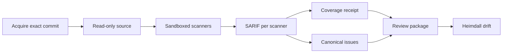

# Code Security Scanning

This document defines how FDAI scans source code itself. It covers how FDAI acquires the exact
revision, runs deterministic scanners in an isolated sandbox, and records honest coverage. The
results feed the canonical issue model, severity, priority, and remediation packs described in
[Code Security Findings](code-security-findings.md).

> **Scope:** Scanning reads code and produces evidence. It never edits the repository, never runs
> code from the repository, and never contacts the network after acquisition. Scanner findings are
> inert until the review flow and a person decide what to do.

> **Status:** The deterministic lane (acquisition, sandbox, scanner catalog, FDAI rule pack, scan
> job, and CLI) is implemented. See the
> [implementation ledger](../../roadmap-implementation/operations/code-security-scanning.md).

## Design at a glance

A scan job turns one repository revision into SARIF (Static Analysis Results Interchange Format)
reports, a coverage receipt, canonical issues, and a review package for Heimdall:

Example: an operator runs `scan` for commit `a1b2...` of `payments-api` with Opengrep and gitleaks
bound. FDAI fetches exactly that commit, extracts it read-only, and runs both scanners without
network access. It writes `opengrep.sarif`, `gitleaks.sarif`, and `receipt.json`. Because
`osv-scanner` isn't installed, coverage is marked incomplete and Heimdall publishes a
`coverage_incomplete` review instead of a clean result.

## Source acquisition

- **Exact commit:** the job fetches one commit by its full id into a private bare repository and
  verifies that the fetched commit equals the requested id.
- **No repository code at run time:** it extracts the commit's tree without `.git` into a
  content-addressed directory and removes write permission from every file.
- **Credentials:** an HTTP authorization header reaches git only through environment
  configuration. It never appears in argv, logs, or the extracted tree.
- **Bounds:** the archive size and the git timeout are limited, and failures stop the job before
  any scan.

## Scanner sandbox

Each scanner runs as one bubblewrap process with:

| Control | Setting |
|---------|---------|
| Namespaces | New user, PID, IPC, UTS, and network namespaces (`--unshare-all`), so there's no network |
| Source | The acquired tree, read-only at `/source` |
| Optional mounts | FDAI rule pack read-only at `/rules`; offline vulnerability database read-only at `/cache` |
| Writable paths | Private tmpfs `/scratch` and `/tmp` only |
| Environment | Cleared, then `HOME`, `TMPDIR`, and `PATH` only |
| Limits | CPU time, address space, and file size limits; a wall-clock timeout |
| Output | Standard output read up to the scanner's byte limit |

The sandbox observes completion itself. A run is complete only when the scanner exits with a
listed success code before the timeout and within the output limit. That observation overrides
anything the scanner claims in its SARIF, and a failed run marks the producer incomplete.

## Scanner catalog

The [scanner catalog](../../../rule-catalog/code-security/scanners.yaml) declares each
deterministic scanner's argv template, mounts, success codes, timeout, and output limit. The only
allowed placeholders are `{source}`, `{rules}`, and `{cache}`, and loading fails closed on
anything else.

| Scanner | Purpose | Needs |
|---------|---------|-------|
| `opengrep` | FDAI-authored taint and pattern rules | Rule pack |
| `gitleaks` | Hard-coded secrets (redacted in output) | Nothing |
| `osv-scanner` | Vulnerable dependencies from lockfiles | Offline OSV database |
| `trivy-config` | Infrastructure and container misconfiguration | Nothing |
| `trivy-vuln` | Vulnerable packages | Offline Trivy database |

FDAI doesn't redistribute these tools. A deployment binds each scanner id to an installed
executable. An unbound required scanner, a scanner without its offline database, a failed run,
and invalid SARIF each become a coverage limit.

## FDAI rule pack

The [rule pack](../../../rule-catalog/code-security/rules/) contains 22 FDAI-authored rules for
Python, JavaScript and TypeScript, Java, and Go. Each rule:

- carries exactly one CWE that maps to a weakness class, so its findings never land in
  `unclassified`;
- favors precision, flagging a sink only when untrusted data or an unsafe option is visible;
- has positive (`ruleid:`) and negative (`ok:`) fixtures that the engine's test mode checks.

No third-party rule text is copied, so the pack carries no third-party rule license. The fixtures
are deliberately vulnerable and never imported or executed. The Python fixture opts out of
repository lint with a file-level directive instead of a repository-wide exclusion.

## Coverage receipt

The job builds the receipt from SARIF run metadata and its own observations:

- **Completion:** observed by the sandbox, not reported by the scanner.
- **Full repository:** asserted for every scanner that completed, because each scans the whole
  extracted tree.
- **Rules version:** binds the scanner id, the tool version from SARIF, and, for rule-based
  scanners, a digest of the rule pack. A rule change therefore makes a later rescan
  non-equivalent unless the new version declares that it supersedes the old one.

The review is `coverage_incomplete` unless every required scanner was bound, completed, and
produced valid SARIF.

## Failure behavior

| Condition | Outcome |
|-----------|---------|
| Commit can't be fetched or differs from the request | Job stops; nothing is scanned |
| Scanner not installed or offline database missing | Coverage limit; review is `coverage_incomplete` |
| Timeout, output limit, or unexpected exit code | Run marked incomplete and truncated; its SARIF is ignored |
| Invalid SARIF | Coverage limit; producer marked incomplete |
| Unbounded or hostile SARIF content | Rejected or sanitized by [SARIF ingestion](code-security-findings.md#sarif-ingestion) |

## Verification

Focused tests cover catalog validation, rule-pack classification and fixture coverage, sandbox
command isolation, real bubblewrap runs (no writes to the source, no network interfaces,
truncation, timeout, and failure codes), exact-commit acquisition, and the scan job end to end.
The rule pack was validated with a Semgrep-compatible engine in test mode, with all 22 rules
passing. A real `trivy` binary ran inside the sandbox, and its SARIF went through ingestion.

## Related docs

| To learn about | Read |
|----------------|------|
| Delivery status and remaining work | [Implementation ledger](../../roadmap-implementation/operations/code-security-scanning.md) |
| Issues, severity, priority, and remediation packs | [Code Security Findings](code-security-findings.md) |
| LLM tiers and data residency | [LLM Strategy](../architecture/llm-strategy.md) |
| Tracking issue | [Issue #1966](https://github.com/dotnetpower/fdai/issues/1966) |
