# Code Security Scanning

This document defines how FDAI scans source code itself. It covers how FDAI acquires the exact
revision, runs deterministic scanners in an isolated sandbox, and records honest coverage. The
results feed the canonical issue model, severity, priority, and remediation packs described in
[Code Security Findings](code-security-findings.md).

> **Scope:** Scanning reads code and produces evidence. It never edits the repository and never
> contacts the network after acquisition. It runs repository code only in the opt-in
> [proof lane](#proof-lane-opt-in), inside a disposable sandbox with recording hooks in place of
> every sink. Scanner findings are inert until the review flow and a person decide what to do.

> **Status:** The deterministic lane (acquisition, sandbox, scanner catalog, FDAI rule pack, scan
> job, and CLI), the off-path LLM lens lane, the Python and taint weakness verifiers with their
> promotion gate, the opt-in Python proof lane, local folder scans with reports, and Console scan
> requests for registered repositories are implemented. See the
> [implementation ledger](../../roadmap-implementation/operations/code-security-scanning.md).

## Design at a glance

A scan job turns one repository revision into SARIF (Static Analysis Results Interchange Format)
reports, a coverage receipt, canonical issues, and a review package for Heimdall:



Example: an operator runs `scan` for commit `a1b2...` of `payments-api` with Opengrep and gitleaks
bound. FDAI fetches exactly that commit, extracts it read-only, and runs both scanners without
network access. It writes `opengrep.sarif`, `gitleaks.sarif`, and `receipt.json`. Because
`osv-scanner` isn't installed, coverage is marked incomplete and Heimdall publishes a
`coverage_incomplete` review instead of a clean result.

## Source acquisition

- **Exact commit:** the job fetches one commit by its full id into a private bare repository and
  verifies that the fetched commit equals the requested id.
- **No repository code at run time:** it extracts the commit's tree without `.git` into a
  content-addressed directory and removes write permission from every file.
- **Credentials:** an HTTP authorization header reaches git only through environment
  configuration. It never appears in argv, logs, or the extracted tree.
- **Bounds:** the archive size and the git timeout are limited, and failures stop the job before
  any scan.

## Scanner sandbox

Each scanner runs as one bubblewrap process with:

| Control | Setting |
|---------|---------|
| Namespaces | New user, PID, IPC, UTS, and network namespaces (`--unshare-all`), so there's no network |
| Source | The acquired tree, read-only at `/source` |
| Optional mounts | FDAI rule pack read-only at `/rules`; offline vulnerability database read-only at `/cache` |
| Writable paths | Private tmpfs `/scratch` and `/tmp` only |
| Environment | Cleared, then `HOME`, `TMPDIR`, and `PATH` only |
| Limits | CPU time, address space, and file size limits; a wall-clock timeout |
| Output | Standard output read up to the scanner's byte limit |

The sandbox observes completion itself. A run is complete only when the scanner exits with a
listed success code before the timeout and within the output limit. That observation overrides
anything the scanner claims in its SARIF, and a failed run marks the producer incomplete.

## Scanner catalog

The [scanner catalog](../../../rule-catalog/code-security/scanners.yaml) declares each
deterministic scanner's argv template, mounts, success codes, timeout, and output limit. The only
allowed placeholders are `{source}`, `{rules}`, and `{cache}`, and loading fails closed on
anything else.

| Scanner | Purpose | Needs |
|---------|---------|-------|
| `opengrep` | FDAI-authored taint and pattern rules | Rule pack |
| `gitleaks` | Hard-coded secrets (redacted in output) | Nothing |
| `osv-scanner` | Vulnerable dependencies from lockfiles | Offline OSV database |
| `trivy-config` | Infrastructure and container misconfiguration | Nothing |
| `trivy-vuln` | Vulnerable packages | Offline Trivy database |

FDAI doesn't redistribute these tools. A deployment binds each scanner id to an installed
executable. An unbound required scanner, a scanner without its offline database, a failed run,
and invalid SARIF each become a coverage limit.

## FDAI rule pack

The [rule pack](../../../rule-catalog/code-security/rules/) contains 22 FDAI-authored rules for
Python, JavaScript and TypeScript, Java, and Go. Each rule:

- carries exactly one CWE that maps to a weakness class, so its findings never land in
  `unclassified`;
- favors precision, flagging a sink only when untrusted data or an unsafe option is visible;
- has positive (`ruleid:`) and negative (`ok:`) fixtures that the engine's test mode checks.

No third-party rule text is copied, so the pack carries no third-party rule license. The fixtures
are deliberately vulnerable and never imported or executed. The Python fixture opts out of
repository lint with a file-level directive instead of a repository-wide exclusion.

## Coverage receipt

The job builds the receipt from SARIF run metadata and its own observations:

- **Completion:** observed by the sandbox, not reported by the scanner.
- **Full repository:** asserted for every scanner that completed, because each scans the whole
  extracted tree.
- **Rules version:** binds the scanner id, the tool version from SARIF, and, for rule-based
  scanners, a digest of the rule pack. A rule change therefore makes a later rescan
  non-equivalent unless the new version declares that it supersedes the old one.
- **Producer:** the catalog producer of the scanner FDAI ran, not the tool's self-reported
  name. Editions and modes report names such as `Opengrep OSS` or one `Trivy` for two scanners,
  which would otherwise detach the rules version and observed completion from the run.

The review is `coverage_incomplete` unless every required scanner was bound, completed, and
produced valid SARIF.

## Scan runner image

`services/core-control-plane/docker/code-security-scanner.Dockerfile` packages the scan job with
Opengrep, gitleaks, OSV-Scanner, and Trivy. Each binary is pinned by version and SHA-256, and the
base image is pinned by digest. The entrypoint has two steps:

1. `fdai-scan-runner prepare SOURCE_DIR` refreshes the Trivy and OSV offline databases into the
   cache. It's the only step that uses the network.
2. `fdai-scan-runner scan ...` binds every catalog scanner and the cache, then runs the scan job.
   All scanners run inside the bubblewrap sandbox with no network.

bubblewrap needs unprivileged user namespaces, so the container runtime must allow them. With
Docker, that means `--security-opt seccomp=unconfined --security-opt apparmor=unconfined`.

Example: on 2026-10-07 the image scanned OWASP NodeGoat at its pinned commit. All five scanners
completed in the sandbox and coverage was complete. The 423 raw scanner results became 202
canonical issues, 78 of them corroborated by more than one scanner and 3 `verified` by the
JavaScript code-injection verifier. That run also found and fixed three defects that host tests
couldn't reproduce:

- Opengrep rejects Semgrep's `--metrics` flag.
- gitleaks can't write its report through `/dev/stdout` inside the sandbox's user namespace.
- The tools' self-reported names (`Opengrep OSS`, and one `Trivy` for two modes) didn't match the
  catalog producers, so receipts lost the rule-pack digest.

## Local folder scans and reports

You can scan a folder on your machine and get a readable report without a running FDAI
deployment. Pass `--path` instead of `--repository` and `--revision`:

- **Committed code by default:** when the folder is the root of a git work tree, FDAI scans its
  exact `HEAD` commit, so uncommitted edits aren't part of the result.
- **Uncommitted snapshot:** `--include-uncommitted` scans the files git would track, tracked plus
  untracked without ignored files, or every regular file of a folder outside git. FDAI copies them
  into a content-addressed snapshot whose SHA-256 digest stands in for the revision. Symlinks are
  never followed, and size and file-count limits apply.
- **Report:** `--report DIR` writes `report.md`, `report.html`, and `report.json` with owner-only
  permissions. Each lists the decision, scanner coverage, counts, and one row per canonical issue
  with priority, severity, confidence, weakness class, CWE or advisory ids, fix-site location,
  and producers. It never includes source code, scanner messages, code flows, or secret values.
  `--report-locale ko` writes Korean labels.
- **Alias:** `--repo-alias` defaults to the folder name.

A snapshot has no commit, so it can't be the base of a remediation pack or of fix verification.
Commit first when you need either.

`scripts/operations/code-security-scan.sh FOLDER` runs the same scan in the scan runner image. It
builds the image and downloads the offline databases on first use, then scans with
`--network none`:

```bash
scripts/operations/code-security-scan.sh ~/src/payments-api --include-uncommitted --locale ko
```

Example: a developer scans a checkout with one uncommitted file. All five scanners complete in the
sandbox, the uncommitted `draft.py` command injection appears next to the committed one, and the
report shows the lockfile advisories under their package name. No code text appears in the report.

## Repository scans from the Console

An operator can ask FDAI to scan a registered GitHub repository from the Console **Code security**
route. Heimdall is the accountable agent for the result. The request itself grants no authority:

1. **Registration:** an Owner registers an alias for an `owner/repository` location, plus a
   default ref (`HEAD`, the repository's default branch, when omitted) and exposure, from the Console (`POST /code-security/repositories`) or with
   `fdai-code-security repo-register`. Enable and disable toggle scanning. A Console change is a
   typed proposal (`code_security.repository_change`) that the worker applies before any scan.
   Every change uses compare-and-set and appends a Heimdall-attributed audit entry naming the
   requester. An alias can't be repointed at another location.
2. **Request:** a Contributor or Owner submits `POST /code-security/scan-requests` with an alias
   and an optional branch, tag, or commit. The Operator API validates the body and stores a typed
   proposal (`code_security.scan_request`) in its durable outbox. It doesn't scan or read
   repository state.
3. **Scan:** the bounded worker `fdai-code-security process-scan-requests` claims one pending
   request at a time with a lease, rechecks the requester role and the registration, resolves the
   ref to an exact commit, scans it in the sandbox, and records the review with trigger `console`
   and the request id. With a bus bound, Heimdall publishes the review on `object.drift`.
4. **Result:** the proposal closes as completed with a bounded summary (revision, decision, issue
   count, coverage) or rejected with a reason code. The Console lists requests and their status.

The worker reads repository access from the deployment's GitHub App (`FDAI_GITHUB_APP_*`) or token
(`FDAI_GITOPS_TOKEN`) environment and narrows each token to the one registered repository with
read-only contents permission. Without credentials only public repositories can be scanned. The
worker is a batch job for a schedule or a one-shot run, not a polling daemon; the scan runner
image starts it with `fdai-scan-runner process-requests`.

| Rejection reason | Meaning |
|------------------|---------|
| `request_malformed` | The stored body isn't the typed alias and ref |
| `requester_role_insufficient` | A scan requester had neither Contributor nor Owner, or a registration requester wasn't an Owner |
| `repository_not_registered` / `repository_disabled` | The alias can't be scanned or toggled |
| `repository_conflict` | A registration names an alias that's already bound to another location |
| `source_unavailable` | The ref, repository, or credential couldn't be resolved |
| `scan_failed` / `review_conflict` | The scan failed, or different findings exist for that commit |
| `attempts_exhausted` | The request was claimed more than three times |

## LLM lens lane

The lens lane looks for weakness families that rules miss, such as missing authorization. It's
optional, runs off the agent hot path inside the scan job, and produces only inert hypotheses:

1. **Select deterministically:** walk the read-only source in sorted order, skip vendored,
   oversized, binary, and non-UTF-8 files, and pick bounded excerpts around lines that match a
   lens's sink hints in the [lens catalog](../../../rule-catalog/code-security/lenses.yaml).
2. **Ask several model families:** send each excerpt to every configured model as untrusted JSON
   data with line numbers, a strict JSON schema response, no tools, and a request byte ceiling.
3. **Verify in code:** keep a candidate only when the cited line is inside the excerpt, uses one
   of the lens's CWEs, and either matches a sink hint or assigns a variable that a later sink-hint
   line of the same excerpt uses as a whole word. Such a one-hop flow is anchored at that sink
   line, where SARIF producers place the fix site, so models that cite different lines of one flow
   meet at the same sink. No meaning is read from names or comments.
4. **Require a quorum:** emit an occurrence only when at least two distinct model families report
   grounded candidates within the line tolerance.

Kept candidates enter canonicalization in the `llm_lens` lane. They get `hypothesis` confidence,
so they can't reach alerting priorities on their own. They're corroborated only when a
deterministic or external producer reports the same root cause, and they become `verified` only
when a [weakness verifier](#weakness-verifiers) confirms the flow. With fewer than two model
families, the lane doesn't run. Budget exhaustion, model failures with their fixed reason counts,
and skipped files are recorded as lens notes in `receipt.json`. Those notes don't change deterministic coverage, because the
lane is optional. Code text that tries to instruct the model can't add findings, since every
finding must pass grounding and quorum in code.

Deployments call models with the attached managed identity. For local development,
`--lens-identity azure-cli` uses the operator's existing `az` login instead. The receipt records
the full lens report (calls, errors, and candidates rejected as ungrounded, off-lens, or without
quorum) and every kept hypothesis location.

Live validation, 2026-10-07: `gpt-4.1-mini` and `gpt-4o` in the FDAI development account
reviewed a synthetic Flask module with five planted flaws and three safe counterparts. Across
18 calls with no errors, 6 ungrounded claims were rejected and 7 grounded hypotheses were kept.
Those covered all five planted flaws and none of the safe counterparts. One extra hypothesis,
missing authentication on a public search route, is a false positive that stays an inert
`hypothesis`.

### Lens precision on real code

The operator CLI `evaluate-lens` measures hypothesis precision on
[`evaluation/lens-corpus.yaml`](../../../rule-catalog/code-security/evaluation/lens-corpus.yaml).
The corpus pins OWASP Benchmark for Java, whose maintainers label every test file with its category
and whether it's a real vulnerability. The command acquires the exact commit and takes the first ten
true and ten false files of each mapped category (command injection, path traversal, SQL injection)
in test-name order. It copies only those files into an owner-only scratch root and runs the lane
with only the matching lenses and unchanged prompts, hints, and limits. Every kept hypothesis is
labeled mechanically in the receipt: it's a true positive only when the file's category matches the
lens class and the file is a real vulnerability. `--dry-run` counts candidates and calls without
calling a model.

Measured, 2026-10-08, with `gpt-4.1-mini` and `gpt-4o`: 60 files produced 55 candidates and 110
calls with no errors. The lane kept 10 hypotheses, all for command injection: 5 true and 5 false
positives, precision 0.5 and recall 0.5. Each false positive is a file where a constant branch
(three files) or a list-index shuffle (two files) replaces the request value with a constant. Path traversal and SQL injection kept none: models cite the line that
builds the query or path, while grounding accepts only a sink-hint line, so 79 claims were
rejected as ungrounded. Lens hypotheses therefore stay inert until another producer or a verifier
confirms them.

Grounding then accepted the one-hop flow above. On a disjoint sample (`--sample-offset 10`, the
next ten true and ten false files per category) with the same two models, the strict rule kept 9
hypotheses (5 true, precision 0.556) with recall 0.5, 0, and 0 for command injection, path
traversal, and SQL injection. Flow grounding anchored 59 claims to their sink and kept 30 (15
true, precision 0.5) with recall 0.7, 0.4, and 0.4. Precision stays near 0.5, so lens
hypotheses remain inert.

Example: two model families both cite line 8, `Order.query.get(order_id)`, for
`missing-authorization` with CWE-639. FDAI keeps one `hypothesis` occurrence. The issue is
priority P3 until a person or another producer confirms it.

## Weakness verifiers

Weakness verifiers are the deterministic validate step. They run inside the scan job on the same
read-only tree, after canonicalization, and raise a confirmed issue to `verified` confidence. The
[verifier catalog](../../../rule-catalog/code-security/verifiers.yaml) lists, per weakness class,
the sinks to confirm and the sanitizers and validation guards to honor. Python covers command
injection, code injection, unsafe deserialization, SQL injection, and path traversal.

For each supported issue, the verifier parses the fix-site file without importing or running it.
It finds a catalog sink call on the fix-site line, following imports and aliases, and runs an
intra-procedural, flow-sensitive taint analysis over the enclosing function. The issue is
`verified` only when all of these hold:

1. **Attacker source:** the sink's dangerous argument comes from a parameter of an
   entrypoint-decorated function or a request attribute. Typed route converters and parameters
   annotated as numbers or UUIDs aren't sources. Local inputs such as command-line arguments
   aren't sources, because `verified` claims a network-reachable flow.
2. **No sanitizer:** no catalog sanitizer, such as `shlex.quote` or `os.path.basename`, cuts the
   flow. An allowlist or validation guard on the value removes taint on both branches.
3. **Reachable:** the sink isn't after a `return` or `raise`, or in a constant-false branch.
4. **Exact revision:** the issue and the acquired tree have the same commit.

Every other outcome leaves confidence unchanged and is recorded in `receipt.json` with a reason,
such as `no_sink_at_fix_site`, `argument_not_attacker_controlled`, `unreachable`, or
`unsupported_language`. Verifiers never lower confidence, change severity, or close an issue.
The analysis is conservative toward not verifying, so an unconfirmed issue isn't evidence of
safety. The operator CLI `export --verify-repository` runs the same verifiers on external SARIF,
such as MDASH results, against the exact acquired revision.

Example: Opengrep reports CWE-78 at `os.system(request.args['cmd'])` in a function. The verifier
finds the sink, traces the argument to `request.args`, finds no sanitizer, and marks the issue
`verified`. If the function first checks `cmd not in ALLOWED` and aborts, the issue stays
`reported`.

### Other languages and the promotion gate

For JavaScript and TypeScript, Java, and C#, FDAI-authored Opengrep taint-mode rules under
`rules/verify/` do the same job. Each rule declares request sources (Express `req`, servlet and
Spring request parameters, ASP.NET request collections and bound action parameters), sanitizers,
and the dangerous argument of each sink. The rules run with the rule pack in the scan job. An
issue is confirmed only when a deterministic-lane Opengrep or Semgrep occurrence from a verifier
rule sits in the same canonical issue, so external SARIF can't claim verification by naming a rule.

A verifier grants `verified` only after measured evidence promotes it. The
[verifier corpus](../../../rule-catalog/code-security/evaluation/verifier-corpus.yaml) pins public,
intentionally vulnerable projects at exact commits, each in a `dev` or `holdout` split. Labels come
from each project's own documentation, such as Juice Shop's source annotations, lesson pages,
solution guides, and ground-truth files. OWASP Benchmark for Java and Python supply whole-file
labels from their `expectedresults` files, split by a hash of the test name. The operator CLI
`evaluate-verifiers` fetches each project at its commit, runs both verifier kinds without executing
project code, and measures every verifier as if promoted. It writes a receipt with per-verifier
precision and recall for each split. A verifier is promoted only when its precision meets the
corpus floor of 0.90 with at least one true positive in both `dev` and `holdout`, and the
promotion list in the verifier catalog must match that receipt. Every other verifier runs in
shadow: it records its hit as `verifier_in_shadow` and doesn't raise confidence.

Example: the 2026-10-08 receipt (corpus 1.1.0, 710 `dev` and 681 `holdout` labels) promotes five
verifiers: Java and JavaScript command injection, JavaScript code and SQL injection, and Python SQL
injection, each at precision 1.0 in both splits. Six verifiers promoted by the earlier receipt fell
back to shadow on held-out evidence. Java SQL injection measured about 0.6, because Benchmark's
constant branches and dead switches fool open-source taint mode. Python code injection, path
traversal, and unsafe deserialization measured 0.27 to 0.83, because the AST verifier ignores
early-return guards. Java path traversal and C# SQL injection had no held-out true positives.
Python command injection measured 0.75 on `holdout` and stays in shadow. The JavaScript path
traversal rule no longer treats a one-argument store lookup as tainted, but two safe Juice Shop
reads gated by a known-key lookup still keep it in shadow.

## Proof lane (opt-in)

The proof lane is the dynamic step: it reproduces a finding instead of reasoning about it. It's
off by default and runs only with `scan --prove`, only for Python issues a promoted verifier
already marked `verified`, and only for command injection, code injection, unsafe
deserialization, SQL injection, and path traversal.

A standard-library harness runs on the sandbox's system Python inside the same bubblewrap
sandbox as the scanners: no network, no credentials, a cleared environment, a read-only source,
and CPU, memory, file-size, and time limits. It imports the fix-site module, resolving
unavailable third-party imports to inert stubs, and replaces each sink with a recording hook
that never performs the real command, evaluation, deserialization, query, or file access. It then
calls the enclosing function with a class-specific payload in every request field and
parameter. The issue is `proven` only when the payload reaches the sink in an exploitable shape:

| Class | Payload | Proven when |
|-------|---------|-------------|
| Command injection | `x;` and a marker | A shell-aware lexer sees a command separator followed by the marker |
| Code injection | The marker | The evaluated text parses with the marker as a name, not a string |
| SQL injection | `x'` and the marker | The quote before the marker survives without escaping |
| Path traversal | `../../` and the marker | The traversal reaches the file operation intact |
| Unsafe deserialization | Encoded marker bytes | Attacker bytes reach the loader |

Quoting, escaping, parameterized queries, `basename`, or a failing import therefore leave the issue
`verified`. On pygoat at its pinned commit, all nine verified issues were proven. The test suite
runs the same harness against safe variants, including `shlex.quote`, `repr`, parameterized
`sqlite3`, and `basename`, and requires every one to stay unproven.

### Other proof languages

The lane picks a harness by fix-site extension, and a language runs only when the operator gives
its runtime with `scan --prove`:

- **JavaScript** (`--prove-node`): `fdai_prove.js` runs on Node.js in the same sandbox. Its loader
  replaces every package with an inert stub and `child_process`, `fs`, and `vm` with recording
  hooks, and `eval` and `Function` are hooks too. Each hook returns an inert stub, so the target
  keeps running past one sink. The harness calls every exported, registered, or
  constructor-assigned function whose source contains the fix-site line. A hit counts only when the
  caller's stack frame is the fix-site file and line, and the same class predicates as Python
  apply. Targets are JavaScript issues a promoted verifier confirmed.
- **Native C and C++** (`--prove-cc`): memory-safety issues have no deterministic verifier, so
  they're eligible when a deterministic or external producer reported them, never the LLM lens
  alone. `fdai_prove_native.py` finds the enclosing function and accepts only a buffer signature
  it can drive: a byte or char pointer with an optional length, or one string. It builds a driver
  and the target with AddressSanitizer and UndefinedBehaviorSanitizer and runs fixed input
  lengths. The issue is `proven` only when the sanitizer's first frame in the target file is the
  fix-site line. AddressSanitizer can't run under an address-space limit, so this run alone drops
  the sandbox `RLIMIT_AS`. The harness limits the compiler's address space and gives every run a
  CPU limit, `hard_rss_limit_mb`, a timeout, and truncated output.

On OWASP NodeGoat at its pinned commit, the three `eval` lines in `contributions.js` were proven in
the sandbox. Tests prove vulnerable JavaScript fixtures for command, code, SQL, and path flows and
a stack overflow in a C fixture, and require the safe counterparts (`execFile` with an argument
list, `Number`, a placeholder query, `basename`, and a bounds-checked copy) to stay unproven. Java
and C# have no proof harness yet.

## Failure behavior

| Condition | Outcome |
|-----------|---------|
| Commit can't be fetched or differs from the request | Job stops; nothing is scanned |
| Scanner not installed or offline database missing | Coverage limit; review is `coverage_incomplete` |
| Timeout, output limit, or unexpected exit code | Run marked incomplete and truncated; its SARIF is ignored |
| Invalid SARIF | Coverage limit; producer marked incomplete |
| Unbounded or hostile SARIF content | Rejected or sanitized by [SARIF ingestion](code-security-findings.md#sarif-ingestion) |
| Fewer than two model families for the lens lane | Lens lane doesn't run; a lens note records why |
| Ungrounded, off-lens, or non-quorum model output | Discarded and counted in the lens report |
| Unsupported language or class, oversized, unparsable, or escaping file | Verifier result `unsupported`; confidence unchanged |
| Sink missing, sanitized, validated, or unreachable | Verifier result `not_verified` with a reason; confidence unchanged |
| Verifier hit from an unpromoted verifier | Result `not_verified` with `verifier_in_shadow`; confidence unchanged |
| Proof import failure, timeout, or no exploitable payload at the sink | Result `not_proven` with a reason; confidence stays `verified` |
| Local folder isn't a repository root, is empty, or exceeds snapshot limits | Job stops; nothing is scanned |
| Console request for an unregistered or disabled alias, or an unresolvable ref | Request closes as rejected with a reason code |

## Verification

Focused tests cover catalog validation, rule-pack classification and fixture coverage, sandbox
command isolation, real bubblewrap runs (no writes to the source, no network interfaces,
truncation, timeout, and failure codes), exact-commit acquisition, and the scan job end to end.
The rule pack was validated with a Semgrep-compatible engine in test mode, with all 22 rules
passing. Lens tests cover deterministic selection, grounding, CWE filtering, quorum across
families, budget and failure reporting, and the adapter's tool-free strict-schema request through
a mock transport, without live model calls. Verifier tests confirm attacker-controlled flows for
every supported class, and reject parameterized queries, sanitizers, allowlist guards, typed
parameters, safe loaders, reassignment, unreachable sinks, local inputs, symlink escapes, and
revision mismatches. A real `trivy` binary ran inside the sandbox, and its SARIF went through ingestion.
Local scan tests cover committed-`HEAD` and snapshot acquisition, ignored files, symlink escapes,
ref resolution, and report escaping and localization; a real bubblewrap run scans an uncommitted
snapshot. Request tests cover registration, audit, body validation, and every rejection reason, and
a throwaway PostgreSQL database validated the proposal claim, completion, and Operator projections.
A live run against github.com registered `OWASP/NodeGoat` without a ref, resolved `HEAD` to its
default branch commit, completed all five scanners with complete coverage, and recorded 202 issues
with the request id.

## Related docs

| To learn about | Read |
|----------------|------|
| Delivery status and remaining work | [Implementation ledger](../../roadmap-implementation/operations/code-security-scanning.md) |
| Issues, severity, priority, and remediation packs | [Code Security Findings](code-security-findings.md) |
| LLM tiers and data residency | [LLM Strategy](../architecture/llm-strategy.md) |
| Tracking issue | [Issue #1966](https://github.com/dotnetpower/fdai/issues/1966) |
