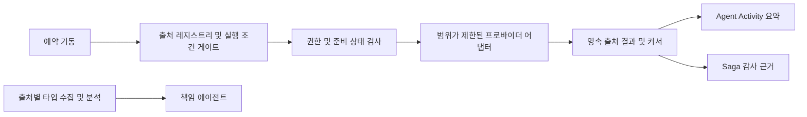

# 권한 인식 관측 캠페인

이 문서는 FDAI가 읽기 신원으로 접근할 수 있는 등록된 모든 관측 출처를 지속적으로 확인하는
방식을 정의합니다. 인벤토리, 컨트롤 플레인 활동, 상태, 메트릭, 로그, 네트워크 구성, 비용 및
복구 근거는 에이전트나 Console에 관리 리소스 실행 권한을 부여하지 않고 하나의 범위가 제한된
캠페인 계약을 공유합니다.

> **범위:** 캠페인은 서버에 등록된 출처, 범위, 테이블, 메트릭 및 조회 템플릿만 읽습니다.
> 광범위한 클라우드 역할이 있어도 임의 로그 검색이나 제한 없는 조회를 허용하지 않습니다.
>
> **런타임 동등성:** Full-stack 로컬과 배포는 같은 출처 카탈로그, 실행 조건 판정, 동시성,
> 커서, 정규화 및 활동 계약을 실행합니다. 로컬 PostgreSQL은 service-owned PostgreSQL
> 엔드포인트를 대체합니다. 자격 증명 획득은 프로필에 연결된 어댑터이며 캠페인 동작을 바꾸지
> 않습니다.

## 구현 상태

### 구현 범위

| 영역 | 상태 | 근거 | 참고 |
|------|------|------|------|
| 기존 Azure 읽기 어댑터 | implemented | `delivery/azure/activity_log.py`, `delivery/azure/inventory.py`, `delivery/azure/log_query.py`, `delivery/azure/observation_campaign.py`, `core/read_investigation/` | 출처별 수집 및 분석 경로는 의미 있는 근거를 계속 소유합니다. 캠페인 커버리지는 전체 의미 payload 대신 집계 스냅샷 개수, ARG 개수 및 대상이 필요 없는 Log Analytics 메트릭을 읽습니다. |
| 캠페인 계약 및 출처 레지스트리 | implemented | `config/observation-sources.yaml`, `fdai_service_contracts/operational_activity.py`, `delivery/observation_source_catalog.py`, 집중 계약 및 카탈로그 테스트 | 엄격한 의미 digest 카탈로그가 10개 도메인을 모두 다루고 알 수 없는 필드, 잘못된 소유자, 제한 없는 한도 및 원시 활동 사유 문구를 거부합니다. |
| 영속 캠페인 실행기 | implemented | `delivery/observation_campaign.py`, 집중 수명 주기 테스트 | 원자적 lease, 개정 번호를 확인하는 종료 기록, 충돌 복구, 현재 상태 커서, 부분 격리, 동시성 4 및 개인정보가 제한된 활동 요약을 실행할 수 있습니다. |
| 로컬 및 배포 예약 동등성 | implemented | `delivery/observation_campaign_cli.py`, `delivery/inventory_sync_cli.py`, `.vscode/tasks.json`, `infra/modules/compute/container-apps/observation_campaign_job.tf`, 집중 CLI 및 workspace 테스트 | 두 실행 위치 모두 매분 캠페인 실행 조건을 확인합니다. 두 위치 모두 권위 있는 인벤토리 실행 조건 게이트도 실행하며 자격 증명과 PostgreSQL 연결만 다릅니다. |
| Agent Activity 관측 변환 결과 | implemented | `fdai_operator_service/activity_projection.py`, `console/src/agent-operational-activity.ts`, 집중 Operator 및 Console 테스트 | 시작 및 종료 출처 상태를 실제 전달 전에 불러오고, 안정적인 활동 id를 사용하며, 잘못된 개인정보 필드를 거부하고, 지역화된 도메인 레이블을 표시합니다. |
| 통제된 실제 캠페인 근거 | in-progress | 검증된 개정 번호 `6aae0837f`, 로컬 카탈로그 digest `sha256:86d8dac44f5a40b3fd5433e5a31ab00d42fa5ef81701a0b0e97056b6ff470366`, 인증된 Agent Activity | 하드닝된 로컬 실행은 프로바이더 실패 없이 고유한 출처 행 10개를 만들었습니다. 동등한 배포 개정 번호 근거는 열려 있습니다. |

### 구현 이력

| 날짜 | 상태 | 변경 | 근거 | 남은 작업 |
|------|------|------|------|-----------|
| 2026-08-14 | in-progress | 등록된 모든 출처를 위한 하나의 권한 인식 관측 캠페인을 정의하고 로컬과 배포의 동작 동등성을 명시했습니다. 이전 구현 출처 이력은 재구성하지 않았습니다. | `current change`, 구현 범위 표에 인용한 기존 어댑터와 scheduler 경로 | 아래 계약, 실행기, 출처 연결, 활동 변환 결과, 동등성 검사 및 통제된 런타임 근거를 구현합니다. |
| 2026-08-14 | implemented | 공유 커버리지 캠페인, 반복 로컬 인벤토리 동등성, 배포 작업과 읽기 역할, 영속 Operator 변환 결과 및 지역화된 Console lane을 구현하고 하드닝했습니다. | `current change`, 집중 계약, 수명 주기, 프로바이더, CLI, 인벤토리, Operator, Console, workspace, 타입, lint, JSON 및 Terraform 검사 | 검증을 주장하기 전에 하나의 카탈로그 digest에서 통제된 로컬 및 배포 실행을 보존합니다. |
| 2026-08-14 | implemented | 첫 통제된 로컬 실행에서 그래프 속성 decode, Service Health payload 크기 및 대상 없는 메트릭 라우팅 실패를 발견한 뒤 집계 전용 커버리지를 하드닝했습니다. | 검증된 개정 번호 `214409710`, 이 실행은 준비된 출처 6개, 정규화된 Cost 제한 1개 및 격리된 프로바이더 실패 3개에 도달했습니다. `current change`, 집중 집계 커버리지 검사 125개 통과 | 하드닝된 개정 번호에서 통제된 로컬 캠페인을 다시 실행한 뒤 동등한 배포 실행을 보존합니다. |
| 2026-08-14 | in-progress | 하나의 카탈로그 digest에서 하드닝된 로컬 캠페인과 인증된 Console 변환 결과를 보존했습니다. | `6aae0837f` 중앙 receipt, 준비된 출처 8개, 명시적인 오래된 인벤토리, 정규화된 Cost 제한 및 프로바이더 실패가 없는 고유한 지역화 Agent Activity 행 10개 | 검증을 주장하기 전에 동등한 배포 실행과 남은 부정 런타임 결과를 보존합니다. |
| 2026-08-14 | implemented | 잘못된 선택적 VM 종료 일정이 승격된 전체 인벤토리 그래프를 숨기지 않도록 했습니다. | `current change`, 순수 projection 회귀 검사 통과, 복구된 권위 있는 로컬 스냅샷이 fresh 상태의 209-resource active view를 구체화하고 일정 warning 4개를 격리했습니다. | 다음 실행 조건 캠페인이 stale에서 fresh로 전환되는지 관측한 뒤 배포 근거를 보존합니다. |
| 2026-08-14 | in-progress | 권위 있는 인벤토리 복구 후 다음 실행 조건 캠페인을 확인하고 인증된 Agent Activity 변환 결과를 갱신했습니다. | 검증된 개정 번호 `6585d6fcd`, 준비된 출처 9개, 집계 기록 1,104개의 fresh 인벤토리, 정규화되어 보존된 Cost 제한, 고유한 Console 행 10개 및 프로바이더 실패 0개 | 검증을 주장하기 전에 권한 없음, 미구성 및 시간 초과 런타임 결과와 동등한 배포 실행을 보존합니다. |

### 남은 작업

- [x] 범위가 제한된 카탈로그, 원자적 실행기, 프로바이더 probe, 로컬 및 배포 기동 경로,
  반복 권위 인벤토리, 영속 활동 변환 결과 및 지역화된 Console lane을 구현합니다.
- [x] 검증된 개정 번호 `6aae0837f`에서 고유한 출처 행 10개, 준비됨, 오래됨, 제한됨, 빈 결과,
  건너뜀, 완료 및 저하 결과와 인증된 snapshot-first/실제 중복 제거 근거를 포함하는 통제된 로컬
  실행 하나를 보존합니다.
- [ ] end-to-end 검증을 주장하기 전에 권한 없음, 미구성 및 시간 초과 런타임 결과와 같은 카탈로그
  digest의 배포 실행 하나를 보존합니다.

## 설계 개요

캠페인은 기계적인 읽기 전용 커버리지 작업자입니다. scheduler가 캠페인을 기동하고 레지스트리가
실행 조건을 만족한 출처를 선택하며, 프로바이더 어댑터가 범위가 제한된 커버리지 조회를
실행합니다. 실행기는 현재 결과를 저장한 뒤 운영 활동 요약을 발행합니다. 원시 기록을 다시
발행하거나 finding을 만들거나 출처별 수집 및 분석 경로를 대체하지 않습니다. 에이전트는 기존의
타입이 지정된 경로에서 의미 있는 근거를 소비하며 프로바이더를 호출하거나 캠페인 작업을 직접
시작하지 않습니다.

## 출처 카탈로그

레지스트리에는 FDAI가 정규화할 수 있는 모든 관측 분류가 포함됩니다. 배포는 범위를 좁히거나
선택적 출처를 구성하지 않을 수 있습니다. 그러나 등록된 출처를 커버리지 보고에서 조용히
제거할 수 없습니다.

| 도메인 | 기본 수집 | 책임 에이전트 | 프로바이더 예시 |
|--------|-----------|---------------|-----------------|
| `inventory` | 10분마다 기동하고 6시간 게이트가 실행 조건을 만족하면 완전 조정 | Huginn | Azure Resource Graph와 ARM 대체 경로 |
| `activity-log` | 지속 push와 커서 기반 복구 pull | Huginn | Event Grid, Event Hubs, Azure Activity Log REST |
| `resource-health` | 가능한 경우 이벤트 기반, 그리고 범위가 제한된 주기 검사 | Heimdall | Resource Health, ARG `HealthResources` |
| `service-health` | 가능한 경우 이벤트 기반, 그리고 범위가 제한된 주기 검사 | Heimdall | Service Health 활성 이벤트 |
| `metrics` | 출처 최신성을 포함한 1분 분석기 틱 | Heimdall 또는 Freyr | Prometheus, Azure Monitor Metrics, Log Analytics 메트릭 |
| `logs` | 승인된 테이블의 커서 또는 시간 구간 조회 | Heimdall | Log Analytics KQL, 플랫폼 진단 로그 |
| `guest-logs` | 인시던트가 시작하고 범위가 제한된 주기 커버리지 검사 | Heimdall | Windows 종료 이벤트, Linux syslog |
| `network-config` | 변경 기반 및 완전 조정 | Heimdall | NSG 규칙, VNet 피어링, 경로 구성 |
| `cost` | 경보 기반 및 일일 조정 | Njord | Cost Management, 예산, Advisor 비용 권장 사항 |
| `recovery` | 이벤트 기반 및 예약된 준비 상태 검사 | Vidar | Backup vault 상태, 복원 예행 연습, 복제 지연 |

출처 분류를 추가하려면 검토된 레지스트리 항목, 책임 에이전트, 프로바이더 중립 결과 정규화기,
범위가 제한된 조회 정책, 집중 테스트 및 이 문서의 두 언어 버전 갱신이 필요합니다. 런타임
권한만으로는 출처 항목을 만들 수 없습니다.

## 캠페인 계약

### 출처 등록

버전 1 출처 등록에는 다음 정보가 포함됩니다:

- 안정적인 출처 id와 관측 도메인
- 하나의 책임 Pantheon 에이전트와 하나의 기계적 producer
- 출처가 필수인지 여부
- 기동 간격, 조회 구간 및 시간 초과
- 최대 대상, 결과 행 및 응답 바이트
- 출처 id로 선택하는 하나의 구현 소유 조회 또는 승격 상태 어댑터

프로바이더 코드는 변경할 수 없는 조회 템플릿, 권한 해석, 커서 동작 및 민감정보 제거를
소유합니다. 카탈로그에 실행 가능한 조회 문구나 프로바이더 엔드포인트를 추가하는 것은 지원하지
않습니다.

### 출처 결과

실행 조건을 만족한 하나의 출처 시도는 `started`로 영속화된 뒤 `completed`, `degraded` 또는
`failed`로 끝납니다. `unavailable`은 최신성 결과이고 출처별 커버리지가 원인을 설명하며,
실행 조건을 만족하지 않은 출처는 프로세스 요약에서만 이전 결과와 `skipped=true`를 반환합니다.
영속 현재 상태에는 개정 번호, 출처 id, 도메인, 캠페인 id, 상태, 커버리지, 최신성, 근거 개수,
기간, 범위가 제한된 사유 코드, 타임스탬프 및 선택적 범위 제한 커서가 포함됩니다. 리소스 id,
구독 id, principal id, 엔드포인트, 원시 조회, 원시 프로바이더 페이로드 및 로그 본문은
제외합니다.

`unavailable`은 구성, 권한, 보존 또는 프로바이더 기능이 누락된 경우 예상되는 근거 상태입니다.
`failed`는 예상하지 못한 계약, 영속성 또는 프로바이더 실패에만 사용합니다. 성공한 빈 결과는
승인된 조회가 완료되어 일치 기록을 찾지 못했다는 뜻이며, 조회하지 않은 출처가 정상이라는 뜻이
아닙니다.

## 권한 및 커버리지 모델

캠페인은 구성, 권한, 도달 가능성, 보존 및 최신성을 별도로 평가합니다. 등록된 각 출처는 다음
커버리지 결과 중 하나를 보고합니다:

| 결과 | 의미 |
|------|------|
| `ready` | 출처가 구성되고 권한이 있으며 도달 가능하고 최신성 예산 안에 있습니다. |
| `partial` | 승인된 일부 범위 또는 파티션은 완료됐지만 나머지는 완료되지 않았습니다. |
| `unauthorized` | 읽기 신원에 승인된 범위의 필수 권한이 없습니다. |
| `unconfigured` | 필요한 엔드포인트, workspace, Diagnostic Settings 또는 프로바이더 연결이 없습니다. |
| `unreachable` | 범위가 제한된 시도 안에서 전송 또는 프로바이더 준비 상태가 실패했습니다. |
| `retention-gap` | 요청 구간이 권위 있는 출처의 보존 기간을 초과합니다. |
| `stale` | 최신 완료 결과가 등록된 최신성 상한보다 오래됐습니다. |

예상된 권한 거부나 실패 후에도 실행기는 독립 출처를 계속 실행합니다. 모든 필수 출처의 현재
커버리지가 `ready`일 때만 집계 캠페인이 `completed`이며, 그 외에는 `partial`입니다. 누락된
출처를 0건, 정상 상태 또는 권한 추론으로 바꾸지 않습니다.

## 수집 정책

- **출처별 push 우선:** Event Grid, Diagnostic Settings 및 native 경보는 기존의 타입이 지정된
  수집 경로를 계속 사용합니다. 캠페인은 구성된 pull 또는 승격 상태 커버리지를 보고합니다.
- **커서 복구:** Pull 읽기 담당은 영속 출처 커서로 공백을 닫고 종료 결과가 영속화된 뒤에만
  커서를 확정합니다.
- **완전 조정:** 권위 있는 인벤토리 CLI는 로컬과 배포의 같은 실행 조건 게이트를 통해 전체
  ARG/ARM 승격을 수행합니다. 캠페인은 해당 승격 그래프를 관측하며 구성, 비용 및 복구 probe는
  등록된 범위 제한 읽기를 각각 실행합니다.
- **서버 소유 조회:** 주기 KQL, 메트릭, Activity Log 및 프로바이더 요청은 검토된 템플릿에서만
  가져옵니다. 모델과 브라우저는 실행 가능한 조회 텍스트를 제공할 수 없습니다.
- **범위가 제한된 fan-out:** 실행기는 최대 네 개 프로바이더 호출을 동시에 실행하고 출처별
  대상, 행, 바이트, 시간 및 비용 제한을 적용합니다.
- **권한 상승 없음:** 캠페인 요약은 자율성을 승인, 실행 또는 높일 수 없습니다. 각 기능은
  자체 출처별 근거 게이트에서 신뢰도나 자율성을 계속 낮춥니다.
- **프로세스 내부 재시도 대기 없음:** 제한되거나 실패한 출처는 종료 커버리지를 기록하고 다음
  실행 조건 기동에서 재시도합니다. 한 출처가 캠페인 기한을 늘리지 않게 합니다.

## 런타임 동등성

로컬과 배포 프로필은 같은 캠페인 패키지와 직렬화된 출처 카탈로그를 사용합니다. 영속 상태에서
같은 실행 조건을 판정하고 같은 정규화 결과와 운영 활동을 방출합니다.

| 연결 | Full-stack 로컬 | 배포 |
|------|-----------------|------|
| 상태 및 커서 저장소 | Loopback PostgreSQL | Service-owned PostgreSQL |
| Azure 자격 증명 | 현재 승인된 로컬 읽기 자격 증명 어댑터 | 전용 읽기 전용 Managed Identity |
| 이벤트 전송 | 로컬 Redpanda Kafka wire | Event Hubs Kafka wire |
| scheduler | 로컬 작업 실행기 | Container Apps Job |
| 출처 카탈로그 및 동작 | 동일 | 동일 |

실행 장소를 바꿔도 출처 구성원, 간격, 제한, 대체 순서, 사유 코드, 최신성, 커서,
정규화 또는 Agent Activity 의미가 달라지지 않아야 합니다. 한 장소에서 사용 불가인 출처는
캠페인에서 사라지지 않고 사용 불가로 계속 표시됩니다.

## 에이전트 소유권

- **Huginn:** 외부 신호 유입, 인벤토리 및 Activity Log 정규화를 소유합니다. 캠페인 요약은
  이 책임을 표시하지만 실행 중인 에이전트를 가장하지 않습니다.
- **Heimdall:** 출처 커버리지, 최신성, 상태 정보, 메트릭, 로그, 네트워크 관측 및 결정론적
  상관관계를 소유합니다.
- **Njord:** 비용 및 예산 관측을 소유합니다.
- **Freyr:** 승인된 메트릭 출처에서 파생된 용량 관측을 소유합니다.
- **Vidar:** 복구 준비 상태 및 롤백 경로 관측을 소유합니다.
- **Saga:** 프로바이더 읽기 담당자가 되지 않고 캠페인과 출처 결과 근거를 감사합니다.
- **Forseti:** 근거가 타입이 지정된 컨트롤 루프에 도달한 뒤에만 finding을 판정합니다. 수집
  캠페인을 실행하지 않습니다.

scheduler, 실행기, 어댑터, 영속 저장소 및 Operator 변환 결과는 기계적 구성 요소입니다.
판정, 승인 또는 실행 권한을 갖지 않습니다.

## Agent Activity 표현

각 출처 시도는 영속 전이 뒤 범위가 제한된 `agent.operational-activity` 요약을 발행합니다.
Agent Activity는 도메인, 소유자, 출처 레이블, 종료 상태, 최신성, 근거 개수, 기간 및 사유
코드를 표시합니다. 원시 로그 줄, 클라우드 식별자, 조회 텍스트, 신원 및 프로바이더 오류는 공유
활동 스트림 밖에 둡니다.

영속 Operator 변환 결과는 실제 스트림보다 먼저 각 출처의 현재 상태를 불러옵니다. 영속 전달과
실제 전달은 하나의 activity id를 공유하므로 다시 연결하거나 새로 고쳐도 행을 중복 생성하지
않습니다. 모든 출처를 건너뛰는 수동 scheduler 기동은 새 작업 행으로 표시하지 않고 정상 상태를
만들어내는 대신 마지막 커버리지 결과를 보존합니다.

## 실패 동작

- 출처 권한 거부는 `unavailable/unauthorized`를 만들고 관련 없는 출처를 중단하지 않습니다.
- 프로바이더 `429`는 대기하거나 캠페인 예산을 늘리지 않고 `degraded/source_throttled`를
  기록하며 다음 실행 조건 기동에서 재시도합니다.
- 잘못된 결과는 해당 출처를 실패시키며 정규화된 근거에 들어갈 수 없습니다.
- 프로세스가 종료되면 claim된 실행을 영속 상태에서 복구할 수 있으며 재시작 시 프로바이더
  작업 완료를 가정하지 않습니다.
- 오래됐거나 부분적인 필수 출처는 운영자와 출처별 근거 게이트에 명시적으로 남습니다. 캠페인
  요약 자체는 위험 또는 승인 판정이 아닙니다.
- 영속성 실패는 해당 전이의 커서 진행과 활동 발행을 막습니다.
- 브로커 실패는 영속 출처 truth를 롤백할 수 없으며 다음 스냅샷 초기화가 이를 복원합니다.

## 검증 및 release 게이트

다음 항목을 집중 테스트로 입증해야 구현이 완료됩니다:

1. 등록되고 실행 조건을 만족한 모든 출처를 멱등성 키마다 정확히 한 번 시도합니다.
2. 출처 실패를 격리하고 집계 partial 결과를 만듭니다.
3. 영속 종료 상태를 기록한 뒤에만 커서를 진행합니다.
4. 로컬과 배포 조립이 같은 카탈로그 digest와 실행기 동작을 사용합니다.
5. 권한이 없거나 구성되지 않은 출처가 계속 표시되고 정상 또는 빈 상태가 되지 않습니다.
6. 행, 바이트, 대상, 동시성, 조회 구간 및 시간 제한을 적용합니다.
7. 활동 기록에 원시 근거, 클라우드 식별자, 신원 또는 권한이 포함되지 않습니다.
8. snapshot-first 및 실제 Agent Activity 전달이 activity id로 중복 제거됩니다.
9. 통제된 로컬 실행과 배포 실행이 같은 등록 출처 집합을 다룹니다.

`validated`로 승격하려면 두 런타임 산출물이 모두 필요합니다. 단위, 통합 및 브라우저 테스트는
구현을 입증하지만 배포된 출처 도달 가능성 근거를 대신하지 않습니다.

## 관련 문서

| 알아볼 내용 | 문서 |
|-------------|------|
| 범위가 제한된 운영자 조사 | [Azure 읽기 조사](../interfaces/azure-read-investigations-ko.md) |
| 탐지 및 발견된 문제 생성 | [관측 가능성 및 탐지](../rules-and-detection/observability-and-detection-ko.md) |
| 프로바이더 중립 읽기 계약 | [CSP 중립성](../architecture/csp-neutrality-ko.md) |
| 로컬 및 배포 실행 동등성 | [런타임 동등성](../deployment/dev-and-deploy-parity-ko.md) |
| Azure 신원 및 Diagnostic Settings | [배포 및 온보딩](../deployment/deploy-and-onboard-ko.md) |
