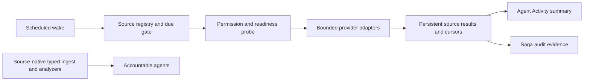

# Permission-Aware Observation Campaign

This document defines how FDAI continuously checks every registered observation source that its
read identity can access. Inventory, control-plane activity, health, metrics, logs, network
configuration, cost, and recovery evidence share one bounded campaign contract without giving an
agent or the Console managed-resource execution authority.

> **Scope:** A campaign reads only server-registered sources, scopes, tables, metrics, and query
> templates. Having a broad cloud role does not authorize arbitrary log discovery or unbounded
> queries.
>
> **Runtime parity:** Full-stack local and deployment run the same source catalog, due decisions,
> concurrency, cursor, normalization, and activity contracts. Local PostgreSQL replaces the
> service-owned PostgreSQL endpoint. Credential acquisition remains a profile-bound adapter and
> does not change campaign behavior.

## Implementation status

### Implementation scope

| Area | State | Evidence | Notes |
|------|-------|----------|-------|
| Existing Azure read adapters | implemented | `delivery/azure/activity_log.py`, `delivery/azure/inventory.py`, `delivery/azure/log_query.py`, `composition/wire_metric_provider.py`, `core/read_investigation/` | Source-native ingest and analyzers continue to own semantic evidence. The campaign verifies bounded source coverage and does not replace them. |
| Campaign contract and source registry | implemented | `config/observation-sources.yaml`, `fdai_service_contracts/operational_activity.py`, `delivery/observation_source_catalog.py`, focused contract and catalog tests | The strict semantic-digest catalog covers all ten domains and rejects unknown fields, invalid owners, unbounded limits, and raw activity reason text. |
| Persistent campaign runner | implemented | `delivery/observation_campaign.py`, focused lifecycle tests | Atomic leases, revision-checked terminal writes, crash recovery, current-state cursors, partial isolation, concurrency four, and privacy-bounded activity summaries are executable. |
| Local and deployed scheduling parity | implemented | `delivery/observation_campaign_cli.py`, `delivery/inventory_sync_cli.py`, `.vscode/tasks.json`, `infra/modules/compute/container-apps/observation_campaign_job.tf`, focused CLI and workspace tests | Both venues wake once per minute for campaign due checks. Both also run the authoritative inventory due gate; only credential and PostgreSQL bindings differ. |
| Agent Activity observation projection | implemented | `fdai_operator_service/activity_projection.py`, `console/src/agent-operational-activity.ts`, focused Operator and Console tests | Started and terminal source state hydrates before live delivery, uses stable activity ids, rejects malformed privacy fields, and displays localized domain labels. |
| Governed live campaign evidence | not-started | - | No retained local and deployed receipt set proves equivalent source coverage and Agent Activity presentation. |

### Implementation history

| Date | State | Change | Evidence | Remaining |
|------|-------|--------|----------|-----------|
| 2026-08-14 | in-progress | Defined one permission-aware observation campaign for all registered sources and made local/deployed behavioral parity explicit. Earlier implementation provenance was not reconstructed. | `current change`; existing adapter and scheduler paths cited in the scope table | Implement the contract, runner, source bindings, activity projection, parity checks, and governed runtime evidence below. |
| 2026-08-14 | implemented | Implemented and hardened the shared coverage campaign, recurring local inventory parity, deployed job and read roles, durable Operator projection, and localized Console lane. | `current change`; focused contract, lifecycle, provider, CLI, inventory, Operator, Console, workspace, type, lint, JSON, and Terraform checks | Retain governed local and deployed runs on one catalog digest before claiming validation. |

### Remaining work

- [x] Implement the bounded catalog, atomic runner, provider probes, local and deployed wake paths,
  recurring authoritative inventory, durable activity projection, and localized Console lane.
- [ ] Retain one governed local and one deployed run on the same catalog digest covering authorized,
  unauthorized, unconfigured, throttled, timed-out, empty, partial, skipped, and successful source
  outcomes plus snapshot-first/live deduplication.

## Design at a glance

The campaign is a mechanical, read-only coverage worker. A scheduler wakes it, the registry selects
sources that are due, provider adapters execute bounded coverage queries, and the runner stores the
current result before publishing an operational activity summary. It does not republish raw records,
create findings, or replace source-native ingest and analyzers. Agents consume semantic evidence
from those existing typed paths; they do not call providers or start campaign jobs directly.

## Source catalog

The registry contains every observation family FDAI knows how to normalize. A deployment may
narrow scope or leave an optional source unconfigured. It cannot silently drop a registered source
from coverage reporting.

| Domain | Default collection | Accountable agent | Provider examples |
|--------|--------------------|-------------------|-------------------|
| `inventory` | Wake every 10 minutes; complete reconciliation when the six-hour gate is due | Huginn | Azure Resource Graph with ARM fallback |
| `activity-log` | Continuous push plus cursor-based recovery pull | Huginn | Event Grid, Event Hubs, Azure Activity Log REST |
| `resource-health` | Event-driven when available plus bounded periodic sweep | Heimdall | Resource Health, ARG `HealthResources` |
| `service-health` | Event-driven when available plus bounded periodic sweep | Heimdall | Service Health active events |
| `metrics` | One-minute analyzer tick with source freshness | Heimdall or Freyr | Prometheus, Azure Monitor Metrics, Log Analytics metrics |
| `logs` | Cursor or time-window query over approved tables | Heimdall | Log Analytics KQL, platform diagnostic logs |
| `guest-logs` | Incident-triggered and bounded periodic coverage check | Heimdall | Windows shutdown events, Linux syslog |
| `network-config` | Change-driven plus complete reconciliation | Heimdall | NSG rules, VNet peering, route configuration |
| `cost` | Alert-driven plus daily reconciliation | Njord | Cost Management, budgets, Advisor cost recommendations |
| `recovery` | Event-driven plus scheduled readiness probe | Vidar | Backup vault state, restore rehearsal, replication lag |

Adding a source family requires a reviewed registry entry, an accountable agent, a provider-neutral
result normalizer, a bounded query policy, focused tests, and an update to both language versions
of this document. Runtime permissions alone never create a source entry.

## Campaign contracts

### Source registration

The version 1 source registration includes:

- a stable source id and observation domain;
- one accountable Pantheon agent and one mechanical producer;
- whether the source is required;
- wake interval, lookback, and timeout;
- maximum targets, result rows, and response bytes; and
- one implementation-owned query or promoted-state adapter selected by source id.

Provider code owns immutable query templates, permission interpretation, cursor behavior, and
redaction. Adding executable query text or provider endpoints to the catalog is not supported.

### Source result

One due source attempt persists as `started` and then `completed`, `degraded`, or `failed`.
`unavailable` is a freshness result, source-specific coverage explains why, and a not-due source
returns its prior result with `skipped=true` only in the process summary. The durable current state
records revision, source id, domain, campaign id, status, coverage, freshness, evidence count,
duration, bounded reason codes, timestamps, and an optional bounded cursor. It excludes resource
ids, subscription ids, principal ids, endpoints, raw queries, raw provider payloads, and log bodies.

`unavailable` is an expected evidence state for missing configuration, authorization, retention,
or provider capability. `failed` is reserved for an unexpected contract, persistence, or provider
failure. An empty successful result means the approved query completed and found no matching
records; it never means that an unqueried source is healthy.

## Permission and coverage model

The campaign evaluates configuration, authorization, reachability, retention, and freshness
separately. Each registered source reports one of these coverage outcomes:

| Outcome | Meaning |
|---------|---------|
| `ready` | The source is configured, authorized, reachable, and within its freshness budget. |
| `partial` | Some approved scopes or partitions completed while others did not. |
| `unauthorized` | The read identity lacks a required permission for an approved scope. |
| `unconfigured` | A required endpoint, workspace, diagnostic setting, or provider binding is absent. |
| `unreachable` | Transport or provider readiness failed inside the bounded attempt. |
| `retention-gap` | The requested window exceeds authoritative source retention. |
| `stale` | The latest complete result is older than the registered freshness ceiling. |

The runner continues independent sources after an expected denial or failure. The aggregate
campaign is `completed` only when every required source's current coverage is `ready`; otherwise it
is `partial`.
No missing source becomes a zero count, healthy state, or permission inference.

## Collection policy

- **Source-native push first:** Event Grid, Diagnostic Settings, and native alerts continue through
  their typed ingest paths. The campaign reports their configured pull or promoted-state coverage.
- **Cursor recovery:** Pull readers close gaps with persisted source cursors and commit a cursor
  only after the terminal result is durable.
- **Complete reconciliation:** The authoritative inventory CLI performs the full ARG/ARM promotion
  through the same due gate in local and deployment. The campaign observes that promoted graph;
  configuration, cost, and recovery probes execute their own bounded registered reads.
- **Server-owned queries:** Periodic KQL, metrics, Activity Log, and provider requests come only
  from reviewed templates. Models and browsers cannot supply executable query text.
- **Bounded fan-out:** The runner executes at most four provider calls concurrently and applies
  source-specific target, row, byte, time, and cost limits.
- **No authority gain:** A campaign summary cannot approve, execute, or raise autonomy. Each
  capability continues to lower confidence or autonomy from its own source-native evidence gate.
- **No in-process retry sleep:** A throttled or failed source records its terminal coverage and is
  retried by the next due wake. This keeps one source from extending the campaign deadline.

## Runtime parity

Local and deployed profiles use the same campaign package and serialized source catalog. They make
the same due decisions from durable state and emit the same normalized results and operational
activities.

| Binding | Full-stack local | Deployment |
|---------|------------------|------------|
| State and cursor store | Loopback PostgreSQL | Service-owned PostgreSQL |
| Azure credential | Current approved local read credential adapter | Dedicated read-only Managed Identity |
| Event transport | Local Redpanda Kafka wire | Event Hubs Kafka wire |
| Scheduler | Local job runner | Container Apps Job |
| Source catalog and behavior | Same | Same |

Changing execution venue must not change source membership, intervals, limits, fallback order,
reason codes, freshness, cursor, normalization, or Agent Activity semantics. A source that
is unavailable in one venue stays visible as unavailable rather than disappearing from the
campaign.

## Agent ownership

- **Huginn:** Owns external signal ingress, inventory, and Activity Log normalization. Campaign
  summaries make that accountability visible but do not impersonate a running agent.
- **Heimdall:** Owns source coverage, freshness, health, metrics, logs, network observations, and
  deterministic correlation through source-native paths.
- **Njord:** Owns cost and budget observations.
- **Freyr:** Owns capacity observations derived from approved metric sources.
- **Vidar:** Owns recovery readiness and rollback-path observations.
- **Saga:** Audits campaign and source-result evidence without becoming the provider reader.
- **Forseti:** Judges findings only after evidence reaches the typed control loop. It never runs a
  collection campaign.

The scheduler, runner, adapters, persistence store, and Operator projection are mechanical
components. They carry no judgment, approval, or execution authority.

## Agent Activity presentation

Every source attempt publishes a bounded `agent.operational-activity` summary after its durable
transition. Agent Activity shows domain, owner, source label, terminal status, freshness, evidence
count, duration, and reason codes. Raw log lines, cloud identifiers, query text, identities, and
provider errors remain outside the shared activity stream.

The durable Operator projection loads the current state for every source before the live stream.
Durable and live delivery share one activity id, so reconnect and refresh cannot duplicate a row.
Passive scheduler wakes that skip every source do not appear as new work rows and preserve the last
coverage result instead of inventing a healthy state.

## Failure behavior

- A source denial produces `unavailable/unauthorized` and does not stop unrelated sources.
- A provider `429` records `degraded/source_throttled` without sleeping or extending the campaign
  budget; the next due wake retries it.
- A malformed result fails that source and cannot enter normalized evidence.
- A process loss leaves the claimed run recoverable from durable state; restart never assumes the
  provider operation completed.
- A stale or partial required source remains explicit for operators and source-native evidence
  gates; the campaign summary itself is not a risk or approval decision.
- Persistence failure prevents cursor advancement and activity publication for that transition.
- Broker failure cannot roll back durable source truth; the next snapshot hydration restores it.

## Validation and release gates

Implementation is complete only when focused tests prove:

1. all registered due sources are attempted exactly once per idempotency key;
2. source failures remain isolated and produce an aggregate partial result;
3. cursors advance only after durable terminal persistence;
4. local and deployed compositions use the same catalog digest and runner behavior;
5. unauthorized and unconfigured sources remain visible and never become healthy or empty;
6. row, byte, target, concurrency, lookback, and time limits are enforced;
7. activity records contain no raw evidence, cloud identifiers, identities, or authority;
8. snapshot-first and live Agent Activity delivery deduplicate by activity id; and
9. a governed local run and a governed deployed run cover the same registered source set.

Promotion to `validated` requires both runtime artifacts. Unit, integration, and browser tests prove
implementation but do not substitute for deployed source reachability evidence.

## Related docs

| To learn about | Read |
|----------------|------|
| Bounded operator investigations | [Azure Read Investigations](../interfaces/azure-read-investigations.md) |
| Detection and finding creation | [Observability and Detection](../rules-and-detection/observability-and-detection.md) |
| Provider-neutral read contracts | [CSP Neutrality](../architecture/csp-neutrality.md) |
| Local and deployed execution parity | [Runtime Parity](../deployment/dev-and-deploy-parity.md) |
| Azure identities and Diagnostic Settings | [Deploy and Onboard](../deployment/deploy-and-onboard.md) |
