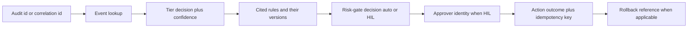

# 운영과 검증(Operating and 검증)

새로 프로비저닝된 배포부터 FDAI가 **살아 있고, 올바르며, 정상 동작 중**인지 어떻게
아는가. 이 문서는 **자체 관측성(self-observability)** : 시스템이 자신에 대해 어떻게 보고하는가.
시스템이 **감시하는 환경에 대해 감지하는 것**인
[observability-and-detection-ko.md](../rules-and-detection/observability-and-detection-ko.md) 와 구별됩니다. 프레젠테이션
/ 대시보드 레이아웃은 이 문서의 범위 밖입니다.

[deploy-and-onboard-ko.md](../deployment/deploy-and-onboard-ko.md) (프로비저닝) 과
[startup-and-lifecycle-ko.md](startup-and-lifecycle-ko.md) (부트스트랩) 보완. Azure 초점:
비-Azure 프로바이더는 TBD
([Always-On 룰](../../../.github/copilot-instructions.md#always-on-rules-must)).

## 자체 헬스 신호(Self-Health Signals)

건강한 배포가 지속적으로 발행해야 하는 신호. 모든 신호는 알림 규칙에 1:1 매핑 (
[Alert 라우팅](#alert-routing) 참조).

| 신호 | 목적 | 잡히는 실패 모드 |
|------|------|----------------|
| **생존 탐색** (컨테이너별) | 컨테이너 프로세스 살아있음 | 비정상 종료 루프 |
| **준비 상태 탐색** (컨테이너별) | 의존성 도달 가능 | Kafka 브로커 / Key Vault 참조 / DB 없이 부팅 |
| **어댑터 healthcheck** (프로바이더 어댑터별) | Kafka 브로커 도달 가능 (Event Hubs `:9093`), Key Vault 참조 해석 가능, Diagnostic-Settings 포워더 건강, OPA에 카탈로그 로드, T2 모델 엔드포인트 도달 가능 | 조용한 의존성 드롭 |
| **Event lag** (ingest부터 첫 티어 결정까지) | 티어별 지연 | 유입 backpressure |
| **DLQ 깊이** (큐/토픽별) | dead-letter 누적 | poison 메시지, 컨슈머 실패 |
| **Cold-start 비율 + 소요 시간** | scale-to-zero 예열 비용 | 데드라인 미스 (HIL로 라우팅) |
| **검증기 실패 비율** | T2 검증기 abstain / fail 비율 | 검증기 정확도 드리프트 |
| **Mixed-model disagreement 비율** | 교차 검사 불일치 | 모델 저하 |
| **Rollback 비율** | 나중에 되돌린 액션 | 잘못 조정된 규칙이나 액션 |
| **재정의 비율** | 규칙당 재정의 생성/수정 | 잘 맞지 않는 규칙 (발견 루프에 공급) |
| **발견 루프 통과 비율** | 후보 → quality 게이트 통과 % | 루프 드리프트 |
| **비상 정지 상태** | on / off | 억제된 비상 자세 |
| **Canary 결과** | 합성 루프 왕복 | 조용한 유입 사망 |
| **시간 since last successful canary** | 신선도 | 모니터의 모니터 |

> **구현 상태**: 전이 텔레메트리와 synthetic canary 발행기, 소비자, 감사 경로,
> deploy-time 발행기 smoke가 구현되어 있습니다. 전체 신호 내보내기 도구, alert-rule 대응,
> audit-freshness SLO 및 scheduled operational 훈련은 운영 준비 상태 작업으로 남아 있습니다.
> 이 표는 필요한 상태 계약이며 모든 alert가 현재 provision되었다는 뜻은 아닙니다.

### 시작 준비 상태 대응

프로세스가 응답할 수 있는지는 `/live`로 확인하고 이벤트를 처리할 수 있는지는 `/ready`로
확인합니다. `503` 응답은 process-critical 시작 탐색이 누락된, stale, timed out, crashed
또는 실패한 상태임을 뜻합니다. `/ready`가 닫힌 동안 소비자나 Pantheon을 수동으로 다시 시작하지
않는 것이 좋습니다.

1. StateStore 키 `runtime:startup-readiness:latest`에서 정제된 최신 보고를 읽습니다. 먼저
 `decision`, `missing_probe_ids`, `stale_probe_ids` 및 각 결과의 `failure_class`를 확인합니다.
2. 결정 변경을 `startup_readiness.transition` 감사 기록 및 스키마로 검증한
 `readiness_transition` 이벤트와 연관시킵니다. Publish 실패에는 별도
 `startup_readiness.transition_publish_failed` 감사 기록이 있습니다.
3. 이름이 지정된 의존성 또는 기능을 FDAI 프로세스 밖에서 복구합니다. 프로바이더 오류
 텍스트, 엔드포인트 값, 토큰 또는 customer 식별자를 보고나 운영자 note에 넣지 않습니다.
4. 구성된 주기적 새로 고침을 기다립니다. 복구된 process-critical 탐색은 `/ready`를 다시 열고
 guarded 워커를 재시작합니다. 복구된 기능은 배포 승격 상태보다 권한을
 높이지 않습니다.

`degraded`이면 `/ready`는 열어 두되 `authority_ceilings`를 확인합니다. `shadow`,
`human_approval`, `deterministic_fallback` 및 `disabled`는 예상된 안전 대응이며 quality 게이트 또는
승격 레지스트리를 우회할 권한이 아닙니다. 탐색 예산과 registered-destination 계약은
[startup-and-lifecycle-ko.md](startup-and-lifecycle-ko.md#제공되는-runtime-경계)를 참조하세요.

신호는 OpenTelemetry로 설정된 백엔드로 발행
([deployment-ko.md#observability-slos-and-alerting](../deployment/deployment-ko.md#observability-slos-and-alerting)).

`OTEL_EXPORTER_OTLP_ENDPOINT`는 OTLP/gRPC 추적 및 메트릭 내보내기를 활성화합니다. Loopback 밖에서는
HTTPS가 필수이며 엔드포인트의 자격 증명, 조회 문자열, 조각은 거부됩니다. 엔드포인트가 없으면
로컬 콘솔 구간 및 in-memory 메트릭이 기본값으로 유지됩니다.

채널, 확장, 모델, 스케줄러, security 수명 주기 컴포넌트는 process-singleton emitter를 통해
같은 `fdai.transition` 구간 및 `fdai.transition.count` 메트릭을 발행합니다. 속성은 범위가 제한된
허용 목록에 있는 도메인, 이름, 결과, component-specific scalar 키를 사용하며 프로바이더 오류 텍스트,
페이로드, 자격 증명, arbitrary 라벨은 허용되지 않습니다. Emission은 최선 노력이므로 내보내기 도구
실패가 라우팅 또는 안전성 결정을 차단할 수 없습니다.

## 합성 카나리 이벤트(Synthetic Canary Event)

대부분 이벤트 기반으로 동작하는 시스템에는 **이벤트가 도착하지 않음 -> 정상처럼 보임**이라는
조용한 실패 모드가 있습니다. 별도로 권한을 부여한 토픽의 주기적 canary로 완화합니다.

- **합성 이벤트**는 Container Apps 작업에서 5분마다 같은 Event Hubs 이름 공간의
 `aw.control.canary`로 게시됩니다.
- 전용 UAMI는 이미지를 pull하고 Event Hubs에 전송할 수만 있습니다. 코어의 별도 canary 소비자는
 `source=fdai.canary-job`과 `event_type=fdai.control.canary`만 허용합니다.
- Canary 경로는 ingest, 경로, 감사 단계와 no-op 감사 항목을 기록합니다. T0/T1/T2, risk 게이트,
 실행, IRP, learning 루프에는 진입하지 않습니다.
- **전체 루프** - `ingest → correlation → tier decision → audit entry` - 이 범위가 제한된 예산 내에
 완료되어야 함; 완료 실패는 [operational 라인](#alert-routing) 에서 SLO-burn 알림 발동.
- 카나리는 **버전됨**, **속도 상한**, 멱등성 키가 실제 이벤트와 구별되어 카나리 샘플이
 회귀 측정이나 자율 발견 루프의 observe 스테이지를 오염시킬 수 없음.
- 각 5분 자리는 고정된 UUID와 `canary:<slot>` 멱등성 키를 생성합니다. Container Apps는
 발행기 실행을 120초로 제한하고 감사 행은 측정된 지연 시간을 기록합니다.

> 배포 작업 흐름은 즉시 실행한 canary 발행기가 실패하면 차단됩니다. 감사 최신성 차단
> 조회, 수치형 왕복 SLO, 예약된 비상 정지 on/off 훈련은 production-readiness 근거로
> 남아 있습니다.

## Post-Deploy Smoke 테스트 계약

목표 자동화 모음은 모든 승격 후 라이브 배포에 대해 실행됩니다. 실패한 smoke 테스트는 **승격을
중단하고 트래픽을 롤백**하는 것이 좋습니다
([deployment-ko.md#release-and-rollback](../deployment/deployment-ko.md#release-and-rollback)).

1. **어댑터 도달성** - Kafka 왕복 (Event Hubs `:9093` 프로브 토픽에 produce + consume),
 Key Vault 참조 해석, 탐색 테이블에 DB 쓰기 + 삭제,
 T2 모델 엔드포인트 저비용 ping (모델별, 교차 검사 대상 포함).
2. **구성 로드** - 배포된 이미지가 자신의 버전, 카탈로그 참조, 구성 해시를 보고; 값들이
 예상 릴리스 매니페스트와 일치.
3. **카나리 왕복** - 하나의 합성 이벤트 발사, 감사 엔트리가 예산 내에 랜딩 검증.
4. **그림자 결정 정확성** - 대표 이벤트 픽스처 세트를 그림자 모드로 공급; 판정이 golden 기대와
 일치 (회귀 스위트).
5. **비상 정지 검사** - 비상 정지 **on** 토글, 윈도우 동안 모든 액션이 abstain 검증
 (카나리로 프로빙); **off** 토글, 정상 결정 재개 검증. 두 상태 모두 감사 엔트리를 남김.
6. **HIL 예행 실행** - 합성 고위험 발견 사항이 HIL 채널로 라우팅, 승인자가 승인(실행하지 않는
 예행 실행 실행 장치에서), 감사 트레일이 두 홉 모두 기록.

현재 적용 작업 흐름은 스키마 이행, 선택적 HTTP 상태 엔드포인트, 성공한 canary 발행기
작업을 검증합니다. 전체 감사 round-trip, 고정본 재생, 비상 정지 훈련, HIL 예행 실행은 운영
승격 전에 여전히 필요합니다.

## Alert 라우팅

두 독립적인 라인, 각각 소유자와 채널. 구체적 채널 이름/소유권 매트릭스는 포크 책임. 채널
선택, 신뢰 티어링, 대체 경로 규칙은
[channels-and-notifications-ko.md](../interfaces/channels-and-notifications-ko.md) 에 정의; 이 섹션은 그
모델의 알림-측 뷰.

| 라인 | 신호 소스 | 라우트 |
|------|-----------|--------|
| **Operational** | SLO burn, DLQ 깊이, 검증기 실패율, cold-start 데드라인 미스, 어댑터 불건강, canary miss, IaC 표류, 시크릿 만료 임박 | on-call 로테이션 (paging 채널) |
| **HIL** | 고위험 발견 사항, enforce-promotion 요청, 재정의 요청, exemption-expiry 경고, break-glass 요청 | Teams HIL 채널 |

모든 알림에 적용되는 규칙:

- 알림은 **actionable** 해야 함: 각 알림은 (a) 대시보드 패널, (b) 런북, (c) 해당하면 상관
 감사 id에 링크.
- **De-duplication**:
 [observability-and-detection-ko.md](../rules-and-detection/observability-and-detection-ko.md) 의 상관관계 규칙에
 따라 상관된 알림은 접힘; 한 근원의 알림 폭풍은 여러 페이지가 아니라 하나의 페이지.
- **대체 경로 채널**: 주 채널(Teams / paging) 도달 불가 시 HIL 항목은 상태 저장소에 큐잉되고
 보조 채널로 알림; 대체 경로 경로에서 auto-execute 없음.

> **열림 결정**: 구체적인 channel-ownership 매트릭스와 대체 경로 채널을 포크별로 선택합니다.

## 감사 조사 흐름

상관 id 또는 감사 id를 주면 운영자가 고정 경로를 걷습니다. 각 홉은 검색이 아니라 **쓰기
시점에 캡처된 저장 링크** - 왕복은 O(1) 조회.

감사 기록은 [security-and-identity-ko.md](../architecture/security-and-identity-ko.md) 에 따라 추가 전용이며
hash-chain됨; 같은 워크는 그림자와 강제 적용 이벤트에 대해 동작(모드가 모든 엔트리에 기록됨).

## 런북 세트

모든 자동 액션에는 운영자 대상 런북이 있는 것이 좋습니다. 상류는 `docs/runbooks/` 아래에
제네릭 운영 런북을 제공합니다. 배포별 값과 절차는
[generic-scope.instructions.md](../../../.github/instructions/generic-scope.instructions.md)에 따라
fork-local 런북 세트에 유지합니다. 저장소는 아직 ActionType별 런북 존재 여부 또는 필수 섹션
스키마를 강제하지 않습니다.

| 런북 | 목적 | 트리거 |
|------|------|--------|
| **비상 정지 훈련** | 모든 auto-execution 중단, 모든 경로가 abstain 검증 | 운영 인시던트, 스케줄 드릴 |
| **DLQ 배출** | dead-lettered 이벤트 검사, 리플레이, 또는 폐기 (idempotency-key 가드 포함) | DLQ 깊이 알림 |
| **표류 조정** | IaC 표류를 PR로 조정 (조용한 적용 없음) | 스케줄 표류 알림 |
| **애플리케이션 롤백** | 이전 컨테이너 개정 번호로 트래픽 시프트 | SLO burn, 에러 스파이크, smoke-test 실패 |
| **액션 롤백** | 액션당 변경 되돌리기(git revert, 스냅샷 복원, replica-promotion undo) | 롤백 요청, auto-demotion |
| **DR 장애 조치** | 상태 + 백업으로부터 컨트롤 플레인을 대체 리전으로 실패 이관 | 리전 장애 |
| **재정의 철회** | 활성 재정의 제거, 해당 스코프의 기저 규칙 재활성화 | 규칙 개정, 리스크 변경 |
| **카탈로그 롤백** | 이전 rule-catalog 버전으로 되돌리기 | 나쁜 규칙 세트 승격 |
| **Break-glass** | 감사 + 자동 만료 하에 범위된 비상 접근 부여 | 검증된 비상 |

모든 런북이 명시해야 하는 것:

- **전제조건** (권한, 선행 알림).
- **정확한 명령** (또는 정확한 콘솔 네비게이션), copy-paste 가능.
- **검증** (동작했음을 증명하는 무엇을 확인).
- **런북 자체의 롤백** (운영자 스텝의 undo).
- 런북이 남기는 **감사 트레일**.

> **열림 결정**: 런북 필수 섹션 스키마와 ActionType 커버리지 게이트를 정의합니다.

## 버전과 설정 노출

시스템은 언제든 특별 접근 없이 기계-읽기·사람-읽기 가능하게 노출해야 함:

- 배포된 이미지 **다이제스트** 와 의미 버전 태그.
- 규칙 카탈로그 **버전 태그 + 컨텐트 해시**.
- **구성 해시** (라이브 런타임 설정에 대한 안정 합; 시크릿 제외).
- 규칙별 **효과 + 적용 플래그** - 각 규칙/스코프에 대해 "지금 무엇이 강제 적용 되는가".
- 스코프별 **재정의 카운트** (리스트 뷰에 링크).
- **자율 발견 루프 상태** (활성/비활성, 마지막 사이클 타임스탬프, 마지막 사이클 통과율).
- **마지막 성공 카나리** 이후 경과 시간.
- **비상 정지 상태** 와 현재 윈도우의 **break-glass 사용**.

컨텐트만; 프레젠테이션 / 대시보드 레이아웃은 별도 정의.

## 오픈 전 검증 (성능 + 통합)

서비스 오픈 전, FDAI는 감시할 워크로드의 **성능 / 통합 테스트와 나란히 그림자로**
실행할 때 가장 유용하다. FDAI가 부하를 생성하지는 않고 - 외부 부하 생성기(Azure 부하
Testing, k6, JMeter)가 트래픽을 만든다 - 그 트래픽이 도는 동안 제어 평면은 실행 없이
현실적인 조건에서 감지와 판정을 증명한다:

- **실부하 하 그림자 판정.** 새 룰 과 액션 은 judge-and-log 만 수행하므로
 ([architecture.instructions.md § 그림자 -> 강제 적용](../../../.github/instructions/architecture.instructions.md#safety-invariants)),
 부하 테스트가 결정론적 계층 와 T2 quality 게이트 를 exercise 하고 모든 판정 는
 기록되되 실행되지 않는다.
- **예산 대비 감지 지연 측정.** 부하가 만든 이벤트가 계층 별 `LatencyBudgetMonitor`
 ([`core/measurement/latency_budget.py`](../../../services/core-control-plane/src/fdai/core/measurement/latency_budget.py))
 에 공급되어, 부하 하에서 p95 예산을 놓치는 계층 가 go-live 후가 아니라 전에 드러난다.
- **canary + smoke 왕복.** [합성 canary](#synthetic-canary-event) 와
 [post-deploy smoke 테스트](#post-deploy-smoke-tests) 가 로드된 환경에서 전체
 `ingest -> tier -> gate -> audit` 루프가 예산 내에 완료됨을 확인한다.
- **시나리오 재생.** `tools/baseline_run.py` 가 동결 시나리오 세트
 ([goals-and-metrics-ko.md](../architecture/goals-and-metrics-ko.md)) 를 재생해
 라우팅과 auto-vs-HIL 정확도를 ship 될 바로 그 빌드에서 정량화한다.

결과는 그림자 증거 뭉치 - 정확도, 지연, 정책 위반 escape 0 - 이며, 오퍼레이터는
어떤 액션 을 그림자 에서 강제 적용 로 승격하기 **전에** 이를 검토한다.

## Azure read-investigation release 근거

실제 운영 검사는 기존 리소스와 읽기 담당 자격 증명을 사용합니다. Azure 리소스를 생성, 갱신,
시작, stop 또는 삭제하지 않습니다. 실제 운영 구독에서 안전하게 유도할 수 없는 실패 경로는
customer-neutral synthetic 페이로드를 사용하는 저장소 테스트로 검증합니다.

| 시나리오 | 근거 등급 | 결과 |
|----------|----------------|------|
| Successful 호출자 귀속 | 실제 운영 | 통과했습니다. Exact 해석 및 projected Activity Log 읽기가 user와 service-principal 행위자를 일치했으며 opaque 행위자 및 상관관계 참조만 유지했습니다. |
| Resource Health | 실제 운영 | 통과했습니다. 비어 있는 ARG 변환 결과가 현재 Resource Health REST 엔드포인트로 대체 경로하여 정규화된 가용성 근거를 반환했습니다. |
| 승인되지 않은 범위 | 실제 운영 | 통과했습니다. 접근할 수 없는 범위가 실패한 범위가 제한된 증적과 함께 `unavailable`로 변환되었습니다. |
| 모호한 리소스 이름 | 실제 운영 | 통과했습니다. 중복 이름 하나가 범위가 제한된 후보 4개, exact 리소스 연결 없음 및 이력 조회 없음으로 반환되었습니다. |
| 게스트 OS 종료 | 실제 운영 및 계약 | 완료되지 않았습니다. 접근 가능한 workspace 16개에는 available 이력 전체에서 retained Event 또는 Syslog 종료 기록이 없었습니다. 실제 운영 missing-workspace 행동은 `unavailable`을 반환했고 matched Event 및 Syslog 정규화는 계약 테스트만 통과했습니다. |
| 프로바이더 throttling | 계약 | 동작은 통과했습니다. Synthetic `429` 응답이 범위가 제한된 재시도 및 최종 실패를 검증했습니다. Deliberate throttling은 bounded-read 정책을 위반하므로 실제 실제 운영 `429`는 유도하지 않았습니다. |
| 보존 부족 | 계약 | 통과했습니다. 구성된 Activity Log 또는 guest-log 보존을 넘는 조회 구간은 HTTP 전에 실패하고 프로바이더 경계에서 사용 불가로 normalize됩니다. |

완료되지 않은 guest-event 행과 자연스럽게 발생한 실제 운영 `429` 부재는 구현 defect가 아니라
release 근거로 남습니다. Dedicated 검증 환경이 Azure 변경 없이 해당 관측을
제공할 때까지 issue를 열림 상태로 유지합니다.

## 오픈 후 안정화 윈도우(Stabilization 구간)

서비스 오픈 후, FDAI는 처음 며칠 동안 관찰 강도를 높여 **켜 두었을 때** 가장 유용하다 -
안정화 윈도우다. 이는 별도 모드가 아니라 30일
[측정 윈도우](../architecture/goals-and-metrics-ko.md#definitions) 의 선단이며, 기존
프리미티브를 조합한다:

> **구현 상태**: 스케줄러와 측정 기본 요소는 존재하지만 업스트림은 현재 daily
> 상태/표류/deployment-baseline 작업을 등록하거나 `console.recurrent_query`를 publish하지 않습니다.
> 아래 bullet은 목표 stabilization 조립을 정의합니다.

- **Shadow-first 가 기본 유지.** 새로 도입된 액션 은 윈도우 동안 그림자 로 남고,
 아래 안정화 신호가 깨끗해질 때까지 강제 적용 승격을 미룬다 - 불안정한 오픈이 절대
 auto-execute 하지 않는다.
- **기준선 대비 스케줄 비교.** 스케줄 태스크([`core/scheduler`](../../../services/core-control-plane/src/fdai/core/scheduler))
 가 daily 상태 검사, 구성 드리프트 차이, 배포 검증을 문서화된 기준선(지식
 베이스에 업로드된 **리소스 플랜** 포함) 대비 수행한다 - 오픈 직후 오퍼레이터가 원하는
 "기준선 과 비교" 검사 그대로다.
- **실트래픽에서 패턴 승격.** Month-1 관찰 도구와 `console.recurrent_query` 신호
 ([operator-console-ko.md § 9.3](../interfaces/operator-console-ko.md)) 가 반복된 조사를
 룰 후보로 바꾸어, 오픈이 실제로 드러낸 것으로부터 카탈로그가 성장한다.
- **guard-metric 밀착 감시.** guard-metric 드리프트
 ([goals-and-metrics-ko.md § 가드 메트릭](../architecture/goals-and-metrics-ko.md#guard-metrics-must-not-regress))
 를 윈도우 내내 밀착 감시한다; breach 는 자동으로 그림자 로 강등한다. 신호가
 안정되면 정상 주기로 돌아간다.

윈도우는 시끄러운 오픈 구간을 최소한의 사람 개입으로 흡수하고, 안정화 신호가 유지되면
정상 운영으로 인계한다.

## 열림 Decisions

- [ ] 합성 카나리 audit-freshness 및 수치형 round-trip alert 예산. 발행기 cadence는 기본
 5분이고 정본 페이로드/멱등성 형태는 구현되어 있습니다.
- [ ] Smoke-테스트 스위트 구성(픽스처 세트, 스텝별 예산, 승격-게이트 배선).
- [ ] 알림 채널 소유권 매트릭스(포크 vs 상류) 와 대체 경로 채널 선택.
- [ ] 런북 템플릿 - 필수 섹션, 포맷, 모든 자동 액션에 런북 존재 여부 CI 검사.
- [ ] 감사 조사 흐름을 위한 보존 윈도우와 쿼리 모델.
- [ ] Cold-start 데드라인 값
  ([startup-and-lifecycle-ko.md](startup-and-lifecycle-ko.md#cold-start-scale-to-zero-specifics) 와 공유).
- [ ] 오픈 후 안정화 윈도우 길이(기본 "며칠") 와 이를 종료시키는 구체적 안정화 신호
  (guard-metric 정지, canary 연속 성공, 시나리오 재생 통과).
- [ ] 오픈 전 부하 테스트 통합 표면(어느 부하 생성기, 부하 하에서 assert 할 계층 별
  지연 예산).
