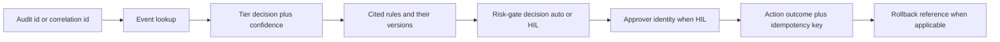

# Operating and Verification

How to know FDAI is **alive, correct, and behaving** - from a freshly provisioned
deployment onward. This document is **self-observability**: how the system reports on
itself. It is distinct from
[observability-and-detection.md](../rules-and-detection/observability-and-detection.md), which is what the system
**detects about the environment it watches**. Presentation / dashboard layout is out of scope
for this document.

Complements [deploy-and-onboard.md](../deployment/deploy-and-onboard.md) (provisioning) and
[startup-and-lifecycle.md](startup-and-lifecycle.md) (bootstrap). Azure focus: non-Azure
providers are TBD (see
[Implementation Focus](../../../.github/copilot-instructions.md#implementation-focus-must)).

## Self-Health Signals

Signals a healthy deployment MUST emit continuously. Every signal maps 1:1 to an alert rule
(see [Alert Routing](#alert-routing)).

| Signal | Purpose | Failure mode caught |
|--------|---------|---------------------|
| **Liveness probe** (per container) | container process alive | crash loop |
| **Readiness probe** (per container) | dependencies reachable | boot without Kafka broker / Key Vault reference / DB |
| **Adapter healthcheck** (per provider adapter) | Kafka broker reachable (Event Hubs `:9093`), Key Vault reference resolvable, Diagnostic-Settings forwarders healthy, catalog loaded in OPA, T2 model endpoints reachable | silent dependency drop |
| **Event lag** (ingest to first tier decision) | per-tier latency | ingress backpressure |
| **DLQ depth** (per queue / topic) | dead-letter accumulation | poison message, consumer failure |
| **Cold-start rate + duration** | scale-to-zero warm-up cost | deadline misses (routes to HIL) |
| **Verifier failure rate** | T2 verifier abstain / fail rate | drift in verifier accuracy |
| **Mixed-model disagreement rate** | cross-check disagreement | model degradation |
| **Rollback rate** | actions later reverted | miscalibrated rules or actions |
| **Override rate** | override create / modify per rule | poor-fit rules (feeds the discovery loop) |
| **Discovery loop pass rate** | candidate → quality gate pass % | loop drift |
| **Kill-switch state** | on / off | contained emergency posture |
| **Canary result** | synthetic loop round-trip | silent ingress death |
| **Time since last successful canary** | staleness | monitor of the monitor |

Signals emit via OpenTelemetry to the configured backend
([deployment.md#observability-slos-and-alerting](../deployment/deployment.md#observability-slos-and-alerting)).

## Synthetic Canary Event

A scale-to-zero, event-driven system has a specific silent failure mode: **no events arrive →
looks healthy**. Mitigation: a periodic canary.

- A **synthetic event** with a known payload is emitted on a fixed cadence from a canary
  service into the same event bus a real event uses.
- The canary event carries a marker so the **risk gate always short-circuits it to a no-op
  audit entry** - it never mutates any resource.
- The **full loop** - `ingest → correlation → tier decision → audit entry` - MUST complete
  within a bounded budget; a failure to complete raises an SLO-burn alert on the
  [operational lane](#alert-routing).
- The canary is **versioned**, **rate-capped**, and its idempotency key is distinguishable
  from a real event's so canary samples cannot corrupt regression measurement or the
  autonomous discovery loop's observe stage.
- The canary MUST be exercised in **kill-switch on** and **kill-switch off** states so the
  kill-switch itself stays proven.

**TBD**: canary cadence, exact payload shape, and round-trip budget.

## Post-Deploy Smoke Tests

Automated tests run against the live deployment after every promotion. A failing smoke test
**aborts the promotion and rolls traffic back**
([deployment.md#release-and-rollback](../deployment/deployment.md#release-and-rollback)).

1. **Adapter reachability** - Kafka round-trip (Event Hubs `:9093` produce + consume on a
   probe topic), Key Vault reference resolution, DB write + delete on a probe table, T2 model
   endpoint low-cost ping (per model, including cross-check target).
2. **Config load** - the deployed image reports its version, catalog ref, and config hash;
   values match the expected release manifest.
3. **Canary round-trip** - fire one synthetic event, verify the audit entry lands within
   budget.
4. **Shadow decision correctness** - a fixture set of representative events is fed in shadow
   mode; verdicts match golden expectations (regression suite).
5. **Kill-switch check** - toggle kill-switch **on**, verify all actions abstain during the
   window (probing with the canary); toggle **off**, verify normal decisions resume. Both
   states leave audit entries.
6. **HIL dry-run** - a synthetic high-risk finding is routed to the HIL channel, an approver
   approves (in a dry-run harness that does not execute), the audit trail records both hops.

**TBD**: fixture composition, per-step budgets, and the promotion-gate wiring.

## Alert Routing

Two independent lanes, each with an owner and a channel. Concrete channel names / ownership
matrix is fork responsibility. Channel selection, trust tiering, and fallback rules are
defined in [channels-and-notifications.md](../interfaces/channels-and-notifications.md); this section is
the alert-side view of that model.

| Lane | Signal source | Route |
|------|---------------|-------|
| **Operational** | SLO burn, DLQ depth, verifier failure rate, cold-start deadline miss, adapter unhealthy, canary miss, IaC drift, secret near expiry | on-call rotation (paging channel) |
| **HIL** | high-risk finding, enforce-promotion request, override request, exemption-expiry warning, break-glass request | Teams HIL channel |

Rules that apply to every alert:

- Alerts MUST be **actionable**: each alert links to (a) its dashboard panel, (b) its
  runbook, (c) the correlated audit id if applicable.
- **De-duplication**: correlated alerts collapse per the correlation rules in
  [observability-and-detection.md](../rules-and-detection/observability-and-detection.md); an alert storm from one
  root cause is one page, not many.
- **Fallback channel**: if the primary channel (Teams / paging) is unreachable, HIL items
  queue in the state store and alert via a secondary channel; nothing auto-executes on the
  fallback path.

**TBD**: the concrete channel-ownership matrix and the fallback channel selection.

## Audit Investigation Flow

Given a correlation id or audit id, the operator walks a fixed path. Each hop is a **stored
link captured at write time**, not a search - the walk is O(1) lookups.

The audit record is append-only and hash-chained per
[security-and-identity.md](../architecture/security-and-identity.md); the same walk works for shadow and
enforce events (mode is recorded on every entry).

## Runbook Set

Every automated action has an operator-facing runbook. Runbooks live in a **fork-local**
`runbooks/` folder (not committed upstream, per
[generic-scope.instructions.md](../../../.github/instructions/generic-scope.instructions.md)).
Upstream ships the **runbook template + required sections**; the concrete text is authored
per fork.

| Runbook | Purpose | Trigger |
|---------|---------|---------|
| **Kill-switch drill** | halt all auto-execution, verify all paths abstain | operational incident, scheduled drill |
| **DLQ drain** | inspect, replay, or discard dead-lettered events (with idempotency-key guards) | DLQ depth alert |
| **Drift reconciliation** | reconcile IaC drift via a PR (never silent apply) | scheduled drift alert |
| **Application rollback** | shift traffic back to the previous container revision | SLO burn, error spike, smoke-test fail |
| **Action rollback** | revert a per-action change (git revert, snapshot restore, replica-promotion undo) | rollback request, auto-demotion |
| **DR failover** | fail the control plane to an alternate region from state + backups | region outage |
| **Override withdrawal** | remove an active override, re-enable the underlying rule on that scope | rule revised, risk changed |
| **Catalog rollback** | revert to the previous rule-catalog version | bad rule set promoted |
| **Break-glass** | grant scoped emergency access under audit + auto-expiry | verified emergency |

Every runbook MUST state:

- **Preconditions** (permissions, prerequisite alerts).
- **Exact commands** (or the exact console navigation), copy-pasteable.
- **Verification** (what to check that proves it worked).
- **Rollback of the runbook itself** (undo of the operator step).
- The **audit trail** the runbook leaves.

**TBD**: the runbook template and its required-sections schema.

## Version and Configuration Exposure

The system MUST expose, at any time, machine- and human-readable, without special access:

- Deployed image **digest** and semantic version tag.
- Rule catalog **version tag + content hash**.
- **Config hash** (a stable sum over live runtime configuration; secrets excluded).
- Per-rule **effect + enforcement flag** - "what is currently enforced" for each rule /
  scope.
- Per-scope **override count** (linked to a list view).
- **Autonomous discovery loop state** (enabled / disabled, last cycle timestamp, last cycle
  pass rate).
- **Time since last successful canary** round-trip.
- **Kill-switch state** and **break-glass usage** in the current window.

Content only; presentation / dashboard layout is defined separately.

## Pre-Launch Verification (performance + integration)

Before a service opens, FDAI is most useful run **in shadow alongside a
performance / integration test** of the workload it will watch. FDAI does not
generate the load - an external load generator (Azure Load Testing, k6,
JMeter) drives the traffic - but while that traffic runs, the control plane
proves its detection and judgment against realistic conditions without acting:

- **Shadow judgment under real load.** New rules and actions run judge-and-log
  only ([architecture.instructions.md § Shadow -> Enforce](../../../.github/instructions/architecture.instructions.md#safety-invariants)),
  so the load test exercises the deterministic tiers and the T2 quality gate
  and every verdict is recorded, none executed.
- **Detection latency measured against budget.** The events the load generates
  feed the per-tier `LatencyBudgetMonitor`
  ([`core/measurement/latency_budget.py`](../../../src/fdai/core/measurement/latency_budget.py)),
  so a tier that misses its p95 budget under load surfaces before go-live, not
  after.
- **Canary + smoke round-trip.** The [synthetic canary](#synthetic-canary-event)
  and the [post-deploy smoke tests](#post-deploy-smoke-tests) confirm the full
  `ingest -> tier -> gate -> audit` loop completes within budget on the loaded
  environment.
- **Scenario replay.** `tools/baseline_run.py` replays the frozen scenario set
  ([goals-and-metrics.md](../architecture/goals-and-metrics.md)) so routing and
  auto-vs-HIL accuracy are quantified on the same build that will ship.

The result is a body of shadow evidence - accuracy, latency, zero
policy-violation escapes - that an operator reviews **before** promoting any
action from shadow to enforce.

## Post-Launch Stabilization Window

After a service opens, FDAI is most useful **left running for the first few
days** at a heightened observation intensity - the stabilization window. It is
the leading edge of the 30-day
[measurement window](../architecture/goals-and-metrics.md#definitions), not a
separate mode, and it composes existing primitives:

- **Shadow-first stays the default.** Newly introduced actions remain in shadow
  through the window; promotion to enforce waits until the stabilization
  signals below are clean, so an unstable opening never auto-executes.
- **Scheduled comparison to baseline.** Scheduled tasks
  ([`core/scheduler`](../../../src/fdai/core/scheduler)) run daily health
  checks, configuration-drift diffs, and deployment verification against a
  documented baseline (including an uploaded **resource plan** in the knowledge
  base) - exactly the "compare to baseline" checks the operator wants right
  after launch.
- **Pattern promotion from real traffic.** The Month-1 observation tools and
  the `console.recurrent_query` signal ([operator-console.md § 9.3](../interfaces/operator-console.md))
  turn a repeated investigation into a rule candidate, so the catalog grows
  from what the launch actually surfaced.
- **Close guard-metric watch.** Guard-metric drift
  ([goals-and-metrics.md § Guard Metrics](../architecture/goals-and-metrics.md#guard-metrics-must-not-regress))
  is watched tightly through the window; a breach demotes back to shadow
  automatically. When the signals settle, operation returns to the normal
  cadence.

The window absorbs the noisy opening period with minimal human intervention,
then hands off to steady-state operation once stabilization signals hold.

## Open Decisions

- [ ] Synthetic canary cadence, payload shape, and round-trip budget.
- [ ] Smoke-test suite composition (fixture set, per-step budgets, promotion-gate wiring).
- [ ] Alert channel ownership matrix (fork vs upstream) and the fallback channel selection.
- [ ] Runbook template - required sections, format, and CI check that a runbook is present
      for every automated action.
- [ ] Retention window and query model for the audit investigation flow.
- [ ] Cold-start deadline value (shared with
      [startup-and-lifecycle.md](startup-and-lifecycle.md#cold-start-scale-to-zero-specifics)).
- [ ] Stabilization-window length after launch (default "a few days") and the
      concrete stabilization signals that end it (guard-metric quiescence,
      canary streak, scenario-replay pass).
- [ ] Pre-launch load-test integration surface (which load generator, what
      per-tier latency budgets to assert under load).
