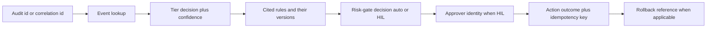

# Operating and Verification

How to know FDAI is **alive, correct, and behaving** - from a freshly provisioned
deployment onward. This document is **self-observability**: how the system reports on
itself. It is distinct from
[observability-and-detection.md](../rules-and-detection/observability-and-detection.md), which is what the system
**detects about the environment it watches**. Presentation / dashboard layout is out of scope
for this document.

Complements [deploy-and-onboard.md](../deployment/deploy-and-onboard.md) (provisioning) and
[startup-and-lifecycle.md](startup-and-lifecycle.md) (bootstrap). Azure focus: non-Azure
providers are TBD (see
[Always-On Rules](../../../.github/copilot-instructions.md#always-on-rules-must)).

## Self-Health Signals

Signals a healthy deployment MUST emit continuously. Every signal maps 1:1 to an alert rule
(see [Alert Routing](#alert-routing)).

| Signal | Purpose | Failure mode caught |
|--------|---------|---------------------|
| **Liveness probe** (per container) | container process alive | crash loop |
| **Readiness probe** (per container) | dependencies reachable | boot without Kafka broker / Key Vault reference / DB |
| **Adapter healthcheck** (per provider adapter) | Kafka broker reachable (Event Hubs `:9093`), Key Vault reference resolvable, Diagnostic-Settings forwarders healthy, catalog loaded in OPA, T2 model endpoints reachable | silent dependency drop |
| **Event lag** (ingest to first tier decision) | per-tier latency | ingress backpressure |
| **DLQ depth** (per queue / topic) | dead-letter accumulation | poison message, consumer failure |
| **Cold-start rate + duration** | scale-to-zero warm-up cost | deadline misses (routes to HIL) |
| **Verifier failure rate** | T2 verifier abstain / fail rate | drift in verifier accuracy |
| **Mixed-model disagreement rate** | cross-check disagreement | model degradation |
| **Rollback rate** | actions later reverted | miscalibrated rules or actions |
| **Override rate** | override create / modify per rule | poor-fit rules (feeds the discovery loop) |
| **Discovery loop pass rate** | candidate → quality gate pass % | loop drift |
| **Kill-switch state** | on / off | contained emergency posture |
| **Canary result** | synthetic loop round-trip | silent ingress death |
| **Time since last successful canary** | staleness | monitor of the monitor |

## Implementation status

Runtime health, startup readiness, transition telemetry, and the synthetic canary path are
implemented and covered by focused tests. The deployment smoke currently proves publisher job
completion only; complete alerting, round-trip verification, drills, and stabilization automation
remain incomplete, so no area is claimed as fully operationally validated.

### Implementation scope

| Area | State | Evidence | Notes |
|------|-------|----------|-------|
| Runtime `/live` and `/ready` endpoints plus startup-readiness evaluation, persistence, transitions, and guarded refresh | implemented | [`runtime/health.py`](../../../services/core-control-plane/src/fdai/runtime/health.py), [`runtime/readiness.py`](../../../services/core-control-plane/src/fdai/runtime/readiness.py), [`test_readiness.py`](../../../services/core-control-plane/tests/runtime/test_readiness.py), and [`test_startup_coordinator.py`](../../../services/core-control-plane/tests/core/readiness/test_startup_coordinator.py) | Process-critical failure closes readiness; degraded capabilities lower authority without raising it on recovery. |
| Bounded transition spans and metrics with secure OTLP configuration | implemented | [`transitions.py`](../../../services/core-control-plane/src/fdai/shared/telemetry/transitions.py) and [`test_transition_telemetry.py`](../../../services/core-control-plane/tests/shared/test_transition_telemetry.py) | Stable allowlisted attributes prevent payloads and provider errors from becoming telemetry labels. |
| Synthetic canary publisher, canonical consumer, no-op audit path, and scheduled Container Apps Job | implemented | [`canary_cli.py`](../../../services/core-control-plane/src/fdai/delivery/canary_cli.py), [`_canary.py`](../../../services/core-control-plane/src/fdai/core/control_loop/_canary.py), [`canary_job.tf`](../../../infra/modules/compute/container-apps/canary_job.tf), and focused canary tests | The canary is isolated from T0/T1/T2, risk, execution, incident, and learning paths. |
| Post-deploy promotion smoke | in-progress | [`deploy-dev.yml`](../../../.github/workflows/deploy-dev.yml) runs migrations, optional health checks, and the canary publisher Job | The workflow blocks on publisher failure but doesn't yet verify the consumed audit entry, fixture replay, kill-switch cycle, or human-approval dry-run. |
| Complete self-health exporters, alert-rule mapping, fallback delivery, and operational drills | in-progress | Transition telemetry, readiness, and canary sources above provide a subset of the required signals | No upstream configuration maps every signal in the health contract to an alert threshold, owner lane, fallback, and tested delivery receipt. |
| Correlation-based audit investigation and unified version/configuration exposure | in-progress | [`rule_fire_trace.py`](../../../services/core-control-plane/src/fdai/core/audit/rule_fire_trace.py), [`audit_rca.py`](../../../services/core-control-plane/src/fdai/core/reporting/datasources/audit_rca.py), and runtime state projections | Correlation and reporting primitives exist, but one public read surface doesn't yet expose every version, hash, rule effect, override, canary, kill-switch, and break-glass field listed below. |
| Pre-launch latency measurement and frozen-scenario replay | implemented | [`latency_budget.py`](../../../services/core-control-plane/src/fdai/core/measurement/latency_budget.py), [`baseline_run.py`](../../../tools/baseline_run.py), and focused tests | The primitives produce bounded measurements and release-gate results; an external load generator and deployment-specific budgets remain operator inputs. |
| Live Azure read-investigation scenarios | in-progress | [Azure Read Investigations](../interfaces/azure-read-investigations.md#implementation-status) | Four bounded read-only scenarios passed, while guest-event matching, an actual provider `429`, and cross-service parity receipts remain open release evidence. |
| ActionType operator-runbook schema and coverage | implemented | [`check-action-runbooks.py`](../../../scripts/quality/documentation/check-action-runbooks.py), [`incident-mitigation-and-rollback.md`](../../runbooks/incident-mitigation-and-rollback.md), and [`test_check_action_runbooks.py`](../../../tests/integration/scripts/test_check_action_runbooks.py) | Every shipped ActionType matches exactly one generic upstream runbook whose declared precondition, procedure, verification, rollback, and audit sections exist. Deployment-specific commands remain fork-owned. |
| Post-launch stabilization composition | in-progress | [`core/scheduler/`](../../../services/core-control-plane/src/fdai/core/scheduler) and measurement primitives | The daily health, drift, and deployment-baseline jobs and `console.recurrent_query` signal aren't registered upstream. |

### Implementation history

| Date | State | Change | Evidence | Remaining |
|------|-------|--------|----------|-----------|
| 2026-08-14 | in-progress | Adopted the implementation ledger and separated tested self-observability primitives from incomplete operational evidence; earlier provenance wasn't reconstructed. | Current change; focused readiness, telemetry, canary, latency, and baseline-runner tests cited in the scope table. | Complete deployment round-trip evidence, alert and drill coverage, unified exposure, and stabilization bindings. |
| 2026-08-14 | implemented | Defined the operator-runbook front-matter schema and added CI coverage for every shipped ActionType. | Current change; `check-action-runbooks.py` and `test_check_action_runbooks.py`. | Keep deployment-owned commands and procedures aligned with the same required semantic sections. |

### Remaining work

- [ ] Extend deployment smoke to verify the consumed canary audit entry within a numeric latency
  budget, replay the frozen shadow fixtures, exercise kill-switch on/off, and complete a no-execute
  human-approval dry-run with linked audit receipts.
- [ ] Map every self-health signal to a concrete threshold, owner lane, fallback route, and tested
  delivery receipt, then record the governed operational evidence.
- [ ] Expose the complete version, configuration, rule-effect, override, discovery, canary,
  kill-switch, and break-glass state through one authorized read surface and test field freshness.
- [x] Define a required runbook schema and add a check proving every automated ActionType has a
  generic upstream or deployment-owned runbook with verification and rollback instructions.
- [ ] Register the daily stabilization jobs and recurrent-query signal, then prove the window opens,
  lowers authority on guard-metric breach, and closes only after its configured exit conditions.
- [ ] Complete the live Azure guest-event, provider-throttling, and cross-service parity evidence
  tracked by the Azure read-investigation owner document.

### Startup readiness response

Use `/live` to determine whether the process can answer, and use `/ready` to determine whether it
may process events. A `503` response means a process-critical startup probe is missing, stale,
timed out, crashed, or failed. Don't restart consumers or the Pantheon manually while `/ready`
remains closed.

1. Read the sanitized latest report at the StateStore key
  `runtime:startup-readiness:latest`. Start with `decision`, `missing_probe_ids`,
  `stale_probe_ids`, and each result's `failure_class`.
2. Correlate a decision change with the `startup_readiness.transition` audit record and the
  schema-validated `readiness_transition` event. A publish failure has its own
  `startup_readiness.transition_publish_failed` audit record.
3. Repair the named dependency or capability outside the FDAI process. Avoid placing provider
  error text, endpoint values, tokens, or customer identifiers into the report or an operator
  note.
4. Wait for the configured periodic refresh. A recovered process-critical probe reopens `/ready`
  and restarts guarded workers. A recovered capability does not raise authority above its
  deployment promotion state.

For `degraded`, keep `/ready` open but inspect `authority_ceilings`. `shadow`, `human_approval`,
`deterministic_fallback`, and `disabled` are expected safety responses, not permission to bypass
the quality gate or promotion registry. See
[startup-and-lifecycle.md](startup-and-lifecycle.md#shipped-runtime-boundary) for probe budgets and
the registered-destination contract.

Signals emit via OpenTelemetry to the configured backend
([deployment.md#observability-slos-and-alerting](../deployment/deployment.md#observability-slos-and-alerting)).

`OTEL_EXPORTER_OTLP_ENDPOINT` enables OTLP/gRPC trace and metric export. HTTPS is required outside
loopback; credentials, query strings, and fragments are rejected in the endpoint. Without an
endpoint, local console spans and in-memory metrics remain the default.

Channel, extension, model, scheduler, and security lifecycle components emit the same
`fdai.transition` span and `fdai.transition.count` metric through a process-singleton emitter.
Attributes use bounded allowlisted domain, name, outcome, and component-specific scalar keys;
provider error text, payloads, credentials, and arbitrary labels are not accepted. Emission is
best-effort so exporter failure cannot block routing or safety decisions.

## Synthetic Canary Event

A mostly event-driven system has a specific silent failure mode: **no events arrive -> looks
healthy**. Mitigation: a periodic canary on a separately authorized topic.

- A **synthetic event** is emitted every five minutes from a Container Apps Job into
  `aw.control.canary` on the same Event Hubs namespace.
- A dedicated UAMI can only pull the image and send to Event Hubs. The core's separate canary
  consumer accepts only `source=fdai.canary-job` and `event_type=fdai.control.canary`.
- The canary path records ingest, route, and audit stages plus a no-op audit entry. It never
  enters T0/T1/T2, the risk gate, execution, IRP, or the learning loop.
- The **full loop** - `ingest → correlation → tier decision → audit entry` - MUST complete
  within a bounded budget; a failure to complete raises an SLO-burn alert on the
  [operational lane](#alert-routing).
- The canary is **versioned**, **rate-capped**, and its idempotency key is distinguishable
  from a real event's so canary samples cannot corrupt regression measurement or the
  autonomous discovery loop's observe stage.
- Each five-minute slot derives a stable UUID and `canary:<slot>` idempotency key. Container Apps
  caps publisher execution at 120 seconds and the audit row records measured latency.

> The deployment workflow now blocks when an immediate canary publisher run fails. A blocking
> audit-freshness query, numeric round-trip SLO, and scheduled kill-switch on/off drill remain
> production-readiness evidence items.

## Post-Deploy Smoke Test Contract

The target automated suite runs against the live deployment after every promotion. A failing
smoke test should **abort the promotion and roll traffic back**
([deployment.md#release-and-rollback](../deployment/deployment.md#release-and-rollback)).

1. **Adapter reachability** - Kafka round-trip (Event Hubs `:9093` produce + consume on a
   probe topic), Key Vault reference resolution, DB write + delete on a probe table, T2 model
   endpoint low-cost ping (per model, including cross-check target).
2. **Config load** - the deployed image reports its version, catalog ref, and config hash;
   values match the expected release manifest.
3. **Canary round-trip** - fire one synthetic event, verify the audit entry lands within
   budget.
4. **Shadow decision correctness** - a fixture set of representative events is fed in shadow
   mode; verdicts match golden expectations (regression suite).
5. **Kill-switch check** - toggle kill-switch **on**, verify all actions abstain during the
   window (probing with the canary); toggle **off**, verify normal decisions resume. Both
   states leave audit entries.
6. **HIL dry-run** - a synthetic high-risk finding is routed to the HIL channel, an approver
   approves (in a dry-run harness that does not execute), the audit trail records both hops.

The current apply workflow verifies schema migrations, optional HTTP health endpoints, and a
successful canary publisher Job. Full audit-round-trip, fixture replay, kill-switch drill, and HIL
dry-run remain required before production promotion.

## Alert Routing

Two independent lanes, each with an owner and a channel. Concrete channel names / ownership
matrix is fork responsibility. Channel selection, trust tiering, and fallback rules are
defined in [channels-and-notifications.md](../interfaces/channels-and-notifications.md); this section is
the alert-side view of that model.

| Lane | Signal source | Route |
|------|---------------|-------|
| **Operational** | SLO burn, DLQ depth, verifier failure rate, cold-start deadline miss, adapter unhealthy, canary miss, IaC drift, secret near expiry | on-call rotation (paging channel) |
| **HIL** | high-risk finding, enforce-promotion request, override request, exemption-expiry warning, break-glass request | Teams HIL channel |

Rules that apply to every alert:

- Alerts MUST be **actionable**: each alert links to (a) its dashboard panel, (b) its
  runbook, (c) the correlated audit id if applicable.
- **De-duplication**: correlated alerts collapse per the correlation rules in
  [observability-and-detection.md](../rules-and-detection/observability-and-detection.md); an alert storm from one
  root cause is one page, not many.
- **Fallback channel**: if the primary channel (Teams / paging) is unreachable, HIL items
  queue in the state store and alert via a secondary channel; nothing auto-executes on the
  fallback path.

> **Open decision**: Choose the concrete channel-ownership matrix and fallback channel per fork.

## Audit Investigation Flow

Given a correlation id or audit id, the operator walks a fixed path. Each hop is a **stored
link captured at write time**, not a search - the walk is O(1) lookups.

```mermaid
flowchart LR
    A[Audit id or correlation id] --> B[Event lookup]
    B --> C[Tier decision plus confidence]
    C --> D[Cited rules and their versions]
    D --> E[Risk-gate decision auto or HIL]
    E --> F[Approver identity when HIL]
    F --> G[Action outcome plus idempotency key]
    G --> H[Rollback reference when applicable]
```

The audit record is append-only and hash-chained per
[security-and-identity.md](../architecture/security-and-identity.md); the same walk works for shadow and
enforce events (mode is recorded on every entry).

## Runbook Set

Every automated action should have an operator-facing runbook. Upstream ships generic operational
runbooks under `docs/runbooks/`; deployment-specific values and procedures stay in a fork-local
runbook set per
[generic-scope.instructions.md](../../../.github/instructions/generic-scope.instructions.md).
The `fdai_runbook` front-matter block declares the schema version, covered ActionType patterns, and
the headings that provide preconditions, procedure, verification, rollback, and audit guidance.
`check-action-runbooks.py` fails CI when a shipped ActionType has no runbook, matches more than one
runbook, or a declared required heading is absent.

| Runbook | Purpose | Trigger |
|---------|---------|---------|
| **Kill-switch drill** | halt all auto-execution, verify all paths abstain | operational incident, scheduled drill |
| **DLQ drain** | inspect, replay, or discard dead-lettered events (with idempotency-key guards) | DLQ depth alert |
| **Drift reconciliation** | reconcile IaC drift via a PR (never silent apply) | scheduled drift alert |
| **Application rollback** | shift traffic back to the previous container revision | SLO burn, error spike, smoke-test fail |
| **Action rollback** | revert a per-action change (git revert, snapshot restore, replica-promotion undo) | rollback request, auto-demotion |
| **DR failover** | fail the control plane to an alternate region from state + backups | region outage |
| **Override withdrawal** | remove an active override, re-enable the underlying rule on that scope | rule revised, risk changed |
| **Catalog rollback** | revert to the previous rule-catalog version | bad rule set promoted |
| **Break-glass** | grant scoped emergency access under audit + auto-expiry | verified emergency |

Every runbook MUST state:

- **Preconditions** (permissions, prerequisite alerts).
- **Exact commands** (or the exact console navigation), copy-pasteable.
- **Verification** (what to check that proves it worked).
- **Rollback of the runbook itself** (undo of the operator step).
- The **audit trail** the runbook leaves.

> **Deployment boundary**: The upstream schema and generic procedure are enforced in CI. A fork
> supplies provider commands, exact resource values, and any narrower deployment-owned runbooks.

## Version and Configuration Exposure

The system MUST expose, at any time, machine- and human-readable, without special access:

- Deployed image **digest** and semantic version tag.
- Rule catalog **version tag + content hash**.
- **Config hash** (a stable sum over live runtime configuration; secrets excluded).
- Per-rule **effect + enforcement flag** - "what is currently enforced" for each rule /
  scope.
- Per-scope **override count** (linked to a list view).
- **Autonomous discovery loop state** (enabled / disabled, last cycle timestamp, last cycle
  pass rate).
- **Time since last successful canary** round-trip.
- **Kill-switch state** and **break-glass usage** in the current window.

Content only; presentation / dashboard layout is defined separately.

## Pre-Launch Verification (performance + integration)

Before a service opens, FDAI is most useful run **in shadow alongside a
performance / integration test** of the workload it will watch. FDAI does not
generate the load - an external load generator (Azure Load Testing, k6,
JMeter) drives the traffic - but while that traffic runs, the control plane
proves its detection and judgment against realistic conditions without acting:

- **Shadow judgment under real load.** New rules and actions run judge-and-log
  only ([architecture.instructions.md § Shadow -> Enforce](../../../.github/instructions/architecture.instructions.md#safety-invariants)),
  so the load test exercises the deterministic tiers and the T2 quality gate
  and every verdict is recorded, none executed.
- **Detection latency measured against budget.** The events the load generates
  feed the per-tier `LatencyBudgetMonitor`
  ([`core/measurement/latency_budget.py`](../../../services/core-control-plane/src/fdai/core/measurement/latency_budget.py)),
  so a tier that misses its p95 budget under load surfaces before go-live, not
  after.
- **Canary + smoke round-trip.** The [synthetic canary](#synthetic-canary-event)
  and the [post-deploy smoke tests](#post-deploy-smoke-tests) confirm the full
  `ingest -> tier -> gate -> audit` loop completes within budget on the loaded
  environment.
- **Scenario replay.** `tools/baseline_run.py` replays the frozen scenario set
  ([goals-and-metrics.md](../architecture/goals-and-metrics.md)) so routing and
  auto-vs-HIL accuracy are quantified on the same build that will ship.

The result is a body of shadow evidence - accuracy, latency, zero
policy-violation escapes - that an operator reviews **before** promoting any
action from shadow to enforce.

## Azure read-investigation release evidence

Live checks use existing resources and a reader credential. They do not create, update, start,
stop, or delete an Azure resource. Repository tests use synthetic, customer-neutral payloads for
failure paths that are not safe to induce against a live subscription.

| Scenario | Evidence class | Result |
|----------|----------------|--------|
| Successful caller attribution | Live | Passed. Exact resolution and projected Activity Log reads matched user and service-principal actors while retaining only opaque actor and correlation references. |
| Resource Health | Live | Passed. An empty ARG projection fell back to the current Resource Health REST endpoint and returned normalized availability evidence. |
| Unauthorized scope | Live | Passed. An inaccessible scope became `unavailable` with a failed bounded receipt. |
| Ambiguous resource name | Live | Passed. One duplicate name returned four bounded candidates, no exact resource binding, and no history query. |
| Guest OS shutdown | Live and contract | Incomplete. Sixteen accessible workspaces contained no retained Event or Syslog shutdown record across their available history. Live missing-workspace behavior returned `unavailable`; matched Event and Syslog normalization passed contract tests only. |
| Provider throttling | Contract | Behavior passed. Synthetic `429` responses exercised bounded retry and terminal failure. An actual live `429` was not induced because deliberate throttling would violate the bounded-read policy. |
| Insufficient retention | Contract | Passed. Lookbacks beyond configured Activity Log or guest-log retention fail before HTTP and normalize as unavailable through the provider boundary. |

The incomplete guest-event row and missing naturally occurring live `429` remain release evidence,
not implementation defects. Keep the issue open until the dedicated validation environment can
produce those observations without an Azure change.

## Post-Launch Stabilization Window

After a service opens, FDAI is most useful **left running for the first few
days** at a heightened observation intensity - the stabilization window. It is
the leading edge of the 30-day
[measurement window](../architecture/goals-and-metrics.md#definitions), not a
separate mode, and it composes existing primitives:

> **Implementation status**: The scheduler and measurement primitives exist, but upstream doesn't
> currently register the daily health/drift/deployment-baseline jobs or publish
> `console.recurrent_query`. The bullets below define the target stabilization composition.

- **Shadow-first stays the default.** Newly introduced actions remain in shadow
  through the window; promotion to enforce waits until the stabilization
  signals below are clean, so an unstable opening never auto-executes.
- **Scheduled comparison to baseline.** Scheduled tasks
  ([`core/scheduler`](../../../services/core-control-plane/src/fdai/core/scheduler)) run daily health
  checks, configuration-drift diffs, and deployment verification against a
  documented baseline (including an uploaded **resource plan** in the knowledge
  base) - exactly the "compare to baseline" checks the operator wants right
  after launch.
- **Pattern promotion from real traffic.** The Month-1 observation tools and
  the `console.recurrent_query` signal ([operator-console.md § 9.3](../interfaces/operator-console.md))
  turn a repeated investigation into a rule candidate, so the catalog grows
  from what the launch actually surfaced.
- **Close guard-metric watch.** Guard-metric drift
  ([goals-and-metrics.md § Guard Metrics](../architecture/goals-and-metrics.md#guard-metrics-must-not-regress))
  is watched tightly through the window; a breach demotes back to shadow
  automatically. When the signals settle, operation returns to the normal
  cadence.

The window absorbs the noisy opening period with minimal human intervention,
then hands off to steady-state operation once stabilization signals hold.

## Open Decisions

- [ ] Synthetic canary audit-freshness and numeric round-trip alert budget. The publisher cadence
  defaults to five minutes and the canonical payload/idempotency shape is implemented.
- [ ] Smoke-test suite composition (fixture set, per-step budgets, promotion-gate wiring).
- [ ] Alert channel ownership matrix (fork vs upstream) and the fallback channel selection.
- [x] Runbook template - required sections, format, and CI check that a runbook is present
      for every automated action.
- [ ] Retention window and query model for the audit investigation flow.
- [ ] Cold-start deadline value (shared with
      [startup-and-lifecycle.md](startup-and-lifecycle.md#cold-start-scale-to-zero-specifics)).
- [ ] Stabilization-window length after launch (default "a few days") and the
      concrete stabilization signals that end it (guard-metric quiescence,
      canary streak, scenario-replay pass).
- [ ] Pre-launch load-test integration surface (which load generator, what
      per-tier latency budgets to assert under load).
