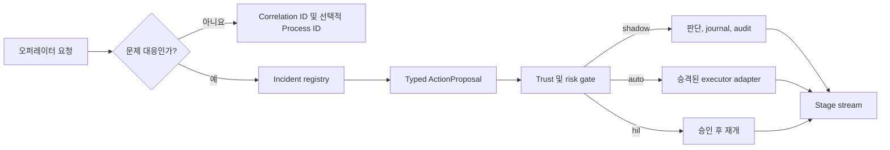

# 오퍼레이터 시작 SRE 및 아키텍처 리뷰

이 계획은 인시던트가 아닌 운영 작업을 FDAI가 식별하는 방법, 오퍼레이터의 SRE 요청을
거버넌스가 적용되는 인시던트 대응으로 전환하는 방법, Architecture Review Board(ARB)
프로세스를 관찰 가능한 Workflow로 실행하는 방법을 정의합니다. 또한 로컬 환경과 배포
환경에서 shadow 및 enforce 작업에 적용되는 안전 경계를 정의합니다.

> **범위:** 이 설계는 기존 incident registry, typed action pipeline, Process journal, risk
> gate, executor adapter를 재사용합니다. Console 소유 executor 또는 두 번째 판단 경로를
> 추가하지 않습니다.
>
> **안전 경계:** Enforce는 자체 gate를 통해 이미 승격된 ActionType이 policy, risk,
> approval, what-if, lock, idempotency 검사를 거친 후 구성된 adapter에 도달할 수 있음을
> 의미합니다. Workflow 또는 ARB 승인이 이러한 검사를 우회할 수 있다는 의미가 아닙니다.
>
> **구현 상태:** 완료되었습니다. 제공되는 surface는 `incident_correlation`, investigation과
> 연결된 Incident 생성, correlation-filtered Command Deck progress, `GET /arb/status`, Owner
> 권한이 필요한 workflow enforce dispatch, 선택적 Azure CLI 인증 local Event Hubs command
> transport입니다.

## 설계 요약

FDAI는 모든 작업 단위에 하나의 trace identity를 사용하고, 운영 문제를 나타내는 작업에만
Incident를 생성합니다. 오퍼레이터 investigation은 Incident를 생성하고 같은 correlation으로
investigation ActionProposal을 게시합니다. ARB 프로세스는 governance Process로 유지됩니다.
Enforce mode는 실제 approval 및 decision을 기록하지만, 그 결과 발생하는 resource 변경은
일반 ActionType pipeline으로 다시 진입합니다.



## Identity 모델

Incident ID는 범용 job ID가 아닙니다. Discovery, inventory refresh, monitoring probe,
scheduler dispatch, ARB review 및 기타 정기 작업은 incident roster에 나타나지 않으면서도
trace 가능해야 합니다.

| Identifier | 필요한 작업 | 계약 |
|------------|-------------|------|
| `event_id` | 모든 ingress 또는 stage-driving event | 하나의 변경 불가능한 delivery attempt를 식별하고 replay를 지원합니다. |
| `correlation_id` | 모든 논리적 작업 단위 | Stage event, audit row, chat turn, 관련 delivery를 연결합니다. 비인시던트 작업의 기본 trace identity입니다. |
| `process_id` | 다단계 Workflow run | Workflow, target, trigger timestamp 조합 하나를 결정론적으로 식별합니다. Incident ID가 아닙니다. |
| `incident_id` | 확인되었거나 evidence가 있는 운영 문제만 | 안정적인 incident correlation key에서 파생한 UUID5입니다. Member event를 그룹화하고 incident lifecycle state를 소유합니다. |

Normalized Event는 incident correlation policy를 선언합니다.

- `correlate`: Event를 deterministic correlator가 Incident로 그룹화할 수 있습니다.
- `none`: Event는 `correlation_id`를 유지하지만 correlator는 Incident ID를 반환하지 않습니다.

이전 버전과의 호환성을 위해 기본값은 `correlate`입니다. Discovery, monitoring, inventory,
scheduler, workflow-control event producer는 `none`을 설정합니다. Read model은 계속
`correlation_id`로 audit row를 그룹화하며, 이 값에서 Incident를 추론하지 않습니다.

## 오퍼레이터 시작 SRE 흐름

"이 cluster를 조사하고 확인된 문제를 조치해 줘" 같은 오퍼레이터 요청은 read-only
narrator 질문이 아니라 문제 대응 요청입니다. Coordinator는 다음 단계를 따릅니다.

1. **분류 및 범위 지정:** Bragi는 요청을 등록된 investigation ActionType으로 변환하고
   범위가 제한된 target을 추출합니다. 유효하지 않거나 모호한 argument는 게시 전에
   중단됩니다.
2. **Incident 열기:** Incident lifecycle은 operator session, target, investigation kind를
   사용하여 deterministic Incident를 만들거나 재사용합니다. 응답은 즉시 Incident ID와
   correlation ID를 반환합니다.
3. **Proposal 게시:** Command surface는 typed metadata에 Incident ID가 포함된
   `operator_request` ActionProposal을 게시합니다. 이 surface는 executor identity를 가지지
   않습니다.
4. **판단 및 gate:** Control loop는 T0를 먼저 실행하고 authoritative inventory로 보강한 후
   promotion과 risk를 평가하여 shadow, auto, human-in-the-loop(HIL), deny 중 하나를
   반환합니다.
5. **실행 또는 대기:** 승격된 low-risk ActionType은 enforce mode에서 실행할 수 있습니다.
   더 높은 risk의 작업은 별도 approver를 기다린 후 같은 executor를 통해 재개됩니다.
6. **진행 상황 stream:** 모든 stage는 공유 correlation 및 Incident ID와 함께 `ingest`,
   `route`, `verify`, `gate`, `execute`, `audit` record를 내보냅니다. Chat transcript는 이
   record를 하나의 순서가 있는 진행 timeline으로 표시합니다.

Incident 생성과 action 실행은 별도의 write입니다. Incident 생성 후 proposal 게시가 실패하면
응답은 Incident와 실패한 dispatch를 함께 보고하므로 같은 idempotency key로 재시도할 수
있습니다. 재시도는 Incident와 proposal identity를 모두 재사용합니다.

### 진행 상황 계약

Command 응답에는 authoritative projection으로 연결되는 link가 포함됩니다.

| Link | 목적 |
|------|------|
| Incident | 현재 lifecycle state 및 member evidence입니다. |
| Trace | Correlation의 stage event 및 terminal audit입니다. |
| Process | 요청이 다단계 Workflow를 시작할 때의 Workflow journal입니다. |
| Approval | Risk decision이 `hil`일 때의 pending approval입니다. |

UI는 이 link를 stream 또는 poll할 수 있지만 browser state는 authoritative하지 않습니다.
재연결 시 correlation ID를 사용하여 durable record에서 같은 순서의 timeline을 다시
구성합니다.

## ARB lifecycle 및 상태

ARB 상태에는 서로 독립적인 세 가지 차원이 있습니다. 이를 하나의 green 또는 red flag로
합치면 잘못된 configuration, 불완전한 production evidence, 정체된 runtime review의 차이가
가려집니다.

| 차원 | 정상 상태 | 비정상 상태 | 감지 방법 |
|------|-----------|-------------|-----------|
| Contract 구조 | Manifest를 parse할 수 있고 참조하는 모든 artifact가 존재합니다. | 유효하지 않은 status, 누락 field, 잘못된 binding, 중복 id 또는 누락 path입니다. | Structural readiness evaluator 및 CI command입니다. |
| Production readiness | Design approved, production ready, open critical/high blocker 없음, 모든 필수 owner/evidence binding 존재 상태입니다. | Production requirement가 하나라도 열려 있습니다. Process crash가 아니라 정상적인 blocked 상태입니다. | Production readiness evaluator입니다. |
| Runtime Process | 최신 ARB Process가 실행 중이거나, 이름이 있는 signal/approval을 기다리거나, 기록된 결과로 종료되었습니다. | Evaluator 누락, timeout, failed step 또는 next action이 없는 stale waiting 상태입니다. | Process snapshot 및 append-only journal입니다. |

Runtime production gate는 command-line checker와 같은 library evaluator를 사용합니다. 따라서
CI와 Process가 `architecture-review.production-ready` 통과 여부를 다르게 판단하지 않습니다.

### 수동 시작

CLI와 ChatOps는 Contributor 권한이 필요한 `POST /workflows/run` route를 다음과 같이
호출합니다.

```json
{
  "workflow": "architecture-review",
  "target_resource_id": "fdai-control-plane",
  "mode": "shadow",
  "correlation_id": "arb-review-<request-id>"
}
```

- Contributor는 shadow review를 시작하거나 재개할 수 있습니다.
- Owner는 deployment가 Workflow를 allowlist하고 ARB structural evaluator가 통과한 경우에만
  `enforce`를 요청할 수 있습니다.
- Enforce는 durable approval 및 decision transition에 적용됩니다. ARB Workflow에는 resource
  mutation action이 없으므로 resource를 배포하거나 ActionType을 활성화할 수 없습니다.
- 같은 workflow, target, trigger timestamp는 같은 Process ID를 파생합니다. 재시도는 중복
  review를 만들지 않고 Process를 재개합니다.

## Shadow 및 enforce 모델

Workflow mode와 ActionType mode는 별도의 gate입니다.

| Workflow mode | Control step 동작 | Action step 동작 |
|---------------|-------------------|------------------|
| `shadow` | 평가하고 journal 및 audit에 기록합니다. | Mutation proposal을 게시하지 않고 판단 및 기록만 수행합니다. |
| `enforce` | 실제 wait, approval, gate, decision transition을 저장합니다. | Typed proposal을 control loop로 다시 게시합니다. ActionType은 자체 promotion 및 risk decision을 계속 적용받습니다. |

따라서 enforce Workflow는 ActionType을 shadow에서 enforce로 올릴 수 없습니다. ActionType이
승격되지 않았으면 risk gate가 shadow를 기록합니다. HIL이 필요하면 Process가 pending
approval을 기록하고 기다립니다. Enforce 가능한 adapter가 구성되지 않았으면 실행은
fail-closed되고 Process가 이유를 노출합니다.

## 로컬 및 배포 환경 동등성

로컬 작업은 배포된 control plane과 같은 catalog, role check, promotion registry, risk table,
Process journal, stage publisher, executor 선택을 사용합니다. Adapter와 credential만 다릅니다.

- **Authoritative data:** Interactive local mode는 현재 Azure identity와 구성된 Azure-backed
  provider를 사용합니다. Provider가 없으면 unavailable로 표시하며 fixture로 대체하지 않습니다.
- **명시적 mutation opt-in:** Local enforce에는 배포 환경과 같은 adapter별 environment flag와
  local command-surface allowlist가 필요합니다. Read-only local startup은 mutation authority를
  자동으로 얻지 않습니다.
- **가짜 성공 없음:** Recording adapter는 test에서만 허용됩니다. Interactive local enforce는
  필요한 GitOps, tool, direct API, state 또는 HIL adapter가 없으면 unavailable을 보고합니다.
- **동일한 진행 모델:** Local 및 deployed run은 같은 stage 및 Process event를 게시하므로
  Console은 local 전용 presentation path를 필요로 하지 않습니다.

이 동등성에서 "모든 작업을 로컬에서 수행할 수 있음"은 operator가 같은 provider 및 permission을
구성했을 때를 의미합니다. Local read API가 production executor의 managed identity를 받거나,
사용할 수 없는 Azure data plane을 simulate한다는 의미가 아닙니다.

## 구현 계획

작업은 독립적으로 test 가능한 네 단계로 진행합니다.

1. **Identity:** Event incident-correlation policy를 추가하고 `none`에 대해 Incident ID 파생을
   건너뛰며 routine operational producer를 표시합니다. Audit grouping은 계속 correlation을
   사용하는지 확인합니다.
2. **SRE request:** Investigation request를 Incident lifecycle 생성에 연결하고, ActionProposal과
   stage detail 전체에 Incident ID를 전달하며, command 응답에서 trace link를 반환합니다.
3. **ARB runtime:** 하나의 재사용 가능한 readiness evaluator를 추출하고 Workflow gate에
   연결하며 diagnostic projection과 권한이 적용된 수동 시작 또는 재개 기능을 추가합니다.
4. **Enforce 및 parity:** 명시적 Workflow run mode, enforce allowlist, Owner authorization,
   typed action-step republish, 같은 provider factory를 사용하는 local composition을 추가합니다.

### 수용 기준

- Resource와 correlation ID가 있는 discovery event가 Incident ID를 생성하지 않습니다.
- Investigation chat request 하나가 Incident 하나를 생성하고 idempotent proposal 하나를
  게시하며 모든 stage에 correlation 하나를 사용합니다.
- 승격된 low-risk investigation이 enforce 가능한 tool adapter에 도달할 수 있습니다. 승격되지
  않았거나 high-risk인 요청은 shadow 또는 HIL로 유지됩니다.
- Upstream manifest에서 ARB structural health는 통과하지만 fork 소유 evidence가 제공되기
  전까지 production readiness는 blocked 상태를 유지합니다.
- 수동 ARB 시작은 Process와 journal을 반환하고 재시도는 이를 재개합니다.
- Interactive local mode는 synthetic data 없이 같은 command 및 progress 계약을 노출합니다.
- Focused unit/integration test, strict type checking, catalog validation, localization 및 repository
  verification이 통과합니다.

## 실패 처리

- 알 수 없는 incident policy, workflow mode, gate reference 또는 ActionType은 validation에서
  실패합니다.
- 누락된 Incident, Process 또는 adapter state는 unavailable 또는 audited failure를 반환하며
  성공으로 추측하지 않습니다.
- Stage streaming 실패는 decision을 변경하지 않습니다. Durable audit 및 Process record가
  recovery source로 유지됩니다.
- ARB production readiness 실패는 production decision을 차단하지만 manifest 구조가 유효하면
  service를 unhealthy로 표시하지 않습니다.
- 모든 enforce exception은 rollback status가 포함된 failed 또는 HIL terminal record가 됩니다.
  거버넌스가 없는 direct call로 fallback하지 않습니다.

## 관련 문서

| 알아볼 내용 | 문서 |
|-------------|------|
| Incident correlation 및 detection | [Observability and Detection](../rules-and-detection/observability-and-detection-ko.md) |
| Conversational command 경계 | [Operator Console](../interfaces/operator-console-ko.md) |
| Workflow 및 Process 계약 | [Process Automation](../decisioning/process-automation-ko.md) |
| ARB evidence 계약 | [Architecture Review Board Packet](../architecture/architecture-review-board-ko.md) |
| Shadow 및 enforce promotion | [Shadow Then Enforce](../../user-guide/concepts/shadow-then-enforce-ko.md) |
