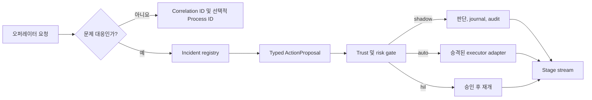

# 오퍼레이터 시작 SRE 및 아키텍처 리뷰

이 계획은 인시던트가 아닌 운영 작업을 FDAI가 식별하는 방법, 오퍼레이터의 SRE 요청을
거버넌스가 적용되는 인시던트 대응으로 전환하는 방법, 아키텍처 검토 Board(ARB)
프로세스를 관찰 가능한 작업 흐름으로 실행하는 방법을 정의합니다. 또한 로컬 환경과 배포
환경에서 shadow 및 강제 적용 작업에 적용되는 안전 경계를 정의합니다.

> **범위:** 이 설계는 기존 인시던트 레지스트리, 타입이 지정된 액션 파이프라인, 프로세스 저널, risk
> 게이트, 실행기 어댑터를 재사용합니다. Console 소유 실행기 또는 두 번째 판단 경로를
> 추가하지 않습니다.
>
> **안전 경계:** 강제 적용은 자체 게이트를 통해 이미 승격된 ActionType이 정책, risk,
> 승인, what-if, 잠금, 멱등성 검사를 거친 후 구성된 어댑터에 도달할 수 있음을
> 의미합니다. 작업 흐름 또는 ARB 승인이 이러한 검사를 우회할 수 있다는 의미가 아닙니다.
>
> **구현 상태:** 완료되었습니다. 제공되는 표면은 `incident_correlation`, 조사와
> 연결된 인시던트 생성, correlation-filtered Command Deck 진행 상황, `GET /arb/status`, Owner
> 권한이 필요한 작업 흐름 강제 적용 전달, 선택적 Azure CLI 인증 로컬 Event Hubs 명령
> 전송 계층입니다.

## 설계 요약

FDAI는 모든 작업 단위에 하나의 추적 신원을 사용하고, 근거가 있는 문제 또는
오퍼레이터가 명시적으로 확인한 문제 대응 요청에만 인시던트를 생성합니다. 읽기 전용 발견은
상관관계 ID로 시작하며 작업이 분리되면 프로세스 ID도 사용합니다. 명시적 오퍼레이터
조사는 인시던트를 생성하고 같은 상관관계로 조사 ActionProposal을
게시합니다. ARB 프로세스는 거버넌스 프로세스로 유지됩니다. 강제 적용 모드는 실제 승인 및
결정을 기록하지만, 그 결과 발생하는 리소스 변경은 일반 ActionType 파이프라인으로 다시
진입합니다.


```mermaid
flowchart LR
 ASK[오퍼레이터 요청] --> CLASSIFY{문제 대응인가?}
 CLASSIFY -->|아니요| WORK[Correlation ID 및 선택적 Process ID]
 CLASSIFY -->|예| INCIDENT[Incident registry]
 INCIDENT --> PROPOSAL[Typed ActionProposal]
 PROPOSAL --> ROUTE[Trust 및 risk gate]
 ROUTE -->|shadow| OBSERVE[판단, journal, audit]
 ROUTE -->|auto| EXECUTE[승격된 executor adapter]
 ROUTE -->|hil| APPROVE[승인 후 재개]
 OBSERVE --> STREAM[Stage stream]
 EXECUTE --> STREAM
 APPROVE --> STREAM
```

## 신원 모델

인시던트 ID는 범용 작업 ID가 아닙니다. 발견, 인벤토리 새로 고침, monitoring 탐색,
스케줄러 전달, ARB 검토 및 기타 정기 작업은 인시던트 명단에 나타나지 않으면서도
추적 가능해야 합니다.

| 식별자 | 필요한 작업 | 계약 |
|------------|-------------|------|
| `event_id` | 모든 유입 또는 stage-driving 이벤트 | 하나의 변경 불가능한 전달 시도를 식별하고 재생을 지원합니다. |
| `correlation_id` | 모든 논리적 작업 단위 | 단계 이벤트, 감사 행, 채팅 턴, 관련 전달을 연결합니다. 비인시던트 작업의 기본 추적 신원입니다. |
| `process_id` | 다단계 작업 흐름 실행 | 작업 흐름, 대상, 트리거 시각 조합 하나를 결정론적으로 식별합니다. 인시던트 ID가 아닙니다. |
| `incident_id` | 근거가 있는 문제 또는 오퍼레이터가 명시적으로 확인한 문제 대응 요청 | 안정적인 인시던트 상관관계 키에서 파생한 UUID5입니다. 구성원 이벤트를 그룹화하고 인시던트 수명 주기 상태를 소유합니다. |

정규화된 Event는 인시던트 상관관계 정책을 선언합니다.

- `correlate`: Event를 결정론적 correlator가 인시던트로 그룹화할 수 있습니다.
- `none`: Event는 `correlation_id`를 유지하지만 correlator는 인시던트 ID를 반환하지 않습니다.

이전 버전과의 호환성을 위해 기본값은 `correlate`입니다. 발견, monitoring, 인벤토리,
스케줄러, workflow-control 이벤트 생산자는 `none`을 설정합니다. 읽기 모델은 계속
`correlation_id`로 감사 행을 그룹화하며, 이 값에서 인시던트를 추론하지 않습니다.

## 오퍼레이터 시작 SRE 흐름

"이 클러스터를 조사하고 확인된 문제를 조치해 줘" 같은 오퍼레이터 요청은 읽기 전용
서술기 질문이 아니라 문제 대응 요청입니다. 조정기는 다음 단계를 따릅니다.

1. **분류 및 범위 지정:** Bragi는 요청을 등록된 조사 ActionType으로 변환하고
 범위가 제한된 대상을 추출합니다. 유효하지 않거나 모호한 인자는 게시 전에
 중단됩니다.
2. **인시던트 열기:** 명시적 문제 대응 명령이 오퍼레이터 확인 역할을 합니다. 인시던트
 수명 주기는 운영자 세션, 대상, 조사 종류를 사용하여 결정론적 인시던트를
 만들거나 재사용합니다. 읽기 전용 발견 질문은 이 단계로 진입하지 않습니다. 응답은 즉시
 인시던트 ID와 상관관계 ID를 반환합니다.
3. **제안 게시:** Command 표면은 타입이 지정된 메타데이터에 인시던트 ID가 포함된
 `operator_request` ActionProposal을 게시합니다. 이 표면은 실행기 신원을 가지지
 않습니다.
4. **판단 및 게이트:** 컨트롤 루프는 T0를 먼저 실행하고 권위 있는 인벤토리로 보강한 후
 승격과 risk를 평가하여 shadow, auto, human-in-the-loop(HIL), 거부 중 하나를
 반환합니다.
5. **실행 또는 대기:** 승격된 low-risk ActionType은 강제 적용 모드에서 실행할 수 있습니다.
 더 높은 risk의 작업은 별도 승인자를 기다린 후 같은 실행기를 통해 재개됩니다.
6. **진행 상황 스트림:** 모든 단계는 공유 상관관계 및 인시던트 ID와 함께 `ingest`,
 `route`, `verify`, `gate`, `execute`, `audit` 기록을 내보냅니다. Chat 대화 기록은 이
 기록을 하나의 순서가 있는 진행 타임라인으로 표시합니다.

인시던트 생성과 액션 실행은 별도의 쓰기입니다. 인시던트 생성 후 제안 게시가 실패하면
응답은 인시던트와 실패한 전달을 함께 보고하므로 같은 멱등성 키로 재시도할 수
있습니다. 재시도는 인시던트와 제안 신원을 모두 재사용합니다.

### 진행 상황 계약

Command 응답에는 권위 있는 변환 결과로 연결되는 링크가 포함됩니다.

| 링크 | 목적 |
|------|------|
| 인시던트 | 현재 수명 주기 상태 및 구성원 근거입니다. |
| 추적 | 상관관계의 단계 이벤트 및 최종 감사입니다. |
| 프로세스 | 요청이 다단계 작업 흐름을 시작할 때의 작업 흐름 저널입니다. |
| Approval | Risk 결정이 `hil`일 때의 pending 승인입니다. |

UI는 이 링크를 스트림 또는 poll할 수 있지만 브라우저 상태는 권위 있는하지 않습니다.
재연결 시 상관관계 ID를 사용하여 영속 기록에서 같은 순서의 타임라인을 다시
구성합니다.

## ARB 수명 주기 및 상태

ARB 상태에는 서로 독립적인 세 가지 차원이 있습니다. 이를 하나의 green 또는 red 플래그로
합치면 잘못된 구성, 불완전한 운영 근거, 정체된 런타임 검토의 차이가
가려집니다.

| 차원 | 정상 상태 | 비정상 상태 | 감지 방법 |
|------|-----------|-------------|-----------|
| 계약 구조 | 매니페스트를 parse할 수 있고 참조하는 모든 산출물이 존재합니다. | 유효하지 않은 상태, 누락 필드, 잘못된 연결, 중복 id 또는 누락 경로입니다. | Structural 준비 상태 평가기 및 CI 명령입니다. |
| 운영 준비 상태 | Design approved, 운영 준비된, 열림 critical/high 차단 요인 없음, 모든 필수 소유자/근거 연결 존재 상태입니다. | 운영 요구사항이 하나라도 열려 있습니다. 프로세스 비정상 종료가 아니라 정상적인 차단된 상태입니다. | 운영 준비 상태 평가기입니다. |
| 런타임 프로세스 | 최신 ARB 프로세스가 실행 중이거나, 이름이 있는 신호/승인을 기다리거나, 기록된 결과로 종료되었습니다. | 평가기 누락, 시간 초과, 실패한 단계 또는 next 액션이 없는 stale waiting 상태입니다. | 프로세스 스냅샷 및 추가 전용 저널입니다. |

런타임 운영 게이트는 command-line 검사기와 같은 library 평가기를 사용합니다. 따라서
CI와 프로세스가 `architecture-review.production-ready` 통과 여부를 다르게 판단하지 않습니다.

### 수동 시작

CLI와 ChatOps는 기여자 권한이 필요한 `POST /workflows/run` 경로를 다음과 같이
호출합니다.

```json
{
 "workflow": "architecture-review",
 "target_resource_id": "fdai-control-plane",
 "mode": "shadow",
 "trigger_ts": "2026-07-21T09:00:00Z",
 "correlation_id": "arb-review-<request-id>"
}
```

- 기여자는 shadow 검토를 시작하거나 재개할 수 있습니다.
- Owner는 배포가 작업 흐름을 허용 목록하고 ARB structural 평가기가 통과한 경우에만
 `enforce`를 요청할 수 있습니다.
- 강제 적용은 영속 승인 및 결정 전이에 적용됩니다. ARB 작업 흐름에는 리소스
 변경 액션이 없으므로 리소스를 배포하거나 ActionType을 활성화할 수 없습니다.
- 같은 작업 흐름, 대상, 트리거 시각은 같은 프로세스 ID를 파생합니다. 클라이언트는 재시도할 때
 최초 `trigger_ts`를 그대로 다시 보내야 중복 검토를 만들지 않고 프로세스를 재개합니다.
 `trigger_ts`를 생략하면 서버가 요청 시각을 사용하므로 이후 재시도와 동일성이 보장되지 않습니다.

## shadow 및 강제 적용 모델

작업 흐름 모드와 ActionType 모드는 별도의 게이트입니다.

| 작업 흐름 모드 | 컨트롤 단계 동작 | 액션 단계 동작 |
|---------------|-------------------|------------------|
| `shadow` | 평가하고 저널 및 감사에 기록합니다. | 변경 제안을 게시하지 않고 판단 및 기록만 수행합니다. |
| `enforce` | 실제 wait, 승인, 게이트, 결정 전이를 저장합니다. | 타입이 지정된 제안을 컨트롤 루프로 다시 게시합니다. ActionType은 자체 승격 및 risk 결정을 계속 적용받습니다. |

따라서 강제 적용 작업 흐름은 ActionType을 shadow에서 강제 적용으로 올릴 수 없습니다. ActionType이
승격되지 않았으면 risk 게이트가 shadow를 기록합니다. HIL이 필요하면 프로세스가 pending
승인을 기록하고 기다립니다. 강제 적용 가능한 어댑터가 구성되지 않았으면 실행은
실패 시 차단되고 프로세스가 이유를 노출합니다.

## 로컬 및 배포 환경 동등성

로컬 작업은 배포된 컨트롤 평면과 같은 카탈로그, 역할 검사, 승격 레지스트리, risk 표,
프로세스 저널, 단계 발행기, 실행기 선택을 사용합니다. 어댑터와 자격 증명만 다릅니다.

- **권위 있는 데이터:** Interactive 로컬 모드는 현재 Azure 신원과 구성된 Azure-backed
 프로바이더를 사용합니다. 프로바이더가 없으면 사용 불가로 표시하며 고정본으로 대체하지 않습니다.
- **명시적 변경 명시적 선택:** 로컬 강제 적용에는 배포 환경과 같은 어댑터별 환경 플래그와
 로컬 command-surface 허용 목록이 필요합니다. 읽기 전용 로컬 시작은 변경 권한을
 자동으로 얻지 않습니다.
- **가짜 성공 없음:** Recording 어댑터는 테스트에서만 허용됩니다. Interactive 로컬 강제 적용은
 필요한 GitOps, 도구, direct API, 상태 또는 HIL 어댑터가 없으면 사용 불가를 보고합니다.
- **동일한 진행 모델:** 로컬 및 deployed 실행은 같은 단계 및 프로세스 이벤트를 게시하므로
 Console은 로컬 전용 표현 경로를 필요로 하지 않습니다.

이 동등성에서 "모든 작업을 로컬에서 수행할 수 있음"은 운영자가 같은 프로바이더 및 권한을
구성했을 때를 의미합니다. 로컬 Operator API가 운영 실행기의 managed 신원을 받거나,
사용할 수 없는 Azure 데이터 평면을 simulate한다는 의미가 아닙니다.

## 구현 계획

작업은 독립적으로 테스트 가능한 네 단계로 진행합니다.

1. **신원:** Event incident-correlation 정책을 추가하고 `none`에 대해 인시던트 ID 파생을
 건너뛰며 routine operational 생산자를 표시합니다. 감사 그룹화는 계속 상관관계를
 사용하는지 확인합니다.
2. **SRE 요청:** 조사 요청을 인시던트 수명 주기 생성에 연결하고, ActionProposal과
 단계 상세 전체에 인시던트 ID를 전달하며, 명령 응답에서 추적 링크를 반환합니다.
3. **ARB 런타임:** 하나의 재사용 가능한 준비 상태 평가기를 추출하고 작업 흐름 게이트에
 연결하며 진단 변환 결과와 권한이 적용된 수동 시작 또는 재개 기능을 추가합니다.
4. **강제 적용 및 동등성:** 명시적 작업 흐름 실행 모드, 강제 적용 허용 목록, Owner 권한 확인,
 타입이 지정된 action-step republish, 같은 프로바이더 factory를 사용하는 로컬 조립을 추가합니다.

### 수용 기준

- Resource와 상관관계 ID가 있는 발견 이벤트가 인시던트 ID를 생성하지 않습니다.
- 조사 채팅 요청 하나가 인시던트 하나를 생성하고 멱등적 제안 하나를
 게시하며 모든 단계에 상관관계 하나를 사용합니다.
- 승격된 low-risk 조사가 강제 적용 가능한 도구 어댑터에 도달할 수 있습니다. 승격되지
 않았거나 high-risk인 요청은 shadow 또는 HIL로 유지됩니다.
- 업스트림 매니페스트에서 ARB structural 상태는 통과하지만 포크 소유 근거가 제공되기
 전까지 운영 준비 상태는 차단된 상태를 유지합니다.
- 수동 ARB 시작은 프로세스와 저널을 반환하고 재시도는 이를 재개합니다.
- Interactive 로컬 모드는 synthetic 데이터 없이 같은 명령 및 진행 상황 계약을 노출합니다.
- Focused 단위/통합 테스트, strict 타입 검사, 카탈로그 검증, localization 및 저장소
 검증이 통과합니다.

## 실패 처리

- 알 수 없는 인시던트 정책, 작업 흐름 모드, 게이트 참조 또는 ActionType은 검증에서
 실패합니다.
- 누락된 인시던트, 프로세스 또는 어댑터 상태는 사용 불가 또는 audited 실패를 반환하며
 성공으로 추측하지 않습니다.
- 단계 스트리밍 실패는 결정을 변경하지 않습니다. 영속 감사 및 프로세스 기록이
 복구 출처로 유지됩니다.
- ARB 운영 준비 상태 실패는 운영 결정을 차단하지만 매니페스트 구조가 유효하면
 서비스를 unhealthy로 표시하지 않습니다.
- 모든 강제 적용 exception은 롤백 상태가 포함된 실패한 또는 HIL 최종 기록이 됩니다.
 거버넌스가 없는 direct 호출로 대체 경로하지 않습니다.

## 관련 문서

| 알아볼 내용 | 문서 |
|-------------|------|
| 인시던트 상관관계 및 detection | [Observability and Detection](../rules-and-detection/observability-and-detection-ko.md) |
| Conversational 명령 경계 | [Operator Console](../interfaces/operator-console-ko.md) |
| 작업 흐름 및 프로세스 계약 | [프로세스 자동화](../decisioning/process-automation-ko.md) |
| ARB 근거 계약 | [아키텍처 검토 Board Packet](../architecture/architecture-review-board-ko.md) |
| shadow 및 강제 적용 승격 | [shadow Then 강제 적용](../../user-guide/concepts/shadow-then-enforce-ko.md) |
