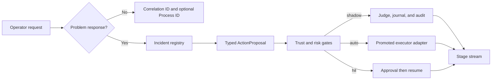

# Operator-Initiated SRE and Architecture Review

This plan defines how FDAI identifies operational work that is not an incident, turns an
operator's SRE request into a governed incident response, and runs the Architecture Review Board
(ARB) process as an observable workflow. It also defines the safety boundary for shadow and
enforce operation in both local and deployed environments.

> **Scope:** This design reuses the existing incident registry, typed action pipeline, Process
> journal, risk gate, and executor adapters. It does not add a console-owned executor or a second
> judgment path.
>
> **Safety boundary:** Enforce means that an ActionType already promoted through its own gate may
> reach its configured adapter after policy, risk, approval, what-if, lock, and idempotency checks.
> It never means that a Workflow or ARB approval can bypass those checks.
>
> **Implementation status:** Complete. The shipped surfaces are `incident_correlation`,
> investigation-linked Incident creation, correlation-filtered Command Deck progress,
> `GET /arb/status`, Owner-gated workflow enforce dispatch, and optional Azure CLI-authenticated
> local Event Hubs command transport.

## Design at a glance

FDAI uses one trace identity for every unit of work and creates an Incident only when the work
represents an operational problem. Operator investigations create an Incident and publish an
investigation ActionProposal under the same correlation. The ARB process remains a governance
Process: its enforce mode records real approvals and decisions, while any resulting resource
change re-enters the normal ActionType pipeline.



## Identity model

An Incident ID is not a general-purpose job ID. Discovery, inventory refresh, monitoring probes,
scheduler dispatch, ARB review, and other routine work should remain traceable without appearing
in the incident roster.

| Identifier | Required for | Contract |
|------------|--------------|----------|
| `event_id` | Every ingress or stage-driving event | Identifies one immutable delivery attempt and supports replay. |
| `correlation_id` | Every logical unit of work | Joins stage events, audit rows, chat turns, and related deliveries. For non-incident work, this is the primary trace identity. |
| `process_id` | Multi-step Workflow runs | Deterministically identifies one Workflow, target, and trigger timestamp. It is not an Incident ID. |
| `incident_id` | Confirmed or evidence-backed operational problems only | UUID5 derived from stable incident correlation keys. It groups member events and owns incident lifecycle state. |

The normalized Event declares an incident correlation policy:

- `correlate`: the event may be grouped into an Incident by the deterministic correlator.
- `none`: the event keeps its `correlation_id`, but the correlator returns no Incident ID.

The default remains `correlate` for backward compatibility. Producers for discovery, monitoring,
inventory, scheduler, and workflow-control events set `none`. Read models continue to group their
audit rows by `correlation_id`; they do not infer an Incident from that value.

## Operator-initiated SRE flow

An operator request such as "investigate this cluster and remediate the confirmed problem" is a
problem-response request, not a read-only narrator question. The coordinator follows these steps:

1. **Classify and scope:** Bragi translates the request into a registered investigation
   ActionType and extracts a bounded target. Invalid or ambiguous arguments stop before publish.
2. **Open the Incident:** The incident lifecycle creates or reuses a deterministic Incident from
   the operator session, target, and investigation kind. The response returns the Incident ID and
   correlation ID immediately.
3. **Publish the proposal:** The command surface publishes an `operator_request` ActionProposal
   with the Incident ID in typed metadata. It holds no executor identity.
4. **Judge and gate:** The control loop runs T0 first, enriches from authoritative inventory,
   evaluates promotion and risk, and returns shadow, auto, human-in-the-loop (HIL), or deny.
5. **Execute or wait:** A promoted low-risk ActionType can execute in enforce mode. Higher-risk
   work parks for a distinct approver and resumes through the same executor after approval.
6. **Stream progress:** Every stage emits `ingest`, `route`, `verify`, `gate`, `execute`, and
   `audit` records with the shared correlation and Incident ID. The chat transcript renders those
   records as one ordered progress timeline.

Incident creation and action execution are separate writes. If proposal publication fails after
the Incident is created, the response reports the Incident and the failed dispatch so an operator
can retry with the same idempotency key. A retry reuses both the Incident and proposal identity.

### Progress contract

The command response includes links to the authoritative projections:

| Link | Purpose |
|------|---------|
| Incident | Current lifecycle state and member evidence. |
| Trace | Stage events and terminal audit for the correlation. |
| Process | Workflow journal when the request starts a multi-step Workflow. |
| Approval | Pending approval when the risk decision is `hil`. |

The UI may stream or poll these links, but browser state is never authoritative. A reconnect uses
the correlation ID to rebuild the same ordered timeline from durable records.

## ARB lifecycle and health

ARB health has three independent dimensions. Combining them into one green or red flag hides the
difference between malformed configuration, incomplete production evidence, and a stalled runtime
review.

| Dimension | Healthy state | Unhealthy state | Detection |
|-----------|---------------|-----------------|-----------|
| Contract structure | Manifest parses and every referenced artifact exists. | Invalid status, missing field, malformed binding, duplicate id, or missing path. | Structural readiness evaluator and CI command. |
| Production readiness | Design approved, production ready, no open critical/high blocker, and every required owner/evidence binding present. | Any production requirement remains open. This is a normal blocked state, not a process crash. | Production readiness evaluator. |
| Runtime Process | Latest ARB Process is running, waiting for a named signal/approval, or terminal with a recorded outcome. | Missing evaluator, timeout, failed step, or stale waiting state without a next action. | Process snapshot and append-only journal. |

The runtime production gate uses the same library evaluator as the command-line checker. This
prevents CI and the Process from disagreeing about whether `architecture-review.production-ready`
passed.

### Manual start

CLI and ChatOps call the Contributor-gated `POST /workflows/run` route with:

```json
{
  "workflow": "architecture-review",
  "target_resource_id": "fdai-control-plane",
  "mode": "shadow",
  "trigger_ts": "2026-07-21T09:00:00Z",
  "correlation_id": "arb-review-<request-id>"
}
```

- A Contributor may start or resume a shadow review.
- An Owner may request `enforce` only when the deployment allowlists the Workflow and the ARB
  structural evaluator passes.
- Enforce applies durable approval and decision transitions. The ARB Workflow has no resource
  mutation action, so it cannot deploy or enable an ActionType.
- The same workflow, target, and trigger timestamp derive the same Process ID. To resume the
  Process without creating a duplicate review, the client must resend the original `trigger_ts`
  on retries. If `trigger_ts` is omitted, the server uses the request time and later retries are
  not guaranteed to be identical.

## Shadow and enforce model

Workflow mode and ActionType mode are separate gates:

| Workflow mode | Control step behavior | Action step behavior |
|---------------|-----------------------|----------------------|
| `shadow` | Evaluate, journal, and audit. | Judge and log without publishing a mutation proposal. |
| `enforce` | Persist real wait, approval, gate, and decision transitions. | Publish a typed proposal back to the control loop. The ActionType remains subject to its own promotion and risk decision. |

An enforce Workflow therefore cannot raise an ActionType from shadow to enforce. If the ActionType
is not promoted, the risk gate records shadow. If it requires HIL, the Process records the pending
approval and waits. If no enforce-capable adapter is configured, execution fails closed and the
Process exposes the reason.

## Local and deployed parity

Local operation uses the same catalogs, role checks, promotion registry, risk table, Process
journal, stage publisher, and executor selection as the deployed control plane. Only adapters and
credentials differ.

- **Authoritative data:** Interactive local mode uses the current Azure identity and configured
  Azure-backed providers. Missing providers render unavailable; they never substitute fixtures.
- **Explicit mutation opt-in:** Local enforce requires the same adapter-specific environment flag
  as deployment, plus a local command-surface allowlist. Read-only local startup does not silently
  gain mutation authority.
- **No fake success:** Recording adapters are allowed only in tests. Interactive local enforce
  reports unavailable when a required GitOps, tool, direct API, state, or HIL adapter is absent.
- **Same progress model:** Local and deployed runs publish the same stage and Process events, so
  the console does not need a local-only presentation path.

This parity means "all work is possible locally" when the operator configures the same providers
and permissions. It does not mean that the local read API receives the production executor's
managed identity or that an unavailable Azure data plane is simulated.

## Implementation plan

The work lands in four independently testable slices:

1. **Identity:** Add the Event incident-correlation policy, bypass Incident ID derivation for
   `none`, and mark routine operational producers. Verify audit grouping still uses correlation.
2. **SRE request:** Link investigation requests to Incident lifecycle creation, carry Incident ID
   through the ActionProposal and stage details, and return trace links from the command response.
3. **ARB runtime:** Extract one reusable readiness evaluator, bind it to the Workflow gate, add a
   diagnostic projection, and permit an authorized manual start or resume.
4. **Enforce and parity:** Add explicit Workflow run mode, an enforce allowlist, Owner authorization,
   typed action-step republish, and local composition through the same provider factories.

### Acceptance gates

- A discovery event with a resource and correlation ID produces no Incident ID.
- An investigation chat request creates one Incident, publishes one idempotent proposal, and uses
  one correlation across every stage.
- A promoted low-risk investigation can reach an enforce-capable tool adapter; an unpromoted or
  high-risk request remains shadow or HIL.
- ARB structural health passes for the upstream manifest while production readiness remains
  blocked until fork-owned evidence is supplied.
- Manual ARB start returns a Process and journal; retries resume it.
- Interactive local mode exposes the same command and progress contracts without synthetic data.
- Focused unit and integration tests, strict type checking, catalog validation, localization, and
  repository verification pass.

## Failure handling

- Unknown incident policy, workflow mode, gate reference, or ActionType fails at validation.
- Missing Incident, Process, or adapter state returns unavailable or an audited failure, never a
  guessed success.
- Stage streaming failure does not alter the decision. Durable audit and Process records remain
  the recovery source.
- ARB production readiness failure blocks the production decision but does not mark the service
  unhealthy when the manifest is structurally valid.
- Any enforce exception becomes a failed or HIL terminal record with rollback status. It never
  falls back to an ungoverned direct call.

## Related docs

| To learn about | Read |
|----------------|------|
| Incident correlation and detection | [Observability and Detection](../rules-and-detection/observability-and-detection.md) |
| Conversational command boundary | [Operator Console](../interfaces/operator-console.md) |
| Workflow and Process contracts | [Process Automation](../decisioning/process-automation.md) |
| ARB evidence contract | [Architecture Review Board Packet](../architecture/architecture-review-board.md) |
| Shadow and enforce promotion | [Shadow Then Enforce](../../user-guide/concepts/shadow-then-enforce.md) |
