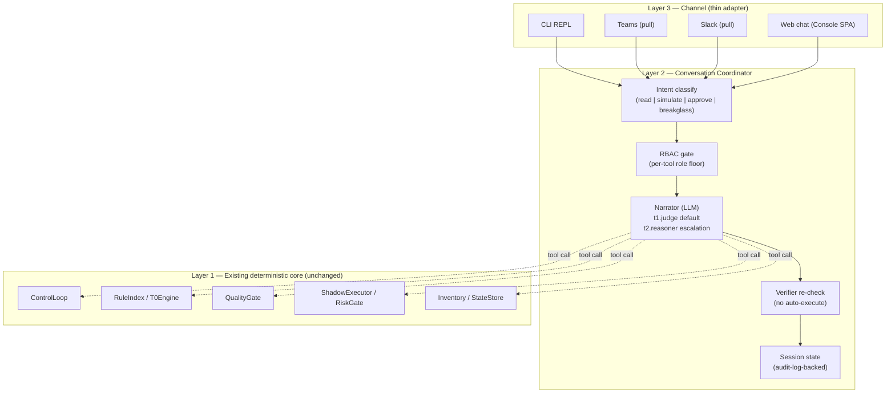

# 오퍼레이터 콘솔 (Conversational)

사람 오퍼레이터가 대화형 인터페이스로 FDAI 에게 **역으로 말할 수 있는**
방식 — CLI REPL이 먼저, Teams / Slack 챗이 다음, 웹 챗이 마지막. 이 문서는
**대화형 surface**를 권위적으로 정의한다: 계층 아키텍처, tool 카탈로그, LLM
tier 모델, 세션 지속성, tool 별 RBAC, 안전 invariant, 단계별 rollout.

Push 방향 (시스템 → 사람) 알림은
[channels-and-notifications.md](channels-and-notifications-ko.md)에 있고,
읽기 전용 콘솔 SPA는
[project-structure.md § console/](project-structure-ko.md#console-static-web-app)
에 있음. 이 문서는 **pull 방향**을 다룬다 — 오퍼레이터가 묻고, 시뮬레이션
하고, 승인. 알림 문서가 이미 어댑터를 제공하는 모든 채널에 걸쳐. Push와
pull은 같은 채널 credential과 같은 audit 계약을 공유하지만 서로 다른
통합 surface 이다.

> 고객-무관: 아래의 모든 채널 id, LLM deployment 이름, 리소스 id, 그룹
> 이름은 placeholder. Fork는 config로 실제 값을 공급
> ([generic-scope.instructions.md](../../.github/instructions/generic-scope.instructions.md)).

## 1. Framing - 무엇인가 (그리고 무엇이 아닌가)

오퍼레이터 콘솔은 **판단 authority 를 가지지 않는다**. FDAI의 판단
authority 는 이미 있는 곳에 그대로 남는다 — deterministic engine (T0),
quality gate (T2 verifier), risk gate, shipped Rego policy. 콘솔은
그 판단을 오퍼레이터가 검사하고, 변경을 시뮬레이션하고, 시스템이
이미 큐잉한 것을 승인하는 **대화형 surface** 이다.

세 property가 직접 따라온다:

- **LLM은 translator 이지 judge가 아님.** 자연어 in, tool call out; tool
  결과 in, 자연어 out. LLM은 execution eligibility를 절대 부여하지 않음 —
  오직 verifier만
  ([architecture.instructions.md § Design Principles](../../.github/instructions/architecture.instructions.md#design-principles)).
- **Tool은 pipeline stage를 노출하고, primitive data source가 아님.**
  LLM이 진단으로 조합해야 하는 `query_log()` + `query_metric()` +
  `read_config()` 대신, 콘솔은 `describe_event()`, `explain_verdict()`,
  `simulate_change()`를 노출. 시스템이 이미 reasoning을 완료했음;
  오퍼레이터는 결과에 대해 묻는다.
- **성장은 카탈로그 성장이지, 모델 memory 성장이 아님.** 반복되는
  investigation 패턴은 discovery loop를 통해 새 룰 후보가 됨
  ([architecture.instructions.md § Rule Catalog](../../.github/instructions/architecture.instructions.md#rule-catalog)) —
  불투명한 LLM 세션 memory가 아님. 대화 간에 persist 되는 모든 상태는
  `audit_log` + `operator_memory`에 살며, 감사가능 / export 가능 / CSP-중립.

### 1.1 공유 glossary에 추가된 어휘

다음 토큰들이
[architecture.instructions.md](../../.github/instructions/architecture.instructions.md)
의 공유 어휘에 추가되며 참조하는 모든 문서에서 일관되게 사용된다:

- **operator-console** - 여기 문서화된 계층 surface.
- **narrator** - 오퍼레이터 콘솔의 LLM tier (translator 역할; judge 절대
  아님). T2 quality-gate 역할과는 별개 — 그건 제안된 액션에 대한 도메인
  reasoner.
- **operator-conversation** - 오퍼레이터와 콘솔 사이의 bounded exchange
  하나 (멀티-turn, RBAC-scoped, 감사됨).
- **console-tool** - narrator가 호출 가능한 노출된 pipeline stage 또는
  카탈로그 view 하나.

## 2. 3-layer 아키텍처



- **Layer 3 (Channel)**은 얇다. 각 채널 adapter는 wire 포맷 (stdin /
  Teams Activity / Slack event / WebSocket frame)의 한 turn을
  `ConversationTurn`으로, 그리고 반대 방향으로 변환. 판단은 여기 없음.
- **Layer 2 (Coordinator)**는 intent classification, RBAC gating, tool
  dispatch, verifier re-check, 세션 bookkeeping을 소유. Narrator는 DI
  seam (`ConversationalModel` Protocol - §5 참조) 이므로 fork가 어떤 LLM
  provider 든 바인딩 가능; upstream 기본은 Azure OpenAI.
- **Layer 1 (Core)**은 이미 shipping 중인 deterministic core 그대로.
  콘솔은 새 판단 경로, 새 지속성 저장소, 새 execution vector를 추가하지
  않는다. 콘솔 tool call은 기존 pipeline이 이미 만드는 법을 아는 call
  로 resolve.

### 2.1 모듈 맵

- [`src/fdai/core/conversation/`](../../src/fdai/core/conversation/)
  - `coordinator.py` - `ConversationCoordinator` (Layer 2 orchestrator).
  - `tools.py` - `ConsoleTool` Protocol + per-tool 구현체가 Layer 1
    모듈에만 delegate.
  - `narrator.py` - `ConversationalModel` Protocol + tier-select 로직
    (t1.judge default, t2.reasoner.primary escalation).
  - `session.py` - `ConversationSession` dataclass; 상태는 append-only
    audit log 로부터 project 됨.
- `src/fdai/delivery/channels/` (계획된 layout; 현재 Teams adapter는
  [`src/fdai/delivery/chatops/`](../../src/fdai/delivery/chatops/) 아래에 존재)
  - `cli_repl.py` - Day-1 채널 adapter (stdin/stdout).
  - `teams_bot.py` - pull-방향 Teams adapter (Bot Framework messaging).
  - `slack_bot.py` - pull-방향 Slack adapter (Socket Mode).
  - `web_chat.py` - read-console API가 노출하는 WebSocket adapter.
- [`tools/chat.py`](../../tools/chat.py) - CLI 엔트리 포인트.

CSP-중립 규칙은 그대로 유지: `core/conversation/`은 **오직** Protocol만
import. 모든 Azure SDK / httpx / Bot Framework 호출은 `delivery/` 아래
거주.

## 3. Tool 카탈로그

Tool은 **pipeline-stage view** 이다. 각각 안정된 이름, 인자에 대한 JSON
Schema (등록 시 함수 시그니처로부터 생성), RBAC 하한, 문서화된 실패
surface를 가진다. 새 tool은 additive; 룰이나 정책을 절대 override 하지
않음.

### 3.1 Day-1 tool 집합 (read-only + explain)

| Tool | 목적 | RBAC 하한 | Delegates to |
|------|---------|-----------|--------------|
| `describe_event(payload)` | 하나의 이벤트를 `EventIngest → TrustRouter → T0Engine`로 in-memory 실행 (PR 없음, audit write 없음); 결과 routing 결정 + 후보 룰 id 반환. | Reader | `EventIngest`, `TrustRouter`, `T0Engine` |
| `explain_verdict(event_id)` | 이미 처리된 이벤트의 audit trail을 읽어; tier, decision, citing 룰 id, verifier 리포트, mode 반환. | Reader | `StateStore.query_audit()` |
| `explore_catalog(query)` | Shipped rule 카탈로그 / action-type 카탈로그 / ontology 어휘를 id, keyword, 또는 resource_type으로 검색. | Reader | 로딩된 카탈로그 (I/O 없음) |
| `query_audit(filters)` | 구조화된 audit query: event id, actor, decision, mode, 시간 window 별. Paginate. | Reader | `StateStore.query_audit()` |
| `query_inventory(resource_type, filter)` | ARG-backed inventory query, CSP-중립 어휘 in, CSP-중립 record out. Paginate. | Reader | `Inventory.list(...)` |

**Reader-하한 tool은 증명 가능하게 side-effect-free.** `describe_event`는
`EventIngest -> TrustRouter -> T0Engine`을 **메모리 내에서만** 실행: T1
embedding lookup, T2 모델, 외부 adapter, 어떤 mutation surface도
호출하지 않고, PR과 audit entry를 write 안 함. 그 `side_effect_class`는
`read` 이며, shadow-mode test가 executor / PR adapter / state store를 절대
건드리지 않음을 assert. 이것이 Reader 하한에서 안전한 이유.

### 3.2 Week-1 추가 (write / approve / runbook)

| Tool | 목적 | RBAC 하한 | 참고 |
|------|---------|-----------|-------|
| `simulate_change(scenario)` | End-to-end `ControlLoop.process()`를 **shadow** mode로; publish 없이 executor outcome + 생성된 PR intent 반환. | Contributor | Shadow-only; 여전히 audit entry를 남김 → 오퍼레이터가 `query_audit`로 찾을 수 있음. |
| `approve_hil(approval_id, decision, justification)` | 큐잉된 HIL item 하나 해결. Verifier + `no_self_approval` invariant 재확인. | Approver | Approver 그룹; [security-and-identity.md](security-and-identity-ko.md)의 PR gate enforcement와 동일 principal. |
| `list_hil()` | 호출자의 role에 visible 한 현재 큐잉된 HIL item 반환. | Approver | Reader-visible은 non-approver 에게 intent를 leak; Approver-scoped 유지. |
| `run_runbook(name, params, dry_run)` | `docs/runbooks/` 아래 하나의 runbook 실행. `dry_run=true`는 Contributor 요구; `dry_run=false`는 Owner 요구. | Contributor / Owner | 구체 runbook adapter (예: `db_dr_drill_cli`)는 이미 shipping; 이 tool은 이름으로 route. |
| `activate_break_glass(reason, expiry)` | 현재 세션을 BreakGlass로 명시적 promote. Time-boxed, role gate와 별개, 항상 audit + Owner 에게 페이지. | 인증된 아무 사용자 | Session-scoped만; 세션 종료 또는 `expiry` 만료시 revoke. 영구 grant 없음. |

write 집합에 대한 두 명확화:

- **`simulate_change`가 audit entry를 write 하는 것은 "shadow는 절대
  mutate 안 함"을 위반하지 않음.** audit log는 append-only; *simulation이
  실행되었다는 것*을 기록하는 것은 관리 리소스의 mutation이 아니다.
  shadow-mode property test는 executor / PR / state-store write가 없음을
  assert 하며 audit append는 명시적으로 허용.
- **`list_hil` (Approver) vs read-console HIL view (Reader)는 다른
  surface.** read-only 콘솔 SPA는 Reader 에게 큐잉된 HIL item의 *존재와
  개수* (대시보드 tile)를 보여줌; `list_hil`은 *전체 item 상세* (target,
  proposed action, requester)를 반환하며 이는 민감한 intent를 드러낼 수
  있으므로 Approver-scoped 유지. 둘은 의도적으로 같은 가시성이 아님.

### 3.3 Month-1 추가 (관찰 depth)

| Tool | 목적 | RBAC 하한 | 의존 |
|------|---------|-----------|-------------|
| `query_log(query, window)` | Log Analytics KQL query. | Reader | 신규 `AzureMonitorAdapter` |
| `query_metric(namespace, metric, window, aggregation)` | Azure Monitor metrics API. | Reader | 신규 `AzureMonitorAdapter` |
| `query_deployments(window)` | Git + ARM deployment-history join. | Reader | 신규 `DeploymentHistoryAdapter` |
| `correlate_incident(incident_id)` | 하나의 incident id에 대해 ingest event + audit + inventory + log + metric을 multi-signal correlate. | Reader | 위 셋 + `event_ingest` |

Month-1 추가는 콘솔을 multi-signal 인시덴트 대응 경험에 가깝게
만들어 주지만, 여전히 **이미 correlate 된** 결과를 surface;
correlator는 Layer 1에 살고, narrator 안에 살지 않는다.

### 3.4 Tool discovery 계약

각 tool은 다음을 선언:

- `name` - CLI-friendly snake_case verb (`describe-*` / `explore-*`
  접두사 taxonomy 없음; verb 자체가 카테고리).
- `description` - 한 문장, 영어, 마케팅 언어 없음.
- `parameters` - 타이핑된 `TypedDict` / dataclass 로부터 생성된 JSON
  Schema; 유효성 검증은 경계에서 강제 (유효하지 않은 인자 → HTTP-400
  모양 error, partial call 절대 아님).
- `rbac_floor` - tool을 호출 MAY 하는 가장 낮은 role.
- `side_effect_class` - `read` / `simulate` / `approve` / `execute` /
  `breakglass`. Audit entry가 이 class를 carry 하므로 downstream
  analytics가 저렴하게 slice.
- `failure_modes` - tool의 docstring에 문서화된 타입화된 error surface.

관리용 `list_tools()` call은 스키마를 반환; narrator는 LLM function-
calling 계약을 통해 같은 스키마를 받음.

## 4. Narrator - LLM tier 모델

Narrator는 콘솔의 LLM layer. DI seam (`ConversationalModel` Protocol; §5.1
참조) 이므로 fork가 provider swap. Upstream은 deployed
`oai-fdai-dev-krc` account에 Azure OpenAI를 바인딩.

### 4.1 세 tier (trust router를 반영)

| Tier | 모델 | 처리 | 기본? |
|------|-------|---------|----------|
| **Chat T0** | 없음 (regex / keyword intent) | Direct-hit tool call: `list_hil`, `explain_verdict <id>`, `explore_catalog <keyword>`. | Yes (T0 intent가 configured threshold 이상 신뢰도로 매치하면 LLM 미호출) |
| **Chat T1** | `t1.judge` (mini reasoner) | 표준 turn: 자연어 ↔ tool_call, 대부분의 read-only investigation, one-hop follow-up. | **Yes (mini always active)** |
| **Chat T2** | `t2.reasoner.primary` (frontier) | Escalation만 (§4.2 참조). | No (escalation trigger로 opt-in) |

**Deterministic-first는 여전히 유효.** Chat T0 (regex / keyword intent, LLM
없음)이 매 turn 에서 먼저 시도되며 반복 오퍼레이터 verb (`list_hil`,
`explain_verdict <id>`, `explore_catalog <keyword>`)의 대부분을 처리할
것으로 예상. 설계 목표는 Chat T0가 turn의 다수를 resolve 하고 Chat T2가
작은 소수 (~5-10% of turns, event-측 tier 분할을 반영)로 유지되는 것 -
하지만 이는 **측정된 baseline에 대해 검증할 목표** 이지 보장이 아니다.
콘솔은 per-tier turn count를 telemetry surface
([goals-and-metrics.md](goals-and-metrics-ko.md))에 emit 하므로 분할은
측정되며 주장되지 않음. `t1.judge`가 "always active" 라는 것은 non-T0
turn의 fallback 이라는 뜻이지, 확신의 T0 intent가 매치할 때 LLM이 돌아간다
는 뜻이 아니다.

### 4.2 Escalation trigger (T1 -> T2)

Coordinator는 다음 중 하나라도 발생하면 Chat T2로 escalate:

- Narrator의 T1 응답이 `finish_reason=abstain` 또는 aggregated 신뢰도가
  configured threshold 아래. **신뢰도는 도출되며 model-self-reported가
  아님:** write-class turn은 verifier 결과 (§7.2); read-only turn (verifier
  미실행)은 Chat-T0 intent-match score, 모든 제안 `tool_call`이
  `argument_schema`에 대해 validate 됐는지, tool이 `status=ok` 반환했는지
  로 구성. 모든 tool call이 validate + 성공한 read-only turn은 고-신뢰도
  이며 신뢰도만으로 절대 escalate 안 함.
- Verifier가 제안된 tool_call 시퀀스를 reject (§7 참조).
- 요청된 tool이 `simulate_change`, `approve_hil`, `run_runbook`, 또는
  `activate_break_glass` **이고** turn이 인자 resolve를 위해 1 tool hop
  이상 요구.
- 현재 세션의 multi-turn hop 수가 configured limit (기본 5) 초과 —
  intent가 novel 이라는 시그널.
- 사용자가 명시적으로 더 깊은 분석 요청 (자연어 marker 패턴,
  configurable).

Escalation은 **세션 당 one-way**: 세션이 T2로 escalate 하면 같은 turn의
연장은 T2에 머무르지만 다음 turn은 다시 T1 에서 시작. Audit entry는
`tier`, `escalation_trigger`, 그리고 escalate를 트리거한 T1 output을
기록.

### 4.3 Narrator가 하면 안 되는 것

- **Execution eligibility를 주장.** 오직 verifier만 (§7).
- **RBAC gate를 우회.** Coordinator는 narrator를 호출하기 **전에** 하한을
  적용하므로, 모델에 넘겨진 tool 스키마는 호출 가능한 tool만 포함.
- **Audit log를 직접 읽음.** Narrator는 tool 결과가 제공하는 것만 봄;
  audit store는 Protocol seam 뒤에.
- **Coordinator가 tool call로 취급할 자연어 "명령"을 emit.** 모델의
  function-calling 응답으로부터 구조화된 `tool_calls`만 count. Prose는
  prose; 실행되지 않음.
- **tool-인자 내용을 명령으로 취급.** 오퍼레이터-공급 인자 값 (하나의
  `restart_reason`, 자유-텍스트 filter)은 T2 event payload와 똑같이
  신뢰할 수 없는 입력이자 prompt-injection surface
  ([architecture.instructions.md § LLM Quality Gate](../../.github/instructions/architecture.instructions.md#llm-quality-gate-required-for-t2)).
  그것들은 (a) coordinator 경계에서 schema-validate 되고, (b) trusted text
  로 system prompt에 절대 concat 안 되며, (c) write-class tool은 verifier
  (§7.2)가 재확인 - 인자 텍스트가 담을 수 있는 어떤 명령이 아닌 verifier
  가 권위. Redaction (action-ontology §5.2)은 secret을 strip; injection 방어
  가 아니다 - verifier 재확인이 방어.

### 4.4 Cost와 rate limit

D12에 따라: mini (t1.judge)는 항상 켜져 있고 오퍼레이터 budget 가정은
이것이 normal-cost surface 라는 것. Upstream 기본은 **넘치지만-유한한**
turn 당 token budget과 session 당 hop cap (config 키
`console.max_completion_tokens_per_turn`, 기본 4096, 그리고
`console.max_tool_hops_per_turn`, 기본 8)을 ship - Cost Governance vertical
이 지출을 단속하는 제품이 자신의 콘솔을 무계 LLM surface로 ship 할 수
없음. 기본에 사용자당 *rate* limit은 없음; fork는 config로 추가 MAY.
매 LLM 호출은 tier, model deployment id, prompt/completion token count를
audit log에 기록하므로 fork는 콘솔을 추가로 계측하지 않고도 cost 리포트
를 post-hoc로 빌드 가능.

**제공되는 비용 뷰.** 위 문단이 가정하는 계량(metering)을 업스트림이
제공한다: T2 어댑터가 측정된 provider `usage` 를 `MeteringSink` 로 기록하고,
`MeteringEmitter` 가 설정 기반 `rule-catalog/llm-pricing.yaml` 가격표로 비용을
계산하며, `LlmCostPanel` 이 `GET /kpi/llm-cost` 를 제공한다 - 토큰 사용량과
비용을 **대화별**(`correlation_id`), **일별**, **월별**로 롤업하고 총합도
포함한다. 콘솔은 이를 Overview 그룹의 read-only **LLM cost** 패널로 렌더링한다.
헤드리스 코어(LLM 실행)와 read-API 콘솔은 별도 프로세스이므로, 업스트림
`InMemoryMeteringSink` 는 단일-프로세스 데브 하네스에서만 유효하다; 프로덕션
포크는 durable sink(`AzureWireOverrides.metering_sink`)와 reader(`LlmCostPanel`
에)를 주입한다 - 보통 Postgres `agent_transcript` 행. 가격은 예시 list-price
기본값이며 포크가 리전 / 통화 / 협상가로 override 한다.

계량 경로는 fail-safe로 하드닝되어 있다: 가격은 로드 시 유한(finite)인지
검증하고(NaN/Infinity 요율 거부), 매 호출은 비용의 통화를 함께 기록하여
롤업이 두 통화를 하나로 합산하지 않으며(다르면 `mixed`로 표시), T1 임베딩
티어도 T2 reasoner와 함께 계량하고, T2 호출이 HIL로 실패해도 토큰을 기록하며
(과소계상 없음), 패널은 지출을 `shadow`/`enforce` 모드로 분리하고 대화별
테이블을 상한 처리한다(비용 큰 순). `wire_azure_container`는 sink가 배선되면
제공된 가격표를 기본 로드하고, in-memory sink는 bounded ring이라 장기 실행
프로세스가 무한정 커지지 않는다. emit은 best-effort - 계량 실패는 로그만 남기고
결정 경로로 raise되지 않는다.

## 5. DI seam

모든 seam은 Protocol; composition root가 구체 구현을 wire. `core/`는
Protocol만 import
([coding-conventions.instructions.md § Provider Protocols](../../.github/instructions/coding-conventions.instructions.md#safety)).

### 5.1 `ConversationalModel`

```python
class ConversationalModel(Protocol):
    async def turn(
        self,
        *,
        system_prompt: str,
        messages: Sequence[ChatMessage],
        tools_schema: Sequence[ToolSchema],
        tier: ChatTier,
    ) -> ConversationalResponse: ...
```

- `system_prompt`는 coordinator 생성 시 narrator base prompt
  (`rule-catalog/prompts/narrator/base.vN.yaml`), RBAC-scoped tool 목록,
  그리고 calling principal에 적용되는 operator-memory scope 로부터 한 번
  composition.
- `messages`는 OpenAI 스타일 role/content shape의 현재 세션 transcript.
  이전 tool_call 결과는 role `tool`로 inline.
- `tools_schema`는 coordinator가 이미 RBAC로 필터링한 JSON-Schema tool
  set.
- `tier`는 `Chat T1` 또는 `Chat T2` 이며 adapter 내부의 모델 selection을
  드라이브 (fork-specific).
- `ConversationalResponse`는 `text`, 옵션 `tool_calls`, `finish_reason`,
  `confidence_signals`, audit-friendly metadata (`prompt_tokens`,
  `completion_tokens`, `model_deployment_id`)를 carry.

Upstream 기본은
[`src/fdai/delivery/azure/llm/narrator.py`](../../src/fdai/delivery/azure/llm/narrator.py)
아래의 `AzureOpenAINarratorModel` (Day 1 추가). Function-calling 계약
으로 Azure OpenAI chat completion 호출; model deployment는
`resolved-models.json` 에서 선택 (tier T1은 `t1.judge`, tier T2는
`t2.reasoner.primary`).

### 5.2 `ConsoleTool`

```python
class ConsoleTool(Protocol):
    name: str
    description: str
    parameters: type[TypedDict]
    rbac_floor: Role
    side_effect_class: SideEffectClass

    async def call(
        self,
        *,
        arguments: Mapping[str, Any],
        principal: Principal,
        session: ConversationSession,
    ) -> ToolResult: ...
```

- `call()`은 **이미 validate 된** arguments mapping을 받음 (validation은
  coordinator 경계에서 `parameters` 스키마에 대해).
- `principal`은 Layer-2 authenticated principal; `session`은 이전 turn
  에 대한 read access 제공.
- `ToolResult`는 `data` (serialisable), `preview` (narrator가 요약하도록
  받는 짧은 human-readable string), 그리고 옵션 `evidence_refs` (audit id,
  PR url, ARG resource id — narrator가 verbatim cite MUST)를 가진
  타입화된 dataclass.

### 5.3 `ChannelAdapter`

```python
class ChannelAdapter(Protocol):
    channel_kind: ChannelKind
    async def receive(self) -> AsyncIterator[InboundTurn]: ...
    async def send(self, response: OutboundResponse) -> None: ...
```

- Wire 당 하나의 adapter (CLI, Teams Bot Framework, Slack Socket Mode,
  WebSocket).
- Push-방향 adapter
  ([channels-and-notifications.md](channels-and-notifications-ko.md))는
  pull adapter와 **병합 안 됨**; config를 통해서만 credential 공유. 이는
  `send-only`와 `receive-plus-send` blast-radius를 별개로 유지.

## 6. 세션 모델 + memory

`ConversationSession`은 bounded 이고 in-memory 로는 stateless — 모든
상태는 세션 로드 시 **audit log 로부터 project** 되므로, coordinator가
어느 node 에서든 crash 하고 recover 가능.

### 6.1 세션 필드

```python
@dataclass(frozen=True)
class ConversationSession:
    session_id: str                # UUID; first turn 시 생성
    principal_id: str              # Entra OID 또는 CLI principal id
    channel_id: str                # 채널 adapter 의 채널 식별자
    started_at: datetime
    break_glass: BreakGlassGrant | None  # 세션이 activate 했다면 (§7.3)
    turns: tuple[Turn, ...]        # audit log 로부터 project
```

- `Turn` = `{turn_id, role, content, tool_calls?, tool_results?, tier,
  audit_entry_id}`.
- `turns`는 `query_audit(session_id=...)`를 페이지하며 lazy 로드.

### 6.2 지속성 규칙

- **Day 1**: 매 turn (inbound + outbound + tool_call + tool_result + tier
  + escalation_trigger)은 `action_kind=console.turn`로 하나의 append-only
  audit entry를 write. 신규 Postgres 테이블 없음.
- **Week 1**: `operator_memory` (parallel session이
  [`src/fdai/core/operator_memory/`](../../src/fdai/core/operator_memory/)
  아래 이미 scaffolded)가 **out-of-band 오퍼레이터 선호도**의 store가
  됨: "이 environment는 항상 tag X 사용", "이 패턴은 발화 전 investigation
  을 위해 격리", "resource Y는 legacy 예외". 콘솔은 Protocol seam을 통해
  read-write; narrator memory 로는 절대 되지 않음.
- **Month 1+**: 세션들에 걸쳐 감지된 반복 investigation 패턴이
  discovery-loop 시그널이 됨 (§9). 여전히 narrator memory 아님 - 카탈로그의
  rule 후보가 결과 아티팩트.

### 6.3 의도적으로 저장하지 않는 것

- Narrator의 raw generation trace, per-token log, 또는 오퍼레이터 prompt
  의 embedding 벡터. Audit entry는 tool call과 narrator가 반환한
  *요약*을 포함; 모델의 내부 chain은 지속되지 않음.
- 채널 경계에서 redact 된 secret. Redactor는 채널 adapter에 살음
  ([channels-and-notifications.md § 8 - redaction](channels-and-notifications-ko.md#8-redaction)과 동일 정책).

## 7. 안전 invariant (chat은 이를 약화시키지 않음)

[coding-conventions.instructions.md § Safety](../../.github/instructions/coding-conventions.instructions.md#safety)
의 4 autonomy invariant는 변경 없이 적용. Chat은 그 위에 자체적으로 3개를
추가.

### 7.1 기존 4 invariant

매 write-class tool call (`simulate_change` in enforce mode - 오늘 허용
안 됨 -, `approve_hil`, `run_runbook --live`)은 다음을 carry MUST:

1. **Stop-condition** - 기저 ActionType이 이미 하나를 선언; 콘솔은 추가
   하거나 제거하지 않음.
2. **Rollback path** - ActionType의 `rollback_contract` 재사용.
3. **Blast-radius limit** - ActionType의 `blast_radius` 블록 재사용;
   오퍼레이터는 자연어로 이를 widen 할 수 없음.
4. **Audit entry** - tool이 실제로 dispatch 하기 전에 coordinator가
   write.

### 7.2 Chat 특화 3 invariant

5. **매 write-class tool call 에서 verifier re-check.** Narrator가 write-
   class tool을 겨냥하는 `tool_calls` frame을 emit 한 후, coordinator는
   tool 인자에 대해 T0Engine + policy-as-code check를 재실행. Abstain /
   deny 시, tool call은 drop 되고 turn은 HIL로 fall through (§7.4 참조).
   이것이 "LLM은 execution eligibility를 절대 부여하지 않는다" 뒤의
   mechanical guarantee.
6. **Chat-scoped no self-approval.** `approve_hil`은 caller의 Entra
   `oid`가 큐잉된 item에 recorded 된 requester와 매치하면 caller가
   Owner를 holding 하고 있어도 refuse. PR gate
   ([security-and-identity.md](security-and-identity-ko.md))와 동일한
   invariant; chat은 refuse 시 audit reason에 invariant 이름을 추가.
7. **BreakGlass는 time-boxed 이고 명시적이어야 함.**
   `activate_break_glass`는 `(reason, expiry <= 4h)` 요구하고 configured
   Owner 모두에게 push-방향 Slack/Teams adapter
   ([channels-and-notifications.md](channels-and-notifications-ko.md))로
   페이지. Silent elevation 없음. **grant는 알림에 대해 fail-closed:**
   primary pager 채널이 down 이면 coordinator는 configured fallback 채널을
   시도; *어느* 채널도 달리버리를 확인하지 못하면 grant는 **거부**
   (audit 증인 없는 break-glass는 지연된 긴급보다 더 위험), 거부 자체도
   audit 되어 Owner가 시도를 볼 수 있음. BreakGlass grant는 caller가 원래
   under-privileged 인 HIL item에 대한 *승인 자격*만 raise; `auto`를 절대
   반환 안 하고 자기 요청을 자기가 승인 못 함 (invariant 6 유지). 정확한
   자격 의미는
   [user-rbac-and-identity.md § 2](user-rbac-and-identity-ko.md#2-롤-모델-4-tier--break-glass)
   에 정의되고 RiskGate role axis
   ([execution-model.md § 2.5](execution-model-ko.md#25-axis-f---role-rbac))가 mirror.

### 7.3 BreakGlass grant 형태

```python
@dataclass(frozen=True)
class BreakGlassGrant:
    activated_at: datetime
    expires_at: datetime           # <= activated_at + 4h
    reason: str                    # >= 20 자, secret 패턴 없음
    pager_receipt: str             # push 알림의 id
```

Break-glass는 **세션-scoped**; 세션 종료가 이를 revoke. 4h 상한은 config
키 `console.break_glass_max_ttl_seconds` (기본 `14400`); fork는 낮출 MAY
하지만 올릴 MUST NOT (로더가 `14400` 초과 값을 거부).

### 7.4 LLM이 write를 제안할 때 HIL fall-through

Narrator는 오퍼레이터가 "그냥 fix 해" 라고 말할 때
`run_runbook(dry_run=false)` 또는 `approve_hil`을 위한 `tool_call`을
emit MAY. Verifier re-check (invariant 5) 시:

- Verifier pass AND RBAC 충족 → tool call 진행.
- Verifier abstain 또는 RBAC 하한 미달 → coordinator는 기존 HIL 큐에
  review item을 file 하는 `enqueue_hil(...)` call로 substitute 하고
  오퍼레이터에게 "HIL item id X를 file 했어" 반환.
- 어떠한 상황에서도 dispatch 전 audit entry 없이 write는 발생하지 않음.

## 8. 채널 통합 (push vs pull)

채널 추상화 ([channels-and-notifications.md](channels-and-notifications-ko.md))
는 이미 push (시스템 → 사람)을 처리. 이 문서는 pull 방향 (사람 → 시스템)
을 push adapter와 credential 및 채널 routing config를 공유하는 **별개
adapter 집합**으로 추가. 분리가 중요한 이유: trust posture가 다름 - push
adapter는 send-only credential; pull adapter는 사용자 입력을 받을 수 있는
Bot Framework 세션 / Socket Mode 소켓을 유지.

| 채널 | Push (기존) | Pull (이 문서) | 공유 config |
|---------|-----------------|-----------------|---------------|
| Teams | `TeamsHilAdapter` (Incoming Webhook 또는 Bot Framework send로 Adaptive Card) | `TeamsBotChannel` (Bot Framework receive + reply) | Tenant, 채널 id, app registration |
| Slack | `SlackWebhookChannel` (Incoming Webhook로 Block Kit) | `SlackBotChannel` (Socket Mode receive + `chat.postMessage` reply) | Workspace, 채널 id, app credential |
| Email | send-only | (계획 없음; 비동기, 인터랙티브에 부적합) | n/a |
| Webhook | send-only | (계획 없음; 호출자가 인터랙티브 protocol을 자체 소유해야) | n/a |
| Pager (PagerDuty) | send-only | (계획 없음) | n/a |
| SMS | send-only | (계획 없음) | n/a |
| Web chat | n/a | `WebChatChannel` (read-console 상 WebSocket) | Console SPA config |
| CLI | n/a | `CliReplChannel` (stdin/stdout) | local az login |

### 8.1 동일한 채널 routing config

Fork는
[`config/notifications-matrix.yaml`](../../config/notifications-matrix.yaml)
에 채널을 한 번 등록하고 **양쪽** push 및 pull routing을 그로부터 파생.
이는 [channels-and-notifications.md § 1](channels-and-notifications-ko.md#1-design-principles)
의 "one abstraction, many adapters" 규칙을 보존.

## 9. 성장 모델 (catalog + operator memory)

콘솔은 시간이 지남에 따라 세 가지 결정론적 mechanism으로 나아진다.
모델-측 학습은 그 중 하나가 **아니다**.

### 9.1 Day 1

Day-1 콘솔은 답변 가능:

- "`example-rg`의 `network.nsg`에 어떤 룰이 적용되지?"
  → `query_inventory` + `explore_catalog`.
- "왜 event `<id>`가 HIL로 route 됐어?" → `explain_verdict`.
- "지난 24시간 `object-storage.public-access.deny`의 모든 audit entry를
  보여줘." → `query_audit`.
- "public access enabled로 storage account를 create 하면 loop이 뭘
  할까?" → `describe_event`.

Write 없음, runbook 없음, approval 없음 - 오리엔테이션만.

### 9.2 Week 1

`simulate_change`, `approve_hil`, `run_runbook --dry-run`, Teams / Slack
pull adapter 추가. 콘솔은 이제:

- End-to-end 변경을 shadow로 preview.
- PR flow가 사용하는 것과 동일한 identity gate로 큐잉된 HIL item 해결.
- 어느 채널에서든 shipped runbook ([docs/runbooks/](../runbooks/))을
  트리거.

### 9.3 Month 1

관찰 depth tool (§3.3)과 discovery-loop hook 추가:

- 같은 tool-argument shape이 rolling window 에서 구별되는 principal을
  가로질러 N 번 나타날 때 coordinator는 `console.recurrent_query` 시그널
  을 discovery-loop 입력 스트림에 publish (N은 configured; 기본 5 / 주).
- Rule-candidate generator ([rule-governance.md](rule-governance-ko.md))
  가 여느 시그널처럼 그것을 받음; 결과 룰은 동일한 promotion pipeline을
  통해 shadow-first로 ship.

결과는 chat의 common investigation 패턴이 카탈로그의 first-class 룰이 됨 -
**콘솔은 카탈로그를 성장시키지, 자신을 성장시키지 않는다**.

## 10. 단계별 rollout

각 phase는 측정 가능하고 shadow-first로 gate,
[phase-0-instrumentation.md](phases/phase-0-instrumentation-ko.md)의 phase
규율에 매치.

### Day 1 (이 세션)

- `AzureCliWorkloadIdentity` (로컬 az login을 위한 identity adapter).
- `ConversationalModel` Protocol + `AzureOpenAIConversationalModel`
  adapter.
- `ConversationCoordinator` + 5 Day-1 tool (§3.1).
- `CliReplChannel` + `tools/chat.py` 엔트리 포인트.
- Coordinator는 매 turn을 기존 audit log에 write.
- **Exit gate**: Reader-role 오퍼레이터가 deployed `rg-fdai-dev-krc`
  환경에 대해 CLI REPL 로부터 모든 Day-1 tool 시나리오를 완수 가능;
  unit test는 RBAC gating, escalation trigger, verifier re-check
  invariant를 커버.

### Week 1

- `simulate_change`, `approve_hil`, `list_hil`, `run_runbook`,
  `activate_break_glass` (§3.2).
- `TeamsBotChannel`과 `SlackBotChannel` (pull adapter).
- Read-API approval callback endpoint (POST
  `/hil/{approval_id}/decision`, HMAC verified).
- Composition-root `default_workload_identity_from_env()`가
  `ManagedIdentityWorkloadIdentity` (production Container Apps),
  `AzureCliWorkloadIdentity` (로컬 dev), `LocalWorkloadIdentity` (테스트)
  사이에서 pick.
- **Exit gate**: Teams 에서 Approver가 deployed 환경에 대해 완전한 "detect
  → chat inspect → approve → shadow PR opens" 사이클을 완수 가능; audit
  log는 매 turn, verdict, PR 링크를 carry.

### Month 1

- Month-1 관찰 tool (§3.3).
- 콘솔로부터 `operator_memory` read/write (Week 1이 스키마를 landing;
  Month 1이 이를 scope-bounded seam으로 narrator 에게 노출).
- Discovery-loop hook (§9.3).
- Console SPA 상의 Web chat 채널.
- **Exit gate**: recurrent-query 시그널이 생성한 최소 하나의 룰 후보가
  shadow evaluation을 완료했고 review 됨; Month-1 관찰 tool은
  [`tests/delivery/azure/`](../../tests/delivery/azure/) 아래 실제 Azure
  Monitor / Log Analytics fixture에 대해 unit + integration test를 가짐.

## 11. Testability

- **Coordinator** - property test: "verifier re-check는 매 write-class
  tool call 에서 실행", "RBAC 하한은 narrator가 tool 스키마를 보기 전에
  강제됨", "audit entry는 매 tool dispatch를 선행", "escalation은 tier
  와 trigger를 기록".
- **Narrator adapter** - Azure OpenAI endpoint 용 `httpx.MockTransport`를
  사용한 contract test; 결정론적 응답; tier selection 왕복 검증.
- **Tool** - 각 tool은 `side_effect_class == read | simulate` 일 때 절대
  mutate 하지 않음을 보이는 shadow-mode test; `write` / `approve` test는
  verifier re-check gate를 보임.
- **Channel** - CLI REPL: golden transcript. Teams / Slack: Bot Framework
  / Socket Mode frame 용 MockTransport-equivalent를 사용한 adapter test.
- **RBAC 매트릭스** - §3.1-§3.3의 하한이 적용됨을 증명하는 모든 (Role ×
  Tool) 셀에 대한 table-driven test.
- **Break-glass** - `activate_break_glass`가 `expiry > 4h`를 refuse,
  세션 종료가 grant를 revoke, Owner 알림이 발화됨을 증명하는 test.
- **결정론성** - 같은 CLI transcript를 fake `ConversationalModel`로 두
  번 실행하면 byte-identical audit trail을 생성 (고정된 timestamp와
  idempotency key 하에서).
- **세션 복구** - turn 도중 coordinator가 crash 한 세션이 session_id로
  reload 되어 append-only audit log (§6) 로부터 정확한 이전 `turns`를
  reproject; assertion이 reproject 된 transcript를 crash 이전 것과 비교해
  coordinator가 audit log에 없는 state를 보유하지 않음을 증명.

## 12. 실패 모드

- **Narrator unavailable** - Chat T0 direct-hit로 fall through; turn이
  T0 패턴에 매치되지 않으면, canned "reasoning layer가 일시적으로
  unavailable; 다음은 direct query surface"로 응답하고 tool 목록 노출.
- **Write-class tool에 verifier abstain** - `enqueue_hil(...)`로
  substitute (§7.4 참조), HIL id 반환, audit reason `verifier_abstained`.
- **채널 adapter disconnect** - coordinator는 audit trail을 넘어서
  in-flight turn state를 지속하지 않음; reconnect는 session_id로 세션
  재개.
- **Break-glass expiry mid-turn** - coordinator는 elevated capability를
  요구하는 다음 tool_call을 refuse, "grant 만료됨, justification과 함께
  `activate_break_glass` 재사용" 반환.
- **Tool 구현 raise** - tool의 타입화된 error surface (§3.4)가
  `ToolResult(status=error)`로 wrap; narrator는 exception traceback이
  아닌 구조화된 error를 봄.

## 13. 데이터 + wire 계약

### 13.1 Audit entry - `console.turn` action_kind

```json
{
  "action_kind": "console.turn",
  "session_id": "…",
  "turn_id": "…",
  "principal": {"kind": "user|cli|bot", "id": "…", "role": "Reader|…"},
  "channel": "cli|teams|slack|web",
  "direction": "inbound|outbound|tool_call|tool_result",
  "tier": "T0|T1|T2",
  "escalation_trigger": "…",
  "tool_name": "…",
  "arguments": {…},
  "result_preview": "…",
  "evidence_refs": ["…"],
  "verifier_verdict": "pass|abstain|deny|n/a",
  "model_deployment_id": "…",
  "prompt_tokens": 0,
  "completion_tokens": 0,
  "started_at": "…",
  "finished_at": "…"
}
```

### 13.2 CLI REPL wire 계약

- stdin: 한 줄에 하나의 오퍼레이터 발화.
- stdout: `--json` flag 설정 시 JSON-Lines; 그렇지 않으면 formatted text.
- stderr: coordinator log 라인 (구조화됨; 별개 stream 이므로 formatted
  view는 clean 유지).
- Exit code: clean 세션 종료 시 `0`; 유효하지 않은 config 시 `2`; 복구
  불가능한 채널 error 시 `3`.

### 13.3 Read-API approval callback (Week 1)

- `POST /hil/{approval_id}/decision`
- Body: `{"decision": "approve|reject|defer", "justification": "..."}`
- Header: `X-FDAI-Signature: sha256=<hex>`,
  `X-FDAI-Timestamp: <RFC3339>`.
- Signature 재료: `HMAC-SHA256(secret, timestamp . approval_id . body)`.
  세 부분은 literal `.` separator 로 join. URL path `approval_id` 를
  digest 에 bind 하면, 캡처된 유효 메시지를 다른 pending item 으로 replay
  (URL swap) 할 수 없음. bot은 URL 에 넣은 `approval_id` 를 서명 재료에도
  반드시 동일하게 포함해야 함.
- Response: `200 {"queued": true, "audit_entry_id": "..."}`.

이것은 현재 read-API test가 강제하는 "read API는 3 GET route only"
invariant에 대한 유일한 예외; invariant test는 Week 1 landing 시
문서화된 allow-listed POST를 얻음. 이는
[app-shape.instructions.md](../../.github/instructions/app-shape.instructions.md)
의 "console never executes" 규칙을 깨지 **않음**: 이 endpoint는 기존 HIL
큐에 *승인 결정을 기록* (시그널) 할 뿐이며, 별도 executor principal이
나중에 그것을 실행. API 프로세스는 executor Managed Identity를 절대
보유하지 않고 mutation surface를 직접 호출하지 않음; 승인과 실행은
별개 principal 유지.

### 13.4 View snapshot - self-describing screen 계약 (web deck)

read-only 콘솔 SPA는 오퍼레이터가 지금 보는 화면을 `ViewSnapshot` 으로
캡처해 `POST /chat` 의 `view_context` 로 보냄
(`console/src/deck/context.tsx`). 스냅샷은 단순 값 다이제스트가 아니라
화면 *모델* 이라, narrator가 per-screen answerer 없이도 화면과 그 용어를
설명하고 "왜 이런 일이 생겼는가" 에 답할 수 있음:

```jsonc
{
  "routeId": "agent-activity",
  "routeLabel": "Agent activity",
  "purpose": "이 화면이 무엇을 위한 것이고 오퍼레이터가 여기서 무엇을 하는가.",
  "glossary": [
    {
      "term": "correlation id",
      "plain": "한 event의 모든 에이전트 스텝을 묶는 incident 키",
      "tech": "correlation_id",   // 정밀 내부 토큰 (optional)
      "seeAlso": "trace",          // 심화할 route (optional)
      "match": "correlation_id"    // 이 term이 설명하는 records 컬럼 (optional)
    }
  ],
  "facts": [{ "key": "rows", "value": 5, "group": "page" }],
  "records": {
    "activity": [
      { "correlation_id": "corr-j", "detail": "…왜 이런 일이 생겼는가…", "outcome": "…" }
    ]
  },
  "capturedAt": "2026-07-06T11:12:30Z"
}
```

계약 규칙 (`console/src/routes/view-contract.test.ts` 가 강제):

- **snapshot을 publish하는 모든 route는 `purpose` 와 `glossary` 를 반드시
  선언**하며, 공유 카탈로그 `console/src/deck/glossary.ts` 에서 조합해 한
  용어가 모든 화면에서 동일한 의미를 갖게 함. 이를 빠뜨린 채 snapshot을
  publish하는 route는 빌드를 실패시킴 - under-described 화면이 조용히
  들어올 수 없음.
- **인과 필드는 `records` 에 유지**. `detail`, `summary`, `reason`, `tier`,
  `outcome` 을 투영에서 버리지 않으므로, "왜 시작됐는가" 는 기록된 audit
  서사(그리고 순서대로의 hand-off 체인)를 인용해 답함.
- narrator는 **screen-agnostic** 체인(causal -> glossary / value-chip ->
  route enhancer -> generic record search)으로 질문을 해석; 새 화면은
  코드 추가가 아니라 어휘 선언만으로 설명 가능해짐. 오프라인 결정론
  answerer(`console/src/deck/answerer.ts`)와 서버 narrator(`chat.py`)가
  동일한 `purpose`/`glossary` 에 grounding.
- CLI narrator(`cli/src/narrator`)는 별개 surface; 같은 self-describing
  snapshot을 그 `console-tool` 결과에 실어 나르는 것은 병행 후속 작업.

### 13.5 Action submit - `POST /chat/action` (propose, 실행 아님)

read-only deck은 질문에 답한다; 이것은 유일한 write-direction 경로 -
오퍼레이터가 요청한 action(`restart vm-1`)을 typed 판테온 파이프라인에
제출한다. "console never executes" 불변식을 깨지 **않는다**: 라우트는
`ActionProposal` *시그널* 을 raw event topic(판테온 Huginn이 ingest하는
바로 그 토픽)에 발행할 뿐 executor identity를 갖지 않는다 - HIL approval
callback(13.3)과 동일한 선례. Forseti가 proposal을 judge하고, Var가
high-risk를 승인하며, Thor만 실행한다(shadow-first).

- **Endpoint**: `POST /chat/action`, body `{"prompt": str, "session_id": str?}`.
  `ReadApiConfig.console_action` 이 `ConsoleActionSubmitter`
  (`src/fdai/delivery/read_api/console_action.py`)를 wire할 때만 등록;
  없으면 콘솔에 action-submit surface가 없다.
- **서버 파생 RBAC**. 오퍼레이터 role은 검증된 bearer token(`Principal.roles`)
  에서 오며, 클라이언트 JSON이 아니다. 제출은 `author-draft-pr` capability
  (Contributor 이상)를 요구; Reader는 아무것도 발행되기 전에
  `403 {"submitted": false, "reason": "rbac_capability"}` 로 거부. Forseti가
  downstream에서 initiator principal을 재확인(deny + `SecurityEvent`) -
  defense in depth.
- **번역**. `fdai.agents.bragi.translate_action_intent` 가 선행 명령 동사를
  ActionType으로 매핑 - 판테온 내부 경로와 공유하는 단일 진실원이라 둘이
  drift하지 않는다. 매핑 안 되는 명령은
  `200 {"submitted": false, "reason": "unmapped_action_intent"}`.
- **응답**(제출됨): `200 {"submitted": true, "correlation_id": ...,
  "action_type": ..., "resource_id": ...}`. 오퍼레이터는 `correlation_id`
  (Trace 패널 / audit)로 진행을 추적; 파이프라인 결과(auto shadow-exec,
  HIL 대기, deny)는 비동기.
- **이것은 13.3 approval callback과 나란한 두 번째 문서화된 write route**;
  둘 다 시그널을 기록할 뿐 executor Managed Identity를 갖지 않는다.

## 14. MCP - future work (Week 2+)

Upstream 콘솔은 Day 1에 MCP server를 ship 하지 **않음**. In-process tool
set이 안정되고 RBAC 매트릭스가 exercised 되면, Week-2+ 추가는 동일한
tool 카탈로그 (`list_tools` / `call_tool`) 및 오퍼레이터 콘솔 read
리소스 (rule catalog, action types, runbook index)를 MCP 리소스로
publish 하는 `src/fdai/delivery/mcp/server.py`의 MCP server
surface.

MCP layer는 **additive**: 같은 coordinator가 MCP-sourced tool call을
CLI/Teams-sourced 것과 정확히 동일하게 처리, RBAC gate는 identical 유지.
Fork는 자기 재량으로 MCP server를 external agent (Claude Code, Copilot
Chat, 또는 다른 MCP 클라이언트) 에게 expose MAY; upstream surface는 wire
계약을 문서화하고 server process를 ship 하지만 이를 publicly 하게
opening 하지 않음.

**External principal 매핑.** MCP-sourced tool call은 RBAC gate가 돌기 전
구체적 role을 가진 `Principal`로 resolve MUST - 익명 MCP caller는 없음.
MCP server는 호출 agent를 인증 (mTLS client cert 또는 `fdai-api`
로 audience-scoped 된 Entra token) 하고 그것을 사람과 똑같이 role이 부여된
service `Principal` (`aw-*` 그룹 / App Role, [user-rbac-and-identity.md](user-rbac-and-identity-ko.md)
§5)에 매핑. 매핑된 role이 없는 agent는 under-privileged 사람과
동일하게 gate 에서 거부; audit entry는 resolved role과 함께
`principal.kind = "mcp-agent"`을 기록.

## 15. Open decisions (tracked)

- **OD-C1** - narrator prompt 카탈로그 이름: `rule-catalog/prompts/narrator/`
  vs `rule-catalog/prompts/console/`. Prompt composition 문서
  ([prompt-composition.md](prompt-composition-ko.md))의 Wave-N을 blocking.
- **OD-C2** - operator_memory 스키마. Parallel session이 소유;
  콘솔이 write 시작하기 전 Week 1이 sign off.
- **OD-C3** - BreakGlass grant를 위한 "self-approval" 정의 -
  active break-glass grant가 no-self-approval invariant를 더 강한 form
  (paired-approver only)으로 reduce 하는지 여부. Owner: security-and-
  identity 문서 저자.
- **OD-C4** - CLI REPL history 파일 위치 및 retention. 기본 제안:
  `~/.fdai/console-history.jsonl`, 10 MiB로 cap, write 전 redact.
  Day 1 구현 blocking.

## 16. 관련 문서

- [architecture.instructions.md](../../.github/instructions/architecture.instructions.md) -
  trust routing, verifier authority.
- [action-ontology.md](action-ontology-ko.md) - 콘솔이 emit 하는
  `trigger_kind=operator_request` 축을 가진 ActionType 스키마 + coordinator
  가 validate 하는 `argument_schema`.
- [execution-model.md](execution-model-ko.md) - chat verifier re-check
  (§7.2)가 invoke 하는 통합 RiskGate + 모든 write-class tool call에
  대해 auto / HIL / deny를 결정하는 5-axis authority 매트릭스.
- [channels-and-notifications.md](channels-and-notifications-ko.md) - 이
  문서의 pull 측이 확장하는 push-방향 채널 매트릭스.
- [user-rbac-and-identity.md](user-rbac-and-identity-ko.md) - tool 매트릭스
  (§3)가 참조하는 RBAC role 집합.
- [security-and-identity.md](security-and-identity-ko.md) - no-self-
  approval, execution identity, 안전 invariant.
- [prompt-composition.md](prompt-composition-ko.md) - narrator prompt
  layering, tool-schema 노출, Month 1이 소비 MAY 하는 debate
  orchestrator (Wave 4.5).
- [rule-governance.md](rule-governance-ko.md) - Month-1 콘솔이 feed 하는
  discovery loop.
- [project-structure.md § console/](project-structure-ko.md#console-static-web-app) -
  Month-1 web-chat 채널이 확장하는 read-only 콘솔 SPA.
